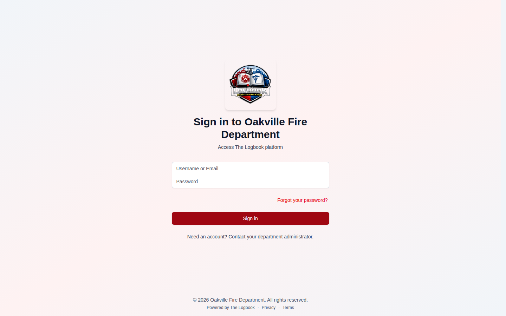
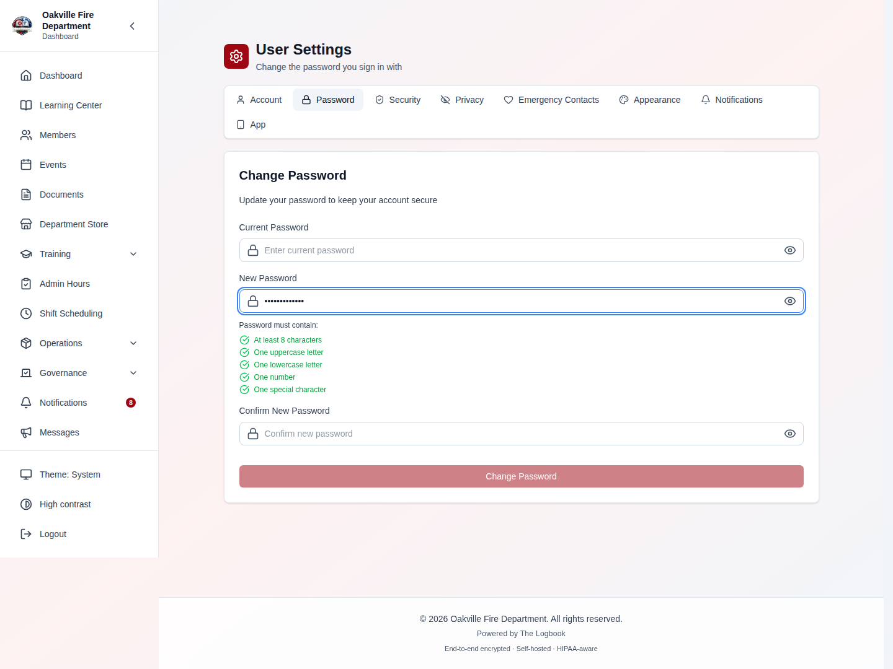
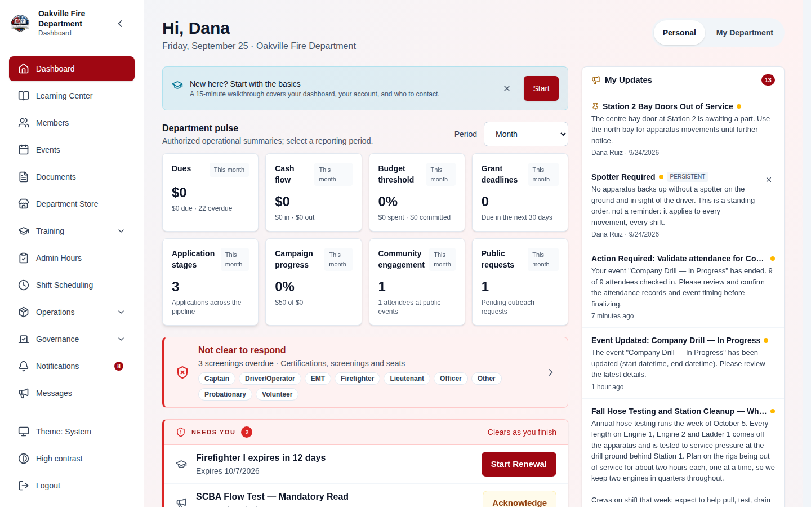
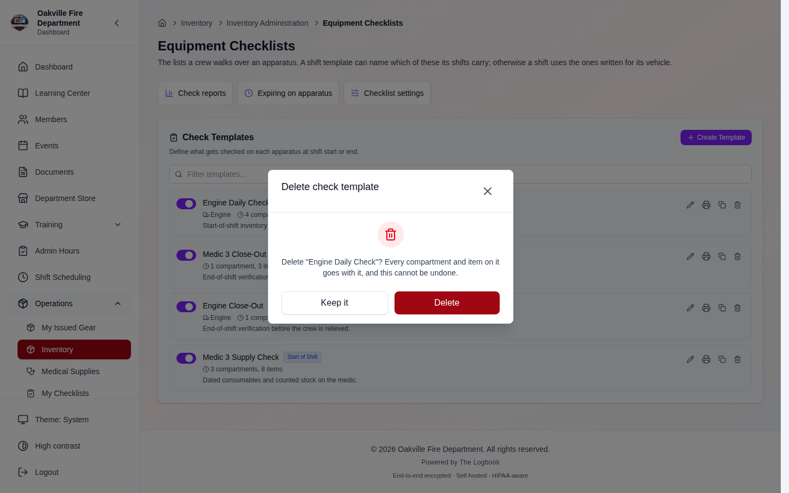
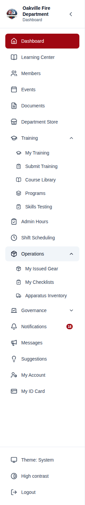
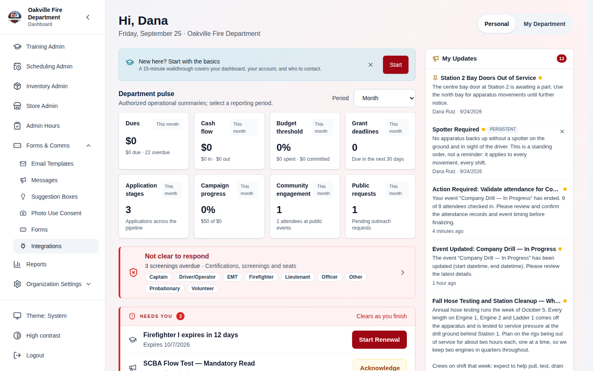
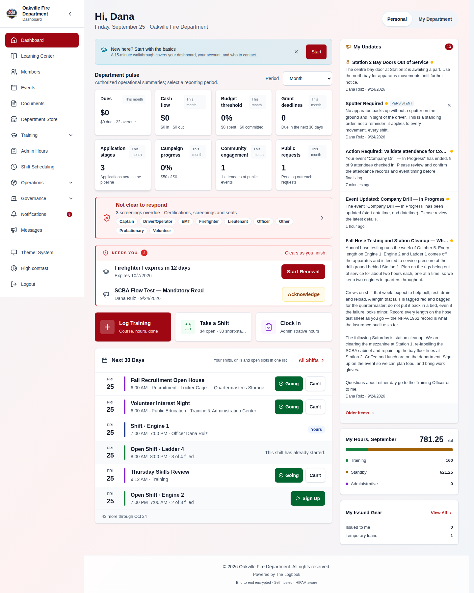
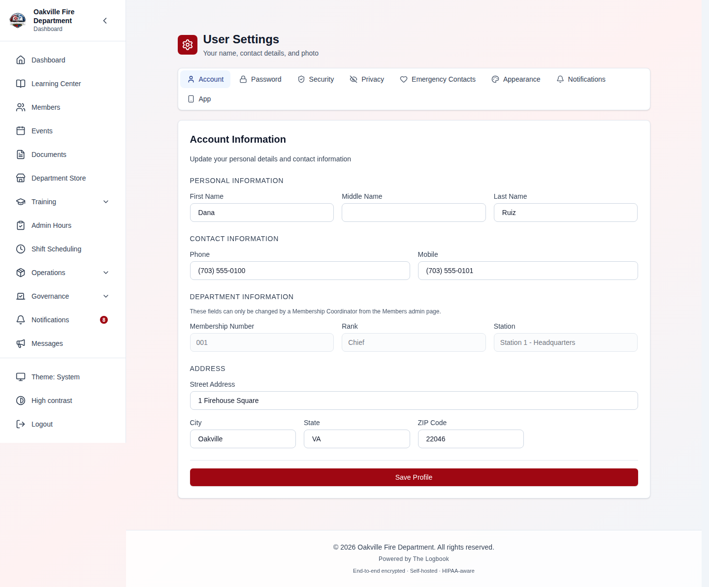
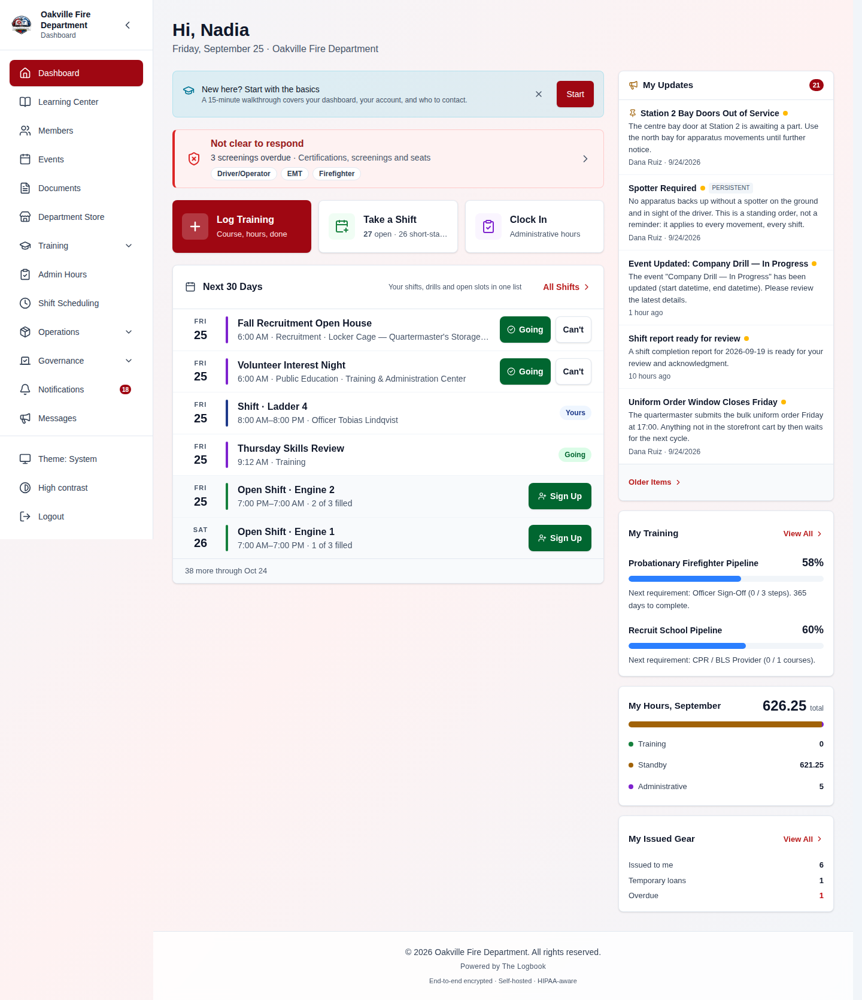
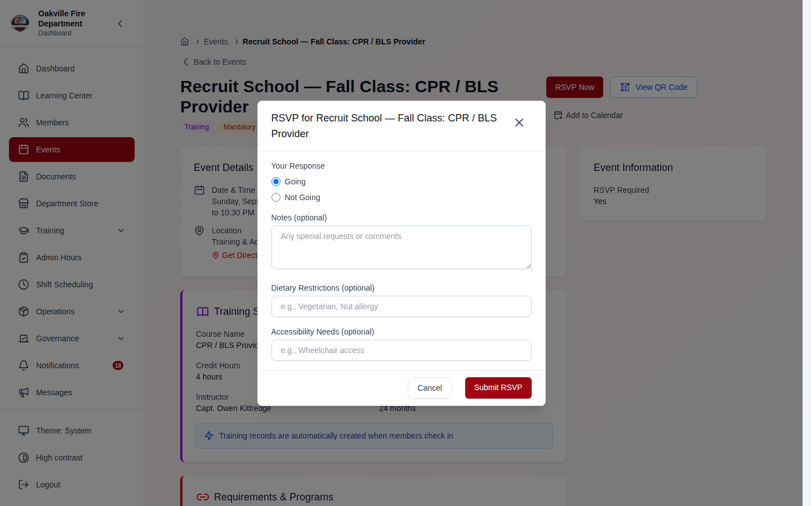

# Getting Started with The Logbook

Welcome to The Logbook, a comprehensive department management platform built for fire departments and emergency services organizations. This guide will walk you through your first login, navigating the interface, and understanding how the system is organized.

## Lesson at a Glance

|                    |                                                                 |
| ------------------ | --------------------------------------------------------------- |
| **Audience**       | Every new member                                                |
| **Permissions**    | An active member account; no officer permissions required       |
| **Prerequisites**  | Your department URL and welcome email or single sign-on account |
| **Essential path** | About 15 minutes                                                |
| **Full guide**     | About 30–45 minutes                                             |
| **Last verified**  | 2026-08-11                                                      |
| **Owner**          | Department IT manager or onboarding coordinator                 |

By the end of the essential path, you can:

- sign in securely and recover from the most common access problems;
- identify the navigation, dashboard, notifications, and account areas;
- update the contact and security information you control; and
- find help when a module or action is unavailable.

> **Practice safely:** You can complete this lesson in your normal account. Do
> not change department-owned fields, acknowledge a real alert merely for
> practice, or share passwords, MFA codes, recovery codes, or calendar links.

### 15-Minute Essential Path

1. [Sign in](#first-login) and, if prompted, [change your temporary password](#changing-your-password).
2. [Orient yourself to the interface](#understanding-the-interface) and [sidebar](#navigation-sidebar).
3. Review [your dashboard](#your-dashboard), including one notification, upcoming shift, or event.
4. Open [Account Settings](#account-settings) and verify your contact and security information.
5. Bookmark [Getting Help](#getting-help) so you know what to do if access is missing.

### Try It: First-Day Readiness Check

- **Starting state:** Sign in with your own member account.
- **Task:** Without following the numbered instructions above, locate your next
  scheduled item, find the page where you would change your password, and
  identify who can help if a module is missing.
- **Success:** You can name the scheduled item (or confirm that none is shown),
  reach the Password tab without changing anything, and explain that an
  administrator controls module availability.
- **Variation:** If you see **Not Authorized**, what should you do instead of
  repeatedly retrying the action?

---

## Table of Contents

1. [First Login](#first-login)
2. [Signing in with Google or Microsoft](#signing-in-with-google-or-microsoft)
3. [Changing Your Password](#changing-your-password)
4. [Understanding the Interface](#understanding-the-interface)
5. [Navigation Sidebar](#navigation-sidebar)
6. [Your Dashboard](#your-dashboard)
7. [Account Settings](#account-settings)
8. [Getting Help](#getting-help)

---

## First Login

When your department administrator creates your account, you will receive a welcome email with your login credentials. Your initial password is temporary and must be changed on first login.

1. Open your browser and navigate to your department's Logbook URL.
2. Enter the **username** and **password** provided to you.
3. Click **Sign In**.

> **Hint:** If you did not receive a welcome email, contact your department's IT Manager or the person who set up the system. They can resend your credentials or reset your password from the admin panel.

---

## Signing in with Google or Microsoft

If your administrator has enabled single sign-on, the login page shows **Google** and/or **Microsoft** buttons under an "Or continue with" divider. These let you sign in with your existing work account instead of typing your Logbook password.

1. On the login page, click **Google** or **Microsoft** under "Or continue with".
2. Complete the sign-in on the provider's page (and approve access if prompted).
3. You are returned to The Logbook and taken to your dashboard.

> **[SCREENSHOT NEEDED]:** _Login page showing the username/password fields, the "Or continue with" divider, and the Google and Microsoft sign-in buttons below it_

> **Hint:** Single sign-on links to an account that already exists. The email on your Google or Microsoft account must match a member account your administrator has already created — signing in this way will not create a new account.

> **Troubleshooting:** If your account is not recognized you are returned to the login page with a message such as "No account matches that Google email. Contact your administrator for access." Other messages cover an account from a domain that is not allowed, an account already linked to a different user, or an unverified email address. In every case, contact your administrator.

---

## Changing Your Password

After your first login, you will be prompted to change your temporary password. Your new password must meet the department's security policy.

1. Enter your **current (temporary) password**.
2. Enter your **new password** twice to confirm.
3. Click **Change Password**.

**Password Requirements:**

- Minimum 8 characters (your department may require more)
- Cannot reuse recent passwords
- Session will time out after a period of inactivity (configured by your department)

> **Troubleshooting:** If your password change fails, ensure it meets all displayed requirements. If you are locked out after too many failed attempts, wait for the lockout period to expire or contact your administrator.

---

## Understanding the Interface

The Logbook uses a sidebar navigation layout. The main areas of the screen are:

1. **Sidebar (Left)** - Navigation menu for all modules
2. **Main Content Area (Center)** - The active page you are working on
3. **Header/Breadcrumb (Top)** - Shows your current location and provides context actions

### Confirmations look like the app, not like the browser _(2026-08-09)_

When The Logbook asks you to confirm something — deleting a record, discarding
unsaved changes, ending a session — it now uses its **own dialog**, styled like
the rest of the app, rather than the grey browser box that used to appear at the
top of the screen.

Two practical differences:

- **The buttons say what they do.** "Keep it" and "Delete", "Stay here" and
  "Discard changes", "Leave it running" and "End session" — rather than OK and
  Cancel, where which one was which depended on reading the question carefully.
- **The message has room to tell you the consequence.** Deactivating an
  administrative-hours category leaves already-logged hours alone; force-ending a
  session moves the entry to pending review rather than throwing it away; leaving
  a checklist keeps your draft. The dialogs say so now.

> **If you had "prevent this page from creating further dialogs" ticked, unstick
> it.** Some browsers offer that checkbox on repeated pop-ups, and until this
> change ticking it made confirmations **silently do nothing** — the app could not
> tell a suppressed dialog from you pressing Cancel. That failure mode is gone,
> but the browser setting may still be remembered from before.

---

## Navigation Sidebar

The sidebar is organized into sections based on your role. Not all sections are visible to every member -- what you see depends on your assigned positions and permissions.

### Member-Facing Section

These links are available to all active members:

Three of them are **groups** that expand when you click them, rather than links
of their own — Training, Operations and Governance:

| Menu Item            | Description                                                                                    |
| -------------------- | ---------------------------------------------------------------------------------------------- |
| **Dashboard**        | Your home page with quick stats and upcoming items                                             |
| **Members**          | Department roster and member profiles                                                          |
| **Events**           | Upcoming and past department events                                                            |
| **Documents**        | Shared files, SOPs, and policies                                                               |
| **Training** ▾       | My Training, Submit Training, Course Library, Programs, Skills Testing                         |
| **Admin Hours**      | Log administrative work hours (if module enabled)                                              |
| **Shift Scheduling** | Duty roster, your shifts, and open shifts                                                      |
| **Operations** ▾     | My Equipment, Inventory, Department Store, Apparatus, Facilities                               |
| **Governance** ▾     | Elections, Minutes, Action Items                                                               |
| **Notifications**    | Your inbox, with an unread count on the item itself                                            |
| **Messages**         | Department messages and announcements                                                          |
| **My Account**       | Your own settings — account, password, security, emergency contacts, appearance, notifications |
| **My ID Card**       | Your digital member ID, with its QR code and barcode                                           |

Which of the grouped items appear depends on the modules your department has
enabled: a department not running elections has no Elections link under
Governance, and so on.

### Administration Section

If you have administrative permissions (officers, IT Manager, etc.), you will see an additional **Administration** section below the member links:

| Menu Item                 | Description                                         |
| ------------------------- | --------------------------------------------------- |
| **Department Setup**      | Guided checklist for initial configuration          |
| **Members Admin**         | Prospective members, pipeline, member management    |
| **Events Admin**          | Create events, view analytics                       |
| **Training Admin**        | Review submissions, manage requirements, compliance |
| **Inventory Admin**       | Manage items, view member equipment                 |
| **Forms**                 | Build and manage custom forms                       |
| **Integrations**          | Connect to external services                        |
| **Reports**               | Generate department reports                         |
| **Organization Settings** | Organization settings, roles, public portal         |

### Personal Section

Below the member-facing pages and above the Administration section, you will find:

- **My Account** (`/account`) - Your personal profile, password, appearance, and notification settings
- **Theme** - Switch between light and dark mode (also available in My Account > Appearance)
- **Sign Out** - Log out of the system

> **Note:** My Account is accessible to all users and is separate from the Organization Settings, which are only visible to administrators.

---

## Your Dashboard

The dashboard is your landing page after login. It provides an at-a-glance view of what matters most:

- **Quick Stats** - Total members, active members, upcoming events, training completion rates
- **Your Hours** - Four cards: **Total Hours** plus the three things it adds up — **Training**, **Standby**, and **Administrative**. Every one of them is **month-to-date**, and each card says what it counts underneath the number
- **Upcoming Events** - The next few scheduled events
- **Upcoming Shifts** - Your next assigned shifts
- **Recent Activity** - Latest actions across the department
- **Notifications** - Unread alerts and reminders with **Clear All** and individual dismiss (X) buttons. Persistent department messages (set by administrators) cannot be dismissed by regular members and show a "Persistent" badge
- **Department Messages** - Organization-wide announcements from administrators. Urgent messages are highlighted (and may also reach you by email/text), some ask you to **Acknowledge** them, and persistent messages remain visible until an admin clears them. Your full message history lives on the **Messages** page (megaphone icon)

> **Hint:** The dashboard is personalized. Officers and administrators see additional summary cards with department-wide metrics. Regular members see their own upcoming items and assignments.

> **Your hours may look lower than before (2026-08-01).** The Total Hours card
> has always said "This month", but only Standby was actually month-scoped —
> Training and Administrative were lifetime totals, so the total was two
> all-time numbers added to one monthly one. All three are now month-to-date,
> which is what the card claims. Your lifetime training hours have not changed
> and are still on **My Training**.
>
> Each card now names its own source: Training counts completed courses,
> Standby counts shifts worked, Administrative counts time clocked in — all
> for the current month, in your department's timezone.

### Notification Cards (2026-03-26)

Dashboard notifications now use expandable cards:

- Click to expand and see full notification details
- Pinned notifications appear first
- Notifications are marked as read when you collapse the card (not when you expand it)
- Each notification shows context-aware action buttons:
  - Shift notifications → "View Shift" button
  - Equipment check reminders → "Start Checklist" button
  - Other notifications → "View Details" or link to relevant page

Clicking a shift notification takes you directly to the scheduling page with the correct tab and shift selected.

> **Screenshot needed:**
> _[Screenshot of the dashboard notifications section showing 2-3 expandable notification cards: one pinned (with pin icon) and expanded showing shift assignment details with a "View Shift" button, and one collapsed showing just the summary text]_

> **Edge case:** If you expand a notification card to read it but navigate away before collapsing, the notification remains unread.

---

## Account Settings

To update your personal settings, click **My Account** in the sidebar. This takes you to `/account`, which is separate from the organization settings.

From here you can:

- Update your **email** and **phone number**
- Set your **notification preferences** (email, urgent text messages, event reminders, training alerts)
- Change your **password**
- Set up **two-factor authentication**
- Make your **privacy choices** — photo use, public roster listing, and SMS notifications _(2026-07-31)_
- **Download your data** — a complete export of everything the system stores about you _(2026-07-31)_
- View your **assigned roles and permissions**

> **Privacy note:** Privacy choices and the data export live on the
> **Security** tab. Nothing under Privacy Choices is required for membership,
> and a choice you have never answered is treated as a "no" — the department
> never reads your silence as permission. Full detail:
> [Privacy & Your Data](./17-privacy-data-rights.md).

---

## Login & Session Edge Cases

| Scenario                                | What Happens                                                                                                                                                                                                            |
| --------------------------------------- | ----------------------------------------------------------------------------------------------------------------------------------------------------------------------------------------------------------------------- |
| Too many failed login attempts          | After 5 failed attempts within 60 seconds, you are locked out for 30 minutes. The lock screen shows a countdown.                                                                                                        |
| Forgot password, requested reset twice  | Only the first request sends an email. Subsequent requests within 30 minutes return a success message but no email is sent — this is an anti-enumeration security measure. Wait 30 minutes or use the first email link. |
| Session expires while working           | Your access token expires after 30 minutes of inactivity. The system automatically refreshes it in the background. If the refresh fails, you are redirected to the login page.                                          |
| Multiple tabs open                      | Keep the number of open tabs reasonable. If your session refreshes simultaneously in multiple tabs, a race condition can log you out of all tabs. Refreshing the page resolves this.                                    |
| Admin changed your role while logged in | The server enforces the new permissions immediately. However, menu items and buttons may not update until you refresh the page.                                                                                         |
| "Too many requests" error               | Rate limiting is active. Wait for the duration shown in the error message before trying again.                                                                                                                          |

---

## Getting Help

- **Forgot your password?** Use the "Forgot Password?" link on the login page. You will receive a reset link by email. If no email arrives, wait 30 minutes and try again (a cooldown prevents duplicate emails).
- **Locked out?** Wait for the lockout period to expire (30 minutes), or ask your IT Manager to unlock your account.
- **Missing a module?** Some modules may be disabled by your department. Contact your administrator to enable them.
- **Permission denied?** If you see a "Not Authorized" message, the action requires a role you have not been assigned. Contact your officer or IT Manager.
- **Something looks wrong?** Your department may have an error monitoring dashboard (Settings > Error Monitor) where administrators can review issues.

---

## Realistic Example: Your First Day on The Logbook

Follow **FF Jake Thompson**, a new member at Oakville Fire Department who just received his login credentials.

### Part 1: First Login

Jake opens the department's Logbook URL on his laptop and enters the email and temporary password from his welcome email. He clicks **Sign In** and the system immediately prompts him: "You must change your password."

Jake sets a new password. The department requires passwords to be at least 12 characters with uppercase, lowercase, a number, and a special character. Jake first tries `password123` — the form rejects it with a clear message: "Password must be at least 12 characters and include an uppercase letter, a lowercase letter, a number, and a special character." He enters a compliant password and clicks **Change Password**.

Because Oakville FD requires multi-factor authentication, Jake is redirected to MFA setup. He scans the displayed QR code with his authenticator app (Google Authenticator, Authy, etc.), enters the 6-digit code from the app, and the system confirms MFA is enabled. Jake is shown a set of recovery codes and told to save them in a safe place.

> **Edge case:** If Jake loses his recovery codes later and is locked out, he must contact his department administrator. An admin can reset MFA from the Members Admin panel, allowing Jake to re-enroll.

### Part 2: Dashboard Orientation

After completing setup, the dashboard loads with personalized widgets:

- **Hours this month** — four figures across the top: total, training, standby and administrative
- **Department Messages** — anything the department has posted, urgent items first
- **Notifications** — the most recent, with an unread count and Clear All
- **My Upcoming Shifts** — his next five shifts with dates, times, and the officer on each
- **Open Shifts** — shifts he can sign up for. **Five at a time**, with a line
  underneath saying how many more there are in the next 30 days; **View
  Schedule** opens the lot
- **Upcoming Events** — events in the next 30 days, each showing his RSVP
- **Recent Activity**, **My ID Card** and **My Equipment** — his last few
  actions, a shortcut to his barcode, and what he has been issued

> **Edge case:** If Jake hasn't been assigned to a platoon yet, the "My Upcoming Shifts" widget shows "No upcoming shifts" and the "Open Shifts" widget may still display shifts he can volunteer for.

### Part 3: Completing Your Profile

Jake navigates to **My Account** in the sidebar. The page is a row of tabs —
**Account**, **Password**, **Security**, **Emergency Contacts**, **Appearance**,
**Notifications** — and he uses two of them:

- **Account** — enters his phone and mobile numbers and his home address.
  Membership number, rank and station are shown here but greyed out: only a
  Membership Coordinator can change those, from the Members admin page.
- **Emergency Contacts** — adds his spouse's name, relationship and number.

**The profile photo is not on this page.** It is uploaded from his **Member
Profile**, reached from the Members directory — which is also where he sees his
department information: rank (Probationary), station (Station 1), and
membership number.

> **Edge case:** Jake tries to upload a 15MB photo. The upload is rejected with a message: "Maximum file size is 5MB." He resizes the image on his phone and re-uploads successfully.

### Part 4: Installing the Mobile App

Jake opens the Logbook URL on his phone's browser (Chrome on Android). A banner appears at the bottom of the screen: "Add The Logbook to Home screen." Jake taps **Install** and the Logbook icon appears on his home screen.

He opens the app from the home screen icon. The app launches in full-screen standalone mode — no browser toolbar, no address bar. It looks and feels like a native app.

> **Edge case:** Jake's colleague uses Firefox on Android. No install banner appears automatically. He must tap the three-dot browser menu and select "Add to Home screen" manually. On iOS, only Safari supports PWA installation.

### Part 5: First Actions

Back on his laptop, Jake takes his first actions in the system:

1. **RSVPs to an upcoming training event** — navigates to Events, finds "Q3 Ladder Operations Drill," clicks RSVP, selects "Going," and sets dietary preference to "None" and accessibility needs to "None"
2. **Checks training program progress** — navigates to Training and sees his Phase 1 requirements listed with completion status (all currently incomplete)
3. **Views assigned gear** — navigates to My Equipment under Inventory and sees his PPE items (helmet, turnout coat, turnout pants, boots, gloves) each with an assigned barcode
4. **Manages notifications** — taps the bell icon in the header, reads a notification about an upcoming drill, and marks it as read by collapsing the card

> **Edge case:** Jake navigates to **Training Admin** in the sidebar. The page loads with a "You don't have permission to view this page" message. Training Admin features are restricted to officers and administrators — regular members access their own training records through the member-facing Training section.

---

**Next:** [Membership Management](./01-membership.md)
