# Getting Started with The Logbook

The Logbook is your department's website for training, shifts, events,
equipment and messages. This guide shows you how to sign in, find your way
around, and set up your own account.

## Lesson at a Glance

|                     |                                                                                                        |
| ------------------- | ------------------------------------------------------------------------------------------------------ |
| **Who this is for** | Every new member                                                                                       |
| **What you need**   | Your department's Logbook web address, and your welcome email or your work Google or Microsoft account |
| **Permissions**     | None. Any active member can do everything in this guide                                                |
| **Essential path**  | About 15 minutes                                                                                       |
| **Full guide**      | About 30–45 minutes                                                                                    |
| **Last verified**   | 2026-10-08                                                                                             |
| **Owner**           | Your department's IT manager or onboarding coordinator                                                 |

When you finish the essential path, you will be able to:

- sign in safely, and fix the most common sign-in problems;
- find the menu, your dashboard, your notifications and your account;
- update your own contact and security details; and
- know who to ask when something is missing.

> **Practice safely.** You can work through this guide in your own account.
> Do not change department information, do not dismiss a real alert just to
> practice, and never share your password, your sign-in codes or your calendar
> link.

**New to these words?** The [Glossary](./GLOSSARY.md) explains the terms this
app uses, such as _position_, _permission_ and _module_, and spells out
abbreviations such as MFA and QR.

### 15-Minute Essential Path

1. [Sign in](#first-login). If asked, [change your temporary password](#changing-your-password).
2. Learn the [parts of the screen](#understanding-the-interface) and the [menu](#navigation-sidebar).
3. Look at [your dashboard](#your-dashboard). Open one notification, shift or event.
4. Open [My Account](#account-settings) and check your phone, email and security settings.
5. Bookmark [Getting Help](#getting-help) so you know what to do if something is missing.

### Try It: First-Day Check

- **Start:** Sign in with your own account.
- **Task:** Without following the steps above, find your next scheduled shift
  or event, find where you would change your password, and work out who to ask
  if a part of the app is missing.
- **You've succeeded when:** you can name your next scheduled item (or see that
  there isn't one), you reach the **Password** tab without changing anything,
  and you know that an administrator decides which parts of the app are turned
  on.
- **Extra question:** If you see **Access Denied**, what should you do instead
  of trying again and again?

---

## Table of Contents

1. [First Login](#first-login)
2. [Signing in with Google or Microsoft](#signing-in-with-google-or-microsoft)
3. [Changing Your Password](#changing-your-password)
4. [Understanding the Interface](#understanding-the-interface)
5. [Navigation Sidebar](#navigation-sidebar)
6. [Your Dashboard](#your-dashboard)
7. [Account Settings](#account-settings)
8. [Sign-In and Session Problems](#sign-in-and-session-problems)
9. [Getting Help](#getting-help)
10. [Realistic Example: Your First Day](#realistic-example-your-first-day-on-the-logbook)
11. [If You Learned an Older Version](#if-you-learned-an-older-version)

---

## First Login

When your administrator creates your account, you get a welcome email with
your username and a temporary password. You must change that password the
first time you sign in.

1. Open your web browser and go to your department's Logbook address.
2. Enter the **username** and **password** from your email.
3. Select **Sign In**.

If you followed a link to a particular page, The Logbook takes you back to that
exact page once you have signed in.

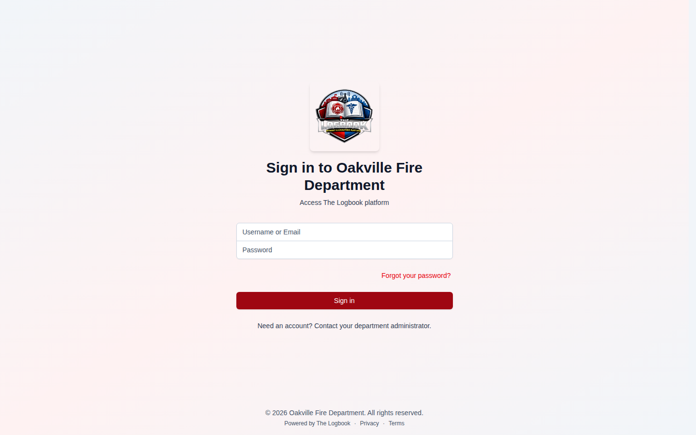

**If you type the wrong password several times,** the **Sign In** button
changes to **Wait 2s** and counts down before you can try again. The wait gets
longer with each wrong try. The message reads, for example: _"Too many failed
attempts. Try again in 4 seconds."_ When the countdown ends, you can try again.

> **Didn't get a welcome email?** Ask your department's IT manager or the
> person who set up The Logbook. They can send it again or reset your
> password.

---

## Signing in with Google or Microsoft

Your department may let you sign in with your work Google or Microsoft account
instead of a Logbook password. This is called _single sign-on_. If it is turned
on, the sign-in page shows **Google** and/or **Microsoft** buttons under
"Or continue with".

1. Select **Google** or **Microsoft**.
2. Sign in on the Google or Microsoft page. Approve access if it asks.
3. You come back to The Logbook and see your dashboard.

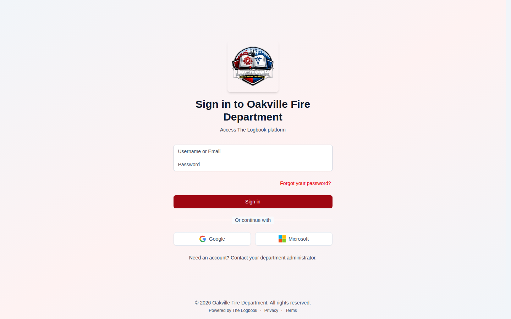

**Your account must already exist.** Signing in with Google or Microsoft does
not create a new Logbook account. The email address on your Google or
Microsoft account must match an account your administrator has already set up.

**Your sign-in code is still needed.** If you have turned on two-step sign-in
(see [Account Settings](#account-settings)), you still enter the 6-digit code
from your phone after Google or Microsoft lets you in. You can use one of your
recovery codes instead. You have 5 minutes to enter it; after that, start
again.

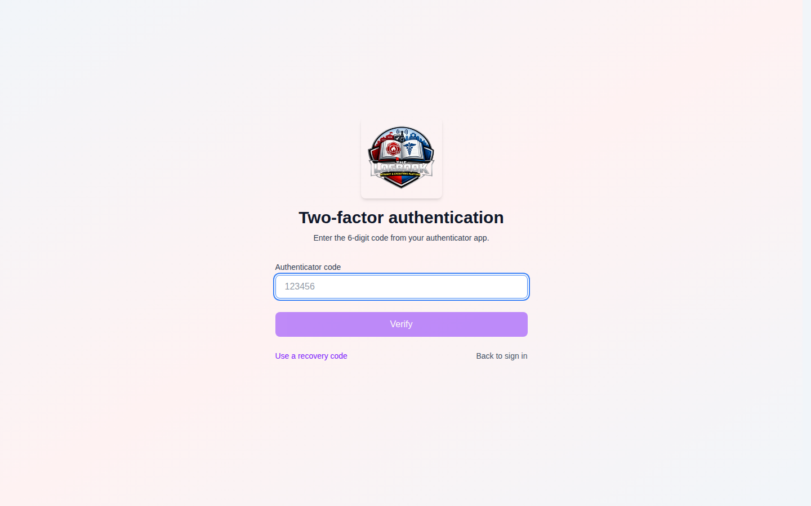

**If it doesn't work,** you come back to the sign-in page with a message such
as _"No account matches that email. Contact your administrator for access."_
Other messages say the email's domain isn't allowed, the account is already
linked to someone else, or the account has no email address. Whatever the
message, contact your administrator.

---

## Changing Your Password

The first time you sign in, The Logbook takes you straight to the
**Password** tab of **My Account**. A yellow box says _"Password change
required"_. You cannot use the rest of the app until you have set a new
password.

1. Enter your **current password** (the temporary one from your email).
2. Enter your **new password** twice.
3. Select **Change Password**.

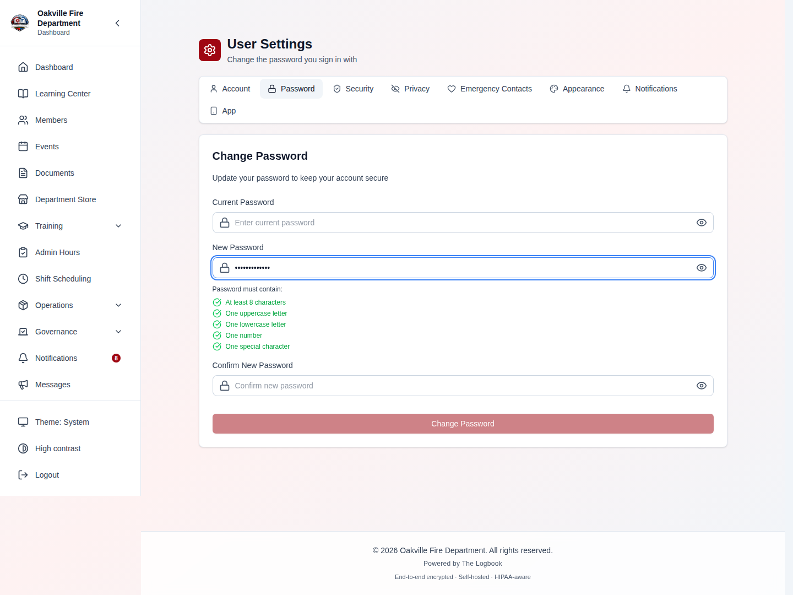

**Password rules.** The form lists every rule and ticks each one as you type.
The **Change Password** button stays greyed out until every rule has a tick.
Your new password needs:

- at least 12 characters (your department may ask for more);
- an uppercase letter, a lowercase letter, a number and a special character
  such as `!` or `#`;
- no runs like `123` or `abc`; and
- no character three times in a row, such as `aaa`.

You also cannot reuse any of your last 12 passwords, and very common
passwords are refused even if they pass every rule.

For example, `password123` fails four rules: it is too short, and it has no
uppercase letter, no special character and a run (`123`). A password such as
`Ladder!Truck-Seven` passes them all.

**Changing your password signs you out everywhere,** on every device,
including the one you are using. The sign-in page then says: _"Your password
was changed, and you have been signed out everywhere. Sign in with your new
password."_ This is expected, not an error. Sign in again with your new
password.

> **Screenshot needed:**
> _[Throwaway demo member (never a real member) at /login, immediately after changing the password on My Account → Password: the sign-in page showing the green notice "Your password was changed, and you have been signed out everywhere. Sign in with your new password." Leave the username and password fields empty.]_

**Your department may also require two-step sign-in.** If it does, The Logbook
takes you to the **Security** tab after you change your password, so you can
set it up. See [Account Settings](#account-settings).

---

## Understanding the Interface

Most screens have three parts:

1. **The menu (left side).** Links to every part of the app you can use.
2. **The main area (centre).** The page you are working on.
3. **The header (top).** Shows where you are, and buttons for that page.

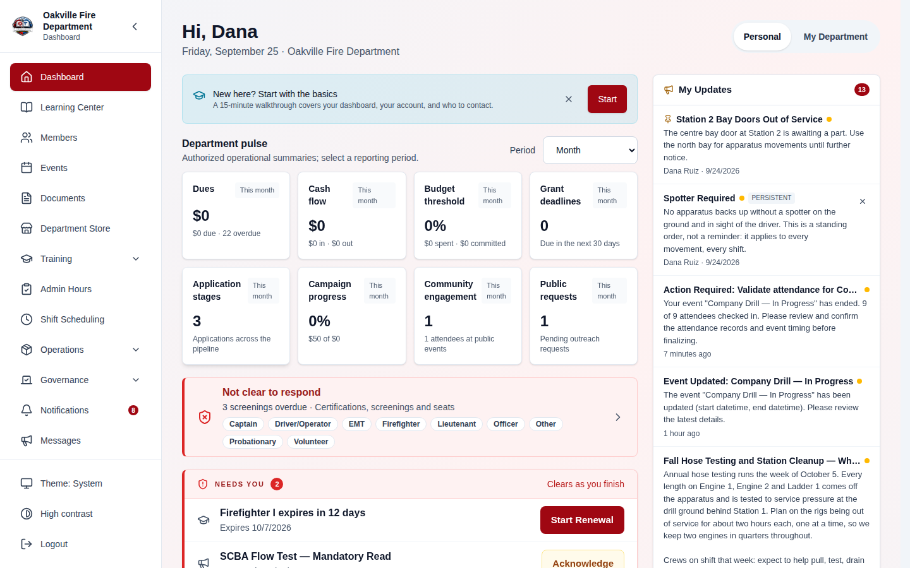

Your department can choose to show the menu as a **bar across the top** of the
screen instead. If the top bar runs out of room, the menu groups that don't
fit move under **More** at its right-hand end.

> **Screenshot needed:**
> _[Administrator (all modules on) at /dashboard, 1280×900 viewport, with Navigation Layout set to Top bar: the More dropdown open at the right-hand end of the top bar, showing at least one overflowed group under its own label with separators between groups. The page must not scroll sideways.]_

### When the app asks "Are you sure?"

Before something that can't easily be undone, such as deleting a record or
leaving a page with unsaved changes, The Logbook asks you to confirm.

- **The buttons say what they do.** For example, **Keep it** and **Delete**,
  or **Stay here** and **Discard changes**. There is no guessing which of
  "OK" and "Cancel" is which.
- **The message tells you what will happen.** For example, it tells you that
  leaving a checklist keeps your draft.

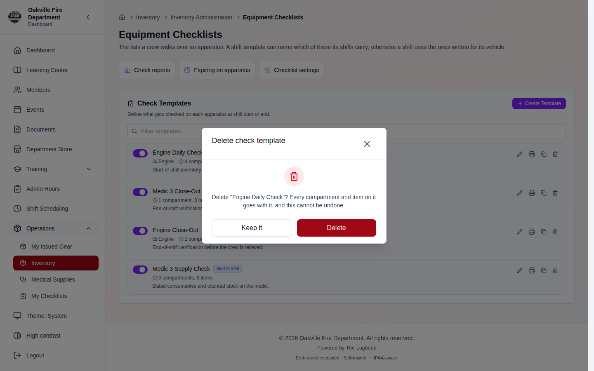

### Closing a pop-up window

A pop-up window (a _dialog_) closes only when you press **Escape** on your
keyboard or select the **X** in its top corner. Clicking or tapping outside it
does nothing.

This protects your work. Most pop-ups here are forms, and The Logbook does not
save a half-finished form. An accidental click beside the window would
otherwise throw away everything you had typed.

A few small pop-ups that hold nothing you could lose do close when you click
outside them: the search box (the _command palette_), the equipment-check
"jump to" lists, the checklist picker and the "before publishing" panel. Menus
and drop-down lists also close when you click away.

---

## Navigation Sidebar

The menu shows only what you are allowed to use. What you see depends on your
_positions_ (jobs such as Training Officer) and the parts of the app your
department has turned on. Two members can see different menus, and that is
normal.

### Links Every Member Sees

**Training**, **Operations** and **Governance** are groups. Select one to open
its list of pages.

| Menu item            | What it's for                                                                                                                                              |
| -------------------- | ---------------------------------------------------------------------------------------------------------------------------------------------------------- |
| **Dashboard**        | Your home page, with your hours and what's coming up                                                                                                       |
| **Learning Center**  | Short how-to tasks: open one, do it, tick it off                                                                                                           |
| **Members**          | The department's member list and member profiles                                                                                                           |
| **Events**           | Upcoming and past department events                                                                                                                        |
| **Documents**        | Shared files, such as SOPs and policies                                                                                                                    |
| **Training** ▾       | My Training, Submit Training, Course Library, Programs, Skills Testing                                                                                     |
| **Admin Hours**      | Log hours spent on department administration (if your department uses it)                                                                                  |
| **Shift Scheduling** | The duty roster, your shifts and open shifts                                                                                                               |
| **Operations** ▾     | My Issued Gear, My Checklists, Apparatus Inventory, and — if your position allows — Inventory, Medical Supplies, Fleet Readiness, Apparatus and Facilities |
| **Governance** ▾     | Org Chart, Elections, Minutes, Action Items, Legal Documents                                                                                               |
| **Notifications**    | Your inbox. The number beside it is how many you haven't read                                                                                              |
| **Messages**         | Department messages and announcements                                                                                                                      |
| **Suggestions**      | Send an idea, question or concern to one of your department's suggestion boxes, and follow up on ones you sent                                             |
| **My Account**       | Your own settings: details, password, security, emergency contacts, appearance and notifications                                                           |
| **My ID Card**       | Your digital member ID card, with its QR code and barcode                                                                                                  |

If your department doesn't use a part of the app, its link is not shown. For
example, a department that doesn't hold elections has no **Elections** link.

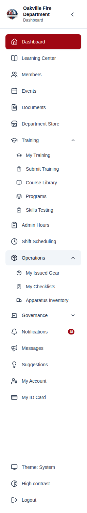

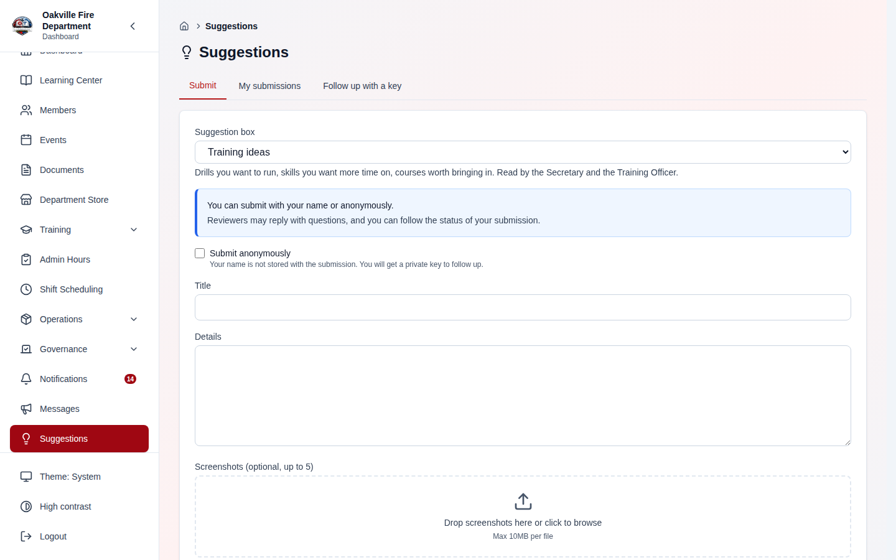

### The Administration Section

Officers and administrators also see an **Administration** section below the
member links. Each person sees only the parts their position allows.

| Menu item                   | What it's for                                                                                                                   |
| --------------------------- | ------------------------------------------------------------------------------------------------------------------------------- |
| **Department Setup**        | A step-by-step checklist for setting up the department                                                                          |
| **Members** ▾               | Prospective (applicants), Pipeline Settings, Member Management, Scan Member ID, Waivers, Medical Screening                      |
| **Manage Events**           | Create events, see event reports and change event settings                                                                      |
| **Training Admin**          | Review training submissions, manage requirements and check who is up to date                                                    |
| **Scheduling Admin**        | Plan shifts, platoons and positions; scheduling reports and settings                                                            |
| **Inventory Admin**         | Manage gear, uniforms and equipment checklists; see what each member has been issued                                            |
| **Store Admin**             | The department store: products, order windows and handing out orders                                                            |
| **Admin Hours**             | Review and approve administrative hours                                                                                         |
| **Forms & Comms** ▾         | Email Templates, Messages, Suggestion Boxes, Photo Use Consent, Forms, Integrations                                             |
| **Reports**                 | Department reports                                                                                                              |
| **Organization Settings** ▾ | Organization (department-wide settings), Role Management (positions and their permissions), Public Portal (your public website) |

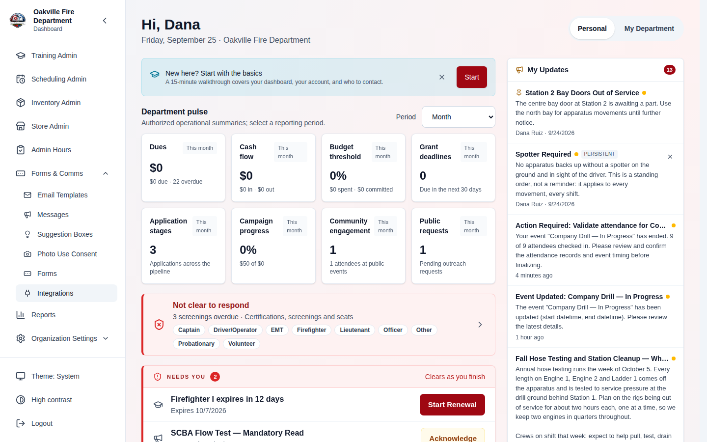

### Your Own Links

Between the member links and the Administration section you will find:

- **My Account**: your own details, password, appearance and notification
  settings;
- **Theme**: switch between light and dark (also under **My Account →
  Appearance**); and
- **Sign Out**.

**My Account** is about you. **Organization Settings** is about the whole
department, and only administrators see it.

---

## Your Dashboard

The dashboard is the first page you see after signing in. It has two tabs:

- **Personal**: your own gear, hours, training, shifts and anything waiting on
  you. Everyone has this tab.
- **My Department**: department-wide totals and links for running the
  department. Only officers and administrators have this tab.

The two tabs never mix. Nothing on **Personal** is someone else's, and nothing
on **My Department** is shown as yours.

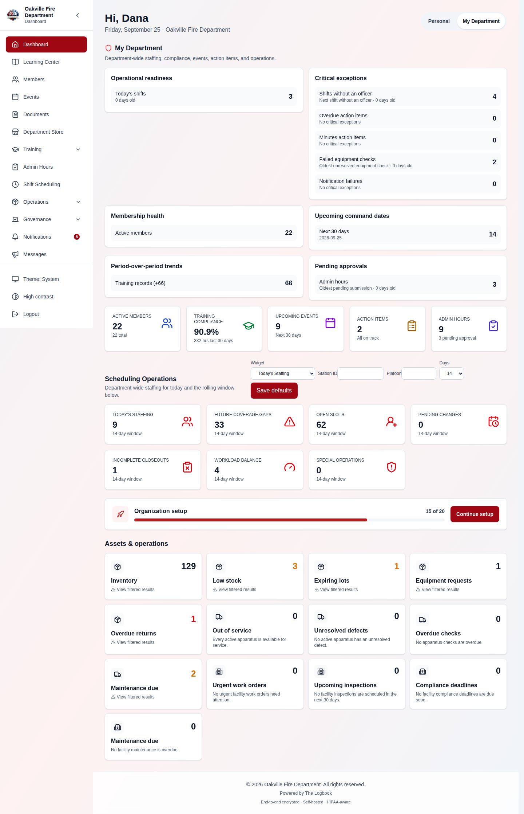

### What's on the dashboard

Which of these you see depends on your positions and on the parts of the app
your department uses.

- **Your hours.** Four cards: **Total Hours**, and the three things it adds up:
  **Training**, **Standby** and **Administrative**. All four count from the
  first of this month, in your department's time zone. Under each number, the
  card says what it counts. Your all-time training hours are on **My
  Training**.
- **Quick stats.** Total and active members, upcoming events and training
  compliance (see below).
- **Upcoming events** and **upcoming shifts.** What's next for you.
- **Next 30 days.** Upcoming shifts, including open ones. If you are allowed
  to take an open shift, it shows **Sign Up**. If you aren't, it shows **Not
  eligible** straight away, so you don't find out only after you tap. See
  [Scheduling](./03-scheduling.md).
- **Recent activity.** The latest things done across the department.
- **Needs you.** Anything waiting for you to act. For example, a department
  message that asks you to confirm you have read it has an **Acknowledge**
  button here. An officer who must sign off on an applicant sees _"(name) is
  waiting on your sign-off"_ with a **Review** button.
- **My Updates.** Department messages and your notifications in one list, with
  a count of unread items. Pinned messages come first, then _persistent_
  messages (ones that stay until an officer removes them), then the newest.
  Five show at a time; **Older Items** opens your full inbox. A message you
  have read disappears the next time the page loads, unless it is persistent.
  Every department message is also emailed to you, and urgent ones are texted
  too. Your full message history is on the **Messages** page.
- **Scheduling Operations** (officers who manage scheduling, on the **My
  Department** tab). Seven tiles: Today's Staffing, Future Coverage Gaps, Open
  Slots, Pending Changes, Incomplete Closeouts, Workload Balance and Special
  Operations. Select a tile to open the schedule already filtered to what it
  counted.

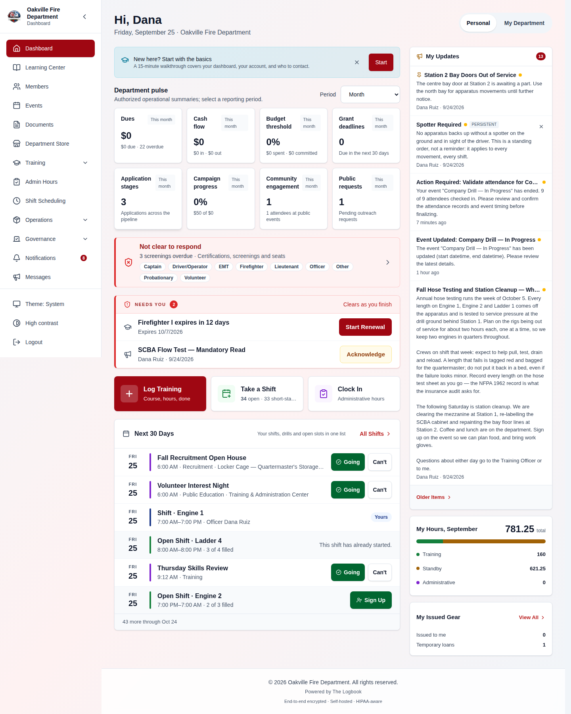

> **Screenshot needed:**
> _[Fire Chief (or another officer holding a role named on a Multi-Signer Approval stage, with an applicant waiting at that stage) at /dashboard: clip to the Needs you panel showing "<Name> is waiting on your sign-off" with the stage name beneath and the Review button. Use a demo applicant, not a real person.]_

> **Why does Training Compliance say 0%?** This card shows how many active
> members have finished **every** active training requirement. It does not
> show how many requirements have been met, and it has nothing to do with
> hours. If your department has 36 requirements, the card shows 0% until
> someone has finished all 36, even if members have logged hundreds of hours.
> Someone missing one requirement counts the same as someone missing all of
> them.
>
> Read it as "how many people are completely finished". To see progress
> requirement by requirement, officers can use the compliance matrix in
> **Training Admin**.

### Notification Cards

Each notification is a card. Select a card to open it and read the details.

- **A card counts as read when you close it again,** not when you open it. If
  you open a card and then leave the page without closing it, it stays unread.
  Following the link on a card also marks it read.
- **Pinned cards stay at the top.** An open card has a **Pin** button
  (**Unpin** once it's pinned).
- **Most cards have a button that takes you to the right place:** **View
  Shift**, **View Event**, **View Training**, **Review Swap** or **View
  Details**. A shift reminder that arrives while its equipment check is open
  also has **Start Checklist**. A request to report on a shift you worked also
  has **File Report**.
- **Some cards have no button.** They only have details to read, and **Pin**.
- **Several unread notifications of the same kind are grouped** into one stack,
  for example "3 attendance validations". Select the stack to see each one, or
  select **Mark all read**.

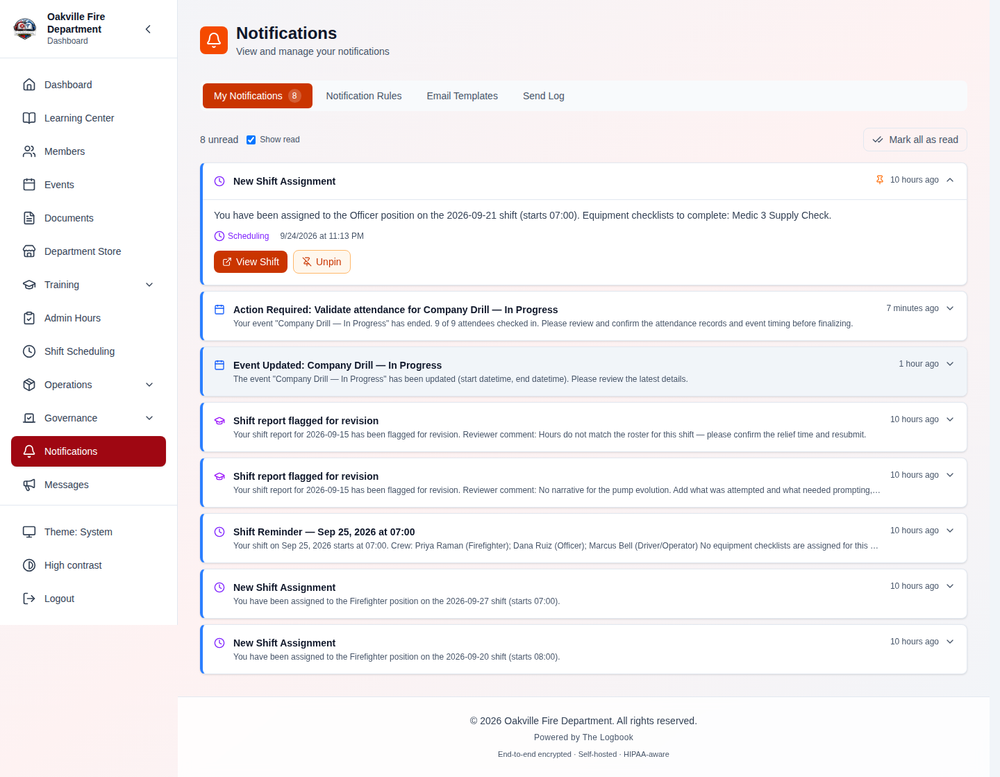

**A notification that asks you to do something goes away once it's done.** For
example, an officer gets a "validate attendance" notification when an event
ends. Once that officer finalizes the event's attendance, the notification for
that event is archived. Notifications about anything else stay.

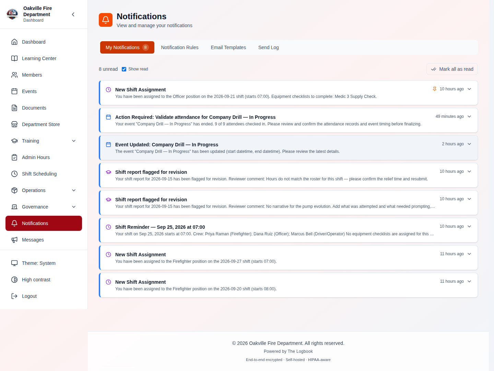

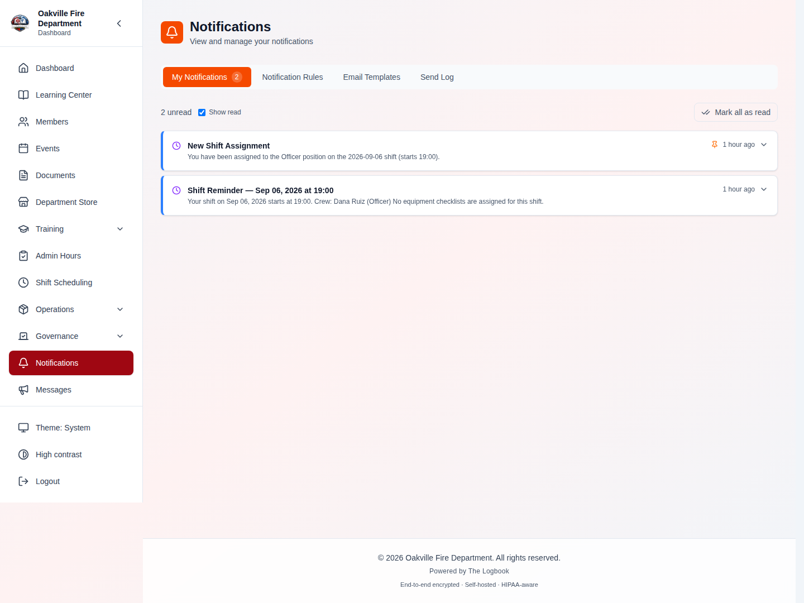

> **Screenshot needed:**
> _[Admin at /notifications?tab=inbox, with everything unpinned first: at least two unread notifications of one category (for example two attendance-validation prompts from ended events) collapsed into a stack showing "N attendance validations", "Latest: …", the "N unread" badge and Mark all read, beside ordinary single cards. Then a second capture of the same stack expanded to its individual cards. Do not press Mark all read.]_

---

## Account Settings

To change your own settings, select **My Account** in the menu. The page has
six tabs: **Account**, **Password**, **Security**, **Emergency Contacts**,
**Appearance** and **Notifications**. Here you can:

- update your **email** and **phone numbers**;
- choose which **notifications** you get by email and text message;
- change your **password**;
- turn on **two-step sign-in**, also called multi-factor authentication or
  MFA (on the **Security** tab);
- make your **privacy choices**: whether your photo may be used, whether you
  appear on the public member list, and whether you get text messages;
- **download your data**: a copy of everything The Logbook stores about you;
- see your **positions and permissions**; and
- choose the two tabs on your **phone's bottom bar** (**Appearance → Phone
  navigation bar**). Your choice follows you to every device you sign in on.

Some details on the **Account** tab, such as your membership number, rank and
station, are greyed out. Only an officer can change those.

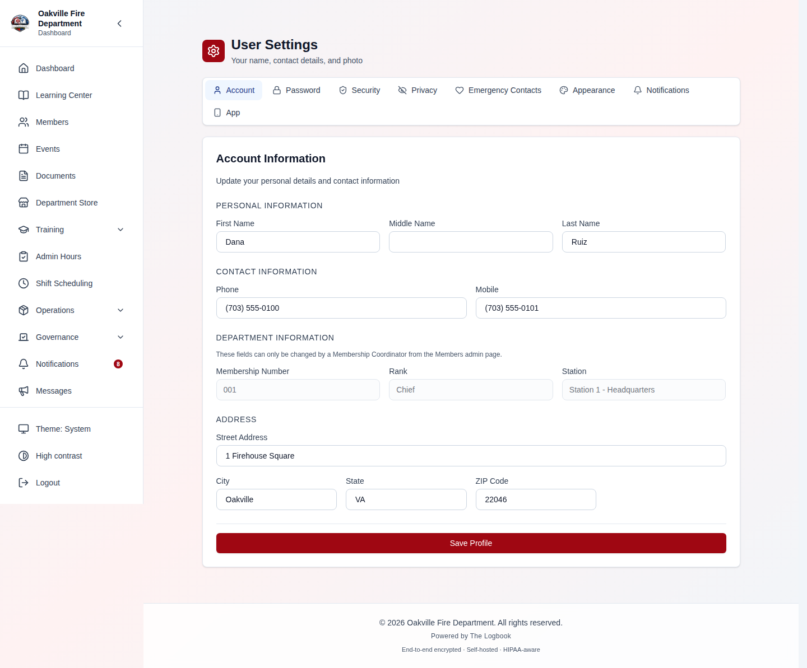

**Phone numbers.** Use digits, with spaces, dashes, dots or brackets if you
like, and a `+` at the start for an international number. A number needs 7 to
15 digits. You can add an extension, such as `703-555-0101 ext 4`. Words such
as "call me" are refused, with a message showing what to enter. A number saved
before these rules were added is kept as it is until you change it.

**Two-step sign-in (MFA).** After your password, you also enter a 6-digit code
from an app on your phone, such as Google Authenticator or Authy. This keeps
your account safe even if someone learns your password. When you turn it on,
you get a set of **recovery codes**. Each one works once, if you ever lose
your phone. Save them somewhere safe and private.

> **Screenshot needed:**
> _[A throwaway demo member created for the capture (never a real member) at /account?tab=security, right after Verify & enable: the "Save your recovery codes" panel with the code grid, Copy codes and Done. The codes are secrets: use a disposable account and regenerate or blur them afterwards; do not capture the QR code or the manual key.]_

> **Your privacy choices.** Privacy choices and the data download are on the
> **Security** tab. None of them is required to be a member. If you have never
> answered a question, The Logbook treats it as "no". It never takes silence
> as permission. More detail: [Privacy & Your Data](./17-privacy-data-rights.md).

---

## Sign-In and Session Problems

| What happened                                        | What it means, and what to do                                                                                                                                                                                                                                                                                                                                  |
| ---------------------------------------------------- | -------------------------------------------------------------------------------------------------------------------------------------------------------------------------------------------------------------------------------------------------------------------------------------------------------------------------------------------------------------- |
| I typed the wrong password several times             | After 5 wrong tries in a row, your account is locked for 15 minutes. (Your department can change both numbers.) While it is locked, the message still says only _"Incorrect username or password"_, even when the password is right. Wait 15 minutes, use **Forgot Password?**, or ask your IT manager to reset your password, which also unlocks the account. |
| I asked for a password reset twice                   | Only the first request sends an email. For the next 30 minutes, more requests show the same "check your email" message but send nothing. Use the link in the first email, or wait 30 minutes.                                                                                                                                                                  |
| A warning says my session will expire in 60 seconds  | You haven't used The Logbook for a while (15 minutes, unless your department set a different time). Move the mouse or press a key to stay signed in. If you don't, you are signed out and the sign-in page says _"You were signed out after a period of inactivity. Sign in again."_                                                                           |
| I was sent to the sign-in page while working         | The Logbook renews your sign-in quietly in the background while you work. If that renewal fails, you are sent to the sign-in page. Sign in again. Anything you had not saved is lost.                                                                                                                                                                          |
| "Sign-out could not be confirmed"                    | The Logbook tried to sign you out three times and could not confirm it. You may still be signed in on this browser. Close every window of the browser, especially on a shared computer. **Try signing out again** removes the notice once sign-out works.                                                                                                      |
| I have The Logbook open in several tabs              | This is fine. You stay signed in on all of them.                                                                                                                                                                                                                                                                                                               |
| An officer changed my position while I was signed in | Your new permissions apply straight away. The menu and buttons may not change until you reload the page.                                                                                                                                                                                                                                                       |
| "Too many requests"                                  | You did the same thing many times very quickly. Wait for the time shown in the message, then try again.                                                                                                                                                                                                                                                        |

---

## Getting Help

- **Forgot your password?** Select **Forgot Password?** on the sign-in page.
  You get an email with a reset link that works for **30 minutes**. When the
  reset is done, the page says **Password Changed**; select **Sign In Now**.
  The page shows **No Reset Link Was Sent** instead in two cases: your
  department signs in through Google or Microsoft (reset your password with
  them), or your department has turned off reset emails (ask an administrator
  to reset it).
- **Locked out?** If your correct password keeps being refused, your account
  is probably locked. The message won't say so. See the first row of
  [Sign-In and Session Problems](#sign-in-and-session-problems).
- **Something missing from the menu?** Your department may not use that part
  of the app, or your position may not include it. Ask your administrator.
- **"Access Denied"?** The page says _"You do not have the required
  permissions to access this page."_ Your position doesn't include this page.
  Select **Return to Dashboard**. If you think you need it, ask your officer or
  IT manager. Trying again won't help.
- **Something looks wrong?** Tell your IT manager what you were doing and what
  you saw. Administrators can see the app's error reports under **Settings →
  Error Monitor**.

---

## Realistic Example: Your First Day on The Logbook

Follow **FF Jake Thompson**, a new member at Oakville Fire Department, on the
day he gets his welcome email.

### Part 1: First Login

Jake opens the Logbook address on his laptop. He enters the username and
temporary password from his email and selects **Sign In**. The Logbook opens
the **Password** tab of **My Account**, with a yellow box: _"Password change
required"_.

He types `password123` as his new password. The rules list ticks only some
rules: it is too short, and it has no uppercase letter, no special character
and a run of `123`. The **Change Password** button stays greyed out. He tries
`Ladder!Truck-Seven` instead, every rule gets a tick, and he selects **Change
Password**.

The Logbook signs him out, as it does after every password change. He signs in
again with his new password.

Oakville requires two-step sign-in, so The Logbook opens the **Security** tab.
Jake scans the QR code with the authenticator app on his phone, types the
6-digit code the app shows, and turns it on. He saves his recovery codes in his
password manager.

> **What if Jake loses his phone and his recovery codes?** He can't sign in by
> himself. He contacts his administrator, who can reset his two-step sign-in so
> he can set it up again.

### Part 2: Dashboard Orientation

Jake's **Personal** dashboard shows:

- **Hours this month**: total, training, standby and administrative;
- **My Updates**: department messages and his notifications, pinned ones first;
- **My Upcoming Shifts**: his next five shifts, with dates, times and the
  officer on each;
- **Open Shifts**: five shifts he can sign up for, with a line saying how many
  more there are in the next 30 days. **View Schedule** shows them all;
- **Upcoming Events**: events in the next 30 days, each with his RSVP; and
- **Recent Activity**, **My ID Card** and **My Issued Gear**.

> **What if Jake hasn't been given a platoon yet?** **My Upcoming Shifts**
> says "No upcoming shifts". **Open Shifts** can still list shifts he can
> volunteer for.

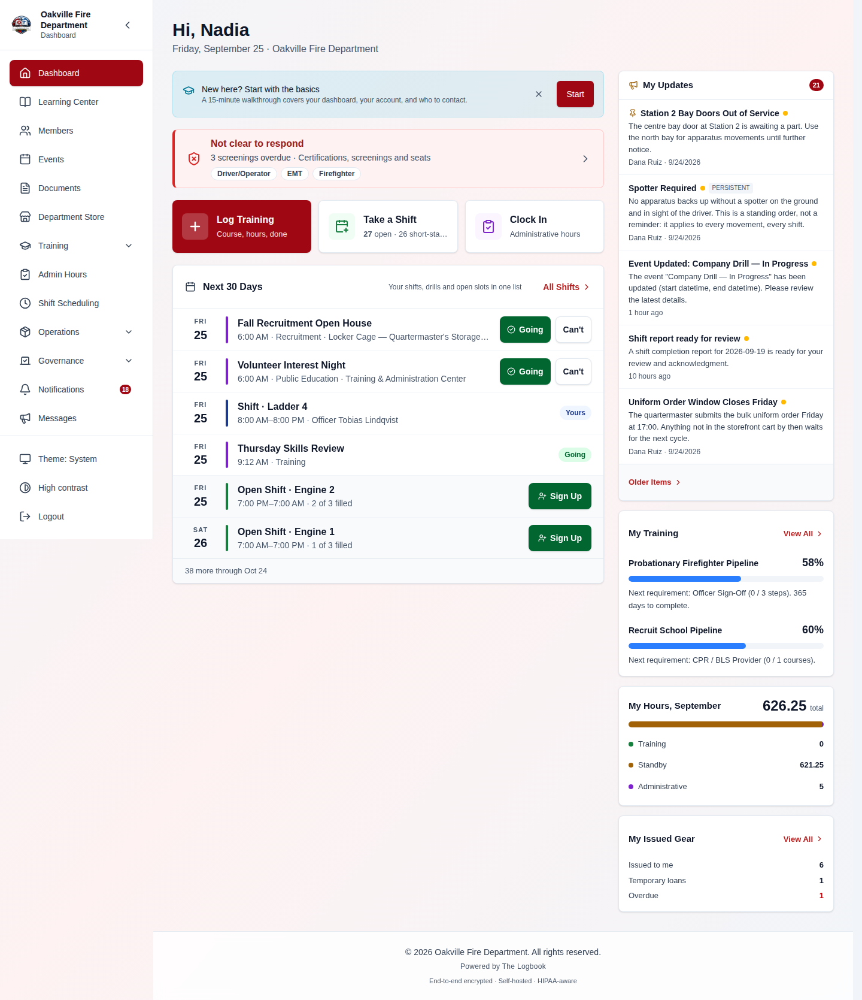

### Part 3: Completing His Profile

Jake opens **My Account** and uses two tabs:

- **Account**: he enters his phone numbers and home address. His membership
  number, rank and station are greyed out; only a membership coordinator can
  change them.
- **Emergency Contacts**: he adds his spouse's name, relationship and phone
  number.

**His profile photo is not on this page.** He adds it on his **Member
Profile**, which he reaches from the **Members** list. That page also shows
his rank (Probationary), station (Station 1) and membership number.

> **What if the photo is too big?** Jake picks a 15 MB photo. The Logbook
> refuses it: _"Image must be under 5MB."_ He makes the photo smaller on his
> phone and uploads it again.

### Part 4: Adding The Logbook to His Phone

Jake opens the Logbook address in Chrome on his Android phone. A banner offers
to add The Logbook to his home screen. He taps **Install**, and a Logbook icon
appears on his home screen. When he opens it, The Logbook fills the whole
screen, like any other app.

> **Different phones work differently.** Firefox on Android shows no banner:
> open the browser's menu (three dots) and choose **Add to Home screen**. On an
> iPhone or iPad, use Safari. See [Mobile & PWA Usage](./10-mobile-pwa.md) for
> the steps on each phone.

### Part 5: First Actions

Back on his laptop, Jake:

1. **Signs up for a drill.** In **Events**, he finds "Q3 Ladder Operations
   Drill", selects **RSVP**, chooses **Going**, and enters "None" for dietary
   and accessibility needs.
2. **Checks his training.** In **Training**, he sees his Phase 1 requirements.
   None are finished yet.
3. **Checks his gear.** In **Operations → My Issued Gear**, he sees his helmet,
   turnout coat, turnout pants, boots and gloves, each with its own barcode.
4. **Reads a notification.** He opens a notification about an upcoming drill,
   then closes it, which marks it read.

> **What if Jake opens Training Admin?** He sees **Access Denied**: _"You do
> not have the required permissions to access this page."_ Training Admin is
> for training officers. Jake's own training records are under **Training** in
> the member links.

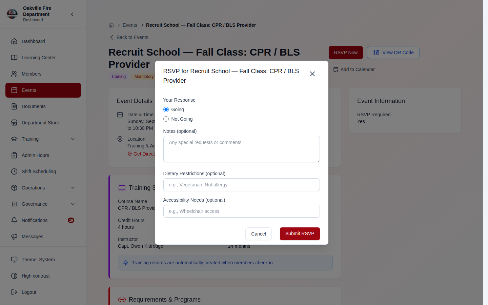

---

## If You Learned an Older Version

If you are following older notes, a recording or an SOP, some things have
moved or been renamed.

| Looking for                                                    | It is now                                                                               |
| -------------------------------------------------------------- | --------------------------------------------------------------------------------------- |
| Equipment checks (a tab on the Scheduling page)                | **Operations → My Checklists** for members; **Fleet Readiness** next to it for officers |
| Scheduling settings, templates, patterns, reports and platoons | **Administration → Scheduling Admin**                                                   |
| Gear Admin                                                     | **Inventory Admin** (the same place, renamed)                                           |
| The Department Store console                                   | Inside **Inventory Admin**                                                              |
| Dashboard tabs **My Department** and **Organization**          | **Personal** and **My Department**                                                      |
| **User Settings**                                              | **My Account**                                                                          |
| The **Settings** tab on a phone's bottom bar                   | Opens **My Account**, not the department's settings                                     |

> **⚠️ Old links open the wrong page, not an error.** Fourteen old addresses
> now go to the dashboard, or to the wrong tab of Scheduling. A bookmark or a
> link in an SOP can look as if it worked while showing you the wrong page. If
> a link lands somewhere unexpected, find the page from the menu and update
> your bookmark. Administrators: the full list of old and new addresses is in
> the upgrade notes for
> [equipment checklists](../UPGRADING.md#equipment-checklists-moved-to-inventory-eight-addresses-and-three-permissions-renamed-2026-08-31)
> and
> [scheduling administration](../UPGRADING.md#scheduling-administration-moved-and-six-addresses-stop-working-2026-09-05).

Other changes you may notice:

- **Members no longer see Reports or the Apparatus pages by default.** This is
  intended. An administrator can give either back to a position. (The simpler
  **Apparatus Basic** page, shown when the Apparatus part of the app is off,
  is still open to everyone.) Administrators: see the
  [upgrade note](../UPGRADING.md#six-upgrade-steps-take-permissions-away-2026-09-05).
- **On a phone, the middle of the bottom bar is an Add button** for the things
  members log most often. You choose the two other tabs on **My Account →
  Appearance**; see
  [Mobile & PWA Usage](./10-mobile-pwa.md#choose-your-own-bottom-bar-tabs-2026-10-02).
- **On a phone, the menu shows when there is more below it,** with a fade at
  the bottom and a **More** arrow you can tap.
- **Times are your department's.** Emails, PDFs and spreadsheet downloads show
  times in your department's time zone. Anything that counts days, such as a
  certificate expiring or "today" on the dashboard, uses your department's
  date.
- **Hours are this month only.** The training and administrative hours on the
  dashboard used to be all-time totals. All four hour cards now count this
  month only, so the numbers may look lower. Your all-time training hours are
  still on **My Training**.
- **On a tablet,** lists of cards show two columns, and edit and delete
  buttons are always visible because a touch screen can't hover.

---

**Next:** [Membership Management](./01-membership.md)
