# Membership Management

The Membership module is the foundation of The Logbook. It manages your department's roster, member profiles, prospective member pipelines, membership tiers, and the full member lifecycle from application through retirement.

---

## Table of Contents

1. [Member Directory](#member-directory)
2. [Member Profiles](#member-profiles)
3. [Adding Members](#adding-members)
4. [Importing Members from CSV](#importing-members-from-csv)
5. [Member Admin Edit](#member-admin-edit)
6. [Member Audit History](#member-audit-history)
7. [Deleting Members](#deleting-members)
8. [Prospective Members Pipeline](#prospective-members-pipeline)
9. [Member Status Management](#member-status-management)
10. [Leave of Absence](#leave-of-absence)
11. [Waiver Management](#waiver-management)
12. [Rank Validation](#rank-validation)
13. [Membership Tiers](#membership-tiers)
14. [Member Lifecycle Management](#member-lifecycle-management)
15. [Troubleshooting](#troubleshooting)

---

## Member Directory

Navigate to **Members** in the sidebar to view your department roster.

The directory shows all active members with their name, rank, status, and contact information. You can:

- **Search** by name using the search bar
- **Filter** by status (Active, Inactive, On Leave, Retired)
- **Click** any member to view their full profile

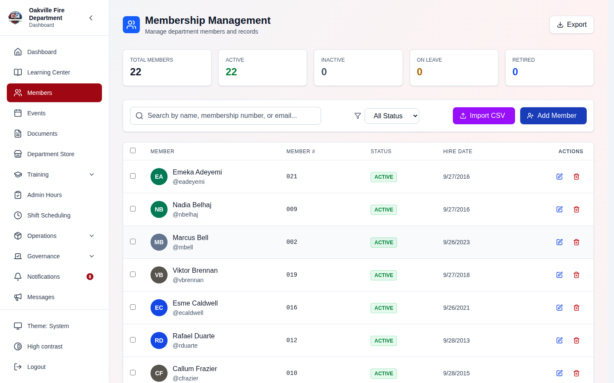

**Member Statuses:**

| Status                    | Description                         |
| ------------------------- | ----------------------------------- |
| **Active**                | Currently serving member            |
| **Inactive**              | Temporarily not participating       |
| **Suspended**             | Account suspended by administration |
| **Probationary**          | New member in probationary period   |
| **Retired**               | Retired from active service         |
| **Dropped (Voluntary)**   | Member who voluntarily left         |
| **Dropped (Involuntary)** | Member removed from the department  |
| **Archived**              | Fully processed departed member     |

### Printing Member Badges

Select members in the directory (the row checkboxes), then click **Print Badges** on the selection bar to open the shared label print page for those members. Choose a label size — any sticker/thermal printer (Dymo, Rollo, or a custom size) — and download a PDF or print. The badge barcode encodes the member's **membership number**. The chosen printer is remembered for your role, separately from the inventory/apparatus printers.

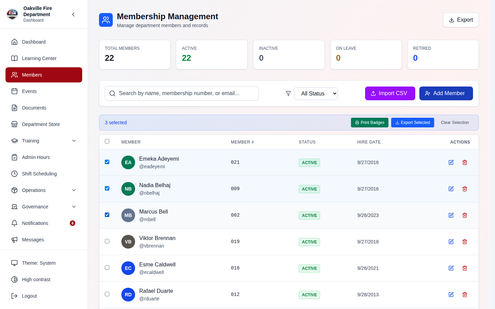

---

## Member Profiles

Click on any member in the directory to view their profile. The profile page includes:

**Left Column:**

- **Basic Information** - Name, rank, membership number, hire date, station
- **Profile Photo** - Member photo with upload/change capability
- **Compliance Summary** - Green/yellow/red indicator showing training compliance status, requirements met/total, hours this year, active certifications, and expiring certifications
- **Training Records** - Recent training completions and course history
- **Assigned Inventory** - Equipment currently assigned to the member

**Right Column:**

- **Contact Information** - Email, phone, mobile, address (editable by the member or officers). Which fields other members see depends on your department's [contact info visibility](./08-admin-reports.md#contact-info-visibility) setting; home address is never shown to ordinary members
- **Emergency Contacts** - Emergency contact list. **Visible only to leadership (`members.manage`) and to the member themselves** — the section is hidden entirely for everyone else, and no setting publishes it. Date of birth is restricted the same way
- **Roles & Permissions** - Assigned positions and their permissions
- **Quick Stats** - Training count, total hours, assigned equipment count
- **Leave of Absence** - Any active leave periods (shown if applicable)

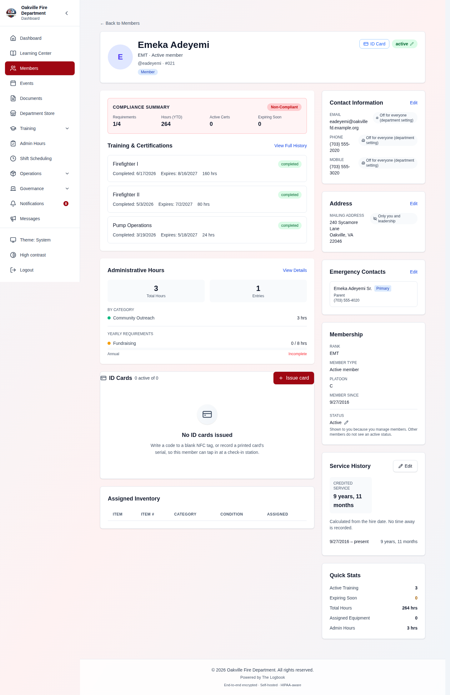

### Profile Photo Upload

Members and officers can upload a profile photo:

1. Click the **photo area** on the member's profile (or the camera icon).
2. Select an image file (JPEG, PNG, or WebP).
3. Preview and crop the image.
4. Click **Upload** to save.

> **Screenshot placeholder:**
> _[Screenshot of the photo upload modal showing the image preview with crop controls and Upload/Cancel buttons]_

### Member Self-Edit

Members can edit their own limited profile fields directly from their profile page:

- Phone number, mobile number
- Personal email address
- Home address
- Emergency contacts
- Notification preferences

Click the **Edit** button (pencil icon) on the relevant section to make changes. Officers with `members.manage` permission can edit all fields for any member.

> **Hint:** Members can edit their own contact information and notification preferences. Officers with the `members.manage` permission can edit any member's profile using the full Admin Edit page.

---

## Adding Members

**Required Permission:** `members.create`

Navigate to **Administration > Members > Member Management**, then click the **Add Member** tab.

1. Fill in the required fields:
   - **First Name** and **Last Name**
   - **Email** (must be unique within the department)
   - **Username** (auto-generated or custom)
2. Optionally set:
   - Rank, station, membership number
   - Hire date
   - Assigned roles/positions
3. Check **Send Welcome Email** to automatically email the new member their login credentials.
4. Click **Create Member**.

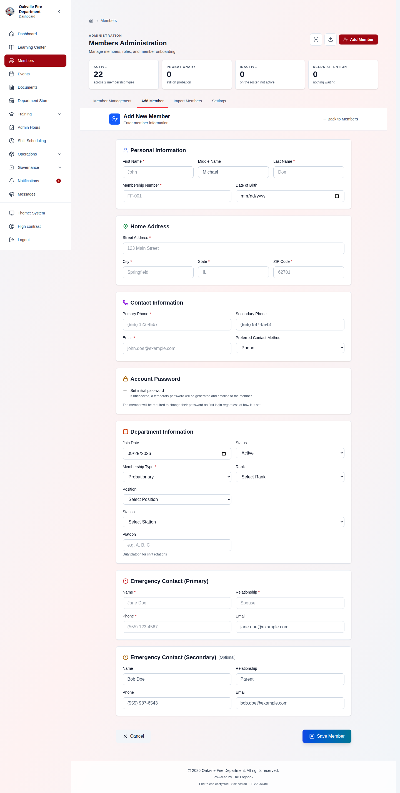

> **Hint:** The system generates a temporary password for the new member. If you uncheck "Send Welcome Email," you will need to share the credentials manually. The member will be prompted to change their password on first login.

**Edge Cases:**

- If the email address is already in use, you will see an error. Each member must have a unique email within the department.
- Badge numbers and membership numbers must also be unique if provided.

---

## Importing Members from CSV

**Required Permission:** `members.create`

For bulk onboarding, you can import members from a CSV file:

1. Navigate to **Administration > Members > Import Members**.
2. Download the **CSV template** to see the required column format.
3. Fill in the spreadsheet with your member data. **Delete the example row** —
   see the note below.
4. Upload the completed CSV file. Every row is checked immediately.
5. Review the results: how many rows will import, which will not, and why.
6. Decide whether to **send welcome emails** (off by default).
7. Confirm the import, watching the row counter. You can **Stop** part-way.
8. If any rows were rejected, download the **error report** and re-upload the
   corrected file.

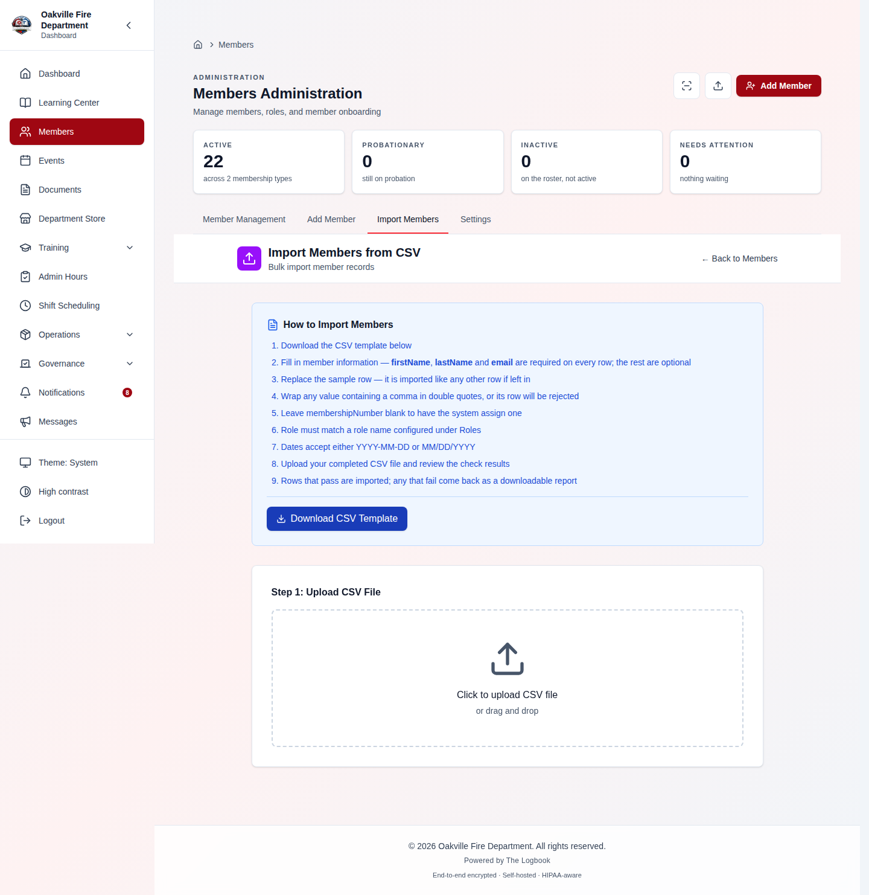

**CSV Columns:** (the downloaded template contains all of them, in this order)

| Column                                                                           | Notes                                                    |
| -------------------------------------------------------------------------------- | -------------------------------------------------------- |
| `firstName`, `lastName`                                                          | **Required**                                             |
| `email`                                                                          | **Required**, must be unique in the department           |
| `middleName`                                                                     |                                                          |
| `membershipNumber`                                                               | Must be unique. Leave blank to have one auto-assigned    |
| `username`                                                                       | Login name; defaults to the part of the email before `@` |
| `dateOfBirth`, `joinDate`                                                        | Format: `YYYY-MM-DD`                                     |
| `street`, `city`, `state`, `zipCode`                                             | Wrap any value containing a comma in double quotes       |
| `primaryPhone`, `secondaryPhone`                                                 |                                                          |
| `rank`, `station`, `platoon`                                                     |                                                          |
| `role`                                                                           | Must match a role name configured under **Roles**        |
| `emergencyName1`, `emergencyRelationship1`, `emergencyPhone1`                    | Supply all three or leave all three blank                |
| `emergencyEmail1`                                                                |                                                          |
| `emergencyName2`, `emergencyRelationship2`, `emergencyPhone2`, `emergencyEmail2` | Optional second contact, same rule                       |

Only `firstName`, `lastName` and `email` are enforced — a file containing just
those three columns imports successfully. Any column not in this list is
ignored, including `departmentId`, which older templates used as the name for
`membershipNumber` and which is still accepted.

Imported members are always created with **Active** status; there is no status
column. Adjust status afterwards from the member's admin edit page. If your file
_has_ a `status` column, the import now tells you it is being dropped when you
select the file, rather than letting it vanish behind a successful upload.

### Every Row Is Checked Before Anyone Is Created _(2026-08-07)_

Validation used to run **inside** the import loop and stop at the first problem
in a row. That meant a row with three bad cells took three upload-fix-upload
cycles, and row 21's problem only surfaced after rows 1–20 had already been
created — leaving you with a half-imported roster and a file you could not simply
re-upload.

Now the whole file is judged first. Rows that pass are imported; rows that fail
are reported and skipped. **Each row reports all of its problems at once**, and
each reason names the column and the offending value.

What is checked before anything is created:

| Check                                      | Example message                                                                               |
| ------------------------------------------ | --------------------------------------------------------------------------------------------- |
| Required fields present                    | `lastName: required`                                                                          |
| Email shape                                | `email: "5715551212" looks like a phone number`                                               |
| Date format                                | `dateOfBirth: Invalid date format`                                                            |
| Field lengths                              | `rank: exceeds 50 characters`                                                                 |
| Username minimum (3 characters)            | Including a username **derived** from a short email local part — a column your file never had |
| Emergency contacts complete                | Names both columns by number                                                                  |
| `role` matches a configured role           | `role: "Engine Operator" matches no configured role`                                          |
| Duplicates **inside the file**             | `email: already used on line 14`                                                              |
| Duplicates **against the existing roster** | `membershipNumber: 214 belongs to J. Alvarez`                                                 |
| Row width vs. header width                 | `row has 19 values, header has 21`                                                            |

> **Screenshot placeholder:**
> _[Screenshot of the Import Members review step showing a summary bar reading "58 rows will import, 4 will be skipped", a "Send welcome emails" checkbox left unchecked, and a rejected-rows table listing line numbers with multiple reasons per row]_

### The Rejected-Rows Report

Failing rows download as a CSV: **your original row, unchanged**, with the
reasons in a leading `errorReason` column.

- It leads rather than trails so it cannot collide with a row that has more cells
  than the header — the very case it exists to explain.
- It holds **only** the failures, so the corrected file cannot collide with the
  members that did import. Fix the rows, re-upload the same file, done.
- If you **stopped** an import part-way, the rows never reached are listed as
  stopped — so the downloaded file is exactly the work left.

### Welcome Emails Are Off by Default for Imports

Creating a member queues a password-setup link **immediately**, and an import
creates them by the dozen. Loading a roster for staging, or from a list with
stale addresses, used to put unrecallable mail in front of every one of them.

The review step now carries a **Send welcome emails** checkbox, unchecked by
default. Left off, the roster loads quietly and you issue credentials afterwards
from Member Management.

> **Add Member** — which creates one member deliberately — is unchanged and still
> offers the checkbox on by default.

### Edge Cases Worth Knowing

- **Delete the template's example row.** The template ships a filled-in John Doe
  so the columns explain themselves. Leaving it in used to create a real member
  with a live password-setup link. The importer now recognises its own example
  and rejects that row — first name, last name **and** email must all match, so a
  real John Doe on your roster is unaffected.
- **A shifted row is rejected, never guessed at.** An unquoted comma in an
  address pushes every later column one place along, so a phone number can land
  in the email field. The import compares each row's value count to the header's
  and rejects a mismatch, naming both counts. A _missing_ comma shifts the other
  way while keeping the count plausible, so email columns are shape-checked too.
- **Line numbers account for quoted newlines.** A value containing a line break
  puts record 12 well below line 13; errors name the line the record actually
  started on, so you can find it.
- **Roles are resolved when you select the file, not row by row during the
  import.** A roster whose `role` column holds job assignments ("Engine
  Operator", "EMT") rather than configured role names imports **no roles at all**
  — worth knowing beforehand. If no roles are configured at all, the column is
  skipped silently, matching what the import does.
- **The roster collision check is best-effort.** If loading the existing roster
  fails, the check is skipped rather than blocking your upload — the server still
  rejects a genuine duplicate. Where your department **hides contact
  information**, emails are absent from that response, so the email dimension
  simply goes unchecked.
- **Any column outside the template is dropped**, and you are told which ones
  when you select the file.

> **Troubleshooting:** If rows fail validation, the results panel lists each failing row number and every reason for it, naming the column and value. Download the error report, fix those rows, and re-upload. Common problems include duplicate emails, a `role` that does not match a configured role name, a partially filled emergency contact, incorrectly formatted dates, and an unquoted comma inside an address.

---

## Member Admin Edit

**Required Permission:** `members.manage`

Navigate to **Members > Admin**, click on a member, then click **Edit** to open the full Admin Edit page at `/members/admin/edit/:userId`.

The Admin Edit page provides complete control over all member fields:

- **Personal Information** - First name, last name, email, username, phone, mobile, address
- **Department Information** - Rank (dropdown from configured operational ranks), station (dropdown from configured stations), membership number, hire date
- **Status Management** - Change member status (Active, Inactive, Suspended, Probationary, etc.) with reason
- **Role Assignment** - Assign or remove positions/roles and their associated permissions
- **Emergency Contacts** - Add, edit, or remove emergency contact entries

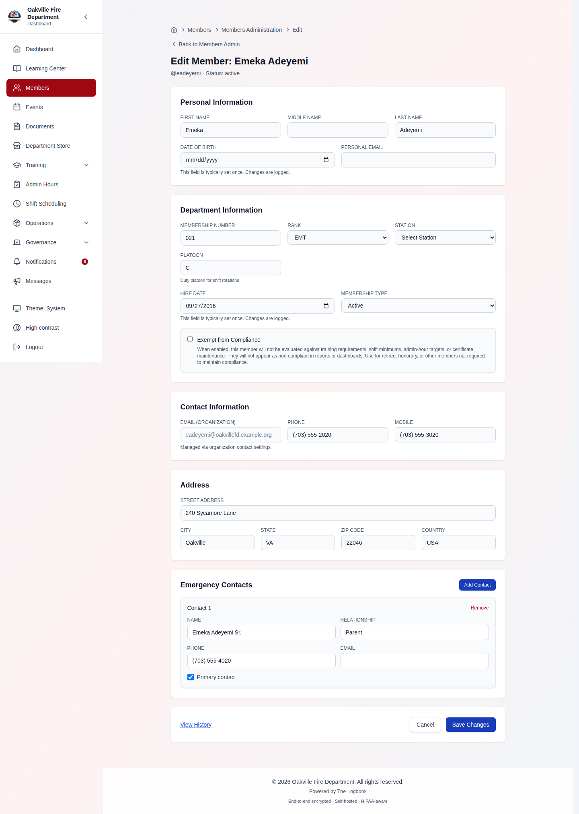

> **Hint:** Rank and station fields use dropdowns populated from the organization's configured values, ensuring consistency across all member records.

---

## Member Audit History

**Required Permission:** `members.manage`

Navigate to **Members > Admin**, click on a member, then click **History** to view the full audit trail at `/members/admin/history/:userId`.

The audit history page shows a chronological list of all changes made to a member's record, including:

- **What changed** - Which field was modified (e.g., rank, status, station)
- **Who made the change** - The user who performed the edit
- **When** - Timestamp of the change
- **Details** - Expands the entry to show the rest of what was recorded

**Before and after values are shown for status and membership-type changes**
("Status changed: probationary → active"), which record both. A profile field
edit records _which_ fields were touched, not what they were before — so a rank
change reads "Member profile updated: rank" and the Details panel names the
field, but the previous rank is not kept.

Use **Filter by** to narrow the list. This matters more than it sounds: viewing
a member's page is itself an audited event, so an unfiltered history is mostly
"Member profile viewed" and the edits are buried among them.

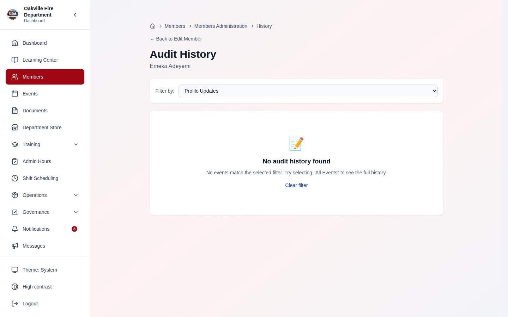

> **Note:** Audit entries are only created for changes made after the audit history feature was deployed. Earlier changes will not appear in the history.

---

## Deleting Members

**Required Permission:** `members.manage`

To permanently delete a member:

1. Open **Members** and find the member's row (or the Members Admin hub's
   Member Management tab — both open the same dialog).
2. Click the **trash icon** in the row's Actions column. You cannot delete
   yourself, so the icon is absent on your own row.
3. The **Remove Member** dialog opens on its **Deactivate** tab, which is the
   reversible option. Switch to **Permanently Delete**.
4. Read the **Records affected** breakdown — training records, inventory items
   still issued to the member, and documents whose uploader would be cleared.
5. Type the member's full name in the confirmation box, exactly as shown, then
   click **Permanently Delete**. The button stays disabled until the name
   matches.

> **Corrected 2026-08-10.** This previously described a "Delete Member button
> at the bottom of the profile page" and a single-step confirmation. There is
> no such button on the profile or the Admin Edit page; deletion is a row
> action in the directory, and the dialog offers deactivation first.

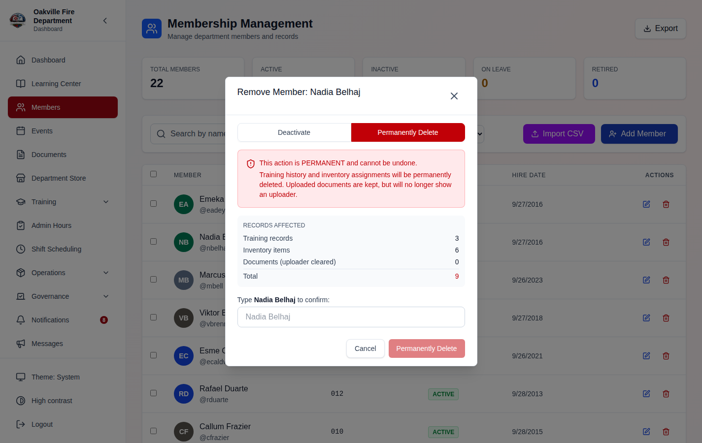

**What gets deleted:**

- Member profile and all personal information
- Training records and certifications
- Inventory assignments (items are unassigned, not deleted)
- Event attendance records
- Shift assignments

**What is kept, with the member's name removed:**

- Records the member **created, approved, issued or uploaded** — documents,
  approvals, and similar attribution — keep the record and clear the reference.
  The impact preview no longer claims uploaded documents are deleted; they are
  not.

> **Important:** Deletion is permanent and cannot be undone. Consider changing the member's status to **Archived** instead if you may need their records in the future.

> **⚠️ Archiving is currently a one-way door in the UI** _(verified 2026-08-08)_.
> You archive from the member profile, but reactivating is API only
> (`POST /users/{id}/reactivate`) — there is no archived-members screen. Archiving
> is still far safer than deleting, since the record and its history survive; just
> be aware that undoing it needs an administrator with API access.

### When Deletion Is Refused _(2026-08-07)_

Some records cannot have their owner cleared without falsifying who requested or
filed them — **budgets, purchase requests, expense reports and IP exceptions**
among them. If the member owns any of these, permanent deletion is **refused**,
and the message names exactly which ones.

That is not a failure to work around. The correct route for a member with
financial history is **Deactivate, then Anonymize**: it strips their personal
information while leaving those records owned, so the department's financial
trail stays intelligible.

> **If you tried to permanently delete a member before 2026-08-07 and got
> "Unable to permanently delete the member" with no detail, that was this — the
> page was discarding the server's explanation.** It now shows you the reason and
> the affected record types. Two related bugs were fixed at the same time: a
> member who had ever created _any_ record could fail deletion outright, and
> **saving a member's roles silently stripped all of their positions**. If a
> member's positions disappeared after a role save, re-add them; the save now
> keeps them.

---

## Prospective Members Pipeline

**Required Permission:** `members.manage`

The pipeline manages people who are interested in joining but are not yet full members. Navigate to **Administration > Members > Prospective** to access the pipeline.

### Pipeline Views

The pipeline offers two views:

- **Kanban Board** - Drag-and-drop cards through stages
- **Table View** - Traditional list with sorting and filtering


> **The board shows the whole pipeline** _(2026-08-08)_. It previously drew from
> one page of applicants (25), so a department with a larger intake saw a board
> silently assembled from a fraction of them. It now loads up to 200 and states
> plainly what it is not showing beyond that. Full detail, including what changed
> about bulk actions and the "Advance" button, is in
> [Prospective Members Pipeline](./15-prospective-members.md#the-kanban-board).

### Working with Prospects

1. **Add a Prospect** - Click **Add Prospect** and fill in their basic information (name, email, phone, interest reason, and **desired membership type** — regular or administrative).
2. **Complete Steps** - Each pipeline stage has steps (action items, checkboxes, notes). Mark steps as completed as the prospect progresses.
3. **Advance** - Move the prospect to the next stage when all required steps are complete. If the next stage is an automated email stage, the configured email is sent automatically. If the prospect is already at the final stage, **Advance** now reports that there is nowhere to move them _(2026-08-08)_; it used to say "Advanced" and change nothing, while still writing an entry into the audit log.
4. **Back** - If a prospect needs to return to a previous stage (e.g., missing documents discovered after advancing), click **Back** in the prospect's detail drawer. The previous stage's progress is reset to allow re-completion. The button is absent while the prospect is still on the first stage, since there is nowhere to go back to.
5. **Upload Documents** - Attach application documents, ID copies, or other requirements to the prospect's record. Uploaded files are now stored on the prospect's record and can be downloaded later. Each file may be up to **50 MB**; allowed types are PDF, Word (DOC/DOCX), JPEG, PNG, and GIF.

The **Documents** area sits in the applicant's drawer, below Linked Events.
**Upload** opens the file picker; each file that lands is listed with its type,
its size and the date it arrived, and its name is the link that downloads it.
The bin removes one filed by mistake, after asking.

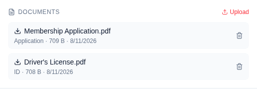

> **The area is new** _(2026-08-11)_. The upload endpoint, the download endpoint
> and the client methods for both had been in place since documents were added,
> but nothing rendered them — so a file could be attached only by calling the
> API directly, and no officer could read one back.

Uploading and removing are offered on **active** applicants only. A withdrawn or
rejected applicant's paperwork stays readable — it is part of the record of the
decision — but is no longer editable.

6. **Transfer to Member** - When the prospect is approved, click **Transfer to Membership** to convert them to a full member account. The membership type is pre-filled from the prospect's desired type.

The drawer's action bar carries all of these, left to right: **Interview**,
**Back**, then **Withdraw**, **Hold**, **Skip**, **Reject** and **Advance**.
On the final stage the last button reads **Convert** instead.

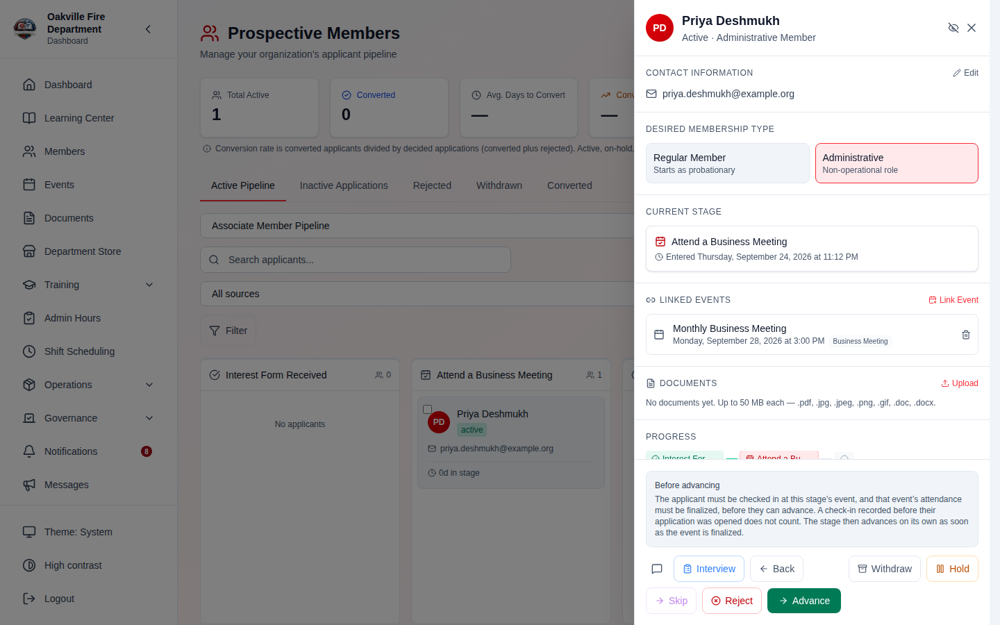

### Desired Membership Type

Prospective members can indicate their preferred membership type when applying:

| Type               | Description                                         |
| ------------------ | --------------------------------------------------- |
| **Regular**        | Standard active membership (starts as probationary) |
| **Administrative** | Non-operational administrative role                 |

- The desired type is captured on the **Membership Interest Form** template (if used as the intake form)
- Coordinators can change the desired type at any pipeline stage from the
  prospect's detail drawer: **Desired Membership Type** there is a pair of
  cards — Regular Member and Administrative — and clicking the other one
  switches it. There is no badge or dropdown on the Kanban card itself
- During conversion to full member, the system pre-fills "Regular" or "Administrative" based on the prospect's selection
- Regular members start with probationary status; administrative members start with active status

> **Screenshot needed:**
> _[Screenshot of the Desired Membership Type cards in a prospect's detail drawer, with Regular Member selected and Administrative alongside it]_

> **Edge case:** If a prospect's desired membership type is changed from "Regular" to "Administrative" after they have already passed an election/vote stage, the system does not retroactively invalidate the vote. The coordinator should verify that the voting requirements for administrative members were met.

> **Screenshot placeholder:**
> _[Screenshot of a prospect detail drawer showing the prospect's info at the top, the current pipeline stage, step checklist with some items completed, and the "Transfer to Membership" button]_

### Printing Applicant Badges

Select applicants in the pipeline (the checkboxes), then click **Print Badges** on the selection bar — useful for sign-in/check-in at a recruitment or outreach event. It opens the shared label print page; pick a label size and download a PDF or print. The badge barcode encodes the applicant's **status token** (the same scannable code used for public application-status checks), so a scanned badge ties back to that applicant. The outreach team's printer choice is remembered for their role, separately from other modules.

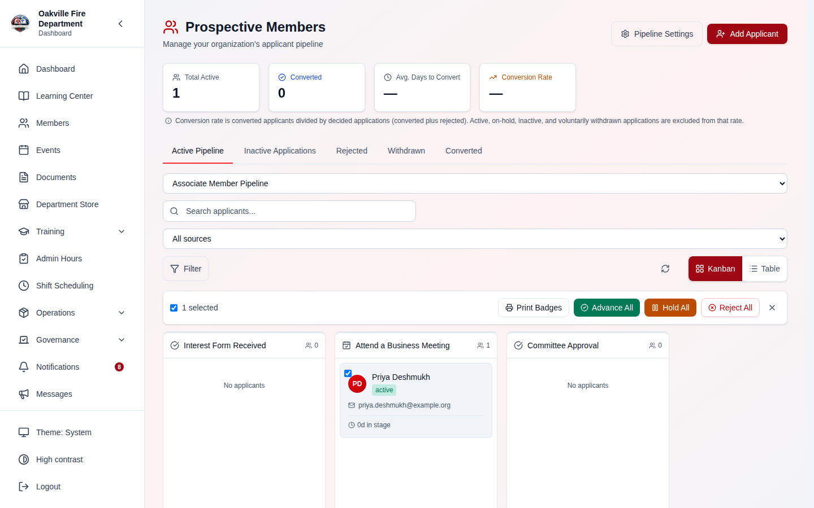

### Pipeline Stage Types

The pipeline supports **twelve** stage types, each tailored to a specific step
in the membership process. The stage type is chosen from a grid of tiles in the
Add/Edit Pipeline Stage dialog, and picking one swaps the configuration panel
below it.

| Stage Type                | Purpose                                | What Happens                                                                                                                                       |
| ------------------------- | -------------------------------------- | -------------------------------------------------------------------------------------------------------------------------------------------------- |
| **Form Submission**       | Collect information from the applicant | Links to a form from the Forms module. Can auto-advance when the form is submitted                                                                 |
| **Document Upload**       | Collect required documents             | Applicant uploads documents (ID, background check, etc.). Can auto-advance when all documents are uploaded                                         |
| **Meeting**               | Schedule interview/orientation         | Requires attendance at or scheduling of a meeting; links to upcoming events                                                                        |
| **Election / Vote**       | Membership vote                        | Auto-creates an election package for the Elections module when a prospect reaches this stage                                                       |
| **Manual Approval**       | Coordinator sign-off                   | An admin or designated role manually marks this stage as complete                                                                                  |
| **Enable Status Page**    | Turn on public tracking                | Activates the prospect's public application-status page at this stage                                                                              |
| **Automated Email**       | Send a notification email              | Sends a configurable email when the prospect reaches this stage. Configure subject, welcome message, FAQ link, meeting details and custom sections |
| **Reference Check**       | Collect references                     | Collect and verify personal or professional references                                                                                             |
| **Checklist**             | Multi-item sign-off                    | A checklist of items (orientation, gear issue, etc.) rather than a single approval                                                                 |
| **Interview Requirement** | Require N interviews                   | Requires a set number of interviews before the prospect can advance                                                                                |
| **Multi-Signer Approval** | Several roles must agree               | Requires multiple designated roles to all sign off                                                                                                 |
| **Medical Screening**     | Physical or medical clearance          | Requires a physical exam or medical clearance before advancing                                                                                     |

> **Corrected 2026-08-10.** This table previously listed seven types, one of
> which — "Form Dropdown" — has never existed; it described the form picker
> _inside_ the Form Submission stage's configuration panel as though it were a
> stage type of its own. Five real types were missing.

Above the grid, a row of **Quick Presets** (Application Form, Background Check
Docs, Chief Interview, President Interview, Membership Vote, Welcome Email,
Coordinator Approval, Reference Check, New Member Orientation, Interview Panel,
Officer Sign-Off, Physical Exam) fills in the name, description, type and a
starting configuration in one click.

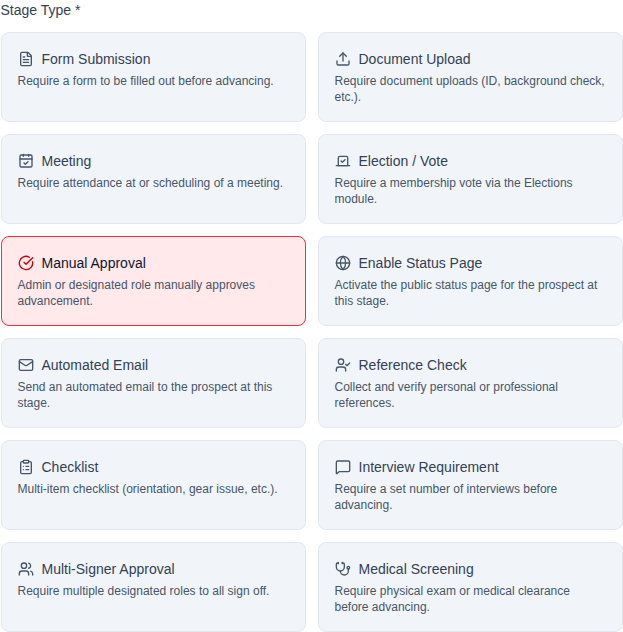

### Auto-Advance

Form submission and document upload stages can be configured to **auto-advance** the prospect when the condition is met:

1. Open the stage configuration (pencil icon in Pipeline Builder)
2. Check **"Auto-advance when form is submitted"** or **"Auto-advance when documents are uploaded"**
3. Save the pipeline

When enabled, the prospect automatically moves to the next stage without coordinator intervention.

> **Edge case:** Auto-advance does not trigger conversion at the final stage. A coordinator must always manually convert a prospect to a full member.

### Automated Email Stages

When a prospect advances to an automated email stage, the system sends the configured email immediately. Configure the email in the stage settings:

- **Email Subject** — customize per stage
- **Welcome Message** — optional introduction section
- **Membership FAQ Link** — link to your department's FAQ page
- **Next Meeting Details** — the event type plus free text for date, time and location
- **Application Tracker Link** — a link to the prospect's public status page. It
  requires the public status page to be enabled, and says so under the checkbox
- **Add custom section** — titled content blocks (e.g. "What to Bring",
  "Parking Information")

Each section other than the subject is a checkbox: tick it to include it, and
its fields appear underneath. The sections have drag handles and can be
reordered, and **Show Preview** at the foot of the panel renders the assembled
email. The prospect's name is used as the greeting automatically — there is no
field for it.

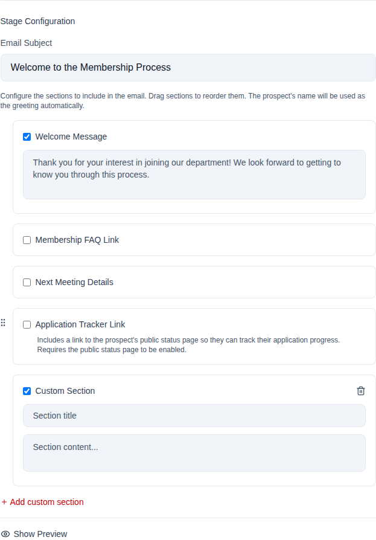

> **Edge case:** If your department has not configured SMTP email settings (in Settings > Email or during onboarding), automated emails will be skipped silently. Check **Settings > Email** to verify your SMTP configuration.

### Pipeline Configuration

Open **Prospective Members** and click **Pipeline Settings** in the page header
(the direct route is `/prospective-members/settings`). The page opens on a
"Select a pipeline" placeholder — choose one from the list on the left before
any of the configuration below appears. From there you can:

- Create and customize pipelines
- Add, remove, or reorder stages (twelve stage types available)
- Configure auto-advance, email templates, form links, and event linking per stage
- Set a default pipeline for new prospects
- Enable auto-transfer on final step approval

> **Hint:** You can create multiple pipelines for different scenarios (e.g., "Standard Application", "Lateral Transfer", "Junior Firefighter").

---

## Member Status Management

**Required Permission:** `members.manage`

Officers change a member's status from the member's profile page.

### Changing a Member's Status

1. Navigate to the member's profile.
2. Click the **status badge** beside the member's name, or the pencil next to
   **Status** in the Employment panel. Both open the same dialog.
3. Pick the new status from **New Status**. The list holds all nine statuses:
   Active, Inactive, Suspended, Probationary, Leave, Retired, Dropped
   Voluntary, Dropped Involuntary and Archived.
4. Optionally give a **reason**. The field is not required.
5. Click **Update Status**. It stays disabled while the selection still matches
   the member's current status.

Choosing either drop status adds a note to the dialog: dropping a member
generates a property return report and may send an email notification. Both
happen automatically — the dialog has no per-change options for them.

> **Corrected 2026-08-10.** This previously described a return deadline,
> custom instructions and a "send notification" toggle inside the dialog. None
> of the three exists; the dialog holds a status dropdown, an optional reason,
> and the drop note above.

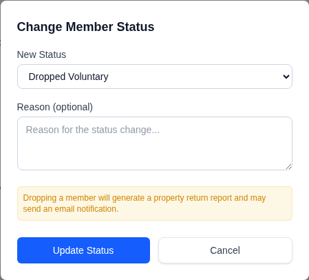

> **The last administrator cannot be removed** _(2026-08-01)_. If the member
> you are changing is the only remaining active person who can manage members,
> the system refuses the change and asks you to grant that permission to
> somebody else first.
>
> This applies to status changes, archiving, deletion, and removing the
> position that carries the permission. It matters because every status other
> than Active fails the sign-in check — so setting the only administrator to
> Inactive locks the whole department out of its own member tools on the very
> next request, and getting back in needs someone with database access.

### Property Return Process

When a member is dropped, the system automatically:

1. Generates a **property return report** listing all assigned equipment
2. Sends a reminder email (if configured)
3. Tracks outstanding items
4. Auto-archives the member once all property is returned

> **Hint:** Overdue property returns are tracked by the API
> (`GET /users/overdue-property-returns`) but **have no screen** as of
> 2026-08-08. The Inventory module's members page shows an "Overdue Returns"
> figure, which counts inventory checkouts rather than offboarding property, so
> it is not a substitute. See
> [KNOWN_LIMITATIONS.md](../KNOWN_LIMITATIONS.md#member-lifecycle--the-page-that-was-documented-but-never-built-2026-08-08).

---

## Leave of Absence

**Required Permission:** `members.manage`

When a member takes a leave of absence, their time away should be recorded so that rolling-period training and shift requirements are adjusted. Months during a leave are excluded from the denominator when calculating compliance.

### Managing Leaves

Navigate to **Members > Admin > Waivers** — the
[Waiver Management](#waiver-management) page. Leaves of absence are created and
listed there, alongside training waivers.

> **Corrected 2026-08-08.** This previously said to open a "Member Lifecycle
> Management" page and select a "Leave of Absence" tab. That page does not exist.
> Waiver Management is an odd home for this and is where it actually lives — the
> two are closely related (a leave auto-links a training waiver), which is
> presumably why.

1. Open the **Create Waiver** tab.
2. Select the **member** from the dropdown.
3. Choose the **waiver type**: Leave of Absence, Medical, Military, Personal, Administrative, or Other.
4. Under **Applies To**, tick which requirements the leave suspends — training, meeting attendance, shifts, or all three.
5. Set the **start date** and **end date**, or tick **Permanent (no end date)**.
6. Optionally provide a **reason**.
7. Click **Create Waiver**.

It is a tab on that page, not a modal, and the button reads **Create Waiver** rather than "Add Leave of Absence" — a leave of absence is a waiver type, not a separate record.

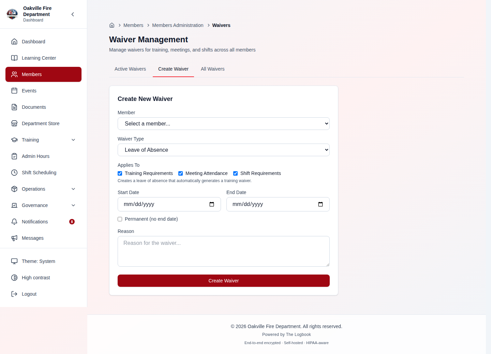

### How Leave Affects Requirements

For rolling-period requirements (e.g., "12 hours of training over 12 months"):

- If a member has a 3-month leave, the system adjusts the requirement to 9 hours (12 x 9/12)
- Only **full calendar months** fully covered by the leave are excluded
- Partial months still count (so the member gets credit for time they were active)

### Viewing Leaves

- **Waiver Management** lists all active (and optionally inactive) leaves across
  the department; the **Training Waivers** officer view lists them too
- Individual member profiles show active leaves in the right sidebar, read-only
- Toggle **Show inactive leaves** to see historical records

> **Hint:** Deactivating a leave does not delete it -- it becomes inactive and remains in the history. You can toggle "Show inactive leaves" to review past records.

> **⚠️ You cannot edit or cancel a leave from any screen** _(verified
> 2026-08-08)_. Creating one works; correcting one does not — `PATCH` and
> `DELETE /users/leaves-of-absence/{id}` exist and are tested, but nothing in the
> application calls them.
>
> **Check the dates before you save.** A leave pro-rates the member's hours,
> shift and call requirements, so a wrong end date quietly changes their
> compliance and there is no screen to put it right. Tracked in
> [KNOWN_LIMITATIONS.md](../KNOWN_LIMITATIONS.md#member-lifecycle--the-page-that-was-documented-but-never-built-2026-08-08).

### LOA and Training Waiver Auto-Linking

When a Leave of Absence is created, the system **automatically creates a linked training waiver** with matching dates. This means:

- You do **not** need to separately create a training waiver after creating an LOA
- If the LOA dates are updated, the linked training waiver dates sync automatically
- If the LOA is deactivated, the linked training waiver is also deactivated
- To opt out of auto-linking for a specific leave, set `exempt_from_training_waiver` on the leave (available via the "Meetings & Shifts Only" option in the Waiver Management page)

> For detailed technical documentation on how waivers adjust training compliance, see [Training Waivers & Leaves of Absence](../../backend/app/docs/TRAINING_WAIVERS.md).

---

## Waiver Management

**Required Permission:** `members.manage`

Navigate to **Members > Admin > Waivers** to access the unified Waiver Management page. This page consolidates all waiver types into a single interface.

### Tabs

| Tab                | Purpose                                                     |
| ------------------ | ----------------------------------------------------------- |
| **Active Waivers** | View all currently active waivers across the department     |
| **Create Waiver**  | Create a new waiver for a member                            |
| **All Waivers**    | View full history including expired and deactivated waivers |

### Creating a Waiver

1. Click the **Create Waiver** tab.
2. Select the **member** from the dropdown.
3. Choose the **Applies To** scope:
   - **All (LOA + Training Waiver)** — Creates a Leave of Absence and automatically links a training waiver. This is the most common choice.
   - **Training Only** — Creates a standalone training waiver without affecting meeting attendance or scheduling.
   - **Meetings & Shifts Only** — Creates a Leave of Absence with training waiver opt-out. Training requirements are not adjusted.
4. Select the **leave type** and set the **date range**.
5. Optionally provide a **reason**.
6. Click **Create Waiver**.


### Training Waivers Officer View

Training officers can also view training-specific waivers from **Training Admin > Dashboard > Training Waivers** tab. This view includes:

- Summary cards showing Active, Future, Expired, and Total waiver counts
- Filterable table with status badges (Active, Future, Expired, Deactivated)
- Source tracking showing whether each waiver was auto-created from an LOA or manually created
- Links back to the full Waiver Management page

---

## Rank Validation

**Required Permission:** `members.manage`

The rank validation feature helps identify members whose rank does not match any of the organization's configured operational ranks.

### How It Works

The system compares each active member's rank against the organization's configured list of operational ranks. Members whose rank does not match (case-sensitive) are flagged for review.

### Viewing Rank Mismatches

Rank validation results are visible in the **Members Admin Hub**. Members with unrecognized ranks are surfaced with their current rank and the list of valid ranks to choose from.

### Resolving Mismatches

1. Navigate to the flagged member's profile or Admin Edit page.
2. Use the **rank dropdown** to select the correct operational rank.
3. Save the changes.

> **Hint:** If a member's rank is legitimate but not in the system, add it to the organization's operational ranks in **Settings** before correcting individual member records.

---

## Membership Tiers

**Required Permission:** `members.manage`

Membership tiers classify members by their years of service and grant benefits like voting eligibility, office-holding rights, and training exemptions.

### Configuring Tiers — API Only

> **⚠️ There is no screen for this.** Membership tiers work, and the API is
> complete, but **no page in the application reads or writes the tier
> configuration**. Verified against the code on 2026-08-08: the service methods
> (`getTierConfig`, `updateTierConfig`, `advanceMembershipTiers`) exist in
> `frontend/src/services/adminServices.ts` with **zero callers**.
>
> This section previously described a "Tier Configuration" tab on a "Member
> Lifecycle Management" page. Neither exists — see
> [Member Lifecycle Management](#member-lifecycle-management) below. Configure
> tiers through the API until the screen is built, or leave them unconfigured, in
> which case membership types are free-form and unvalidated.

The configuration is stored in the organization's settings under
`membership_tiers` and is read and written through:

| Method | Endpoint                                  | Permission       |
| ------ | ----------------------------------------- | ---------------- |
| `GET`  | `/api/v1/users/membership-tiers/config`   | `members.manage` |
| `PUT`  | `/api/v1/users/membership-tiers/config`   | `members.manage` |
| `POST` | `/api/v1/users/advance-membership-tiers`  | `members.manage` |
| `POST` | `/api/v1/users/{user_id}/membership-tier` | `members.manage` |

Each tier carries:

- A **tier id** and **name** (e.g. `senior` / "Senior Member")
- The **years of service required** for automatic advancement
- **Benefits**: voting eligible, can hold office, training exempt, requires
  meeting attendance for voting

**What still works without the screen:**

- **Changing one member's tier** is available in the UI, from the member's
  profile — that path goes through the status-change control, not through tier
  configuration.
- **Validation.** If tiers _are_ configured, a tier change is rejected unless the
  target tier id is one of them. If none are configured, any value is accepted —
  so an unconfigured department has membership types that nothing checks.
- **Auto-advancement** runs when `POST /users/advance-membership-tiers` is
  called. Because nothing in the UI calls it, in practice it only runs if an
  operator invokes it.

### Auto-Advancement

Auto-advancement computes each member's years of service from their `hire_date`
and promotes them to the highest tier they qualify for under the organization's
configured tiers.

> **There is no "Advance Eligible Now" button** and no scheduled job for this —
> the endpoint has to be called deliberately. An earlier version of this guide
> described both; neither exists.

---

## Member Lifecycle Management

> **⚠️ Corrected 2026-08-08 — this page does not exist.** Earlier versions of this
> guide described a "Member Lifecycle Management" page under Members Admin with
> four tabs: Archived Members, Overdue Returns, Leave of Absence, and Tier
> Configuration. **None of it is real.** `/members/admin` has exactly three tabs —
> Member Management, Add Member, Import Members — and there is no lifecycle page
> anywhere in the application.
>
> The screenshot below was captured at `/members/admin` and applied under the old
> caption, so it shows the Members Admin hub, not a lifecycle page. It has been
> re-captioned rather than removed, since the page it actually shows is a real one.

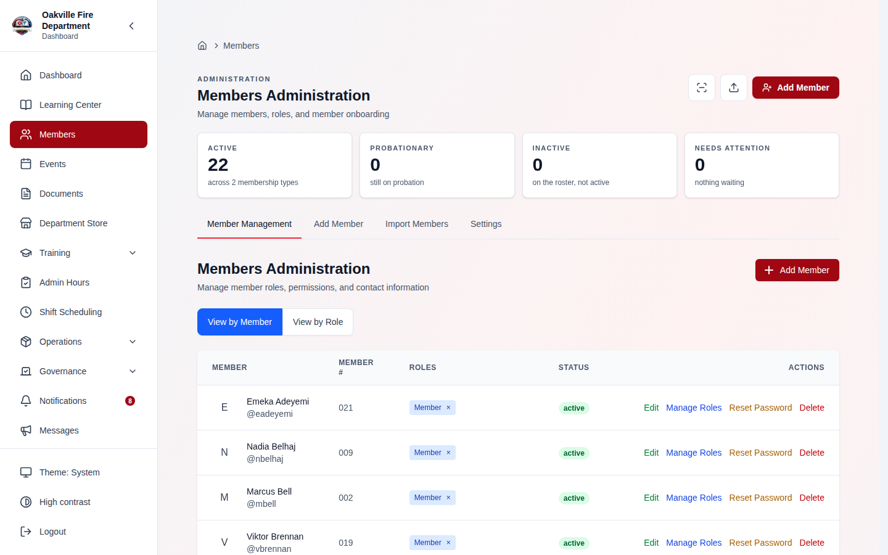

### Where Each Lifecycle Operation Actually Lives

Verified against the code on 2026-08-08:

| Operation                                          | Where it is today                                                                   | State                                                                                                                        |
| -------------------------------------------------- | ----------------------------------------------------------------------------------- | ---------------------------------------------------------------------------------------------------------------------------- |
| **Change a member's status** (including archiving) | Member profile → status control                                                     | ✅ Full UI                                                                                                                   |
| **Leave of absence — create**                      | [Waiver Management](#waiver-management) (`/waivers`)                                | ✅ Works, but it is not where you would look                                                                                 |
| **Leave of absence — view**                        | Member profile (read-only card), and listed on Waiver Management / Training Waivers | ✅ Read-only                                                                                                                 |
| **Leave of absence — edit or delete**              | —                                                                                   | ❌ API only (`updateLeaveOfAbsence`, `deleteLeaveOfAbsence` have no callers)                                                 |
| **Archived members — list and reactivate**         | —                                                                                   | ❌ API only (`getArchivedMembers`, `reactivateMember` have no callers)                                                       |
| **Overdue property returns**                       | —                                                                                   | ❌ API only for _members_. The Inventory module's members page shows an "Overdue Returns" figure, which is a different thing |
| **Tier configuration**                             | —                                                                                   | ❌ API only (see [Membership Tiers](#membership-tiers))                                                                      |

**What this means in practice.** Archiving a member works, and so does putting
one on leave — but _reversing_ either one needs the API. If you archive somebody
by mistake, or a leave of absence is entered with the wrong dates, there is no
screen to fix it from. Budget for that before you archive in bulk.

> **This is a feature gap, not a bug.** The endpoints, permissions and service
> methods all exist and are tested; what is missing is the screens. Tracked in
> [KNOWN_LIMITATIONS.md](../KNOWN_LIMITATIONS.md#member-lifecycle--the-page-that-was-documented-but-never-built-2026-08-08)
> with the exact API surface, so whoever builds the page does not have to
> rediscover it.

---

## EVOC Certification

A member's EVOC (Emergency Vehicle Operations Course) level is recorded **per
apparatus**, on their operator record for that rig — not as a single field on
their profile.

> **Corrected 2026-08-10.** This section previously said the level was "tracked
> on their profile" and "set via the member admin edit page". There is no EVOC
> field on the profile or the Admin Edit page, and the three levels below are
> your organization's, not the system's.

**Where to set it.** Open **Operations > Apparatus**, choose the apparatus, and
go to its **Operators** tab. **Add Operator** picks a member and records their
qualification on that rig; the pencil on an existing row edits it. The form
holds:

- **EVOC Certification Level** — a dropdown of your organization's configured
  levels, plus "No EVOC level"
- **Certified to operate**, with certification and expiration dates
- **License Type Required** (e.g. CDL Class B) and **License verified**, with a
  verification date
- **Has operating restrictions**, with notes
- **Active operator** and free-text notes

**The levels are yours to define.** EVOC levels are configured per organization
with a level number, name and code — they are not a fixed Basic / Intermediate
/ Advanced triple. The numbering follows the national 1–4 convention, and each
level can be marked cumulative (holding level 3 also grants level 2's
privileges) or not, for local exceptions. The demo data defines three:

| Level | Name         | Code   | Covers                                     |
| ----: | ------------ | ------ | ------------------------------------------ |
|     1 | Basic        | EVOC-1 | Emergency vehicle operation, non-transport |
|     2 | Intermediate | EVOC-2 | Engine and rescue apparatus                |
|     3 | Advanced     | EVOC-3 | Aerial and tiller-equipped apparatus       |

**What it is used for.** An apparatus can name a **Required EVOC Level**. When
scheduling puts a member in a driver/operator position, it takes the highest
level from their _current_ operator records — active, certified, and not past
their expiration date — and compares it against that requirement.

> **Edge case:** A member with no EVOC certification, or one whose certification
> has expired, can still be assigned; the check produces a warning naming the
> required level rather than blocking the assignment. An apparatus with no
> required level set never warns at all.

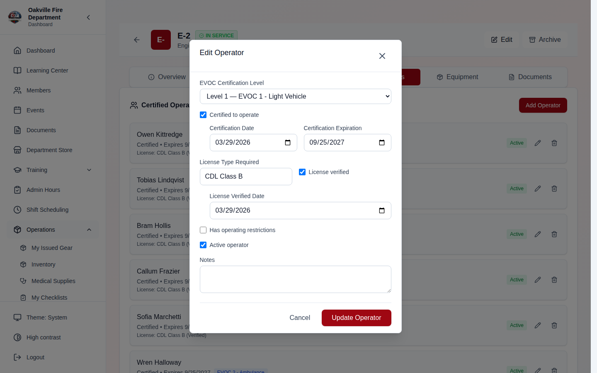

---

## Troubleshooting

| Issue                                                                | Solution                                                                                                                                                                                                                                                                                                                                           |
| -------------------------------------------------------------------- | -------------------------------------------------------------------------------------------------------------------------------------------------------------------------------------------------------------------------------------------------------------------------------------------------------------------------------------------------- |
| "Email already in use" when adding a member                          | Each member must have a unique email. Check if the email belongs to an existing or archived member.                                                                                                                                                                                                                                                |
| Member cannot log in after creation                                  | Ensure the welcome email was sent, or manually share the temporary password. Check that the member's status is Active.                                                                                                                                                                                                                             |
| CSV import rows failing                                              | As of 2026-08-07 every row is checked when you select the file, before anything is created, and each rejection names the column and the value. Use **Download Error Report** to get the failed rows back with the reasons in a leading `errorReason` column — fix them, delete that column, and upload that file.                                  |
| A phone number was imported as a member's email                      | Fixed 2026-08-07 — a comma inside an _unquoted_ value shifted every later column one place right. Rows whose value count does not match the header are now rejected, and any email column holding a phone number is called out. Keep values containing commas wrapped in double quotes.                                                            |
| "Email already exists" for a member who is not in the system         | The address appears twice in your file. As of 2026-08-07 repeats of email, username and membershipNumber are caught before importing, naming the line the value was first used on. Two different addresses can still collide on username, since it is derived from the part before the `@` — add a `username` column to separate them.             |
| Importing sent welcome emails I did not want sent                    | As of 2026-08-07 **Send welcome emails now** sits on the review step and is **off by default** for imports — the roster loads without sending anything, and you issue credentials afterwards from Member Management → Reset Password. Tick the box to email everyone a password-setup link as they are created.                                    |
| A member is already on the roster                                    | As of 2026-08-07 the current roster is checked when you select the file, so a row matching an existing member's email, username or membership number is reported up front, naming who owns the value. Useful when re-uploading a corrected file.                                                                                                   |
| The import created a member called John Doe                          | The template's example row was left in the file. As of 2026-08-07 the importer recognizes its own example and rejects that row; delete it from the file.                                                                                                                                                                                           |
| A large import seems to hang, or was started by mistake              | The review step shows "Importing 23 of 47" and a **Stop importing** button. Members already created stay created. Rows not reached appear in the error report as "Not imported — the import was stopped before this row", so that file is exactly what remains and can be uploaded to finish.                                                      |
| CSV upload rejected with "Missing required columns: departmentid"    | Fixed 2026-08-04 — the generated template and the uploader disagreed on that column's name. Pull latest and re-download the template. Rosters built from an older template still import.                                                                                                                                                           |
| A row that looks complete fails as "Missing required fields"         | Fixed 2026-08-04 — a comma inside a field (typically an address) used to shift every column after it. Pull latest, and keep such values wrapped in double quotes.                                                                                                                                                                                  |
| Imported members have no position assigned                           | Fixed 2026-08-04 — the `role` column was read but never applied. Pull latest and use the exact role name from **Roles**; an unmatched name now fails that row rather than importing without a role.                                                                                                                                                |
| Import row fails "Username already exists" but no username was given | Usernames default to the part of the email before `@`, so `j.doe@a.com` and `j.doe@b.org` collide. Add a `username` column with distinct values.                                                                                                                                                                                                   |
| Imported members are all Active regardless of the spreadsheet        | Expected — the create endpoint has no status field, and the misleading `status` column was removed from the template on 2026-08-04. As of 2026-08-06 the uploader says so when your file still carries a `status` column, instead of dropping it silently. Set status afterwards from Admin Edit.                                                  |
| A column in my spreadsheet was not imported                          | As of 2026-08-06 the uploader names every column it does not recognize when you select the file. Anything outside the template's columns is ignored — move that data into a template column or record it on the member afterwards.                                                                                                                 |
| Every row fails "Unknown role"                                       | The `role` column must match a role name configured under **Roles**, not a rank or an assignment ("Engine Operator", "EMT" are usually the latter). As of 2026-08-06 unmatched names are reported when you select the file rather than one row at a time after importing. Create the roles, or clear the column and set the `rank` column instead. |
| Prospect not showing in pipeline                                     | Check the pipeline filter. Prospects may be in a different pipeline or have a status of Withdrawn/Transferred.                                                                                                                                                                                                                                     |
| Auto-advance not triggering                                          | Verify that "Auto-advance when form is submitted" (or documents uploaded) is checked in the stage configuration. The setting defaults to off.                                                                                                                                                                                                      |
| Automated email not sent                                             | Check that SMTP is configured in Settings > Email. Verify the prospect has a valid email address. Check the scheduled email logs for errors.                                                                                                                                                                                                       |
| "Move Back" button not visible                                       | The prospect must be on a stage beyond the first. The "Move Back" action is only available for active prospects not at the first stage.                                                                                                                                                                                                            |
| Email showing UTC times                                              | Ensure the organization's timezone is configured in Settings > Organization. Scheduled emails display times in the organization's timezone. _(fixed 2026-03-14)_                                                                                                                                                                                   |
| Days-in-stage always shows 0                                         | Fixed 2026-03-15 — days-in-stage is now computed server-side from the prospect's `updated_at` timestamp. Pull latest and restart.                                                                                                                                                                                                                  |
| Pipeline email sections in wrong order                               | As of 2026-03-15, use drag-and-drop to reorder email sections in the pipeline email configuration. The order persists in the `section_order` array.                                                                                                                                                                                                |
| Pipeline email preview not available                                 | Added 2026-03-15 — preview rendered email content before sending from the pipeline email configuration panel.                                                                                                                                                                                                                                      |
| Pipeline overview report not showing                                 | Added 2026-03-15 — enable the pipeline overview report in Reports. Configure stage grouping in Pipeline Settings > Report Stage Groups.                                                                                                                                                                                                            |
| SMTP connection error on email send                                  | Verify SMTP settings: Gmail/Office 365 use STARTTLS on port 587 (`EMAIL_USE_SSL=false`); self-hosted servers may use SSL on port 465 (`EMAIL_USE_SSL=true`). _(fixed 2026-03-13)_                                                                                                                                                                  |
| Member still showing as active after being dropped                   | The status change may not have been saved. Verify from the member's profile.                                                                                                                                                                                                                                                                       |
| Property return report not generating                                | The member must have inventory items assigned. If none are assigned, no report is generated.                                                                                                                                                                                                                                                       |
| Membership tier not advancing                                        | Verify the member has a **hire_date** set and that auto-advance is enabled. The member must have an Active status.                                                                                                                                                                                                                                 |
| LOA created but training not adjusted                                | Check that the LOA does not have `exempt_from_training_waiver` set. The auto-linked training waiver should appear in the Training Waivers tab. If missing, create a standalone waiver from the Waiver Management page.                                                                                                                             |
| Rank shows as unrecognized in validation                             | The member's rank must exactly match a configured operational rank (case-sensitive). Edit the member's rank or add the rank to the organization's configuration.                                                                                                                                                                                   |
| Audit history is empty                                               | Audit entries are only tracked for changes made after the feature was deployed. Earlier changes will not appear.                                                                                                                                                                                                                                   |
| Cannot find Admin Edit page                                          | Navigate to Members > Admin, click a member, then click **Edit**. The page is at `/members/admin/edit/:userId`.                                                                                                                                                                                                                                    |
| Photo upload fails                                                   | Check the file type (JPEG, PNG, WebP only) and file size. Ensure the backend has sufficient disk space for uploads.                                                                                                                                                                                                                                |
| Compliance card shows wrong status                                   | Refresh the page. Red = expired certs or <50% requirements met; Yellow = expiring certs or incomplete requirements; Green = fully compliant.                                                                                                                                                                                                       |

---

## Department Email Generation, Username Safety & Default Roles (2026-03-24)

### Department Email Generation

When a prospect is elected to full membership (transferred from the prospective pipeline), the system can now **automatically generate a department email address** (e.g., `john.smith@firedept.org`).

**Configuration** (Settings > Organization > Department Email):

| Setting     | Description                                           |
| ----------- | ----------------------------------------------------- |
| **Enabled** | Toggle department email generation on/off             |
| **Domain**  | Your department's email domain (e.g., `firedept.org`) |
| **Format**  | Choose from 4 patterns (see below)                    |

**Email Format Patterns:**

| Format                         | Example                 |
| ------------------------------ | ----------------------- |
| `first.last`                   | john.smith@firedept.org |
| `flast` (first initial + last) | jsmith@firedept.org     |
| `firstlast`                    | johnsmith@firedept.org  |
| `last.first`                   | smith.john@firedept.org |

> **Screenshot needed:**
> _[Screenshot of the Organization Settings page showing the "Department Email" section with an enabled toggle, domain field showing "firedept.org", and a format dropdown set to "first.last"]_

The prospect's **personal email** is preserved in the `personal_email` field on their user profile, so you always have a way to contact them outside the department system.

> **Edge case:** If the generated email already exists (e.g., two members named John Smith), the system automatically appends a numeric suffix: `john.smith2@firedept.org`, `john.smith3@firedept.org`, etc.

> **Edge case:** If department email generation is disabled in settings, the prospect's personal email becomes their primary account email.

### Username Collision Handling

When members are created (via admin, self-registration, or prospect transfer), the system now generates unique usernames automatically:

- First attempt: `jsmith` (first initial + last name)
- If taken: `jsmith1`, `jsmith2`, etc.

This prevents registration failures when multiple members share similar names.

> **Edge case:** Manually provided usernames are also validated for uniqueness. If you enter a username that already exists, you'll receive an error asking you to choose a different one.

### Default Member Role

All new members — whether created by an admin, self-registered, or transferred from the prospective pipeline — now receive the **"member" role** automatically. This ensures every member has baseline permissions from day one without requiring manual role assignment.

### Password Security on Creation

All member creation paths now set `password_changed_at` to the creation time, ensuring HIPAA password age checks work correctly from day one. Self-registered users additionally have `must_change_password=True`, forcing a password change on first login.

### Membership ID Auto-Generation

Membership IDs are now auto-generated when a member is created or transferred. Additional safety features:

- When a member is archived (soft-deleted), their membership number is preserved in `previous_membership_number`
- When a member is reactivated, their previous membership number is automatically restored
- The active membership number column is NULLed on archive so the number can be reassigned if needed

> **Screenshot needed:**
> _[Screenshot of a member profile showing the auto-generated Membership ID field (e.g., "2026-0042") in the member details section, with the field marked as read-only]_

> **Edge case:** If a member is archived and then a new member is assigned their old number, reactivating the archived member will generate a new number instead of conflicting.

### Troubleshooting Additions (2026-03-24)

| Issue                                                     | Solution                                                                                                             |
| --------------------------------------------------------- | -------------------------------------------------------------------------------------------------------------------- |
| Department email shows collision error                    | System auto-resolves by appending numeric suffix. If issue persists, check for deleted users with the same email.    |
| Username "already exists" on admin create                 | Choose a different username or let the system auto-generate one.                                                     |
| New member has no permissions                             | All members now get the "member" role automatically. If still no access, verify the role exists in Settings > Roles. |
| Member reactivated but old membership number not restored | Number is restored only if no other active member has been assigned that number since archival.                      |

---

## Realistic Example: New Member Onboarding (End-to-End)

This walkthrough follows a single applicant — **Alex Rivera** — from first contact through the end of their third month at **Oakville Fire Department (OFD)**. It touches six modules (Membership, Elections, Inventory, Medical, Training, Scheduling) and highlights the cross-module data flows that make The Logbook more than a collection of independent tools.

**Personas:**

| Person                  | Role                                          |
| ----------------------- | --------------------------------------------- |
| **Alex Rivera**         | New applicant, later Probationary Firefighter |
| **Lt. Morrison**        | Membership Coordinator                        |
| **Capt. Davis**         | Training Officer                              |
| **Lt. Walsh**           | Quartermaster (Inventory)                     |
| **Secretary Sarah Kim** | Election administrator                        |
| **Capt. Alvarez**       | Health & Safety Officer                       |

---

### Part 1: Application (January 5)

Alex discovers OFD's recruitment page and submits an interest form through the **public portal**.

1. Lt. Morrison opens **Administration > Members > Prospective** and clicks **Add Prospect**. She enters Alex's name, email, phone, and sets the desired membership type to **Regular**.
2. The prospect card appears in the Kanban board at **Stage 1: Interest Form** (a Form Submission stage linked to the Membership Interest Form in the Forms module).
3. Because Stage 1 is configured as an **Automated Email** follow-up, the system sends Alex a welcome email containing a status tracker link and instructions for completing the interest form.
4. Alex clicks the link, fills out the interest form online, and submits it.
5. The stage has **auto-advance** enabled, so Alex's card automatically moves to **Stage 2: Application Review**.

**Edge case — duplicate detection:** When Lt. Morrison creates the prospect, the system detects an archived member with the last name "Rivera" but a different email address. A duplicate warning banner appears on the prospect drawer. Lt. Morrison reviews the archived record, confirms this is a different person, and dismisses the warning. The prospect proceeds normally.

> **[SCREENSHOT NEEDED]:** _The Prospective Members Kanban board showing Alex Rivera's card in Stage 2: Application Review, with the duplicate warning banner visible at the top of the prospect detail drawer._

---

### Part 2: Background Check & Interview (January 10 -- February 15)

1. Lt. Morrison advances Alex to **Stage 3: Background Check** (a Document Upload stage).
2. The background check takes three weeks. On January 31, the results are uploaded as a PDF document to Alex's prospect record (up to 50 MB, PDF/DOC/DOCX/JPEG/PNG/GIF).
3. With the document uploaded and auto-advance enabled, Alex moves to **Stage 4: Interview** (a Meeting stage linked to the February interview event).

**Interview panel — three officers evaluate Alex:**

| Interviewer   | Recommendation              | Notes                                                      |
| ------------- | --------------------------- | ---------------------------------------------------------- |
| Capt. Davis   | Recommend                   | "Strong mechanical aptitude, team-oriented"                |
| Lt. Hernandez | Recommend                   | "Excellent communication skills"                           |
| FF Brooks     | Recommend with reservations | "Limited weekday availability — works full-time until May" |

Each interviewer records their recommendation in the prospect's pipeline steps. FF Brooks's reservation is captured as a note on the step but does not block advancement — the pipeline requires a majority "Recommend" to proceed, not unanimity.

4. Lt. Morrison reviews all three recommendations and advances Alex to **Stage 5: Membership Vote**.

**Edge case — reservation handling:** FF Brooks's "Recommend with reservations" is stored in the prospect's history. If a future coordinator reviews Alex's file, the reservation and its context are visible in the audit trail. Reservations do not create a separate approval gate; they are informational.

---

### Part 3: Membership Vote (March Business Meeting)

When Alex reaches the **Election/Vote** stage, the system automatically creates an **election package** in the Elections module. The package includes:

- Alex's name, photo, and desired membership type
- A snapshot of pipeline progress (all stages completed, interviewer recommendations)
- Uploaded documents (background check results, interest form responses)

1. Secretary Sarah Kim opens **Elections** and sees the auto-created package with status **Pending**.
2. She adds Alex to the **March Business Meeting** election ballot.
3. At the meeting, 38 members are present. The vote proceeds:
   - **Yes:** 35
   - **No:** 3
   - **Result:** Approved (simple majority required)
4. Secretary Kim records the results. The election package status changes to **Elected**.
5. Alex's prospect card in the pipeline automatically reflects the election result.

**Edge case — failed vote:** If the vote had been 15-23 (Not Elected), the election package status would change to **Not Elected**. Alex would remain in the pipeline at the Election/Vote stage with the option to re-apply after a configurable waiting period (default: 6 months). Lt. Morrison would see a "Re-application eligible" date on the prospect card.

> **[SCREENSHOT NEEDED]:** _The Elections module showing Alex Rivera's election package with status "Elected", vote tally (35-3), and the linked prospect record._

---

### Part 4: Member Conversion & Gear Assignment (March 16)

#### Conversion to Full Member

1. Lt. Morrison clicks **Transfer to Membership** on Alex's prospect card.
2. The system creates a new user account:
   - **Rank:** Probationary Firefighter
   - **Station:** Station 1
   - **Status:** Probationary
   - **Membership number:** OFD-2026-047 (auto-generated)
   - **Department email:** alex.rivera@oakvillefd.org (auto-generated from the `first.last` pattern)
   - **Personal email:** preserved from the prospect record
   - **Role:** "member" (assigned automatically)
3. A welcome email is sent to Alex's personal email with login credentials and a prompt to change the password on first login.

#### Gear Assignment via Impact Planner

4. Lt. Walsh opens the **Inventory** module and navigates to the **Impact Planner**.
5. He runs an analysis filtered to **Station 1 probationary members needing PPE**.
6. Alex appears in the results as **"Needs item"** for five categories:
   - Turnout coat
   - Turnout pants
   - Helmet
   - Gloves
   - Boots
7. Alex's sizes are not on file. Lt. Walsh clicks **"Request Sizes"** next to Alex's name. The system sends Alex a notification asking them to enter size preferences.
8. Alex logs in for the first time, changes their password, and navigates to **My Equipment > Size Preferences**. Alex enters:
   - Coat: L Regular
   - Pants: 34x32
   - Helmet: 7 1/4
   - Gloves: XL
   - Boots: 11 Wide
9. Lt. Walsh returns to the Impact Planner, sees Alex's sizes are now on file, and clicks **Issue PPE Kit**. The system matches available inventory to Alex's size preferences and creates assignment records.

**Edge case — stock shortage:** XL gloves are out of stock. The system issues a partial kit (coat, pants, helmet, boots) and flags gloves as **"Pending — Out of Stock"**. An automatic reorder request is created in the Inventory module, and Lt. Walsh receives a notification. Alex's equipment profile shows 4 of 5 items assigned with the gloves line item showing a yellow "Backordered" badge.

> **[SCREENSHOT NEEDED]:** _The Impact Planner results showing Alex Rivera with "Needs item" status for five PPE categories, with the "Request Sizes" button visible and size preference fields partially filled._

---

### Part 5: Medical Screening (March 20)

Capt. Alvarez opens the **Medical Screening** module and creates screening records for Alex:

| Screening                  | Status    | Scheduled Date |
| -------------------------- | --------- | -------------- |
| Annual Physical Exam       | Scheduled | March 25       |
| Pre-Employment Drug Screen | Scheduled | March 22       |

**March 22 — Drug Screen:**

- Alex completes the drug screen at the designated facility.
- Capt. Alvarez updates the record: Status changes from **Scheduled** to **Passed**.

**March 25 — Physical Exam:**

- Alex completes the annual physical.
- Capt. Alvarez updates the record: Status changes to **Passed**, Expiration set to **March 25, 2027**.

**Alex's compliance summary** now shows:

- Requirements met: **2 / 2**
- Overall status: **Fully Compliant** (green badge)
- Next expiration: March 25, 2027 (Annual Physical)

**Edge case — failed drug screen:** If the drug screen result had been **Failed**, the screening record would display a red "Failed" badge. Alex's membership would be automatically flagged for HR review. The compliance summary would show **1 / 2 requirements met** with a red "Non-Compliant" status. HR would receive a notification to initiate the department's substance abuse policy procedures.

---

### Part 6: Training Enrollment (March 25)

Capt. Davis opens the **Training** module and enrolls Alex in the **Probationary Firefighter Program** — a Sequential program with four phases:

**Phase 1: Orientation (4 requirements)**

- Department history presentation
- SOPs review and acknowledgment
- Facility tour (all stations)
- Radio procedures and protocol

**Phase 2: Basic Skills (6 requirements)**

- Hose operations (3 observed evolutions)
- Ladder operations (3 observed evolutions)
- SCBA donning and use
- Forcible entry techniques
- Search and rescue procedures
- Ventilation operations

**Phase 3: EMS (3 requirements)**

- CPR/AED certification
- First Responder certification
- Patient assessment competency

**Phase 4: Live Fire (2 requirements)**

- 40 hours supervised fireground operations
- Officer sign-off on fireground competency

Alex completes all four Phase 1 orientation requirements during the first week (March 25--31). Capt. Davis marks each requirement as complete in the training program tracker. Phase 1 status changes to **Complete**, and Phase 2 unlocks (sequential programs require phase completion in order).

**Edge case — prior certification credit:** Alex holds a current CPR/AED certification from a previous employer. Alex uploads the certification card as a training record attachment. Capt. Davis reviews the document, confirms the certification is current and from an accredited provider, and approves it. The Phase 3 CPR/AED requirement is automatically credited — Alex will only need to complete the remaining two EMS requirements when Phase 3 unlocks.

> **[SCREENSHOT NEEDED]:** _The Training Program detail view for Alex Rivera showing Phase 1 (Complete, 4/4), Phase 2 (In Progress, 0/6), Phase 3 (Locked, 1/3 pre-credited), and Phase 4 (Locked, 0/2), with the overall progress bar at 25%._

---

### Part 7: First Shift & Ongoing (April 1)

Alex is assigned to **A Platoon** and works their first shift on April 1 — a 24-hour shift on **Engine 1**.

**Shift completion report filed by the shift officer:**

| Field           | Value                                                                        |
| --------------- | ---------------------------------------------------------------------------- |
| Hours worked    | 24                                                                           |
| Calls responded | 3 (1 medical, 1 fire alarm, 1 MVA)                                           |
| Skills observed | Hose deployment (Score: 3 — Competent), SCBA donning (Score: 2 — Developing) |
| Tasks completed | Hydrant connection, Equipment inventory                                      |

The shift officer submits the completion report for review. Once approved, the training program is updated automatically:

- **Phase 2 "Hose operations"** — partial credit recorded (1 of 3 required observations completed)
- **Phase 4 "40 hours supervised"** — 24 hours logged toward the 40-hour requirement
- Shift hours are counted in Scheduling toward Alex's monthly attendance

**Edge case — report revision:** The reviewer initially flags the report with a note: "Please add more detail to the SCBA observation — what drills were performed?" The shift officer updates the narrative section with specifics ("Donned SCBA in 90 seconds during morning drill; used SCBA during fire alarm response at 1420"). The reviewer re-reviews and approves the updated report.

**Alex's dashboard after one month shows:**

- **Name:** Alex Rivera
- **Rank:** Probationary Firefighter
- **Station:** Station 1, A Platoon
- **Training:** 25% through Probationary Firefighter Program (Phase 2 in progress)
- **Medical:** 2/2 compliant (physical expires March 2027)
- **Equipment:** All PPE assigned (gloves on backorder)
- **Shifts:** 4 shifts completed, 96 hours logged

---

### Summary: Alex's Status After 3 Months

| Module     | Status                                         |
| ---------- | ---------------------------------------------- |
| Membership | Probationary Firefighter, Station 1, A Platoon |
| Inventory  | Full PPE kit issued (gloves on backorder)      |
| Medical    | Fully compliant (physical expires March 2027)  |
| Training   | 25% through Probationary Program (Phase 2)     |
| Scheduling | A Platoon, 4 shifts completed, 96 hours logged |
| Finance    | Annual dues generated ($100, pending)          |

---

### Cross-Module Data Flow

The following diagram shows how data flows between modules during the onboarding process:

```
Prospective Pipeline → converts to → Membership (User record)
                                        ↓
                              Inventory (gear assignment via Impact Planner)
                              Medical Screening (compliance tracking)
                              Training (program enrollment)
                              Scheduling (platoon assignment, shift reports)
                              Finance (dues generation)
                                        ↓
                              Dashboard (unified status view)
```

Key integration points:

- **Pipeline to Membership:** The "Transfer to Membership" action creates a user record, auto-generates a membership number and department email, assigns the default "member" role, and sends the welcome email — all in one step.
- **Pipeline to Elections:** Reaching an Election/Vote pipeline stage auto-creates an election package with the prospect's snapshot and documents.
- **Membership to Inventory:** The Impact Planner queries membership records to identify new members needing gear. Size preferences entered by the member flow into kit assignment matching.
- **Membership to Medical:** New members appear in the Medical Screening module as needing baseline screenings. Compliance status feeds back to the member's profile.
- **Membership to Training:** Program enrollment links the member to a structured curriculum. Shift completion reports auto-credit training requirements.
- **Membership to Scheduling:** Platoon assignment drives shift scheduling. Shift reports flow into training credit and attendance tracking.
- **Membership to Finance:** Member creation triggers dues generation based on the membership tier and billing cycle configured in Finance settings.

---

### Cross-Module Edge Cases

| Scenario                                                       | Behavior                                                                    |
| -------------------------------------------------------------- | --------------------------------------------------------------------------- |
| Membership vote fails                                          | Applicant stays in pipeline; can re-apply after configurable waiting period |
| Gear out of stock during onboarding                            | Partial kit issued; reorder request auto-created; admin notified            |
| Drug screen fails                                              | Membership flagged for HR review; medical record shows "Failed"             |
| Training program phase requires certification Alex already has | Upload cert as attachment; officer approves; requirement auto-credited      |
| Alex goes on leave during probation                            | Training requirements pro-rated; shifts excluded from compliance            |
| Dues not paid by grace period                                  | Status auto-changes to Overdue; late fee applied if configured              |

---

**Previous:** [Getting Started](./00-getting-started.md) | **Next:** [Training & Certification](./02-training.md)
