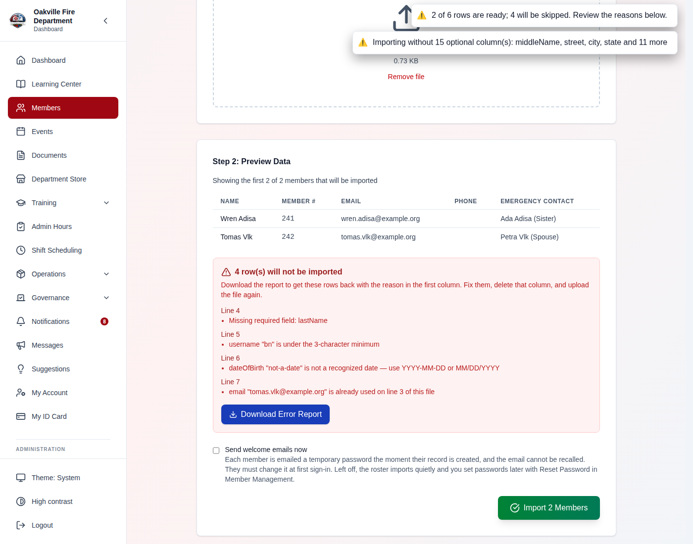
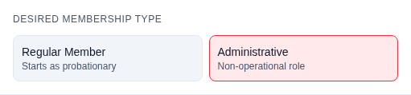
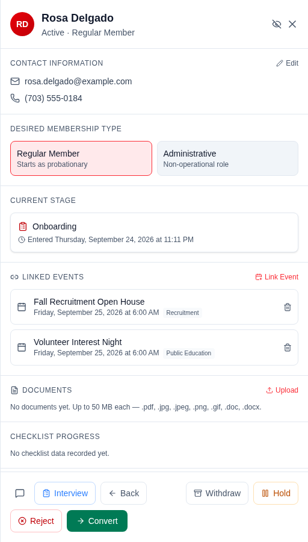
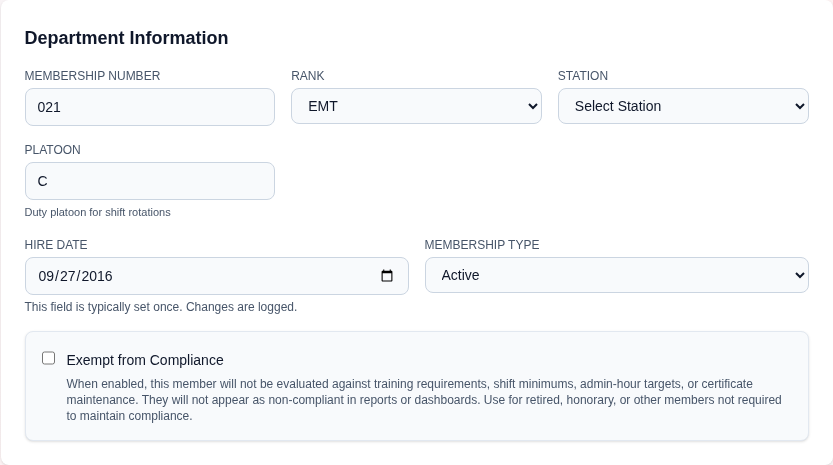
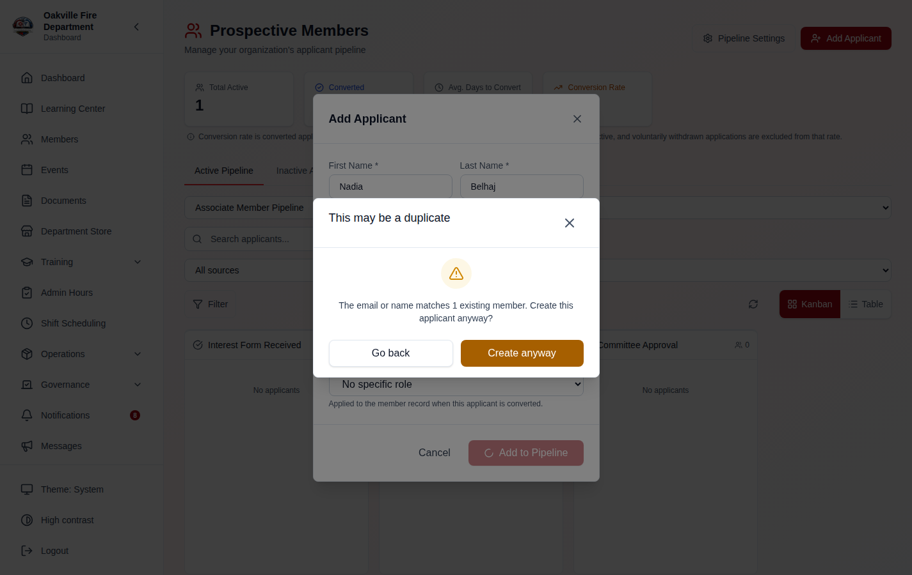
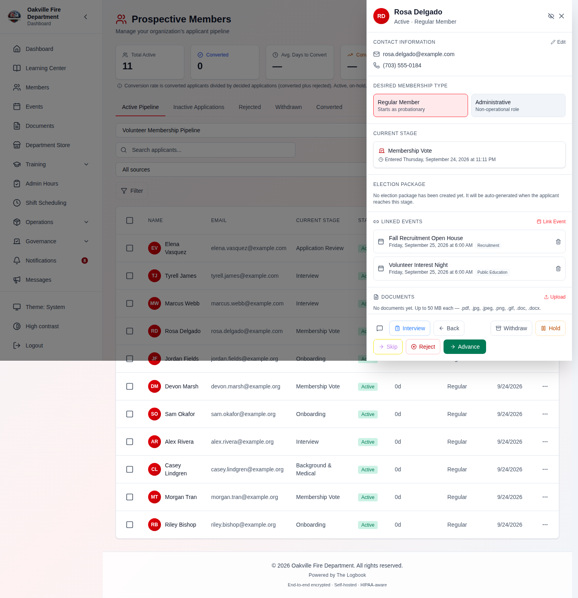
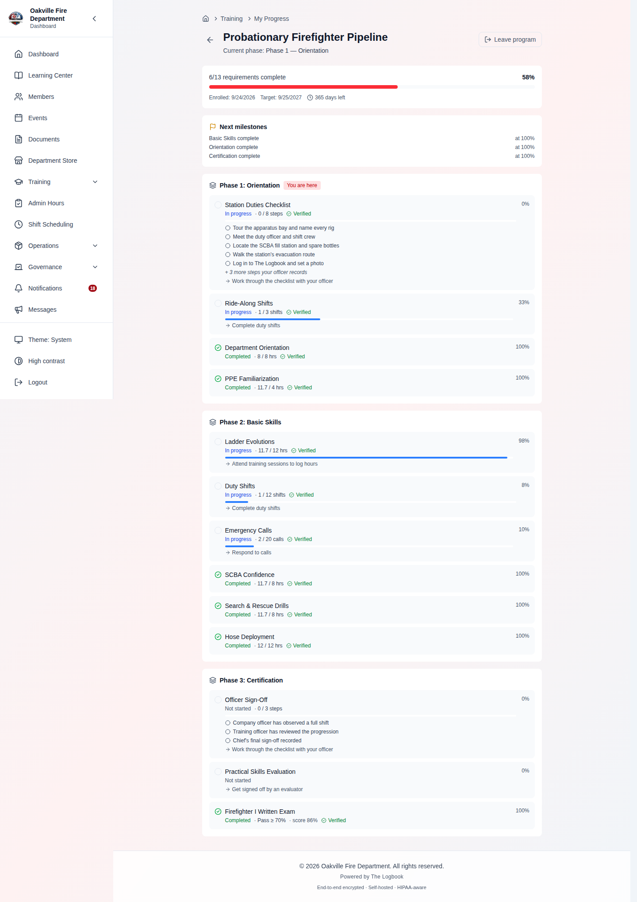
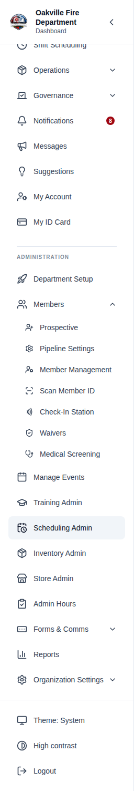
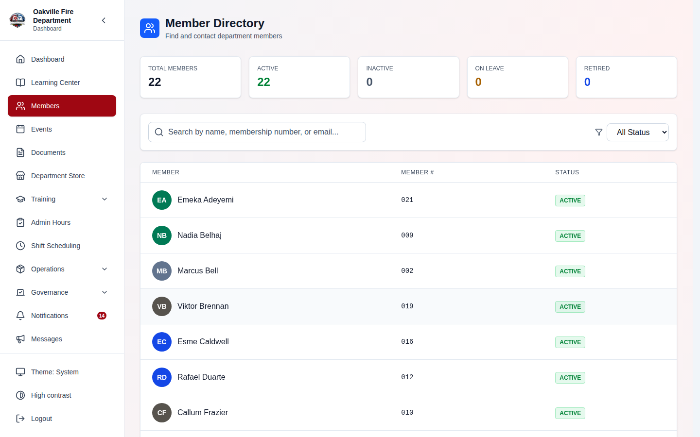

# Membership Management

The Membership module is the foundation of The Logbook. It manages your department's roster, member profiles, prospective member pipelines, membership tiers, and the full member lifecycle from application through retirement.

---

## Table of Contents

1. [Member Directory](#member-directory)
2. [Member Profiles](#member-profiles)
3. [Adding Members](#adding-members)
4. [Importing Members from CSV](#importing-members-from-csv)
5. [Member Admin Edit](#member-admin-edit)
6. [Member Audit History](#member-audit-history)
7. [Deleting Members](#deleting-members)
8. [Prospective Members Pipeline](#prospective-members-pipeline)
9. [Member Class and Member Status](#member-class-and-member-status-changed-2026-08-26)
10. [Rank and Qualification Are Different Things](#rank-and-qualification-are-different-things-2026-08-26)
11. [Member Status Management](#member-status-management)
12. [Leave of Absence](#leave-of-absence)
13. [Waiver Management](#waiver-management)
14. [Rank Validation](#rank-validation)
15. [Membership Tiers](#membership-tiers)
16. [Member Lifecycle Management](#member-lifecycle-management)
17. [EVOC Certification](#evoc-certification)
18. [Troubleshooting](#troubleshooting)
19. [Department Email Generation, Username Safety & Default Roles](#department-email-generation-username-safety--default-roles-2026-03-24)
20. [Realistic Example: New Member Onboarding](#realistic-example-new-member-onboarding-end-to-end)

Dated change notes follow the walkthrough: directory profiles and ID-card
scanner access, member ID cards and the check-in station, the profile gear
change, the roster as a directory, member-chosen visibility, platoon
assignments, and the Membership Coordinator rename.

---

## Member Directory

Navigate to **Members** in the sidebar to view your department roster.

The directory lists every current member, whatever their status, with their name, membership number and status, plus contact details where your department's contact-visibility setting allows. Officers with `members.manage` also see username, hire date and row actions. You can:

- **Search** by name, membership number or email (officers can also search by username)
- **Filter** by status (Active, Inactive, On Leave, Retired; officers with `members.manage` also get **Archived**)
- **Click** any member to view their full profile


**Member Statuses:**

| Status                    | Description                         |
| ------------------------- | ----------------------------------- |
| **Active**                | Currently serving member            |
| **Inactive**              | Temporarily not participating       |
| **Suspended**             | Account suspended by administration |
| **Probationary**          | New member in probationary period   |
| **On Leave**              | On an approved leave of absence     |
| **Retired**               | Retired from active service         |
| **Dropped (Voluntary)**   | Member who voluntarily left         |
| **Dropped (Involuntary)** | Member removed from the department  |
| **Archived**              | Fully processed departed member     |

### Printing Member Badges

Officers with `members.manage` can select members in the directory's desktop (table) view — the row checkboxes — then click **Print Badges** on the selection bar to open the shared label print page for those members. Choose a label size — any sticker/thermal printer (Dymo, Rollo, or a custom size) — and download a PDF or print. The badge barcode encodes the member's **membership number**. The chosen printer is remembered for your role, separately from the inventory/apparatus printers.


---

## Member Profiles

Click on any member in the directory to view their profile. The profile page includes:

**Header:** photo (with upload/change), name, rank and member type, username, membership number, position badges, an **ID Card** link, and — for officers with `members.manage` — a status control.

**Left Column:**

- **Training & Certifications** - Compliance summary (green/yellow/red, requirements met, hours this year, certifications) and recent training. Shown only to the member themselves and to `training.manage` holders
- **Administrative Hours** - Where the viewer can see them
- **Assigned Inventory** - Equipment currently assigned. Shown only to the member themselves and to `inventory.manage` holders

**Right Column:**

- **Contact Information** - Email, phone, mobile (editable by the member or officers). Which fields other members see depends on your department's [contact info visibility](./08-admin-reports.md#contact-info-visibility) setting and on what the member chose to share
- **Address** - Home address, where visible
- **Emergency Contacts** - Emergency contact list. **Visible only to leadership (`members.manage`) and to the member themselves** — the section is hidden entirely for everyone else, and no setting publishes it. Date of birth is restricted the same way
- **Membership** - Rank, member type, station, platoon and "Member since"; officers also see the status here
- **Service History** - Credited and prior length of service, stint by stint. Shown only to the member and to `members.manage` holders (see [Former Members Who Rejoin](#former-members-who-rejoin-2026-09-24))
- **Quick Stats** - Training, hours and equipment counts the viewer is allowed to see
- **Leave of Absence** - Any active leave periods (shown if applicable)

Position names appear as badges in the header; the permissions they carry are not shown on the profile.


### Profile Photo Upload

Members and officers can upload a profile photo:

1. Hover the **photo area** on the member's profile — **Upload** appears over
   it, or **Change** where there is already a photo. On a phone the control is
   always visible rather than waiting for a hover that cannot happen.
2. Choose an image file — **JPEG, PNG or WebP, under 5 MB**. Anything else is
   refused with the reason, before it is sent.

**The file uploads the moment you choose it.** There is no preview step, no
crop tool and no Save button: the picture is taken as it comes, so crop it
before you choose it if it needs cropping. **Remove photo** beside the avatar
takes it away again.

### Member Self-Edit

Members can edit their own limited profile fields directly from their profile page:

- Phone number, mobile number
- Personal email address
- Home address
- Emergency contacts
- Notification preferences

Click **Edit** in the heading of the relevant section to make changes. Officers with `members.manage` permission can edit all fields for any member.

> **Hint:** Members can edit their own contact information and notification preferences. Officers with the `members.manage` permission can edit any member's profile using the full Admin Edit page.

---

## Adding Members

**Required Permission:** `users.create` (plus `members.manage` to open the Members Administration hub)

Navigate to **Administration > Members > Member Management**, then click the **Add Member** tab.

1. Fill in the required fields: first and last name, membership number, home address (street, city, state, ZIP), primary phone, email, and a primary emergency contact (name, relationship, phone). The **username** is created automatically from the part of the email before `@`.
2. Optionally set middle name, date of birth, secondary phone, join date, membership type, rank, position, station, platoon and a secondary emergency contact.
3. Leave **Set initial password** unchecked to have a temporary password generated and emailed to the member, or check it to choose a password yourself (at least 12 characters) — no email is sent in that case.
4. Click **Save Member**.


> **Hint:** If you leave **Set initial password** unchecked, the system generates a temporary password and emails it to the member. If you set one yourself, no email is sent, so share that password with the member. Either way the member must change it at first login.

**Edge Cases:**

- If the email address is already in use, you will see an error. Each member must have a unique email within the department. If the email belongs to an **archived** member, you are told to reactivate that member instead of creating a duplicate.
- Membership numbers must also be unique.
- Because the username comes from the email, two addresses with the same part before `@` collide ("Username already exists").

---

## Importing Members from CSV

**Required Permission:** `users.create`

For bulk onboarding, you can import members from a CSV file:

1. Navigate to **Administration > Members > Member Management** and open the **Import Members** tab.
2. Download the **CSV template** to see the required column format.
3. Fill in the spreadsheet with your member data. **Delete the example row** —
   see the note below.
4. Upload the completed CSV file. Every row is checked immediately.
5. Review the results: how many rows will import, which will not, and why.
6. Decide whether to **send welcome emails** (off by default).
7. Confirm the import, watching the row counter. You can **Stop** part-way.
8. If any rows were rejected, download the **error report** and re-upload the
   corrected file.


**CSV Columns:** (the downloaded template contains all of them; column order does not matter)

| Column                                                                           | Notes                                                    |
| -------------------------------------------------------------------------------- | -------------------------------------------------------- |
| `firstName`, `lastName`                                                          | **Required**                                             |
| `email`                                                                          | **Required**, must be unique in the department           |
| `middleName`                                                                     |                                                          |
| `membershipNumber`                                                               | Must be unique. Leave blank to have one auto-assigned    |
| `username`                                                                       | Login name; defaults to the part of the email before `@` |
| `dateOfBirth`, `joinDate`                                                        | Format: `YYYY-MM-DD` or `MM/DD/YYYY`                     |
| `street`, `city`, `state`, `zipCode`                                             | Wrap any value containing a comma in double quotes       |
| `primaryPhone`, `secondaryPhone`                                                 |                                                          |
| `rank`, `station`, `platoon`                                                     |                                                          |
| `role`                                                                           | Must match a role name configured under **Roles**        |
| `emergencyName1`, `emergencyRelationship1`, `emergencyPhone1`                    | Supply all three or leave all three blank                |
| `emergencyEmail1`                                                                |                                                          |
| `emergencyName2`, `emergencyRelationship2`, `emergencyPhone2`, `emergencyEmail2` | Optional second contact, same rule                       |

Only `firstName`, `lastName` and `email` are enforced — a file containing just
those three columns imports successfully. Any column not in this list is
ignored, including `departmentId`, which older templates used as the name for
`membershipNumber` and which is still accepted.

Imported members are always created with **Active** status; there is no status
column. Adjust status afterwards from the member's profile: click their status to
open **Change Member Status**. If your file
_has_ a `status` column, the import now tells you it is being dropped when you
select the file, rather than letting it vanish behind a successful upload.

### Every Row Is Checked Before Anyone Is Created _(2026-08-07)_

Validation used to run **inside** the import loop and stop at the first problem
in a row. That meant a row with three bad cells took three upload-fix-upload
cycles, and row 21's problem only surfaced after rows 1–20 had already been
created — leaving you with a half-imported roster and a file you could not simply
re-upload.

Now the whole file is judged first. Rows that pass are imported; rows that fail
are reported and skipped. **Each row reports all of its problems at once**, and
each reason names the column and the offending value.

What is checked before anything is created:

| Check                                      | Example message                                                                               |
| ------------------------------------------ | --------------------------------------------------------------------------------------------- |
| Required fields present                    | `Missing required field: lastName`                                                            |
| Email shape                                | `email "5715551212" is not an email address — that looks like a phone number, …`              |
| Date format                                | `dateOfBirth "31/12/1990" is not a recognized date — use YYYY-MM-DD or MM/DD/YYYY`            |
| Field lengths                              | `rank is 104 characters long; the limit is 100`                                               |
| Username minimum (3 characters)            | Including a username **derived** from a short email local part — a column your file never had |
| Emergency contacts complete                | Names both columns by number                                                                  |
| `role` matches a configured role           | `role "Engine Operator" does not match any role configured under Roles — …`                   |
| Duplicates **inside the file**             | `email "…" is already used on line 14 of this file`                                           |
| Duplicates **against the existing roster** | `membershipNumber "214" already belongs to J. Alvarez in this organization — …`               |
| Row wider than the header                  | `Row has 21 values but the header has 19 columns, …`                                          |

The review reads the count back before anything happens — **"2 of 6 rows are
ready; 4 will be skipped"** — previews the rows that will import, and lists the
ones that will not **by their line number in your file**, each with the reason
in the words above. **Send welcome emails now** is off unless you turn it on,
and the button says how many members it is about to create.



A second notice names the optional columns your file left out — "Importing
without 15 optional column(s)" — which is information, not a fault: those
members import, with those fields empty.

### The Rejected-Rows Report

Failing rows download as a CSV: **your original row, unchanged**, with the
reasons in a leading `errorReason` column.

- It leads rather than trails so it cannot collide with a row that has more cells
  than the header — the very case it exists to explain.
- It holds **only** the failures, so the corrected file cannot collide with the
  members that did import. Fix the rows, re-upload the same file, done.
- If you **stopped** an import part-way, the rows never reached are listed as
  stopped — so the downloaded file is exactly the work left.

### Welcome Emails Are Off by Default for Imports

Creating a member emails them a temporary password and a login link
**immediately**, and an import
creates them by the dozen. Loading a roster for staging, or from a list with
stale addresses, used to put unrecallable mail in front of every one of them.

The review step now carries a **Send welcome emails** checkbox, unchecked by
default. Left off, the roster loads quietly and you issue credentials afterwards
from Member Management.

> **Add Member** — which creates one member deliberately — emails credentials by
> default, unless you check **Set initial password** and choose one yourself.

### Edge Cases Worth Knowing

- **Delete the template's example row.** The template ships a filled-in John Doe
  so the columns explain themselves. Leaving it in used to create a real member
  with a working temporary password. The importer now recognises its own example
  and rejects that row — first name, last name **and** email must all match, so a
  real John Doe on your roster is unaffected.
- **A shifted row is rejected, never guessed at.** An unquoted comma in an
  address pushes every later column one place along, so a phone number can land
  in the email field. The import rejects any row with more values than the header
  has columns, naming both counts. A _missing_ comma shifts the other way without
  adding values — the row's trailing cells are read as blank — so email columns
  are shape-checked too.
- **Line numbers account for quoted newlines.** A value containing a line break
  puts record 12 well below line 13; errors name the line the record actually
  started on, so you can find it.
- **Roles are resolved when you select the file, not row by row during the
  import.** A roster whose `role` column holds job assignments ("Engine
  Operator", "EMT") rather than configured role names imports **no roles at all**
  — worth knowing beforehand. If no roles are configured at all, the column is
  skipped silently, matching what the import does.
- **The roster collision check is best-effort.** If loading the existing roster
  fails, the check is skipped rather than blocking your upload — the server still
  rejects a genuine duplicate. Where your department **hides contact
  information**, emails are absent from that response, so the email dimension
  simply goes unchecked.
- **Any column outside the template is dropped**, and you are told which ones
  when you select the file.

> **Troubleshooting:** If rows fail validation, the results panel lists each failing row number and every reason for it, naming the column and value. Download the error report, fix those rows, and re-upload. Common problems include duplicate emails, a `role` that does not match a configured role name, a partially filled emergency contact, incorrectly formatted dates, and an unquoted comma inside an address.

---

## Member Admin Edit

**Required Permission:** `members.manage`

Open **Administration > Members > Member Management** and click **Edit** on the member's row to open the Admin Edit page at `/members/admin/edit/:userId`.

The Admin Edit page covers:

- **Personal Information** - Name, date of birth, personal email
- **Department Information** - Membership number, rank (dropdown from configured operational ranks), station (dropdown from configured stations), platoon, hire date, membership type, and the compliance exemption
- **Contact Information** - Phone and mobile; the organization email is shown read-only
- **Address**
- **Emergency Contacts** - Add, edit, or remove emergency contact entries

Status is not changed here: use the status control on the member's profile. Positions are assigned with **Manage Roles** on the member's row in Member Management.


> **Hint:** Rank and station fields use dropdowns populated from the organization's configured values, ensuring consistency across all member records.

---

## Member Audit History

**Required Permission:** `members.manage`

Open the member's Admin Edit page (above) and click **View History** at the bottom to see the full audit trail at `/members/admin/history/:userId`.

The audit history page shows a chronological list of all changes made to a member's record, including:

- **What changed** - Which field was modified (e.g., rank, status, station)
- **Who made the change** - The user who performed the edit
- **When** - Timestamp of the change
- **Details** - Expands the entry to show the rest of what was recorded

**Before and after values are shown for status and membership-type changes**
("Status changed: probationary → active"), which record both. A profile field
edit records _which_ fields were touched, not what they were before — so a rank
change reads "Member profile updated: rank" and the Details panel names the
field, but the previous rank is not kept.

Use **Filter by** to narrow the list. This matters more than it sounds: viewing
a member's page is itself an audited event, so an unfiltered history is mostly
"Member profile viewed" and the edits are buried among them.


> **Note:** Audit entries are only created for changes made after the audit history feature was deployed. Earlier changes will not appear in the history.

---

## Deleting Members

**Required Permission:** `members.manage`

To permanently delete a member:

1. Open **Members** and find the member's row (or the Members Admin hub's
   Member Management tab — both open the same dialog).
2. Click the **trash icon** in the row's Actions column (on the Member
   Management tab it is a **Delete** button). You cannot delete yourself, so the
   control is absent on your own row.
3. The **Remove Member** dialog opens on its **Deactivate** tab, which keeps the
   member's records. Switch to **Permanently Delete**.
4. Read the **Records affected** breakdown — training records, inventory items
   still issued to the member, and documents whose uploader would be cleared.
5. Type the member's name in the confirmation box as shown (capitalization does
   not matter), then
   click **Permanently Delete**. The button stays disabled until the name
   matches.

> **Corrected 2026-08-10.** This previously described a "Delete Member button
> at the bottom of the profile page" and a single-step confirmation. There is
> no such button on the profile or the Admin Edit page; deletion is a row
> action in the directory, and the dialog offers deactivation first.


**What gets deleted:**

- Member profile and all personal information
- Training records and certifications
- Inventory assignments (items are unassigned, not deleted)
- Event attendance records
- Shift assignments

**What is kept, with the member's name removed:**

- Records the member **created, approved, issued or uploaded** — documents,
  approvals, and similar attribution — keep the record and clear the reference.
  The impact preview no longer claims uploaded documents are deleted; they are
  not.

> **Important:** Deletion is permanent and cannot be undone. If you may need the member's records later, change their status to **Dropped** or **Retired** instead. A dropped member is archived automatically once their department property is resolved, and can be reactivated.

> **Archived members can be reactivated** _(2026-09-24)_. On **Members**, choose
> **Archived** in the status filter and use the **Reactivate** button on the row,
> or open the member's profile and click their status. Archiving itself happens
> automatically once a dropped member has returned all department property and
> their departure clearance has been completed; there is no manual Archive button (`POST /users/{id}/archive` exists for the API).
> Deactivating (the Delete dialog's default) is different: a deactivated member is
> removed from the list and cannot currently be restored from the app.

### When Deletion Is Refused _(2026-08-07)_

Some records cannot have their owner cleared without falsifying who requested or
filed them — **budgets, purchase requests, expense reports and IP exceptions**
among them. If the member owns any of these, permanent deletion is **refused**
with a message explaining why. It does not list the specific records.

That is not a failure to work around. The correct route for a member with
financial history is to **archive, then anonymize** them: it strips their
personal information while leaving those records owned, so the department's
financial trail stays intelligible. See
[Anonymizing a Former Member](#anonymizing-a-former-member-2026-09-25).

### Anonymizing a Former Member _(2026-09-25)_

Anonymizing permanently removes a departed member's personal information while
keeping the department's record of what they did.

1. Open the member's profile. They must be **Dropped** (voluntary or
   involuntary) or **Archived**; change their status first if not.
2. In the **Membership** card, under **Status**, select **Anonymize member**.
   It appears only to people with `members.manage`, never on your own profile,
   and not for a Retired, Inactive or Active member — the server refuses those.
3. Read what is removed and what is kept, type the member's name to confirm,
   and select **Anonymize**.

**Removed:** name, email, phone numbers, address, date of birth, photo,
emergency contacts, sign-in credentials, medical screening details, leave and
waiver reasons, and their original application.
**Kept:** training, attendance, hours, equipment custody and dues history,
linked to a placeholder named "Former Member". Audit logs and election records
are never rewritten.

> **Warning:** Anonymizing cannot be undone. The member also leaves the
> roster — like a deactivated member, they no longer appear anywhere in the app
> and cannot be reactivated.

> **If you tried to permanently delete a member before 2026-08-07 and got
> "Unable to permanently delete the member" with no detail, that was this — the
> page was discarding the server's explanation.** It now shows you the reason. Two related bugs were fixed at the same time: a
> member who had ever created _any_ record could fail deletion outright, and
> **saving a member's roles silently stripped all of their positions**. If a
> member's positions disappeared after a role save, re-add them; the save now
> keeps them.

---

## Prospective Members Pipeline

**Required Permission:** `prospective_members.manage` (printing applicant badges needs only `prospective_members.view`)

The pipeline manages people who are interested in joining but are not yet full members. Navigate to **Administration > Members > Prospective** to access the pipeline.

### Pipeline Views

The pipeline offers two views:

- **Kanban Board** - Drag a card one stage forward (Advance) or one stage back (Back)
- **Table View** - Traditional list with sorting and filtering


> **The board shows the whole pipeline** _(2026-08-08)_. It previously drew from
> one page of applicants (25), so a department with a larger intake saw a board
> silently assembled from a fraction of them. It now loads up to 200 and states
> plainly what it is not showing beyond that. Full detail, including what changed
> about bulk actions and the "Advance" button, is in
> [Prospective Members Pipeline](./15-prospective-members.md#the-kanban-board).

### Working with Prospects

1. **Add an Applicant** - Click **Add Applicant** and enter their first and last name, email, phone, **membership type** (Regular Member or Administrative) and, optionally, a **Target Role** to apply when they are converted. Click **Add to Pipeline**.
2. **Complete Steps** - Each pipeline stage has steps (action items, checkboxes, notes). Mark steps as completed as the prospect progresses.
3. **Advance** - Move the prospect to the next stage when all required steps are complete. If the next stage is an automated email stage, the configured email is sent automatically. If the prospect is already at the final stage, **Advance** now reports that there is nowhere to move them _(2026-08-08)_; it used to say "Advanced" and change nothing, while still writing an entry into the audit log.
4. **Back** - If a prospect needs to return to a previous stage (e.g., missing documents discovered after advancing), click **Back** in the prospect's detail drawer. The previous stage's progress is reset to allow re-completion. The button is absent while the prospect is still on the first stage, since there is nowhere to go back to.
5. **Upload Documents** - Attach application documents, ID copies, or other requirements to the prospect's record. Uploaded files are now stored on the prospect's record and can be downloaded later. Each file may be up to **50 MB**; allowed types are PDF, Word (DOC/DOCX), JPEG, PNG, and GIF.

The **Documents** area sits in the applicant's drawer, below Linked Events.
**Upload** opens the file picker; each file that lands is listed with its type,
its size and the date it arrived, and its name is the link that downloads it.
The bin removes one filed by mistake, after asking.


> **The area is new** _(2026-08-11)_. The upload endpoint, the download endpoint
> and the client methods for both had been in place since documents were added,
> but nothing rendered them — so a file could be attached only by calling the
> API directly, and no officer could read one back.

Uploading and removing are offered on **active** applicants only. A withdrawn or
rejected applicant's paperwork stays readable — it is part of the record of the
decision — but is no longer editable.

6. **Convert to Member** - When the applicant is on the last stage, click **Convert** in the drawer. In the **Convert to Member** dialog, the membership type is pre-filled from the applicant's desired type.

The drawer's action bar carries all of these, left to right: **Interview**,
**Back**, then **Withdraw**, **Hold**, **Skip**, **Reject** and **Advance**.
It appears for active applicants only. **Back** is absent on the first stage; on
the final stage **Skip** is not offered and the last button reads **Convert**
instead.


### Desired Membership Type

Prospective members can indicate their preferred membership type when applying:

| Type               | Description                                         |
| ------------------ | --------------------------------------------------- |
| **Regular**        | Standard active membership (starts as probationary) |
| **Administrative** | Non-operational administrative role                 |

- The desired type is captured on the **Membership Interest Form** template (if used as the intake form)
- Coordinators can change the desired type at any pipeline stage from the
  prospect's detail drawer: **Desired Membership Type** there is a pair of
  cards — Regular Member and Administrative — and clicking the other one
  switches it. There is no badge or dropdown on the Kanban card itself
- During conversion to full member, the system pre-fills "Regular" or "Administrative" based on the prospect's selection
- Both start with an Active account. A Regular applicant becomes a probationary member (membership type); an Administrative applicant becomes an administrative member



The selected card is outlined and **not clickable** — there is nothing to
confirm and nothing to undo, because clicking the other card is both the change
and its reversal.

> **Edge case:** If a prospect's desired membership type is changed from "Regular" to "Administrative" after they have already passed an election/vote stage, the system does not retroactively invalidate the vote. The coordinator should verify that the voting requirements for administrative members were met.

### The applicant's drawer, end to end

Everything about one applicant is in the drawer, in this order: who they are and
how to reach them, the membership type they asked for, the stage they are on and
when they reached it, the events they are booked into, their documents, then any
sections for the current stage type, their progress and stage history, notes, the
activity log, and finally the action bar. On the **last** stage the action bar's final button reads **Convert**
rather than Advance — the same button, naming what it does there.



> **Checklist Progress reads "No checklist data recorded yet" for everyone.**
> Nothing in the application records which checklist items are done — see
> `docs/KNOWN_LIMITATIONS.md`. Track a checklist stage's items in the stage
> notes until that is built, and leave the stage's item list unconfigured.

### Printing Applicant Badges

Select applicants in the pipeline (the checkboxes), then click **Print Badges** on the selection bar — useful for sign-in/check-in at a recruitment or outreach event. It opens the shared label print page; pick a label size and download a PDF or print. The badge barcode encodes the applicant's **status token** (the same scannable code used for public application-status checks), so a scanned badge ties back to that applicant. The outreach team's printer choice is remembered for their role, separately from other modules.


### Pipeline Stage Types

The pipeline supports **twelve** stage types, each tailored to a specific step
in the membership process. The stage type is chosen from a grid of tiles in the
Add Pipeline Stage / Edit Stage dialog, and picking one swaps the configuration panel
below it.

| Stage Type                | Purpose                                | What Happens                                                                                                                                                                                                                       |
| ------------------------- | -------------------------------------- | ---------------------------------------------------------------------------------------------------------------------------------------------------------------------------------------------------------------------------------- |
| **Form Submission**       | Collect information from the applicant | Links to a form from the Forms module. Can auto-advance when the form is submitted                                                                                                                                                 |
| **Document Upload**       | Collect required documents             | Applicant uploads documents (ID, background check, etc.). Can auto-advance when all documents are uploaded                                                                                                                         |
| **Meeting**               | Schedule interview/orientation         | Requires attendance at or scheduling of a meeting; links to upcoming events                                                                                                                                                        |
| **Election / Vote**       | Membership vote                        | Advancing an applicant onto this stage with **Advance** (or by dragging the card) creates an election package for the Elections module. Advance All, Skip and auto-advance do not; create the package from the drawer in that case |
| **Manual Approval**       | Coordinator sign-off                   | An admin or designated role manually marks this stage as complete                                                                                                                                                                  |
| **Enable Status Page**    | Turn on public tracking                | Stores an enable/disable setting, but nothing acts on it yet. Whether applicants can use the public status page is set for the whole pipeline in Pipeline Settings > **Public Application Status Page**                            |
| **Automated Email**       | Send a notification email              | Sends a configurable email when the prospect reaches this stage. Configure subject, welcome message, FAQ link, meeting details and custom sections                                                                                 |
| **Reference Check**       | Collect references                     | Collect and verify personal or professional references                                                                                                                                                                             |
| **Checklist**             | Multi-item sign-off                    | A checklist of items (orientation, gear issue, etc.) rather than a single approval                                                                                                                                                 |
| **Interview Requirement** | Require N interviews                   | Requires a set number of interviews before the prospect can advance                                                                                                                                                                |
| **Multi-Signer Approval** | Several roles must agree               | Requires multiple designated roles to all sign off                                                                                                                                                                                 |
| **Medical Screening**     | Physical or medical clearance          | Requires a physical exam or medical clearance before advancing                                                                                                                                                                     |

> **Corrected 2026-08-10.** This table previously listed seven types, one of
> which — "Form Dropdown" — has never existed; it described the form picker
> _inside_ the Form Submission stage's configuration panel as though it were a
> stage type of its own. Five real types were missing.

Above the grid, a row of **Quick Presets** (Application Form, Background Check
Docs, Chief Interview, President Interview, Membership Vote, Welcome Email,
Coordinator Approval, Reference Check, New Member Orientation, Interview Panel,
Officer Sign-Off, Physical Exam) fills in the name, description, type and a
starting configuration in one click.


### Auto-Advance

Form Submission, Document Upload, Meeting, Checklist, Interview Requirement, Medical Screening and Reference Check stages can each be set to **auto-advance** the applicant when the stage's condition is met:

1. Open the stage (pencil icon in the Pipeline Builder)
2. Tick the stage's **Auto-advance when…** checkbox — on by default for form stages, off for the rest
3. Click **Update Stage**; the change is saved immediately

When enabled, the prospect automatically moves to the next stage without coordinator intervention.

> **Edge case:** Auto-advance on the final stage converts the applicant only if the pipeline has auto-transfer on approval enabled. That setting defaults to off and can only be changed through the API, so a pipeline set up in the app always needs a coordinator to click **Convert**.

### Automated Email Stages

When a prospect advances to an automated email stage, the system sends the configured email immediately. Configure the email in the stage settings:

- **Email Subject** — customize per stage
- **Welcome Message** — optional introduction section
- **Membership FAQ Link** — link to your department's FAQ page
- **Next Meeting Details** — the event type plus free text for date, time and location
- **Application Tracker Link** — a link to the prospect's public status page. It
  requires the public status page to be enabled, and says so under the checkbox
- **Add custom section** — titled content blocks (e.g. "What to Bring",
  "Parking Information")

Each section other than the subject is a checkbox: tick it to include it, and
its fields appear underneath. The sections have drag handles and can be
reordered, and **Show Preview** at the foot of the panel renders the assembled
email. The prospect's name is used as the greeting automatically — there is no
field for it.


> **Edge case:** If email is not configured (Settings > Email) or the send fails, no email goes out and the applicant **stays on the automated email stage** instead of moving past it. An applicant sitting on an email stage is the sign to check your email settings.

### Pipeline Configuration

Open **Prospective Members** and click **Pipeline Settings** in the page header
(the direct route is `/prospective-members/settings`). The page opens on a
"Select a pipeline" placeholder — choose one from the list on the left before
any of the configuration below appears. From there you can:

- Create and customize pipelines
- Add, remove, or reorder stages (twelve stage types available)
- Configure auto-advance, email templates, form links, and event linking per stage
- Set a default pipeline for new prospects
- Turn the pipeline's **Public Application Status Page** on or off

Auto-transfer on final-stage approval (`auto_transfer_on_approval`) has no control on this page; it can only be set through the API.

> **Hint:** You can create multiple pipelines for different scenarios (e.g., "Standard Application", "Lateral Transfer", "Junior Firefighter").

---

## Member Class and Member Status _(changed 2026-08-26)_

**A member record now states two things where it stated one.**

Until August 26 a single "membership type" field carried two independent facts,
and you could only ever record one of them:

| Field             | Answers                                  | Values                                                              |
| ----------------- | ---------------------------------------- | ------------------------------------------------------------------- |
| **Member class**  | What kind of member is this?             | operational, administrative, social                                 |
| **Member status** | Where are they on the membership ladder? | prospective, probationary, regular, life, retired, honorary, junior |

Because they shared a field, there was **no way to record a probationary
treasurer**, and **nothing said whether a life member still rides**.

> **Integrators: the status enum has seven values, not the five common ladder
> stages.** `honorary` and `junior` are valid statuses too — the backfill
> records an honorary member as the **social class plus honorary status** — so
> a client generated from a five-value vocabulary will reject or erase
> legitimate records.

### What this changed for elections

Elections is where the fused field showed most: `ElectionService` could only
answer "is this member operational" by testing for one specific value.

**What actually changed, and one of the two narrows eligibility.** The built-in
voter categories **keep their legacy meaning**: `operational` still requires
operational class **and** regular standing. (An earlier version of this change
read the class alone; it was reverted the same day because it admitted
probationary and retired members to a restricted ballot.) The two real changes
are that **a life member now receives a `regular` ballot** — with one fused
field, "life" and "regular" were competing values and they could not — and that
**every status category now also requires the operational class**, so an
administrative member with regular standing no longer receives ballots
restricted to active or life members.

**If your bylaws intend administrative members to vote on items restricted to
active or life members, use an override or an explicit voter list** — that
route is now closed to them by category alone.

### Honorary members are now the "social" class

That is not a new judgement about your honorary members — it is what the system
already did with them. Honorary has always been grouped with administrative and
retired when deciding who gets shift access, so mapping them anywhere else
would have **widened** shift access on upgrade.

### What integrators need to know

The old `membership_type` field is still present, still correct, and still
returned by the API. It is now **derived** from the class/status pair rather
than being the authority. If an integration **writes** it, move to the pair —
the derivation is deliberately lossy in one direction, because the old
vocabulary cannot express an administrative probationer.

> **No screenshot change here.** The class/status split has **no UI surface**:
> the member screens still show a single Membership Type selector and the pair
> is derived from its value. Existing captures of the profile, the create/edit
> form and the Members administration list are current. The only place a user
> can see this change is a **ballot recipient list**.

### Administrative members no longer hold an operational rank

An operational rank is a chain-of-command position and it **carries permissions
with it**. Nothing previously stopped a member from being Administrative _and_
Fire Chief at once, so an administrative member could hold operational grants
that role was never meant to have.

The upgrade **clears the operational rank of every administrative member**, and
that does not reverse — nothing recorded which ranks were cleared, so restoring
them would also restore ranks an officer cleared deliberately.

**You cannot simply set the rank again, and that is deliberate.** The API
refuses the administrative-class/rank pair outright (400), the edit UI disables
the rank control for an administrative member, and moving a ranked member into
the administrative class clears the rank rather than rejecting the save. A rank
carries chain-of-command permissions with it, which is exactly what an
administrative member is outside of.

If somebody genuinely holds an operational rank, **the fix is their class, not
their rank**: move them out of the administrative class first, then set the
rank.

> **One of the two routes into the administrative class was not doing this**
> _(fixed 2026-09-14)_**.** Changing a member's standing through the
> **membership type** action validated the submitted value against your
> department's configured membership tiers — and `administrative` is a member
> _class_, not a tier, so it was rejected before the rank-clearing step could
> run. The check only bit where a tier ladder exists, which is every department
> onboarded since one began being seeded at creation, so in practice the
> enforcement described above was reachable on that route almost nowhere.
>
> The route now accepts both vocabularies: your configured tier ids **and** the
> seven membership class and status words. **Nothing became more permissive** —
> a value in neither vocabulary is still refused, and the rank-clearing this
> section describes is what the fix restored rather than removed.
>
> **No stored record was changed and no action is needed.** The other route into
> the administrative class — the member profile's class/status pair — always
> cleared the rank correctly, so a member moved that way was never affected.

---

## Rank and Qualification Are Different Things _(2026-08-26)_

A **rank** says where somebody sits in the chain of command. A
**qualification** says what they are trained to do. They used to be the same
field, so a **Captain who is also a Paramedic** — an entirely ordinary member
of a volunteer department — had nowhere to be recorded as both.

The standards already draw the line: Firefighter I/II is NFPA 1001, apparatus
operator is NFPA 1002, the officer ladder is NFPA 1021, and EMT and Paramedic
are EMS credentials on a separate track again.

**The other half of the reason: qualifications expire and ranks do not.** Shift
eligibility reads a qualification's expiry **as of the shift date**, not as of
today — the same rule EVOC certifications already use for drivers. A card that
is current when the roster is built and expired when the truck rolls qualifies
nobody to be on that truck.

`emt` is now **both a rank code and a qualification code, meaning two different
things on purpose.** If your agency uses EMT as a line rank, carry on. If you
want to record who holds a current EMT card, that is the qualification. Neither
implies the other, and you may use either or both.

**Nothing was inferred from your existing records.** The qualification list
starts empty. A department that recorded somebody as an EMT _rank_ has said
where they sit, not which card they hold or when it expires — and inventing an
expiry date would be worse than having none.

> **Qualifications are recorded through courses, not entered directly.** Set
> **Certifies** on a course in the Course Library, and recording a member's
> completion of that course creates or renews the qualification. There is **no
> panel for entering, editing or expiring one on its own** — so a card a member
> has held for years needs a training record to match, an incorrect expiry is
> corrected by **editing the training record that produced it** — never by
> filing a second completion, which would invent training history that never
> happened — and setting **Certifies** on a
> course does **not** backfill records already filed against it.
>
> Because shift eligibility reads the expiry **as of the shift date**, a stale
> or missing qualification decides who may be rostered — it is not cosmetic.

---

## Member Status Management

**Required Permission:** `members.manage`

Officers change a member's status from the member's profile page.

> **Creating a new member was completely broken** between the August 26 change
> and its fix on August 27 — every attempt failed with a server error, because
> the password, initial roles, welcome-email option, mailing address and
> emergency-contact fields had been dropped from the create form. All are back.

### Changing a Member's Status

1. Navigate to the member's profile.
2. Click the **status badge** beside the member's name, or the pencil next to
   **Status** in the Membership panel. Both open the same dialog.
3. Pick the new status from **New Status**. The list holds eight statuses:
   Active, Inactive, Suspended, Probationary, Leave, Retired, Dropped
   Voluntary and Dropped Involuntary. **Archived** is not offered: a dropped
   member is archived automatically once their property is returned and their
   departure clearance is completed. Not every
   move is allowed — a retired member can only return to Active or Inactive, and
   a dropped member only to Probationary or Active — and the dialog shows an
   error for one that is not.
   When the member is dropped or retired and you pick a status that brings them
   back, the dialog also asks how their **earlier service** counts (**Continue
   prior service** or **Restart at zero**, with your department's default marked)
   and for a **Return date** — see
   [Former Members Who Rejoin](#former-members-who-rejoin-2026-09-24). On an
   **archived** member the status control opens a **Reactivate Member** dialog
   instead.
4. Optionally give a **reason**. The field is not required.
5. Click **Update Status**. It stays disabled while the selection still matches
   the member's current status.

Choosing either drop status adds a note to the dialog: dropping a member
generates a property return report and may send an email notification. Both
happen automatically — the dialog has no per-change options for them.

> **Corrected 2026-08-10.** This previously described a return deadline,
> custom instructions and a "send notification" toggle inside the dialog. None
> of the three exists; the dialog holds a status dropdown, an optional reason,
> the drop note above, and — when bringing a member back — the earlier-service
> choice.


> **The last administrator cannot be removed** _(2026-08-01)_. If the member
> you are changing is the only remaining active person who can manage members,
> the system refuses the change and asks you to grant that permission to
> somebody else first.
>
> This applies to status changes, archiving, deletion, and removing the
> position that carries the permission. It matters because every status other
> than Active fails the sign-in check — so setting the only administrator to
> Inactive locks the whole department out of its own member tools on the very
> next request, and getting back in needs someone with database access.

### Property Return Process

When a member is dropped, the system automatically:

1. Generates a **property return report** listing all assigned equipment and saves it to Documents
2. Emails the report to the member (and any CC recipients your drop-notification settings name)
3. Opens a **departure clearance** to track outstanding items
4. Archives the member automatically once every item is returned **and** the departure clearance has been completed

The 30- and 90-day reminder emails are sent only when
`POST /users/property-return-reminders/process` is called; nothing runs it on a
schedule.

**Reminders.** A daily scheduled task emails the member when they pass **30
days** and again at **90 days** since the drop with property still out, and
copies the department's administrative officers. Each run sends a member at
most one reminder — the latest mark they have passed — so a member first
picked up at day 100 receives the 90-day reminder only, never a late 30-day
one. A reminder already sent is never repeated.

> **Hint:** Overdue property returns are tracked by the API
> (`GET /users/property-return-reminders/overdue`) but **have no screen** as of
> 2026-09-24. The Inventory module's members page shows an "Overdue Returns"
> figure, which counts inventory checkouts rather than offboarding property, so
> it is not a substitute. See
> [KNOWN_LIMITATIONS.md](../KNOWN_LIMITATIONS.md#member-lifecycle--the-page-that-was-documented-but-never-built-2026-08-08).

---

## Leave of Absence

**Required Permission:** `members.manage` to view or deactivate a leave.
Creating one also requires `scheduling.assign`, because a leave cancels the
member's shift assignments inside it.

When a member takes a leave of absence, their time away should be recorded so that rolling-period training and shift requirements are adjusted. Months during a leave are excluded from the denominator when calculating compliance.

### Managing Leaves

Navigate to **Members > Admin > Waivers** — the
[Waiver Management](#waiver-management) page. Leaves of absence are created and
listed there, alongside training waivers.

> **Corrected 2026-08-08.** This previously said to open a "Member Lifecycle
> Management" page and select a "Leave of Absence" tab. That page does not exist.
> Waiver Management is an odd home for this and is where it actually lives — the
> two are closely related (a leave auto-links a training waiver), which is
> presumably why.

1. Open the **Create Waiver** tab.
2. Select the **member** from the dropdown.
3. Choose the **waiver type**: Leave of Absence, Medical, Military, Personal, Administrative, New Member, or Other.
4. Under **Applies To**, tick which requirements the leave suspends — training, meeting attendance, shifts, or all three.
5. Set the **start date** and **end date**, or tick **Permanent (no end date)**.
6. Optionally provide a **reason**.
7. Click **Create Waiver**.

It is a tab on that page, not a modal, and the button reads **Create Waiver** rather than "Add Leave of Absence" — a leave of absence is a waiver type, not a separate record.


### How Leave Affects Requirements

For rolling-period requirements (e.g., "12 hours of training over 12 months"):

- If a member has a 3-month leave, the system adjusts the requirement to 9 hours (12 x 9/12)
- Only **full calendar months** fully covered by the leave are excluded
- Partial months still count (so the member gets credit for time they were active)

### Viewing Leaves

- **Waiver Management** lists active leaves on its **Active Waivers** tab; the
  **Training Waivers** officer view lists them too
- Individual member profiles show active leaves in the right sidebar, read-only
- For historical records, open the **All Waivers** tab and choose the
  **Past/Inactive** filter

> **Hint:** Deactivating a leave does not delete it -- it becomes inactive and remains in the history, under **All Waivers → Past/Inactive**.

> **⚠️ You cannot edit a leave from any screen** _(verified 2026-09-24)_. You
> can cancel one with **Deactivate** on the Active Waivers tab, which also
> deactivates its linked training waiver. Changing a leave's dates is API only:
> `PATCH /users/leaves-of-absence/{id}` exists, but no screen calls it.
>
> **Check the dates before you save.** A leave pro-rates the member's hours,
> shift and call requirements, so a wrong end date quietly changes their
> compliance. To correct one, deactivate it and create it again. Tracked in
> [KNOWN_LIMITATIONS.md](../KNOWN_LIMITATIONS.md#member-lifecycle--the-page-that-was-documented-but-never-built-2026-08-08).

### LOA and Training Waiver Auto-Linking

When a Leave of Absence is created, the system **automatically creates a linked training waiver** with matching dates. This means:

- You do **not** need to separately create a training waiver after creating an LOA
- If the LOA dates are updated, the linked training waiver dates sync automatically
- If the LOA is deactivated, the linked training waiver is also deactivated
- To opt out of auto-linking for a specific leave, tick **Meeting Attendance** and/or **Shift Requirements** under **Applies To** and leave **Training Requirements** unticked (this sets `exempt_from_training_waiver` on the leave)

> For detailed technical documentation on how waivers adjust training compliance, see [Training Waivers & Leaves of Absence](../../backend/app/docs/TRAINING_WAIVERS.md).

---

## Waiver Management

**Required Permission:** `members.manage`

Navigate to **Members > Admin > Waivers** to access the unified Waiver Management page. This page consolidates all waiver types into a single interface.

### Tabs

| Tab                | Purpose                                                     |
| ------------------ | ----------------------------------------------------------- |
| **Active Waivers** | View all currently active waivers across the department     |
| **Create Waiver**  | Create a new waiver for a member                            |
| **All Waivers**    | View full history including expired and deactivated waivers |

### Creating a Waiver

1. Click the **Create Waiver** tab.
2. Select the **member** from the dropdown.
3. Under **Applies To**, tick any of **Training Requirements**, **Meeting Attendance** and **Shift Requirements**. What you tick decides what is created, and the text under the checkboxes says which:
   - **Training plus meetings and/or shifts** — a Leave of Absence with a linked training waiver. This is the most common choice.
   - **Training only** — a standalone training waiver, with no leave; meeting attendance and scheduling are unaffected.
   - **Meetings and/or shifts only** — a Leave of Absence that opts out of the training waiver, so training requirements are not adjusted.
4. Select the **leave type** and set the **date range**.
5. Optionally provide a **reason**.
6. Click **Create Waiver**.


### Training Waivers Officer View

Training officers can also view training-specific waivers from **Training Admin > Dashboard > Training Waivers** tab. This view includes:

- Summary cards showing Active, Future, Expired, and Total waiver counts
- Filterable table with status badges (Active, Future, Expired, Deactivated)
- Source tracking showing whether each waiver was auto-created from an LOA or manually created
- Links back to the full Waiver Management page

---

## Rank Validation

**Required Permission:** `members.manage`

The rank validation feature helps identify members whose rank does not match any of the organization's configured operational ranks.

### How It Works

The system compares each current member's rank against the rank codes the organization recognizes — its configured operational ranks plus the built-in defaults. A rank that does not match a code exactly, including one that differs only in capitalization or spacing, is flagged. Archived, retired and dropped members are not checked.

### Viewing Rank Mismatches

Rank validation results appear on **Members Admin → Settings → Operational Ranks**. A warning lists each member whose rank is unrecognized, with the rank value they currently hold.

### Resolving Mismatches

1. Navigate to the flagged member's profile or Admin Edit page.
2. Use the **rank dropdown** to select the correct operational rank.
3. Save the changes.

> **Hint:** If a member's rank is legitimate but not in the system, add it under **Members Admin → Settings → Operational Ranks** before correcting individual member records.

---

## Membership Tiers

**Required Permission:** `members.manage`

Membership tiers classify members by their years of service and grant benefits like voting eligibility, office-holding rights, and training exemptions.

### Configuring Tiers

Open **Members Admin → Settings → Membership Tiers**
(`/members/admin/settings/tiers`); the same editor is also a step in initial
setup. There you can add, rename, reorder and remove tiers, set each tier's years
of service and benefits, turn **Advance members automatically by years of
service** on or off, and choose what happens **When a former member rejoins**.
Click **Save tiers** to apply. A tier that members currently hold cannot be
removed or renamed until they are moved to another one.

> _Corrected 2026-09-24:_ this section previously said tiers were API only and
> had no screen. The screen has existed since the tier editor shipped.

The configuration is stored in the organization's settings under
`membership_tiers`, and the API is:

| Method  | Endpoint                                  | Permission       |
| ------- | ----------------------------------------- | ---------------- |
| `GET`   | `/api/v1/users/membership-tiers/config`   | `members.manage` |
| `PUT`   | `/api/v1/users/membership-tiers/config`   | `members.manage` |
| `POST`  | `/api/v1/users/advance-membership-tiers`  | `members.manage` |
| `PATCH` | `/api/v1/users/{user_id}/membership-type` | `members.manage` |

Each tier carries:

- A **tier id** and **name** (e.g. `senior` / "Senior Member")
- The **years of service required** for automatic advancement
- **Benefits**: voting eligible, can hold office, training exempt, requires
  meeting attendance for voting

**Related behaviour:**

- **Changing one member's tier** is done on the member's **Admin Edit** page
  (`/members/admin/edit/:userId`) with the membership type field. It is separate
  from the profile's status control.
- **Validation.** If tiers _are_ configured, a tier change is rejected unless the
  target tier id is one of them. If none are saved, any value is accepted — so an
  unconfigured department has membership types that nothing checks.
- **Auto-advancement** runs automatically on the first of each month (see below).
  `POST /users/advance-membership-tiers` also runs it on demand, but no screen
  calls that endpoint.

### Auto-Advancement

Auto-advancement promotes each active or probationary member to the highest tier
their **credited years of service** qualify them for. It runs on the first of each
month (`membership_tier_advance`), when **Advance members automatically by years
of service** is on under **Members Admin → Settings → Membership Tiers**.
_(Corrected 2026-09-24: this section previously said no scheduled job existed.)_

A member is only moved up the ladder they are already on: someone whose current
membership type is not one of the configured tiers is skipped, and nobody is
moved down.

Credited service is the time a member was actually in the department:

- A member who has never left is credited from their **hire date**, exactly as
  before.
- A member who was dropped or retired and later came back is not credited for
  the time away. Each continuous stint of membership is recorded in the
  member's **Service History** card on their profile.
- Leave of absence, suspension and inactive status are still membership, so they
  keep counting.

### Former Members Who Rejoin _(2026-09-24)_

Bringing a former member back opens a new stint: **Reactivate** for an archived
member, or changing a dropped or retired member's status back to Active,
Probationary or Inactive. The dialog asks how their earlier service counts:

| Choice                     | Credited service                                     | Earlier stints                                |
| -------------------------- | ---------------------------------------------------- | --------------------------------------------- |
| **Continue prior service** | Earlier stints plus the new one, minus the time away | Keep counting                                 |
| **Restart at zero**        | The new stint only                                   | Kept on record and shown as **prior service** |

The department's default is set under **Members Admin → Settings → Membership Tiers → When a former member
rejoins**; the officer can choose the other option for any one member. The dialog
also takes the **return date**, and — for a member whose earlier service was never
recorded — the **last day of previous service**, pre-filled from their last status
change.

**Service History card.** Visible to the member and to anyone with
`members.manage`, since it records how a member left. Members-managers can
**Edit** it to add stints from before this was tracked, correct dates, or mark a
stint as not counted. The list is saved as a whole and must be consistent: stints
may not overlap, only a serving member may have a stint with no end date, and no
date may be in the future.

> **Members reinstated before 2026-09-24 have no recorded gap.** Their service is
> still counted from their hire date, including the time away. Correct it by
> editing their Service History.

---

## Member Lifecycle Management

> **⚠️ Corrected 2026-08-08 — this page does not exist.** Earlier versions of this
> guide described a "Member Lifecycle Management" page under Members Admin with
> four tabs: Archived Members, Overdue Returns, Leave of Absence, and Tier
> Configuration. **None of it is real.** `/members/admin` has four tabs — Member
> Management, Add Member and Import Members (both need `users.create`), and
> Settings — and there is no lifecycle page anywhere in the application. Several
> of those operations now have screens elsewhere; the table below says where.
>
> The screenshot below was captured at `/members/admin` and applied under the old
> caption, so it shows the Members Admin hub, not a lifecycle page. It has been
> re-captioned rather than removed, since the page it actually shows is a real one.


### Where Each Lifecycle Operation Actually Lives

Verified against the code on 2026-09-24:

| Operation                                  | Where it is today                                                                   | State                                                                                                                        |
| ------------------------------------------ | ----------------------------------------------------------------------------------- | ---------------------------------------------------------------------------------------------------------------------------- |
| **Change a member's status**               | Member profile → status control                                                     | ✅ Full UI (archiving is automatic, not a status choice)                                                                     |
| **Leave of absence — create**              | [Waiver Management](#waiver-management) (`/members/admin/waivers`)                  | ✅ Works, but it is not where you would look                                                                                 |
| **Leave of absence — view**                | Member profile (read-only card), and listed on Waiver Management / Training Waivers | ✅ Read-only                                                                                                                 |
| **Leave of absence — deactivate**          | Waiver Management → Active Waivers → **Deactivate**                                 | ✅ Full UI                                                                                                                   |
| **Leave of absence — edit**                | —                                                                                   | ❌ API only (`updateLeaveOfAbsence` has no callers)                                                                          |
| **Archived members — list and reactivate** | Members → status filter **Archived** → **Reactivate**; or the member's profile      | ✅ Full UI (2026-09-24)                                                                                                      |
| **Overdue property returns**               | —                                                                                   | ❌ API only for _members_. The Inventory module's members page shows an "Overdue Returns" figure, which is a different thing |
| **Tier configuration**                     | Members Admin → Settings → Membership Tiers                                         | ✅ Full UI (the monthly job advances members; a manual "advance now" is API only)                                            |

**What this means in practice.** An archived member can be reactivated from the
Members list, and tiers are configured under Settings. A leave of absence cannot
be edited: if it is entered with the wrong dates, deactivate it from Waiver
Management and create it again.

> **The remaining gaps are editing a leave of absence and listing overdue
> property returns for departed members.** Both endpoints exist and are tested;
> what is missing is the screen. Tracked in
> [KNOWN_LIMITATIONS.md](../KNOWN_LIMITATIONS.md#member-lifecycle--the-page-that-was-documented-but-never-built-2026-08-08)
> with the exact API surface, so whoever builds the page does not have to
> rediscover it.

---

## EVOC Certification

A member's EVOC (Emergency Vehicle Operations Course) level is recorded **per
apparatus**, on their operator record for that rig — not as a single field on
their profile.

> **Corrected 2026-08-10.** This section previously said the level was "tracked
> on their profile" and "set via the member admin edit page". There is no EVOC
> field on the profile or the Admin Edit page, and the three levels below are
> your organization's, not the system's.

**Where to set it.** Open **Operations > Apparatus**, choose the apparatus, and
go to its **Operators** tab. **Add Operator** picks a member and records their
qualification on that rig; the pencil on an existing row edits it. The form
holds:

- **EVOC Certification Level** — a dropdown of your organization's configured
  levels, plus "No EVOC level"
- **Certified to operate**, with certification and expiration dates
- **License Type Required** (e.g. CDL Class B) and **License verified**, with a
  verification date
- **Has operating restrictions**, with notes
- **Active operator** and free-text notes

**The levels are yours to define.** EVOC levels are configured per organization
with a level number, name and code — they are not a fixed Basic / Intermediate
/ Advanced triple. The numbering follows the national 1–4 convention, and each
level can be marked cumulative (holding level 3 also grants level 2's
privileges) or not, for local exceptions. The demo data defines three:

| Level | Name         | Code   | Covers                                     |
| ----: | ------------ | ------ | ------------------------------------------ |
|     1 | Basic        | EVOC-1 | Emergency vehicle operation, non-transport |
|     2 | Intermediate | EVOC-2 | Engine and rescue apparatus                |
|     3 | Advanced     | EVOC-3 | Aerial and tiller-equipped apparatus       |

**What it is used for.** An apparatus can name a **Required EVOC Level**. When
scheduling puts a member in a driver/operator position, it takes the highest
level from their _current_ operator records — active, certified, and not past
their expiration date — and compares it against that requirement.

> **Edge case:** A member with no EVOC certification, or one whose certification
> has expired, can still be assigned; the check produces a warning naming the
> required level rather than blocking the assignment. An apparatus with no
> required level set never warns at all.


---

## Troubleshooting

| Issue                                                                | Solution                                                                                                                                                                                                                                                                                                                                                         |
| -------------------------------------------------------------------- | ---------------------------------------------------------------------------------------------------------------------------------------------------------------------------------------------------------------------------------------------------------------------------------------------------------------------------------------------------------------- |
| "Email already in use" when adding a member                          | Each member must have a unique email. Check if the email belongs to an existing or archived member.                                                                                                                                                                                                                                                              |
| Member cannot log in after creation                                  | Ensure the welcome email was sent, or manually share the temporary password. Check that the member's status is Active.                                                                                                                                                                                                                                           |
| CSV import rows failing                                              | As of 2026-08-07 every row is checked when you select the file, before anything is created, and each rejection names the column and the value. Use **Download Error Report** to get the failed rows back with the reasons in a leading `errorReason` column — fix them, delete that column, and upload that file.                                                |
| A phone number was imported as a member's email                      | Fixed 2026-08-07 — a comma inside an _unquoted_ value shifted every later column one place right. Rows whose value count does not match the header are now rejected, and any email column holding a phone number is called out. Keep values containing commas wrapped in double quotes.                                                                          |
| "Email already exists" for a member who is not in the system         | The address appears twice in your file. As of 2026-08-07 repeats of email, username and membershipNumber are caught before importing, naming the line the value was first used on. Two different addresses can still collide on username, since it is derived from the part before the `@` — add a `username` column to separate them.                           |
| Importing sent welcome emails I did not want sent                    | As of 2026-08-07 **Send welcome emails now** sits on the review step and is **off by default** for imports — the roster loads without sending anything, and you issue credentials afterwards from Member Management → Reset Password. Tick the box to email everyone a temporary password as they are created; they must change it at first sign-in.             |
| A member is already on the roster                                    | As of 2026-08-07 the current roster is checked when you select the file, so a row matching an existing member's email, username or membership number is reported up front, naming who owns the value. Useful when re-uploading a corrected file.                                                                                                                 |
| The import created a member called John Doe                          | The template's example row was left in the file. As of 2026-08-07 the importer recognizes its own example and rejects that row; delete it from the file.                                                                                                                                                                                                         |
| A large import seems to hang, or was started by mistake              | The review step shows "Importing 23 of 47" and a **Stop importing** button. Members already created stay created. Rows not reached appear in the error report as "Not imported — the import was stopped before this row", so that file is exactly what remains and can be uploaded to finish.                                                                    |
| CSV upload rejected with "Missing required columns: departmentid"    | Fixed 2026-08-04 — the generated template and the uploader disagreed on that column's name. Pull latest and re-download the template. Rosters built from an older template still import.                                                                                                                                                                         |
| A row that looks complete fails as "Missing required fields"         | Fixed 2026-08-04 — a comma inside a field (typically an address) used to shift every column after it. Pull latest, and keep such values wrapped in double quotes.                                                                                                                                                                                                |
| Imported members have no position assigned                           | Fixed 2026-08-04 — the `role` column was read but never applied. Pull latest and use the exact role name from **Roles**; an unmatched name now fails that row rather than importing without a role.                                                                                                                                                              |
| Import row fails "Username already exists" but no username was given | Usernames default to the part of the email before `@`, so `j.doe@a.com` and `j.doe@b.org` collide. Add a `username` column with distinct values.                                                                                                                                                                                                                 |
| Imported members are all Active regardless of the spreadsheet        | Expected — the create endpoint has no status field, and the misleading `status` column was removed from the template on 2026-08-04. As of 2026-08-06 the uploader says so when your file still carries a `status` column, instead of dropping it silently. Set status afterwards from Admin Edit.                                                                |
| A column in my spreadsheet was not imported                          | As of 2026-08-06 the uploader names every column it does not recognize when you select the file. Anything outside the template's columns is ignored — move that data into a template column or record it on the member afterwards.                                                                                                                               |
| Every row fails "Unknown role"                                       | The `role` column must match a role name configured under **Roles**, not a rank or an assignment ("Engine Operator", "EMT" are usually the latter). As of 2026-08-06 unmatched names are reported when you select the file rather than one row at a time after importing. Create the roles, or clear the column and set the `rank` column instead.               |
| Prospect not showing in pipeline                                     | Check the pipeline filter. Prospects may be in a different pipeline or have a status of Withdrawn/Transferred.                                                                                                                                                                                                                                                   |
| Auto-advance not triggering                                          | Verify that auto-advance is checked in the stage configuration. It is on by default for form-submission stages and off by default for document, checklist and other stages.                                                                                                                                                                                      |
| Automated email not sent                                             | Check that SMTP is configured in Settings > Email. Verify the prospect has a valid email address. Check the scheduled email logs for errors.                                                                                                                                                                                                                     |
| "Move Back a Stage" not visible                                      | The prospect must be on a stage beyond the first. The action is only available for active prospects not at the first stage.                                                                                                                                                                                                                                      |
| Email showing UTC times                                              | Ensure the organization's timezone is configured in Settings > Organization. Scheduled emails display times in the organization's timezone. _(fixed 2026-03-14)_                                                                                                                                                                                                 |
| Days-in-stage always shows 0                                         | Fixed 2026-03-15 — days-in-stage is now computed server-side from the prospect's `updated_at` timestamp. Pull latest and restart.                                                                                                                                                                                                                                |
| Pipeline email sections in wrong order                               | As of 2026-03-15, use drag-and-drop to reorder email sections in the pipeline email configuration. The order persists in the `section_order` array.                                                                                                                                                                                                              |
| Pipeline email preview not available                                 | Added 2026-03-15 — preview rendered email content before sending from the pipeline email configuration panel.                                                                                                                                                                                                                                                    |
| Pipeline overview report not showing                                 | Added 2026-03-15 — enable the pipeline overview report in Reports. Configure stage grouping in Pipeline Settings > Report Stage Groups.                                                                                                                                                                                                                          |
| SMTP connection error on email send                                  | Verify SMTP settings: Gmail/Office 365 use STARTTLS on port 587 (`EMAIL_USE_SSL=false`); self-hosted servers may use SSL on port 465 (`EMAIL_USE_SSL=true`). _(fixed 2026-03-13)_                                                                                                                                                                                |
| Member still showing as active after being dropped                   | The status change may not have been saved. Verify from the member's profile.                                                                                                                                                                                                                                                                                     |
| Property return report not generating                                | The member must have inventory items assigned. If none are assigned, no report is generated.                                                                                                                                                                                                                                                                     |
| Membership tier not advancing                                        | Check that **Advance members automatically by years of service** is on under Members Admin → Settings → Membership Tiers, that the member is Active or Probationary, that their current membership type is one of the configured tiers, and that their hire date or Service History gives them enough credited years. Advancement runs on the 1st of each month. |
| LOA created but training not adjusted                                | Check that the LOA does not have `exempt_from_training_waiver` set. The auto-linked training waiver should appear in the Training Waivers tab. If missing, create a standalone waiver from the Waiver Management page.                                                                                                                                           |
| Rank shows as unrecognized in validation                             | The member's rank must exactly match a recognized rank code, including capitalization and spacing. Edit the member's rank, or add the rank under Members Admin → Settings → Operational Ranks.                                                                                                                                                                   |
| Audit history is empty                                               | Audit entries are only tracked for changes made after the feature was deployed. Earlier changes will not appear.                                                                                                                                                                                                                                                 |
| Cannot find Admin Edit page                                          | Navigate to Members > Admin, click a member, then click **Edit**. The page is at `/members/admin/edit/:userId`.                                                                                                                                                                                                                                                  |
| Photo upload fails                                                   | Check the file type (JPEG, PNG, WebP only) and file size. Ensure the backend has sufficient disk space for uploads.                                                                                                                                                                                                                                              |
| Compliance card shows wrong status                                   | Refresh the page. Red = expired certs or <50% requirements met; Yellow = expiring certs or incomplete requirements; Green = fully compliant.                                                                                                                                                                                                                     |

---

## Department Email Generation, Username Safety & Default Roles (2026-03-24)

### Department Email Generation

When a prospect is elected to full membership (transferred from the prospective pipeline), the system can now **automatically generate a department email address** (e.g., `john.smith@firedept.org`).

**Configuration** — three values on your organization's settings:

| Setting     | Description                                           |
| ----------- | ----------------------------------------------------- |
| **Enabled** | Turn department email generation on/off               |
| **Domain**  | Your department's email domain (e.g., `firedept.org`) |
| **Format**  | Choose from 4 patterns (see below)                    |

**Email Format Patterns:**

| Format                         | Example                 |
| ------------------------------ | ----------------------- |
| `first.last`                   | john.smith@firedept.org |
| `flast` (first initial + last) | jsmith@firedept.org     |
| `firstlast`                    | johnsmith@firedept.org  |
| `last.first`                   | smith.john@firedept.org |

> **Corrected 2026-08-12 — there is no settings screen for this.** Earlier
> versions of this guide sent you to "Settings > Organization > Department
> Email". No such section exists: the frontend has no toggle, domain field or
> format selector anywhere. Generation is off by default (`enabled: false`,
> empty domain), and switching it on today means writing the three values to
> your organization's settings through the API. Everything below — the format
> patterns, the personal-email preservation, the numeric-suffix collision
> handling — is real and works once it is enabled. See
> [KNOWN_LIMITATIONS.md](../KNOWN_LIMITATIONS.md#membership--department-email-generation-has-no-settings-screen-2026-08-12).

The prospect's **personal email** is preserved in the `personal_email` field on their user profile, so you always have a way to contact them outside the department system.

> **Edge case:** If the generated email already exists (e.g., two members named John Smith), the system automatically appends a numeric suffix: `john.smith1@firedept.org`, `john.smith2@firedept.org`, etc.

> **Edge case:** If department email generation is disabled in settings, the prospect's personal email becomes their primary account email.

### Username Collision Handling

When a prospect is **transferred to membership**, the system generates a unique username:

- First attempt: `jsmith` (first initial + last name)
- If taken: `jsmith1`, `jsmith2`, etc.

The other two paths do not suffix. **Add Member** derives the username from the
part of the email before `@`, and self-registrants choose their own; in both
cases a username that already exists is refused ("Username already exists")
rather than adjusted.

### Default Member Role

All new members — whether created by an admin, self-registered, or transferred from the prospective pipeline — now receive the **"member" role** automatically. This ensures every member has baseline permissions from day one without requiring manual role assignment.

### Password Security on Creation

All member creation paths now set `password_changed_at` to the creation time, ensuring HIPAA password age checks work correctly from day one. Members created by an admin or transferred from the pipeline get a temporary password and `must_change_password=True`, forcing a password change on first login. Self-registered users chose their own password and are not forced to change it.

### Membership ID Auto-Generation

When membership IDs are enabled **with auto-generation** in the department's membership ID settings (both are off by default), a number is generated when a member is created or transferred. Additional safety features:

- When a member is **deleted** (deactivated), their membership number is moved to `previous_membership_number` and the active number is cleared, so it can be reassigned. **Archiving** a member keeps their number
- When a member whose number was cleared is reactivated, the previous number is restored if no one else holds it

The generated number appears on the member's **admin edit** page, under
Department Information, next to Rank and Station. It shows on the member's
profile too, as `#021` beneath their name.



> **Corrected 2026-08-12 — the number is editable, not read-only.** This guide
> previously described it as a read-only field. It is a normal text input: an
> officer can overwrite a generated number, which is what makes reassigning a
> retired number possible. Two guardrails apply instead of read-only — the field
> is one of the restricted ones (`hire_date`, `rank`, `station`, `platoon`,
> `membership_number`, `member_class`, `member_status` — hire date joined the set 2026-08-16 because it drives
> automatic membership-tier advancement), so it takes leadership, secretary or
> membership coordinator permission to change; and the number must be unique within your
> department, so saving a number another active member already holds is refused
> with "A member with this membership number already exists".

> **Edge case:** If a member's old number has been given to someone else, reactivation leaves the member without a membership number and keeps the old one in `previous_membership_number`; assign a new number on the Admin Edit page.

### Troubleshooting Additions (2026-03-24)

| Issue                                                     | Solution                                                                                                                                                                                     |
| --------------------------------------------------------- | -------------------------------------------------------------------------------------------------------------------------------------------------------------------------------------------- |
| Department email shows collision error                    | System auto-resolves by appending numeric suffix. If issue persists, check for deleted users with the same email.                                                                            |
| Username "already exists" on admin create                 | Add Member builds the username from the email address, so a clash means another member's email starts the same way. Use a different email address, or change the existing member's username. |
| New member has no permissions                             | All members now get the "member" role automatically. If still no access, verify the Member position exists in Organization Settings > Role Management.                                       |
| Member reactivated but old membership number not restored | Number is restored only if no other active member has been assigned that number since archival.                                                                                              |

---

## Realistic Example: New Member Onboarding (End-to-End)

This walkthrough follows a single applicant — **Alex Rivera** — from first contact through the end of their third month at **Oakville Fire Department (OFD)**. It touches six modules (Membership, Elections, Inventory, Medical, Training, Scheduling) and highlights the cross-module data flows that make The Logbook more than a collection of independent tools.

**Personas:**

| Person                  | Role                                          |
| ----------------------- | --------------------------------------------- |
| **Alex Rivera**         | New applicant, later Probationary Firefighter |
| **Lt. Morrison**        | Membership Coordinator                        |
| **Capt. Davis**         | Training Officer                              |
| **Lt. Walsh**           | Quartermaster (Inventory)                     |
| **Secretary Sarah Kim** | Election administrator                        |
| **Capt. Alvarez**       | Health & Safety Officer                       |

---

### Part 1: Application (January 5)

Alex discovers OFD's recruitment page and submits an interest form through the **public portal**.

1. Lt. Morrison opens **Administration > Members > Prospective** and clicks **Add Applicant**. She enters Alex's name, email and phone, and sets Membership Type to **Regular Member**.
2. The applicant card appears in the Kanban board at **Stage 1: Interest Form** (a Form Submission stage linked to the Membership Interest Form in the Forms module).
3. Alex fills out the interest form online and submits it.
4. Form stages auto-advance by default, so Alex's card moves to **Stage 2: Application Review**.

A stage has exactly one type, so a welcome email with a status-tracker link would
be its own **Automated Email** stage placed where it should go out.

**Edge case — duplicate detection:** The check runs **before the applicant
exists**, not after. When Lt. Morrison clicks **Add to Pipeline**, the email and
name are matched against the membership; a match stops the save and asks, naming
how many members it found. **Go back** returns her to the form with everything
she typed still in it; **Create anyway** proceeds, which is the right answer when
the match is a different person of the same name.



There is no banner on the drawer afterwards and nothing to dismiss later: the
question is asked once, at the moment it can still be answered cheaply. The
board itself is pictured in
[Prospective Members Pipeline](./15-prospective-members.md#the-kanban-board).

---

### Part 2: Background Check & Interview (January 10 -- February 15)

1. Lt. Morrison advances Alex to **Stage 3: Background Check** (a Document Upload stage).
2. The background check takes three weeks. On January 31, the results are uploaded as a PDF document to Alex's prospect record (up to 50 MB, PDF/DOC/DOCX/JPEG/PNG/GIF).
3. With the document uploaded and auto-advance enabled on that stage, Alex moves to **Stage 4: Interview** (an Interview Requirement stage).

**Interview panel — three officers evaluate Alex:**

| Interviewer   | Recommendation              | Notes                                                      |
| ------------- | --------------------------- | ---------------------------------------------------------- |
| Capt. Davis   | Recommend                   | "Strong mechanical aptitude, team-oriented"                |
| Lt. Hernandez | Recommend                   | "Excellent communication skills"                           |
| FF Brooks     | Recommend with reservations | "Limited weekday availability — works full-time until May" |

Each interviewer records an interview with their recommendation on Alex's record. The stage requires the configured number of interviews and, if set, at least one interview with the required recommendation — there is no majority or unanimity rule, so FF Brooks's reservation does not block advancement.

4. Lt. Morrison reviews all three recommendations and advances Alex to **Stage 5: Membership Vote**.

**Edge case — reservation handling:** FF Brooks's "Recommend with reservations" is stored in the prospect's history. If a future coordinator reviews Alex's file, the reservation and its context are visible in the audit trail. Reservations do not create a separate approval gate; they are informational.

---

### Part 3: Membership Vote (March Business Meeting)

When Lt. Morrison advances Alex onto the **Election/Vote** stage with **Advance**, an **election package** is created for the Elections module. It captures:

- Alex's name, desired membership type, interest reason and notes
- The list of completed stages with their dates
- The names of uploaded documents
- Email, phone, address and date of birth, if the stage is configured to include them

1. The package starts as **Draft**. Once Lt. Morrison clicks **Mark Ready for Ballot** in the applicant's drawer, Secretary Sarah Kim sees it under **Pending Member Applications** on the election's page.
2. She adds Alex to the **March Business Meeting** election ballot. (It can also be added to a draft election from the applicant's drawer.)
3. At the meeting, 38 members are present. The vote proceeds:
   - **Yes:** 35
   - **No:** 3
   - **Result:** Approved (simple majority required)
4. When the election closes, the package status is set from the tallied Approve/Deny votes: **Elected**, because Approve outnumbered Deny.
5. Alex's prospect card in the pipeline automatically reflects the election result.

**Edge case — failed vote:** If the vote had been 15-23 (Not Elected), the election package status would change to **Not Elected**. Alex could not be converted to a member. There is no built-in re-application waiting period; the coordinator decides whether to reject the application or hold it.



The vote tally itself is not part of this drawer. Counts are recorded and
displayed on the election's results screen in the Elections module — see the
[Elections guide](./14-elections.md) — and the drawer shows the outcome those
counts produced: the package status, beside the applicant it belongs to.

---

### Part 4: Member Conversion & Gear Assignment (March 16)

#### Conversion to Full Member

1. Lt. Morrison clicks **Convert** on Alex's applicant, then **Convert to Member**.
2. The system creates a new user account:
   - **Rank:** Probationary Firefighter
   - **Station:** Station 1
   - **Status:** Active, with membership type **Probationary**
   - **Membership number:** OFD-0047 (auto-generated, if membership IDs are enabled with auto-generation)
   - **Department email:** alex.rivera@oakvillefd.org (generated from the `first.last` pattern, if the department has enabled it)
   - **Personal email:** preserved from the prospect record
   - **Role:** "member" (assigned automatically)
   - **Training:** enrolled automatically in the **Probationary Firefighter Program** — the department's auto-enroll program, or else the first active program whose name contains "probationary"
3. If **Send welcome email with login credentials** is ticked (the default), a welcome email with a temporary password goes to Alex's new login email — the department address, when one was generated. Alex must change the password on first login.

#### Gear Assignment via Impact Planner

4. Lt. Walsh opens the **Inventory** module and navigates to the **Impact Planner**.
5. He filters by **Station 1** and the probationary membership type and runs one analysis per item category — turnout coat, turnout pants, helmet, gloves and boots.
6. Alex appears as **"Needs item"** in each.
7. Alex's sizes are not on file. The results say so — **"_N_ members need the
   item but have no size on file"** — and the **Request sizes** button beside
   that line notifies **all of them at once**, not one member at a time. There
   is no per-member request: the planner works on the whole analysis, and the
   button reports back how many were notified.
8. Alex logs in for the first time, changes their password, and navigates to **My Issued Gear** and opens **My Sizes**. Alex enters:
   - Coat: L Regular
   - Pants: 34x32
   - Helmet: 7 1/4
   - Gloves: XL
   - Boots: 11 Wide
9. Lt. Walsh re-runs the analysis, sees the sizes are now on file, and clicks
   **Issue on-hand stock**. It confirms first — "one matching-size item to each
   member who needs it and has stock available" — and reports back what it did:
   **"Issued to 6 members, 2 skipped"**, naming each member skipped and why.

**Edge case — stock shortage:** the planner issues what it can and skips the
rest, **per member and per item**, with the reason beside each name ("no
matching stock", "no size on file"). There is no partial-kit record and no
"Backordered" badge: a member who could not be issued gloves simply has no
gloves assignment, and still appears in the next analysis as needing one.

The shortfall itself is handled separately, from the same results — **the
purchase list and the draft purchase orders raised from it**, described in
[Inventory](./05-inventory.md).

The planner's results — the per-member "Needs item" rows, the sizes to purchase
and the shortfall — are pictured in
[Inventory](./05-inventory.md#impact-planner--demand-forecasting--bulk-operations-2026-06-22). This section covers what a new
member's first kit looks like through them; it does not repeat the screens.

---

### Part 5: Medical Screening (March 20)

Capt. Alvarez opens the **Medical Screening** module and creates screening records for Alex:

| Screening                  | Status    | Scheduled Date |
| -------------------------- | --------- | -------------- |
| Annual Physical Exam       | Scheduled | March 25       |
| Pre-Employment Drug Screen | Scheduled | March 22       |

**March 22 — Drug Screen:**

- Alex completes the drug screen at the designated facility.
- Capt. Alvarez updates the record: Status changes from **Scheduled** to **Passed**.

**March 25 — Physical Exam:**

- Alex completes the annual physical.
- Capt. Alvarez updates the record: Status changes to **Passed**, Expiration set to **March 25, 2027**.

**Alex's compliance summary** now shows:

- Requirements met: **2 / 2**
- Overall status: **Fully Compliant** (green badge)
- Next expiration: March 25, 2027 (Annual Physical)

**Edge case — failed drug screen:** If the drug screen had been recorded as **Failed**, the record would show Failed and the requirement would count as not met. Nothing is flagged or sent automatically — follow the department's substance abuse policy by hand.

---

### Part 6: Training Enrollment (March 25)

Converting Alex enrolled them in the **Probationary Firefighter Program** automatically (see Part 4). Capt. Davis opens the enrollment in the **Training** module. It is a **Phase-based** program with four phases:

**Phase 1: Orientation (4 requirements)**

- Department history presentation
- SOPs review and acknowledgment
- Facility tour (all stations)
- Radio procedures and protocol

**Phase 2: Basic Skills (6 requirements)**

- Hose operations (3 observed evolutions)
- Ladder operations (3 observed evolutions)
- SCBA donning and use
- Forcible entry techniques
- Search and rescue procedures
- Ventilation operations

**Phase 3: EMS (3 requirements)**

- CPR/AED certification
- First Responder certification
- Patient assessment competency

**Phase 4: Live Fire (2 requirements)**

- 40 hours supervised fireground operations
- Officer sign-off on fireground competency

Alex completes all four Phase 1 orientation requirements during the first week (March 25--31). Capt. Davis marks each requirement as complete in the training program tracker. Phase 1 status changes to **Complete**, and Phase 2 unlocks (a phase-based program advances to the next phase when the current phase's requirements are complete, unless the phase is set to advance manually).

**Edge case — prior certification credit:** Alex holds a current CPR/AED certification from a previous employer. Alex uploads the certification card as a training record attachment. Capt. Davis reviews the document, confirms the certification is current and from an accredited provider, and approves it. The Phase 3 CPR/AED requirement is automatically credited — Alex will only need to complete the remaining two EMS requirements when Phase 3 unlocks.



The fractions in the worked example above are illustrative. On screen, each
phase group lists its requirements with their individual status and progress,
a phase whose requirements are all complete carries a check mark, and the
header totals completed requirements across the whole program — including any
credited in a later phase, which is how Alex's pre-credited CPR/AED
certification shows up before Phase 3 unlocks. Members see this breakdown on
their own **My Program Progress** page; coordinators reach the same
per-member breakdown from the program's **Enrollments** tab.

---

### Part 7: First Shift & Ongoing (April 1)

Alex is assigned to **A Platoon** and works their first shift on April 1 — a 24-hour shift on **Engine 1**.

**Shift completion report filed by the shift officer:**

| Field           | Value                                                                        |
| --------------- | ---------------------------------------------------------------------------- |
| Hours worked    | 24                                                                           |
| Calls responded | 3 (1 medical, 1 fire alarm, 1 MVA)                                           |
| Skills observed | Hose deployment (Score: 3 — Competent), SCBA donning (Score: 2 — Developing) |
| Tasks completed | Hydrant connection, Equipment inventory                                      |

The shift officer submits the completion report for review. Once approved, the training program is updated automatically:

- **Phase 2 "Hose operations"** — partial credit recorded (1 of 3 required observations completed)
- **Phase 4 "40 hours supervised"** — 24 hours logged toward the 40-hour requirement
- Shift hours are counted in Scheduling toward Alex's monthly attendance

**Edge case — report revision:** The reviewer initially flags the report with a note: "Please add more detail to the SCBA observation — what drills were performed?" The shift officer updates the narrative section with specifics ("Donned SCBA in 90 seconds during morning drill; used SCBA during fire alarm response at 1420"). The reviewer re-reviews and approves the updated report.

**Alex's dashboard after one month shows:**

- **Name:** Alex Rivera
- **Rank:** Probationary Firefighter
- **Station:** Station 1, A Platoon
- **Training:** 25% through Probationary Firefighter Program (Phase 2 in progress)
- **Medical:** 2/2 compliant (physical expires March 2027)
- **Equipment:** Coat, pants, helmet and boots issued; gloves not yet issued (still listed as needed)
- **Shifts:** 4 shifts completed, 96 hours logged

---

### Summary: Alex's Status After 3 Months

| Module     | Status                                                    |
| ---------- | --------------------------------------------------------- |
| Membership | Probationary Firefighter, Station 1, A Platoon            |
| Inventory  | Coat, pants, helmet and boots issued; gloves still needed |
| Medical    | Fully compliant (physical expires March 2027)             |
| Training   | 25% through Probationary Program (Phase 2)                |
| Scheduling | A Platoon, 4 shifts completed, 96 hours logged            |
| Finance    | Dues appear once the treasurer generates the schedule     |

---

### Cross-Module Data Flow

The following diagram shows how data flows between modules during the onboarding process:

```
Prospective Pipeline → converts to → Membership (User record)
                                        ↓
                              Inventory (gear assignment via Impact Planner)
                              Medical Screening (compliance tracking)
                              Training (program enrollment)
                              Scheduling (platoon assignment, shift reports)
                              Finance (dues generation)
                                        ↓
                              Dashboard (unified status view)
```

Key integration points:

- **Pipeline to Membership:** **Convert** creates a user record, generates a membership number and department email (where enabled), assigns the default "member" role, auto-enrolls the member in the probationary training program, and sends the welcome email — all in one step.
- **Pipeline to Elections:** Advancing an applicant onto an Election/Vote stage creates an election package with the applicant's snapshot and document list.
- **Membership to Inventory:** The Impact Planner queries membership records to identify new members needing gear. Size preferences entered by the member flow into kit assignment matching.
- **Membership to Medical:** New members appear in the Medical Screening module as needing baseline screenings. Compliance status feeds back to the member's profile.
- **Membership to Training:** Program enrollment links the member to a structured curriculum. Shift completion reports auto-credit training requirements.
- **Membership to Scheduling:** Platoon assignment drives shift scheduling. Shift reports flow into training credit and attendance tracking.
- **Membership to Finance:** A treasurer generates dues for active members from a dues schedule in Finance; a new member is picked up the next time dues are generated for that schedule.

---

### Cross-Module Edge Cases

| Scenario                                                       | Behavior                                                                                                                                                     |
| -------------------------------------------------------------- | ------------------------------------------------------------------------------------------------------------------------------------------------------------ |
| Membership vote fails                                          | Package is Not Elected and the applicant cannot be converted; no built-in re-application waiting period                                                      |
| Gear out of stock during onboarding                            | Items with stock are issued; the rest are skipped with a reason. The quartermaster raises reorder requests or draft purchase orders from the planner results |
| Drug screen fails                                              | Record shows "Failed" and the requirement counts as not met; nothing is flagged or sent automatically                                                        |
| Training program phase requires certification Alex already has | Upload cert as attachment; officer approves; requirement auto-credited                                                                                       |
| Alex goes on leave during probation                            | Training requirements pro-rated; shifts excluded from compliance                                                                                             |
| Dues not paid by the due date                                  | Marked Overdue the day after the due date; late fees are not applied automatically                                                                           |

---

**Previous:** [Getting Started](./00-getting-started.md) | **Next:** [Training & Certification](./02-training.md)

## Directory profiles and ID-card scanner access (August 14, 2026)

`members.view` opens the member directory and a redacted colleague profile.
That permission does **not** authorize the ID-card scanner. Scanning requires
`users.view` or `members.manage`, because a scan is an elevated lookup rather
than ordinary roster browsing. Side and top navigation use the same OR rule as
the protected routes, so a visible scanner link should never lead to an access
denial for an otherwise authorized user.

**The link is called Scan Member ID**, and it sits under **Members** in the
Administration section — not in the member-facing roster item, which is the
directory itself and is called simply **Members**.

**Edge cases:** members can still open their own record; a redacted colleague
profile does not expose elevated administrative fields; possessing either
scanner permission is sufficient; removing the last qualifying permission
removes the navigation entry and blocks direct-route access.



The contrast this rule produces takes two sign-ins and so cannot be one
picture. Above is the elevated side — the group holding **Scan Member ID**.
For the other side, the member sidebar in the
[Getting Started guide](./00-getting-started.md) shows what a holder of
ordinary roster permissions sees: **Members** is present, and there is no
Administration section for the scanner to appear in.

---

## Member ID Cards and the Check-In Station _(2026-08-23)_

Full operator walkthrough and screenshot states:
[release lesson](./19-august-2026-release-changes.md#id-cards-officers-issue-them-stations-read-them).

> **Turn it on first.** Settings → Integrations → **NFC ID Cards**. It starts
> off, and nothing appears until it is on. The check is enforced on the server,
> not only in the interface, so nothing is reachable while it is off.

### Issuing a card

Member profile → **ID Cards**, with `members.manage_id_cards`. Bind a physical
card to a member, label it, and later suspend it, report it lost, or revoke it.

Cards ship blank, so **the tag's serial number is the credential**.

**Your department stores a hash, not the number.** Nobody — officer,
administrator, or somebody who obtains a database backup — can read a member's
card number back out of The Logbook. The last four characters are kept only so
an officer can tell two of a member's cards apart on screen.

**Revoking or reporting a card lost is permanent.** Neither card is ever reactivated; issue a
replacement instead. **Suspension is the reversible state**, for a card a
member has mislaid and may still find.

### The station

`/members/check-in-station`, with `members.check_in`. An officer picks what is
being checked into, arms the reader, and **nobody touches the screen between
taps**.

Two readers: **Web NFC** (Chrome on Android, over HTTPS) and a **USB reader**
of the desk kind that types the serial and presses Enter. USB keystrokes are
captured page-wide rather than into a box you have to keep focused — a kiosk
loses focus to the first stray tap, and a station that has silently stopped
reading is worse than one that was never armed.

| Member status                                   | Tap accepted | Why                                                                |
| ----------------------------------------------- | ------------ | ------------------------------------------------------------------ |
| Active, probationary                            | Yes          | —                                                                  |
| **Retired, on leave**                           | **Yes**      | They attend meetings and banquets, which is what a station records |
| Inactive, suspended, dropped, archived, deleted | No           | —                                                                  |

A station **offers a shift until an officer finalizes it**, not until it ends
— checking out has no deadline, so a crew coming off a tour can still tap out
on a shift whose end time has passed. It only
offers targets the check-in itself would accept. An unregistered card, a member
already checked in, or a closed window are shown on screen and the station
**stays armed** — those are outcomes, not errors.

### In the record

A card tapped at a station is recorded with entry method **`nfc_station`**, not
`qr_scan`. Those are different acts by different people: `qr_scan` means the
member scanned a category's QR code with their own phone. **Historical rows are
not rewritten** — a `qr_scan` recorded before this really was written by the QR
path.

## A Member Profile No Longer Shows Everyone's Gear _(2026-08-24)_

**The Assigned Inventory table used to render on every member profile, for
every viewer.** It was gated on "is the inventory module enabled" and nothing
else — unlike the training, admin-hours, emergency-contact and ID-card sections
beside it, each of which gates on self-or-permission.

A member profile is a **directory card**: the contact details a colleague is
meant to look up. Which turnout coat, radio or SCBA mask somebody signed for,
and what condition it is in, is quartermaster business.

The section and its Quick Stats line now require **`inventory.manage`**, or
that the profile is the viewer's own.

> **Why `inventory.view` could not have been the gate.** It is part of the
> baseline Member position — every member holds it so they can browse the
> catalog and their own kit — so a check for it says only "this person is a
> member". If an officer asks why the table disappeared, that is the answer.

The profile now **fetches nothing it may not show**: a viewer without the
permission issues no request at all.

## The member roster is a directory again _(2026-09-01)_

`/members` carries no permission gate — it is the department directory, open to
everyone — but it was rendering the membership coordinator's working screen to
everyone too:

- a username under each name
- a hire date column
- a per-row Actions column
- bulk-selection checkboxes with **Print Badges** and **Export Selected**
- a CSV export of the whole roster
- the title _"Membership Management — Manage department members and records"_

A firefighter looking up who is on B platoon was reading a personnel management
table.

**Those elements are now shown only to holders of `members.manage`** — the same
grant that already gated Add Member, Import CSV and Delete on this page. **For a
coordinator, nothing has changed.**

Everyone still gets the status counters, the contact column their department has
chosen to publish, search, filtering and pagination. For them the page is titled
**Member Directory**.



**Search no longer matches a username** for members who cannot see one. It is
not displayed anywhere on their page, so a row returned for "ladams" had no
visible reason to be there. Name, membership number and email — the three the
search box has always advertised — are unchanged, for everyone.

**Clicking a member's row opens their profile.** The only way in used to be the
pencil in the Actions column, which is now gone for most of the department, so
the row and the phone card carry it instead — for coordinators as well, who keep
the pencil. The member's name is a real link rather than the row being a tab
stop, so a screen reader gets one target per row instead of twenty-five, and the
name can be middle-clicked or opened in a new tab. Clicks that land on a
checkbox or an action button are still theirs.

> **This is a change to what the page _shows_, not to what the server _sends_.**
> The member list endpoint still returns usernames and hire dates to anyone with
> `members.view`, so this declutters the screen — **it is not a confidentiality
> boundary.** It is recorded as a known limitation for that reason.

## A member chooses what colleagues see _(2026-09-02)_

Until now the only control over who sees a member's contact details was the
organisation-wide setting, which decides for every member at once — and the home
address and personal email were hidden from other members unconditionally.

Each member can now choose **per field**: email, personal email, phone, mobile
and address.


A member who has never chosen keeps exactly the behaviour they had — the
defaults reproduce the previous rules, so the upgrade changes nothing until
somebody opens the control.

## The roster was dropping platoon assignments _(2026-09-02)_

`GET /users` **declared** `platoon` on its response schema and never populated
it from the real member record. The Platoon Roster Panel reads platoon straight
from this endpoint to show each member's current assignment, so it always
rendered **every member as unassigned** regardless of their real platoon.

Fixed for `platoon`. Three sibling fields — member class, member status and
compliance exemption — are declared on the same schema and remain unset pending
a decision about which roster fields belong at which permission tier.

## Membership Committee Chair → Membership Coordinator, finally _(2026-09-05)_

The rename shipped months ago and **never ran on any department that upgraded**.
The migration named a table `positions` at a point in the chain where it was
still called `roles`; when that made a fresh install fail, an existence guard
was added, which turned the crash into a silent no-op — and the table was
renamed six days later without anyone revisiting it.

Two other repairs were lost the same way: role-targeted department messages were
never converted from position names to ids, and the default **Member** position
never received the equipment-check submit grant, **so those members lost the
checklist on upgrade**.

A new migration performs all three. It is careful in three ways the original was
not:

- it **skips a department that already has a Membership Coordinator**, because
  two rows with one slug would be rejected by the database;
- it **leaves alone a position the department created for itself**;
- it **converts message targeting before renaming** — otherwise a message
  addressed to "Membership Committee Chair" would resolve to nothing and stay
  undeliverable.

> **A message targeting a name two positions share is left as-is.** Departments
> may have two positions with the same display name, and replacing that name
> with one position's id would silently drop the other's members from the
> audience.
