# Training & Certification

The Training module tracks courses, certifications, training requirements, program enrollments, external training integrations, and compliance reporting. It is designed for both members submitting their training records and officers managing department-wide training requirements.

---

## Table of Contents

1. [My Training Dashboard](#my-training-dashboard)
2. [Submitting Training Records](#submitting-training-records)
3. [Course Library](#course-library)
4. [Multi-Class Courses & Cohorts](#multi-class-courses--cohorts)
5. [Training Programs](#training-programs)
6. [Training Pipelines](#training-pipelines)
7. [Training Requirements](#training-requirements)
8. [Officer Dashboard](#officer-dashboard)
9. [Reviewing Submissions](#reviewing-submissions)
10. [Finalizing a Training Session](#finalizing-a-training-session)
11. [Compliance Matrix](#compliance-matrix)
12. [Evaluation Period (Current vs. Prior Month)](#evaluation-period-current-vs-prior-month)
13. [Expiring Certifications](#expiring-certifications)
14. [Waiver Management](#waiver-management)
15. [Compliance Summary](#compliance-summary)
16. [Shift Completion Reports](#shift-completion-reports)
17. [Manual Shift Report Entry](#manual-shift-report-entry-2026-04-11)
18. [Officer Training Record Exports](#officer-training-record-exports)
19. [External Training Integrations](#external-training-integrations)
20. [Historical Import](#historical-import)
21. [Competency Matrix](#competency-matrix)
22. [Recertification Tracking](#recertification-tracking)
23. [Instructor Management](#instructor-management)
24. [Training Effectiveness Scoring](#training-effectiveness-scoring)
25. [Multi-Agency Training](#multi-agency-training)
26. [xAPI (Tin Can) Integration](#xapi-tin-can-integration)
27. [Compliance Officer Dashboard](#compliance-officer-dashboard)
28. [Training Record Attachments](#training-record-attachments)
29. [Troubleshooting](#troubleshooting)
30. [Skills Testing](#skills-testing)

---

## My Training Dashboard

Navigate to **Training > My Training** to view your personal training dashboard.

This page shows:

- **Summary Stats** - Total hours, courses completed, active enrollments, certifications
- **Active Program Enrollments** - Programs you are enrolled in with progress bars
- **Requirement Progress** - Your progress toward department training requirements
- **Recent Training Records** - Your latest completed training entries
- **Skills Tests** _(2026-08-08)_ - Your own official and practice skills-test
  results, each opening a read-only scorecard. Previously these lived on the
  examiner's device and had to be read over their shoulder. What appears here —
  and how much of each result you see — is set by your department; see
  [Who Sees a Result](./09-skills-testing.md#who-sees-a-result--disclosure-settings-2026-08-08).

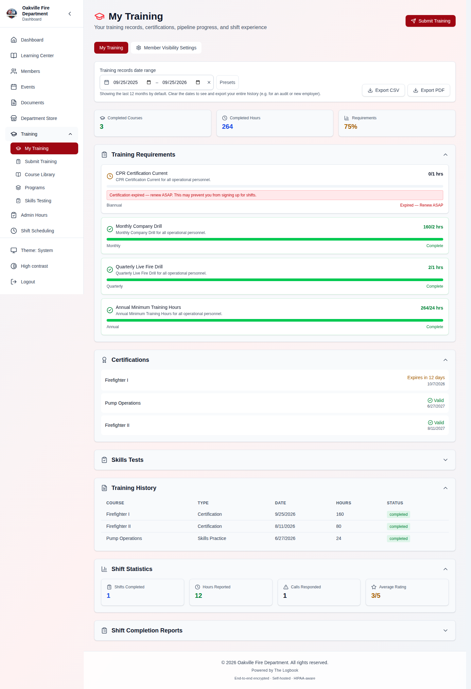

> **Hint:** The visibility of sections on this page is controlled by your department's Training Module Configuration. Your officers may choose to show or hide certain sections for regular members.

### Filtering and Exporting Your Own Records

At the top of the **My Training** overview is a date-range toolbar that scopes your Training History list.

1. Use the **Training records date range** picker to choose a start and end date. The range defaults to the **last 12 months**.
2. The Training History list (and any export) updates to show only records completed within the selected range.
3. To see and export your **entire** history — for example, for an external audit or a new employer — clear the dates. Omitting a start date exports your lifetime history.

> **[SCREENSHOT NEEDED]:** _The My Training records toolbar showing the date-range picker (defaulted to the last 12 months) with the helper text about clearing the dates, alongside the Export CSV / Export PDF buttons._

If your department has enabled member exports, two buttons appear beside the date range:

1. Click **Export CSV** to download your records as a spreadsheet-friendly file.
2. Click **Export PDF** to download a formatted document of your records for the selected period.

> **Hint:** The Export CSV / Export PDF buttons only appear when your administrator has turned on **Allow Report Export** ("Members can download their own training data") in the Member Visibility Settings. If you do not see the buttons, your department has not enabled member self-export — ask an officer to export your records for you.

---

## Submitting Training Records

Navigate to **Training > Submit Training** to log a completed training activity.

1. Select the **course** from the dropdown (or type to search).
2. Enter the **date completed**.
3. Enter the **hours** spent.
4. Optionally add **notes** or upload a **certificate file**.
5. Click **Submit**.

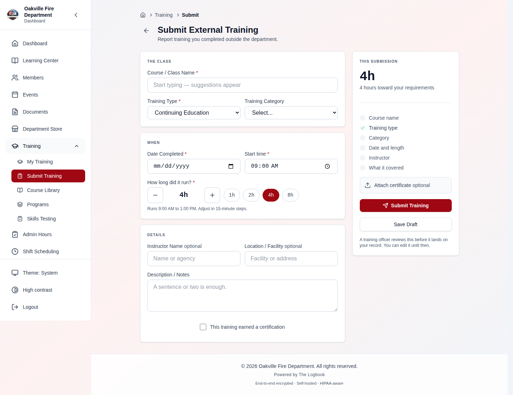

**After Submission:**

- Your record enters a **Pending Review** state.
- An officer with `training.manage` permission will review and approve or reject it.
- You will receive a notification when the decision is made.
- Approved records are added to your training history and count toward requirements.

> **Hint:** If you are submitting for a certification, make sure to upload the certificate document. This helps officers verify and approve your record faster.

---

## Course Library

Navigate to **Training > Course Library** to browse available training courses.

The library shows all courses created by your department, organized by category. Each course listing includes:

- Course name and description
- Category
- Required hours
- Whether it is a certification course

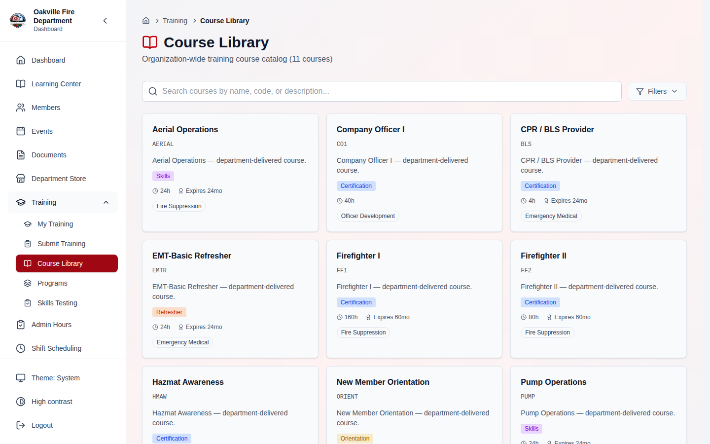

**Officers** can create new courses from the **Training Admin > Officer Dashboard** or directly from the course management area.

Courses that are made up of several classes — a recruit school, a five-night EMT refresher — show a class count and a **Manage classes** action. See [Multi-Class Courses & Cohorts](#multi-class-courses--cohorts).

---

## Multi-Class Courses & Cohorts

A recruit school is one _course_ made up of many _classes_. Instead of creating fifteen training sessions by hand every time a new class starts, you describe the course once and generate each intake from it.

There are two pieces:

- A **syllabus** — the ordered list of classes, written once. It has no dates on it, only "how long after the course starts".
- A **cohort** — one run of that course, e.g. "Recruit School — Fall 2026". Generating a cohort turns the syllabus into real, dated training events.

### Building a Course Syllabus

**Required Permission:** `training.manage`

1. Navigate to **Training > Setup > Course Library**.
2. Find the course (create it first if it doesn't exist — this is the _container_ course, e.g. "Recruit School").
3. Click **Manage classes**.
4. Click **Add class** and fill in:
   - **Course taught** — the catalog course this class covers, e.g. "SCBA Operations". This is required: it's what supplies the class's credit hours, certification settings and categories. If it doesn't exist yet, click **+** to create it without leaving the builder.
   - **Title** _(optional)_ — defaults to the course name. Use it when the same course appears twice ("SCBA — night evolution").
   - **Section** _(optional)_ — groups classes, e.g. "Orientation & Safety". Sections become phases if you generate a pipeline.
   - **Day** — how many days after the course start this class happens. Day 1 is the first day.
   - **Start time** and **Duration**.
   - **Credit hours** _(optional)_ — defaults to the catalog course's value.
   - **Counts toward certification requirements** — leave on for classes delivered the way a certifying body accepts. Turn it off for an informal in-house drill: attendance still earns hours, but the class won't advance a certificate.
5. Repeat for each class. Use the up/down arrows to reorder.

Each class shows the gap since the one before it — **"Next day"**, **"2 days later"** — which is how most officers describe a schedule out loud.

> **Hint:** If your course meets on a regular cadence, don't count days by hand. Click **Fill from pattern**, pick the meeting days (e.g. Tuesday and Thursday), say which weekday the course starts on, and every class is spaced out for you. You can still adjust individual days afterwards.

> **Screenshot placeholder:**
> _[Screenshot of the Course Syllabus Builder showing an ordered list of recruit-school classes, each with its day number, gap label ("Next day", "2 days later"), start time and credit hours, with the "Fill from pattern" weekday selector expanded above]_

### Generating a Cohort

**Required Permission:** `training.manage`

1. Navigate to **Training > Records > Course Cohorts**.
2. Click **New cohort**. The wizard has five steps.
3. **Course** — pick the course and name the cohort (e.g. "Recruit School — Fall 2026").
4. **Schedule** — set the start date. Optionally choose the meeting days, a default start time, and what should happen when a class lands on a day you don't train:
   - _Keep the computed date_ — leave it where it falls.
   - _Move weekends to the next weekday_.
   - _Move to the next meeting day_ — uses the meeting days you selected.
5. **Preview** — this is the important step. Every class is listed with the date it will actually get. Anything that had to move (a weekend, a holiday) is flagged, along with archived courses and rooms already booked. You can:
   - Change any individual date and time.
   - Tick **Skip this class** to leave one out of this intake.
   - Tick any of the suggested holidays to skip them, then **Recalculate**.
6. **Roster** — select the members taking the course. They're enrolled in the pipeline and added to every class on their calendar.
7. **Generate** — optionally tick **Build a matching pipeline** if the course doesn't have one yet, then confirm.

Generating creates **one training event per class**, each with a linked training session. Students see the classes on their calendar, sign in and out with the QR code as usual, and the hours flow into their program.

> **Screenshot placeholder:**
> _[Screenshot of the cohort wizard on the Preview step, showing a numbered list of computed class dates with a quarter-hour date/time picker on each row, an amber warning on one class reading "Moved from 2026-09-12 to 2026-09-14 — 2026-09-12 is a weekend", and a row of suggested holiday blackout dates above]_

### Running a Cohort

Open a cohort to see its **Classes** timeline and its **Roster**.

The class timeline shows each class with its date, instructor, how many members are signed up, and how many actually attended. From here you can:

| Action                    | What it does                                                                                                                              |
| ------------------------- | ----------------------------------------------------------------------------------------------------------------------------------------- |
| **Reschedule**            | Moves the class and its calendar event together. Everyone who signed up stays signed up.                                                  |
| **Cancel class**          | Cancels the event rather than deleting it, so anyone signed up sees the cancellation. The class stays listed for the record.              |
| **Add class**             | Adds a make-up session or an extra class that was never on the syllabus. The roster is invited automatically.                             |
| **Shift remaining**       | Pushes every class that hasn't happened yet back (or forward) by a number of days. Classes that already ran keep their dates.             |
| **Create missing events** | Appears if a class has no event — because scheduling it failed, or someone deleted the event. Safe to click any time; it only fills gaps. |

The **Roster** tab lists each member with their progress through the pipeline, a link to their full progression, and a **Remove** action.

> **Screenshot placeholder:**
> _[Screenshot of the Cohort Detail page's Classes tab, showing a numbered class timeline with dates, credit hours, "12 signed up / 11 attended" counts, an Event link on each row, and the Reschedule / Cancel actions on the right]_

### Cohorts vs. Recurring Sessions

These solve different problems, and it's easy to reach for the wrong one:

- A **recurring training session** repeats **the same class** on a fixed cadence — a monthly CPR refresher. See [Recurring Training Sessions](#recurring-training-sessions-2026-03-15).
- A **cohort** runs **an ordered series of different classes**, once — a recruit school covering orientation, then SCBA, then ladders.

If each meeting covers a different subject, you want a cohort.

### Edge Cases

| Scenario                                                | Behavior                                                                                                                                                                                                                                              |
| ------------------------------------------------------- | ----------------------------------------------------------------------------------------------------------------------------------------------------------------------------------------------------------------------------------------------------- |
| You reorder classes but the dates don't change          | Order and timing are separate settings. Moving a class up the list does not move it earlier in the calendar — the builder will show it as "2 days earlier" to make that visible. Use **Fill from pattern**, or edit the day numbers, to re-space.     |
| You fix the syllabus while a cohort is running          | The running cohort does not change — on purpose, so a class in progress is never re-scheduled underneath the students. Your fix applies to the next cohort; edit the current one from its detail page.                                                |
| You delete a class from the syllabus                    | Cohorts already generated keep their copy of that class. Nothing is unscheduled and nobody loses credit.                                                                                                                                              |
| You skip a class during preview                         | The cohort numbers its classes 1, 2, 3… with no gaps, so cohort class 4 may be syllabus class 5.                                                                                                                                                      |
| One class can't be scheduled (room double-booked)       | Only that class fails. The rest generate, the cohort lists the class with a **No event** badge, and you'll see the reason. Free up the room, then click **Create missing events**.                                                                    |
| Someone deletes a generated event                       | The cohort still lists the class as **No event**. **Create missing events** rebuilds it.                                                                                                                                                              |
| The course runs across a daylight-saving change         | A 19:00 class stays at 19:00 all the way through.                                                                                                                                                                                                     |
| Two classes land on the same day                        | Weekend and holiday skipping moves each class independently, so two can end up on the same date. The preview shows it — adjust a day number before generating.                                                                                        |
| A blackout date is skipped even with weekend-moving off | Correct. "Keep the computed date" only governs weekends; a blackout date always applies.                                                                                                                                                              |
| You run a second cohort of the same course              | It reuses the pipeline the first one built. A member who was already enrolled keeps their existing progress — right for someone repeating the course, surprising if you expected a fresh start. Use **Start new cycle** on their enrollment to reset. |
| A member can't be enrolled (missing a prerequisite)     | They're still added to the roster and you'll see the reason. You know your department better than the rules do.                                                                                                                                       |
| You add a member half-way through                       | They're added to the classes still to come, not the ones that already ran.                                                                                                                                                                            |
| You remove a member                                     | Their records and any class they already attended are kept. Upcoming classes come off their calendar.                                                                                                                                                 |
| **Shift remaining** doesn't move everything             | It only moves classes that haven't started, and never moves cancelled ones.                                                                                                                                                                           |
| A class shouldn't count toward a certificate            | Turn off **Counts toward certification requirements** on that class. Members still get the hours.                                                                                                                                                     |
| The course has no classes yet                           | Generation is refused with a clear message. Build the syllabus first.                                                                                                                                                                                 |
| A course is capped at 200 classes                       | Past that it's a data-entry mistake rather than a course.                                                                                                                                                                                             |

---

## Training Programs

Navigate to **Training > Programs** to view available training programs.

Training programs are structured multi-phase curricula (e.g., "Probationary Firefighter Program", "Officer Development"). Each program includes:

- **Phases** - Ordered stages of the program
- **Requirements** - Training requirements linked to each phase
- **Milestones** - Key checkpoints in the program

### Viewing Your Enrollment

If you are enrolled in a program, click on it to see:

- Your overall progress percentage
- Phase-by-phase progress
- Individual requirement completion status
- Skill evaluations and check-offs
- Time tracking (hours logged vs. required)

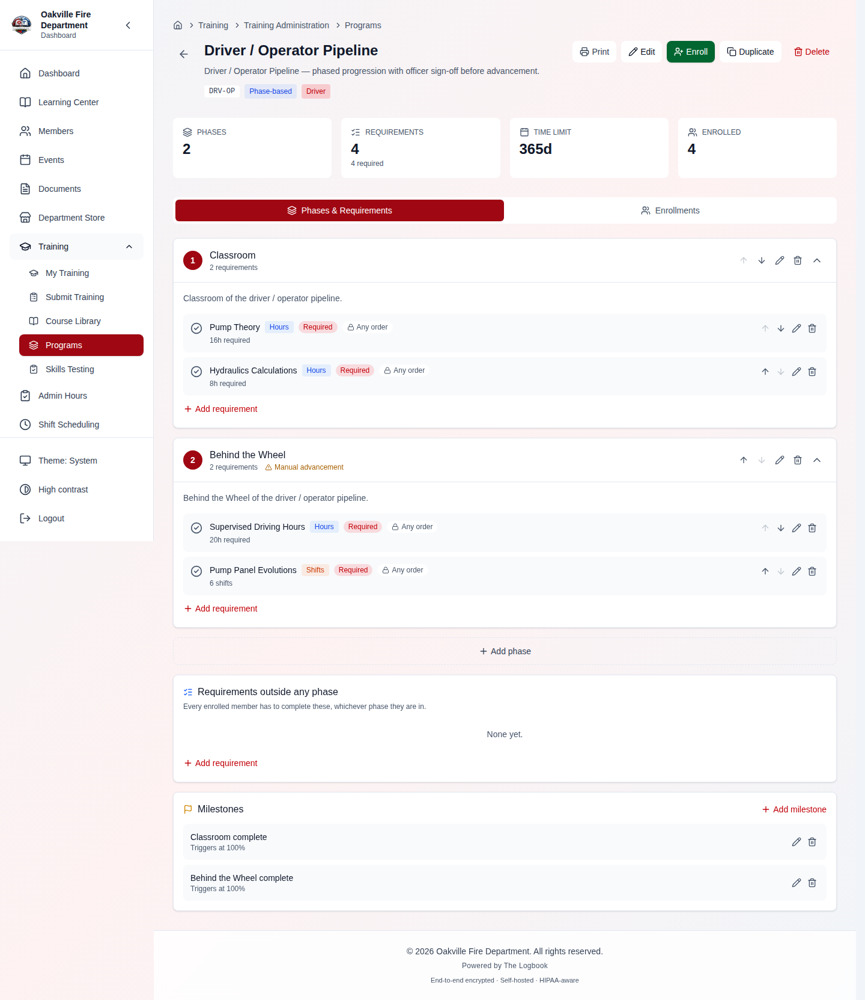

> **Hint:** Some requirements auto-progress based on shift completion reports. If you work a qualifying shift, your hours or shift count may be automatically credited toward program requirements.

---

## Training Pipelines

A **training pipeline** is a program organized as **program → ordered phases → requirements → milestones**. Members enroll, work through each phase in order, and the system tracks their progress. This section covers building a pipeline, enrolling members, and tracking their progress — the [Training Programs](#training-programs) section above covers the member-facing view.

Every requirement inside a pipeline has a **type** that determines how it is completed: **hours, courses, shifts, calls, skills evaluation, certification, checklist,** or **knowledge test** (see [Requirement Types](#requirement-types) for what each type tracks).

### Building a Training Pipeline

**Required Permission:** `training.manage`

Navigate to **Training > Programs** and click **Create Program** to open the pipeline wizard. The wizard builds the entire program — program info, phases, requirements, and milestones — and **saves everything in one step**.

1. **Program information** — Enter the program **name**, **description**, program **type**, and a **program code** (a short identifier such as `PROB-FF` used to reference the program in reports and imports).
2. **Add phases** — Add one or more **phases** in the order members will complete them. For each phase, enter a name and, optionally, check **Require officer approval to advance** if an officer must sign off before a member can move to the next phase (see [Phases & Advancing](#phases--advancing)).
3. **Add requirements to each phase** — Within a phase, click **Add Requirement** and choose the requirement type (hours, courses, shifts, calls, skills evaluation, certification, checklist, or knowledge test). Enter the type's target value — for example, required hours, the course list, or a knowledge-test passing score and maximum attempts.
4. **Add milestones** — Add **milestone** checkpoints that mark key achievements within the program.
5. Click **Save**. The program, all its phases, their requirements, and the milestones are created together in a single step.

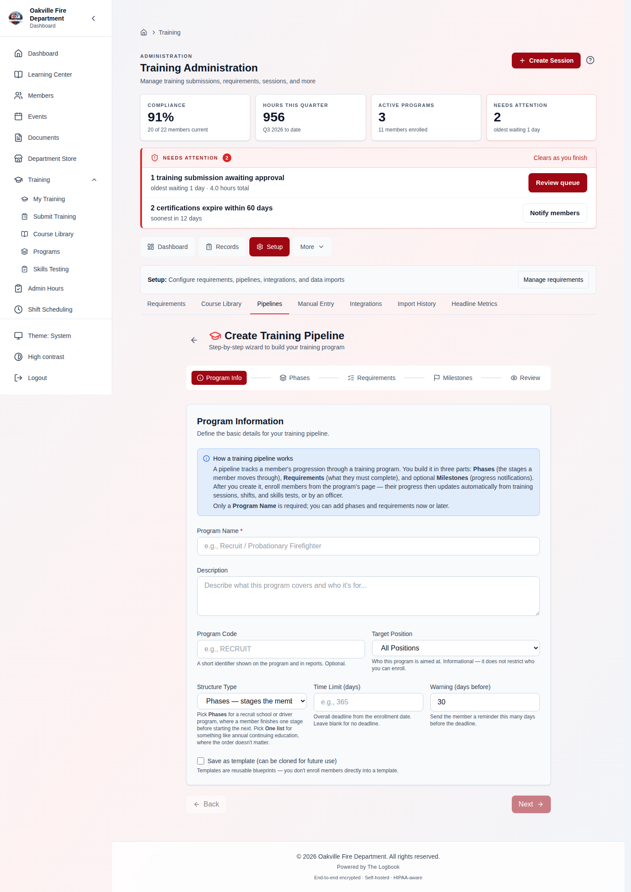

> **Hint:** The **program code** must be unique within your department. Use a short, memorable code — it appears on printed program pages and travels with the program when it is exported and shared with other departments.

### Enrolling Members

**Required Permission:** `training.manage`

1. Open the program and select the **Enrollments** tab.
2. Click **Enroll Members** to open the searchable **member picker**.
3. Search by name and either select a **single** member, or select **multiple** members for a **bulk** enrollment.
4. Confirm to enroll.

**Bulk enrollment checks each member first.** The system **skips** any member who:

- has **not met the program's prerequisites**, or
- is already enrolled in a program that **does not allow concurrent enrollment**.

After a bulk enroll, a summary reports who was enrolled and, for each member who was skipped, **the reason**. Correct the underlying issue (complete the prerequisite, or finish/cancel the conflicting enrollment) and re-run the enrollment for those members.

> **[SCREENSHOT NEEDED]:** _The Enrollments tab with the member picker open, several members selected for bulk enrollment, and a results summary listing enrolled members alongside skipped members with reasons (e.g., "Prerequisite not met", "Already enrolled in a program that disallows concurrent enrollment")._

### Tracking a Member's Progress

**Required Permission:** `training.manage`

From the **Enrollments** tab, click an enrolled member to open their progress detail. From here you can:

- **Log completed activity** — record **hours, shifts, calls,** or **courses completed** toward a requirement.
- **Change a requirement's status** — mark a requirement **Complete**, set it back to **In Progress**, or **Reopen** one that was previously completed.
- **Verify a requirement** — as an officer, confirm a completed requirement.

Completing any requirement — of **any** type — counts toward the member's **overall progress percentage**.

> **Only officers can complete or credit a requirement.** Setting a numeric value (hours/shifts/calls/courses), recording a test score, or marking a requirement complete/verified/waived requires `training.manage`. A member viewing their own progress can mark a requirement **in progress**, but to get credit they submit their training for review — they can't set their own requirement to 100%.

> **[SCREENSHOT NEEDED]:** _A member's enrollment progress detail showing requirements grouped by phase, each with a status control (Complete / In Progress / Reopen), an officer "Verify" action, and inputs for logging hours, shifts, calls, or courses._

### Working Through a Checklist Requirement _(2026-08-09)_

A **checklist** requirement holds the actual list of things a member has to do —
"tour the apparatus bay", "meet the duty officer", "SCBA fit test on file". Until
2026-08-09 nobody could see that list: the member read the requirement's title and
had to guess, and the officer signing it off saw "8 items" rather than the items.

Both of you can now read the steps, and they are **signed off one at a time**.

- The officer's progress row shows a **checkbox per step**.
- The member's page **lists the steps with their state**.
- Completion is **ticked ÷ total**, so the requirement fills up as the work
  happens instead of sitting at zero until the last step.

> **[SCREENSHOT NEEDED]:** _An officer's view of a checklist requirement on a
> member's progress detail, expanded to show the individual steps each with its
> own checkbox, three of eight ticked, and the requirement's percentage showing
> 38%._

> **[SCREENSHOT NEEDED]:** _The member's view of the same checklist requirement
> on their progress page, listing the steps they can see with their ticked/unticked
> state and the "+2 more steps your officer records" line beneath them._

#### Steps only the officer sees

Some steps are not the member's business — **references called**, **background
check returned**. In the requirement editor, the **eye toggle** on a step hides it
from the member's view.

**Hidden steps still count toward the total.** If they did not, a requirement
could read 100% complete while the background check was still outstanding. So the
member is told **"+2 more steps your officer records"** rather than being shown a
denominator that does not match what is on their screen.

> **[SCREENSHOT NEEDED]:** _The requirement editor's checklist steps editor
> showing several steps with the eye toggle, one step toggled to officer-only
> (eye closed) with its greyed-out treatment._

#### Edge cases

| What happens                                                                                                    | Why                                                                                                                                    |
| --------------------------------------------------------------------------------------------------------------- | -------------------------------------------------------------------------------------------------------------------------------------- |
| **Renaming a step, or dragging it to a new position, keeps the ticks already recorded against it**              | Each step carries its own id. Reordering and rewording move the step; they do not reset it                                             |
| **Older checklists written before this change still work**                                                      | Steps that were stored as plain text are converted the first time they are read. Nothing needs migrating and nothing needs re-entering |
| **A checklist with every step hidden shows the member 0 visible steps and a "your officer records these" line** | Correct, though usually a sign the requirement should not be member-facing at all                                                      |

### Recording a Knowledge Test

For a **knowledge test** requirement, the officer records the result:

1. Open the member's progress detail and find the knowledge-test requirement.
2. Enter either a **Pass/Fail** result or a **score percentage**.
3. The system compares the score to the requirement's **passing score** (default **70%**). A score at or above the passing score is a **pass**, and a pass **completes the requirement**.
4. Each entry counts against the requirement's **maximum attempts**. The current count is shown as **"Attempts: X / N"**. Once the maximum is reached, no further attempts can be recorded.

> **Note:** Knowledge-test scoring is **officer-entered** today. A member-facing, online test-taking feature is planned for a future release.

> **[SCREENSHOT NEEDED]:** _The knowledge-test entry panel showing the Pass/Fail toggle and score percentage field, the passing score (70%), and the "Attempts: 1 / 3" counter._

### Phases & Advancing

A **phase completes** when all of its required items are done. What happens next depends on the phase's approval setting:

- **No approval required** — the member **advances automatically** to the next phase.
- **Require officer approval to advance** (set when the phase was built) — the phase is held complete until an officer opens the member's progress and clicks **Advance to next phase**.

When a member advances, both the **member** and their **mentor(s)** are notified.

> **[SCREENSHOT NEEDED]:** _A member's progress detail showing a completed phase marked ready to advance, with an officer-only "Advance to next phase" button because the phase requires approval._

#### Phase prerequisites _(2026-08-09)_

A phase can name **other phases in the same program that must be finished first**.
This is not the same thing as the phase order:

|                         | What it answers                                   |
| ----------------------- | ------------------------------------------------- |
| **Phase number**        | The order phases are walked in                    |
| **Phase prerequisites** | What must be **finished** before this phase opens |

They are the same thing right up until a program has an optional or parallel
track, or until somebody was force-advanced past a phase — at which point the
order says "next" and the prerequisite says "not yet".

Prerequisites are enforced on both **manual** and **automatic** advancement. An
officer using **Advance to next phase** with **force** still overrides them —
that is what force is for.

> **[SCREENSHOT NEEDED]:** _The phase editor showing the prerequisite picker with
> two earlier phases selected, and the helper text distinguishing phase order from
> prerequisites._

**Edge cases**

| What happens                                                                                            | Why                                                                                            |
| ------------------------------------------------------------------------------------------------------- | ---------------------------------------------------------------------------------------------- |
| **A phase cannot require itself, a phase in another program, or a loop of phases requiring each other** | Rejected when you save, with the reason                                                        |
| **Deleting a phase removes it from the prerequisites of the phases that referenced it**                 | Otherwise every member behind it would be permanently blocked by a phase that no longer exists |
| **A prerequisite pointing at a phase that has since gone is ignored**                                   | Belt and braces for the case above — a member is never stranded by a dangling reference        |
| **Prerequisites survive export/import into another department**                                         | They are carried by phase **number**, not by id, so they land correctly in the copy            |

#### Requirement prerequisites _(2026-08-09)_

Inside a phase — or inside the program-level list, for a program with no phases —
a requirement can be flagged **prerequisite**. The rest of the requirements in
that same scope are then **locked** until it is done. Toggle the flag per
requirement on the pipeline detail page.

- An officer trying to sign off a locked requirement is **refused, with the
  blocking requirement named**.
- The member sees the step **greyed out with the same wording** rather than hidden
  — a step you cannot see yet is indistinguishable from a step that does not
  exist.

> **[SCREENSHOT NEEDED]:** _The pipeline detail page showing a requirement with
> its "prerequisite" toggle on, and the sibling requirements beneath it rendered
> greyed-out with the "locked until … is complete" note._

**Edge cases**

| What happens                                                                                  | Why                                                                                                                         |
| --------------------------------------------------------------------------------------------- | --------------------------------------------------------------------------------------------------------------------------- |
| **A requirement used in several phases is locked only when every one of its links is locked** | Otherwise a requirement shared with an unrelated phase would block work that has nothing to do with it                      |
| **Credit that arrives automatically from logged training is _not_ blocked**                   | The hours actually happened. Discarding them because a prerequisite is outstanding would be worse than crediting them early |

### When an Enrollment Runs Out of Time _(2026-08-09)_

A program can carry a **target completion date**. Members are warned as it
approaches — and, until 2026-08-09, that was all that ever happened: the date
arrived, the warnings stopped, and the enrollment sat at **Active** while the
member's page read "42 days overdue".

An enrollment past its target completion date now moves to **Expired**.

- It happens **the moment anyone opens the enrollment**, and again in a **daily
  sweep** for the ones nobody opens.
- Both the **member** and the **training officers** are told.
- Officers can now **filter for expired enrollments**, which was impossible while
  the status was never written.

#### Reopening an expired enrollment

Expired is not a dead end. An officer can **reopen** an enrollment, optionally on
a new deadline — the ordinary case of granting an extension to a member who ran
out of time.

- **Nothing the member finished is lost.** Their completed requirements are
  untouched.
- The overall progress is **recalculated on reopen**, so a member who quietly
  finished the work while expired comes back marked complete rather than waiting
  for the next edit to notice.

> **[SCREENSHOT NEEDED]:** _An officer's Enrollments tab filtered to Expired,
> showing an expired enrollment row with the Reopen action, and the reopen dialog
> with its optional new target completion date._

#### Deadline reminders, per program _(2026-08-09)_

Each program sets its **own** warning schedule in the pipeline editor:

| Setting                     | Effect                                                                                                                                          |
| --------------------------- | ----------------------------------------------------------------------------------------------------------------------------------------------- |
| **Days before deadline**    | One number or several — the days on which a warning is sent. Left unset, it uses the program's warning-days value plus 14- and 7-day follow-ups |
| **Only warn if below _N_%** | Suppresses the warning for members already on track, so a reminder means something when it does arrive                                          |

> **This used to be ignored.** The sweep sent warnings at a fixed 30, 14 and 7
> days regardless of what the program said — so a department that configured a
> 90-day warning got one at 30. If you set a schedule before 2026-08-09 and
> thought it was not working, it was not.

### What Automatically Updates Progress

Several actions credit pipeline progress without anyone editing the enrollment directly:

- **Completing a shift report** — a filed and approved shift completion report credits matching hours, shifts, calls, and skills (see [Shift Completion Reports](#shift-completion-reports)).
- **Approving a linked training session** — approving a training session that is **linked to the program** credits progress, matched either by a specific **requirement** or by training **category**.
- **Passing a linked skills test** — passing a skills test that is **linked to a requirement** completes that requirement (see the [Skills Testing](./09-skills-testing.md) guide). _(2026-08-08)_ Any member may now run an official skills test, so the credit lands when a **training officer validates** the result, not when the examiner submits it — an unvalidated pass sits in the officer's review queue and credits nothing yet. An officer running the test themselves validates it in the same step, so their results credit immediately as before.
- **An approved external/synced course** — an imported course (e.g. from Vector Solutions) credits any requirement it matches by category, if the requirement opts into external credit.

> **No double-counting.** Each of these feeds records its credit against the specific source (the shift report, the session, the imported record, the submission). If the same source is processed again — a re-synced course, a re-filed report, a re-approved submission — it is recognized and **not** credited a second time, so one real training never inflates a member's progress twice.

### Viewing Your Own Progress (Members)

From **Training > My Training**, find your program under **Active Program Enrollments** and click **View full progress**. The full progress view shows:

- Your **current phase**, marked **"You are here"**
- Your **overall percentage** complete
- **Time remaining** in the program
- Your **next milestones**
- **Every requirement grouped by phase**, with each requirement's completion status

> **[SCREENSHOT NEEDED]:** _The member's full progress view showing the phase timeline with a "You are here" marker on the current phase, an overall progress bar, time remaining, upcoming milestones, and requirements listed under each phase._

### Attendance Warning for an Unreached Phase

If you RSVP to — or check into — a **training session tied to a phase you have not reached yet**, the system shows a **warning** that the session belongs to a later phase. You can choose to **proceed anyway** if you still want to attend.

> **[SCREENSHOT NEEDED]:** _The attendance warning dialog shown when a member RSVPs to a session for a phase they have not reached, with "Proceed anyway" and "Cancel" options._

---

## Training Requirements

**Required Permission:** `training.manage`

Navigate to **Training Admin > Requirements** to manage department-wide training requirements.

### Requirement Types

| Type                  | Description                                 | Required Value                           |
| --------------------- | ------------------------------------------- | ---------------------------------------- |
| **Hours**             | Accumulate a number of training hours       | Required hours                           |
| **Courses**           | Complete a specific list of courses         | Courses picked from the course library   |
| **Certification**     | Obtain or maintain a specific certification | —                                        |
| **Shifts**            | Complete a number of qualifying shifts      | Required shifts                          |
| **Calls**             | Respond to a number of qualifying calls     | Required calls                           |
| **Skills Evaluation** | Pass a hands-on skills evaluation           | —                                        |
| **Checklist**         | Complete a set of check-off items           | Checklist items (one per line)           |
| **Knowledge Test**    | Pass a written/knowledge test               | Passing score (%), optional max attempts |

The create/edit form shows the matching value field for the selected type and
validates it before saving, so every requirement carries the quantity the
compliance engine needs.

> **Note:** A requirement must apply to someone. If **Applies to all members**
> is unchecked, at least one member category must be selected — the form blocks
> saving a requirement that would apply to nobody (it would silently disappear
> from every member's compliance view).

### Picking Courses from the Library _(2026-08-07)_

**Course** and **Certification** requirements now pick from the department's
course library instead of taking typed-in text. The same picker appears in all
three places a requirement is defined: the **create-pipeline wizard**, the
**pipeline requirement modal**, and this **department requirements page**.

This means one completion can satisfy two rules. A recruit-school phase can point
its "CPR" requirement straight at the CPR course in the catalog — the same course
the department-wide requirement uses — so a member who takes CPR once is credited
against both.

> **If you created a Course requirement before 2026-08-07, check it.** This page
> used to collect course _names_ as free text, one per line, but compliance is
> evaluated against the record's **course id** — so a typed name matched nothing
> and the requirement showed **everyone as permanently incomplete**. Re-open any
> such requirement and pick the courses from the library.
>
> The **NIMS/ICS Initial Certification** template shipped four typed names for
> this reason. It now lists them in its description for you to link, because
> course-library ids differ per department and a shared template cannot know them.

> **Changing a requirement's type away from Courses or Certification clears its
> course links.** A leftover link would silently narrow the hours evaluator to
> only that course's records.

### Freshness Window — "taken within the last N days" _(2026-08-07)_

Beside the course picker is an optional **freshness window**: a requirement can
demand that the completion itself be recent — _"CPR taken within the last 180
days"_. It is off by default, so existing requirements are unaffected.

This is the case a **One-Time** requirement could not express. A one-time
requirement's window is unbounded, so a member who took CPR three years ago reads
as satisfied forever — which is exactly what a recruit school needs to reject.

> **This is not the same thing as a rolling period**, and mixing them up is the
> easy mistake:
>
> |                      | Asks                             | Applies to                                    |
> | -------------------- | -------------------------------- | --------------------------------------------- |
> | **Rolling period**   | "How often must this be redone?" | A recurring obligation on the **member**      |
> | **Freshness window** | "How old may the completion be?" | A validity window on an **individual record** |
>
> Because they are independent, your department's one-time CPR requirement and a
> recruit pipeline's 180-day one can point at the **same course** and disagree
> about the **same record**. That is intended, not a bug.

**Edge cases:**

- The window only ever _removes_ records — it narrows the pool before the
  frequency window, so the narrower of the two always wins.
- **An officer signing off a training record cannot bypass it.** Applying a
  record and approving a submission both check the completion date up front, so
  crediting a three-year-old record to a 180-day requirement is refused before
  anything is saved. That path deliberately bypasses the external-credit flag,
  but not this.
- **A record with no completion date fails the check**, rather than slipping
  through — the window cannot be verified against it.
- **The window can be removed again** by clearing the field; it is not a one-way
  setting.

### Requirement Templates

Click **Use Template** on the Requirements page to start from a pre-configured
requirement based on a common standard. Selecting a template opens the create
form pre-filled — review the hours, due date configuration, and assignment
(and narrow it to specific member categories if needed) before saving.

Built-in templates:

| Template                               | Standard              | Default Configuration                                |
| -------------------------------------- | --------------------- | ---------------------------------------------------- |
| NFPA 1001 Firefighter Annual Training  | NFPA 1001             | 36 hours, annual, calendar period                    |
| NFPA 1500 Occupational Safety Training | NFPA 1500             | 8 hours, annual, calendar period                     |
| NREMT EMT Recertification              | NREMT                 | 40 hours, 24-month rolling period                    |
| CPR/BLS Certification                  | —                     | Certification, 24-month rolling period               |
| Hazmat Operations Refresher            | OSHA 29 CFR 1910.120  | 8 hours, annual, calendar period                     |
| Bloodborne Pathogens Annual Refresher  | OSHA 29 CFR 1910.1030 | 2 hours, annual, calendar period                     |
| HIPAA Privacy & Security Awareness     | 45 CFR 164.530(b)     | 1 hour, annual, calendar period                      |
| SCBA Fit Test & Respiratory Protection | OSHA 29 CFR 1910.134  | Checklist (4 items), annual                          |
| NIMS/ICS Initial Certification         | FEMA NIMS             | Courses (ICS-100, ICS-200, IS-700, IS-800), one-time |
| New Member Orientation Checklist       | —                     | Checklist (5 items), one-time, probationary members  |

Templates tied to a national standard carry source attribution (NFPA, NREMT,
OSHA, HIPAA, FEMA) with the standard or CFR citation as the registry code, so
requirements created from them display a source badge instead of appearing as
department-defined rules.

### Frequency and Due Dates

| Frequency     | Description            |
| ------------- | ---------------------- |
| **Annual**    | Resets each year       |
| **Biannual**  | Resets every two years |
| **Quarterly** | Resets every quarter   |
| **Monthly**   | Resets each month      |
| **One-Time**  | Must be completed once |

| Due Date Type            | Description                              |
| ------------------------ | ---------------------------------------- |
| **Calendar Period**      | Based on the calendar year/quarter/month |
| **Rolling**              | Sliding window of N months from today    |
| **Certification Period** | Based on certification expiry dates      |
| **Fixed Date**           | Specific due date                        |

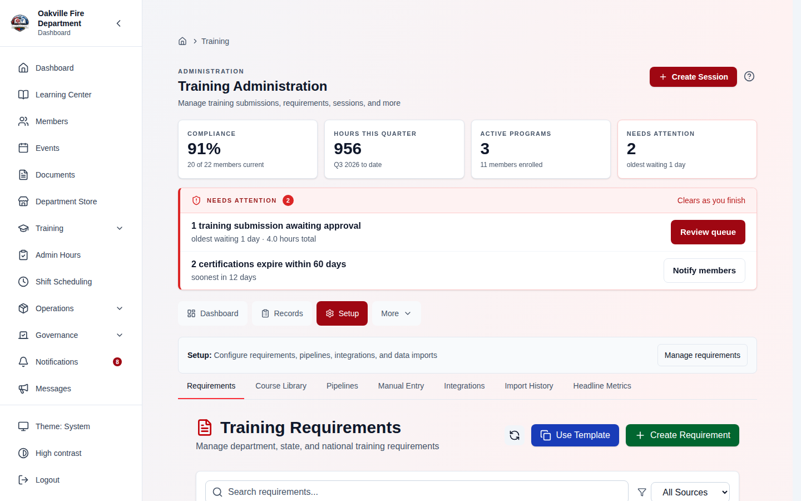

### Rolling Period Requirements and Leave of Absence

When a requirement uses **Rolling** due date type with a rolling period (e.g., 12 months), the system calculates compliance over that sliding window. If a member has an active **Leave of Absence** during part of that window, the months on leave are excluded and the requirement is pro-rated.

**Example:** A requirement of 12 hours over 12 rolling months, for a member with 3 months of leave, becomes 9 hours required (12 x 9/12).

See [Membership > Leave of Absence](./01-membership.md#leave-of-absence) for details on managing leaves.

---

## Officer Dashboard

**Required Permission:** `training.manage`

Navigate to **Training Admin > Officer Dashboard** for a department-wide overview including:

- Training completion rates
- Members behind schedule
- Upcoming deadlines
- Recent submissions awaiting review

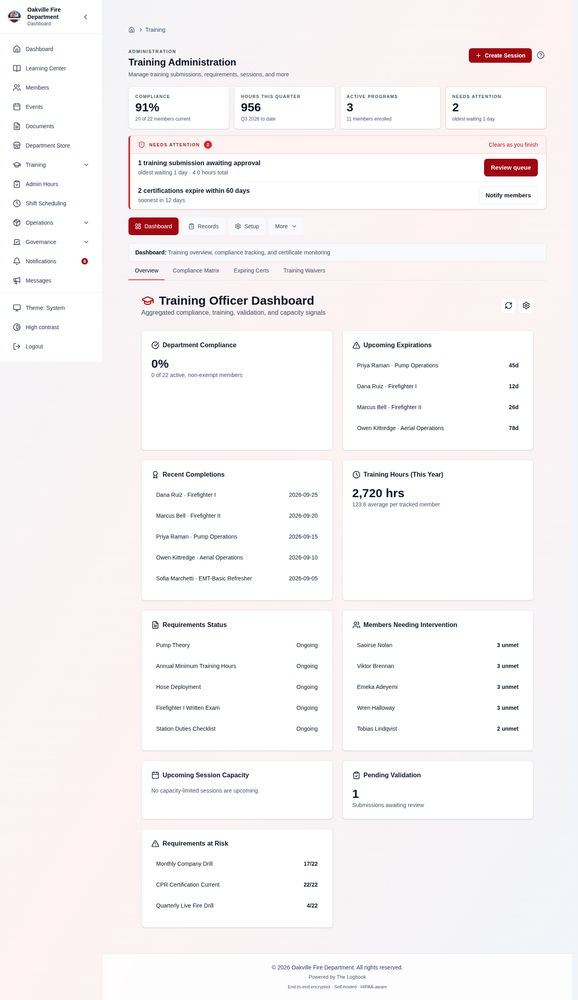

> **Automatic "falling behind" alerts.** A weekly check flags members who are behind pace or approaching a deadline and notifies **both the member and the training officers** so someone can step in. A member isn't re-alerted every week while they stay behind (the alert is throttled), and a member who just started a fresh recertification cycle isn't flagged as overdue on day one — pace is measured from the current cycle, not their original enrollment date.

---

## Reviewing Submissions

**Required Permission:** `training.manage`

Navigate to **Training Admin > Review Submissions** to see training records pending officer review.

1. Click on a submission to expand its details.
2. Review the training information, hours, and any uploaded certificates.
3. Click **Approve** to accept or **Reject** to deny.
4. If rejecting, provide a reason so the member understands what needs to be corrected.

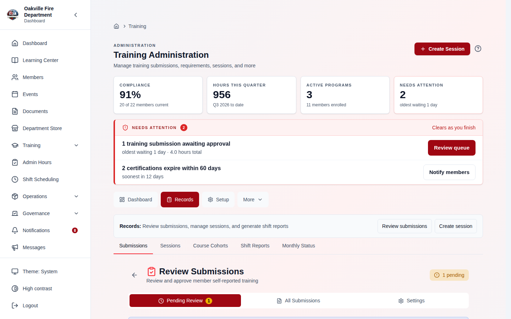

> **You can't approve your own submission.** If you self-report training, a **different** officer has to approve it — you can't sign off your own hours or credit. (You can still reject or request revision on your own submission.)

> **Hint:** Self-reported submissions reviewed here are separate from finalizing a training session. Whether finalizing a session needs a second officer to confirm is governed by the **Require instructor confirmation** option (see "Finalizing a Training Session" below) — it is no longer always required.

### Fixing a Mistaken Approval or Record

Approvals and records can be undone without hand-editing anyone's progress:

- **Reverse an approval** — on an already-approved submission, reversing the approval **voids the training record it created**, takes back any pipeline credit it applied, and returns the submission to **pending review** so you can re-decide (reject it, or re-approve with corrected hours).
- **Void a record** — a training record entered in error can be voided. It is marked **cancelled** (kept for the audit trail, never truly deleted) and any pipeline credit it fed is taken back off automatically. Because compliance only counts completed records, a voided record stops counting right away.

Both actions require `training.manage` and are recorded in the audit log.

---

## Finalizing a Training Session

**Required Permission:** `training.manage`

When you finalize a training session, what happens next depends on the **Require instructor confirmation** checkbox set when the session was created (Step 3 of **Training > Create Session**):

- **Unchecked (default)** — Finalizing the session **immediately completes** every attendee's training record. No separate approval step and no confirmation email are sent.
- **Checked** — The session stays **pending** after you finalize it. The records are not completed until an officer confirms via the approval notification that is emailed to the department's training officers.

1. Open the training session and click **Finalize**.
2. If **Require instructor confirmation** was off, the attendees' records are marked complete right away.
3. If it was on, the session remains pending until an officer opens the emailed confirmation and approves it.

> **[SCREENSHOT NEEDED]:** _The Create Training Session form (Step 3) showing the "Require instructor confirmation" checkbox with its helper text "Training records will be marked as 'pending' until instructor confirms completion."_

> **Hint:** Leave **Require instructor confirmation** off for routine drills you want completed the moment you finalize them. Turn it on only when a second officer must sign off before records count.

---

## Compliance Matrix

**Required Permission:** `training.manage`

Navigate to **Training Admin > Compliance Matrix** to see a grid view of all members vs. all active requirements.

The matrix displays:

- **Green** cells for compliant members
- **Yellow** cells for members in progress
- **Red** cells for non-compliant members
- Percentage completion in each cell

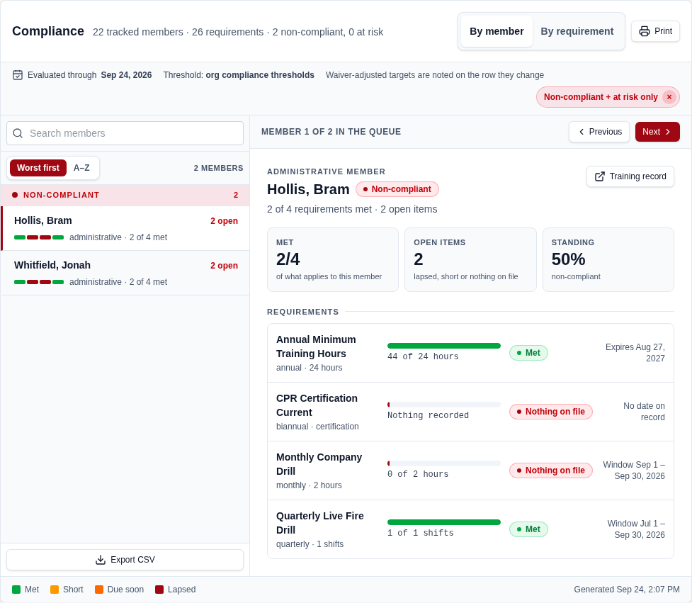

> **Hint:** Use this view for annual reporting and to identify which members need attention before compliance deadlines.

### Leave of Absence Adjustments

When a member has an active **Leave of Absence** (created via **Members > Admin > Waivers**), the Compliance Matrix, Competency Matrix, Training Reports, and all other compliance views automatically adjust proportional requirements (hours, shifts, calls) so the member is not penalized for time they were inactive.

The adjustment formula is:

```
adjusted_required = base_required × (active_months / total_months)
```

For example, if a member takes a 3-month leave during a 12-month annual requirement of 24 hours, the adjusted requirement becomes `24 × (9/12) = 18 hours`.

A calendar month is only waived if the leave covers **15 or more days** of that month. Courses and certifications are not adjusted (they are binary completions).

Members see a blue info banner on their My Training page showing the adjustment. Officers see the adjusted values reflected in the compliance and competency matrices, training reports, and requirement progress views.

> For the full guide on creating and managing Leaves of Absence, see the [Training Waivers & Leaves of Absence](../../backend/app/docs/TRAINING_WAIVERS.md) documentation.

---

## Evaluation Period (Current vs. Prior Month)

**Required Permission:** `training.manage`

Departments that hold drills late in the month often saw members flagged non-compliant mid-month, before they had a chance to train. The **Evaluation Period** setting lets officers choose whether compliance calculations count the current, in-progress month or stop at the end of the previous month.

### Setting the Department Default

1. Navigate to **Training Admin > Compliance Requirements** and open the **Thresholds** tab.
2. Find the **Evaluation Period** option.
3. Leave **Count the current (in-progress) month in compliance calculations** checked to measure members against this month's training (the default), or uncheck it so calculations stop at the end of last month.

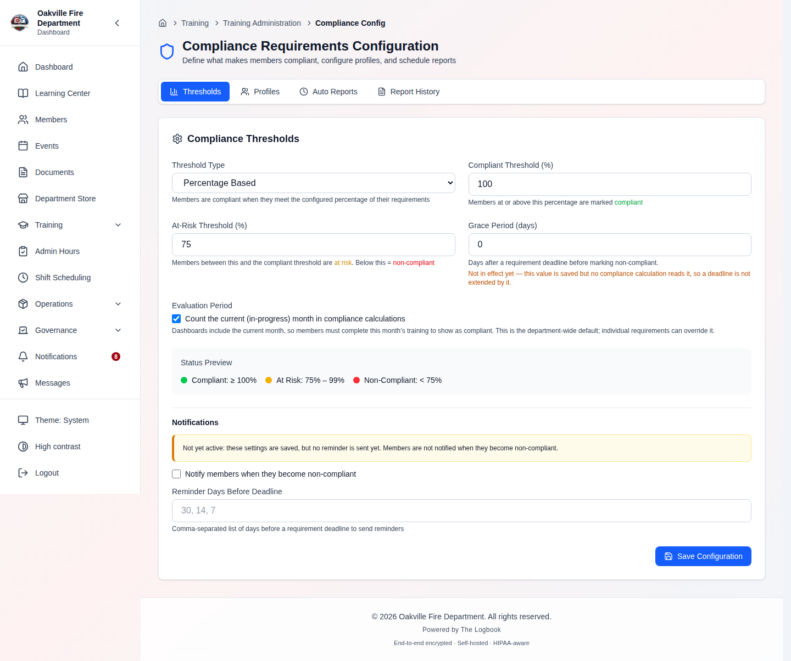

### Per-Requirement Override

Each training requirement can override the department default. When adding or editing a requirement (**Training Admin > Requirements**), use the **Evaluation Period** selector:

- **Use department default** — Inherits the org-wide setting above.
- **Count the current (in-progress) month** — Always includes this month for this requirement.
- **Stop at the end of the previous month** — Excludes the in-progress month — useful for drills held late in the month so members aren't flagged early.

> **[SCREENSHOT NEEDED]:** _The requirement add/edit form showing the "Evaluation Period" dropdown with the three options (use department default / count current month / stop at previous month)._

> **Hint:** This setting only affects requirement compliance windows, proration, and overdue checks. Certifications that are **expiring soon** are always flagged using the real current date, regardless of the Evaluation Period setting.

---

## Expiring Certifications

**Required Permission:** `training.manage`

Navigate to **Training Admin > Expiring Certs** to see certifications expiring within a configurable window (default 90 days).

The list shows:

- Member name
- Certification name
- Expiration date
- Days until expiry

You can trigger notification emails to members with expiring certifications by clicking **Process Alerts**.

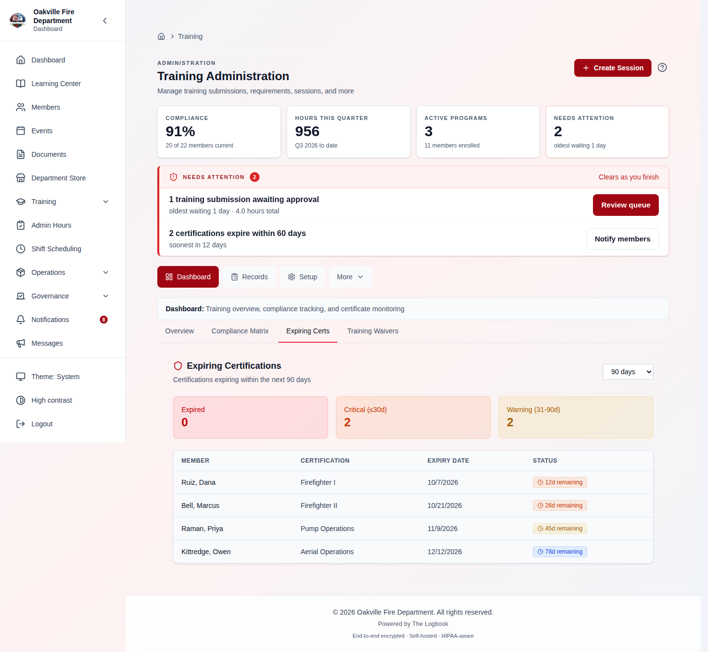

### Automated Certification Alerts

The system automatically sends tiered notifications as certifications approach expiration:

| Days Before Expiration | Recipients                              | Channels            |
| ---------------------- | --------------------------------------- | ------------------- |
| 90 days                | Member only                             | In-app + email      |
| 60 days                | Member only                             | In-app + email      |
| 30 days                | Member + training officer               | In-app + email (CC) |
| 7 days                 | Member + training + compliance officers | In-app + email (CC) |
| Expired                | Member + all escalation officers        | In-app + email (CC) |

Each tier is sent only once per certification. Expired certifications trigger escalation to training, compliance, and chief officers with both primary and personal email addresses.

---

## Waiver Management

**Required Permission:** `members.manage`

Navigate to **Members > Admin > Waivers** to manage all waivers across the department.

This unified page covers:

- **Training waivers** — adjust training requirements for members on leave
- **Meeting waivers** — exclude meetings during leave periods from attendance calculations
- **Shift waivers** — exclude members from scheduling during leave

### Creating a Waiver

1. Click the **Create Waiver** tab.
2. Select the member and leave type. Available leave types include standard types plus **New Member** for long-service members exempt from certain requirements.
3. Set the date range, or check **Permanent (no end date)** for waivers that should never expire. Permanent waivers display a purple "Permanent" badge in status columns.
4. Choose the **Applies To** scope (multi-select checkboxes — pick any combination):
   - **Training** — Adjusts training requirements for the member
   - **Meetings** — Excludes meetings during leave periods from attendance calculations
   - **Shifts** — Excludes members from scheduling during leave
   - Selecting **Training + Meetings/Shifts** creates both a Leave of Absence and an auto-linked training waiver.
   - Selecting **Training only** creates a standalone training waiver without affecting meetings or scheduling.
   - Selecting **Meetings and/or Shifts only** creates a Leave of Absence with `exempt_from_training_waiver` enabled.
5. Click **Create Waiver**.

### Training Waivers Tab (Officer View)

Training officers also have a dedicated **Training Waivers** tab within the **Training Admin > Dashboard**. This view shows:

- Summary cards (Active / Future / Expired / Total counts)
- Filterable table with status badges (Active, Future, Expired, Deactivated)
- Source tracking: **Auto (LOA)** for waivers auto-created from leaves, **Manual** for standalone waivers
- Links to the full Waiver Management page

---

## Compliance Summary

Each member's profile page displays a **compliance summary card** showing their current training status at a glance:

| Indicator               | Meaning                                                                |
| ----------------------- | ---------------------------------------------------------------------- |
| **Green (Compliant)**   | All requirements met, no certification issues                          |
| **Yellow (At Risk)**    | Some requirements incomplete or certifications expiring within 90 days |
| **Red (Non-Compliant)** | Expired certifications or fewer than 50% of requirements met           |

The card also shows:

- Requirements met / total
- Training hours completed this year
- Active certifications count
- Certifications expiring soon

> For the full technical details of how compliance is calculated, see [Training Compliance Calculations](../../docs/training-compliance-calculations.md).

---

## Shift Completion Reports

**Required Permission:** `training.manage` (officers) / authenticated (trainees, own reports only)

Navigate to **Shift Scheduling > Shift Reports** to view and manage shift
officer reports. **Training Admin > Records > Shift Reports** is a signpost
rather than a second copy of the screen — it holds a single card explaining that
reports are filed from Shift Scheduling, and a button through to it.

Shift completion reports are filed by shift officers after each shift. They record:

- **Trainee name** and linked shift
- **Hours on shift** — auto-populated from shift attendance records
- **Calls responded** — auto-populated from ShiftCall records where the trainee was a responding member
- **Call types** — extracted from incident types of matching ShiftCall records
- **Performance rating** (1-5 scale, configurable label and scale type)
- **Areas of strength** and **areas for improvement** (encrypted at rest with AES-256)
- **Officer narrative** (encrypted free-form assessment)
- **Skills observed** — structured list of `{skill_name, demonstrated, score (1-5), notes, comment}` entries. Each skill can be scored on a 1-5 scale: 1=Needs work, 2=Developing, 3=Competent, 4=Proficient, 5=Excellent. Scores flow through to `SkillCheckoff` records and the competency score history
- **Tasks performed** — structured list of `{task, description, comment}` entries

These reports **automatically update training program progress** for enrolled members. When a report is filed (or a draft is completed), the system credits hours, shift count, and call count toward matching requirements. Call type requirements support **case-insensitive matching** against the report's call_types array — only calls matching the required types count toward progress.

Which requirements a report advanced is recorded on the report
(`requirements_progressed`) but is not shown anywhere in the interface — not on
the card, not in the expanded body, and not in the review modal. Check the
member's enrolment progress to see the credit land.

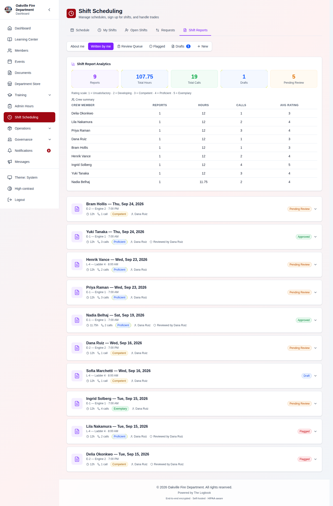

### Shift Finalization Workflow _(2026-03-28)_

Before filing shift reports, officers should **finalize the shift**. This creates snapshot data and auto-generates draft reports.

1. Navigate to the **Shift Detail Panel** for a past shift
2. Click **"Finalize Shift"** — a pre-finalization checklist modal appears
3. The checklist validates:
   - **End-of-shift equipment checks** must be completed (blocking requirement)
   - Attendance count and call count displayed for reference
4. On confirmation, the system:
   - Snapshots `call_count` and `total_hours` on the shift record
   - Computes per-member `call_count` on each ShiftAttendance record
   - Sets `is_finalized=true` with timestamp and officer ID
   - **Auto-creates draft ShiftCompletionReports** for all attendees with active training program enrollments
   - Sends a notification to the officer listing the number of drafts created
5. After finalization, a green badge shows "Shift finalized on [date]"

> **[SCREENSHOT NEEDED]:** _Screenshot of the pre-finalization checklist modal showing the equipment check validation, attendance count, call count, and the Finalize button._

> **[SCREENSHOT NEEDED]:** _Screenshot of the ShiftDetailPanel after finalization showing the green "Finalized" badge with timestamp._

### Auto-Population from Shift Data

When creating or completing a shift report, the system can auto-populate data from shift records:

1. Select a **shift date** and **trainee** in the report form
2. The system calls the **shift preview** endpoint to pull:
   - **Hours on shift** from ShiftAttendance duration
   - **Calls responded** from ShiftCall records where the trainee is in `responding_members`
   - **Call types** from the incident types of matching ShiftCall records
3. Auto-populated fields display an **(auto)** badge in the form
4. Officers can edit all auto-populated values before submitting
5. The `data_sources` field tracks which fields were auto-populated vs manually entered for audit purposes

> **[SCREENSHOT NEEDED]:** _Screenshot of the shift report form showing auto-populated hours and calls fields with the (auto) badge, plus the performance rating stars and narrative text areas below._

### Draft Reports and Review Workflow _(2026-03-28)_

The shift report system supports a multi-stage review workflow:

1. **Draft** — Auto-created on shift finalization. Officer completes the evaluation fields (rating, narrative, skills, tasks)
2. **Pending Review** — Report submitted for review by a training officer (if `report_review_required` is enabled in org config)
3. **Approved** — Report finalized and visible to the trainee (subject to visibility config)
4. **Flagged** — Report flagged by reviewer for correction or concern

**For Officers:**

- Navigate to the **Drafts** view to see auto-created drafts awaiting completion. **Submit All Drafts** files the whole batch at once
- Click a draft to open it, then **Complete Draft** to fill in evaluation details
- Submit to transition the draft to `approved` or `pending_review`
- Draft → approved transition triggers **deferred pipeline progress** (progress was not applied when the draft was created)

**For Reviewers:**

- Navigate to the **Review Queue** view. It and **Flagged** appear in the view
  strip only while **Require review before a report reaches the trainee** is on
  in Shift Report settings; with review switched off, a report can still be
  flagged through the API but no view in the tab lists it
- Review reports and approve or flag them — the review modal displays the full report content (hours, calls, rating, strengths, improvements, narrative, skills with scores, tasks) for complete context
- **Batch review** _(2026-04-07)_ — Select multiple reports using checkboxes, toggle select-all, then click "Approve Selected" or "Flag Selected" to review up to 100 reports at once
- Navigate to the **Flagged** view _(2026-04-07)_ — Reports previously flagged appear here for follow-up. Flagged reports can be re-reviewed and approved
- Optionally **redact fields** — clearing sensitive content from specified fields before the trainee sees the report
- Add **reviewer notes** (encrypted, never visible to trainees)

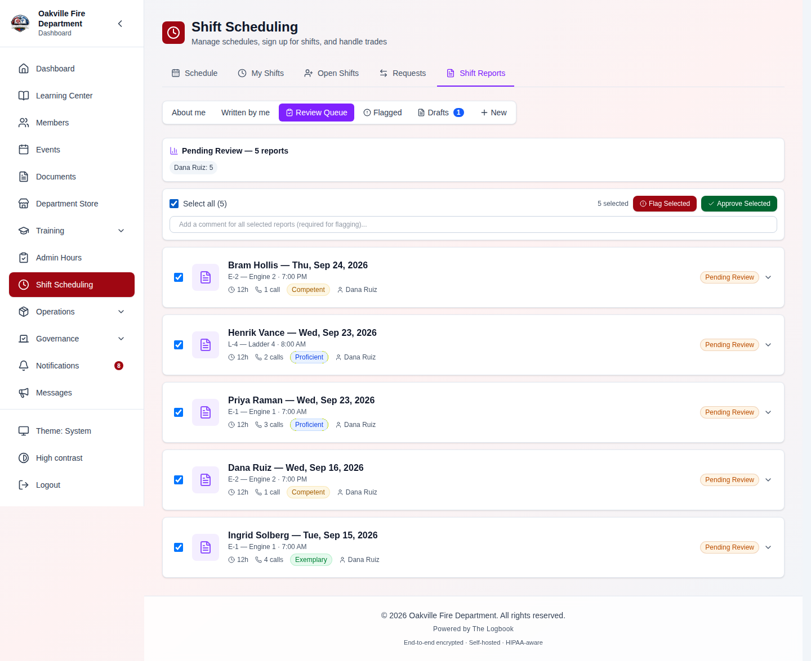

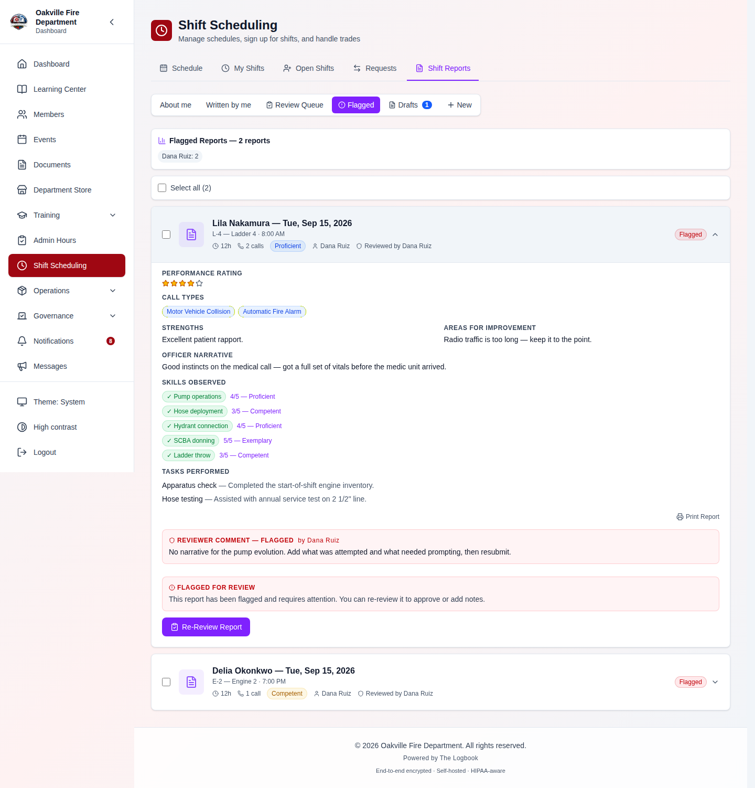

**For Trainees:**

- Navigate to **My Reports** to see approved reports
- Click **Acknowledge** to confirm you have reviewed the report
- Add optional **comments** during acknowledgment
- View personal statistics: total hours, calls, average rating, and monthly breakdown

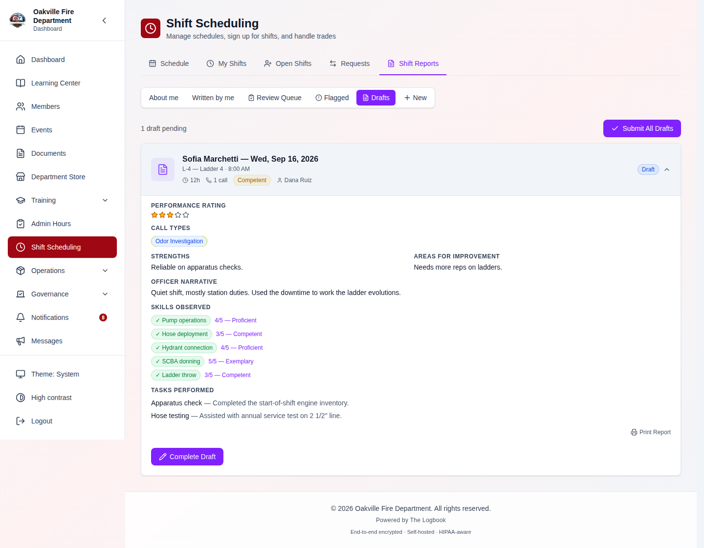

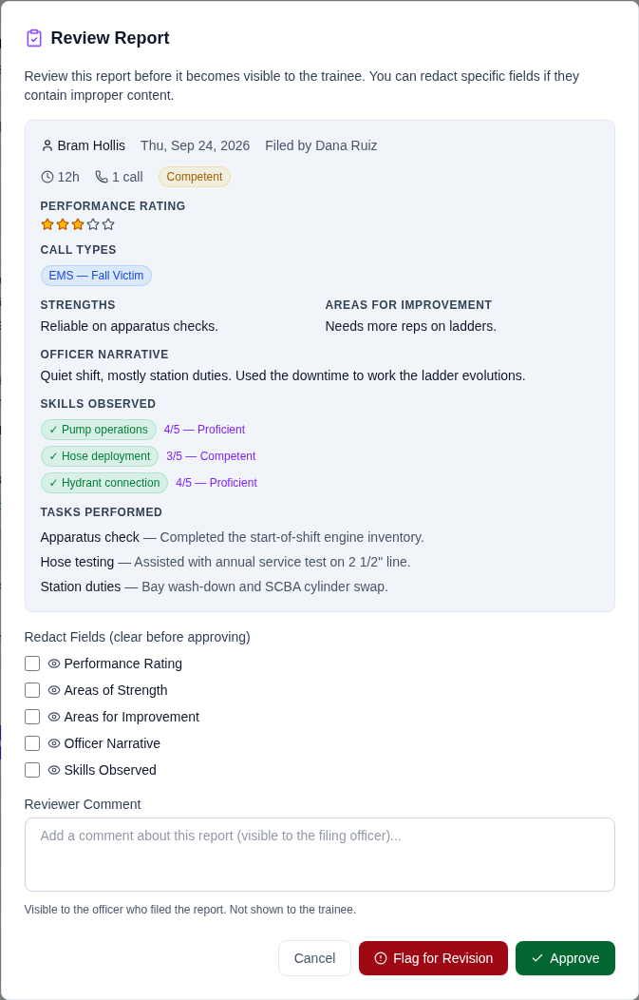

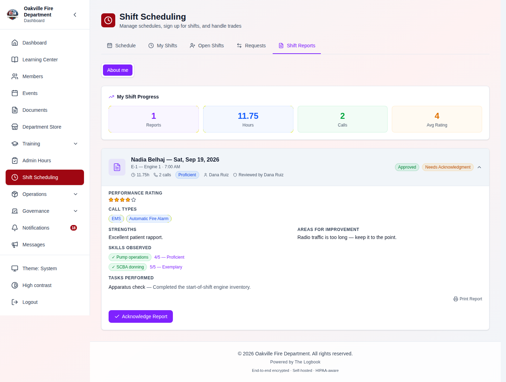

### Officer Analytics Dashboard _(2026-03-29)_

The analytics sit at the top of the **Filed by Me** view — there is no separate
dashboard view to switch to. They cover the whole department, not only the
reports you filed:

- **Summary cards** — Total reports, total hours, total calls, average rating
- **Per-trainee breakdown table** — Each trainee's report count, hours, calls, and average rating
- **Status counts** — How many reports are in draft, pending_review, approved, and flagged status
- **Monthly trend** — Chart data showing reports, hours, and calls per month

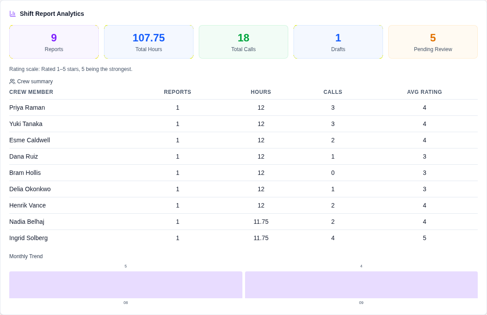

### Trainee Statistics Dashboard _(2026-03-29)_

Trainees see a personal stats card at the top of their My Reports view:

- **Total reports** received
- **Total hours** logged across all reports
- **Total calls** responded
- **Average rating** across all rated reports
- **Monthly breakdown** — a small bar per month, drawn underneath the four
  totals. It appears only once the trainee has reports in **more than one**
  month; a trainee with a single month of reports sees the totals alone, since
  there is no trend to plot from one bar

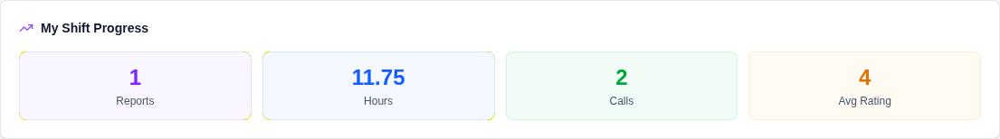

### Visibility Configuration

Training officers can control what trainees see via **Training Module Configuration**:

| Setting                      | Controls                                                                                 |
| ---------------------------- | ---------------------------------------------------------------------------------------- |
| `show_performance_rating`    | Whether rating stars appear on trainee-visible reports                                   |
| `show_officer_narrative`     | Whether officer's free-form assessment is visible to trainee                             |
| `show_areas_of_strength`     | Whether strengths are visible to trainee                                                 |
| `show_areas_for_improvement` | Whether improvement areas are visible to trainee                                         |
| `show_skills_observed`       | Whether skills observations appear                                                       |
| `show_shift_stats`           | Whether the trainee stats dashboard appears                                              |
| `show_shift_reports`         | Whether the shift reports section appears at all                                         |
| `report_review_required`     | Whether reports require reviewer approval before trainee visibility                      |
| `rating_label`               | Custom label for the performance rating (e.g., "Performance", "Readiness")               |
| `rating_scale_type`          | Rating scale type: "stars" (star icons) or "descriptive" (labeled buttons)               |
| `rating_scale_labels`        | Custom labels for each rating level (e.g., `{1: "Needs Improvement", 5: "Exceptional"}`) |

### Report Form Section Toggles _(2026-04-04)_

Separate from trainee visibility, officers can control which **optional sections appear on the report creation form** itself:

| Toggle                            | Default | Controls                                   |
| --------------------------------- | ------- | ------------------------------------------ |
| `form_show_performance_rating`    | On      | Performance rating stars/scale on the form |
| `form_show_areas_of_strength`     | On      | Strengths text field on the form           |
| `form_show_areas_for_improvement` | On      | Improvement text field on the form         |
| `form_show_officer_narrative`     | On      | Free-form officer assessment on the form   |
| `form_show_skills_observed`       | On      | Structured skills checklist on the form    |
| `form_show_tasks_performed`       | On      | Structured tasks checklist on the form     |
| `form_show_call_types`            | On      | Call type selection on the form            |

> **[SCREENSHOT NEEDED]:** _Screenshot of the Shift Reports Settings panel showing the "Report Form Sections" card with toggle switches for each section (performance rating, strengths, improvement, narrative, skills, tasks, call types), showing some toggled on and some toggled off._

These toggles are managed in **Scheduling > Settings > Shift Reports**. When a section is toggled off, it is hidden from the report creation form entirely — officers do not see it and cannot enter data for it. The trainee visibility settings (above) are separate and control what trainees see after a report is filed.

### Per-Apparatus-Type Skills and Tasks _(2026-04-04)_

The report form can auto-populate skills and tasks relevant to the specific apparatus type used during the shift. For example, if a trainee worked on an engine company, the skills checklist might show "Pump operations", "Hose deployment", and "Hydrant connection" rather than generic skills.

**How it works:**

1. Navigate to **Scheduling > Settings > Shift Reports** to configure per-apparatus-type mappings
2. Expand an apparatus type (e.g., Engine, Ladder, Ambulance) in the accordion
3. Add or remove skills and tasks specific to that apparatus type
4. When an officer files a report linked to a shift with that apparatus type, the form pre-populates the relevant skills and tasks

> **[SCREENSHOT NEEDED]:** _Screenshot of the Shift Reports Settings panel showing the "Per-Apparatus Skills & Tasks" accordion, with one type (e.g., "Engine") expanded showing a list of skills like "Pump operations", "Hose deployment", "Hydrant connection" with add/remove buttons._

If no mapping exists for the shift's apparatus type, the system falls back to the org-wide default skills and tasks lists. If neither exists, the skills/tasks sections are empty (but still visible unless toggled off via form section toggles).

### Save as Draft _(2026-04-04)_

Officers can save incomplete shift completion reports as drafts:

1. Begin filling in the report form
2. Click **Save as Draft** instead of Submit
3. The report is saved with `review_status: "draft"` — no pipeline progress is triggered
4. Return to the **Drafts** view in the Shift Reports tab to see all saved drafts
5. Click **Edit** on a draft to complete it
6. On final submission, the report transitions to `approved` or `pending_review`, and deferred pipeline progress is applied

> **[SCREENSHOT NEEDED]:** _Screenshot of the shift report form showing the two action buttons at the bottom: "Save as Draft" (outlined/secondary) and "Submit Report" (primary/filled), with the form partially completed._

> **[SCREENSHOT NEEDED]:** _Screenshot of the Drafts view in ShiftReportsTab showing a list of saved draft reports with shift date, trainee name, auto-populated hours/calls, and an "Edit" button to complete each draft._

### Auto-Filter Trainee List _(2026-04-04)_

When filing a shift report and linking it to a specific shift, the trainee dropdown automatically filters to show only members who were assigned to that shift. This prevents accidentally filing a report for someone who wasn't on duty.

For ad-hoc reports (no shift selected), the full member list is shown.

> **[SCREENSHOT NEEDED]:** _Screenshot of the shift report form showing the trainee dropdown with a smaller filtered list (only 4-5 names) when a shift is selected, with a note or badge saying "Filtered to shift members"._

### Edge Cases

- **Duplicate prevention:** A unique constraint on `(shift_id, trainee_id)` prevents filing two reports for the same trainee on the same shift. If a second report is attempted, the system returns a descriptive error.
- **Finalization blocking:** Shifts cannot be finalized if end-of-shift equipment checks are incomplete. Start-of-shift checks do not block finalization.
- **Finalized shift protection:** Finalized shifts cannot be edited or deleted. Shifts with associated completion reports also cannot be deleted.
- **Draft pipeline deferral:** Draft reports do not trigger training pipeline progress on creation. Progress is deferred until the draft is completed and transitions to `approved` or `pending_review`.
- **Save as draft with missing fields:** Drafts can be saved with incomplete data — validation of required fields is deferred until the final submission.
- **Field redaction:** When a reviewer redacts fields, those field values are set to null before the report becomes visible to the trainee. The original values are not recoverable.
- **Reviewer notes privacy:** The `reviewer_notes` field (encrypted at rest) is never exposed to the trainee in any view or API response.
- **Auto-populate edge case:** If the trainee is not found in the shift's attendance records, the preview returns zeroed data. If there are no ShiftCall records, calls_responded defaults to 0 and call_types is empty.
- **Trainee with assignment but no attendance:** If a trainee has a shift assignment but no attendance record (e.g., they were assigned but didn't check in), the auto-populate returns zeros and the officer can manually enter hours.
- **Report shift_date validation:** When a report is linked to a specific shift, the report's `shift_date` must match the linked shift's actual date. A mismatch returns a validation error.
- **Call type matching:** Requirements with `required_call_types` use case-insensitive matching. "Medical" in a requirement matches "medical" in a call type. The system tracks matched types in `progress_notes` for audit.
- **Ad hoc reports:** Reports filed without a `shift_id` are saved as ad hoc reports — no auto-population is available, and they appear in reports as "ad hoc".
- **Failure isolation during finalization:** If draft auto-creation fails for one trainee, the error is logged and processing continues for remaining attendees.
- **All form sections toggled off:** When all optional sections are disabled, only core fields (trainee, shift date, hours, calls) remain on the form. The form is still submittable.
- **Apparatus type with no mapped skills:** Falls back to org-wide default skills list. If no defaults exist either, the skills section appears empty (unless toggled off).
- **Descriptive rating with no custom labels:** Falls back to numeric display (1-5) instead of showing empty labels.
- **Skill score outside 1-5 range:** Rejected by Pydantic validation with a 422 error. The UI constrains selection to 1-5 buttons, but API callers sending out-of-range values get an immediate validation error.
- **Batch review with more than 100 reports:** Rejected by `max_length=100` on the `BatchReviewRequest` schema. Select fewer reports and retry.
- **Batch review with invalid or already-reviewed report IDs:** Valid reports are processed; a `failed` count is returned for reports that could not be reviewed (e.g., already approved, wrong org, or nonexistent ID).
- **Flagged report re-approved:** Moves from the Flagged view to Approved status. If the report has a linked enrollment, deferred pipeline progress is triggered on approval.
- **Submit-all-drafts scope:** _(2026-04-11)_ The "Submit All Drafts" action now correctly scopes to the current officer's drafts only, preventing cross-officer draft submission.
- **Enrollment ID validation:** _(2026-04-11)_ Draft-to-submitted transition validates that the trainee still has an active enrollment before crediting program progress. If the enrollment was cancelled or completed in the interim, the report is submitted but no progress is credited.
- **Draft regression guard:** _(2026-04-11)_ The system prevents re-creation of draft reports for shifts that already have submitted or reviewed reports, avoiding duplicate credit.
- **Non-authorized user accessing a report by ID:** Returns 403 Forbidden. Only the trainee, the filing officer, or users with `training.manage` permission can access a specific report. _(Security fix 2026-04-07)_
- **Trainee accessing their own report:** Data is filtered by visibility settings (e.g., if `show_performance_rating` is off, the rating is stripped). `reviewer_notes` are always stripped for trainees regardless of settings.
- **Skill linkage status:** When an apparatus-type skill name exactly matches a `SkillEvaluation.name` in the training module, it shows as "linked" (green) in the settings panel. Unlinked skills (amber) are still observed on reports but don't flow into formal competency tracking.
- **No SkillEvaluation records in org:** All skills show amber "unlinked" tags in the apparatus settings panel.

---

## Manual Shift Report Entry _(2026-04-11)_

**Required Permission:** `training.manage`

For departments that do not use the Scheduling module, The Logbook provides a standalone manual shift report page at `/training/log-shift`. This allows officers to file shift completion reports by entering shift data manually instead of linking to a scheduled shift.

### Filing a Manual Shift Report

1. Navigate to **Training Admin > Shift Reports** and click **Manual Entry**, or go directly to `/training/log-shift`
2. Select the **shift date** and enter **start time** and **end time** (handles midnight crossover for overnight shifts)
3. Optionally select an **apparatus** — this auto-populates relevant skills and tasks for the evaluation
4. The system auto-calculates **hours** from the start/end times
5. Enter **calls responded** count and select **call types** from the tag selector
6. Add a **shift narrative** (overall shift assessment)
7. Search and select **crew members** from the member directory (checkbox list)
8. For each crew member who needs an evaluation, expand their section and add:
   - Performance rating (1-5 star scale)
   - Areas of strength
   - Areas for improvement
   - Individual remarks
9. Click **Submit Report** or **Save as Draft**

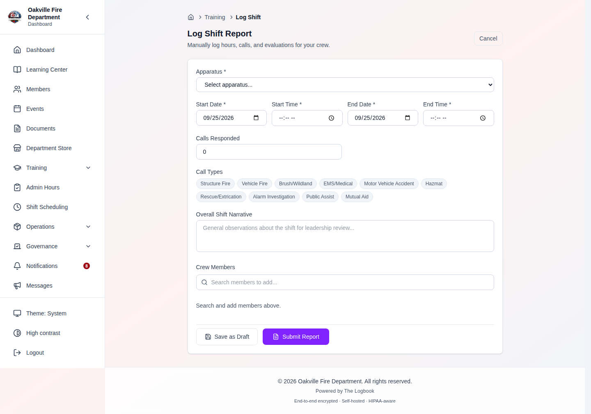

> **[SCREENSHOT NEEDED]:** _Screenshot of the apparatus selector on the manual entry form, showing the dropdown with apparatus types and the auto-populated skills section below it._

### Admin Configuration

Administrators can configure manual shift entry via the **ManualEntrySettingsPanel** on the Training Admin page:

| Setting                 | Description                                                        |
| ----------------------- | ------------------------------------------------------------------ |
| **Enable Manual Entry** | Toggle the feature on/off for the department                       |
| **Require Apparatus**   | Make apparatus selection mandatory on the manual form              |
| **Allowed Apparatus**   | Restrict which apparatus types are available (leave empty for all) |
| **Default Start Time**  | Pre-fill the start time field (e.g., "07:00")                      |
| **Default Duration**    | Pre-fill the shift duration, auto-calculating the end time         |

**Everything except the enable checkbox is hidden while the feature is off**,
which is how it ships — the apparatus rules and the shift defaults appear only
once **Enable Manual Shift Entry** is ticked. A panel showing nothing but a
single unticked checkbox is the feature disabled, not a broken page.

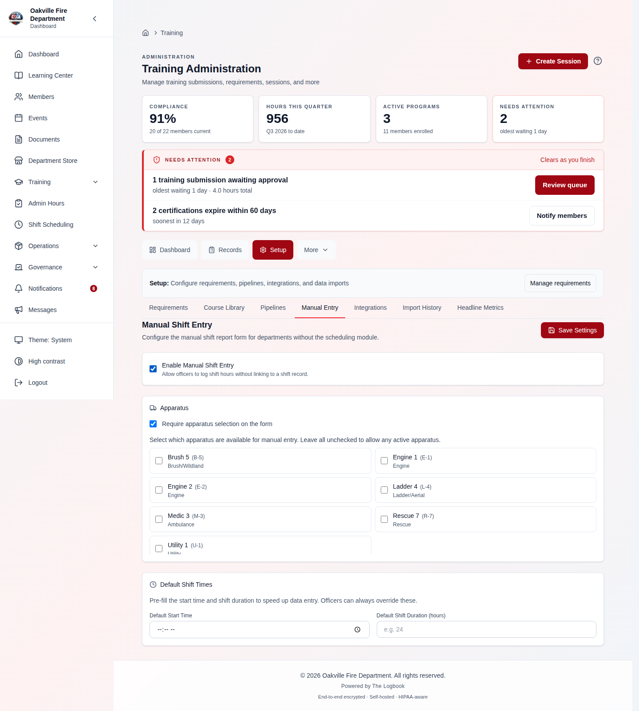

### Edge Cases

- **Manual report for a date with a scheduled shift**: A warning is shown, but the officer can proceed — manual and scheduled reports are independent
- **Apparatus type with no skill/task mappings**: Form shows empty skills/tasks sections; officer can manually add entries
- **Zero-hour shift (same start/end time)**: Validation prevents submission; minimum 15-minute shift duration required
- **Midnight crossover**: If end time is earlier than start time, the system assumes the shift crosses midnight and calculates hours accordingly (e.g., 19:00 to 07:00 = 12 hours)

---

## Officer Training Record Exports

**Required Permission:** `training.manage`

Officers can export training records for state reporting, annual reviews, or for an individual member, in both CSV and PDF formats.

### Exporting a Single Member's Records

1. Open the member's **Training History** page (from the member's profile or directory).
2. Choose a period from the **Export period** dropdown — **This Month**, **This Quarter**, **This Year**, or **Lifetime**.
3. Click **CSV** or **PDF** to download that member's records for the chosen period.

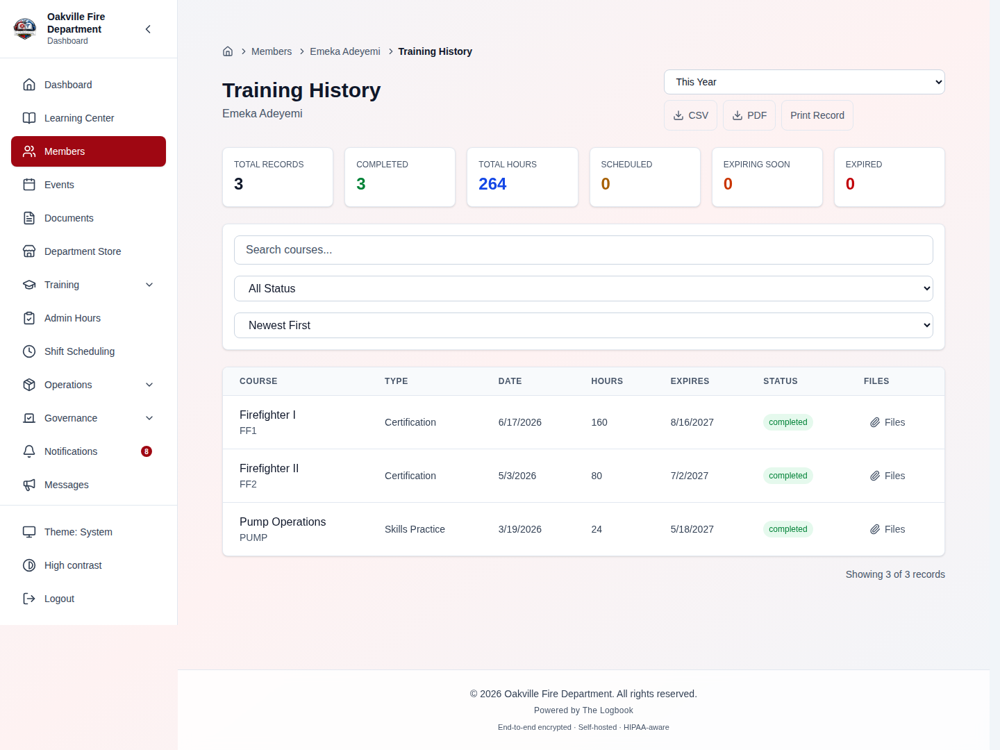

### Bulk and Reporting Exports (Reports Tab)

Navigate to **Training Admin > Reports** for department-wide exports:

1. **Member Records (All Members)** — Choose a period, then click **CSV** or **PDF**. The CSV combines every active member's completed records; the PDF merges per-member sections into one document.
2. **Hours Summary** — A CSV of training hours broken down by member, category, and training type, suited to state and annual reporting.
3. **Certification Report** — A CSV of all certifications with their valid / expiring-soon / expired status for renewal tracking.
4. **Compliance Report** — Department-wide compliance status across all members and requirements.

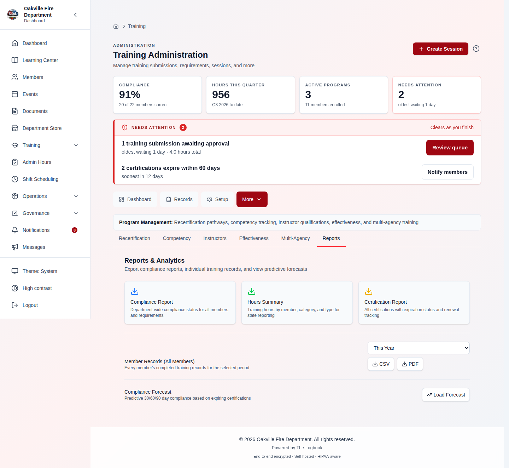

> **Hint:** A bulk PDF for a period with no matching records still produces a valid (placeholder) PDF rather than failing — useful as proof that a quiet period was reviewed.

---

## External Training Integrations

**Required Permission:** `training.manage`

Navigate to **Training Admin > Integrations** to connect external training providers.

Supported integrations:

- External training provider configuration
- Category mapping (map external categories to internal ones)
- User mapping (link external user accounts to Logbook members)
- Sync logs and import history

> **Screenshot placeholder:**
> _[Screenshot of the External Training Integrations page showing a connected provider with sync status, last sync date, and a list of recent imports]_

### Vector Solutions Enhancements _(2026-04-11)_

The Vector Solutions integration now includes:

- **Category catalog fetch**: Before your first sync, fetch the full Vector Solutions category catalog to set up mappings upfront. Click **Fetch Categories** on the provider detail page to load all available VS categories, then map each to an internal training category
- **Credit hours preservation**: The system now stores both the original **credit hours** from Vector Solutions (used for CE credit tracking) and the converted **clock hours** (used for compliance). Previously only clock hours were captured
- **Improved type mapping**: Course types from Vector Solutions now correctly map to internal training types during import, preserving certification data and expiration dates
- **Auto-sync scheduling**: After initial setup, syncs can be triggered manually or run on a scheduled basis via the background task system

> **[SCREENSHOT NEEDED]:** _Screenshot of the Vector Solutions category mapping table showing external VS categories on the left, internal training categories on the right with dropdown selectors, and a "Fetch Categories" button at the top. Show at least one mapped and one unmapped category._

**Edge Cases:**

- If a Vector Solutions category has no internal mapping, the record is imported with an "Unmapped" flag and the officer is prompted to complete the mapping
- If credit hours differ from clock hours (e.g., a 2-hour course awards 3 CE credits), both values are stored independently
- Duplicate detection uses member + course name + completion date — matching records are skipped with a logged reason

### National Registry (NREMT) Standard Linkage _(2026-04-11)_

Training categories can now be linked to **NREMT National Continued Competency Requirement (NCCR)** codes. This enables automatic compliance tracking against national recertification requirements.

**How it works:**

Registry codes are **not typed in by hand.** They arrive attached to the
requirements you import from a standards registry, and the code travels with the
requirement from then on:

1. Open a program pipeline and add a requirement from the **requirement library**
2. Pick a registry-sourced requirement — the library shows its registry code in
   brackets after the name, and the search box matches on that code, so
   `NCCR` narrows the list to registry entries
3. The imported requirement keeps its `registry_code`, `registry_name` and
   `source` attribution
4. The compliance matrix shows NCCR progress alongside department-specific
   requirements

> **There is no category edit form.** `registry_code` exists on the training
> category model and its API accepts it, but no screen in the application
> creates or edits training categories — categories appear only as selectors on
> other forms. A previous version of this section described editing a category
> and typing a code into a **Registry Code** field; neither the screen nor the
> field exists. Setting a code on a category is an API-only operation today.

**NREMT terminology updates:**

- "Cardiovascular" category renamed to **"Cardiology"** to match official NREMT terminology
- Hour distributions updated to match the official NREMT NCCR requirements for EMT, AEMT, and Paramedic certification levels

### Training Program Export/Import _(2026-04-11)_

Officers can share training programs between departments:

**Exporting a Program:**

1. Navigate to **Training > Programs**
2. Open the program you want to share
3. Click the **Export** button
4. The system generates a JSON package containing all phases, requirements, milestones, and linked course definitions
5. Save or share the JSON file with other departments

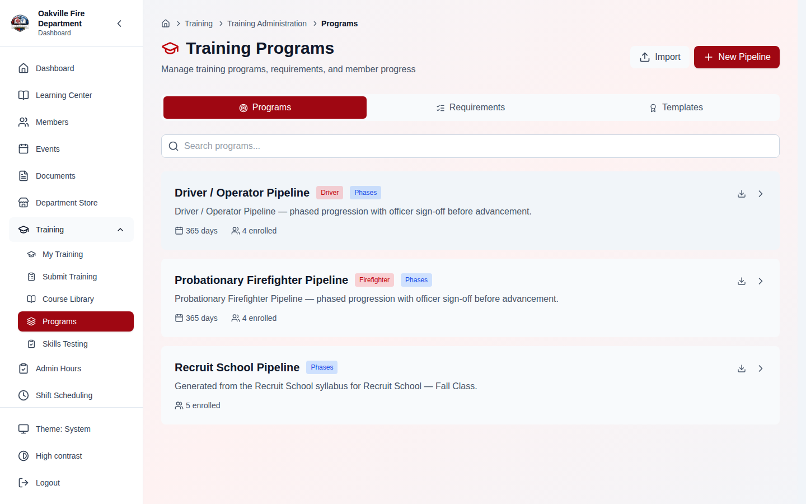

**Importing a Program:**

1. Navigate to **Training > Programs**
2. Click **Import Program**
3. Upload the JSON package file
4. The system validates the package structure and reports any conflicts
5. Review the import preview showing what will be created
6. Confirm the import

> **[SCREENSHOT NEEDED]:** _Screenshot of the import preview showing the program name, number of phases, requirements, and milestones that will be created, with a "Confirm Import" button._

**Edge Cases:**

- If an imported program references a course that already exists in your department, the existing course is reused (no duplicate created)
- If a phase name matches an existing phase in another program, the new phase is created with an " (Imported)" suffix
- Registry codes from the exporting department are included; you can map them to your own categories after import

---

## Historical Import

**Required Permission:** `training.manage`

Navigate to **Training Admin > Import History** to import historical training records from a CSV file.

1. Upload your CSV file with historical training data.
2. The system **parses and previews** the data.
3. Review the preview for any validation errors.
4. Confirm the import.

> **Screenshot placeholder:**
> _[Screenshot of the historical import page showing the file upload area, a parsed data preview table, and a confirmation button]_

---

## Competency Matrix

**Required Permission:** `training.manage`

Navigate to **Training Admin > Advanced > Competency** to define the skill levels each position is expected to hold.

A competency matrix is a per-position definition: a name, the position it applies to, and a list of skills with the level expected for each. The tab lists the matrices your department has defined; **Add Matrix** creates another. Levels use the Dreyfus scale, shown in the legend above the list:

- **Novice**
- **Advanced Beginner**
- **Competent**
- **Proficient**
- **Expert**

> **Screenshot placeholder:**
> _[Screenshot of the Competency Matrix showing a heat-map grid with member names on rows, competency areas on columns, and color-coded cells. Include the filter bar at the top for filtering by station, rank, or competency category]_

**Not yet built:** the department-wide member-by-competency heat-map — one row per member, one column per competency area, with a station/rank filter bar. The tab today shows only the matrix definitions; a member's own levels are readable through the API (`/training/competency/me` and `/training/competency/members/{id}`) but have no screen. The placeholder above stays open until that view exists.

### Edge Cases

- Member competency levels are cached for approximately 5 minutes. Changes to training records or skill test results may not appear immediately — wait for cache expiry or refresh the page.
- Members whose roles do not include a particular competency area show gray (N/A) cells, not red. This prevents false negatives in department readiness views.
- If a member has a waiver active for a competency-related requirement, their cell reflects the waiver-adjusted status, not the full requirement.

---

## Recertification Tracking

**Required Permission:** `training.manage`

The system automatically tracks certification expiration dates and generates recertification reminders with configurable lead times.

### Recertification Pathways

Navigate to **Training Admin > Advanced > Recertification** to configure recertification pathways. Each pathway defines:

- **Renewal type** — Hours, Courses, Assessment, or a Combination
- **Required hours / courses** — What has to be completed inside the cycle
- **Renewal window** — How far ahead of expiry the pathway opens, in days. This is the lead time reminders are sent from
- **Grace period** — How long past expiry a member may still complete the renewal. Zero means the qualification lapses on the day
- **New expiration** — How many months the renewal is good for
- **Auto-create record** — Whether completing the renewal writes a training record automatically

**Generate Tasks** scans for expiring certifications and creates the renewal tasks members will see.

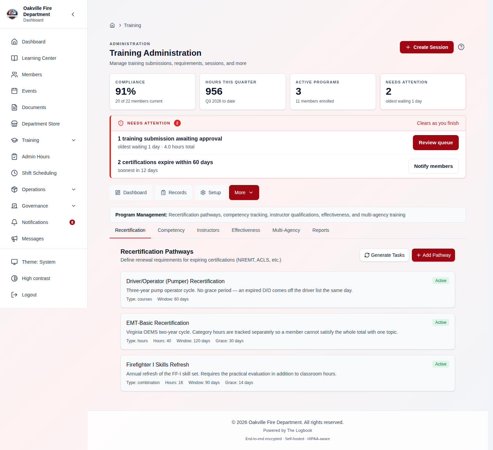

### Member View

Members can view their upcoming recertification tasks at **Training > My Training** in the recertification section. Each task shows:

- The certification requiring renewal
- Days until expiration
- Required renewal steps and their completion status
- Links to relevant courses or submission forms

> **Screenshot placeholder:**
> _[Screenshot of the member's My Training page showing the recertification section with a certification expiring in 45 days, renewal tasks with checkmarks for completed steps, and a progress indicator]_

### Edge Cases

- Recertification reminders require `EMAIL_ENABLED=true` in the environment and an active Celery beat scheduler running the `process_recertification_reminders` task.
- If a member holds multiple certifications of the same type (e.g., from different issuers), the system tracks each independently. The earliest expiration triggers reminders first.
- Permanent waivers do not suppress recertification reminders — certifications must still be maintained even if training hour requirements are waived.
- If a certification is renewed before the recertification pathway tasks are completed, the tasks are automatically closed and marked as superseded.

---

## Instructor Management

**Required Permission:** `training.manage`

Navigate to **Training Admin > Advanced > Instructors** to manage instructor qualifications and availability.

### Instructor Qualifications

Each instructor qualification record tracks:

| Field                  | Description                                          |
| ---------------------- | ---------------------------------------------------- |
| **Member**             | The qualified instructor                             |
| **Qualification type** | instructor, evaluator, lead_instructor, or mentor    |
| **Course**             | Which course(s) the instructor is qualified to teach |
| **Certification date** | When the qualification was earned                    |
| **Expiration date**    | When the qualification expires (if applicable)       |

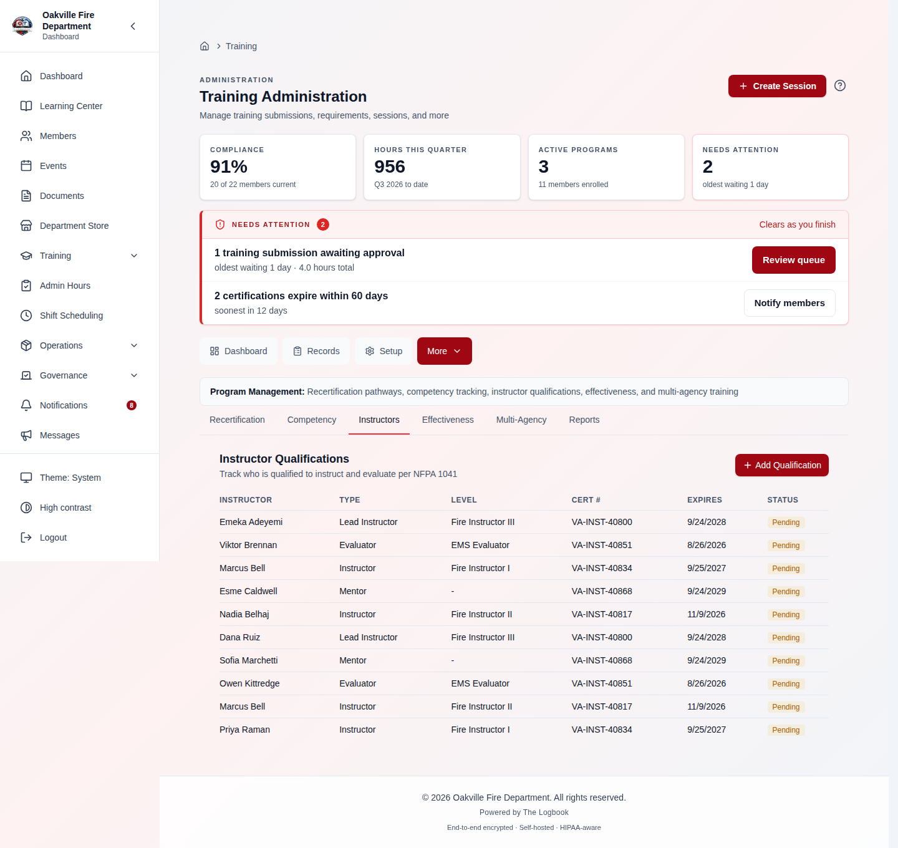

The roster's **Status** column reports whether an officer has _verified_ the qualification, not whether it has expired — a lapsed qualification still reads "Pending" until someone verifies it. Read the **Expires** column for currency. The course a qualification is tied to is stored but not shown in this table; open the record to see it.

### Assigning Instructors to Sessions

When creating a training session, you can assign a qualified instructor. The system validates that the instructor holds a valid qualification for the course being taught.

### Edge Cases

- Instructor availability is tracked separately from member scheduling. An instructor may be available for training but assigned to a shift — check both the instructor availability calendar and the scheduling module.
- If an instructor's qualification expires between session creation and the session date, the system displays a warning but does not automatically remove the assignment. The training officer should reassign.
- The `GET /training/instructors/validate/{userId}/{courseId}` endpoint can programmatically verify whether a member is qualified to instruct a specific course.

---

## Training Effectiveness Scoring

**Required Permission:** `training.manage`

Navigate to **Training Admin > Advanced > Effectiveness** to view and manage training effectiveness evaluations.

The system uses the **Kirkpatrick Model** to measure training effectiveness across four levels:

| Level | Name         | What It Measures                         |
| ----- | ------------ | ---------------------------------------- |
| 1     | **Reaction** | How participants felt about the training |
| 2     | **Learning** | Knowledge or skills gained               |
| 3     | **Behavior** | On-the-job application of training       |
| 4     | **Results**  | Organizational impact of the training    |

### Submitting Evaluations

After a training session, evaluations capture participant feedback and learning outcomes. **Training Admin > Advanced > Effectiveness** shows one card per Kirkpatrick level with its evaluation count and average rating, above a table of the most recent evaluations.

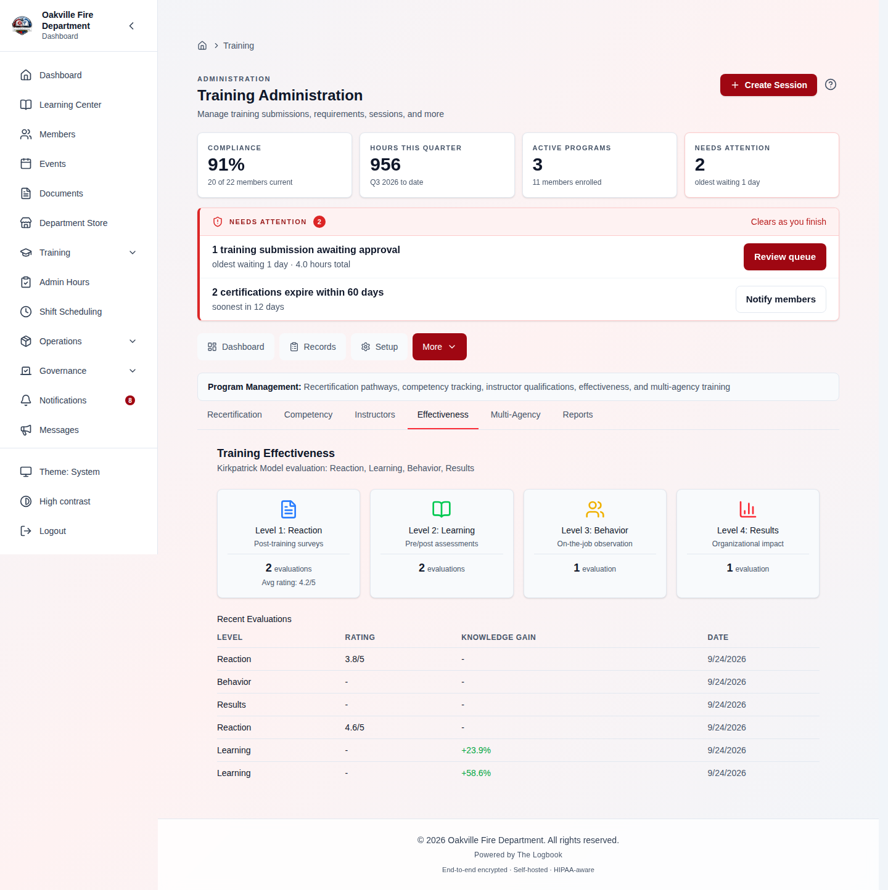

**Not yet built:** there is no evaluation form on this tab — it is read-only. Evaluations are submitted through the API (`POST /training/effectiveness/evaluations`), typically by an integration or a script, not by an officer in the browser.

### Viewing Summaries

The effectiveness summary for a course aggregates all evaluations and displays:

- Average score per Kirkpatrick level
- Number of evaluations submitted
- Trend over time

### Edge Cases

- Effectiveness scoring requires post-training evaluations to be submitted. Scores will not appear until the evaluation period configured on the training session has elapsed and at least one evaluation has been submitted.
- Level 3 (Behavior) and Level 4 (Results) evaluations are typically submitted weeks or months after training. The system allows backdated evaluation submissions.
- If no evaluations exist for a course, the effectiveness summary returns empty data rather than zeros, to distinguish "not measured" from "scored zero."

---

## Multi-Agency Training

Navigate to **Training Admin > Advanced > Multi-Agency** to coordinate joint training sessions with other departments.

Multi-agency training sessions allow:

- Scheduling joint training events across departments
- Sharing training records between participating organizations
- Mutual aid tracking and documentation
- xAPI statement delivery to external Learning Record Stores (LRS)

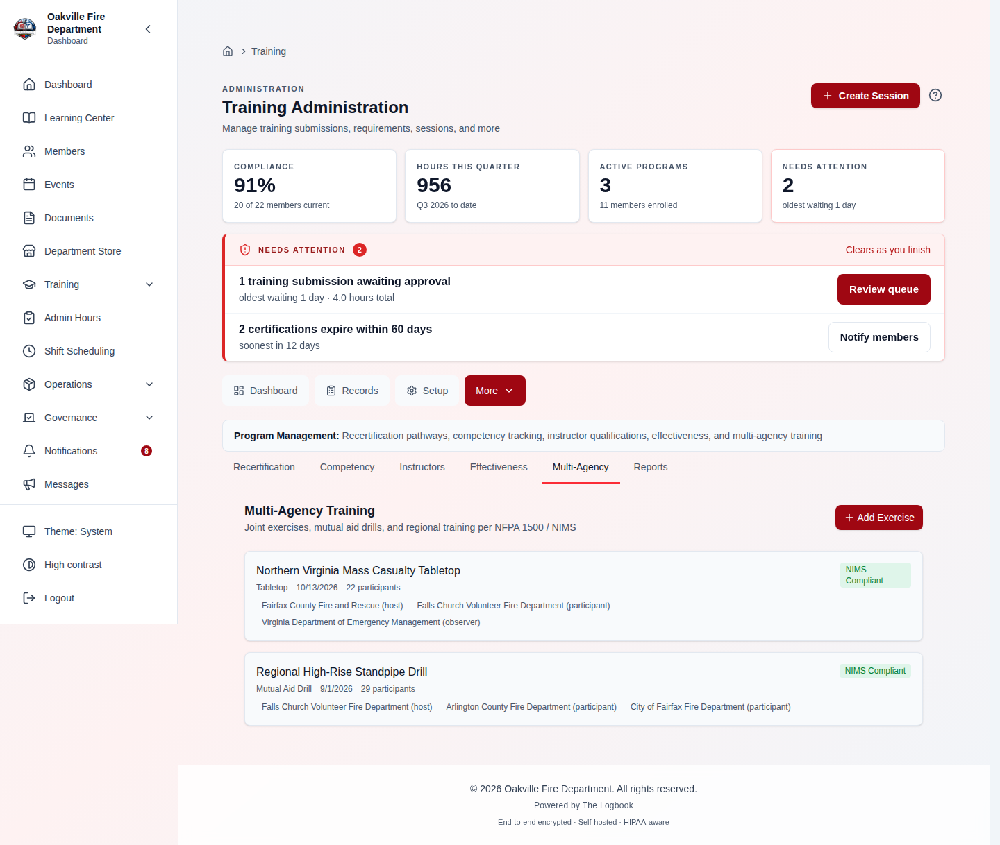

Each card shows the exercise type, date and total headcount, a chip per participating organization with its role (host, participant, observer, evaluator), and a **NIMS Compliant** badge where the exercise was recorded as such. There is no planned/in-progress/completed status on an exercise — the date is what tells you whether it has happened.

### Creating a Multi-Agency Session

1. Click **Add Exercise**.
2. Enter the exercise details (name, type, date, description).
3. Add participating organizations by name, with each one's role and headcount.
4. Assign the lead agency responsible for reporting.
5. Click **Save**.

### Edge Cases

- Multi-agency training records are sent asynchronously via Celery. If xAPI statements are not appearing in the external LRS, check Celery worker logs for delivery failures and verify the LRS endpoint URL and API key in training integration settings.
- Data sharing between organizations is limited to training session metadata, completion status, and hours. Member PII (names, contact info) is not shared unless explicitly configured by both organizations.
- If a participating organization does not use The Logbook, their members' training records can still be logged manually with organization attribution.

---

## xAPI (Tin Can) Integration

Navigate to **Training Admin > Integrations** to configure xAPI Learning Record Store (LRS) connections.

xAPI integration enables standardized training activity tracking using the Experience API specification. Training activities generate xAPI statements that are delivered to configured LRS endpoints.

### Configuration

| Setting              | Description                                        |
| -------------------- | -------------------------------------------------- |
| **LRS Endpoint URL** | The URL of the Learning Record Store               |
| **API Key**          | Authentication key for the LRS                     |
| **Statement types**  | Which training activities generate xAPI statements |
| **Delivery mode**    | Synchronous or asynchronous (via Celery)           |

### Edge Cases

- xAPI statements are delivered asynchronously via Celery by default. Delivery failures are retried with exponential backoff.
- If the LRS endpoint is unreachable, statements are queued and retried. Check the Celery dead-letter queue if statements consistently fail.
- Batch processing is supported via `POST /training/xapi/statements/batch` for bulk statement delivery.

---

## Compliance Officer Dashboard

**Required Permission:** `training.manage`

Navigate to **Training Admin > Compliance** for a specialized compliance officer view (Annual Report, ISO Readiness, Record Quality, Attestations, and Forecast).

This dashboard provides:

### ISO Readiness

Track organizational readiness against ISO standards with:

- Overall readiness score, and an estimate of the FSRS training credit earned
- Category-by-category assessment against the NFPA standard each one maps to, with the department total, the per-member average, and how many members meet the annual requirement

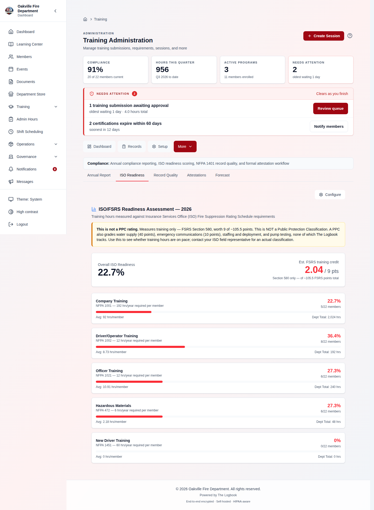

This scores training only — FSRS Section 580, 9 points of roughly 105.5. It is **not** a Public Protection Classification, as the banner on the page says.

Hours are attributed to an ISO category through the training **category** on the record, falling back to the categories on its course. A department that files pump training under Fire Suppression will see Driver/Operator read zero: NFPA 1002 is scored separately from NFPA 1001, so give driver/operator training its own category if you want credit for it.

### Compliance Attestations

Officers can submit and track compliance attestations — formal declarations that specific compliance requirements have been verified.

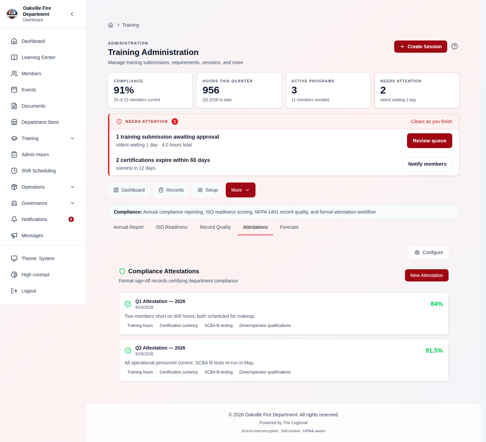

### Annual Compliance Report

Generate a comprehensive annual compliance report covering:

- Department-wide training completion rates
- Certification status across all members
- Waiver summary and impact
- Requirement-by-requirement breakdown
- Year-over-year comparison

The report can be exported as a formatted document for regulatory submissions.

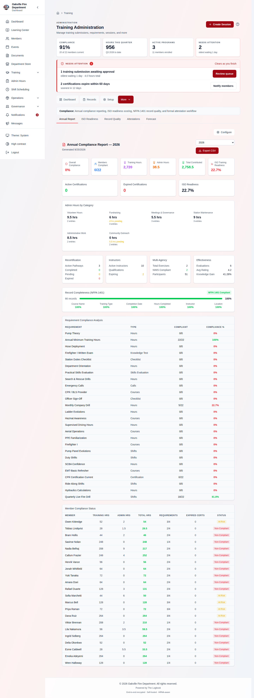

### Compliance Forecast

The compliance forecast projects future compliance trends based on:

- Current training completion rates and trajectories
- Upcoming certification expirations
- Scheduled training sessions
- Historical compliance patterns

The projection horizon is **30, 60 and 90 days** — summary cards across the top, then one row per member showing each horizon alongside the certifications expiring inside it.

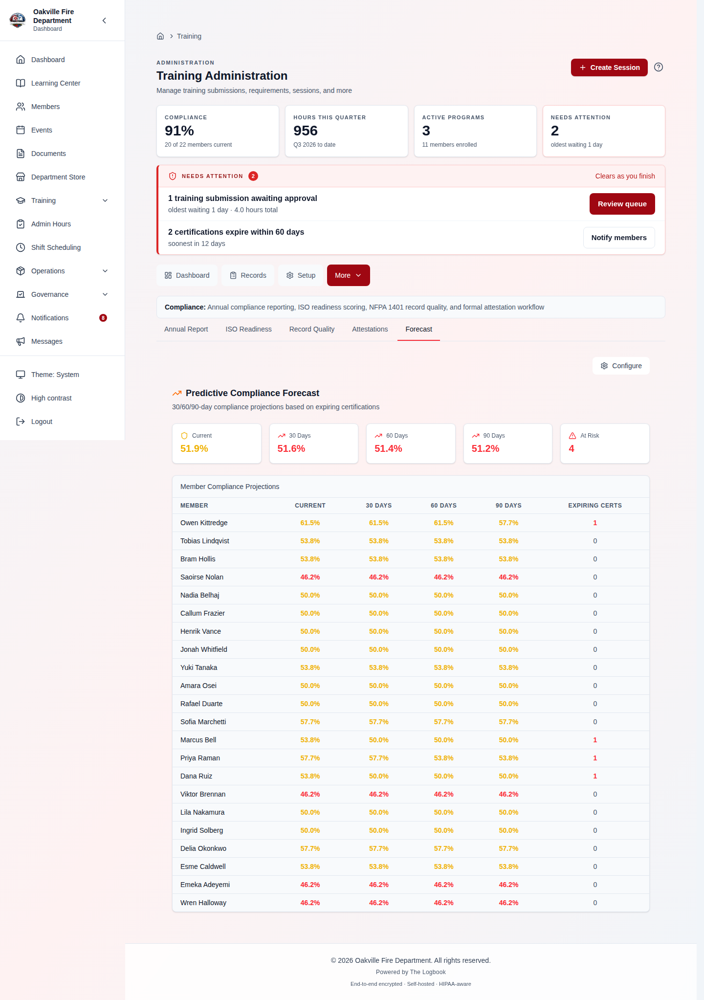

### Edge Cases

- The compliance forecast uses historical data to project trends. Forecasts are less reliable for organizations with fewer than 6 months of data.
- Annual compliance reports include waiver-adjusted requirements. If a waiver end date changes retroactively (e.g., a member returns from leave early), the report reflects the updated adjustments.
- Record completeness checks (`GET /compliance/record-completeness`) identify training records missing key fields (hours, certification numbers, completion dates). Incomplete records may not count toward compliance.

---

## Training Record Attachments

Members and officers can attach supporting documents (certificates, transcripts, completion letters) to a training record and download them later.

### Uploading and Downloading Attachments

1. On the **Member Training History** page, find the record and click its **Files** action to open the Attachments panel.
2. Click **Upload** and choose the file. Allowed types are PDF, JPEG, PNG, GIF, WEBP, DOC, and DOCX, up to **25 MB** each.
3. The uploaded file appears in the list. Click **Download** next to any attachment to retrieve it.

> **[SCREENSHOT NEEDED]:** _The Attachments panel for a training record showing an uploaded certificate in the list with its Download link and the Upload button._

> **Hint:** You can manage attachments on **your own** records. Officers with `training.manage` permission can manage attachments on any member's records.

### Edge Cases

- Files larger than 25 MB are rejected with "File too large. Maximum size is 25MB."
- The file type is verified by inspecting the file's contents, not just its name — a file with a disallowed type is rejected even if it is renamed with an allowed extension.

---

## Training Submission & Compliance Edge Cases

The training module has several boundary behaviors that affect how submissions are processed, how compliance is calculated, and how waivers interact with requirements.

### Self-Reported Submission Processing

| Scenario                                         | Behavior                                                                                                                         |
| ------------------------------------------------ | -------------------------------------------------------------------------------------------------------------------------------- |
| Department disables approval requirement         | Submissions are auto-approved immediately — no officer review. A training record is created on submit.                           |
| Hours below `auto_approve_under_hours` threshold | Auto-approved even when approval is generally required. Officers configure this threshold in Training Settings.                  |
| Hours exceed `max_hours_per_submission`          | Submission rejected: "Hours exceed maximum of N per submission." Re-submit with corrected hours.                                 |
| Training type not in allowed types list          | Submission rejected: "Training type 'X' is not allowed for self-reporting." Only types listed in the configuration are accepted. |
| Submission already reviewed                      | Attempting to approve or reject a non-pending submission returns: "Submission has already been reviewed."                        |

### Compliance Calculation

| Scenario                                                 | Behavior                                                                                                                                                                                                                                           |
| -------------------------------------------------------- | -------------------------------------------------------------------------------------------------------------------------------------------------------------------------------------------------------------------------------------------------- |
| Membership tier marked `training_exempt`                 | Member is fully exempt from all training requirements — shows green compliance regardless of hours.                                                                                                                                                |
| Tier has `training_exempt_types` list                    | Member is exempt only from requirements matching those training types. Other requirements still apply.                                                                                                                                             |
| Tier lookup fails (corrupt config)                       | System fails open — member is treated as non-exempt and must meet all requirements. Officers may see unexpected non-compliance for senior-tier members.                                                                                            |
| `COURSES` requirement with empty `required_courses` list | Auto-completes immediately (100% progress). Appears green in the compliance matrix.                                                                                                                                                                |
| `CERTIFICATION` requirement matching                     | Matches records via three fallback strategies: (1) `training_type` match, (2) case-insensitive requirement name substring in course name, (3) `registry_code` substring in certification number. If none match, the member shows as non-compliant. |
| Biannual requirement with expired certification          | Even if the member has accumulated sufficient hours, an expired certification resets progress to 0 and blocks further activity.                                                                                                                    |
| `BIANNUAL` or `ONE_TIME` frequency requirements          | No date window applied — ALL historical training records count toward the requirement, not just recent ones.                                                                                                                                       |

### Waiver Behavior

| Scenario                                    | Behavior                                                                                                                                        |
| ------------------------------------------- | ----------------------------------------------------------------------------------------------------------------------------------------------- |
| Waiver covers fewer than 15 days of a month | That month is NOT counted as waived — the member must still meet the full requirement for that month.                                           |
| Waiver covers 15 or more days of a month    | The entire month is waived and the requirement is pro-rated.                                                                                    |
| Permanent waiver (no end date)              | Stored with a sentinel end date of 9999-12-31 for calculation purposes. Displays as "Permanent" in the UI.                                      |
| LOA with unrecognized leave type            | Auto-linked training waiver defaults to `OTHER` waiver type. The waiver still functions but the type classification may not match expectations. |

---

## Troubleshooting

| Issue                                        | Solution                                                                                                                                                                                                                      |
| -------------------------------------------- | ----------------------------------------------------------------------------------------------------------------------------------------------------------------------------------------------------------------------------- |
| "My training submission was rejected"        | Check the rejection reason in your notification. Correct the issue and resubmit.                                                                                                                                              |
| Hours not counting toward a requirement      | Verify the training record's course is linked to the correct requirement. The record must be in "Approved" status.                                                                                                            |
| Program progress not updating after a shift  | Shift completion reports must be filed by the shift officer. Auto-progression only works for enrolled members with matching requirement types.                                                                                |
| Compliance matrix shows incorrect data       | Check the requirement's frequency and due date type settings. Rolling periods use today's date as the reference point.                                                                                                        |
| Member on leave still shows as non-compliant | Verify the Leave of Absence is active under **Members > Admin > Waivers**. The leave must cover ≥15 days of a month for that month to be waived. Only hours, shifts, and calls requirements are adjusted.                     |
| LOA created but training not adjusted        | Check that `exempt_from_training_waiver` is not set on the leave. The auto-linked training waiver should appear in the Training Waivers tab. If missing, create a standalone training waiver from the Waiver Management page. |
| Duplicate training record warning            | The system detects records with the same member + course name (case-insensitive) + completion date within ±1 day. Review the warning and either proceed or skip the duplicate.                                                |
| Compliance card shows wrong color            | Red = expired certs or <50% requirements met; Yellow = expiring certs or <100% requirements met; Green = all met. Check individual requirement progress for details.                                                          |
| Certification alert not received             | Alerts are sent once per tier (90/60/30/7 days). Check the record's `alert_*_sent_at` fields. If all tiers are already sent, no further alerts will be triggered.                                                             |
| Rank shows as unrecognized                   | Navigate to Members Admin to see rank validation results. Update the member's rank to match one of the configured operational ranks in Settings.                                                                              |
| Cannot see the Training module               | Training is an optional module. Your department administrator must enable it in Settings > Modules.                                                                                                                           |
| External integration not syncing             | Check the integration configuration and sync logs. Ensure user mappings are correctly set up.                                                                                                                                 |
| Imported requirements missing source info    | Update to the latest version. Imports now include `source`, `source_url`, and `last_updated` fields displayed in the UI for traceability.                                                                                     |
| How to list available registries             | Use the CLI tool: `python scripts/generate_registry.py --list` to see all available registries (NFPA, NREMT, Pro Board, etc.).                                                                                                |
| Source filter not working on requirements    | Update to the latest version. The source field has been added to the API schema and the filter is now wired up.                                                                                                               |
| Recertification reminders not sending        | Verify: (1) certification has expiration date, (2) recertification lead time is configured, (3) `EMAIL_ENABLED=true` in environment, (4) Celery beat is running the `process_recertification_reminders` task.                 |
| Competency matrix shows stale data           | The competency heat-map is cached for ~5 minutes. Wait for cache expiry or clear Redis cache in development.                                                                                                                  |
| xAPI statements not appearing in LRS         | Multi-agency training records are sent asynchronously via Celery. Check Celery worker logs for delivery failures. Verify LRS endpoint URL and API key in training integration settings.                                       |
| Instructor not available for session         | Instructor availability is tracked separately from member scheduling. Check the instructor's availability calendar in Training Admin > Instructors.                                                                           |
| Effectiveness score not calculating          | Training effectiveness scoring (Kirkpatrick model) requires post-training evaluations to be submitted. Scores appear after the evaluation period configured on the training session.                                          |

---

## Recurring Training Sessions (2026-03-15)

Training sessions can now recur on a schedule, just like events. This eliminates the need to manually create individual sessions for ongoing training activities like weekly drills, monthly CPR refreshers, or quarterly hazmat reviews.

> **Recurring session or cohort?** A recurring session repeats **the same class** — the same subject, the same credit hours, over and over. If instead you have an ordered series of **different** classes that runs once (a recruit school: orientation, then SCBA, then ladders), you want a course cohort. See [Multi-Class Courses & Cohorts](#multi-class-courses--cohorts).

### Creating a Recurring Training Session

1. Navigate to **Training > Admin > Create Session**
2. Fill in the session details (title, training type, instructor, location)
3. Select a **course** from the dropdown — the form auto-fills training type, credit hours, instructor, expiration months, and max participants from the course template

> **Screenshot needed:**
> _[Screenshot of the Create Training Session form showing the course auto-populate feature with the details preview card below the course dropdown]_

4. Set the **start date/time** using the new quarter-hour time picker (restricted to `:00`, `:15`, `:30`, `:45`)

> **Screenshot needed:**
> _[Screenshot of the DateTimeQuarterHour component showing the date picker and the quarter-hour dropdown side by side]_

5. Use one of the **quick duration buttons** (1 hr, 2 hr, 4 hr, 8 hr) to auto-set the end time, or set it manually

> **Screenshot needed:**
> _[Screenshot of the quick duration buttons row (1 hr | 2 hr | 4 hr | 8 hr) appearing below the start date field]_

6. Enable **Recurrence** and choose a pattern:
   - **Daily** — every N days
   - **Weekly** — specific days of the week
   - **Biweekly** — every two weeks
   - **Monthly** — same day of month
   - **Monthly by Weekday** — e.g., "2nd Tuesday of every month"
   - **Annually** — same date each year
   - **Custom** — user-defined interval

> **Screenshot needed:**
> _[Screenshot of the recurrence pattern selector showing radio buttons for each pattern type with the "Monthly by Weekday" option selected, displaying "2nd Tuesday of every month"]_

7. Set the series **end date** and click **Create**

The system creates one event per occurrence and links a `TrainingSession` record to each one. Each session inherits the training type, credit hours, and other fields from the parent configuration.

### Edge Cases

| Scenario                               | Behavior                                                                                                                           |
| -------------------------------------- | ---------------------------------------------------------------------------------------------------------------------------------- |
| Deleting the parent event              | Does not cascade-delete the linked training session record                                                                         |
| Quarter-hour picker with imported data | Arbitrary minute values from external sources are rounded to the nearest quarter-hour                                              |
| Course auto-populate                   | Fills all fields but does not lock them — you can override any auto-filled value                                                   |
| Quick duration buttons                 | Disabled until a start date is selected                                                                                            |
| Recurrence beyond series end date      | Events past the end date are not created                                                                                           |
| Existing course changes                | Sessions created from a course snapshot values at creation time — later course edits do not retroactively update existing sessions |

---

## Skills Testing

The Training module includes a **Skills Testing** sub-module for conducting structured psychomotor evaluations — the digital equivalent of NREMT skill sheets.

With Skills Testing, examiners can:

- Select a published skill sheet template (e.g., "Patient Assessment — Trauma")
- Score each step as the candidate performs the procedure
- Track critical (required) criteria that trigger automatic failure
- Automatically calculate pass/fail results based on scoring thresholds

> **Any member can be the examiner** _(2026-08-08)_ — departments routinely use
> senior members as evaluators. Building templates stays officer-only, and an
> official result only counts once a training officer **validates** it.

For a comprehensive guide with a realistic NREMT example walkthrough, see the dedicated **[Skills Testing & Psychomotor Evaluations](./09-skills-testing.md)** training guide.

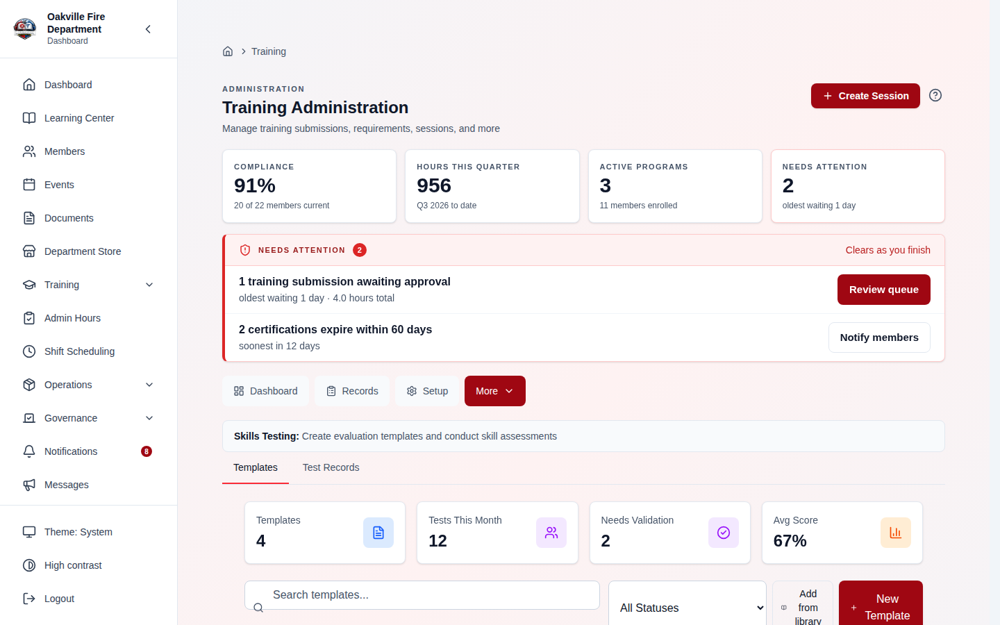

---

## Training Record Categories & Virginia NCCR Standards (2026-03-24)

### Training Record Categories

Training records now include a **Category** field for classification. When submitting or reviewing training records, select the appropriate category:

| Category        | Description                                 |
| --------------- | ------------------------------------------- |
| Fire            | Fire suppression and prevention training    |
| EMS             | Emergency Medical Services training         |
| Hazmat          | Hazardous materials response training       |
| Rescue          | Technical rescue training                   |
| Driver/Operator | Apparatus operation and EVOC training       |
| Leadership      | Officer development and leadership training |

Categories align with state reporting requirements and are used in compliance calculations for jurisdictions that require specific category hour minimums.

> **Screenshot needed:**
> _[Screenshot of the training record submission form showing the new "Category" dropdown field with options like Fire, EMS, Hazmat, Rescue, and the existing fields (course, date, hours)]_

### Virginia NCCR Recertification Standards

Virginia's National Continued Competency Requirements (NCCR) recertification standards have been added to the compliance tracking system. These define:

- Required training categories for recertification
- Hour minimums per category
- Recertification cycle periods

The compliance dashboard shows progress toward NCCR requirements with category breakdowns.

> **Screenshot needed:**
> _[Screenshot of the compliance dashboard showing a Virginia NCCR progress card with category bars (Fire: 12/16 hours, EMS: 8/8 hours, Hazmat: 2/4 hours) and an overall progress percentage]_

### EVOC Certification Levels

EVOC (Emergency Vehicle Operations Course) certification levels are now tracked on member profiles:

- **Basic** — Standard vehicle operation
- **Intermediate** — Emergency vehicle operation with lights and sirens
- **Advanced** — Specialized apparatus operation (aerials, heavy rescue)

EVOC levels integrate with the Apparatus module (required EVOC level per vehicle) and Scheduling module (validation on driver/operator assignments).

> **Screenshot needed:**
> _[Screenshot of a member's training profile showing the EVOC certification level field with "Advanced" selected and the certification date]_

### Bulk Entry Improvements

The bulk training record entry form now includes all available fields, matching the individual record creation form:

- Category selection
- Training type
- Certification-related fields (certification name, expiration date, certifying body)
- Notes and attachments

### Edge Cases

| Scenario                                 | Behavior                                                                |
| ---------------------------------------- | ----------------------------------------------------------------------- |
| Training record with no category         | Not counted toward category-specific compliance requirements            |
| Virginia NCCR with incomplete categories | Missing categories flagged in compliance dashboard                      |
| EVOC level not set on member profile     | Member can still be assigned to driver positions but a warning is shown |
| Bulk entry with mixed categories         | Each record saves with its own category independently                   |

---

## Printing Training Records, Programs & Compliance (2026-04-08)

Three new print-formatted pages allow you to generate paper copies of training data for audits, regulatory filings, annual reviews, and member records.

### Printing a Member's Training History

1. Navigate to **Training > Members** and select a member, or open a member's training history page
2. Click the **Print** button in the page header
3. A new tab opens with a paper-formatted view of the member's training records

The printed record includes:

- Member name, rank, station, and membership dates
- Training hours summary (current period and all-time)
- Certification status and expiration dates
- Compliance indicators (green/yellow/red) for all active requirements
- Complete list of training records with course name, date, hours, category, and status

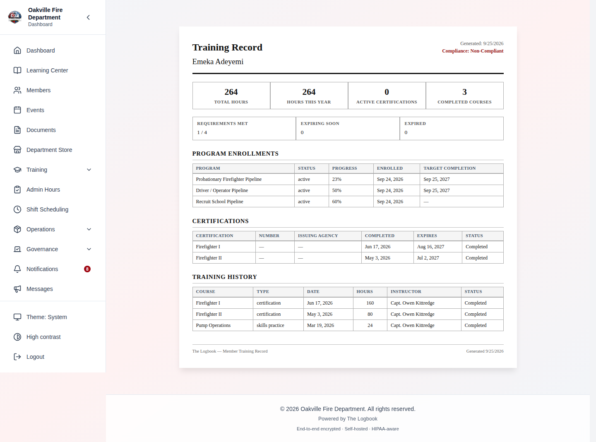

### Printing a Training Program

1. Navigate to **Training > Programs** and select a program
2. Click the **Print** button in the page header
3. A new tab opens with a paper-formatted view of the program

The printed program includes:

- Program name, description, type (Phase-based or one-list), and status
- Phase breakdown with all requirements listed under each phase
- Milestone checkpoints with completion criteria
- Enrollment roster with per-member progress percentages

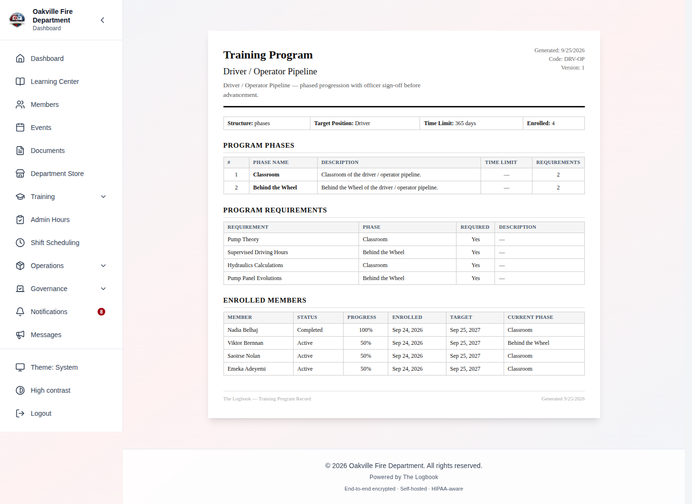

### Printing the Compliance Matrix

**Required Permission:** `training.manage`

1. Navigate to **Training Admin > Compliance Matrix**
2. Click the **Print** button in the toolbar above the matrix
3. A new tab opens with the full compliance matrix formatted for paper

The printed matrix includes:

- All members listed as rows and all active requirements as columns
- Color-coded cells (green for compliant, yellow for in-progress, red for non-compliant) with percentage values
- Designed for **landscape printing** on letter-size paper
- Repeat column headers across page breaks when the matrix spans multiple pages

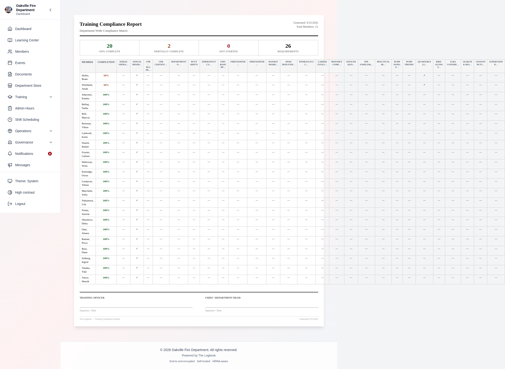

This is particularly useful for:

- **Annual training audits** — print the matrix at year-end for records
- **Regulatory filings** — provide printed compliance evidence to regulatory agencies
- **Officer reviews** — give training officers a paper overview during planning meetings
- **Insurance requirements** — document department-wide training compliance

### Edge Cases

| Scenario                            | Behavior                                                   |
| ----------------------------------- | ---------------------------------------------------------- |
| Member with no training records     | Print page shows empty table with "No records found"       |
| Program with no enrollments         | Enrollment section shows "No members enrolled"             |
| Compliance matrix with 100+ members | Paginated across multiple pages with repeated headers      |
| Browser blocks auto-print dialog    | Page remains visible for manual Ctrl+P                     |
| Member on leave of absence          | Print page shows adjusted requirements with leave notation |

---

## Realistic Example: Completing a Probationary Training Program

This walkthrough follows **FF Alex Rivera**, a probationary firefighter at Oakville Fire Department, through a 6-month training program managed by **Capt. Davis** (Training Officer). It demonstrates program enrollment, phase progression, shift report integration, external certification handling, and graduation.

### Part 1: Enrollment (March 25)

Capt. Davis navigates to **Training > Programs** and opens the "Probationary Firefighter Program." This is a **Phase-based** program with 4 phases and 15 total requirements. He clicks **Enroll Member**, searches for Alex Rivera, and confirms the enrollment.

After enrollment, the program dashboard for Alex shows:

| Field            | Value                                   |
| ---------------- | --------------------------------------- |
| Program          | Probationary Firefighter Program        |
| Type             | Phase-based                             |
| Enrolled         | March 25, 2026                          |
| Overall Progress | 0%                                      |
| Phases           | 4 (Phase 1 unlocked, Phases 2-4 locked) |
| Requirements     | 0 of 15 complete                        |

Phase 1 (Orientation) is immediately accessible. Phases 2 through 4 display a lock icon with the tooltip "Complete the previous phase to unlock." Alex can see her enrollment on the **My Training** dashboard under **Active Program Enrollments** with a progress bar at 0%.

> **[SCREENSHOT NEEDED]:** _The program enrollment detail page showing Alex Rivera's enrollment at 0% progress, Phase 1 unlocked with 4 requirements listed, and Phases 2-4 showing lock icons._

**Edge case — duplicate enrollment:** Later that week, Lt. Park (another officer) attempts to enroll Alex in the same program. The system returns: "Member is already enrolled in this program" and prevents the duplicate. Each member can have only one active enrollment per program.

### Part 2: Phase 1 — Orientation (March 25 - April 5)

Phase 1 requires Alex to complete 4 orientation tasks. Each has a different completion method:

| #   | Requirement               | Completion Method                   | Hours |
| --- | ------------------------- | ----------------------------------- | ----- |
| 1   | Department History Course | Self-reported                       | 2     |
| 2   | SOPs Review               | Self-reported (attachment required) | 3     |
| 3   | Facility Tour             | Officer-verified                    | 1     |
| 4   | Radio Procedures          | Officer-verified                    | 1     |

**Self-reported records (Requirements 1 and 2):**

Alex navigates to **Training > Submit Training**, selects "Department History" from the course dropdown, enters 2 hours, and submits. The record enters **Pending Review** status. Capt. Davis sees the submission in **Training Admin > Review Submissions**, reviews the details, and clicks **Approve**. The requirement is marked complete, and Alex receives a notification.

For the SOPs Review, Alex submits a training record but forgets to upload the signed acknowledgment form. Capt. Davis reviews the submission, notices the missing attachment, and clicks **Reject** with the note: "Please upload your signed acknowledgment form." Alex receives the rejection notification, resubmits with the PDF attached, and Capt. Davis approves the corrected submission.

**Officer-verified records (Requirements 3 and 4):**

After walking Alex through the facility tour, Capt. Davis creates a training record directly on Alex's behalf via **Training Admin > Officer Dashboard**, selecting "Facility Tour" and marking it as complete. The same process applies for Radio Procedures after Alex demonstrates proficiency.

After all 4 requirements are approved:

| Metric           | Value                                           |
| ---------------- | ----------------------------------------------- |
| Phase 1 Progress | 100% (4/4 complete)                             |
| Overall Progress | 27% (4/15 complete)                             |
| Phase 2 Status   | Unlocked (auto-triggered by Phase 1 completion) |
| Total Hours      | 7                                               |

Phase 2 (Basic Skills) opens automatically because Phase 1's required items are all complete — no officer action is needed unless the phase is flagged "Require officer approval to advance."

### Part 3: Phase 2 — Basic Skills via Shift Reports (April - June)

Phase 2 focuses on fireground skills observed during regular shift work. Over 12 shifts, shift officers file completion reports documenting Alex's skill demonstrations. Each skill requires 3 satisfactory observations before the requirement is considered complete.

**How shift reports credit requirements:**

After each shift, the shift officer finalizes the shift (creating draft reports for all enrolled trainees), then completes Alex's evaluation by scoring observed skills on a 1-5 scale. When the report is submitted and approved, the system automatically credits matching Phase 2 requirements.

**Progress after 12 shifts:**

| Requirement       | Observations Needed | Observations Complete | Score Progression | Status            |
| ----------------- | ------------------- | --------------------- | ----------------- | ----------------- |
| Hose Operations   | 3                   | 3                     | 2 → 3 → 4         | Complete          |
| Ladder Operations | 3                   | 3                     | 2 → 3 → 3         | Complete          |
| SCBA              | 3                   | 3                     | 3 → 4 → 4         | Complete          |
| Forcible Entry    | 3                   | 2                     | 3 → 3             | In Progress (67%) |
| Search & Rescue   | 3                   | 3                     | 3 → 3 → 4         | Complete          |
| Ventilation       | 3                   | 3                     | 2 → 3 → 4         | Complete          |

> **[SCREENSHOT NEEDED]:** _The Phase 2 detail view showing the six skill requirements with observation counts, score progressions displayed as small bar charts, and status indicators (green checkmarks for complete, yellow progress bars for in-progress)._

**Edge case — unmatched call type:** On April 18, Engine 1 responds to a carbon monoxide alarm. The shift officer files a completion report for that call, but the call type "CO Investigation" does not match any Phase 2 requirement's `required_call_types`. The 2 hours from that shift are counted toward Alex's overall program hours but no specific Phase 2 requirement is credited. The system logs this in `progress_notes`: "Call type 'CO Investigation' did not match any Phase 2 requirements."

**Edge case — officer omits "demonstrated" flag:** On May 3, Lt. Park files a shift report noting Alex performed ladder operations but forgets to check the "Demonstrated" checkbox on the skill entry. The skill observation is recorded but not credited toward the requirement. Lt. Park catches this during his weekly report review, edits the report to mark the skill as demonstrated, and the requirement progress updates on the next sync.

### Part 4: Phase 3 — EMS Certifications (June - July)

Phase 3 has 3 requirements focused on EMS qualifications:

| #   | Requirement            | Completion Method                    |
| --- | ---------------------- | ------------------------------------ |
| 1   | CPR/AED Certification  | External certificate upload          |
| 2   | First Responder Course | Self-reported (40 hrs)               |
| 3   | Patient Assessment     | Shift report observations (2 needed) |

**External certification (Requirement 1):**

Alex already holds a CPR/AED certification from a previous employer. She navigates to **Training > Submit Training**, selects the CPR/AED course, uploads the certificate PDF, and enters the certification date and expiration date. The record appears with source tagged as **External**. Capt. Davis reviews and approves it, and the Phase 3 requirement is auto-credited.

**Self-reported course (Requirement 2):**

Alex completes a 40-hour First Responder course at the community college. She submits the training record with 40 hours and attaches the completion certificate. Capt. Davis approves the submission.

**Shift report observations (Requirement 3):**

Over two medical calls in June, shift officers observe and document Alex's patient assessment skills in their completion reports. After the second approved observation, the requirement is complete.

Phase 3 is now 100% complete. Phase 4 unlocks automatically.

**Edge case — expiring certification:** Alex's CPR/AED certificate expires in 3 months (September). The system adds it to the **Expiring Certifications** view with a 90-day warning. Alex and Capt. Davis both receive an in-app and email notification at the 90-day mark. The certification shows a yellow indicator on Alex's compliance card.

### Part 5: Phase 4 — Live Fire & Graduation (August - September)

Phase 4 has 2 final requirements:

| #   | Requirement      | Target           | Method                                          |
| --- | ---------------- | ---------------- | ----------------------------------------------- |
| 1   | Supervised Hours | 40 hours         | Auto-calculated from all approved shift reports |
| 2   | Officer Sign-Off | Final evaluation | Officer-verified                                |

**Supervised hours (Requirement 1):**

The system automatically tallies all approved shift completion report hours filed for Alex across the entire program. By late August, Alex has accumulated 40.5 hours from 18 shift reports. The requirement shows 100% (40.5 / 40 hours). No manual entry is needed — this is purely calculated from existing report data.

**Officer sign-off (Requirement 2):**

Capt. Davis conducts a final evaluation session with Alex, reviews her performance across all phases, and marks the final sign-off requirement as complete in the system.

**Program completion:**

| Metric           | Value                              |
| ---------------- | ---------------------------------- |
| Overall Progress | 100% (15/15 complete)              |
| Program Status   | Completed                          |
| Total Hours      | 98.5                               |
| Duration         | March 25 - September 12 (171 days) |

Alex's membership status is now eligible for upgrade from **Probationary** to **Active** (see [Membership Management — Member Lifecycle](./01-membership.md)). The compliance matrix shows Alex green across all requirements.

> **[SCREENSHOT NEEDED]:** _The completed program dashboard showing 100% progress, all 4 phases with green checkmarks, the total hours summary, and a "Program Completed" banner with the completion date._

**Edge case — insufficient hours:** If Alex had only accumulated 38 of the required 40 supervised hours, the system would show 95% on that requirement (38/40). Capt. Davis can navigate to the requirement detail to see exactly which shifts contributed hours: a table listing each shift date, officer, hours credited, and call types. This transparency helps identify whether additional shifts need to be scheduled.

**What Auto-Progressed vs. What Required Manual Action:**

| Action                          | Method    | Triggered By                               |
| ------------------------------- | --------- | ------------------------------------------ |
| Phase unlocking                 | Automatic | Previous phase reaching 100%               |
| Shift report hours/calls/skills | Automatic | Approved shift completion reports          |
| Self-reported training approval | Manual    | Officer review in Review Submissions       |
| External certification credit   | Manual    | Officer review of uploaded certificate     |
| Duplicate enrollment prevention | Automatic | System constraint check                    |
| Officer sign-off                | Manual    | Officer marks requirement complete         |
| Membership status upgrade       | Manual    | Administrator action on the member profile |

---

## Realistic Example: Running a Quarterly Training Drill

This walkthrough follows **Lt. Santos** (Training Officer) as he plans and executes a department-wide multi-company drill at Oakville Fire Department. The example spans the Events, Training, Scheduling, Inventory, and Apparatus modules to show how they work together during a large-scale training exercise.

### Part 1: Planning (2 Weeks Before)

Lt. Santos navigates to **Events > Create Event** and fills in the drill details:

| Field                | Value                                                           |
| -------------------- | --------------------------------------------------------------- |
| Title                | Q2 Structural Fire Drill — Acquired Structure                   |
| Event Type           | Training                                                        |
| Recurring            | No                                                              |
| Date                 | Saturday, June 13, 2026                                         |
| Time                 | 08:00 - 12:00                                                   |
| Location             | 415 Industrial Pkwy (acquired structure)                        |
| Linked Course        | Structural Firefighting Operations                              |
| Credit Hours         | 4                                                               |
| RSVP Required        | Yes                                                             |
| RSVP Fields          | Dietary restrictions, accessibility needs (for lunch provision) |
| Maximum Participants | 30                                                              |
| Assigned Apparatus   | Engine 1, Engine 3, Ladder 1                                    |

Lt. Santos saves the event. The system creates the event record and links it to the "Structural Firefighting Operations" training course so that attendance will automatically generate training credit.

**Edge case — schedule conflict:** The drill date overlaps with Shift B's regular duty schedule. The system displays a conflict warning: "This event overlaps with Shift B (08:00-20:00 on June 13)." Lt. Santos acknowledges the warning and proceeds — training events can override regular scheduling, and the affected members will receive both the shift and event notifications.

### Part 2: Scheduling & Equipment (1 Week Before)

**Member RSVPs:**

Members receive RSVP notifications via the app. Over the next week, 28 of 30 available slots are filled. Lt. Santos can see the RSVP list under the event detail page, including dietary notes (3 vegetarian, 1 gluten-free) and one accessibility request (ground-level staging area needed).

**Apparatus crew assignments:**

Lt. Santos creates shift assignments for the drill, distributing the 28 confirmed members across the 3 apparatus:

| Apparatus | Assigned Members         | Role Focus                                     |
| --------- | ------------------------ | ---------------------------------------------- |
| Engine 1  | 8 members                | Pump ops, hose advancement, hydrant connection |
| Engine 3  | 8 members                | Search & rescue, ventilation, RIT              |
| Ladder 1  | 10 members + 2 observers | Aerial ops, ground ladders, ventilation        |

**Equipment checkout:**

Lt. Santos navigates to **Inventory > Check Out** to reserve training equipment:

| Item                    | Quantity   | Checkout Type               | Return Expected |
| ----------------------- | ---------- | --------------------------- | --------------- |
| SCBA Units              | 6          | Temporary (same-day return) | June 13, 16:00  |
| Thermal Imaging Cameras | 2          | Temporary (same-day return) | June 13, 16:00  |
| Attack Hose (1.75")     | 12 lengths | Pool item issuance          | June 13, 16:00  |

> **[SCREENSHOT NEEDED]:** _The Inventory checkout form showing the 6 SCBA units being checked out with "Temporary" selected, the return date auto-filled, and the equipment list below showing current availability counts._

**Edge case — equipment in maintenance:** When Lt. Santos attempts to check out 6 SCBA units, the system reports that SCBA Unit #14 is currently flagged as "In Maintenance" (last inspection failed — regulator issue). Only 5 of the 6 requested units from that batch are available. Lt. Santos substitutes SCBA Unit #22 from a different station's inventory, and the checkout proceeds with 6 available units.

### Part 3: Drill Day — Check-In (Morning)

Members arrive at the acquired structure starting at 07:30. Lt. Santos has printed and posted the event QR code at the staging area.

**QR code check-in:**

Members open the Logbook app on their phones, navigate to the event, and tap **Check In** which activates the camera to scan the QR code. Each scan records the member's attendance with a timestamp.

By 08:15, the attendance dashboard shows:

| Metric     | Value                  |
| ---------- | ---------------------- |
| RSVP'd     | 28                     |
| Checked In | 24                     |
| Pending    | 4                      |
| No-Shows   | 0 (not yet determined) |

Two more members arrive by 08:20 and scan in. The remaining 2 members do not arrive.

**Late arrival and manual check-in:**

At 08:25, FF Thompson arrives — his phone camera is malfunctioning and cannot scan the QR code. Lt. Santos opens the event admin panel on his tablet, searches for Thompson in the attendee list, and clicks **Manual Check-In**. The system records Thompson's attendance with the current timestamp and a note: "Manual check-in by Lt. Santos."

By 08:30, final attendance is 27 present out of 28 RSVP'd, with 1 confirmed no-show (FF Garcia — called in sick that morning).

**Edge case — phone camera failure:** When a member's device cannot scan QR codes, the officer uses the admin panel's manual check-in feature. This is logged distinctly from QR scans for audit purposes, showing the authorizing officer's name alongside the timestamp.

### Part 4: Drill Execution & Documentation

The 4-hour drill runs from 08:30 to 12:30 with 3 rotations. Each rotation lasts approximately 75 minutes with 15-minute transitions.

| Rotation | Time        | Engine 1 Activity                  | Engine 3 Activity       | Ladder 1 Activity               |
| -------- | ----------- | ---------------------------------- | ----------------------- | ------------------------------- |
| 1        | 08:30-09:45 | Hydrant connection & supply line   | Primary search drill    | Ground ladder deployment        |
| 2        | 10:00-11:15 | Interior attack (hose advancement) | RIT activation & rescue | Aerial operations & ventilation |
| 3        | 11:30-12:30 | Overhaul & salvage ops             | Ventilation (PPV setup) | Roof-level ventilation          |

During the drill, 2 simulated structure fire scenarios are run. Shift officers observe and take notes on each trainee's performance at their rotation, recording skill demonstrations, scores, and areas needing improvement. These notes will feed into the post-drill completion reports.

### Part 5: Post-Drill Reports (Same Evening)

After the drill concludes and equipment is staged for return, the three apparatus officers file shift completion reports for their respective crews.

**Batch report creation workflow:**

Each officer uses the shift-first workflow: they select the drill shift, which auto-populates shared data (date, hours, call types), and then add per-trainee evaluations.

**Engine 1 Officer — 8 trainees:**

| Trainee  | Skills Observed                 | Score | Hours  |
| -------- | ------------------------------- | ----- | ------ |
| Rivera   | Pump ops, hydrant connection    | 4     | 4      |
| Chen     | Hose advancement, nozzle work   | 3     | 4      |
| Okafor   | Hydrant connection, supply line | 3     | 4      |
| (5 more) | Various fire skills             | 3-4   | 4 each |

**Engine 3 Officer — 8 trainees:**

Skills observed include search & rescue techniques, ventilation procedures, and RIT activation. All 8 trainees receive 4-hour credits.

**Ladder 1 Officer — 10 trainees:**

Skills observed include aerial operations, ground ladder throws, and roof ventilation. All 10 trainees receive 4-hour credits.

**Training records auto-generated:**

When all reports are submitted and approved, the system generates training records:

| Metric             | Value                                          |
| ------------------ | ---------------------------------------------- |
| Reports Filed      | 26 (one per attendee, excluding the 1 no-show) |
| Credit Hours Each  | 4                                              |
| Total Hours Logged | 104                                            |
| Linked Course      | Structural Firefighting Operations             |

> **[SCREENSHOT NEEDED]:** _The Shift Reports tab showing the batch of 26 reports filed for the Q2 drill, with columns for trainee name, apparatus, hours (all showing 4), skills observed count, and approval status._

**Edge case — early departure:** FF Patel had to leave the drill after Rotation 2 due to a family emergency, completing only 2 of the 4 hours. The Ladder 1 officer adjusts Patel's report to show 2 hours instead of 4. The system credits Patel with 2 hours toward the "Structural Firefighting" training requirement rather than the full 4. Patel's compliance status reflects the partial credit.

### Part 6: Follow-Up

**Equipment return:**

After the drill, Lt. Santos processes equipment returns through **Inventory > Check In**:

| Item                    | Quantity Returned | Status              |
| ----------------------- | ----------------- | ------------------- |
| SCBA Units              | 6 of 6            | All returned        |
| Thermal Imaging Cameras | 2 of 2            | All returned        |
| Attack Hose             | 12 lengths        | Pool items returned |

Inventory counts update in real-time via WebSocket — other officers viewing the inventory dashboard see availability numbers increase as items are checked in.

**Edge case — equipment deficiency:** During the return process, Lt. Santos notes that SCBA Unit #09 has a cracked facepiece lens. He updates the item's condition from "Good" to "Fair" in the inventory system and adds a maintenance note: "Facepiece lens cracked during Q2 drill — needs replacement before next use." The system automatically:

- Creates a maintenance record for SCBA Unit #09
- Sets the unit's status to "In Maintenance"
- Flags a deficiency on the apparatus (Engine 1) that the unit is assigned to
- The deficiency persists until the next inspection passes and the status is restored to "Good"

**Compliance matrix update:**

After all 26 reports are approved, the training compliance matrix refreshes. Lt. Santos navigates to **Training Admin > Compliance Matrix** and filters by the "Structural Firefighting" requirement:

| Before Drill                   | After Drill      | Change |
| ------------------------------ | ---------------- | ------ |
| 14 members green (compliant)   | 26 members green | +12    |
| 8 members yellow (in progress) | 0 members yellow | -8     |
| 4 members red (non-compliant)  | 0 members red    | -4     |

12 members who were previously yellow or red on "Structural Firefighting" have advanced to green (compliant) based on the 4 hours credited from the drill.

**Event analytics:**

The event detail page now shows post-event analytics:

| Metric              | Value                            |
| ------------------- | -------------------------------- |
| Attendance Rate     | 93% (26 of 28 RSVP'd)            |
| Average Hours       | 3.9 (due to one 2-hour partial)  |
| Total Participants  | 26                               |
| Skills Observations | 78 (3 skills avg per trainee)    |
| Apparatus Used      | 3 (Engine 1, Engine 3, Ladder 1) |

> **[SCREENSHOT NEEDED]:** _The event analytics panel showing the attendance rate pie chart, average hours bar, participant count, and a breakdown table by apparatus showing skills observed per unit._

**PDF report generation:**

Lt. Santos clicks **Generate PDF Report** on the event page. The system produces a formatted training report containing:

- Event summary (date, location, apparatus, hours)
- Full attendance roster with check-in times
- Per-apparatus skill observation summaries
- Aggregate training hours credited
- Compliance impact summary

This PDF is saved to the department's records and can be submitted to the state fire marshal's office as documentation of quarterly training compliance.

---

**Previous:** [Membership Management](./01-membership.md) | **Next:** [Shifts & Scheduling](./03-scheduling.md)
