# Shifts & Scheduling

The Scheduling module manages duty rosters, shift assignments, attendance tracking, time-off requests, swap requests, and shift compliance reporting. It supports multiple shift patterns and provides both calendar and list views for managing your department's schedule.

## Lesson at a Glance

|                   |                                                                                                                  |
| ----------------- | ---------------------------------------------------------------------------------------------------------------- |
| **Audience**      | Members managing their availability; officers managing coverage and closeout                                     |
| **Permissions**   | Members use self-service actions; management requires scheduling permission or assignment as the shift's officer |
| **Prerequisites** | Scheduling module enabled and at least one upcoming shift                                                        |
| **Member path**   | About 15 minutes                                                                                                 |
| **Officer path**  | About 30 minutes; configuration is separate reference work                                                       |
| **Last verified** | 2026-08-11                                                                                                       |
| **Owner**         | Department scheduling officer                                                                                    |

By the end of the essential path, members can interpret their roster, request
an open shift, and choose the correct absence or swap workflow. Officers can
review a request, verify staffing impact, and close a shift without losing
attendance or readiness information.

> **Practice safely:** Use a demo shift or a future shift designated by your
> scheduling officer. Never withdraw, swap, cancel, reopen, or finalize a real
> operational shift solely for practice.

### 15-Minute Member Path

1. Use [My Shifts](#my-shifts) to verify your next assignment and status.
2. Review [Open Shifts](#open-shifts) and identify one shift you are eligible to request; do not submit unless authorized.
3. Compare [Time-Off Requests](#time-off-requests) with [Shift Swap Requests](#shift-swap-requests) and decide which fits a planned absence.
4. Find the durable request or assignment status that would confirm success.

### Officer Coverage and Closeout Path

1. Open the shift detail panel and compare assigned staffing with the target.
2. Review pending assignment, time-off, or swap requests and their coverage impact.
3. Record attendance and required checks during the shift.
4. Before finalizing, verify attendance, reports, end-of-shift checks, and any override reason.

### Try It: Cover a Future Vacancy

- **Starting state:** A demo future shift is one member below its staffing
  target.
- **Task:** A member identifies and requests the open shift. An officer reviews
  the request and confirms the resulting roster and coverage count.
- **Success:** The member sees a durable request/assignment status and the
  officer sees the updated roster; neither relies only on a toast.
- **Variation:** Accepting the member would trigger an hours advisory. Explain
  whether the warning blocks the assignment and what the officer should
  consider.

---

## Table of Contents

1. [Schedule Overview](#schedule-overview)
2. [Calendar Views](#calendar-views)
3. [My Shifts](#my-shifts)
4. [Open Shifts](#open-shifts)
5. [Shift Assignments](#shift-assignments)
6. [Attendance Tracking](#attendance-tracking)
7. [Call Logging](#call-logging)
8. [Counting Calls Without an RMS](#counting-calls-without-an-rms-2026-08-18)
9. [Time-Off Requests](#time-off-requests)
10. [Shift Swap Requests](#shift-swap-requests)
11. [Shift Templates and Patterns](#shift-templates-and-patterns)
12. [Minimum Staffing and Coverage Rules](#minimum-staffing-and-coverage-rules)
13. [Shift Reports and Compliance](#shift-reports-and-compliance)
14. [How Shift Hours Feed Training Compliance](#how-shift-hours-feed-training-compliance)
15. [Realistic Example: Setting Up a 24/48 Platoon Rotation](#realistic-example-setting-up-a-2448-platoon-rotation)
16. [Supply Tracking: Keeping the Truck and the Shelf in Step](#supply-tracking-keeping-the-truck-and-the-shelf-in-step-2026-08-10)
17. [Troubleshooting](#troubleshooting)

---

## Schedule Overview

Navigate to **Shift Scheduling** in the sidebar. The scheduling page is organized into tabs:

| Tab                 | Description                                                                                                                                      |
| ------------------- | ------------------------------------------------------------------------------------------------------------------------------------------------ |
| **Schedule**        | Calendar view of all shifts                                                                                                                      |
| **My Shifts**       | Your personal shift assignments                                                                                                                  |
| **Open Shifts**     | Shifts available for sign-up                                                                                                                     |
| **Requests**        | Time-off and swap requests                                                                                                                       |
| **Shift Templates** | Reusable shift configurations                                                                                                                    |
| **Reports**         | Hours, coverage, and compliance reports                                                                                                          |
| **Settings**        | Notification preferences, shift rules, coverage settings, and shift report configuration (section toggles, apparatus skills/tasks, rating scale) |

> **Note:** _(2026-04-11)_ Departments that do not use the Scheduling module can file shift completion reports via the standalone **Manual Shift Report** page at `/training/manual-shift-report`. See [Training > Manual Shift Report Entry](./02-training.md#manual-shift-report-entry-2026-04-11) for details.

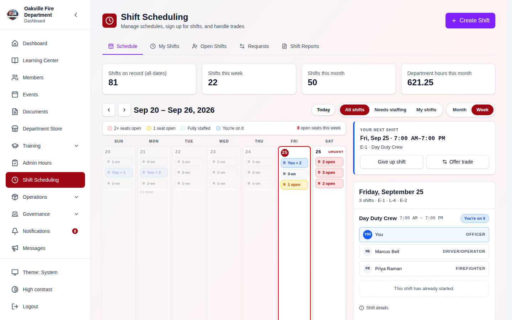

> **Note:** The scheduling module uses a dedicated state store and API service. All scheduling data (shifts, templates, patterns, members) is managed centrally and updates in real time across all tabs.

---

## Calendar Views

The **Schedule** tab displays shifts in a calendar format. You can toggle between:

- **Week View** - Detailed daily breakdown with time slots
- **Month View** - Overview of the entire month

Each shift is displayed as a colored block on the calendar showing:

- Shift name or type
- Start and end times
- Assigned apparatus (if any)
- Staffing count

Click on any shift to open the **Shift Detail Panel** with full information, attendance records, and actions.

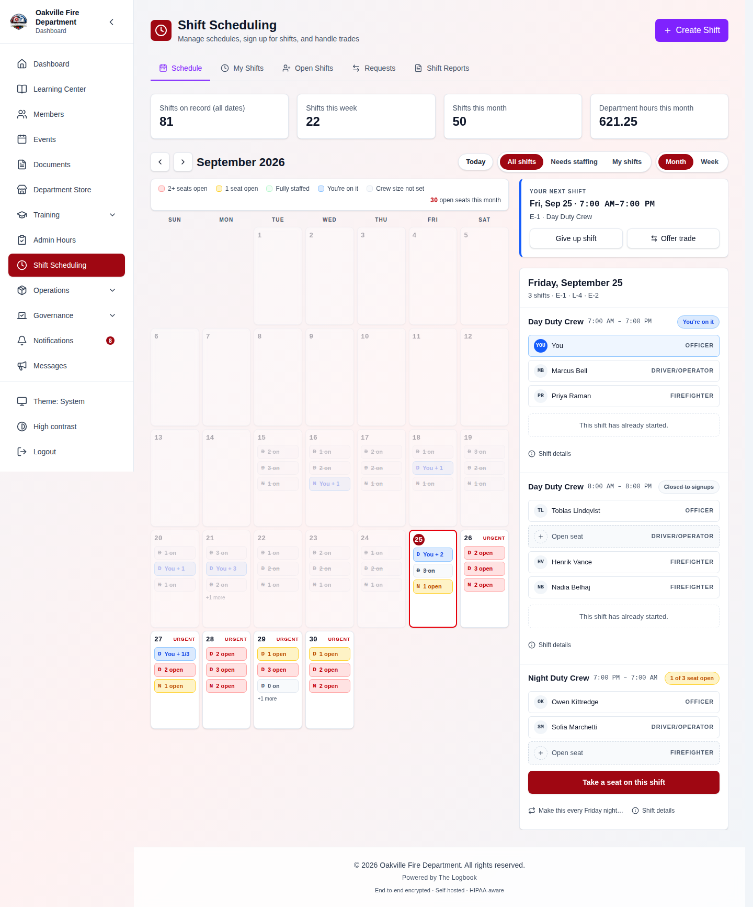

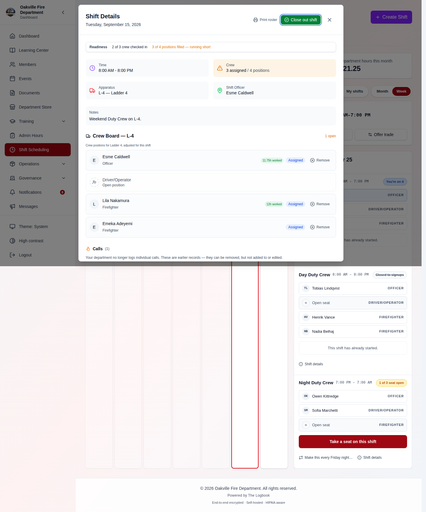

The panel opens with a **Readiness** line that answers the two questions an
officer actually has — how many of the assigned crew are present, and whether
the shift is staffed to its minimum ("1/1 present · 1/3 staffed —
understaffed"). Any outstanding start-of-shift checks are named on the same
line. Below it the crew board is headed by the rig it belongs to, and each open
seat is listed by position rather than counted.

A legend above the calendar says what its shift-block icons mean: **fully
crewed**, **short-staffed**, **positions filled of the minimum**, and
**apparatus unit**.

---

## My Shifts

The **My Shifts** tab shows only your assigned and upcoming shifts. This is your personal schedule view.

For each shift you can see:

- Date and time
- Shift type
- Your assignment status (Pending, Confirmed, Declined)
- Apparatus assignment
- Whether you have checked in/out

**Confirming an Assignment:**
When you are assigned to a shift, you may need to confirm your availability. Click **Confirm** on the assignment to acknowledge.

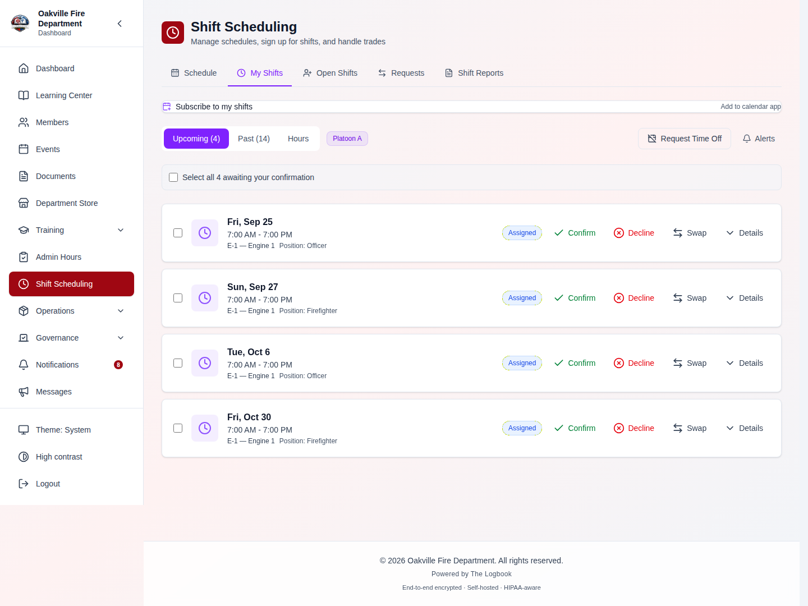

---

## Open Shifts

The **Open Shifts** tab lists shifts that need additional coverage. Members can sign up for these shifts.

1. Browse available open shifts by date.
2. Click **Sign Up** to volunteer for a shift.
3. An officer will review and approve your sign-up.

You can also **withdraw** from an open shift you signed up for, as long as it has not been approved yet.

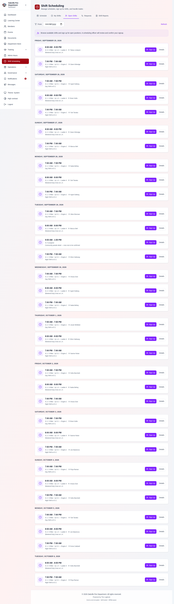

> **Hint:** Open shifts are a great way to pick up additional hours toward shift-based training requirements.

---

## Shift Assignments

**Required Permission:** `scheduling.manage`

Officers can assign members to shifts from the Shift Detail Panel:

1. Open the calendar and click on a shift.
2. In the detail panel, click **Add Assignment**.
3. Select the member, position, and apparatus.
4. Save the assignment.

The assigned member will receive a notification and can confirm or decline.

**Changing a Member's Position:**
Officers can change a member's assigned position (Officer, Driver, Firefighter, etc.) directly on the shift card using the inline position change UI, without opening a separate modal.

**Editing Shift Details:**
Officers can edit shift start and end times, apparatus assignment, color, notes, and custom creation times from the shift detail panel after the shift has been created.

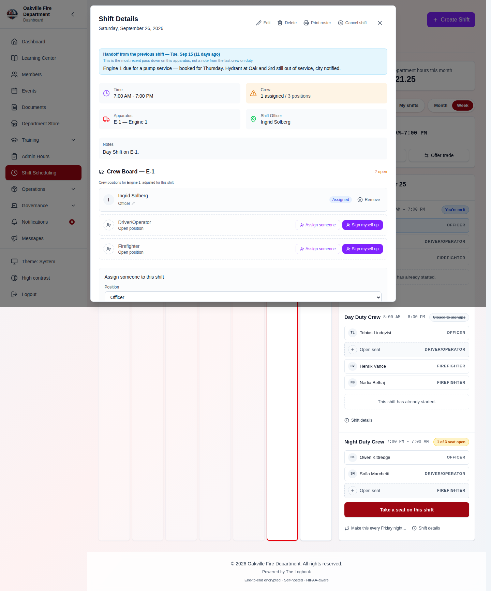

> **Hint:** If a member is on **Leave of Absence** for the shift date, the system will prevent the assignment and display a message: "Member is on leave of absence for this date." See [Membership > Leave of Absence](./01-membership.md#leave-of-absence) for details.

---

## Attendance Tracking

Attendance is recorded for each shift to track who was present and for how long.

**Recording Attendance:** members check themselves in and out. Open the shift
from the calendar; **Check In** sits under your own assignment on the detail
panel, and once you have used it the button becomes **Check Out** with your
arrival time beside it. The system calculates **duration in minutes**
automatically from the two.

There are three places that attendance then shows up, and none of them is a
table you can edit:

| Where                                          | What it shows                                                                                                                                               |
| ---------------------------------------------- | ----------------------------------------------------------------------------------------------------------------------------------------------------------- |
| The **crew board**, on each member's row       | A badge — `In 07:02` while they are on shift, `12h worked` once they are out. Hover for both times                                                          |
| The **Readiness** line at the top of the panel | `1/1 present`                                                                                                                                               |
| **Before you close this shift**, at close-out  | `1 of 1 checked in, 1 checked out`, plus a warning naming anyone who never checked in (pictured under [Shift Finalization](#shift-finalization-2026-03-28)) |

> **Corrected 2026-08-12.** This previously described an attendance section
> where an officer could **Check In** and **Check Out** other members and
> **manually set times for retroactive recording**, and its screenshot
> placeholder asked for a per-member table with edit buttons. None of that is
> in the application. The buttons act on the signed-in member's own record
> only, and while the API can amend one (`PATCH /scheduling/attendance/{id}`)
> nothing in the frontend calls it. The nearest thing to retroactive recording
> is **Add hours for members who didn't check in**, which appears in the
> close-out checklist and takes a number of hours rather than times.

### Post-Shift Validation

After a shift ends, the shift officer receives an automatic notification prompting them to review and validate the attendance records. This ensures all check-in/check-out times are recorded before the data is used for compliance reporting.

---

## Call Logging

During a shift, officers (with the `scheduling.manage` permission) can log every call or run the crew responded to. The **Calls / Runs** section lives on the shift detail panel.

1. Open the shift from the calendar to bring up the shift detail panel.
2. Scroll to the **Calls / Runs** section (a count badge shows how many calls are logged).
3. Click **+ Log Call** to open the inline form.
4. Fill in the call details:
   - **Incident type** _(required)_ — e.g., Structure Fire, EMS, MVA.
   - **Incident number** _(optional)_ — your CAD/run number.
   - **Dispatched / On-scene / Cleared times** _(optional)_ — entered in your local time and stored in UTC.
   - **Cancelled en route** and **Refusal (medical)** — checkboxes for those outcomes.
   - **Responding members** _(optional)_ — the crew that responded, if tracked separately from the shift roster.
   - **Notes** _(optional)_.
5. Click **Save**. The call appears as a card showing the incident type/number, status badges (amber "Cancelled en route", blue "Refusal"), the dispatch→clear timeline, and notes. Use the pencil and trash icons to edit or delete a call.

Calls logged against a shift contribute to **call-based training requirements** for enrolled members.

> **Note:** Once a shift is **finalized**, the Calls / Runs section becomes read-only — the **+ Log Call**, edit, and delete controls disappear. Log calls before finalizing the shift.

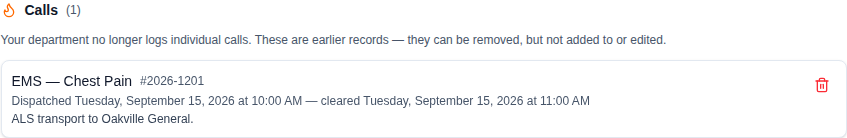


> **This section describes the department default.** A department that has
> switched on **Record a call count at close-out** does not use Calls / Runs at
> all — see [Counting Calls Without an RMS](#counting-calls-without-an-rms-2026-08-18)
> immediately below.

---

## Counting Calls Without an RMS _(2026-08-18)_

Plenty of departments do not run incident reporting software. They still have to
answer _"how many calls did we run last year, and what did each apparatus go
on?"_ — for a grant application, an ISO rating, an apparatus replacement case,
or a staffing argument at a budget hearing.

**Record a call count at close-out** is for exactly that department. The officer
reports a number when they close the shift out, and nothing else is collected.

### Turning it on

**Scheduling → Settings → General → Shift close-out rules → Record a call count
at close-out.**

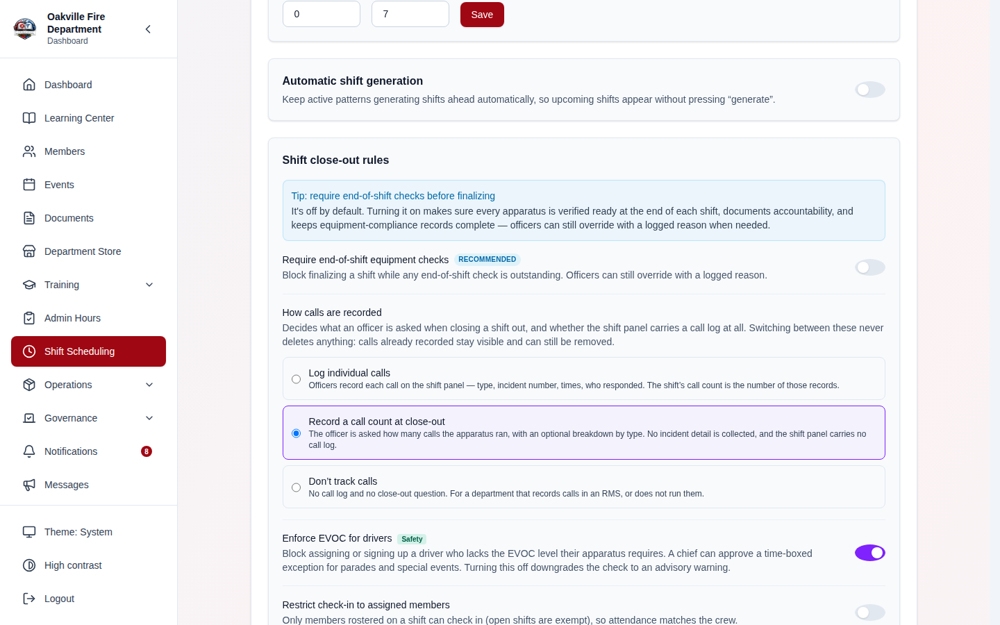

It takes effect immediately **in your own browser** — no reload, no restart.
**Tell your officers before you flip it**, because it changes what they see at
0700 the same morning: the familiar close-out checklist is replaced by a
three-step wizard.

> **Anyone already signed in must reload before their next close-out.** A
> session that was open when you flipped this keeps the settings it loaded at
> sign-in, so that officer is still shown the old checklist — and the old
> checklist never asks for a call count, while the backend has already switched
> over. A shift closed out from a stale tab finalizes with **no calls recorded
> at all**, silently. Flip this at a shift change, or tell anyone currently
> working to refresh the page.

Leaving it off keeps the per-incident **Calls / Runs** logging described above.
A department that has never touched this setting keeps doing exactly what it
does today — absence of the setting means _current behaviour_, never _off_.

### What is recorded, and what is deliberately not

Recorded: the **date**, an optional **call type** from your own list, and
**which units responded**.

Not recorded, and not recordable:

- No address or cross streets
- No patient, caller, or complainant identity
- No narrative
- No dispatch, on-scene, or clear times
- No CAD incident number that anyone can read on screen

That is the point of the mode rather than an oversight. Those are the fields
that turn a call record into protected health information, and there is nowhere
in this feature to put one — no field to type it into and no column to store it
in. A department that wants incident-level records wants an incident module,
with its own consent and access-control story behind it.

**The date is a date, not a time.** Storing a timestamp would let response times
be reconstructed, and that is the first step back toward an incident record.

### Call types

Nine are provided to start with: Fire, EMS, Motor Vehicle Accident, Rescue,
Hazmat, Service Call, Alarm / Good Intent, Mutual Aid, and Other. A department
can define its own instead.

**You can rename a type freely without touching history.** What gets stored on
each call is the type's internal slug, not the label you see — so fixing a typo
in a label does not orphan last year's calls. What you should _not_ do casually
is delete a type: existing calls keep the deleted slug, and it will show as
unclassified.

> **A rename is invisible in the Call Volume report.** That report prints the
> stored **slug**, not your label — so a type whose slug is `mva` reads as "mva"
> there no matter what you call it on screen, and `mutual_aid` reads as "mutual
> aid". Only the close-out wizard uses your labels. Bear it in mind when
> choosing the slug for a new type: that string is what a reader sees in the
> report.

### The three numbers, and why they will not add up

This is the part that causes arguments in a budget meeting, so it is worth
getting straight before anyone quotes a figure.

| Number                     | What it counts                                        | Where you see it                           |
| -------------------------- | ----------------------------------------------------- | ------------------------------------------ |
| **Department call volume** | One call is one call, however many units rolled on it | Reports → Call Volume                      |
| **Apparatus runs**         | One per unit, per call                                | **Not on any screen yet** — API only       |
| **Member credit**          | Calls an individual was actually on                   | The member's own hours and training credit |

A 400-call department can legitimately show **380 engine runs and 240 medic
runs**. Those do not sum to 400 and they are not supposed to — both units rolled
on the same MVA, and it was one call for the department and one run for each of
them.

Member credit is a third thing again, and is never the shift's number restated.
A member who came on at 0300 was not on the 2200 call.

> **[SCREENSHOT NEEDED — Reports → Call Volume for a count-only department,
>
> > showing the "Unit Responses" / "Avg Responses/Day" / "Peak Responses" stat
> > cards and the footnote beneath them. Caption it alongside the same report for
> > a detailed-mode department so a reader can see the labels differ and
> > understand why]**

### Read the report label before you quote the number

In count-only mode the report says **Unit Responses**, not **Total Calls**.

That wording is doing real work. Two units that closed out independently each
reported their own call, and nothing has yet linked them to one incident — so
the figure counts an incident once per responding unit. **Do not put it in a
grant application as a department call count.** Reconcile mutual responses by
hand, or wait for the cross-unit feature described below.

Three further things about this report that are easy to be caught out by:

> **The CSV export still says "Total Calls" — in both modes.** The wording on
> screen changes with the mode; the export does not. So a CSV pulled for a grant
> or an audit presents unit responses under the word "calls", which is the exact
> confusion the on-screen label exists to prevent, in the file most likely to
> leave the building. **Relabel the column by hand before sending one.**

> **A date range spanning a mode change is incomplete.** The report picks its
> source from your department's **current** setting and applies it to the whole
> range — it does not switch part-way through. A department now on close-out
> counts therefore sees **nothing** from its earlier per-incident months, and
> one that switched back sees nothing from its count-only months. Nothing warns
> you; the number is simply smaller. Run each period separately.

> **"Total Calls" in per-incident mode is not an incident count either.** It
> sums the call counts on **shift completion reports**, and those are filed per
> trainee — so a shift with two enrolled trainees contributes its calls twice,
> and manually filed reports are added alongside. Neither mode currently
> produces a figure you can hand to a funder without explaining how it was
> derived.

### What is not built yet

Claiming a call another unit already logged — the thing that makes two units on
one MVA count as one call for the department — **has no screen yet**. The
capability exists in the API, and the close-out screen already reserves the
place it will appear. Until it ships, the honest label on the report is the
mitigation.

---

## Time-Off Requests

Members can request time off from the **Requests** tab:

1. Click **Request Time Off**.
2. Select the **start date** and **end date**.
3. Add a **reason** for the request.
4. Submit the request.

Officers will review the request and approve or deny it.

**Request Statuses:**

- **Pending** - Awaiting officer review
- **Approved** - Time off granted
- **Denied** - Request denied (reason provided)
- **Cancelled** - Withdrawn by the member

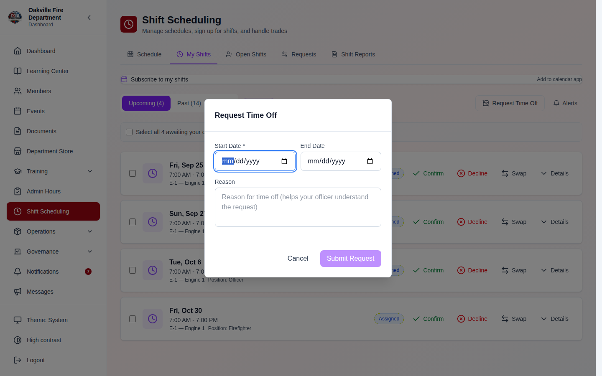

Open it from **Request Time Off** on the My Shifts tab. Submitted requests, and their statuses, are listed under **Requests > Time Off** rather than below the form.

---

## Shift Swap Requests

A swap starts from the shift you are giving up, not from a blank form:

1. Go to **My Shifts** and stay on **Upcoming** — the **Swap** button is only on
   shifts that have not happened yet.
2. Click **Swap** on the shift you want covered. The dialog names that shift in
   its subtitle; there is nothing to pick, because it is the one you clicked.
3. Choose a **Swap Type**:
   - **Open Swap** — any member can pick it up. This is the default.
   - **Specific Shift** — you want a particular shift in return. Pick it from
     the list of everything scheduled from today onward, each entry showing its
     day, times and apparatus.
4. Give a **Reason**, then **Submit Request**.

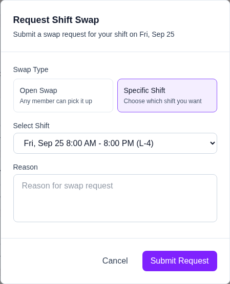

The request then appears under **Requests > Swap Requests**, where you can
follow or cancel it.

**Swap Workflow:**

1. Member A requests a swap.
2. Member B accepts or declines.
3. An officer reviews and approves the swap.
4. Assignments are updated automatically.

> **Corrected 2026-08-12.** The steps above previously said to open the
> **Requests** tab and click **Request Swap**, then "select the shift you want
> to swap and the shift you are offering". The Requests tab has no such button
> — it only lists requests already made — and the offered shift is never
> chosen, since the dialog is opened from it. The retired screenshot
> placeholder asked for "Your Shift" and "Requested Shift" selectors, neither
> of which exists.

---

## Shift Templates and Patterns

**Required Permission:** `scheduling.manage`

### Templates

Shift templates define reusable shift configurations (name, times, positions, apparatus). Navigate to the **Shift Templates** tab to manage them.

- **Create a template** with a name, start/end times, required positions, and linked apparatus.
- **Reuse templates** when creating individual shifts to avoid entering the same details repeatedly.

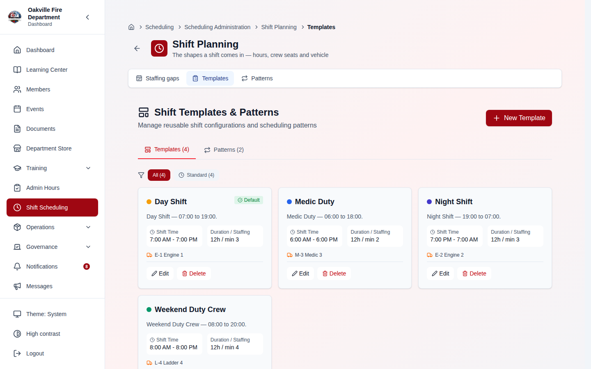

### Patterns

Shift patterns automate shift creation over a date range based on a template:

| Pattern Type | Description                          | Common Use                                                        |
| ------------ | ------------------------------------ | ----------------------------------------------------------------- |
| **Daily**    | Creates a shift every day            | Staffed stations with daily coverage                              |
| **Weekly**   | Creates shifts on selected weekdays  | Volunteer departments with set drill nights (e.g., every Tuesday) |
| **Platoon**  | Rotates on/off days in a fixed cycle | Career departments running 24/48, 48/96, or Kelly schedules       |
| **Custom**   | Specific dates you choose manually   | One-off details, special events, holiday coverage                 |

To generate shifts from a pattern:

1. Create a pattern linked to a template.
2. Set the date range.
3. Click **Generate Shifts**.
4. Review and confirm the generated shifts.

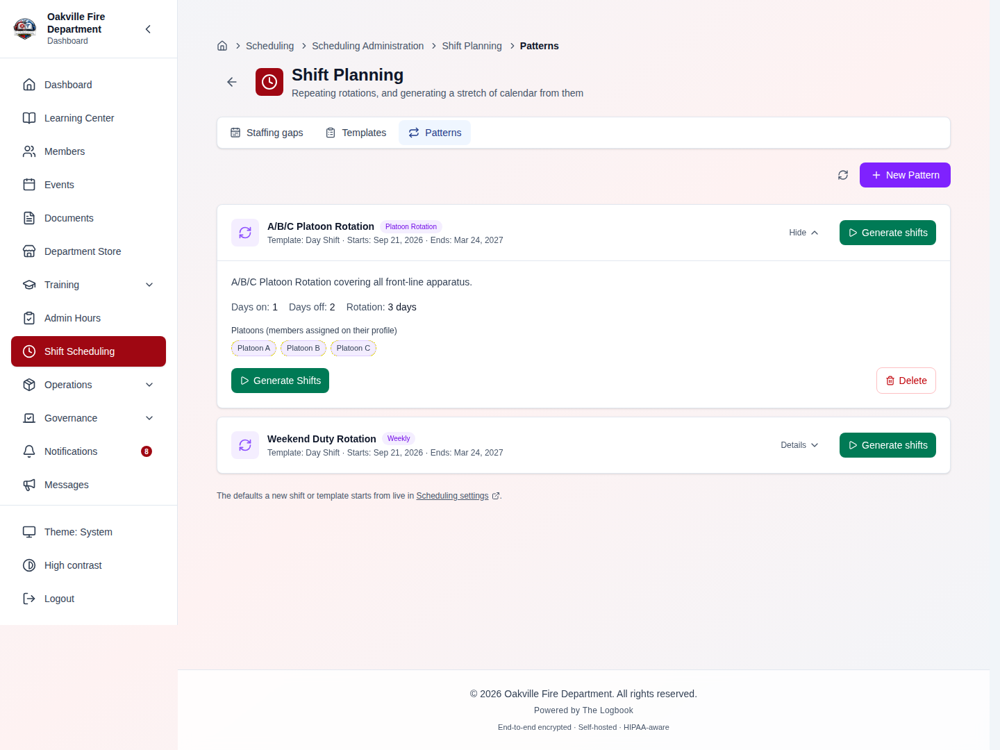

### Understanding Platoon Rotations

Platoon patterns are the most complex pattern type. They work by cycling through a fixed on/off rotation:

| Schedule  | Days On                               | Days Off           | Cycle Length | Avg Hours/Week |
| --------- | ------------------------------------- | ------------------ | ------------ | -------------- |
| **24/48** | 1 day (24 hrs)                        | 2 days off         | 3 days       | ~56 hrs        |
| **48/96** | 2 days (48 hrs)                       | 4 days off         | 6 days       | ~56 hrs        |
| **Kelly** | 1 on, 1 off, 1 on, 1 off, 1 on, 4 off | (built into cycle) | 9 days       | ~49 hrs        |

**How the cycle works:**

For a 24/48 rotation with 3 platoons (A, B, C):

```
Day:     Mon   Tue   Wed   Thu   Fri   Sat   Sun   Mon   Tue
A:        ON   off   off    ON   off   off    ON   off   off
B:       off    ON   off   off    ON   off   off    ON   off
C:       off   off    ON   off   off    ON   off   off    ON
```

Each platoon works every third day. The system generates the full rotation from a **start date** and **platoon label** — you set which platoon starts on day 1, and the system fills in the rest.

**At pattern boundaries:** When a generated pattern reaches its end date, the last shift ends cleanly on that date. To extend, generate a new pattern starting from the day after the previous one ended. The system does not automatically roll over into a new month — you generate explicitly.

> **Hint:** For departments using a Kelly schedule, set up the pattern as Platoon with a 9-day cycle: 1 on, 1 off, 1 on, 1 off, 1 on, 4 off. The system handles the irregular spacing within the cycle.

**Generation excludes members who are no longer active** _(fixed 2026-08-17)_.
A member who has been removed or anonymized is not staffed onto generated
shifts. If you generated a rotation before that date and see a departed member
on future shifts, regenerate the affected range.

**A pattern's platoon list is validated when it renders** _(2026-08-17)_. A
pattern whose stored configuration was written by an older client with a
malformed platoon list used to take the whole Patterns tab down; it now
renders with that list treated as empty. If a pattern shows no platoons where
you expect some, re-save it from the pattern editor.

### Who Can See the Platoon Roster _(2026-08-17)_

The platoon roster is **staffing information, not a member directory** — it is
built from who is on approved leave, so it says something about individual
members that the rest of the schedule does not.

| Screen                                                                                           | Who sees it                                                                      |
| ------------------------------------------------------------------------------------------------ | -------------------------------------------------------------------------------- |
| **Platoon Management** (`/scheduling/platoons`) — the department-wide roster and bulk assignment | `scheduling.manage` only                                                         |
| **Shift detail → hold-over / availability roster**                                               | `scheduling.assign`, `scheduling.manage`, or **the officer named on that shift** |
| Everything else on a shift — time, apparatus, who is assigned, check-in state                    | Any member                                                                       |

**Edge cases:**

- A shift officer sees the roster **only for their own shift**. The authority
  comes from being named on the shift, not from a permission grant, so it
  appears and disappears as they are assigned and unassigned.
- A member without the permission does not see an error or an empty panel —
  the roster simply is not part of what they are shown, and the rest of the
  shift page works normally.
- **This removed access somebody already had.** Both screens previously
  required only `scheduling.view`, which every signed-in member holds
  implicitly. Anyone who used Platoon Management before and does not hold
  `scheduling.manage` will now get a permission error there.

> **[SCREENSHOT NEEDED — the shift detail page as a scheduler with the
>
> > hold-over roster populated, paired with the same shift as an ordinary member
> > with the roster absent. Seed at least one member on approved leave so the
> > availability distinction is visible, and caption which account is which.]**

---

## Minimum Staffing and Coverage Rules

**Required Permission:** `scheduling.manage`

Minimum staffing rules ensure each shift meets your department's coverage requirements.

### Configuring Minimum Staffing

Navigate to **Shift Scheduling > Settings** to set staffing rules:

- **Minimum members per shift** — The system warns when a shift falls below this threshold
- **Required positions** — Certain positions (e.g., Officer, Driver/Operator) must be filled
- **Apparatus minimums** — Each apparatus can have a minimum crew size

### How Understaffing Is Handled

When a shift is below minimum staffing:

- The calendar highlights the shift with a **warning indicator** (yellow border)
- The shift detail panel shows a staffing alert: "2/4 positions filled — below minimum"
- The **Coverage** report flags understaffed shifts for the selected date range
- Open shifts are automatically created for unfilled positions (if configured)

> **Hint:** The system does not prevent an understaffed shift from occurring — it alerts so officers can take action. Automatic open shift creation can be enabled in Scheduling Settings.

---

## Shift Reports and Compliance

The **Reports** tab provides several reporting views:

| Report           | Description                                                                    |
| ---------------- | ------------------------------------------------------------------------------ |
| **Member Hours** | Hours _worked_ per member for a date range, with the scheduled hours alongside |
| **Coverage**     | Shift staffing levels and gaps                                                 |
| **Call Volume**  | Calls by day, week, or month                                                   |
| **Compliance**   | Member compliance against shift/hours requirements                             |

### Member Hours: worked vs. scheduled _(2026-08-01)_

The report's headline figures — **Shifts Worked** and **Hours Worked** — are
measured from shift check-in and check-out. **Scheduled Hours** is the length
of the shifts a member was assigned, and a **Difference** column shows the gap.

They will not match, and that is the point: a shift can run short or long, and
a member can be rostered for one they never work. Anything that credits a
member uses the worked figure.

Before this change the report showed only assignment durations while calling
them "Total Hours", so a member comparing it against their shift completion
reports saw a discrepancy with nothing to explain it.

> A member who worked a shift they were never assigned to appears in the
> report too — hours are not lost because the paperwork did not match what
> happened on the day.

### Compliance Report

The compliance report evaluates each member's shift attendance and hours against active training requirements of type SHIFTS or HOURS.

For each requirement, the report shows:

- Required value (shifts or hours)
- Each member's completed value
- Compliance percentage
- Whether the member is compliant

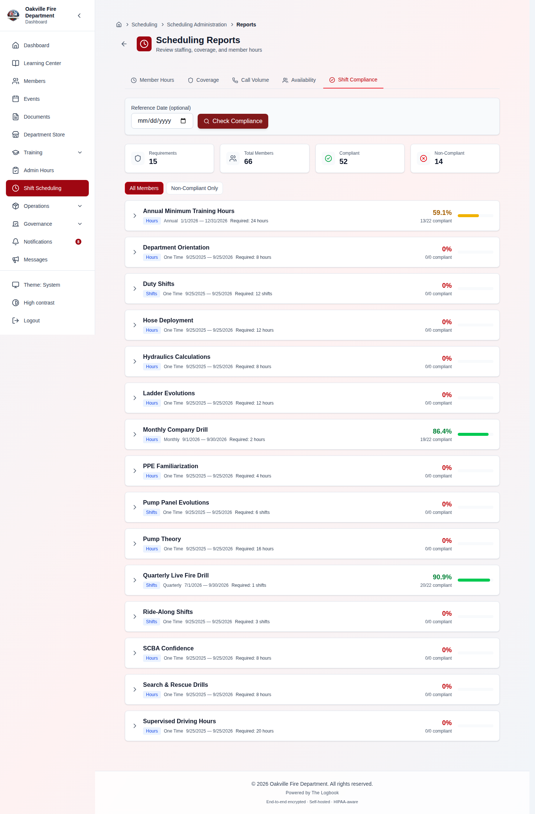

> **Hint:** Members with active leaves of absence will have their requirements pro-rated. The report shows the adjusted requirement and the number of leave months for transparency.

---

## How Shift Hours Feed Training Compliance

Shift attendance data flows directly into the Training module's compliance calculations. Understanding this connection helps both members and officers see why accurate attendance records matter.

### The Data Flow

```
Shift Attendance (check-in/out recorded)
    ↓
Hours calculated automatically
    ↓
Training Requirements (type: HOURS or SHIFTS) pick up the data
    ↓
Compliance Matrix / Member Training Dashboard updated
    ↓
Shift Completion Reports (filed by officer) credit program requirements
```

### What Counts

| Requirement Type | What the system counts                            | Source             |
| ---------------- | ------------------------------------------------- | ------------------ |
| **HOURS**        | Total attendance hours (check-out minus check-in) | Attendance records |
| **SHIFTS**       | Number of shifts with recorded attendance         | Attendance records |
| **CALLS**        | Number of calls logged during attended shifts     | Call log entries   |

### Requirements for Data to Flow

1. **Attendance must be recorded** — a shift with no check-in/out contributes nothing
2. **Both check-in and check-out** must exist for hours to calculate
3. **The requirement must be active** and cover the current period
4. **Shift completion reports** (filed by the shift officer) are needed for training program auto-progression — raw attendance alone updates hours/shift counts, but program phase requirements need the officer's report

### Leave of Absence Adjustments

When a member has an active leave, shift-based requirements are pro-rated just like training hours:

```
adjusted_required_shifts = base_required × (active_months / total_months)
```

For example, a requirement of 8 shifts per quarter for a member with 1 month of leave becomes `8 × (2/3) = 5.3`, rounded to **6 shifts required**.

> For full details on leave adjustments, see [Membership > Leave of Absence](./01-membership.md#leave-of-absence) and [Training > Compliance Matrix](./02-training.md#compliance-matrix).

---

## Realistic Example: Setting Up a 24/48 Platoon Rotation

This walkthrough demonstrates a complete scheduling setup — from template creation through a full month of generated shifts — using a realistic fire department scenario.

### Background

**Oakville Fire Department** is transitioning from a paper schedule to The Logbook. Captain **Mike Reilly** (Scheduling Officer) needs to set up a 3-platoon, 24/48 rotation for **Station 1** starting April 1. The station runs one engine (Engine 1) with a minimum crew of 4 per shift.

The three platoons are:

- **A Platoon** — Lt. Davis, FF Carter, FF Nguyen, FF Patel
- **B Platoon** — Lt. Morrison, FF Brooks, FF Kim, FF Walsh
- **C Platoon** — Lt. Hernandez, FF Cooper, FF Yamada, FF Schmidt

---

### Part 1: Creating the Shift Template

Capt. Reilly navigates to **Shift Scheduling > Shift Templates** and clicks **Create Template**.

**Template settings:**

| Field                  | Value                                       |
| ---------------------- | ------------------------------------------- |
| **Name**               | Station 1 — 24-Hour Shift                   |
| **Start Time**         | 07:00                                       |
| **End Time**           | 07:00 (next day)                            |
| **Duration**           | 24 hours                                    |
| **Apparatus**          | Engine 1                                    |
| **Minimum Staffing**   | 4                                           |
| **Required Positions** | 1 Officer, 1 Driver/Operator, 2 Firefighter |

He saves the template. It now appears in the templates list and can be reused for any 24-hour shift at Station 1.

---

### Part 2: Generating the April Schedule

Next, Capt. Reilly navigates to **Shift Scheduling > Shift Templates** and clicks **Create Pattern**.

**Pattern settings:**

| Field                | Value                     |
| -------------------- | ------------------------- |
| **Pattern Type**     | Platoon                   |
| **Template**         | Station 1 — 24-Hour Shift |
| **Start Date**       | April 1                   |
| **End Date**         | April 30                  |
| **Days On**          | 1                         |
| **Days Off**         | 2                         |
| **Starting Platoon** | A Platoon                 |

He clicks **Generate Shifts**. The system creates 30 shifts (one per day) and presents a preview:

```
April Schedule Preview — Station 1

  Sun   Mon   Tue   Wed   Thu   Fri   Sat
              1(A)  2(B)  3(C)  4(A)  5(B)
  6(C)  7(A)  8(B)  9(C)  10(A) 11(B) 12(C)
  13(A) 14(B) 15(C) 16(A) 17(B) 18(C) 19(A)
  20(B) 21(C) 22(A) 23(B) 24(C) 25(A) 26(B)
  27(C) 28(A) 29(B) 30(C)
```

Each platoon works every third day — A Platoon works April 1, 4, 7, 10, 13, 16, 19, 22, 25, 28 (10 shifts). B and C each also work 10 shifts.

Capt. Reilly reviews the preview to confirm the rotation looks correct, then clicks **Confirm** to create all 30 shifts on the calendar.

---

### Part 3: Assigning Members to Platoons

With shifts generated, Capt. Reilly assigns members. He opens the first A Platoon shift (April 1) from the calendar:

1. Clicks **Add Assignment** — assigns **Lt. Davis** as Officer
2. Clicks **Add Assignment** — assigns **FF Carter** as Driver/Operator
3. Clicks **Add Assignment** — assigns **FF Nguyen** as Firefighter
4. Clicks **Add Assignment** — assigns **FF Patel** as Firefighter

The staffing indicator changes from "0/4 — Below Minimum" (red) to "4/4 — Fully Staffed" (green).

Because these members work all A Platoon shifts, Capt. Reilly can use bulk assignment to apply the same crew to all A Platoon dates in one action, then repeat for B and C Platoons.

Each assigned member receives a notification and sees the shift on their **My Shifts** tab.

---

### Part 4: Handling a Swap Request

On April 8, FF Brooks (B Platoon) needs to swap with FF Nguyen (A Platoon) for April 10:

1. FF Brooks navigates to **Requests > Request Swap**
2. Selects his shift (April 8, B Platoon) and the target shift (April 10, A Platoon)
3. Submits the swap request

FF Nguyen receives a notification and clicks **Accept**. Capt. Reilly reviews and clicks **Approve**. The system automatically updates the assignments:

- April 8: FF Nguyen now works (instead of FF Brooks)
- April 10: FF Brooks now works (instead of FF Nguyen)

Both members see the updated schedule on their My Shifts tab.

---

### Part 5: End-of-Month Compliance Check

At the end of April, Capt. Reilly navigates to **Shift Scheduling > Reports > Compliance**.

The department has an active training requirement: **"Minimum 8 shifts per month"** (type: SHIFTS, frequency: Monthly).

The compliance report for April shows:

| Member        | Required Shifts | Completed | Compliance | Status    |
| ------------- | --------------- | --------- | ---------- | --------- |
| Lt. Davis     | 8               | 10        | 125%       | Compliant |
| FF Carter     | 8               | 10        | 125%       | Compliant |
| FF Nguyen     | 8               | 10        | 125%       | Compliant |
| FF Patel      | 8               | 10        | 125%       | Compliant |
| Lt. Morrison  | 8               | 10        | 125%       | Compliant |
| FF Brooks     | 8               | 10        | 125%       | Compliant |
| FF Kim        | 8               | 10        | 125%       | Compliant |
| FF Walsh      | 8               | 10        | 125%       | Compliant |
| Lt. Hernandez | 8               | 10        | 125%       | Compliant |
| FF Cooper     | 8               | 10        | 125%       | Compliant |
| FF Yamada     | 8               | 10        | 125%       | Compliant |
| FF Schmidt    | **4** (LOA)     | 5         | 125%       | Compliant |

FF Schmidt was on a 2-week Leave of Absence (April 1-14), so his requirement was pro-rated from 8 to 4 shifts. He completed 5 shifts in his active period and is marked Compliant.

> **Hint:** The compliance data automatically feeds into the Training module's Compliance Matrix. Members and training officers see the same numbers in both places — there is no need to manually enter shift data into training records.

---

## Finding Your Way Around Scheduling Settings (2026-08-09)

**Required Permission:** `scheduling.manage`

Scheduling settings were rebuilt on **2026-08-09** to use the same layout as
Organization Settings and Event Settings: a **section list down the left** on a
computer, a **scrollable tab strip across the top** on a phone, and one heading
rather than the two stacked titles it used to show.

Seven sections, of which six are always present:

| Section           | What it holds                                             |
| ----------------- | --------------------------------------------------------- |
| **General**       | Shift defaults, overtime cap, and close-out rules         |
| **Apparatus**     | Apparatus and resource type defaults                      |
| **Platoons**      | Platoon rosters and assignments                           |
| **Eligibility**   | Which membership types may sign themselves up for a shift |
| **Notifications** | Shift reminders and alerts                                |
| **Equipment**     | Check requirements and templates                          |
| **Shift Reports** | End-of-shift reporting options                            |

**Platoons only appears once platoon scheduling is switched on**, from the
toggle at the top of **General**. A department that does not run A/B/C
rotations sees six sections and no empty platoon screen — and turning the
feature off while you are on that section returns you to General rather than
leaving you on a page that has gone.


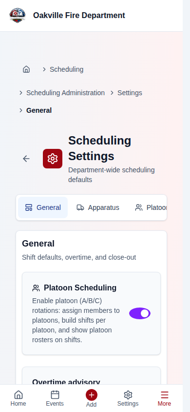

### Two things that changed with it

**The Save button only appears where it saves something.** General, Apparatus and
Equipment have the Save/Reset footer. The other four sections each have their own
save control. Until this change the footer was shown on all seven while saving
only three — so on Notifications and Shift Reports you could press **Save**, see
"Settings saved", and have changed nothing.

**A section can now be linked to.** Selecting a section puts it in the address
bar, so you can bookmark it, refresh into it, and go **back** to the section you
came from. It previously read the address on load but never wrote it.

> **Eligibility here is not the same screen as rank eligibility.** This section
> governs which **membership types** may sign themselves up for a shift. Which
> **positions** a given **rank** may fill is set on **Settings → Ranks**, on the
> other side of the app. The two are easy to confuse and neither one is the other.

> **A section for a feature your department has switched off** — Platoons, most
> commonly — falls back to General rather than showing you an empty panel. A
> saved link to it still works if the feature is turned back on.

---

## Platoon Management (2026-06-19)

Platoon membership is now a **person-level attribute** — each member belongs to a platoon (A, B, C, etc.) and the schedule is built from that membership.

### Enabling Platoons

Platoons are **off by default**. To enable them:

1. Navigate to **Scheduling > Settings**
2. Enable the **Platoons** toggle
3. The platoon fields and management UI become visible across the scheduling module

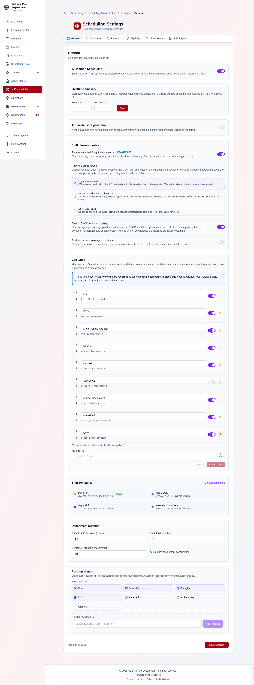

### Assigning Members to Platoons

1. Navigate to **Scheduling > Platoons** (or **Settings > Platoons**)
2. The **Platoon Management** page shows every platoon and the unassigned bucket
3. Select members using checkboxes
4. Choose a target platoon (A, B, C, D, or custom) from the dropdown
5. Click **Assign** to move selected members to that platoon
6. Use **Clear** to remove members from their current platoon

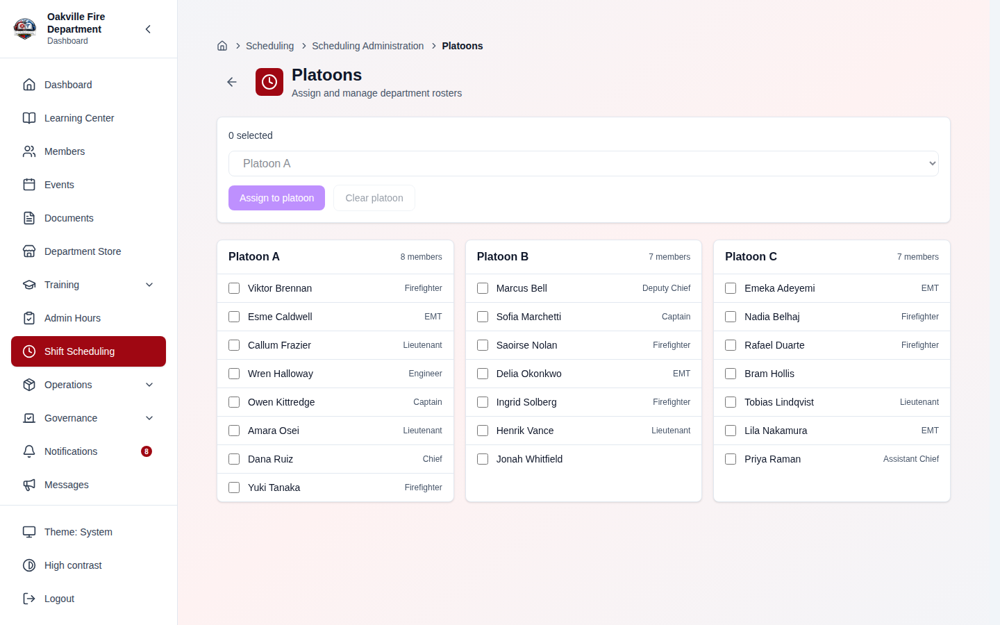

### How Platoon Shift Generation Works

When generating shifts from a platoon pattern:

- Every platoon runs the **same cycle offset** by `i × cycle_length / num_platoons` days
  - 24/48 rotation: offsets 0/1/2 (3 platoons tile perfectly)
  - 48/96 rotation: offsets 0/2/4
  - Kelly 9-day: offsets 0/3/6
- Generated shifts include the platoon's **actual members** — a member on approved leave is omitted from shifts they'd otherwise staff
- Approving a leave of absence **cancels** the member's conflicting generated shifts automatically

### Hold-Over Roster

This is the **platoon** roster, and it appears on a narrower set of shifts than
the name suggests. The Shift Detail Panel renders it only when **platoons are
enabled** for the department _and_ the shift belongs to a platoon — a gap alone
does not bring it up. Where it does appear it lists that platoon's members:

- Same organization, not on leave, not already assigned that day
- One-click **Assign** button next to each available member
- Designed for supervisors who need to fill gaps or hold over members

On a department that does not run platoons, the way to fill a gap is the crew
board's **Assign** button on the open seat, or **Assign Member** beneath it —
both pictured under
[Permission Model](#permission-model).

> **Screenshot held back.** Picturing this needs a department with platoons
> enabled and shifts generated from a platoon pattern, which the demo
> department does not run. See
> [KNOWN_LIMITATIONS.md](../KNOWN_LIMITATIONS.md).

### Platoon Badge on Shifts

Shifts generated from platoon patterns display a **platoon badge** (e.g., "A Platoon") on calendar cards and in the shift detail panel.

### Edge Cases

| Scenario                                  | Behavior                                                                     |
| ----------------------------------------- | ---------------------------------------------------------------------------- |
| Platoons disabled                         | No platoon fields or management UI visible; scheduling works as before       |
| Member not assigned to any platoon        | Appears in the "Unassigned" bucket; not included in platoon shift generation |
| Two platoons collide on one calendar slot | Shifts labeled correctly for each platoon; no mislabeling                    |
| Leave approved after shifts generated     | Conflicting shifts auto-cancelled for that member                            |
| Custom platoon names                      | Supported alongside standard A/B/C/D                                         |
| Bulk assignment of 50+ members            | Processed in a single request with audit logging                             |

---

## Position Eligibility & Equipment Checks (2026-03-19)

### Shift Position Eligibility

Operational ranks define which shift positions each rank is eligible for. When members sign up for open shifts, they only see positions their rank qualifies for.

**Setting up eligible positions:**

1. Navigate to **Settings > Ranks** (listed as _Operational rank configuration_).
2. Edit a rank and click **Configure eligible positions**, then click the
   position chips to toggle them on and off. It is a per-rank list rather than
   a single grid of every rank against every position — you set one rank at a
   time.
3. Save. Existing ranks are backfilled with default eligible positions.

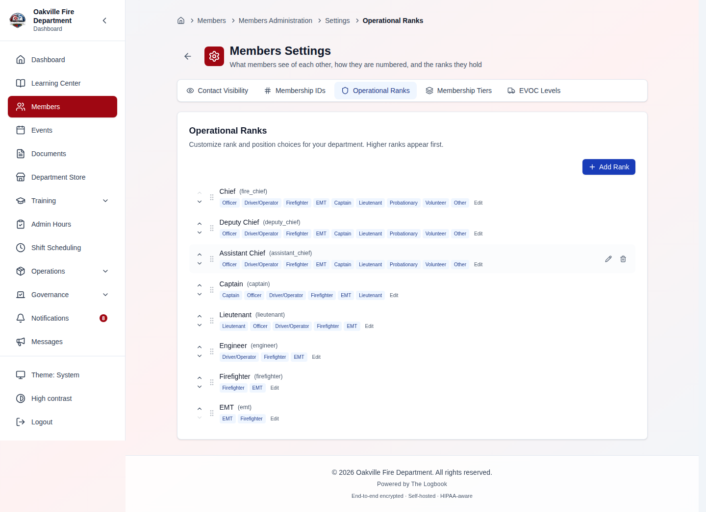

**Do not confuse this with Scheduling > Settings > Eligibility**, which is a
different control: it governs which _membership types_ (Prospective, Retired,
Honorary, Administrative…) are barred from signing themselves up at all, and
which positions are open to everyone regardless of rank.

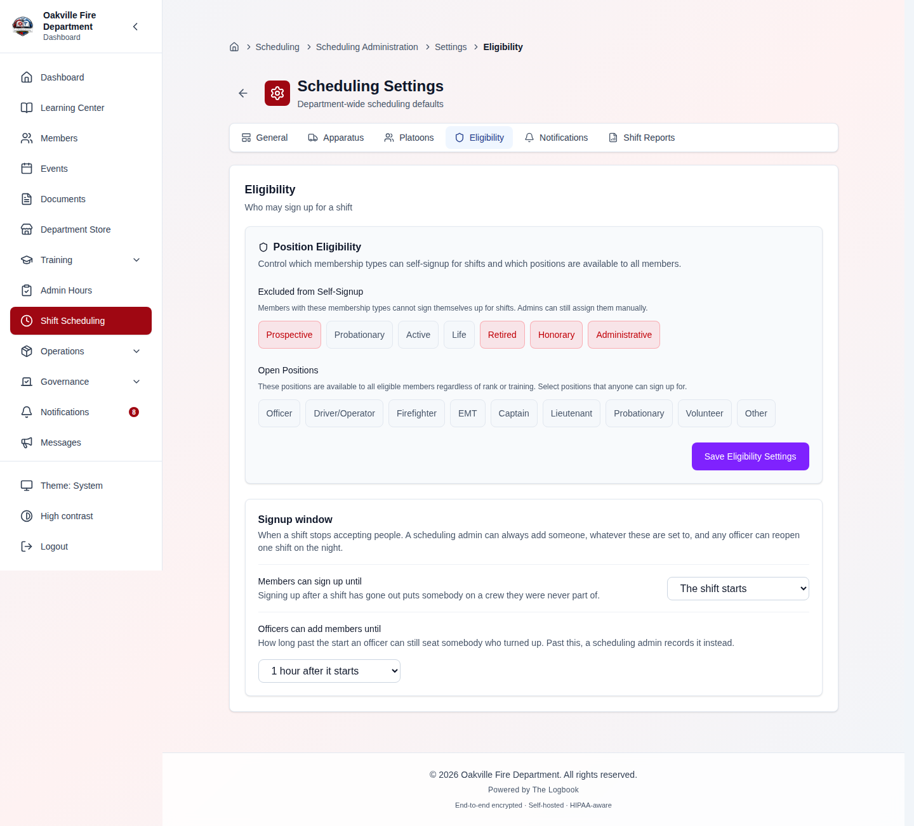

**How it affects shift signup:**

- Every open slot in the Dashboard's **Next 7 Days** list offers a **Sign Up**
  button. Eligibility is checked when you press it, not before — the row gives
  no advance warning
- Pressing **Sign Up** expands the row into a position dropdown holding **only
  the positions your rank qualifies for**, with a Confirm button beside it
- If your rank qualifies for none of the open positions, the expanded row says
  **"Not eligible for this shift."** instead of a dropdown
- Ranks with no `eligible_positions` defined default to all positions being eligible (backward-compatible)

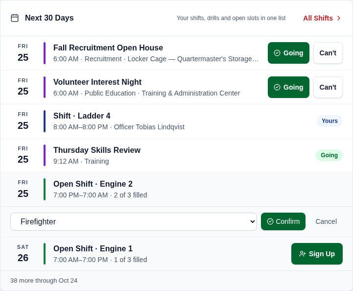

> **The button is not a promise.** It appears on every shift, so a member can
> press Sign Up and be told they are not eligible. This is a known rough edge —
> see [Known Limitations](../KNOWN_LIMITATIONS.md).

### Scheduling Admin Pages

Admin functionality has been extracted into dedicated pages for better navigation:

| URL                     | Page      | What It Does                                 |
| ----------------------- | --------- | -------------------------------------------- |
| `/scheduling/templates` | Templates | Manage shift templates                       |
| `/scheduling/patterns`  | Patterns  | Create and manage shift patterns             |
| `/scheduling/reports`   | Reports   | View hours, coverage, and compliance reports |
| `/scheduling/settings`  | Settings  | Configure scheduling rules and preferences   |

Each page has back navigation to the main scheduling hub. Access requires `scheduling.manage` permission.

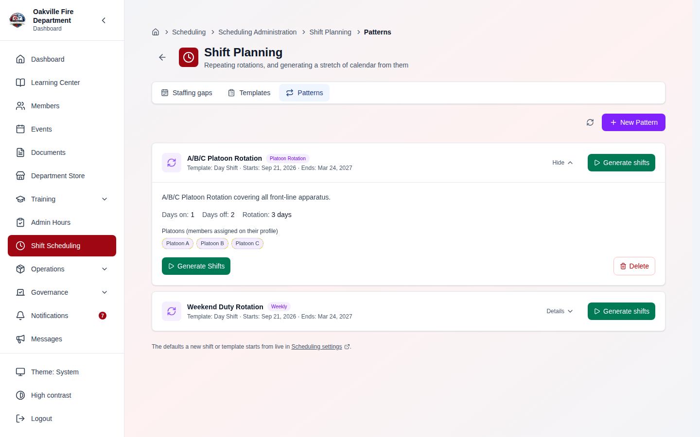

### Equipment Check System

The Equipment Check system allows structured, shift-based vehicle and equipment inspections. It consists of three parts: template building, check submission, and reporting.

#### For Administrators: Building Templates

Navigate to **Scheduling > Settings > Equipment** to see the template list, then click **Create Template** to open the template builder.

1. Set the template name, timing (start or end of shift), and type (equipment, vehicle, or combined)
2. Optionally assign to a specific apparatus or apparatus type
3. Optionally restrict to specific positions (e.g., only Driver/Operator sees this checklist)
4. Add **compartments** — named sections representing physical areas (e.g., "Officer Door Entry", "Pump Panel", "Cab Interior")
5. Within each compartment, add **items** with one of 7 check types:

| Check Type     | What It Records                | Example                        |
| -------------- | ------------------------------ | ------------------------------ |
| **Pass/Fail**  | Binary pass or fail            | "Fire extinguisher pin intact" |
| **Present**    | Item is present or missing     | "Traffic cones (6)"            |
| **Functional** | Item works or doesn't          | "PA system"                    |
| **Quantity**   | Numeric count                  | "SCBA bottles — required: 4"   |
| **Level**      | Fill level with unit           | "Fuel — gallons"               |
| **Date/Lot**   | Expiration date and lot number | "EpiPen — exp: 2026-09"        |
| **Reading**    | Numeric reading with unit      | "Pump engine hours — hours"    |

6. Items can track serial numbers, lot numbers, expiration dates (with warning windows), and required quantities
7. Use **drag-and-drop** to reorder compartments and items
8. On a **vehicle** or **combined** template, **Load Vehicle Preset** offers nine pre-built checks — Engine/Pumper, Ladder/Tower, Ambulance/Rescue, Tanker/Water Tender, Rescue/Heavy Rescue, Brush/Wildland, Boat/Watercraft, Utility/Command and Generic Vehicle — each showing how many sections and items it will add before you pick it

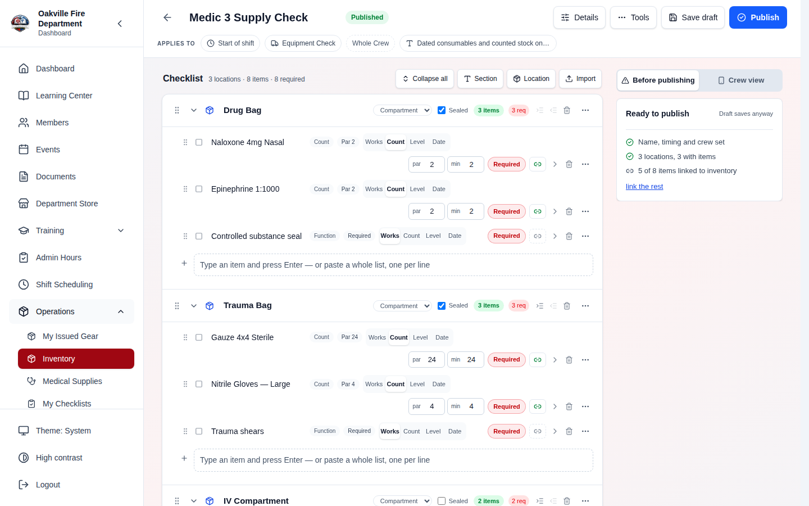

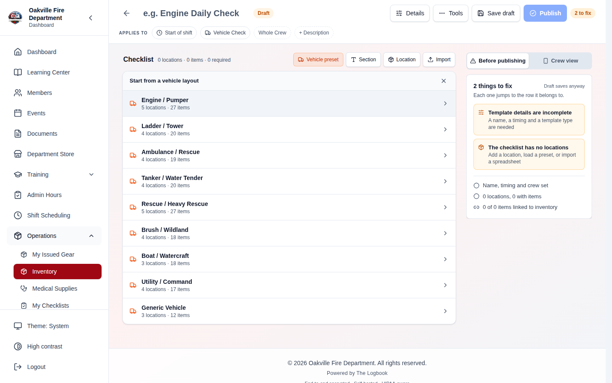

#### For Members: Submitting Equipment Checks

During a shift, members see pending equipment checks on their dashboard or on **My Equipment Checklists**, which is the Equipment Checks tab of Scheduling as a member sees it.

1. Open the checklist for your current shift. **You do not need one** —
   **Unscheduled checklist**, at the top of the page, offers every active
   template and starts a check with no shift attached.
2. Work through each compartment and item:
   - **Pass/Fail**: Tap pass or fail
   - **Quantity**: Enter the count
   - **Level**: Enter the level reading
   - **Date/Lot**: Verify expiration date and lot number
   - **Reading**: Enter the reading value
3. Optionally attach photos to any item (up to 3 per item). The button is
   inside the item's note panel — tap **Note** first, then **Add photo**.
4. Submit the completed check

Every item also offers **Not on truck**, and a pass/fail item adds **Out of
service** — a rig that has the tool but cannot use it is not the same as one
that never had it.

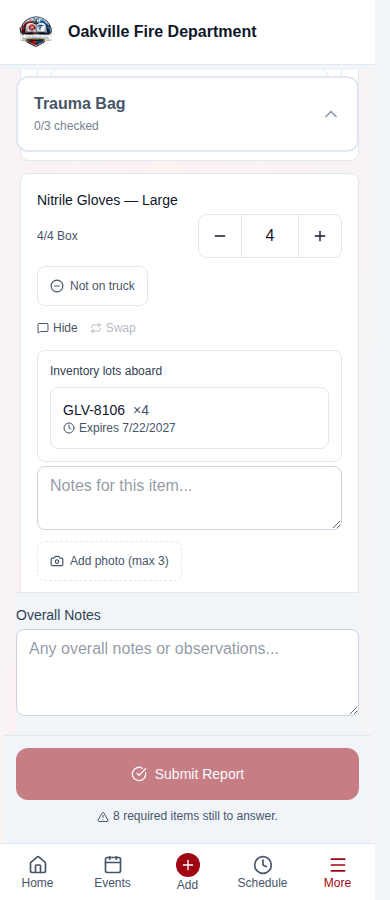

> **Fixed 2026-08-08.** Submitting a check used to return a server error on
> **any shift with an apparatus assigned** — so in practice, on any real shift.
> If your department hit this, no action is needed beyond updating; nothing was
> saved, so there are no half-written checks to clean up. Two related problems
> went with it: **equipment-check templates never resolved** for departments that
> set their apparatus up during onboarding (the checklist came back empty), and
> departments running the full Apparatus module **could not assign an apparatus
> to a shift at all**.

**Auto-fail rules:**

- Items with `has_expiration: true` and a past expiration date auto-fail regardless of the submitted result
- Items below the `required_quantity` auto-fail
- A single failed item marks the entire apparatus as **deficient** — the apparatus record shows a deficiency badge until a subsequent full check passes all items

#### For Officers: Reports

Navigate to **Scheduling > Equipment Check Reports** to view three report tabs:

| Tab                        | What It Shows                                                                  |
| -------------------------- | ------------------------------------------------------------------------------ |
| **Compliance Dashboard**   | Pass rates by apparatus, member compliance stats, check frequency              |
| **Failure/Deficiency Log** | Paginated list of failed items with filters by apparatus, date, and check type |
| **Item Trend History**     | Pass/fail trends over time by interval (daily, weekly, monthly)                |

Reports can be exported as **CSV** or **PDF**.

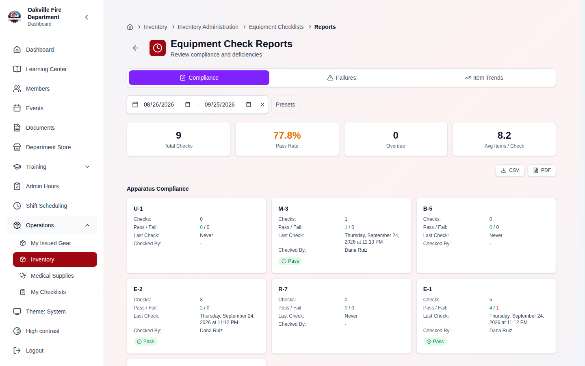

#### Equipment Check Edge Cases

| Scenario                          | Behavior                                                                                                                                                                                           |
| --------------------------------- | -------------------------------------------------------------------------------------------------------------------------------------------------------------------------------------------------- |
| No template assigned to apparatus | No checklist appears for that shift                                                                                                                                                                |
| Position-based template           | Only members in assigned positions see the checklist                                                                                                                                               |
| Expired item submitted as "Pass"  | Auto-fails with "expired" reason                                                                                                                                                                   |
| Item below required quantity      | Auto-fails with "under required quantity" reason                                                                                                                                                   |
| All items pass                    | Clears apparatus deficiency flag if previously set                                                                                                                                                 |
| Photo upload                      | Max 3 per item, max 10 MB each, auto-converted to WebP                                                                                                                                             |
| Template cloning                  | Deep clones compartments and items to another apparatus                                                                                                                                            |
| Serial/lot number update          | Submitting new serial/lot updates the template item for future reference                                                                                                                           |
| Expiration read off a replacement | Recorded as `expiration_found` and written back to the template item, exactly as the lot number is _(2026-08-10)_                                                                                  |
| Expiry verdict                    | Recomputed **server-side** from the soonest date aboard, not taken from the form. A client-supplied "expired" flag is what force-fails a safety-critical item, so it is not trusted _(2026-08-10)_ |
| Quantity item on the form         | Arrives carrying the **running on-truck count** and with **no** pass/fail status, so the progress counter reflects what was actually looked at _(2026-08-10)_                                      |

### Supply Tracking: Keeping the Truck and the Shelf in Step _(2026-08-10)_

An equipment check is a **scheduled, signed pass over a whole apparatus that
produces a report**. That is what it is for, and it is a poor fit for "we just
used two of these at three in the morning."

Until this release it was also the _only_ way anything about a truck's stock
could be written down. A crew that used the last of something either wrote a
note somewhere or left it for the next morning's check to discover — which is
exactly the window in which a truck runs a call short.

There are now two screens that live outside a check, and a set of rules that keep
them and the check form telling the same story.

#### Apparatus Inventory — what the truck is carrying, right now

Open **Scheduling → Equipment Checks → Apparatus Inventory**, pick a rig, and you
see its tracked positions compartment by compartment: what is aboard, the lots
and expiration dates on each one, and the ready stock on the shelf behind it.

**No check is required and no shift is required.** It is readable at any hour by
any member with `equipment_check.submit` — the default member position — because
recording what you just used is crew work, and putting it behind an officer
permission is the thing that leaves the bracket empty until morning.

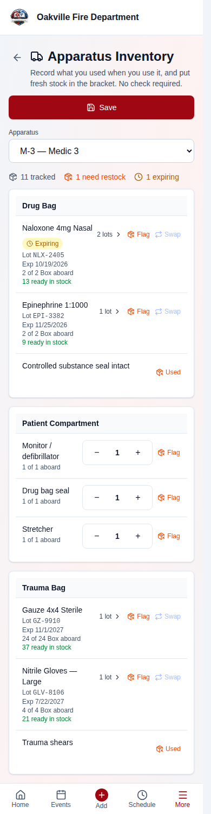

The header counts the truck three ways: **how many positions are tracked**, how
many **need restock**, and how many are **expiring**. A position at par states
its count plainly — "2 of 2 Box aboard" — and a position under it carries an
amber **Short** badge and prints its count in amber too — "18 of 24 Box aboard"
— so the two are told apart at a glance rather than by shade alone.

The lot number beside a position is **the lot the date belongs to**, not the
last one swapped aboard. On a position carrying several lots those are
different lots, and the one that matters is the one expiring soonest.

> **A tracked position comes from a checklist bound to _that_ apparatus.** A
> template that applies to every engine — bound by apparatus **type** — supplies
> checklists for shifts but stocks no particular truck, and a rig with only
> type-bound templates shows an empty inventory. If a truck you expect to see
> here is bare, that is why.

Each position offers up to five actions, and they mean different things:

| Action   | What it records                                                                                                                                                                                |
| -------- | ---------------------------------------------------------------------------------------------------------------------------------------------------------------------------------------------- |
| **−**    | **Consumption.** The count comes down and a restock report goes up with it, so the shortfall reaches the supply officer without anyone opening a form                                          |
| **+**    | A hand restock — you put units back yourself                                                                                                                                                   |
| **Swap** | Draws units off a shelf lot and puts them on the truck. It defaults to the shortfall, so filling a gap needs no arithmetic                                                                     |
| **Flag** | Damaged, contaminated, missing or recalled — **on a counted position, where − already records use.** It is the honest way to say "this needs attention" without pretending a unit was consumed |
| **Lots** | Opens the lots aboard. A position carrying lots opens them **instead of** offering a stepper — two units with two dates cannot be moved by one plus or minus                                   |

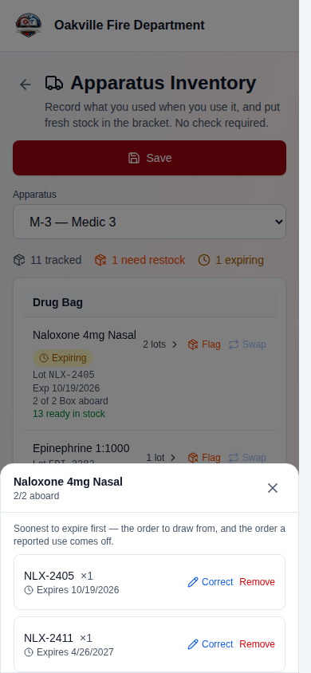

The sheet lists lots **soonest to expire first**, which is both the order a crew
should draw from and the order a reported use comes off. **Correct** fixes a
miscounted or mistyped lot; **Remove** takes it off the truck entirely. A lot
drawn down to nothing disappears on its own — it is no longer aboard.

**Headers and free-text lines do not appear here.** They are checklist
scaffolding — "Check all seals", "Officer's compartment" — not things anyone
stocks.

#### Expiring on Apparatus — the supply officer's worklist

Open **Scheduling → Supply** (the tile carries a count badge when there is
anything on it), or reach it from the **Gear Admin hub**.

The page lists checklist positions that need attention **together with the ready
replacement stock for each**, because "swap it" and "order it" are different jobs
and the officer plans the week around which one each row is.

| Control    | Options                                       |
| ---------- | --------------------------------------------- |
| Look-ahead | 30 / 60 / 90 days                             |
| Filter     | All · Needs restock · Used or short · Expired |
| Sort       | Soonest expiry · By apparatus                 |

Two summary pills sit above the list — how many rows need attention, and how
many have ready stock behind them. A third, in red, appears **only when
something has no ready stock to draw on**: `N need restock`. A department whose
shelves cover every row never sees it, and that absence is the answer to "is
there anything I have to order this week".

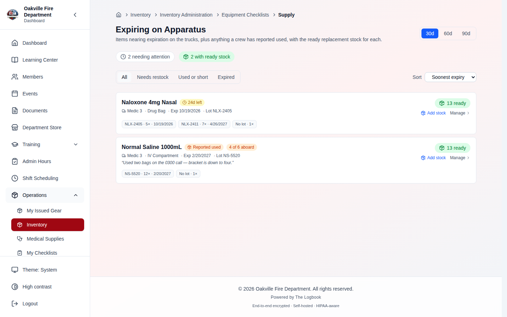

**Expired shelf stock is struck through and cannot be swapped.** Offering it
would put expired supplies in service and fail the item on the very next check,
so the swap refuses it. For the same reason it is not counted as ready stock: a
count that includes expired units hides the shortage most in need of ordering.

#### Recording what you used, and the report it raises

Tapping **−** (or **Flag**) raises a **restock report** against that position. The
report carries who raised it, when, and an optional note, and it appears on the
supply worklist beside the expiring items — to a supply officer, "expires
Thursday" and "the crew used it last night" are the same job.

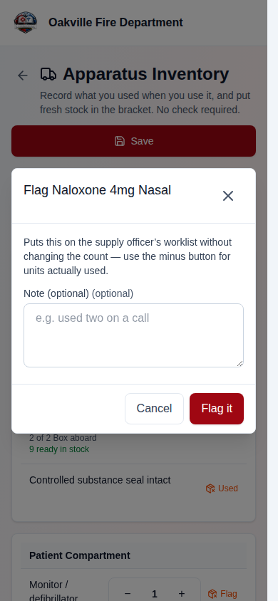

**A report is settled only when the truck is back at its target.** Two of four
back is still a truck short two, and clearing the flag there would close the gap
on paper while leaving it open on the apparatus. A swap of fresh stock clears the
report because the item has been dealt with; clearing also drops the reporter and
the note, so a stale name is never attached to the next report.

#### Lots aboard: why one date was not enough

A position that carries four of something can be carrying units from three
different lots with three different expiration dates.

The checklist item itself has room for **one** lot number and **one** expiration
date, so only one of them could ever be recorded — and the one recorded was
whichever was restocked last. Restocking two of a four-slot bracket stamped the
new date onto the two already there, hiding older units behind a later
expiration. The truck's real exposure, the **soonest date aboard**, could not be
written down at all.

Each lot aboard is now recorded separately:

- A position's **count** is the sum of its lots.
- A position's **expiration** is the earliest of them, and that is the date every
  screen shows and the date the expiry verdict is taken from.
- **Consumption draws first-expiring-first-out** — the order a crew should be
  pulling from, and the only order that keeps what remains as fresh as possible.
- **Undated lots sort last.** An undated unit is never the one that needs using
  up.

Correcting a lot sets its **count, lot number and expiration together**, from the
apparatus view or from inside a check. That matters for a changed-out medication:
a crew swapping a box in could previously record that one was there without
recording when it expires, leaving the application confidently asserting an
expiration for a unit that had left the bag.

#### Linking a checklist position to the catalog

Everything above hangs off one thing: the checklist item's **link to an inventory
item**. An unlinked position has no expiration tracking, no lots, no ready stock
and no restock reporting.

Setting that link used to be a separate act, three clicks deep in the item's
advanced panel, so on a real rig checklist almost nothing was linked. There are
now two paths:

1. **While adding a position.** The template builder's quick-add bar searches the
   catalog as you type. Picking a result links it and inherits what the catalog
   knows — its name, whether it is counted or serialized, whether it carries
   dated stock. Typing a name nobody stocks still adds a plain checklist line,
   because plenty of lines are not stock and never will be. If the search finds
   nothing, the bar offers to **create the item in inventory and link it in one
   step** (this option needs `inventory.manage`).
2. **For checklists you already have.** A bulk pass proposes a catalog item for
   every unlinked position on the template. Read down the list once and apply it.

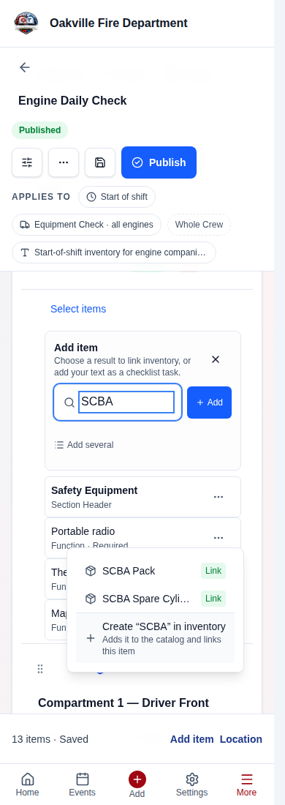

Reach the bulk pass from the template builder's toolbar: the button reads
**_linked_ / _linkable_** and turns amber while anything is unlinked.

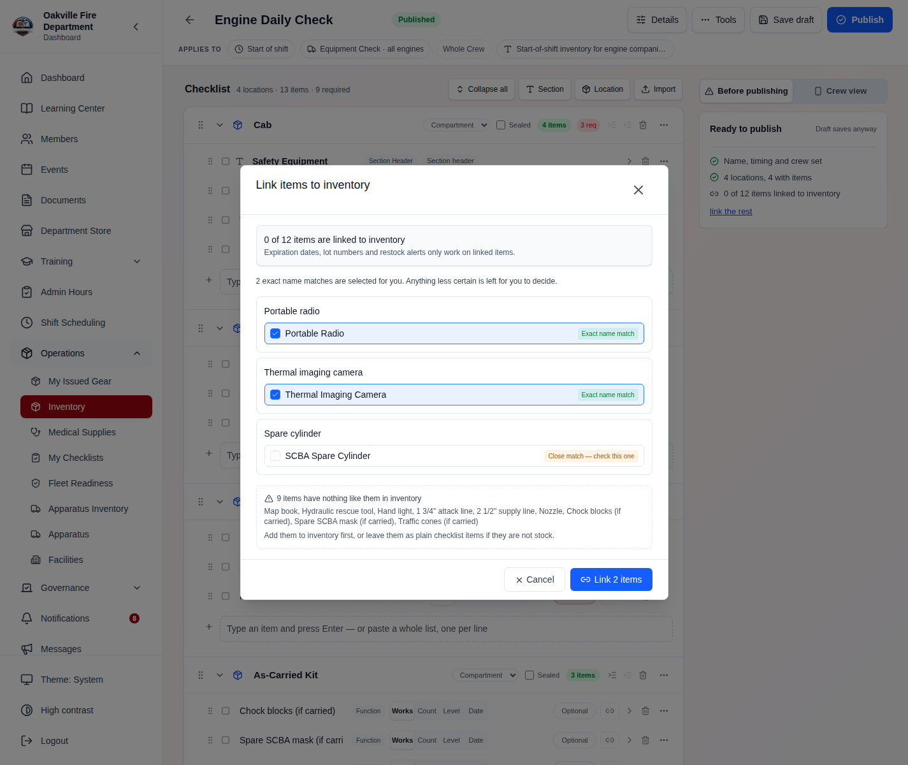

Positions the catalog has nothing like are gathered into one dashed panel at the
bottom — "_N_ items have nothing like them in inventory" — rather than listed as
failures. Add them to inventory, or leave them as plain checklist lines if they
are not stock.

**Only exact name matches are pre-selected.** A close match is deliberately never
pre-selected: "Oxygen Mask" scores high against both the adult and the pediatric
mask, and quietly picking one would put the wrong expiry on a truck. The template
toolbar now shows a **linked / unlinked count**, so the holes are visible at all.

#### What the crew sees on the check form

Three things changed about how a quantity item arrives:

- **It carries the running on-truck count**, not the last check's number. A crew
  that pulled two at 03:00 used to open the morning check at the four the last
  check had seen — the exact drift this feature set removes, reintroduced at the
  screen where it matters most.
- **It arrives with no pass/fail status.** A pre-filled number is a starting point
  to correct, not an assertion. Before this, a crew could open a sixty-item check,
  submit it untouched, and file a complete report against a truck nobody had
  looked at, with the progress counter agreeing.
- **The count reads against par with the unit beside it** — "2/4 Box" rather than
  "2/4 Expected" — projected from the linked catalog item, so a department that
  relabels a unit does not re-enter it on every truck that carries it.

A line at the top of the form says once that counts have been carried over, and
**retires itself** as soon as nothing is still carried. Touching a quantity field
is what confirms a number you agree with — the same single tap, without a
"carried over" label printed sixty times.

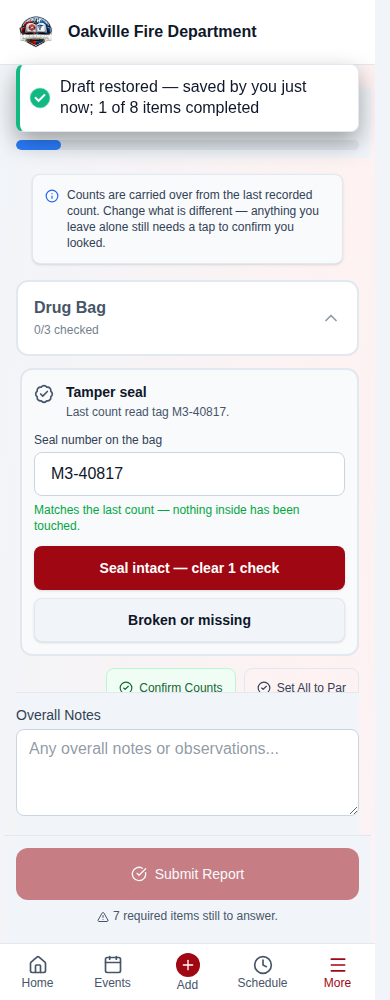

#### Confirm Counts vs. Set All to Par

These are **different claims**, and only the second used to have a button:

| Button             | The claim it files                                                                                     |
| ------------------ | ------------------------------------------------------------------------------------------------------ |
| **Confirm Counts** | "The numbers shown are right." Cannot record stock nobody has. It leads, because it is the common case |
| **Set All to Par** | "It is all full." Writes the required quantity over whatever is showing                                |

Set All to Par is still there and still means what it meant, but it now **names
the items whose count it is about to raise** before doing it. On a truck carrying
eighteen of twenty-four gauze, one tap used to record twenty-four — six on the
record that are not in the bag — with no signal it had done so. A compartment
already at par is untouched by the warning and stays one tap.

Status still comes from the number, so confirming eighteen of twenty-four files a
**failure** rather than quietly passing it.

The confirmation names each item and the size of the claim — `18 → 24` — and
its buttons say what they do rather than restating the feature: **Keep the
counts** or **Yes, they are full**.

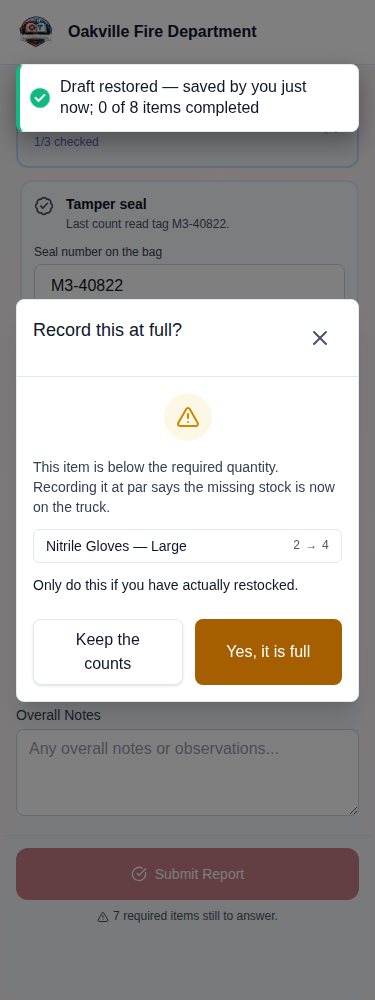

#### Working from the item instead of the truck

The supply worklist answers "what is expiring on my trucks". A recall, or a lot
you are holding in your hand, is worked from the other direction.

An inventory item's **stock tab** now lists the checklist positions it fills —
which apparatus, which compartment, and what that truck is carrying right now.
It is pictured in
[Inventory → Which trucks carry this item](./05-inventory.md#dated-stock-lots-and-receiving-2026-08-10),
rather than repeated here.

#### Alerts

A weekly **expiring supplies** alert reports both ends of the loop together,
splitting the deployed items by whether an in-date lot is actually behind them.

It is weekly rather than daily on purpose: an item that has **already** expired
force-fails its apparatus on every check and notifies through that path, so this
alert exists to get ahead of the date rather than to repeat what the check
already says.

#### Supply Tracking Edge Cases

| Scenario                                                         | Behavior                                                                                                                                                                                                                          |
| ---------------------------------------------------------------- | --------------------------------------------------------------------------------------------------------------------------------------------------------------------------------------------------------------------------------- |
| Nobody has ever counted a position                               | Its count reads as **not counted**, and the required/expected target stands in. It is _not_ reported as zero — that would show every untouched truck as stripped                                                                  |
| A crew reports more used than the record held                    | It draws what was there. That is a correction to the record, not a negative count                                                                                                                                                 |
| A position holds units with no lot recorded, then a lot is added | The existing units get a lot row of their own **first**, or they would vanish behind the new lot's count                                                                                                                          |
| A recount comes out **over** the record                          | The surplus lands in an **undated** row — the honest answer to when found stock expires is that nobody knows                                                                                                                      |
| A recount comes out **under** the record                         | The difference comes off soonest-expiring-first, like any other consumption                                                                                                                                                       |
| A lot is counted down to zero                                    | The lot is removed, so a spent box stops contributing its date to the position's reading                                                                                                                                          |
| A restock puts the truck part-way back                           | The restock report **stays open**. Two of four back is still a truck short two                                                                                                                                                    |
| A counted position is below target with no report behind it      | It reaches the supply worklist anyway, showing the numbers rather than only that something is needed                                                                                                                              |
| Shelf stock has expired                                          | Excluded from the ready-stock count, struck through in the list, and **refused by the swap**                                                                                                                                      |
| Everything on a position has expired                             | Counted as **expired** and reported apart from _expiring_ — one wants attention soon, the other is unusable now. The count renders **red**, because two of two expired units meet the number and are still nothing a crew can use |
| An item is replaced from untracked stock during a check          | Record the new expiration in the "replaced — new date" control. Without it the old date survives the replacement, the item is force-failed on every submission, and it holds the apparatus in a deficiency state forever          |
| A position carries lots **and** you are inside a check           | You get the per-lot **Correct** control only. The older single-date "replaced — new date" affordance appears only where there are no lots to correct, so one fact never has two contradictory inputs                              |
| A template is cloned to a second rig                             | The catalog link comes with it. It used to be dropped silently, which is how a department stands up its second engine with nothing tracked                                                                                        |
| A shelf lot is deleted while units from it are on a truck        | The truck's record survives. Lot number and expiration are copied onto the deployed record rather than read through the shelf lot                                                                                                 |
| A member has `equipment_check.submit` but not `inventory.manage` | They can report use, recount, swap and correct lots. They cannot create a new catalog item from the quick-add bar                                                                                                                 |

### Shift Finalization _(2026-03-28)_

After a shift ends, officers finalize the shift to lock in data and trigger training pipeline integration.

#### How to Close Out a Shift

1. Open the **Shift Detail Panel** for a past, un-finalized shift
2. Click **Close out shift** — a checklist headed **Before you close this
   shift** opens in the panel

> **The control is named "Close out shift", not "Finalize".** `is_finalized` is
> still the flag underneath, and this guide and the API both use the word, but
> the button names the thing an officer does at the end of a shift rather than
> the column it sets.

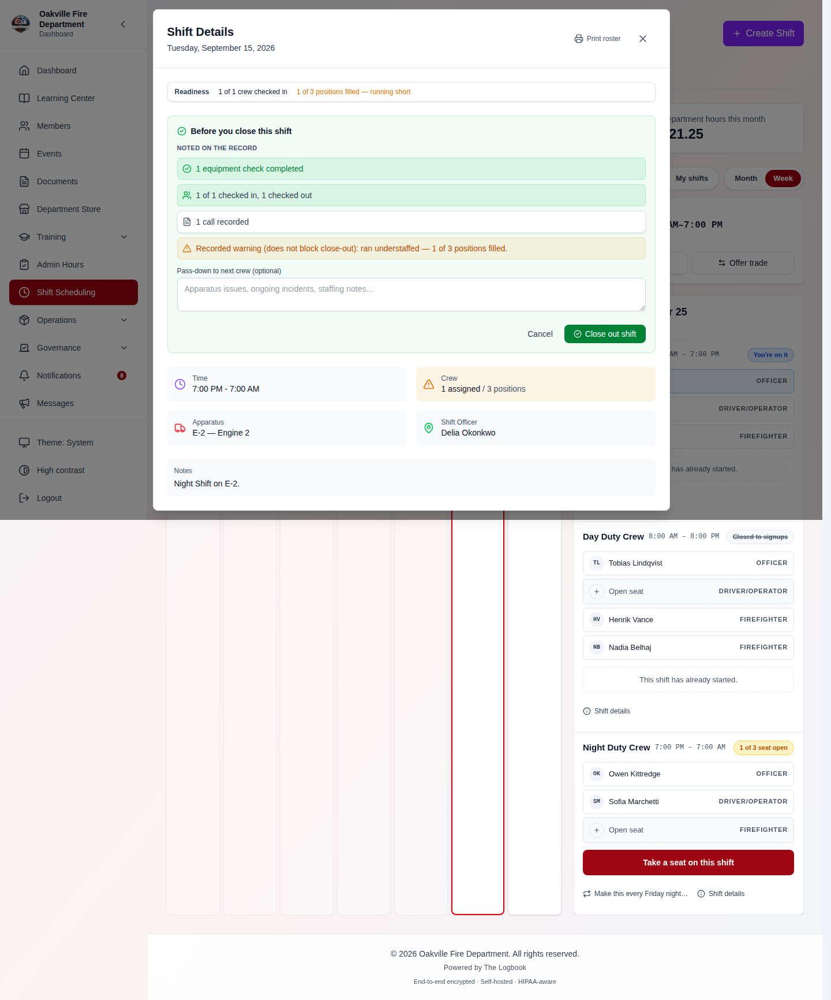

> **This checklist is what a department on per-incident call logging sees.** If
> your department has **Record a call count at close-out** switched on, the
> button opens a three-step wizard instead — see
> [The three-step close-out wizard](#the-three-step-close-out-wizard-2026-08-19)
> below. Everything else on this page still applies.

3. The checklist validates:
   - **End-of-shift equipment checks** — outstanding checks are called out,
     but they only _block_ finalization when the department has turned on
     **require end-of-shift checks before finalizing** in Scheduling
     Settings → Close-out rules. It is off by default, so the modal warns
     and lets the officer proceed; with it on, finalizing needs a
     logged override reason
   - Attendance summary and call count shown for reference
   - A staffing line when the shift ran under its minimum ("Ran understaffed —
     1 of 4 positions filled")
4. Click **Close out shift** to confirm

#### What Happens on Finalization

| Action                     | Description                                                                                                                  |
| -------------------------- | ---------------------------------------------------------------------------------------------------------------------------- |
| **Data snapshots**         | `call_count` and `total_hours` frozen on the shift record                                                                    |
| **Per-member call counts** | Each member's individual call participation count computed from ShiftCall records and stored on their ShiftAttendance record |
| **Shift locked**           | `is_finalized=true`, `finalized_at` timestamp, `finalized_by` officer ID set                                                 |
| **Draft reports created**  | ShiftCompletionReport drafts auto-created for all attendees with active training program enrollments                         |
| **Notification sent**      | Officer receives notification with count of drafts created                                                                   |

After finalization, a green badge shows "Shift finalized on [date]" with a
**Reopen** link beside it, and the pass-down note entered at close-out is
shown underneath. The close-out control is gone, but the crew roster keeps its
remove buttons — reopening is what unlocks the shift, not the badge alone.

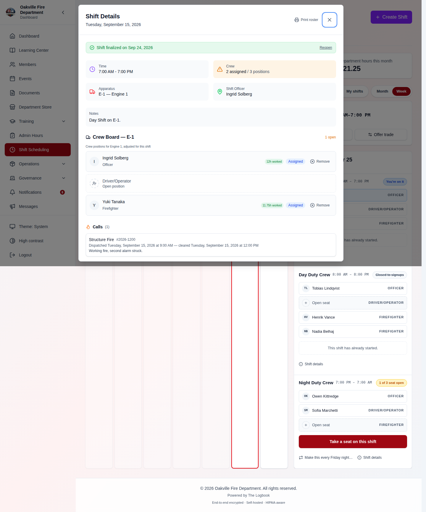

#### Shift Finalization Edge Cases

| Scenario                                 | Behavior                                                                    |
| ---------------------------------------- | --------------------------------------------------------------------------- |
| End-of-shift equipment checks incomplete | Close-out blocked; the confirm button is disabled, with the reason above it |
| Start-of-shift checks incomplete         | Does not block close-out                                                    |
| Shift has not ended yet                  | Close-out button not shown for future/in-progress shifts                    |
| Already finalized shift                  | Close-out button replaced with finalized badge                              |
| Editing a finalized shift                | Blocked — edit controls hidden after finalization                           |
| Deleting a finalized shift               | Blocked — returns "Cannot delete a finalized shift" error                   |
| Deleting a shift with completion reports | Blocked — returns "Cannot delete a shift with completion reports" error     |
| Draft creation fails for one trainee     | Error logged; remaining trainees still get draft reports                    |
| Attendee with no active enrollment       | No draft created for that attendee                                          |

### The three-step close-out wizard _(2026-08-19)_

For departments recording a call count, **Close out shift** opens a wizard
rather than the single checklist. Same button, same permissions
(`scheduling.manage`, or being the shift's own officer), same past-and-not-yet-
finalized shift — different screen.

#### Why three screens instead of one

Close-out happens at 0700 in an apparatus bay, on a phone, by somebody who has
been awake for twenty-four hours. **Each step saves the moment you press Next.**
If the phone locks, the battery dies, or a call drops on the way out the door,
reopening the shift puts you back on the screen you left — not at the beginning
with everything retyped.

#### Step 1 — When was everyone actually on?

The crew is listed with their check-in and check-out times, already filled in
from what they recorded, and editable. Underneath, a **combined hours** figure
for the whole crew.

Anyone who never checked out is flagged, and **anyone who was assigned but never
checked in is listed too, with empty times for you to fill in**. That is
deliberate: they used to be invisible, which meant no hours, no credit, and
nothing on screen to tell the officer somebody had been missed.

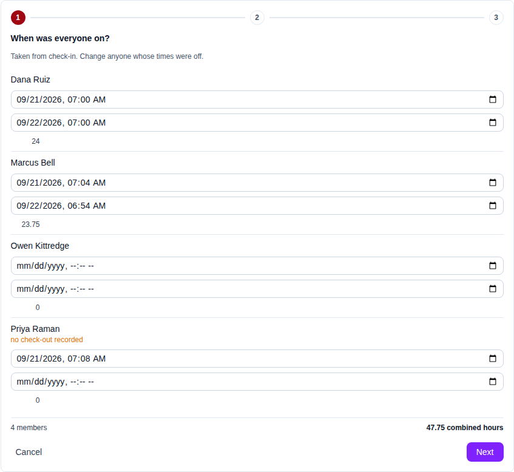

> **"Combined hours" is not the shift's length.** It adds up what every member
> was on for, so a 24-hour tour with a full four-person crew all present
> approaches 96 — a number that reads as a mistake without the word "combined"
> in front of it.
>
> The figure above reads 47.8 rather than 96 for the reason the screen is
> showing you: two of these four have incomplete times. A member who never
> checked out and one who was never checked in at all contribute nothing to the
> total until somebody fills their times in. A combined figure well short of
> crew × hours is the flag that somebody still has to be accounted for.

#### Step 2 — How many calls did the apparatus run?

One row per call type. Enter a number against each type you ran; the **total is
calculated from those rows and cannot be typed into**.

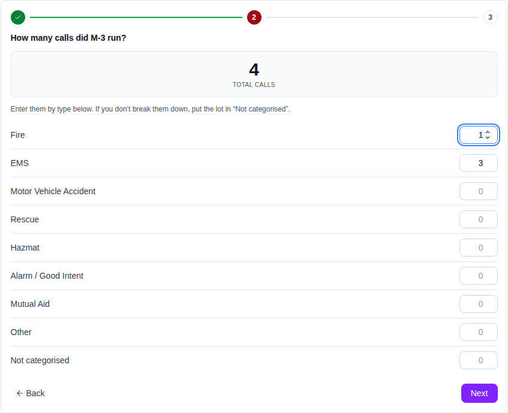

There is exactly one place the number comes from. An earlier design let you type
a total _and_ a breakdown, and revising a count downward left the old total
sitting on screen — which is the figure that then got saved.

**Blank and zero read as different answers while you are filling the form in,
but they are not distinguishable afterwards.** Leaving every row blank means
_"we did not track it"_ and entering `0` means _"we ran none"_ — and the form and
the request do keep those apart, which is what lets a correction clear a count
somebody entered earlier. The distinction stops at saving: both record no calls,
both read back as `0` when the shift is reopened, and no report can tell a quiet
tour from a question nobody answered. **If a nil return matters for your
records, say so in the pass-down notes on step 3.**

**Calls you cannot classify go in the "Not categorised" row — not nowhere.**
Say you ran six and can only remember that four were EMS: enter `4` against EMS
**and `2` against Not categorised**. Nobody is asking you to invent a type at
0700, which is exactly what that row is for — but the total on this screen is
the sum of the rows, so if you enter only the four you are sure of, the shift is
recorded as **four calls, not six**. Your department's volume is short by two,
and nothing on screen shows it.

**One hundred calls is the ceiling for a single shift.** You are reporting a
tour, not a year, and the cap stops a fat-fingered "500" from skewing every
report that reads it.

#### Step 3 — Confirm each member's credit

Every member starts credited with the apparatus's full count. Adjust anyone who
came on late or left early.

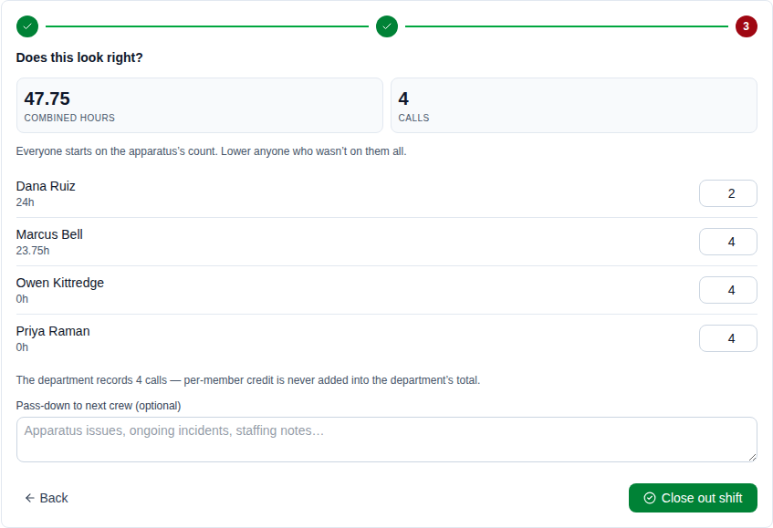

**A member credited with fewer calls than the apparatus ran gets a count, but
not call types.** Which of the night's calls they were on is not something the
system knows, and guessing produced real damage: a trainee credited with one
call on a shift of one EMS and one fire was always assigned "EMS", and that
invented type was then spent against EMS-specific training requirements.

Pass-down notes for the next crew are entered here, as before.

#### If your department requires end-of-shift equipment checks

Outstanding checks are called out on the final step, with the override checkbox
and its required reason — the same behaviour as the old checklist, because the
wizard replaces that screen and has to carry everything it could do. The
override is still logged and still audited.

> **[SCREENSHOT NEEDED — close-out wizard with outstanding end-of-shift checks,
>
> > showing the warning, the override checkbox, and the reason field it requires]**

#### Wizard edge cases

| Scenario                                                                      | Behavior                                                                                                                                                                                                      |
| ----------------------------------------------------------------------------- | ------------------------------------------------------------------------------------------------------------------------------------------------------------------------------------------------------------- |
| Phone locks or the browser closes mid-flow                                    | Reopening the shift resumes on the last screen you completed. Anything already saved is kept                                                                                                                  |
| Officer lowers the call count below calls this shift shares with another unit | Refused, with a message naming the count. Detaching a shared call has to be deliberate — a lowered total must not silently remove another unit's run from the record                                          |
| Shift's date or apparatus is corrected after close-out                        | The calls follow the shift onto the new date and the new unit. The totals were always right; before this was fixed the daily and per-apparatus reports pointed at the wrong day and the wrong truck           |
| Declined, pending, or no-show crew                                            | Not listed. Every listed member takes the apparatus's full count by default, so listing them credited calls to people who never worked the shift                                                              |
| A call type the admin deleted after you started                               | Dropped from what gets submitted, rather than travelling along invisibly and failing the save with no field to clear                                                                                          |
| Reopening a finalized shift                                                   | Restarts the wizard at step 1                                                                                                                                                                                 |
| Department switches back to per-incident logging                              | Calls already recorded stay recorded. The report reads whichever source matches the current mode — it never adds the two together, which for a department that used each in turn would count every call twice |

### Shift Reports Settings _(2026-04-04)_

Navigate to **Scheduling > Settings > Shift Reports** to configure the shift completion report workflow. This settings tab connects the scheduling module to the training module and controls how officers file post-shift reports.

The tab is a **section navigator, not a page of cards** — you pick one section
at a time from the list and it fills the panel. There are eight: Feature
Toggles, Checklist Timing, Post-Shift Validation, Feedback Defaults, Apparatus
Skills, Form Sections, Review Workflow and Rating Scale. (The section is
labelled **Form Sections**; earlier versions of this guide called it "Report
Form Sections".)

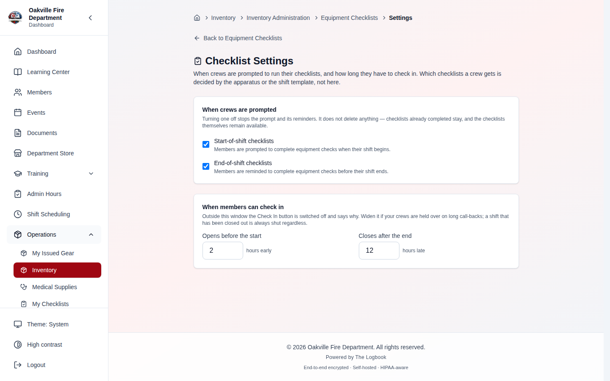

#### Checklist Timing

| Setting                | Default | Description                                              |
| ---------------------- | ------- | -------------------------------------------------------- |
| Start of shift enabled | On      | Whether start-of-shift equipment checklists are prompted |
| End of shift enabled   | On      | Whether end-of-shift equipment checklists are prompted   |

#### Post-Shift Validation

| Setting                   | Default | Description                                                      |
| ------------------------- | ------- | ---------------------------------------------------------------- |
| Enabled                   | On      | Whether post-shift validation reminders are sent                 |
| Require officer report    | Off     | Whether a shift completion report is mandatory after every shift |
| Validation window (hours) | 2       | How many hours after shift end validation reminders are active   |

#### Report Form Section Toggles

Controls which optional sections appear on the shift completion report form when officers file reports. These are separate from the trainee visibility settings in Training Module Configuration.

| Section               | Default | What Officers See                           |
| --------------------- | ------- | ------------------------------------------- |
| Performance Rating    | On      | Star rating or descriptive scale            |
| Areas of Strength     | On      | Free-text field for positive observations   |
| Areas for Improvement | On      | Free-text field for development areas       |
| Officer Narrative     | On      | Extended assessment text area               |
| Skills Observed       | On      | Checklist of demonstrated skills            |
| Tasks Performed       | On      | Checklist of completed tasks                |
| Call Types            | On      | Multi-select of incident types responded to |

All seven are on by default, and each is a checkbox rather than a switch. Core
fields — trainee, date and hours — are always shown and are not listed here.

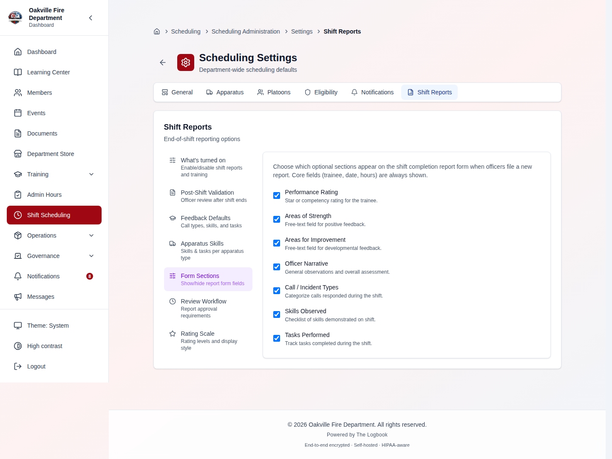

**When to toggle sections off:**

- Small volunteer departments may not need detailed skills tracking — toggle off Skills Observed and Tasks Performed
- Departments that don't track call types separately can toggle off Call Types
- If your department uses a separate evaluation system, toggle off Performance Rating
- Toggling off a section hides it completely from the report form; officers cannot enter data for hidden sections

#### Per-Apparatus-Type Skills and Tasks

The **Apparatus Skills** section holds apparatus-type-specific skill and task mappings. These determine which skills and tasks appear in the report form based on the shift's assigned apparatus, overriding the general defaults.

1. Pick an apparatus type from the row of pills (Ambulance, Boat, Brush, Chief,
   Engine, Hazmat, Ladder, Rescue, Tanker). Each pill carries the number of
   skills mapped to it, and the section opens on the first type alphabetically
   — it is a selector, not an accordion, so exactly one type is shown at a time
2. View the current skills and tasks mapped to that type
3. Add new skills/tasks using the text input and "+ Add" button
4. Rename with the pencil icon, or remove with the "×" button
5. Click **Save Apparatus Skills & Tasks** — this section saves on its own
   button, not the panel's **Save Settings** at the bottom

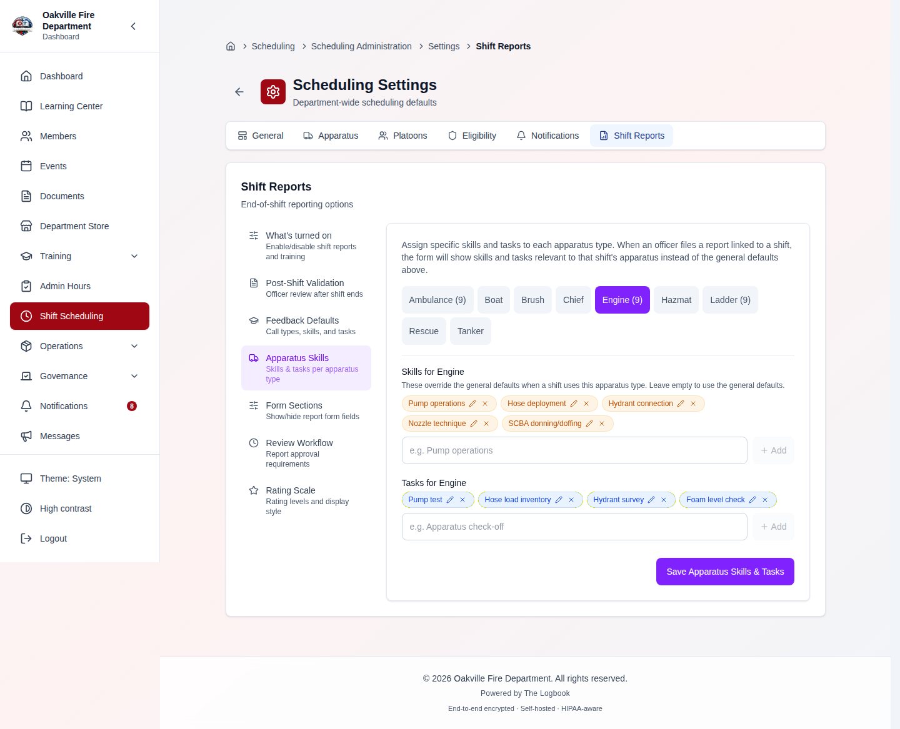

**How this connects to the report form:**

- Officer opens the report form for a trainee on an Engine shift
- The Skills Observed section pre-populates with engine-specific skills (pump ops, hose deployment, etc.)
- The Tasks Performed section pre-populates with engine-specific tasks
- Officer checks off which skills were demonstrated and which tasks were completed
- If the shift has no linked apparatus or the type has no mappings, org-wide defaults are used

#### Rating Scale Customization

| Setting       | Default                                  | Description                                                                           |
| ------------- | ---------------------------------------- | ------------------------------------------------------------------------------------- |
| Field label   | "Performance Rating"                     | Text shown above the rating input                                                     |
| Display style | Stars (1-5)                              | **Stars (1-5)** or **Labeled Bubbles** — a two-button toggle, not a dropdown          |
| Rating levels | Needs Improvement → Exceeds Expectations | Editable label per level; add, remove, rename and reorder, each level numbered from 1 |

**The level labels only appear under Labeled Bubbles.** With the default Stars
style the section shows just the display-style toggle and the field label —
selecting Labeled Bubbles is what reveals the level editor. This section saves
on its own **Save Rating Scale** button.

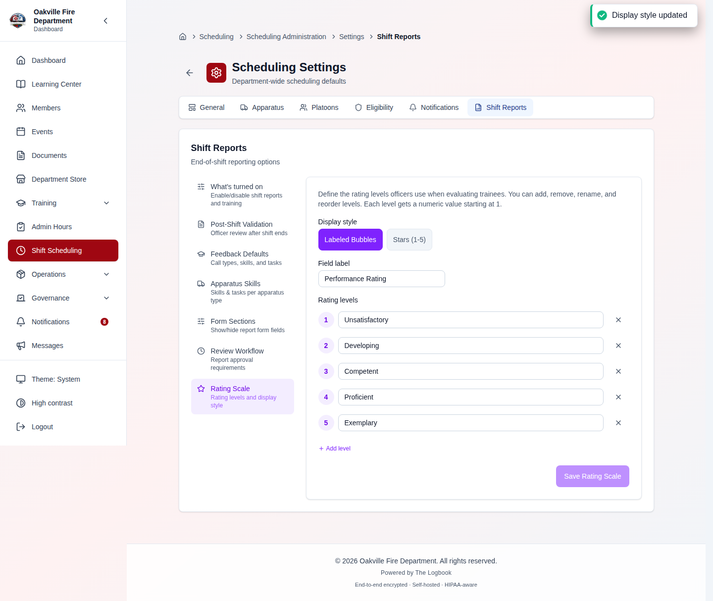

#### Save as Draft

Officers can save incomplete reports as drafts by clicking **Save as Draft** instead of submitting:

- Drafts appear in the **Drafts** view of the Shift Reports tab
- No training pipeline progress is triggered for drafts
- Officers can return to complete drafts at any time
- On final submission, deferred pipeline progress is applied

#### Auto-Filter Trainee List

When filing a report linked to a specific shift, the trainee dropdown automatically shows only members assigned to that shift. This prevents filing reports for members who weren't on duty. For ad-hoc reports (no shift selected), the full member list is available.

#### Shift Report Settings Edge Cases

| Scenario                                       | Behavior                                                                    |
| ---------------------------------------------- | --------------------------------------------------------------------------- |
| All form sections toggled off                  | Core fields (trainee, date, hours, calls) remain; form is still submittable |
| Apparatus type with no mapped skills           | Falls back to org-wide default skills; if none, section is empty            |
| Save as draft with incomplete data             | Saved; required field validation deferred to final submission               |
| Trainee list with no shift linked              | Full member list shown (ad-hoc mode)                                        |
| Descriptive rating with no custom labels       | Falls back to numeric display (1-5)                                         |
| Trainee has shift assignment but no attendance | Auto-populate returns zeros; officer enters hours manually                  |
| Report shift_date doesn't match linked shift   | Validation error returned                                                   |

---

### Structured Position Slots & Decline Handling

A shift's riding positions are shown on the shift panel as a **Crew Board**,
headed with the apparatus and a count of how many slots are still open. Each
position is a row: a filled one names the member and their position with an
**Assigned** badge and a remove control; an open one reads **Open position**
and carries its own **Assign** and **Sign Up** buttons. When a member declines
or is removed:

- The system sends a decline notification
- Their position returns to the board as an open slot
- Other eligible members can sign up for it, or an officer can assign somebody

> **The board only appears once the shift has positions.** They come from the
> apparatus's riding assignments plus any per-shift customizations — the panel
> says so under the heading. A shift with none configured shows a plain Crew
> Roster of whoever is assigned, with no open slots to fill.

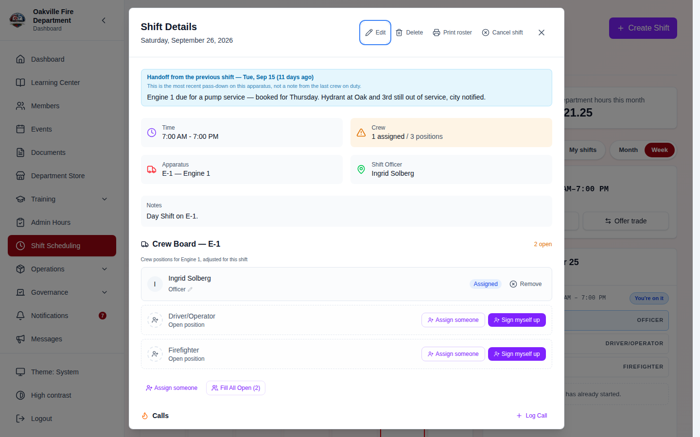

### Additional Fixes (2026-03-19)

- **Dashboard shows only relevant shifts**: My Upcoming Shifts hides declined and cancelled assignments; Open Shifts hides shifts the user already signed up for
- **Shift signup re-enrollment**: Members who previously cancelled can re-sign up (cleanup of old cancelled assignment prevents constraint violation)
- **Attendee count accuracy**: Cancelled and no-show assignments no longer inflate the displayed count
- **Timezone fixes**: Fixed naive local times being sent as UTC when creating shifts from the scheduling page; fixed template-based generation ignoring org timezone

---

## Shift Permissions & Cleanup (2026-03-23)

### Permission Model

The scheduling module uses two separate permissions for different operations:

| Permission          | Controls                                                                   | Who Needs It                      |
| ------------------- | -------------------------------------------------------------------------- | --------------------------------- |
| `scheduling.manage` | Shift CRUD (create, edit, delete shifts)                                   | Shift officers, scheduling admins |
| `scheduling.assign` | Member assignments (assign, edit positions, remove from shift, edit notes) | Shift officers, crew chiefs       |

A user with `scheduling.assign` but not `scheduling.manage` can assign members to existing shifts but cannot create or delete shifts. A user with `scheduling.manage` but not `scheduling.assign` can edit shift times and apparatus but must use the admin assignment flow to assign members.

Self-signup (the Sign Up button on open shifts) requires no special permission — all authenticated members can sign up for shifts they are eligible for.

The shift detail panel below is what somebody holding **both** permissions sees,
which is the usual case for a shift officer. The two sets are easy to tell apart
once you know where to look: `scheduling.assign` owns everything on the crew
board — the pencil beside a member's position, the ⊗ that removes them, the
**Assign** button on an open seat and **Assign Member** underneath — while
`scheduling.manage` owns only the pencil and bin in the panel's own header.
Drop either permission and that group of controls simply is not rendered.

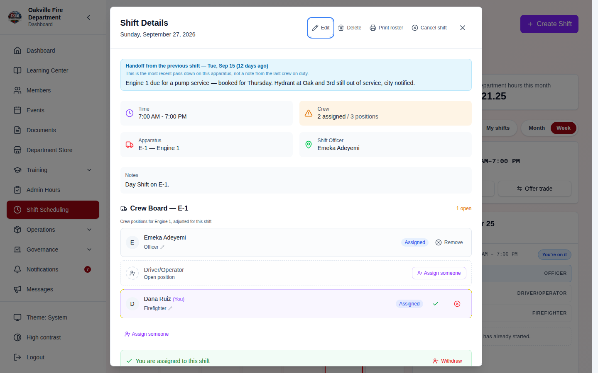

### Calls/Incidents Section

The Calls/Incidents placeholder section has been removed from the shift detail panel. This section previously displayed "Calls will appear here once the shift is underway" but there was no CAD integration to populate it. Call logging will be available once ePCR/NEMSIS import integration is implemented. Backend endpoints remain accessible at `POST /api/v1/scheduling/shifts/{id}/calls` for programmatic use.

---

## Template Positions & Timezone Fixes (2026-03-15)

### Template Positions Carry to Crew Roster

Shift templates now pass their position definitions and minimum staffing requirements through to created shifts. Previously, only the template's time and apparatus information were inherited — position assignments had to be set up manually on each shift.

When a shift is created from a template (either directly or via pattern-based
generation), the template's `positions` and `min_staffing` values are copied to
the new shift, and the crew board is built from them.

> **In practice the shift's own positions are always what you see.** The panel
> is written to prefer the linked apparatus's riding positions and fall back to
> the shift's, but the full Apparatus module does not model riding positions at
> all — it reports them as "not specified" by design. So on a department using
> the full module, the fallback is the only path, and a shift created without
> positions has no crew board at all. The board's subheading names both sources
> ("Positions from E-2 + shift customizations") regardless.

The board is pictured under
[Structured Position Slots & Decline Handling](#structured-position-slots--decline-handling),
with the "N assigned / N positions" tile beside it standing in for the minimum
staffing indicator.

### Timezone Display Fix

Two timezone display issues were corrected:

1. **Shift reports date filter**: The reports tab was comparing against UTC dates instead of the user's local date. For example, at 11 PM Eastern on March 14, the tab would show March 15 reports because UTC had already crossed midnight.

2. **Shift time editing**: When editing a shift, the start/end times displayed in the form were showing UTC values instead of local times. A shift starting at 2:30 PM Eastern appeared as 18:30 in the edit form.

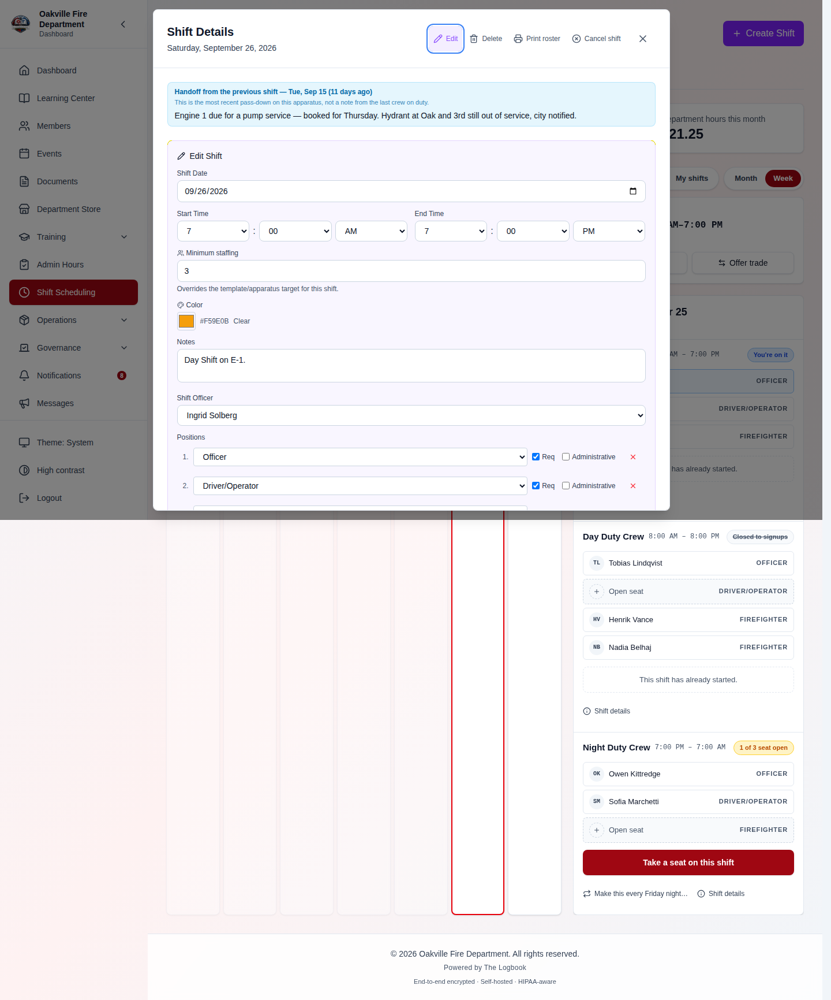

### Edge Cases

| Scenario                            | Behavior                                                                    |
| ----------------------------------- | --------------------------------------------------------------------------- |
| Shifts created before this update   | Position fields are empty; UI falls back to apparatus-level positions       |
| Template edits after shift creation | Existing shifts keep original positions; only new shifts get updated values |
| Missing timezone data               | Falls back to browser's local timezone                                      |

---

## Shift Assignment & Scheduling Edge Cases

These edge cases describe system behavior during shift assignment, time-off approval, pattern generation, and staffing calculations.

### Shift Assignment Guards

| Scenario                                    | Behavior                                                                                                                                                         |
| ------------------------------------------- | ---------------------------------------------------------------------------------------------------------------------------------------------------------------- |
| Member already assigned to this shift       | Returns "Member is already assigned to this shift." Declined and cancelled assignments are excluded from this check — members can re-sign up after cancellation. |
| Overlapping shift on same day               | System checks ±1 day for time conflicts. Returns "Member has a conflicting shift on [date]" with all conflict dates listed.                                      |
| Shift has no end time                       | Overlap detection falls back to same-day check only — any assignment on the same date is flagged.                                                                |
| Member on active Leave of Absence           | Returns "Member is on leave of absence for this date." Only the shift's date is checked, not the full time span.                                                 |
| First officer-position member assigned      | If no shift officer is set, assigning an Officer, Captain, or Lieutenant auto-sets them as shift officer. Silent — no notification.                              |
| Shift officer changed to a different member | The previous officer-position assignment is automatically downgraded to `firefighter` position. No notification is sent for this displacement.                   |
| Database integrity violation on duplicate   | A secondary `UNIQUE` constraint catches race conditions, returning the same "already assigned" message.                                                          |

### Time-Off Approval Side Effects

| Scenario                                 | Behavior                                                                                                                                                                         |
| ---------------------------------------- | -------------------------------------------------------------------------------------------------------------------------------------------------------------------------------- |
| Time-off request approved                | All conflicting shift assignments within the time-off date range are auto-cancelled. The count is appended to reviewer notes (e.g., "2 conflicting assignments auto-cancelled"). |
| Time-off request for pending status only | Only pending requests can be reviewed. Attempting to review an already-approved/denied request returns "Time-off request is no longer pending."                                  |
| Auto-cancelled assignments               | Only `assigned` and `confirmed` statuses are cancelled. Already-declined or cancelled assignments are not touched.                                                               |

### Pattern Generation

| Scenario                               | Behavior                                                                                                                                                              |
| -------------------------------------- | --------------------------------------------------------------------------------------------------------------------------------------------------------------------- |
| Weekly patterns and weekday convention | Weekly patterns use JavaScript convention (0=Sunday). Pattern configuration must use this format — Python convention (0=Monday) will produce shifts on the wrong day. |
| Overnight shifts (end before start)    | If end time < start time after UTC conversion, end datetime is automatically pushed to the next day.                                                                  |
| Platoon pattern with day/night entries | Maps to separate day/night `ShiftTemplate` records. If `day_template_id` or `night_template_id` is missing from config, falls back to the main template silently.     |
| Duplicate shift detection              | Compares against existing shifts by start time (UTC), not by date. Two templates with the same start time in different timezones could collide.                       |

### Staffing Calculations

| Scenario                            | Behavior                                                                                         |
| ----------------------------------- | ------------------------------------------------------------------------------------------------ |
| Shift has structured position slots | Understaffing is checked by matching filled positions against required slots (case-insensitive). |
| No structured positions defined     | Falls back to comparing total headcount against `min_staffing` threshold.                        |
| Cancelled and no-show assignments   | Excluded from attendee count. Only `assigned` and `confirmed` statuses count toward staffing.    |

---

## Shift Report Enhancements _(2026-04-07)_

### 1-5 Skill Scoring

When filing shift completion reports, officers can now assign a **1-5 numeric score** to each observed skill. This score is separate from the "demonstrated" checkbox and provides a quantitative assessment of the trainee's proficiency.

| Score | Default label | Colour            |
| ----- | ------------- | ----------------- |
| 1     | Needs work    | Violet (muted)    |
| 2     | Developing    | Violet (muted)    |
| 3     | Competent     | Violet (standard) |
| 4     | Proficient    | Violet (standard) |
| 5     | Excellent     | Violet (bright)   |

Those are the defaults. A department that has set **Rating Scale Labels** in
Scheduling > Settings > Shift Reports sees its own wording everywhere the scale
appears — the screenshots in this guide come from a department ending its scale
at "Exemplary".

There is no separate "demonstrated" tick: **selecting the skill is** the record
that it was demonstrated, and the score row appears underneath once you have.
Clicking a selected score again clears it, so a skill can be marked observed
without being scored. The buttons themselves are numbered, not labelled — the
label for the score you picked appears beside the row, and hovering a button
shows its label as a tooltip.

The skills section is pictured under
[Score Labels](#score-labels).

**Where the scores go.** They are stored on the report and shown in every
read-only view of it. They are _intended_ to flow through to `SkillCheckoff`
records and the competency score history in the Training module, and the code to
do it is there — but it matches skill names against `SkillEvaluation` records,
and nothing in the application creates one. See
[Skill Linkage Status in Settings](#skill-linkage-status-in-settings).

### Batch Review

Officers with `training.manage` permission can now review multiple shift reports at once:

1. Open the **Review Queue** or **Flagged** view in the Shift Reports tab
2. Tick the checkbox on each report you want, or use **Select all (N)** in the bar above the list
3. The bar then reports how many are selected and offers **Approve Selected** and, in the Review Queue, **Flag Selected**. Neither button carries the count — that is the "N selected" text beside them
4. Type a comment in the field that appears under the bar. It is applied to every selected report, and it is **required** to flag — flagging without one fails with a message rather than sending unexplained flags to trainees. Approving with one is optional
5. Click the action. There is no confirmation step and no modal: the reports are reviewed and a toast reports how many

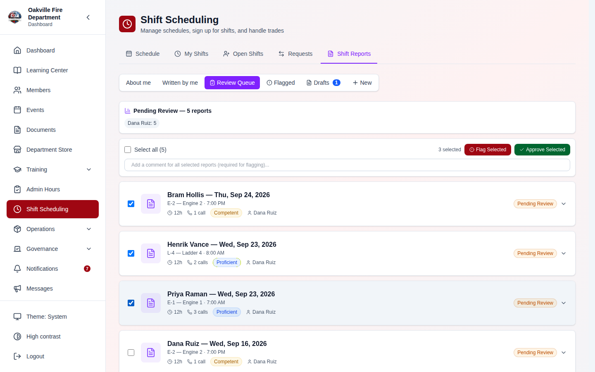

> **Hint:** Batch review does not support per-report field redaction. For reports requiring individual redaction, review them one at a time using the standard review modal.

### Flagged Reports View

Reports that reviewers flag for follow-up are now accessible from a dedicated **Flagged** tab in the Shift Reports section:

- Every flagged report, each collapsed card carrying the red **Flagged** badge, the officer who filed it and the reviewer who flagged it
- Open a card and the reason is underneath the report itself, in **Reviewer Comment — Flagged**, followed by a **Review History** listing every pass the report has been through with its date and its note
- **Re-Review Report**, at the foot of the opened card, reopens the review modal — approve to move it to Approved, or flag it again with a new note
- When a flagged report is approved, deferred pipeline progress is triggered if the report has an enrollment linkage

The reason and the re-review action are in the opened card, not on the
collapsed one: a list of flagged reports tells you _which_, not _why_.

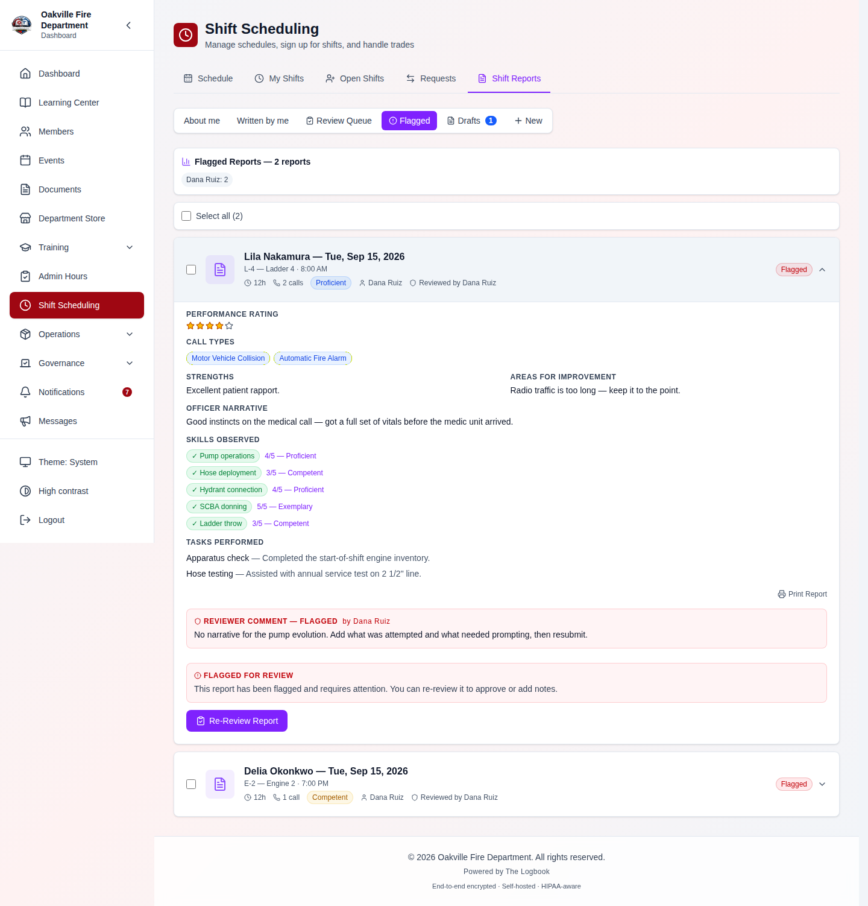

### Trainee & Officer Names on Report Cards

Report cards now display **trainee and officer names** alongside dates:

- Card header: "**Trainee Name** — Sun, Aug 9, 2026"
- The metadata row beneath it: hours, calls, the rating badge, the **officer who
  filed it**, and — once reviewed — "Reviewed by **Name**". All of it is on the
  collapsed card, so a list of reports is readable without opening any of them
- Review modal: Shows shift date alongside trainee and officer names in the header

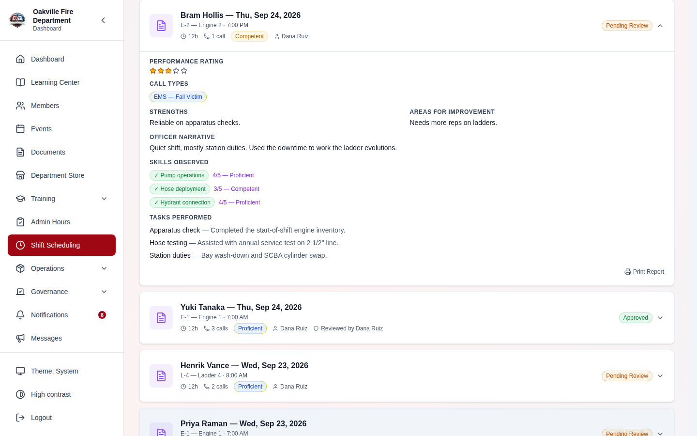

### Full Report Content in Review Modal

The review modal now displays the **complete report** so reviewers have full context when approving or flagging:

- Hours on shift, calls responded, call types
- Performance rating (with custom labels if configured)
- Areas of strength and improvement
- Officer narrative
- Skills observed (with scores and notes)
- Tasks performed (with descriptions)
- Trainee comments (if acknowledged)
- Requirements progressed (if enrollment linked)

Beneath the report are the **Redact Fields** tick-boxes — clear any field before
approving and the trainee never sees it — a **Reviewer Comment** box labelled as
visible to the filing officer and not to the trainee, and the three actions:
**Cancel**, **Flag for Revision** and **Approve**. Flagging requires a comment;
approving does not. The modal is taller than a screen, so the report content
scrolls above the controls rather than sitting beside them.

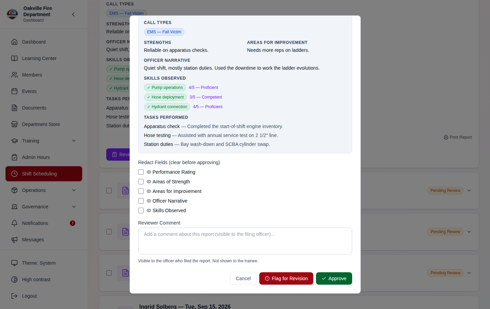

### Skill Linkage Status in Settings

The **Shift Reports** settings panel (Scheduling > Settings > Shift Reports) now shows whether each apparatus-type skill matches a formal `SkillEvaluation` record in the Training module:

- **Green tag**: Skill name matches a SkillEvaluation — scores will track competency, create checkoffs, and progress pipeline requirements
- **Amber tag**: No matching SkillEvaluation — skill is observed on reports but won't flow into formal training tracking
- A **legend** below the skills explains the two colours. It appears only once the department has at least one SkillEvaluation on file — with none, there is nothing for the colours to mean

> **Every tag reads amber today.** Nothing in the application creates a
> `SkillEvaluation`: the table is read by this indicator and by the checkoff
> writer, and written by neither, so the only way a department acquires one is
> to be provisioned from a department template that already had some. Scores
> entered on shift reports are therefore recorded on the report and go no
> further. Tracked in
> [KNOWN_LIMITATIONS.md](../KNOWN_LIMITATIONS.md); the screenshot is held back
> until there is a mixed state to picture rather than a column of amber.

### Edge Cases

| Scenario                                   | Behavior                                                                                                                                        |
| ------------------------------------------ | ----------------------------------------------------------------------------------------------------------------------------------------------- |
| Skill score outside 1-5 range via API      | Rejected by Pydantic `Field(ge=1, le=5)` with 422 error                                                                                         |
| Batch review with >100 report IDs          | Rejected by `max_length=100` constraint                                                                                                         |
| Batch review with mix of valid/invalid IDs | Valid reports processed; `failed` count returned separately                                                                                     |
| Flagged report re-approved                 | Triggers deferred pipeline progress if enrollment linked                                                                                        |
| Skill name matching for linkage            | Case-insensitive exact match against `SkillEvaluation.name` — "Pump Operations" and "pump operations" are the same skill, but "Pump ops" is not |
| No SkillEvaluation records in org          | All apparatus-type skills show amber "unlinked" tags, and the legend is not rendered                                                            |

---

## Troubleshooting

| Issue                                                                                     | Solution                                                                                                                                                                                                               |
| ----------------------------------------------------------------------------------------- | ---------------------------------------------------------------------------------------------------------------------------------------------------------------------------------------------------------------------- |
| Cannot sign up for an open shift                                                          | Check that you are logged in as an active member and the shift has not already been filled.                                                                                                                            |
| Shift assignment shows "Member is on leave"                                               | The member has an active leave of absence covering the shift date. The leave must be deactivated before assigning.                                                                                                     |
| Attendance hours not calculating                                                          | Ensure both check-in and check-out times are recorded. Duration is calculated automatically.                                                                                                                           |
| Generated shifts not appearing on calendar                                                | Check the date range filter on the calendar. Generated shifts appear for the pattern's date range.                                                                                                                     |
| Swap request stuck in pending                                                             | Both the other member and an officer must act. Check with the other member first, then the reviewing officer.                                                                                                          |
| Compliance report shows incorrect hours                                                   | Verify that attendance records have accurate check-in/out times. Only shifts with recorded attendance count.                                                                                                           |
| Platoon rotation seems off by a day                                                       | Check the "Starting Platoon" setting when generating the pattern. If the wrong platoon is set for day 1, the entire rotation shifts.                                                                                   |
| Minimum staffing warning on a fully staffed shift                                         | Verify all assigned members have confirmed their assignment. Pending assignments may not count toward the staffing total depending on your department's settings.                                                      |
| Shift hours not appearing in Training compliance                                          | Attendance must be recorded (check-in and check-out). Shifts without attendance data contribute zero hours to training requirements.                                                                                   |
| Scheduling data not updating across tabs                                                  | The module uses a centralized Zustand store. Try refreshing the page. If the issue persists, clear browser cache.                                                                                                      |
| Settings tab not showing                                                                  | The Settings tab requires `scheduling.manage` permission. Contact your administrator.                                                                                                                                  |
| Clicking a tab snaps straight back to Schedule                                            | Fixed 2026-08-09. Every tab except Schedule could previously only be reached by a direct link — the click selected the tab and the page immediately reset it. Tab clicks now also update the address bar. Pull latest. |
| Pressing Save on Notifications or Shift Reports said "Settings saved" but changed nothing | Fixed 2026-08-09. Those sections were showing the page-level Save footer, which only ever saved three other sections. Each section now has its own save control and the footer appears only where it applies.          |
| A saved link to a scheduling settings section opens the wrong section                     | Fixed 2026-08-09 — the section is now written into the address bar when you select it, so links, refresh and the back button all land where you expect.                                                                |
| "Too many attempts" on shift signup                                                       | Rate limiting may be active. Wait a few seconds and try again.                                                                                                                                                         |
| Cannot edit shift times after creation                                                    | Officers with `scheduling.manage` can now edit shift start/end times, apparatus, color, notes, and custom creation times from the shift detail panel.                                                                  |
| Position change requires opening a modal                                                  | Use the new inline position change UI directly on the shift card to change a member's assigned position without navigating away.                                                                                       |
| Shift signup shows no positions                                                           | Your rank may not have eligible positions configured, or your membership type may be excluded from self-signup. Check both Settings > Ranks and Scheduling > Settings > Eligibility.                                   |
| Dashboard still shows cancelled shifts                                                    | Fixed 2026-03-19 — declined and cancelled assignments are now filtered from "My Upcoming Shifts". Pull latest.                                                                                                         |
| Sign Up button not appearing for open shifts                                              | Your rank may not be eligible for the remaining open positions. Check with your administrator.                                                                                                                         |
| Can see assignment controls but get 403 error                                             | The shift detail panel now uses separate permissions: `scheduling.manage` for shift editing and `scheduling.assign` for member assignments. Ask your administrator to grant the appropriate permission.                |
| Self-signup form missing on shift detail                                                  | Fixed 2026-03-23 — the self-signup form on non-apparatus shifts is no longer hidden behind a permission gate. All members can self-sign up for open shifts.                                                            |
| "Calls/Incidents" section missing from shift detail                                       | Removed 2026-03-23 — the placeholder section was removed because there is no CAD integration to populate it. Call data will appear once ePCR/NEMSIS integration is implemented.                                        |
| Equipment check template not appearing for shift                                          | Template must be assigned to the shift's apparatus (or apparatus type) and your position must match the template's assigned positions.                                                                                 |
| Equipment check shows auto-fail on a working item                                         | Check the item's expiration date — items past their expiration auto-fail regardless of submitted result.                                                                                                               |
| Apparatus shows deficiency badge but check passed                                         | A subsequent full check must pass ALL items to clear the deficiency flag. Partial checks don't clear it.                                                                                                               |
| Equipment check photo won't upload                                                        | Photos must be JPEG, PNG, or WebP and under 10 MB. Max 3 photos per item.                                                                                                                                              |
| Equipment check reports showing no data                                                   | Ensure at least one equipment check has been submitted. Check the date range filter.                                                                                                                                   |
| Shift times showing in wrong timezone                                                     | Fixed 2026-03-19 — shift creation now converts local times to UTC using org timezone. Template-generated shifts also inherit correct timezone.                                                                         |
| Cannot assign members to shifts                                                           | Fixed 2026-03-22 — assignment UI was gated by `scheduling.manage_assignments`; now works with `scheduling.manage`.                                                                                                     |
| Sign Up button not appearing despite eligible rank                                        | Fixed 2026-03-22 — Open Shifts tab fallback permission and self-signup visibility corrected.                                                                                                                           |
| Dashboard shows cancelled/declined shifts                                                 | Fixed 2026-03-22 — "My Upcoming Shifts" now filters out declined and cancelled assignments.                                                                                                                            |
| Barcode/QR scan not working on desktop                                                    | Fixed 2026-03-22 — scanning now falls back to user-facing camera on desktop browsers.                                                                                                                                  |

---

## Permission Fixes & Shift Signup Improvements (2026-03-22)

### Shift Assignment Permission Update

The shift assignment UI previously required the `scheduling.manage_assignments` permission, which was more restrictive than intended. As of 2026-03-22, users with the broader `scheduling.manage` permission can assign members to shifts.

There is no button called "Add Assignment": the control is **Assign someone**,
on each open seat of the crew board (its narrow-screen label is just
**Assign**). It opens the assignment form, which asks for the position first
and defaults it to the seat you pressed it on.

The member list is not filtered by who is qualified for that seat — it excludes
only members who are unavailable for the shift at all (on leave, or already
committed to a conflicting one). Put somebody in a driver's seat without the
EVOC level the apparatus requires and the assignment is still created; what you
get is a warning toast afterwards, alongside any overtime warning. The list is
long on a large roster, so the search box above it filters by name.

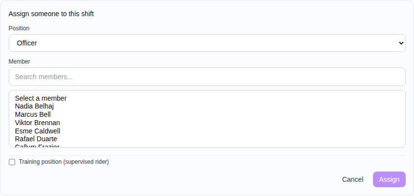

### Open Shifts Self-Signup Fix

The self-signup button visibility on the Open Shifts tab had a fallback permission issue where non-admin members couldn't see the Sign Up button even when their rank was eligible. This has been corrected.

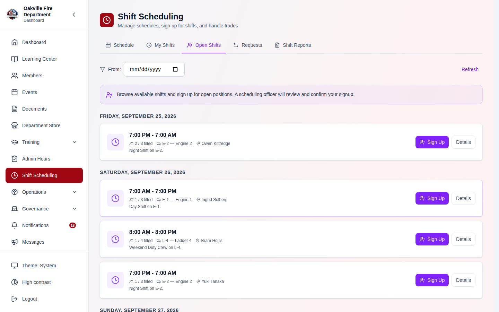

### Dashboard Shift Display

The dashboard's shift panels were merged into a single **Next 7 Days**
timeline: your own shifts (marked **Yours**), open slots you can sign up for,
and upcoming events in one seven-day list, with a line noting how much more
lies beyond the window. The old "My Upcoming Shifts" filtering rules carry
over — declined and cancelled assignments do not appear:

- Declined assignments (shifts you said "no" to)
- Cancelled assignments (shifts that were cancelled after you were assigned)

Only pending and confirmed assignments appear.

The timeline does not distinguish the two: there is no status badge on a
dashboard row, only the time, the shift officer and the staffing. Which of
your shifts are still awaiting your confirmation is a question for **My
Shifts**, where each card carries its badge and the bulk Confirm All /
Decline All bar sits above them. What the dashboard promises is narrower —
that everything marked Yours is a shift you are still on.

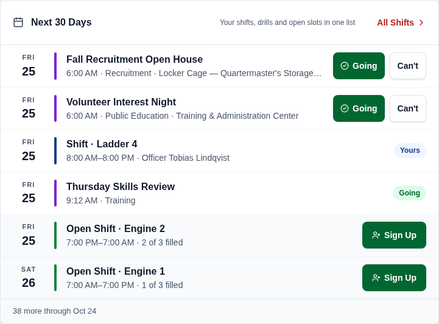

### Desktop Camera Scanning

Camera-based scanning (QR codes, barcodes, member IDs) now works on desktop browsers. The system automatically detects available cameras and falls back to a user-facing camera when no environment-facing camera is detected.

This affects:

- **MemberIdScannerModal** — scanning member ID cards during inventory checkout
- **InventoryScanModal** — scanning item barcodes for check-in/check-out
- **MemberScanPage** — scanning member QR codes for attendance

> **No screenshot — the harness has no camera _(2026-08-12)_.** These shots need a live viewfinder with a code actually being recognised; the capture automation runs headless with no camera device, and a synthetic video stream produces a test pattern rather than a scannable code. The feature works — only the automated screenshot is impossible. See [KNOWN_LIMITATIONS.md](../KNOWN_LIMITATIONS.md#screenshot-harness--camera-viewfinders-cannot-be-photographed-2026-08-12).

### Edge Cases (2026-03-22)

| Scenario                                   | Behavior                                                  |
| ------------------------------------------ | --------------------------------------------------------- |
| Desktop with no camera                     | Scanner shows error message; manual entry still available |
| Desktop with only webcam                   | Falls back to user-facing camera automatically            |
| Multiple cameras on desktop                | Prefers environment-facing, then user-facing              |
| Shift detail panel Calls/Incidents section | Removed — feature not yet implemented                     |

---

## Bulk Actions, Staffing Visualization & Shift Notifications (2026-03-24)

### Bulk Confirm/Decline on My Shifts

When you have 2 or more pending shift assignments, checkboxes appear on each pending shift card. You can:

1. **Select individual shifts** by tapping checkboxes
2. **Select All** using the toggle at the top of the pending section
3. **Confirm All** or **Decline All** using the bulk action buttons

The UI updates immediately (optimistic update). If the API call fails for any shift, that shift reverts to its previous state and a toast notification shows the error.

Only assignments still awaiting an answer carry a checkbox. Once confirmed, a
card shows a green **Confirmed** badge and drops out of the selection entirely,
so the count in the bar always matches what is still outstanding.

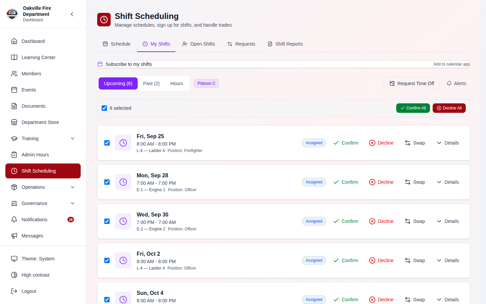

> **Edge case:** If you select 5 shifts and "Confirm All" but one fails (e.g., shift was cancelled by an officer), that one reverts to pending while the other 4 remain confirmed.

### Inline Approve/Deny on Requests

Swap and time-off request cards now show **Approve** and **Deny** buttons directly on the card, without needing to open a modal. A "+ Notes" link is still available to open the review modal if you want to add reviewer comments.

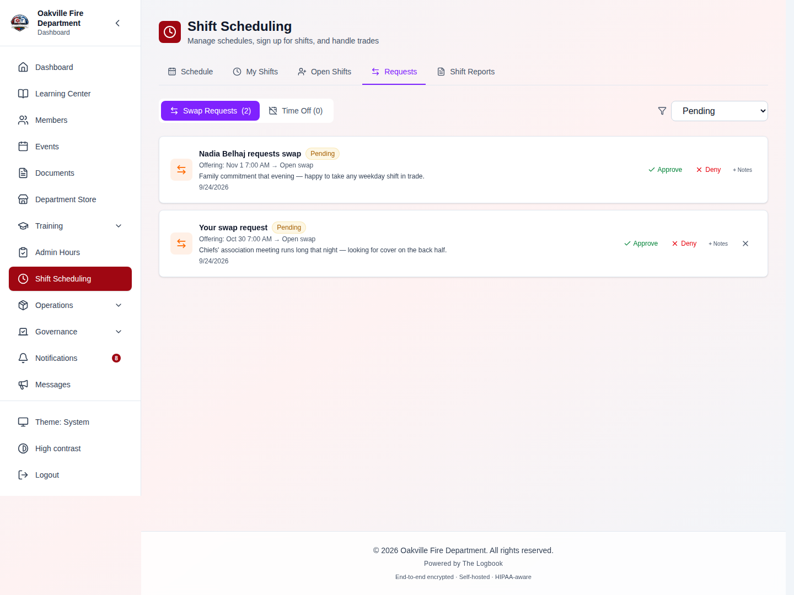

### Staffing Status on Shift Cards

Shift cards now show staffing status at a glance:

| Visual                        | Meaning                                     |
| ----------------------------- | ------------------------------------------- |
| Green CheckCircle2 icon       | Shift is fully staffed                      |
| Green background in crew info | All positions filled                        |
| Amber background in crew info | Below minimum staffing                      |
| Staffing ratio (e.g., "4/4")  | Filled / required positions                 |
| Green tint on shift card      | Overrides template color when fully staffed |
| Amber tint on shift card      | Overrides template color when understaffed  |

A shift with no minimum staffing configured keeps its template colour and
shows no ratio at all — there is nothing to measure it against.

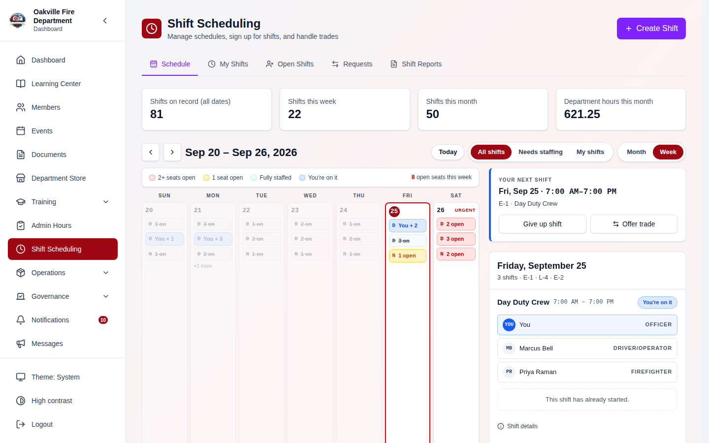

### Position-First Assignment Flow

The crew board in the shift detail panel now uses a position-first workflow:

1. **Position dropdown** appears first (defaults to the first open slot)
2. **Member search** appears below
3. Click **Assign** to complete

You can also click the **"Assign"** button directly on an open slot in the crew board to pre-fill the position.

**Bulk Assignment:** When more than one position is unfilled, a **Fill All
Open** button appears at the foot of the board, next to **Assign Member**, with
the open count on it. It shows a compact form with one member dropdown per open
position, letting you fill them all at once.

> **Corrected 2026-08-10.** The screenshot this section used to ask for —
> two filled positions, _one_ open slot, and the Fill All Open button — cannot
> exist: the button only renders while two or more slots are open. The board is
> pictured under
> [Structured Position Slots & Decline Handling](#structured-position-slots--decline-handling)
> instead.

> **Edge case:** Members on leave, with approved time-off covering the shift date, or already assigned to the shift are automatically excluded from the member dropdown.

### Required/Optional Position Toggle

Open **Scheduling > Templates** and click **New Template** (or edit an
existing one). Under **Crew Positions**, each row is a position dropdown with
a badge beside it. The badge is the control: **click it to flip the position
between required and optional.**

- **Required** (violet badge) — the position must be filled for minimum staffing
- **Optional** (muted badge) — position is available but not counted toward minimum staffing

The dropdown offers Officer, Driver/Operator, Firefighter, EMT, Probationary,
Volunteer and Other, plus any custom positions your department has configured.
**Add Position** adds a row, and the − removes one.

> **Corrected 2026-08-10.** There is no toggle switch — the badge itself is
> the button, and its label is its state. The in-app helper text said "Toggle
> the switch to mark a position as optional" and has been corrected too. Note
> also that the driver position is labelled **Driver/Operator**.

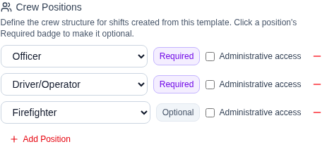

> **Edge case:** Existing templates with bare string positions (created before this update) default to `required=true` automatically.

### Shift Assignment Notifications

When an officer assigns you to a shift, you now receive:

- **In-app notification** with the shift date, time (in your organization's timezone), and position
- **Optional email notification** (if enabled by your department)

Officers can configure these in **Settings > Scheduling > Notifications > Shift Assignment Alerts**.

There is no CC-recipient field. Email is a single **Also send email
notification** checkbox alongside the in-app notification, and who receives it
is decided by the alert's own role chips, not by an address typed in here.

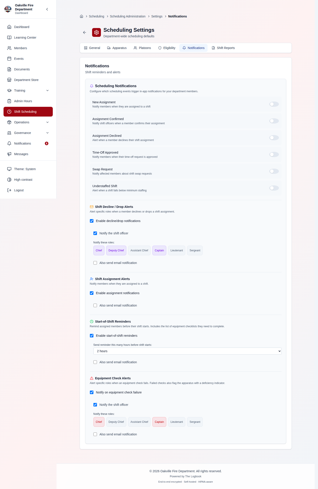

### Start-of-Shift Reminders

A scheduled task runs every 30 minutes to send reminders to members assigned to upcoming shifts:

- Reminders include the shift time, position, apparatus, and a list of equipment checklists to complete
- Configurable lookahead window (default: 2 hours before shift start)
- Optional email in addition to in-app notification

Department settings for reminders are under **Settings > Scheduling > Notifications > Start-of-Shift Reminders**.

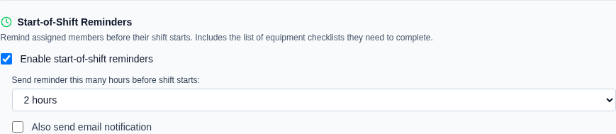

> **Edge case:** A shift that has already started is skipped. Reminders are sent only once per shift (tracked via `activities.start_reminder_sent`).

### Selected Shift Highlight

When you open a shift's detail panel, the corresponding shift card on the calendar is highlighted with a **violet ring**. This helps you see which shift you're viewing, especially in dense calendar views.

### Additional UX Improvements (2026-03-24)

- **Collapsible shift creation**: The shift creation form now shows only Start Date and End Date initially. Custom Times, Apparatus, Officer, and Notes are hidden behind an "Additional Options" disclosure section
- **Searchable template dropdown**: When your department has more than 5 templates, a search field appears in the template dropdown
- **Open/Specific swap selector**: Two-card radio buttons instead of a single dropdown for selecting swap type
- **Time-off conflict warning**: An amber banner appears on the shift detail if you have approved time-off covering the shift dates
- **Notification history link**: An "Alerts" link on the My Shifts tab shows your scheduling-related notifications
- **Equipment check status**: Badge counts (pass/fail/in-progress/pending) appear next to the equipment check header on shift detail, with action hints like "Start check → Go to Checklists tab"
- **Mobile note truncation**: Shift notes on calendar cards show 2 lines with ellipsis instead of 1 line
- **Mobile touch targets**: All action buttons increased to 44px minimum (WCAG standard)

### Bug Fixes (2026-03-24)

| Issue                                                                                        | Solution                                                                      |
| -------------------------------------------------------------------------------------------- | ----------------------------------------------------------------------------- |
| Shift overlap false positive — night shift flagged as conflicting with next day's open shift | Open-ended shifts now restricted to same date; no cross-day false positives   |
| Shift notifications showing UTC time (e.g., "22:00" instead of "18:00 Eastern")              | Times converted to org timezone before formatting                             |
| All shifts appearing as indigo on calendar despite custom template colors                    | Color parsing fixed — extracts hour from time portion, not full ISO string    |
| Clearing shift notes causes 422 error                                                        | Empty notes converted to `undefined` via `\|\|` instead of `??`               |
| "Fill pattern" 422 error on shift generation                                                 | Removed redundant `pattern_id` from request body                              |
| Member hours report showing empty data                                                       | Now queries `ShiftAssignment` instead of `ShiftAttendance` (clock-in records) |
| Member hours report missing names                                                            | `first_name` and `last_name` added to report schema                           |
| Dark mode buttons hard to read                                                               | Added proper `dark:` color variants on all interactive elements               |
| Shift card text unreadable against colored background in dark mode                           | WCAG AA contrast calculation dynamically adjusts text color                   |

---

## Notification Cards, Deep-Linking & Standalone Equipment Checks (2026-03-26)

### Expandable Notification Cards

Shift-related notifications now use expandable cards that show a summary preview when collapsed and full details when expanded. Key behaviors:

- **Pinned-first sorting**: Pinned notifications always appear at the top of the list
- **Mark as read on collapse**: Notifications are only marked as read when you collapse the card, not when you first open it — this prevents accidental mark-as-read from quick glances
- **Contextual action buttons**: An expanded card ends with an action button for
  that notification's destination, then **Pin** (or **Unpin**). A shift
  notification offers "View Shift"; a shift reminder opened inside its
  equipment-check window adds a second button, **Start Checklist**; a post-shift
  validation notice adds **File Report**

A **collapsed** card is summary only — subject, one line of message, the time,
and a pin marker if it is pinned. The buttons live inside the expanded panel, so
you have to open a card to act on it.

A shift reminder carries the shift's full briefing: your crew for the shift by
position, the apparatus, and the start-of-shift checklists assigned to it (or a
line saying there are none).

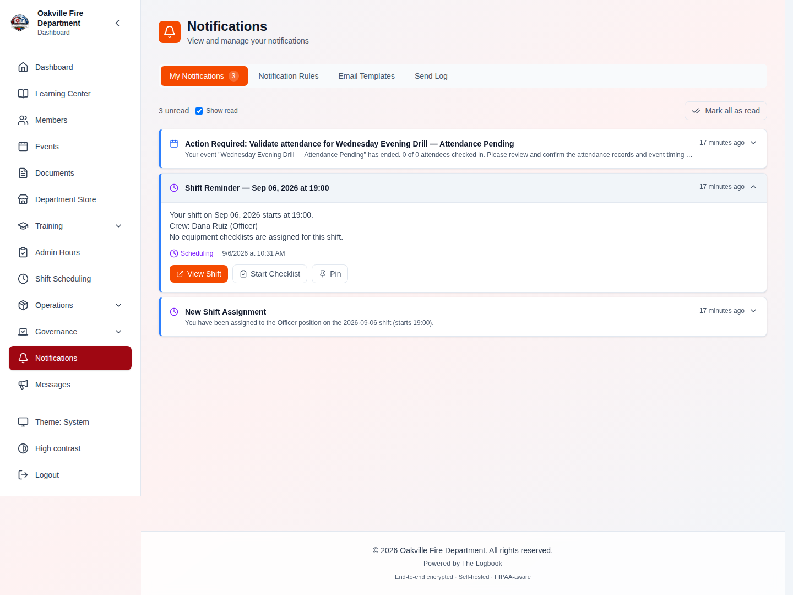

### Scheduling Page Deep-Linking

The scheduling page now supports `?tab=` query parameters for direct navigation to specific tabs:

| Parameter               | Tab                 |
| ----------------------- | ------------------- |
| `?tab=schedule`         | Schedule (calendar) |
| `?tab=my-shifts`        | My Shifts           |
| `?tab=open-shifts`      | Open Shifts         |
| `?tab=requests`         | Requests            |
| `?tab=equipment-checks` | Equipment Checks    |
| `?tab=shift-reports`    | Shift Reports       |

Shift notifications automatically deep-link to the correct tab. For example, clicking a shift assignment notification opens the scheduling page with My Shifts selected and the shift highlighted.

> **Corrected 2026-08-12.** `?tab=shift-reports` was missing from the table
> above; the page has six tabs, not five. The screenshot placeholder here asked
> for the **browser URL bar** alongside the selected tab — nothing the
> application draws, and so nothing a screenshot of it can show. The tab it
> lands on is already pictured under
> [Standalone Equipment Checks](#standalone-equipment-checks) directly below.

### Standalone Equipment Checks

Equipment checks are no longer tied exclusively to active shifts. Members can now perform ad-hoc checks on any apparatus at any time:

1. Navigate to **Scheduling > Equipment Checks** tab
2. Select the apparatus to check
3. Complete the checklist as normal
4. Submit — the check is saved without a shift association and appears in reports as "ad hoc"

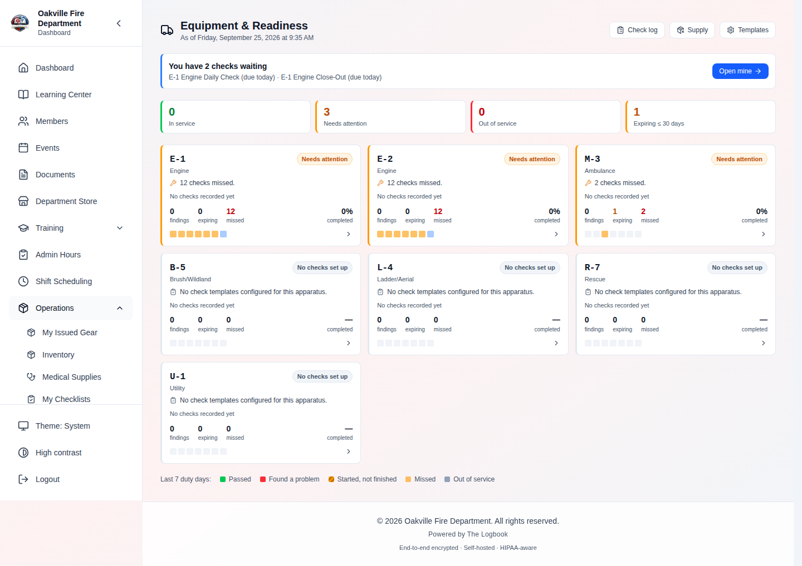

### Flat Scrollable Check Form

The equipment check form has been redesigned from a tabbed compartment view to a single flat scrollable page:

- All compartments are displayed inline with clear section headers
- Sub-compartments are merged under their parent compartment heading
- Section headers appear as bold labels for visual grouping — they have no pass/fail controls, and neither the compartment's `n/m checked` nor the header's progress counter includes them

> **Corrected 2026-08-12.** A section header was described as "items with
> `is_header: true`". `is_header` is a **compartment**-level flag; on an item it
> is write-only — the item response schema does not carry it, and the check form
> switches on `check_type: "header"`. Set that, not `is_header`, when building a
> template through the API.

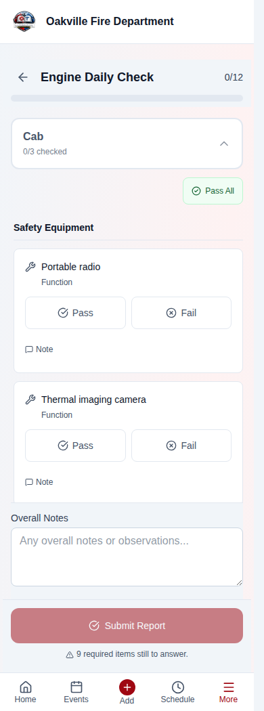

### Text Check Type

The "Text" check type has been changed from a free-form text input to a read-only statement display. This is used for instructional text or safety reminders within checklists:

- The text appears as a styled statement in the check form
- Members read it but do not need to enter any response
- Text items are not included in pass/fail scoring

Example: "Verify all compartment doors are secure before moving apparatus"

### Critical Minimum Quantity

Quantity-type check items now support a `critical_minimum_quantity` threshold:

- When the count falls below this value, the item is flagged as **critical** (red warning) even if above the required minimum
- Useful for items where a certain threshold triggers a restock alert (e.g., "4 SCBA bottles required, critical if below 2")

> **Edge case:** Critical minimum must be ≤ required minimum. Validation enforced when saving the template.

### In-Process Scheduled Task Runner

The backend now includes a built-in asyncio task runner in `main.py` that handles:

- Start-of-shift reminders (30-minute intervals)
- Notification cleanup
- Other periodic maintenance tasks

This replaces the need for external cron jobs. Tasks resume automatically on container restart with idempotent checks to prevent duplicate sends.

### Edge Cases (2026-03-26)

| Scenario                                 | Behavior                                                        |
| ---------------------------------------- | --------------------------------------------------------------- |
| Notification with no metadata            | Card renders in basic mode without deep-link buttons            |
| `?tab=invalid-name` in URL               | Falls back to Schedule (calendar) tab                           |
| Standalone check with no shift           | Saved as "ad hoc"; included in compliance reports               |
| Section header in check scoring          | Not scored — excluded from pass/fail calculations               |
| Template clone with section headers      | Headers and critical_minimum_quantity preserved                 |
| App restart during scheduled task window | Tasks resume; idempotent checks prevent duplicate notifications |

---

## EVOC Certification & Position Validation (2026-03-24)

### EVOC Certification Levels

EVOC (Emergency Vehicle Operations Course) certification levels are now integrated across training, apparatus, and scheduling:

1. **Operator records** carry a member's EVOC level, one per apparatus, on the
   rig's **Operators** tab — not on the member's profile. The levels
   themselves are configured per organization rather than fixed. See
   [Membership → EVOC Certification](./01-membership.md#evoc-certification)
2. **Apparatus records** specify the EVOC level required to drive that rig
3. **Scheduling** checks the two against each other when assigning a member to
   a driver/operator position

When assigning a member to a Driver/Operator position, the system takes the
highest level from the member's **current** operator records — active,
certified and not past their expiration — and compares it against the
apparatus's requirement. A member who falls short, or has no EVOC record at
all, produces a warning naming the required level; the assignment is not
blocked. An apparatus with no required level never warns.

> **Corrected 2026-08-10.** This said member profiles track an EVOC level of
> Basic, Intermediate or Advanced. No profile has such a field, and those
> three names are the demo department's configured levels rather than the
> system's.

**Setting the requirement.** Edit the apparatus (**Operations > Apparatus >**
_a rig_ **> Edit**) and choose from **Required EVOC Level**. The control is on
the edit form rather than the detail page, and it only appears once your
organization has EVOC levels configured.

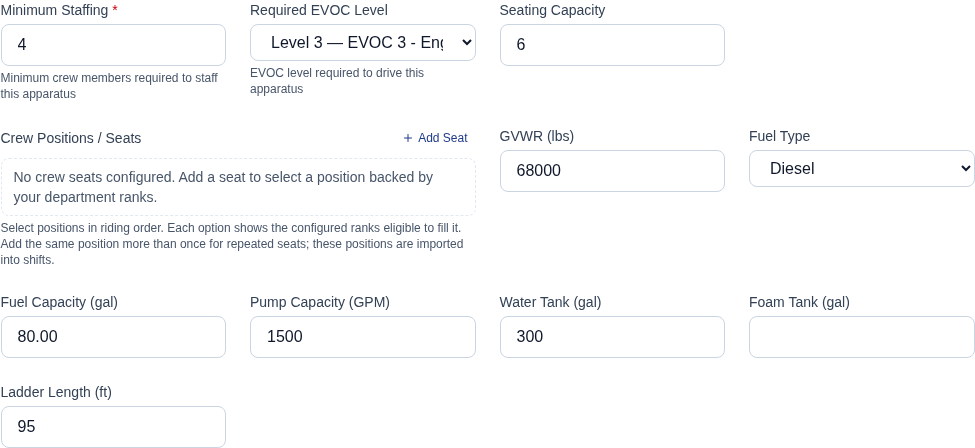

### Edge Cases

| Scenario                               | Behavior                                             |
| -------------------------------------- | ---------------------------------------------------- |
| EVOC not set for member                | Can be assigned to driver position but warning shown |
| Apparatus with no required EVOC level  | No validation on driver assignments                  |
| Member with expired EVOC certification | Warning shown; assignment still allowed              |

---

## Shift Report Creation Redesign — Shift-First Batch Workflow (2026-04-07)

The shift report creation flow has been completely redesigned. Instead of creating one report at a time per trainee, officers now use a **shift-first batch workflow** that processes the entire crew at once.

### How It Works

1. Go to **Shift Reports** and click **New**
2. **Pick a shift.** The picker is a scrollable list of cards for the last fortnight, each naming the rig, the date, and how many members, calls and hours it carried — not a dropdown. Choosing one loads the crew and fills the shared fields from the shift itself
3. Check the **shared data**: hours on shift, calls responded and call types come from the shift and apply to everybody on it. Hours is the one required field. There is also an **Overall Shift Narrative** for observations about the shift rather than about a person
4. Each **trainee** on the crew has an **Evaluate** control that opens their panel:
   - Individual remarks
   - Performance rating, on the department's labelled scale
   - Areas of strength and areas for improvement
   - Skills observed, each with a 1-5 score
   - Tasks performed
5. **Non-trainees** (members with no active training-programme enrolment) appear in the crew list with a remarks box and nothing else — they receive hours and calls credit, and no evaluation
6. Untick anybody who was not actually on the shift; the button counts what is left. **Submit Reports (N)** files them all, or **Save as Draft** keeps them in the Drafts view

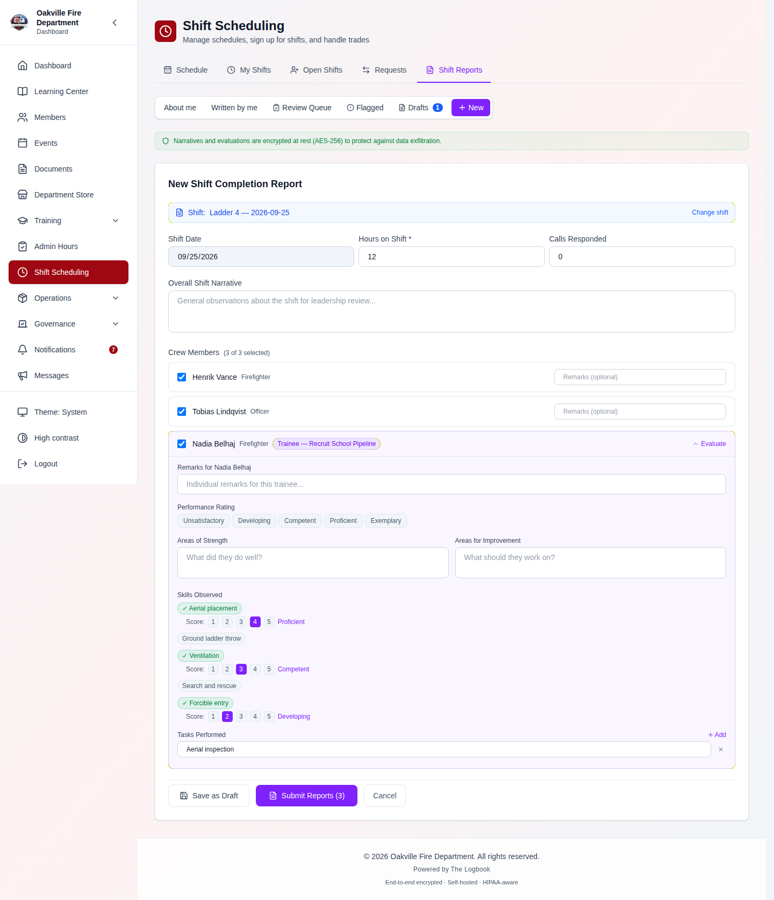

Submitting reports a count in a toast: how many were created. Crew who already
have a report for that shift are skipped rather than duplicated, and the skipped
count comes back from the API — though the toast shows only the number created.

### Task Defaults Pre-Population

There is no Add Task dialog. **+ Add**, at the right of the Tasks Performed
heading, appends a task row with its name already filled in from the
apparatus-type task mapping configured in **Scheduling > Settings > Shift
Reports** — the first entry for that rig class that is not already on the
report. Add a second and you get the next one down. The name is an ordinary text
field, so overwriting it is how you record something the mapping does not list;
nothing is offered as a separate "custom" option.

The same mapping drives the **Skills Observed** list: a ladder crew is asked
about aerial placement and forcible entry, a medic crew about patient assessment
and airway management. Where a rig class has no mapping the department-wide
defaults are used instead.

The pre-filled row is visible at the foot of the evaluation panel in the
screenshot above — "Aerial inspection", the first task in this department's
ladder mapping.

> **This did not work before 2026-08-10.** The form keys both lists on the
> shift's apparatus type, which the API computed but the shift response schema
> did not carry, so the value reached the browser as undefined on every shift in
> every department. Both lists silently fell back to the department-wide
> defaults and **+ Add** appended a blank row. Configuring the mappings had no
> visible effect. Pull latest.

### Score Labels

Selecting a skill reveals a **Score:** row of five numbered buttons beneath it.
The buttons are numbered rather than labelled — the label for the score you pick
appears beside the row, and hovering a button shows its label as a tooltip. The
wording is the department's own if it has set Rating Scale Labels, and the
defaults otherwise:

| Score | Default label |
| ----- | ------------- |
| 1     | Needs work    |
| 2     | Developing    |
| 3     | Competent     |
| 4     | Proficient    |
| 5     | Excellent     |

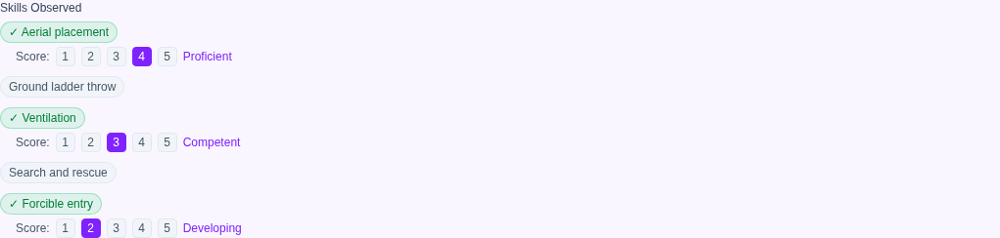

### Review Workflow Improvements

- **Require reason when flagging**: When flagging a report, the modal now requires entering a reason before submission. The "Flag" button is disabled until text is entered. This ensures trainees always receive feedback when a report is flagged
- **Reviewer name displayed**: Report cards carry "Reviewed by _Name_" in the metadata row beneath the trainee's name, beside the hours, calls and rating
- **Flagged report explanation**: Flagged reports show the reviewer's reason and a "Re-Review Report" action in all view modes — not just in the dedicated Flagged tab. Both are inside the opened card
- **Actual server error messages**: Toast notifications now display the server's error message instead of generic text like "Failed to submit", improving troubleshooting

The card is pictured under
[Flagged Reports View](#flagged-reports-view). The badge is red rather than
orange; orange is the ageing indicator that appears beside it once a report has
sat unreviewed for three days.

### Edge Cases

| Scenario                                           | Behavior                                                |
| -------------------------------------------------- | ------------------------------------------------------- |
| Batch create with mix of trainees and non-trainees | Non-trainees get hours/calls only; no evaluation data   |
| Reports already exist for some crew                | Existing reports skipped; `skipped` count returned      |
| All sections toggled off in settings               | Only core fields (trainee, shift, hours, calls) on form |
| Task defaults after apparatus type change          | Defaults update to match the new apparatus type         |
| Flagging without entering a reason                 | Modal blocks submission until text is provided          |

---

## Shift Report Offline Support (2026-04-08)

### Draft Auto-Save

When filling out a shift report, your form data is **automatically saved to local storage** as you work. This prevents data loss from:

- Connectivity drops during field operations
- Accidental browser tab closure or page navigation
- Browser crashes or device restarts

The auto-save stores your shift selection, all form fields, crew selections, individual trainee evaluations, and crew remarks. Up to 20 drafts are retained — when the limit is reached, the oldest draft is evicted.

When you return to the shift reports form, any existing draft for the selected shift is automatically loaded, so you can pick up where you left off.

### Offline Submission Queue

If your device loses connectivity while submitting a batch of shift reports, the reports are **queued locally** and automatically submitted when connectivity returns:

1. You click "Submit All" while offline
2. A toast notification confirms the reports have been queued
3. When connectivity returns, queued reports are submitted automatically in order
4. A notification confirms successful submission

This uses the same IndexedDB-backed architecture as the equipment check offline queue, ensuring reliable offline-to-online synchronization.

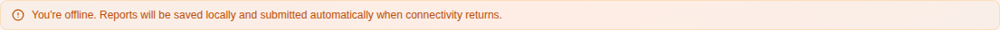

There is no per-report "queued" badge — queued reports live in IndexedDB and are
not listed individually. What the screen shows is the banner above, carrying
`(N pending)` once something is queued, and a second banner reading "Syncing N
queued reports…" while the queue drains after connectivity returns.

### Edge Cases

| Scenario                                  | Behavior                                                   |
| ----------------------------------------- | ---------------------------------------------------------- |
| Browser closed with unsaved form          | Auto-saved draft restored on next visit                    |
| 21st draft saved                          | Oldest draft evicted (LRU policy)                          |
| Connectivity restored with queued reports | Queue drains automatically; no duplicates                  |
| Same shift submitted online and offline   | Duplicate detection on the server; skipped reports counted |

---

## Shift Report Print Page (2026-04-08)

A new **print-formatted page** renders shift completion reports for paper output at `/scheduling/shift-reports/print`.

### What's Included on the Printed Report

- **Header**: "Shift Completion Report", the report's id, the date it was filed,
  and its review status. The sheet is not branded — no department name and no
  logo; the department's identity is on the covering paperwork, not here
- **Shift information**: The shift date. Start and end times, apparatus and
  station are not printed
- **Personnel**: The member and the filing officer, by name. Ranks are not
  printed
- **Performance data**: Hours on shift, calls responded, call types, and the
  rating as a bare "3 / 5" — the descriptive label is not printed alongside it
- **Assessment**: Areas of strength, areas for improvement, officer narrative
- **Skills observed**: A table of skill, score out of five, and the officer's
  comment on each
- **Tasks performed**: A table of task and description
- **Reviewer information** (if reviewed): "Reviewed by _Name_ on _date_" beneath
  the signature block
- **Signature lines**: One for the filing officer and one for the member, the
  latter headed "Member Acknowledgment" and marked pending until they
  acknowledge the report in the app

The page is formatted for **letter-size (8.5" × 11")** printing and automatically opens the browser's print dialog after loading.

### How to Print a Report

1. Go to **Shift Reports** and find the report you want to print
2. Open its card and click **Print Report**, at the foot of the opened card —
   there is no print control on the collapsed one
3. The print page opens with the formatted sheet
4. Your browser's print dialog opens by itself a moment later — choose your
   printer and print. The application's navigation is on screen around the
   sheet but is dropped from the printed page

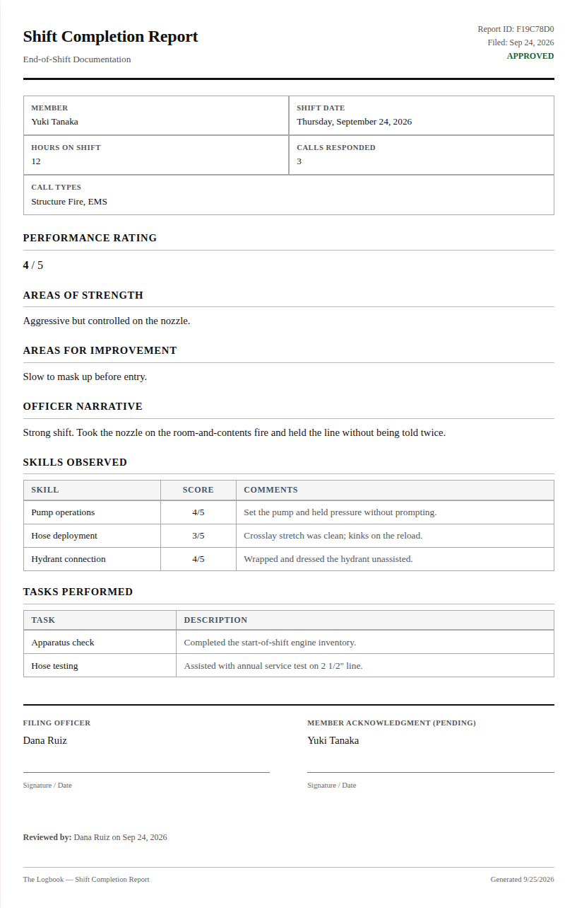

### Edge Cases

| Scenario                              | Behavior                               |
| ------------------------------------- | -------------------------------------- |
| Report with redacted fields           | Printed as "[Redacted]"                |
| Report with all optional sections off | Only core fields printed               |
| Browser blocks auto-print dialog      | Page remains visible for manual Ctrl+P |

---

## Equipment Check Improvements (2026-04-07)

### Incomplete Checklist Warning

When submitting an equipment check with unanswered items, a **confirmation dialog** warns about the incomplete state before allowing submission. It names how many of the items are unanswered and says the report will be filed as incomplete, offering **Go back** and **Submit anyway**.

> **What this does and does not cover _(2026-08-12)_.** **Required** items are not
> a matter of confirmation — **Submit Report** stays disabled until every one of
> them is answered, with a line beneath it counting what is still outstanding.
> So this dialog is only ever about **optional** items: kit that is carried on
> some rigs and not others, which a crew may legitimately skip. You cannot reach
> it by submitting a check you have not started.

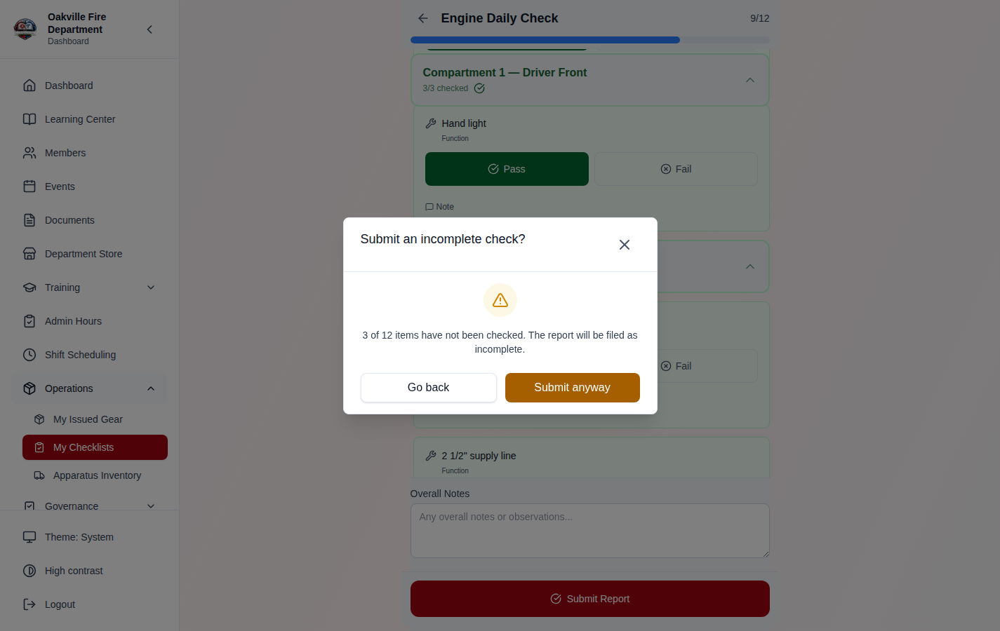

### Resuming In-Progress Checks

Previously, if you started an equipment check but couldn't finish it, the check was stuck in an incomplete state. Now:

1. Open the **Equipment Checks** tab — as a member it is headed **My Equipment Checklists**
2. Each card shows the rig, whether it is a start- or end-of-shift check, the date, and how many of its items are answered, with a progress bar. An untouched one reads **Not Started**; a part-answered one reads **In Progress** with its percentage; a finished one reads **Passed**
3. The button follows the state: **Continue checklist** on a part-answered card, **Open checklist** otherwise. Continuing opens the form with the answered items already filled in
4. Complete what is left and submit

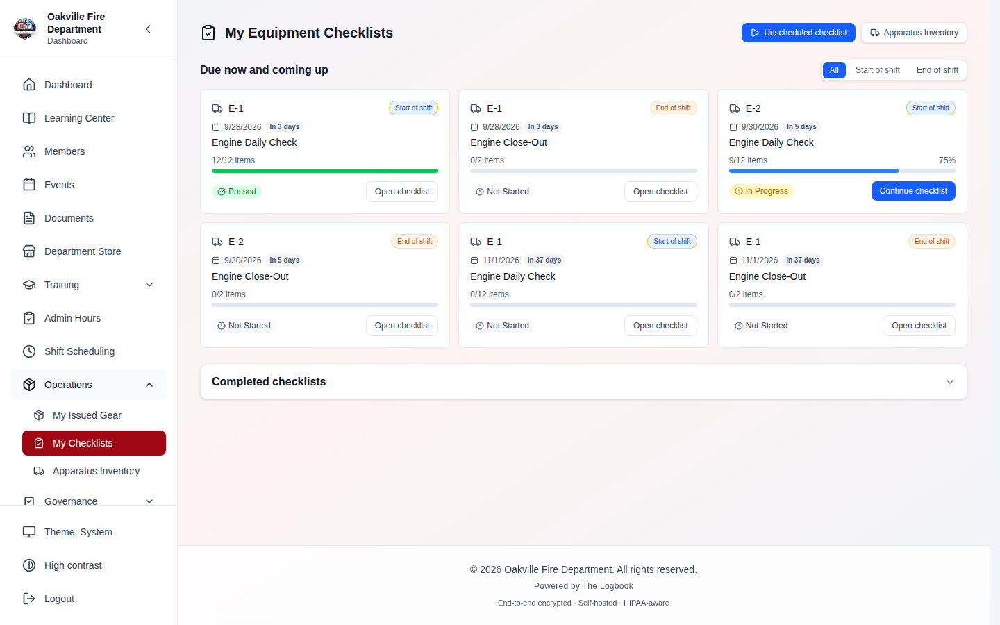

### Edge Cases

| Scenario                                  | Behavior                                                  |
| ----------------------------------------- | --------------------------------------------------------- |
| Resume check after template items added   | New items appear as unanswered alongside pre-filled items |
| Resume check after template items removed | Orphaned answers preserved but flagged                    |
| Submit with 0 items answered              | Confirmation dialog warns; still allowed                  |

---

## Shift Lifecycle: Calendars, Close-Out & Handoff (2026-07-16)

This release strengthens the whole shift lifecycle — from subscribing to your
schedule, through running a shift, to closing it out cleanly.

### Subscribe to Your Shifts (Calendar Feed)

You can now see your shifts inside your phone or computer calendar
(Google Calendar, Apple Calendar, Outlook).

1. Open **My Shifts**.
2. Click **Subscribe to my shifts**.
3. Copy the link, and add it as a **subscribed/Internet calendar** in your
   calendar app.

Your shifts then appear automatically and stay up to date. The link is private
to you — don't share it. If it ever leaks, click **Reset link** to invalidate
the old one and get a new one.

> **Note:** The feed is read-only and shows roughly the last two months through
> the next year of your assigned (non-cancelled) shifts.

> **Screenshot omitted for security:** Expanding this card reveals a private
> calendar-feed credential. Do not capture or publish the expanded card.

### The On-Duty Officer Can Run Their Own Shift

The officer named on a shift can now manage **that** shift — assign and adjust
the crew, record attendance, log calls, and finalize or cancel it — without a
department-wide scheduling permission. Editing or deleting the shift record
itself still requires a scheduling manager.

### Live Readiness Panel

Open a shift while it's active and you'll see a **readiness** strip at the top:

- how many assigned members are **present** (checked in) vs. assigned,
- **staffing** vs. the target (flagged if understaffed), and
- any **start-of-shift equipment checks** still outstanding.

### Requiring End-of-Shift Equipment Checks (Optional)

Departments can require end-of-shift equipment checks to be complete before a
shift is finalized. Turn it on in **Scheduling → Settings → Close-out rules**.

- When it's on, the **Close out shift** button is blocked while any end-of-shift check
  is outstanding. An officer can still **finalize with an override** by checking
  the box and entering a reason — the override is recorded in the audit log.
- When it's off (the default), you can finalize freely, but you'll see a tip
  explaining the benefit so you can decide whether to require it.

**Why turn it on:** it guarantees every apparatus is verified ready at the end
of a shift and keeps your equipment-compliance records complete.

### Restrict Check-In to Assigned Members (Optional)

Also under **Close-out rules**: when enabled, only members rostered on a shift
can check in (open shifts are exempt), so attendance reflects the actual crew.

### Cancelling a Shift (Instead of Deleting)

Use **Cancel shift** to call a shift off without losing the record. Cancelling
keeps the shift for history, marks everyone's assignment cancelled, and notifies
the crew. Cancelled shifts drop off the Open Shifts list and show a "Cancelled"
badge. (A finalized shift can't be cancelled — reopen it first if you need to.)

### Reopening a Finalized Shift

Made a mistake after finalizing? A scheduling manager or the shift officer can
**Reopen** a finalized shift from its detail panel (a reason is logged),
correct attendance or the crew, then finalize again.

### Pass-Down / Crew Handoff Notes

When you finalize a shift, you can leave a **pass-down** for the next crew —
apparatus issues, ongoing incidents, staffing notes. The incoming crew sees it
as a **Handoff from previous shift** banner on the next shift for that apparatus.

### Overtime / Hours Advisory (Optional)

Departments can set an hours cap (**Scheduling → Settings**). When assigning or
signing up would push a member's scheduled hours over that cap within the
configured window, a **non-blocking** warning appears — it advises, it doesn't
prevent the assignment.

### Training-Position Crew Slots

When assigning a crew seat, an officer can mark it a **Training position** and
optionally link the trainee's **program** and an **evaluating officer**. When
the shift is finalized, a draft completion report is created for that member
against the linked program, ready for the evaluator to complete.

### Automatic Shift Generation (Optional)

Under **Scheduling → Settings**, a department can turn on **automatic shift
generation** so active patterns keep producing shifts a chosen number of weeks
ahead — no need to press "Generate" each cycle.

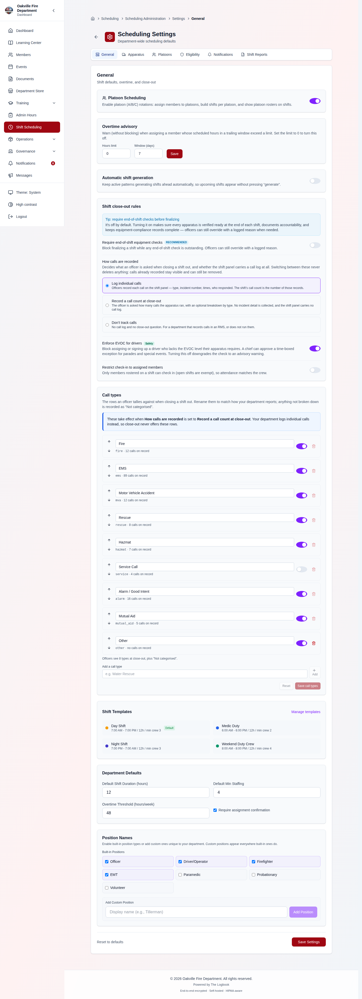

### Edge Cases

| Scenario                                                          | Behavior                                                                                |
| ----------------------------------------------------------------- | --------------------------------------------------------------------------------------- |
| Finalize with end-of-shift checks incomplete, enforcement **off** | Allowed; an informational tip appears                                                   |
| Finalize with checks incomplete, enforcement **on**               | Blocked unless the officer overrides with a logged reason                               |
| Cancel a finalized shift                                          | Not allowed — reopen first                                                              |
| Check in when not rostered, restriction **on**                    | Rejected ("You are not assigned to this shift") unless the shift is open to all members |
| Reopen a shift that was never finalized                           | Rejected ("Shift is not finalized")                                                     |
| Calendar feed link shared/leaked                                  | Reset the link; the old URL stops working immediately                                   |
| Manager tries to confirm on a member's behalf                     | Rejected — confirmation is self-only                                                    |

---

**Previous:** [Training & Certification](./02-training.md) | **Next:** [Events & Meetings](./04-events-meetings.md)

## August 12–14, 2026 update

Scheduling settings, rank-backed apparatus seats, checklist access, and calendar-context changes from August 12–14 are taught in [the release workflow lesson](./19-august-2026-release-changes.md#apparatus-crew-seats-and-scheduling-settings), including its screenshot requirement and cross-organization cache edge case.

## August 19–23, 2026 update — request review and pagination

Full detail, with edge cases and screenshot states, is in the
[August 19–23 section of the release lesson](./19-august-2026-release-changes.md#scheduling-you-can-no-longer-approve-your-own-swap).

**You can no longer review a request you are part of.** On a swap, two people
are blocked: the member who raised it **and** the member it targets. On
time-off, the requester is blocked. Holding `scheduling.manage` does not
override this — a permission grant is not a second person.

A blocked attempt changes nothing: the request stays pending for somebody else
to action.

> **[SCREENSHOT NEEDED — Scheduling → Requests viewed by the member who raised
>
> > the top request, showing the rejection message "Requesters cannot review
> > their own swap requests". Seed one request raised by the capturing account
> > and one raised by another member so the available actions differ visibly
> > between the two rows.]**

**Plan the second approver.** If exactly one person in your department holds
`scheduling.manage` and that person also requests swaps, nobody can approve
their requests. Grant a second person before a Saturday morning discovers it.

**The Requests tab is paged.** Long histories no longer load in one request.
If you have a script or integration reading swap or time-off requests from the
API, the response shape changed — it is now an object with an `items` list
rather than a plain list.

> **[SCREENSHOT NEEDED — Scheduling → Requests with the pagination control
>
> > populated. Seed more than one page of requests (at least 60) so the control
> > is genuinely active rather than a disabled stub.]**

## August 19–23, 2026 update — equipment checks survive a dead spot

A check completed with no signal and submitted on reconnect can no longer
create a duplicate. One check per shift per template is enforced by the
database, and the phone tags its submission before sending, so a replayed
queue, a double tap on **Submit**, or a dropped connection all resolve to the
same record.

Also changed:

- **Standalone (non-shift) equipment checks now require
  `equipment_check.manage`.** A member who could previously start an ad-hoc
  check may find the control gone — that is the permission change, not a
  fault.
- **Deep nested storage paths now fit** in a check item's recorded location.
- **A compartment cannot be made its own parent.**
- **Expired-equipment failures are worked out when the check is read**, so a
  lot that expires after submission shows up without the record being
  rewritten.
- **Timing is recorded by the server**, not supplied by the phone.

> **[SCREENSHOT NEEDED — a submitted shift equipment check on a 390x844
>
> > viewport. If the harness can simulate the queued/offline state, capture that
> > too; if it cannot, say so in the caption rather than staging it.]**
