# Documents, Forms & Communications

The Documents module provides centralized file storage for SOPs, policies, and shared documents. The Forms module is a visual form builder for collecting structured data. The Communications module covers notifications, department-wide messages, and external integrations.

---

## Table of Contents

### Documents

1. [Documents Overview](#documents-overview)
2. [Folders and Organization](#folders-and-organization)
3. [Uploading and Managing Documents](#uploading-and-managing-documents)

### Custom Forms

4. [Forms Overview](#forms-overview)
5. [Building a Form](#building-a-form)
6. [Publishing and Sharing Forms](#publishing-and-sharing-forms)
7. [Viewing Submissions](#viewing-submissions)

### Communications

8. [Notification Rules & Logs](#notification-rules--logs)
9. [Department Messages](#department-messages)
10. [Suggestion Boxes](#suggestion-boxes-2026-09-23)
11. [External Integrations](#external-integrations)

### Worked Examples

12. [Realistic Example: Building a Vehicle Pre-Trip Inspection Form](#realistic-example-building-a-vehicle-pre-trip-inspection-form)
13. [Troubleshooting](#troubleshooting)

---

## Documents Overview

Navigate to **Documents** in the sidebar to access the department's document library.

The Documents page (**Documents & Files**) provides:

- **Totals** across the top — **Total Documents**, **Folders**, **Total Size**
  and **Added This Month**
- **Folders** as cards, with an **All Documents** card that also lists files
  uploaded without a folder; open one to see its subfolders and documents
- **Grid and List view** toggles
- **Search** — across every document from **All Documents**, or within the
  folder you have open

> **Corrected 2026-10-04.** This section described a folder tree on the left
> and a file list on the right. The page shows folders as cards above the
> document list, and you move back up through the breadcrumb.

An empty library or folder shows its "get started" instruction — upload a file,
create a folder — only to someone who can act on it; everyone else sees that it
is empty. A search or filter that matches nothing is reported to everyone. If
your permission to upload, create folders or delete is withdrawn while one of
those dialogs is open, the dialog closes.

The empty messages say which case you are in _(2026-09-29)_: **No Matching
Documents** for a search that found nothing, **No Documents in This Folder**
for an empty folder, and **Start Your Document Library** when the department
has no folders yet. The last one no longer says the library is empty, because
documents uploaded without a folder can still be listed under **All
Documents**.

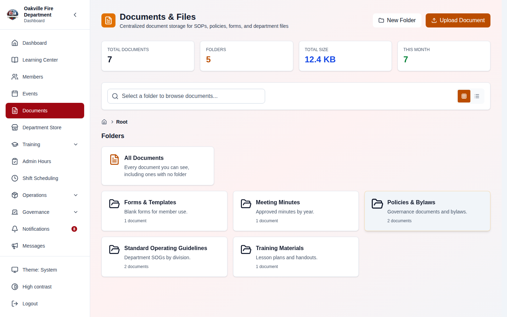

**[SCREENSHOT — REPLACE `07-01-documents.png`.** The page subtitle now reads "SOPs, policies, forms, and other department files in one place" and the fourth total is **Added This Month** (was "This Month") _(#2785)_. Re-take Documents & Files as an administrator with the four totals, the folder cards and the search bar in frame**]**

---

## Folders and Organization

Documents are organized into folders. The system provides default folders, and administrators can create additional ones.

**System Folders** (created automatically). A module's folder opens to that
module's rights, not to document managers; only a full administrator sees every
folder:

| Folder                                                                                      | Who can open it                                                                                                                                      |
| ------------------------------------------------------------------------------------------- | ---------------------------------------------------------------------------------------------------------------------------------------------------- |
| Meeting Minutes, SOPs & Procedures, Policies, Forms & Templates, Reports, General Documents | anyone with `documents.view`                                                                                                                         |
| Training Materials                                                                          | `training.view` or `training.manage`                                                                                                                 |
| Event Attachments                                                                           | `events.view`, `events.edit` or `events.manage`                                                                                                      |
| Apparatus Files                                                                             | `apparatus.view`, `apparatus.edit` or `apparatus.manage`; photos and documents are uploaded on the vehicle's page                                    |
| Facility Files                                                                              | `facilities.view_sensitive`, `facilities.edit` or `facilities.manage`                                                                                |
| Finance (and Receipts)                                                                      | `finance.view`, `finance.manage` or `finance.approve`; a member opens their own receipt on the request itself                                        |
| Member Separations                                                                          | `members.manage`. Property-return reports are filed here, because each names a departed member, the reason for the separation and their home address |
| Member Files                                                                                | each member sees their own folder only                                                                                                               |

A folder marked **Document managers only** opens to `documents.manage`.

### Creating Folders

**Required Permission:** `documents.manage`

1. Open the folder the new one should sit in (or stay at the top level).
2. Click **New Folder** in the page header.
3. Enter the **Folder Name** and, optionally, a description. The dialog shows
   the **Location** it will be created in — **Root** at the top level.
4. Click **Create Folder**.

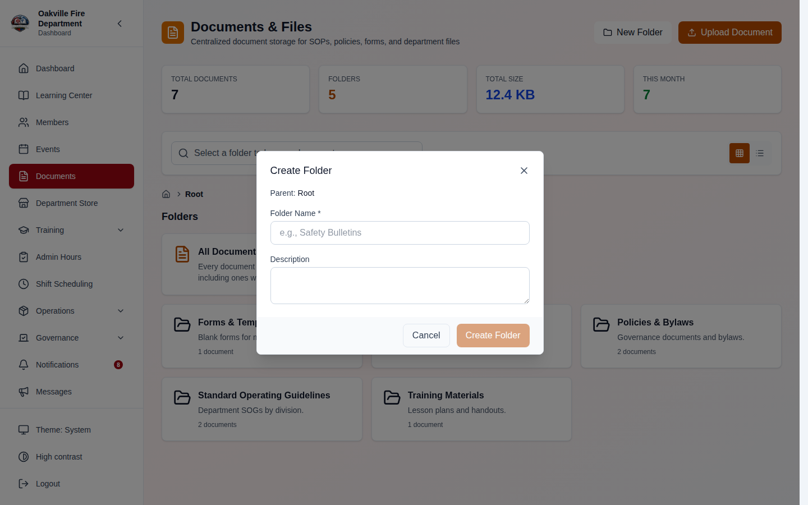

> **Corrected 2026-10-04.** Step 3 used to offer a parent-folder selector. There
> is none: a folder is created inside the folder you have open, which the
> dialog names as its **Location**.

---

## Uploading and Managing Documents

### Uploading Files

**Required Permission:** `documents.manage`

1. Click **Upload Document** in the page header.
2. In the box headed **Choose the file to upload**, click **Choose File** and
   pick the file.
3. Optionally fill in **Document Name** (the file name is used if you leave it
   blank) and **Description**, and choose the **Folder** — the folder you have
   open is preselected, and **No folder** lists it under **All Documents**
   only.
4. Click **Upload**.

> **No drag and drop** _(2026-09-29)_. The upload box used to say "Drag and
> drop your file here", but it never accepted a dropped file. It now says
> **Choose the file to upload**; use its **Choose File** button.

### Document Actions

- **Download** — download the file to your device
- **Delete** — permanently deletes the document and its file, after a **Delete
  Document** confirmation that says it cannot be undone (`documents.manage`)

> **Corrected 2026-10-04.** **Move** and **Rename** were listed here. The page
> offers neither; to file a document elsewhere, upload it again into the right
> folder and delete the old copy.

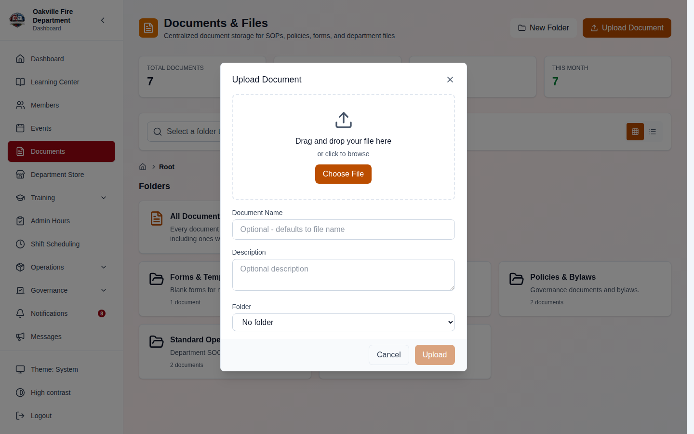

**[SCREENSHOT — REPLACE `07-03-upload-documents.png`.** The file box no longer reads "Drag and drop your file here / or click to browse"; it reads **Choose the file to upload**, and the name field's placeholder is "Optional — uses the file name if left blank" _(#2785)_. Re-take the Upload Document dialog, empty, with the file box and the name, description and folder fields in frame**]**

> **Hint:** Events automatically create a document folder for attachments. Training sessions and meetings can also have linked documents.

---

## Forms Overview

Navigate to **Forms** in the sidebar (under Administration) to access the form builder.

Custom forms let you collect structured data for:

- Incident reports
- Equipment inspections
- Shift reports
- Member applications
- Surveys and feedback
- Any custom data collection need

The page has three tabs: **Forms** (every form the department has, not only
yours — it was labelled "My Forms" until 2026-09-29), **Starter Templates** and
**Submissions**. Each form's status and category are shown capitalised
(**Published**, **Operations**).

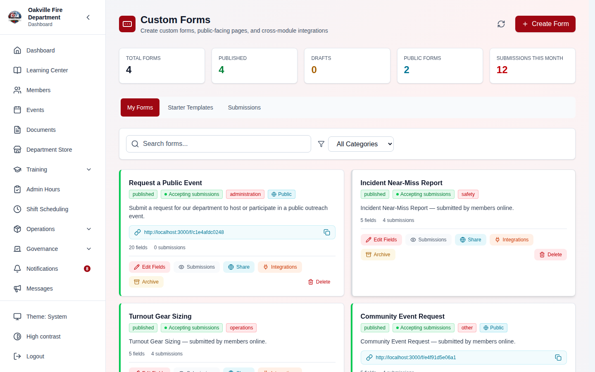

**[SCREENSHOT — REPLACE `07-04-forms-list.png`.** The first tab now reads **Forms** (was "My Forms"), status and category badges are capitalised, and the subtitle reads "Build forms, share them publicly, and send responses to other modules" _(#2789)_. Re-take the Forms tab with at least one published public form and one draft in frame**]**

---

## Building a Form

**Required Permission:** `forms.manage`

### Creating a New Form

1. Click **Create Form**.
2. Enter the form **title** and **description**.
3. Select a **category** (or create a custom one).

### Adding Fields

The form builder supports these field types:

| Field Type         | Description                        |
| ------------------ | ---------------------------------- |
| **Text**           | Single-line text input             |
| **Textarea**       | Multi-line text area               |
| **Number**         | Numeric input                      |
| **Email**          | Email address with validation      |
| **Phone**          | Phone number input                 |
| **Date**           | Date picker                        |
| **Time**           | Time picker                        |
| **Select**         | Dropdown selection                 |
| **Multi-Select**   | Multiple choice selection          |
| **Radio**          | Single choice radio buttons        |
| **Checkbox**       | Boolean checkbox                   |
| **File Upload**    | File attachment                    |
| **Signature**      | Digital signature capture          |
| **Section Header** | Visual divider with heading        |
| **Hidden**         | Hidden field for metadata          |
| **Calculated**     | Auto-calculated from other fields  |
| **DateTime**       | Combined date and time picker      |
| **Member Lookup**  | Search and select existing members |

For each field, configure:

- Label and help text
- Required or optional
- Validation rules (min/max, pattern)
- Default value
- Conditional visibility (show/hide based on other field values)

> **A hidden question is really hidden now** _(2026-09-23)_. Conditional
> visibility used to be a screen-only effect, and the server did not know about
> it. Two things went wrong because of that, and both are fixed:
>
> - **A required question the submitter could not see blocked the form.** Make
>   "Previous EMT experience" required and show it only when Membership Type is
>   EMT, and an applicant who chose Administrative could never submit — the
>   server demanded an answer to a question the form had hidden from them, and
>   they saw an **LB-API-400** error saying the field was missing. A required
>   question is now only required **while it is showing**.
> - **An answer typed into a question that was later hidden was still saved.**
>   Somebody who picked EMT, filled in their EMT experience, then switched to
>   Administrative still sent the EMT answer, and it was stored against their
>   submission. Answers to hidden questions are now discarded when the form is
>   submitted.
>
> Both rules apply to internal and public forms alike. **Submissions saved
> before this date may still hold such answers**; your administrator can clear
> them with a one-off script (see the
> [upgrade note](../UPGRADING.md)). Records other features already built from
> those submissions — a prospective member created from an interest form, for
> example — keep whatever they copied at the time.

> **Branching follows every level now** _(2026-10-02)_. A question that
> branches from a hidden question is hidden too, and is not required — before
> this, closing a branch could leave its follow-up on screen and required, so
> somebody who answered "No" still had to invent an "EMT card number" to submit.
> The in-app preview, the public page and the server all apply the same rule,
> and answers to hidden questions are not sent. Other builder fixes from the
> same review:
>
> - **"Contains" on a checkbox or multi-select matches a whole option.** "Contains
>   EMT" no longer opens for someone who ticked only **AEMT**. A free-text
>   question still matches part of the answer.
> - **Clearing a condition, a placeholder or another setting now saves.** It used
>   to report success and keep the old value.
> - **A question cannot branch from itself or from one of its own follow-ups.**
>   The editor no longer offers those questions, and the server refuses the
>   rule, because a loop hid the whole branch from everyone.
> - **A rule needs a value**, and one left over from a different parent question
>   is dropped.
> - **Duplicate** keeps the copy's condition and its number limits, and reopening
>   a number question shows its limits instead of blanks.
> - **Deleting a question asks first.** The confirmation names any follow-ups
>   that branch from it and says they will be shown to everyone instead; their
>   rules are cleared with the delete.

### Form Builder Features

The form builder includes advanced capabilities:

- **Drag-and-drop reordering**: Rearrange fields by dragging them to new positions
- **Field duplication**: Click the duplicate button on any field to create a copy
- **Incomplete field highlighting**: Fields with missing required configuration (e.g., no label, no options for select fields) are visually highlighted so you can fix them before publishing
- **Guided tooltips**: First-time form builders see helpful tooltips explaining each feature

> **Hint:** If a field is highlighted in yellow or red, it means the field configuration is incomplete. Click on the field to see what's missing.

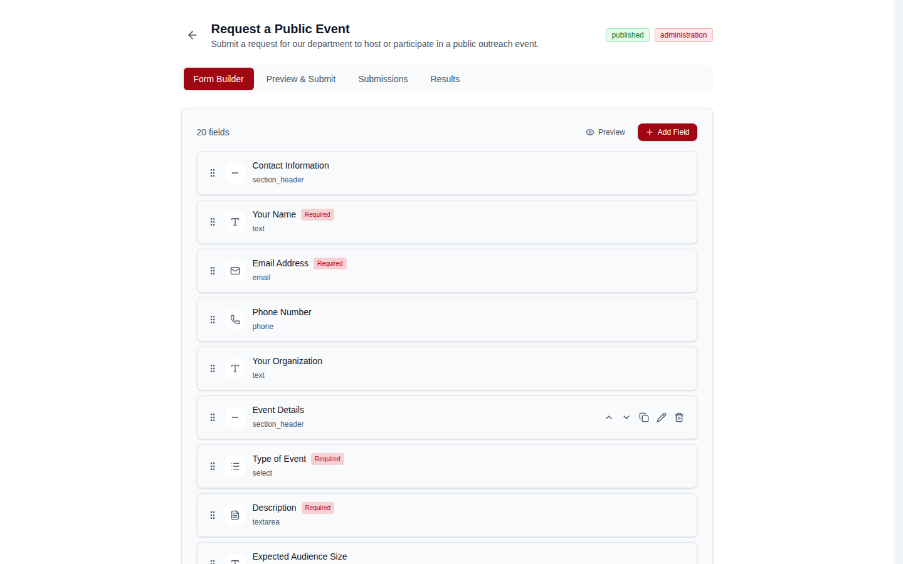

### Form Templates

The system includes pre-built templates:

- Incident Report
- Shift Report
- Equipment Inspection
- Vehicle Check

Select a template to start with a pre-configured form that you can customize.

---

> **Screenshot needed:**
> _[Forms manager (`forms.manage`) at `/forms`, **Starter Templates** tab: the
> template grid showing the **Public** badge and the orange "Sends responses to
> Membership" / "Sends responses to Events" hints on the two public templates.
> Do not press **Use Template**, which creates a form.]_

## Publishing and Sharing Forms

### Internal Forms

Internal forms are accessible only to logged-in members:

1. **Publish** the form.
2. Share the form link with members.
3. Members can fill out and submit the form from within The Logbook.

### Public Forms

Anyone with a public form's link can **open** it. Whether they can **submit** it
without signing in is a separate choice, and **a new form requires a signed-in
member until you change it**:

1. On the form's card, click **Share** to open the **Share Form** dialog.
2. Switch on **Public Access**. The form gets a **Public URL** and a **QR code**
   (download it as PNG or SVG to print).
3. Tick **Allow submissions without signing in** if people outside the
   department should be able to send it. Leave it off to accept responses from
   signed-in members only — the dialog then says "Anyone with the link can view
   this form; submitting requires signing in".
4. **Publish** the form. Until it is published the public link does not work,
   and the dialog says "Publish this form to turn on its public link."
5. Share the URL or QR code. Responses sent through the public link show a
   **globe icon** in your submissions list.

> **"No login required" was not true until 2026-09-29.** The Share dialog
> promised it, but every form is created requiring a sign-in and no screen could
> change that, so a signed-out visitor who filled in a public form was refused
> when they pressed Submit. **Allow submissions without signing in** is that
> missing switch. Forms you made public before then still require a sign-in:
> open **Share** on each one meant for the public and tick the box.
>
> **Visitors are told before they start** _(2026-10-03)_. When a form needs a
> signed-in member and the visitor is not signed in, the public page shows
> **Sign in to submit this form** above the questions, with a **Sign in** button
> that returns them to the form afterwards. The same notice appears if a
> submission is refused for want of a sign-in.

> **Screenshot needed:**
> _[A public form at `/f/<slug>` opened in a signed-out browser, for a form
> whose **Allow submissions without signing in** is off: the **Sign in to
> submit this form** notice above the first question, naming the department,
> with its **Sign in** button.]_

> **There is no "one submission per person" setting to switch on.** The form
> builder has no control for it, and every form a department creates allows
> multiple submissions — so a public form will offer _Submit Another Response_
> after each one. A form that was set to one submission per person through the
> API is held to it on the public link, even when two submissions arrive at the
> same moment; the limit does not apply to submissions made from inside the
> app. Such a form always needs a signed-in member, because that is the only way
> to tell whether someone has already answered, so its **Allow submissions
> without signing in** box is greyed out with the reason under it. See
> [Known Limitations](../KNOWN_LIMITATIONS.md).

**Each public form takes a limited number of submissions a day.** The ceiling
is a server setting (`PUBLIC_FORM_DAILY_LIMIT`, 500 per form per day unless the
operator changes it). Only accepted submissions count toward it: one that fails
validation — a required answer missing, a value too long — and one caught as a
bot are turned away without using up the day's allowance, so a flood of junk
cannot lock genuine submitters out. Once the ceiling is reached, a visitor is
told _"This form is not accepting further submissions today."_

**The full catalog of forms is the Forms page**, which requires `forms.manage`.
Event administrators who look after the public outreach request form do not
need it: **Manage Events → Settings → Public Form** lists only the forms wired
to the event request pipeline, under `events.manage` — see
[Events & Meetings → Public Request Form](./04-events-meetings.md#public-request-form).

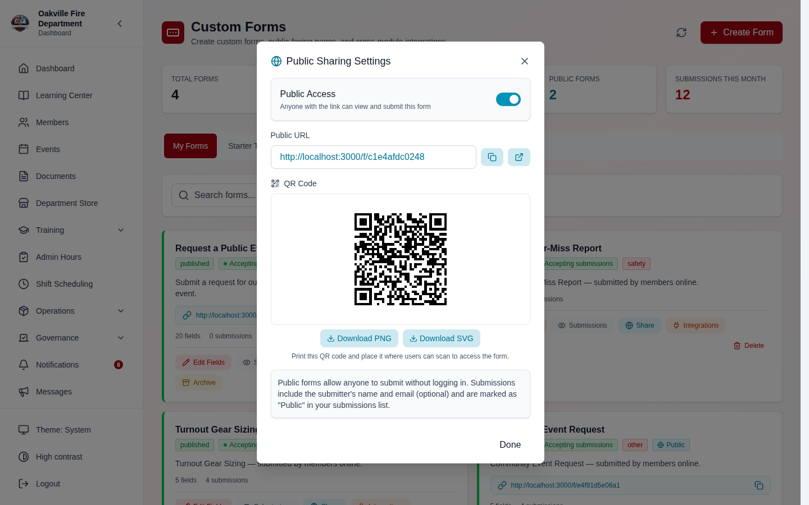

**[SCREENSHOT — REPLACE `07-05-form-sharing.png`.** The dialog is now titled **Share Form** (was "Public Sharing Settings"), carries the **Allow submissions without signing in** checkbox under **Public Access**, and its footer reads "Anyone can submit this form without signing in." or "Only signed-in members can submit this form." followed by the globe-icon sentence _(#2789, #2811)_. Re-take it for a published public form with the box ticked, the Public URL and QR code in frame**]**

> **Hint:** Public forms are great for community feedback, mutual aid incident reports, or application forms linked from your department's public portal.

---

## Viewing Submissions

1. Navigate to the form in the Forms list.
2. Click **View Submissions**.
3. Browse submissions in a table view with all field values.
4. Click any submission to view the full response.
5. **Export to CSV** for external analysis or reporting.

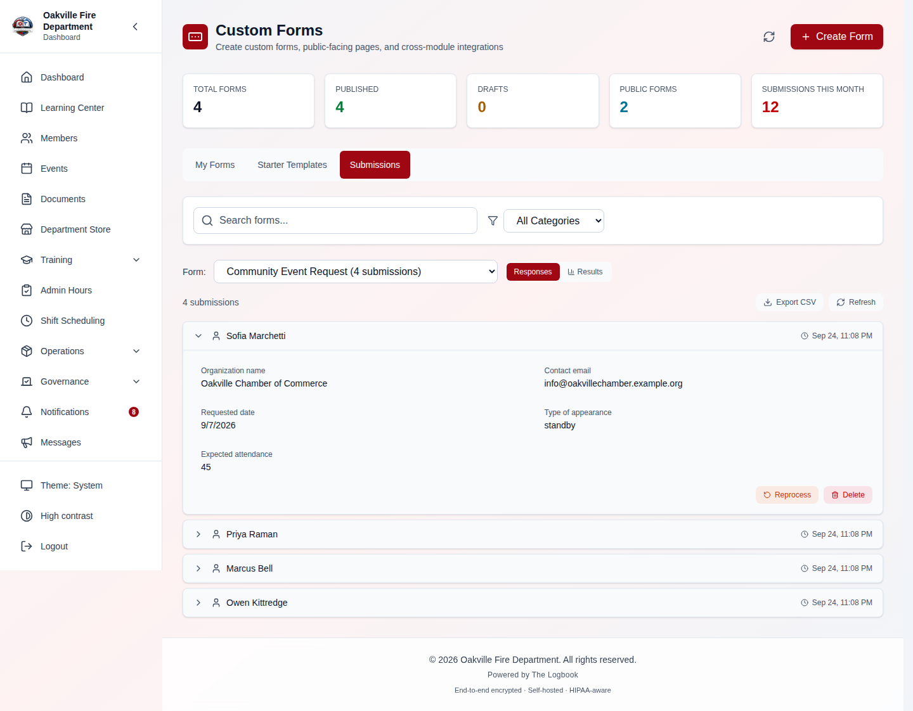

### Survey Results Panel

For survey-style forms (forms with multiple select, radio, or checkbox fields), a **Results** panel provides aggregated analysis:

- **Distribution charts** for select, radio, and checkbox fields showing response breakdowns
- **Response counts** and statistics for text and numeric fields
- **Per-field aggregation** so you can see trends across all submissions at a glance

This is useful for feedback surveys, polls, and any form where you want to see aggregated patterns rather than individual responses.

### Integration Health

If your form has cross-module integrations (Membership or Inventory), the submissions view shows integration processing status for each submission:

- **Success** — Integration processed correctly
- **Failed** — Integration encountered an error (click **Reprocess** to retry)
- **Pending** — Integration is queued for processing

---

## Notification Rules & Logs

Navigate to **Notifications** in the sidebar (`/notifications`) to manage notification rules, view delivery logs, and configure email templates. The page has been renamed from "Email Notifications" to "Notification Rules & Logs" to reflect both email and in-app delivery channels.

### Four tabs

The Notifications page has four tabs; the middle two need officer permissions:

| Tab                    | Purpose                                                                                                      |
| ---------------------- | ------------------------------------------------------------------------------------------------------------ |
| **My Notifications**   | Your own in-app inbox, with an unread count and a **Show read** switch. Pinned notifications stay at the top |
| **Notification Rules** | Switch a built-in notification off for the whole department                                                  |
| **Email Templates**    | Link to email template management for customizing notification formats                                       |
| **Send Log**           | Your own delivery history, email and in-app, with channel filtering (All / Email / In-App)                   |

**Notifications of the same kind stack** _(2026-09-28)_. Two or more in-app
notifications of one category — a weekend's attendance validations, one
shift-report follow-up per report — fold into a single row such as "5
attendance validations", with the newest one's subject as **Latest:** and an
**unread** count that includes ones further down the list. Click the row to
expand it; each notification inside keeps its own link and read state. **Mark
all read** on the row clears the whole category, including any not yet loaded.
A pinned notification never stacks. On the dashboard's **My Updates** card a
stack is one row that opens this inbox.

> **Screenshot needed:**
> _[Notifications → **My Notifications** with a collapsed stack (for example
> "3 attendance validations", **Latest:** line, **3 unread** badge and **Mark
> all read**) above single notifications, then the same stack expanded showing
> its individual rows.]_

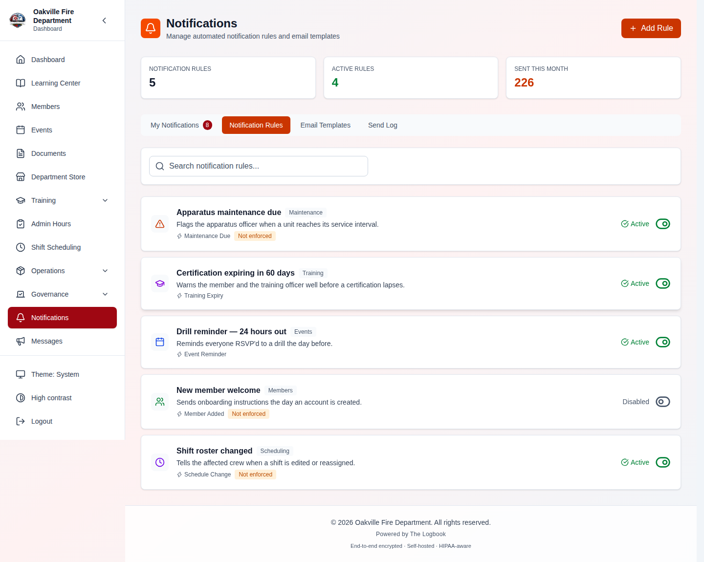

### Notification Rules

**Every wired notification already goes out with its built-in defaults.** A
rule is what lets you switch one off: it stops for the whole department once
**every** rule for its trigger is switched off. With no rules at all, nothing is
off. Members choose their own email and text preferences separately (see
[Member notification controls](#member-notification-controls)).

The **Create Rule** dropdown offers only the triggers a sender actually reads:

| Trigger                      | What switching it off stops                                                                                                                                         |
| ---------------------------- | ------------------------------------------------------------------------------------------------------------------------------------------------------------------- |
| **Event Reminder**           | Reminders before scheduled events                                                                                                                                   |
| **Training Expiry**          | Certification expiration alerts, when the training module has them switched on                                                                                      |
| **Suggestion Submitted**     | The notices telling a suggestion box's reviewers, and anyone the box notifies, that a submission arrived. Replies and status updates still go out                   |
| **Equipment Request Update** | The notice telling a member the quartermaster approved, declined or issued their equipment request _(2026-09-28)_. The request's status still shows on My Equipment |

> **Corrected 2026-10-04.** This table used to list **schedule_change**,
> **new_member**, **maintenance_due** and **form_submitted** as well. No sender
> reads a rule for those, so the dropdown stopped offering them; a rule created
> for one earlier is still listed, badged **Not enforced**.
>
> The empty Rules tab used to say "Create your first notification rule to start
> sending automated notifications". It now says what is true: automated
> notifications already go out with their default settings _(2026-09-29)_.

### Creating a Rule

1. Navigate to **Notifications > Notification Rules**.
2. Click **Create Rule**.
3. Enter a **name** and select a **trigger** from the dropdown.
4. The **category** and **channel** auto-populate based on the trigger (can be overridden).
5. Add an optional **description**.
6. Click **Save**.

Rules can be enabled/disabled individually with toggle switches. The summary cards at the top show total rules, active rules, and total sent notifications.

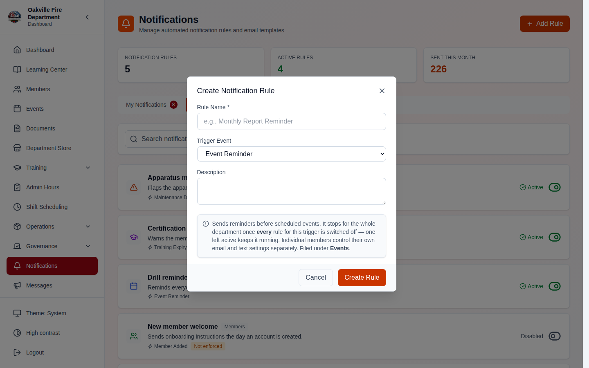

> **Screenshot needed:**
> _[Administrator with `notifications.manage` at `/notifications?tab=rules`:
> press **Add Rule**, name it "Gear request notices" and choose the trigger
> **Equipment Request Update**, so its note is visible at the bottom of the dialog. Do
> not press **Create Rule**.]_

**[SCREENSHOT — REPLACE `07-10-create-rule-modal.png`.** The trigger dropdown now also offers **Equipment Request Update** _(#2767)_, and the note under it reads "To stop it for the whole department, switch off **every** rule for this trigger — any one left on keeps it running. Members set their own email and text preferences separately." _(#2791)_. Re-take Create Notification Rule with **Event Reminder** chosen and that note in frame; never save**]**

### Send Log

The **Send Log** tab shows **your own** delivery history — the email and in-app
notifications sent to you — and every member can open it. It lists:

- Date and time
- Subject and message content
- Channel (email or in-app)
- Delivery status (sent, read, failed)
- **Channel filter** — filter by All, Email only, or In-App only
- **Mark All Read** button to bulk-clear unread notifications

The department-wide view of every member's deliveries, for checking that mail is
getting through, requires `notifications.manage`.

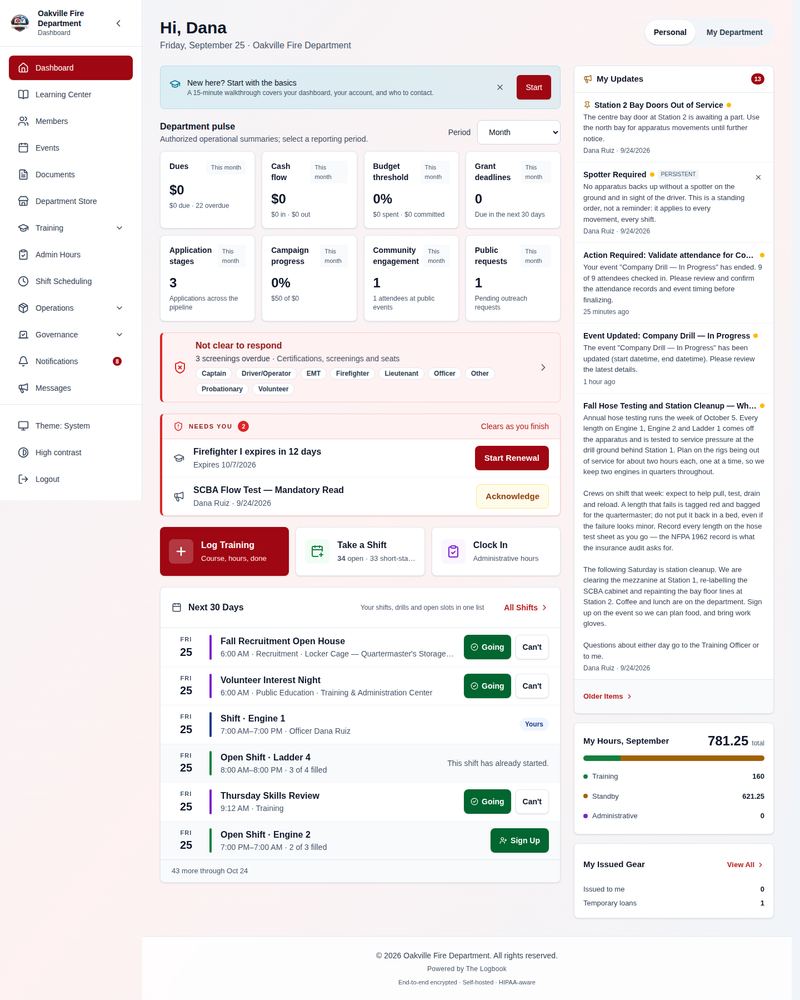

### Notifications on the dashboard

The dashboard's **My Updates** card shows your unread notifications and
department messages in one feed, five rows at a time, with **Older Items**
opening the full inbox — see
[Administration & Reports → Dashboard Notification Management](./08-admin-reports.md#dashboard-notification-management).
A run of same-category notifications shows there as one row that opens the
inbox (see [Four tabs](#four-tabs) above).

> **Corrected 2026-10-04.** This section described a **Clear All** button and a
> dismiss ✕ on each dashboard notification. Both went with the 2026-08-16
> dashboard rebuild: you mark notifications read from the **My Notifications**
> tab. Only a persistent department message carries a clear control on the
> dashboard, and only for officers who manage messages.

### Edge Cases

| Scenario                       | Behavior                                                                                        |
| ------------------------------ | ----------------------------------------------------------------------------------------------- |
| Channel filter defaults        | Defaults to "All" — shows both email and in-app logs                                            |
| Bulk mark-as-read              | Only marks currently unread notifications; already-read are not modified                        |
| Rule with trigger already used | Multiple rules can use the same trigger (e.g., two event_reminder rules for different channels) |
| Disabled rule                  | Stops sending but retains configuration and history                                             |

---

## Department Messages

Department Messages are leadership announcements broadcast to the whole
department or a targeted group. There are two surfaces:

- **Members** read them at **Messages** (`/messages`, the megaphone icon in the
  sidebar), on the **dashboard** — the **My Updates** feed, or **Needs you**
  while a message waits for your acknowledgment — and in the notification
  **bell**. No special permission is required to read your own
  messages.
- **Officers** compose and manage them at **Communications → Messages**
  (`/communications/messages`). **Required Permission:** `notifications.manage`.

### Posting a message

1. Go to **Communications → Messages** and click **New message**.
2. Enter a **title** and **message** body. URLs you type (e.g. a sign-up form or
   SOP link) become clickable links automatically.
3. Set the **priority**: Normal, Important, or Urgent. Priority drives both the
   styling and how far the message is escalated (see below).
4. Choose the **audience**:
   - **Everyone** — the whole department.
   - **By role** — one or more roles (e.g. Probationary Members, Officers).
   - **By status** — member statuses (Active, Probationary, Leave, etc.).
   - **Specific members** — hand-picked individuals (searchable list).
5. Optionally toggle **Pin to top**, **Keep in inbox after it is read**
   (persistent), or **Require acknowledgment**, and set an **Expires** date and/or a **Schedule for later**
   time (see the sections below).
6. Click **Post message** (or **Schedule message** if you set a future time).

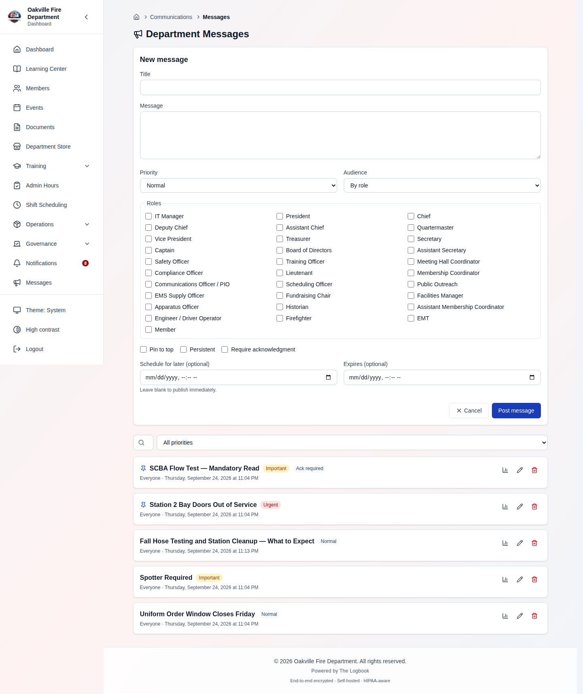

**[SCREENSHOT — REPLACE `07-11-new-message-form.png`.** The **Persistent** checkbox now reads **Keep in inbox after it is read** _(#2790)_. Re-take New message with the audience and scheduling fields and the four checkboxes in frame; never post**]**

### How members receive a message

Every targeted member gets the message in the app (the dashboard card, the
`/messages` inbox, and a bell notification) **and by email** — email goes out
for every message at every priority, though it is best-effort rather than a
guaranteed record of notice (see the caveats below). The dashboard card shows
what still needs your attention:
unread messages, acknowledgment-required messages you haven't acknowledged,
and persistent notices. Once you resolve a message it clears off the card on
your next visit — never while you are reading it; the full history stays on the
**Messages** page. Urgent
messages are additionally **escalated** to SMS:

| Priority / flag         | In-app (bell, inbox, dashboard) | Email | SMS |
| ----------------------- | :-----------------------------: | :---: | :-: |
| Normal                  |               ✅                |  ✅   |  —  |
| Important               |               ✅                |  ✅   |  —  |
| Requires acknowledgment |               ✅                |  ✅   |  —  |
| Urgent                  |               ✅                |  ✅   | ✅  |

The email is _not_ suppressed by a
member's email preference or by consent (a member can never opt out of being
informed of a department notice); important/urgent messages carry an
`[IMPORTANT]`/`[URGENT]` subject prefix.

**Email is attempted, not guaranteed.** Three conditions can stop it, none of
which is reported back to the author:

- **No address on file.** Members without an email address are skipped.
- **Hourly cap.** A department sends at most 30 message emails per hour; once
  that cap is reached, later messages in the same hour are posted in-app but
  their email goes out to nobody.
- **Delivery failures.** Provider errors are logged, not surfaced in the UI.

Treat the in-app inbox and the acknowledgment report — not the email — as the
record that a member was notified. For anything time-critical, use **Require
acknowledgment** and check the report rather than assuming the email landed.

**SMS** is different: it is only sent
when the department has SMS (Twilio) configured, the member has a mobile number
on file, the member has granted **express SMS consent** (US TCPA rules — a member
who was never asked counts as _not_ consented), **and** their text-message
preference is on. A member who turns off or never grants SMS is still included
in the email escalation, subject to the caveats above. The author of a message
is not notified about their own post.

### Opening a message

Each message has its own page at `/messages/:id`, opened from the inbox or the
dashboard card, so a link to a message works: paste it into an email or a chat
and the recipient lands on that message. The breadcrumb leads back to
**Messages**. Opening the page marks the message read, and an
acknowledgment-required message carries its **Acknowledge** button there.

The page needs no permission beyond signing in, and that is safe rather than
loose: the server serves a message only to a member it was targeted at. Anyone
else — or anyone opening a message that has expired or been removed — sees
**Message unavailable** with a way back to the inbox.

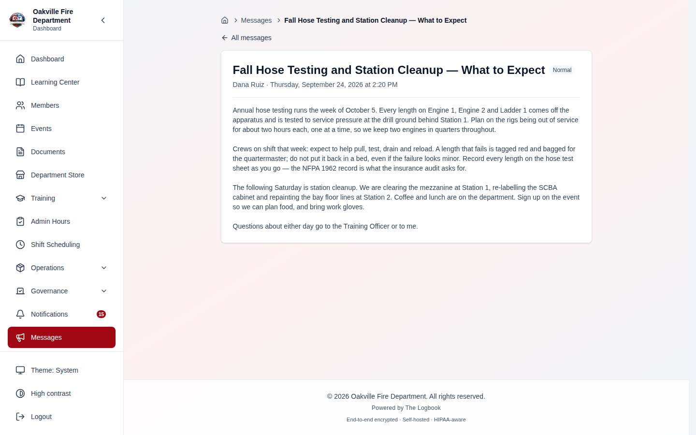

### Requiring acknowledgment

Toggle **Require acknowledgment** for messages members must confirm they've read
(e.g. an SOP change). These behave differently:

- The member sees an **Acknowledge** button on the message and the message stays
  in their "new/unread" count until they acknowledge it — simply opening it is
  not enough.
- Acknowledgment-required messages are also emailed to targeted members.
- Officers can open the **acknowledgment report** (the bar-chart icon on a
  message) to see the completion rate — **X of Y acknowledged / read** — and a
  per-member breakdown listing exactly who still owes an acknowledgment.
  Acknowledgments are treated as compliance evidence and are recorded in the
  audit log.

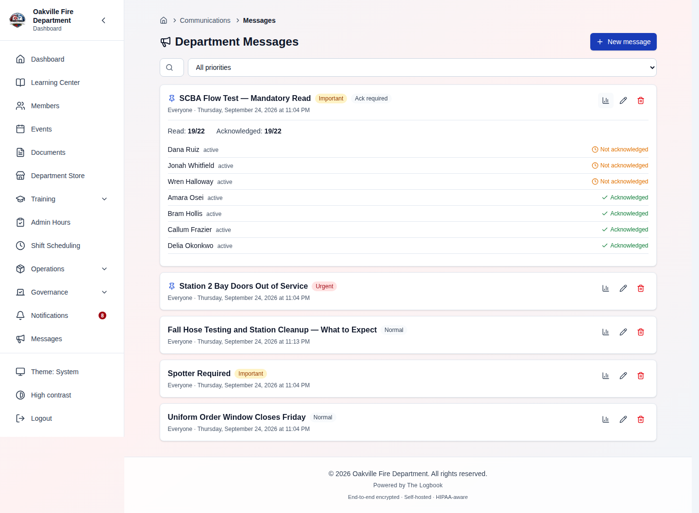

### Scheduling a message

Set **Schedule for later** to a future date/time to have the message publish
automatically at that time instead of immediately. Until then it is hidden from
members and shows a **"Scheduled · <time>"** badge in the admin list. When the
scheduled time arrives (checked every ~15 minutes) the message goes live and is
escalated just like an immediate post. Leave the field blank to publish now.

> A message that has **already been published cannot be moved back to a future
> time** — that would re-send it. You can still reschedule a message that is
> _pending_ (has not gone out yet).

### Editing and managing messages

- **Edit** — the pencil icon reopens the compose form so you can fix the title,
  body, audience, flags, or expiry in place (no need to delete and repost).
- **Search & filter** — the admin list has a search box (title/body) and a
  priority filter, and paginates for large histories.
- **Delete** — the trash icon removes the message from members' view. This is a
  **soft delete**: the read/acknowledgment records are preserved for compliance,
  so a deleted acknowledgment-required message still has its evidence trail.

### Persistent messages

When **Keep in inbox after it is read** is ticked (the compose form's name for a
persistent message since 2026-09-29; it was labelled **Persistent**):

- The message shows a **"Persistent"** badge on the dashboard.
- It stays on the dashboard/inbox for targeted members regardless of read state
  — it does not drop off once read, and messages you've already read never
  crowd it off the dashboard card. (Pin a standing notice to also keep it above
  any backlog of newer unread messages.)
- Only users with `notifications.manage` see the clear control (✕) that removes
  it.

This is useful for standing notices that should remain visible until leadership
takes them down (e.g., "SCBA annual inspection mandatory by March 31 — contact
Lt. Smith to schedule").

### Member notification controls

Members manage how they're reached under **Settings → Notifications**
_(reorganised 2026-09-28)_:

- **Email Notifications** — the master switch for the emails a member may turn
  off. Off stops every one of them at once.
- **Emails you can turn off** — one switch per optional email: **Event
  reminders**, **Training and certification reminders**, **Shift notices**,
  **Equipment and inventory updates**, **Store announcements**, **Volunteer
  calls**, **Election notices** and **Suggestion box**. Members who hold a
  management permission also see the officer duty emails (event, scheduling and
  training officer duties, election administration, quartermaster duties,
  membership and store administration). The notice still appears in the bell
  either way.
- **Always emailed to you** — the emails nobody can turn off: account and
  security, election ballots, **department messages**, leaving-the-department
  notices, store receipts, skills test results and overdue equipment. The
  department needs to be able to show the member was told. Any optional email
  the department has made required is listed here too, not offered as a switch.
- **Urgent Text Messages** — receive an SMS for urgent messages. Requires a mobile
  number on file, the department to have SMS (Twilio) enabled, **and** the
  member's express **SMS consent** under **My Account → Security → Privacy Choices**
  (a member who has never granted consent will not receive texts, per US TCPA
  rules). Turning this off — or never granting SMS consent — never stops the email.

The in-app notification is always delivered regardless of these settings.

> **Changed 2026-09-28.** The separate **Event Reminders** and **Training
> Reminders** switches are gone; their place is taken by the per-email list
> above, and a choice a member made with the old switches is still honoured.
> Before this, **Email Notifications** stopped some emails and not others,
> depending on which part of the system sent them; it now covers every optional
> email.

#### Which emails are required — Member Emails & Texts

**Communications → Member Emails & Texts** (**Administration → Forms & Comms →
Member Emails & Texts**, `/communications/member-emails`) lists every email the
system sends to members and officers under **Always sent** and **Members can
turn off**, and the alerts that may also be texted under **Text messages**.
Email to applicants, event requesters and addresses you type in yourself is not
on it. Holders of `settings.manage`, `organization.update_settings` or
`notifications.manage` can open it.

Holders of `settings.manage` or `organization.update_settings` can turn on
**Require for every member** on an optional email. Members then see it under
**Always emailed to you**, and every sender delivers it whatever the member's
own switches say. It works in one direction only: an email the system itself
requires cannot be made optional. Each change is written to the audit log.

> **Screenshot needed:**
> _[Communications → **Member Emails & Texts** as an administrator: the **Always
> sent** cards, then **Members can turn off** with one card's **Require for every
> member** switch on and badged **Required by your department**, and the top of
> the **Text messages** section.]_

> **Screenshot needed:**
> _[Settings → **Notifications** as a member: **Email Notifications** on, the
> **Emails you can turn off** list with **Event reminders** switched off, and
> **Always emailed to you** below it.]_

> **Screenshot needed:**
> _[Administrator with `settings.manage` at `/communications/member-emails`:
> the full page with **Always sent**, **Members can turn off** and **Text
> messages** all visible. Before capturing, switch on **Require for every
> member** for one optional email (e.g. **Quartermaster duties**) so its card
> shows **Required by your department** beside cards reading **On unless turned
> off**; switch it back off afterwards.]_

### Edge Cases

| Scenario                                    | Behavior                                                                                                                   |
| ------------------------------------------- | -------------------------------------------------------------------------------------------------------------------------- |
| Message targeting specific roles            | Only members holding one of those roles see it. Targeting follows the role even if it is later renamed.                    |
| Renaming a targeted role                    | Existing role-targeted messages keep reaching the same role (targeting is by role identity, not name).                     |
| Member marks all notifications as read      | Persistent messages are unaffected — only an admin can clear them.                                                         |
| Deleting an acknowledgment-required message | The message is hidden from members but its read/acknowledgment records are kept for compliance.                            |
| Editing an already-sent message             | Saves changes in place; it is **not** re-sent or re-escalated.                                                             |
| Urgent message when Twilio isn't configured | Still delivered in-app and by email; SMS is skipped.                                                                       |
| Very high volume of urgent/ack messages     | Email/SMS escalation is rate-limited per department to prevent runaway sends; the in-app notification is always delivered. |
| Sending is retried for a message            | Each member gets the email (and any SMS) once; a send already made to them is not repeated.                                |
| A send to a member fails                    | It is recorded as failed, never as delivered.                                                                              |

---

## Suggestion Boxes _(2026-09-23)_

A department can run any number of **suggestion boxes** — "Training ideas",
"Station 2 facilities", a complaints box — each with its own reviewers and its
own rules about anonymity. Members submit from one place, reviewers work each
box's submissions, and an anonymous submitter can still hold a conversation
with the reviewers without ever being identified.

| Who                       | Where                                                                                      | Needs                                                           |
| ------------------------- | ------------------------------------------------------------------------------------------ | --------------------------------------------------------------- |
| Every member              | **Suggestions** in the sidebar (after **Messages**) — `/suggestions`                       | Signed in                                                       |
| A box's reviewers         | The **Review** tab on the same page — it appears only for reviewers                        | Being named as a reviewer of a box, or forwarded one suggestion |
| Whoever sets the boxes up | **Administration → Forms & Comms → Suggestion Boxes** — `/communications/suggestion-boxes` | `suggestions.manage`                                            |

**Setting up boxes and reading them are deliberately separate.**
`suggestions.manage` lets you create boxes and choose their reviewers. It does
**not** let you read what anybody submitted — only a box's own reviewers can.
That is what makes a complaints box possible in a department whose
administrators might be what somebody is complaining about. It ships on the
Fire Chief, Deputy Chief, Assistant Chief, President and Communications Officer
positions.

**Every department starts with a Compliance box** _(2026-09-24)_. It is named
**Compliance**, described to members as "Report a compliance concern: a policy,
safety, training-record or regulatory issue. Reviewed by the Compliance
Officer.", lets the submitter choose whether to stay anonymous, and allows
follow-up. Its reviewer is the **Compliance Officer** position, which is also
new and starts with nobody in it. **The box is open from day one, so reports
filed before you appoint a Compliance Officer wait unread** — assign that
position on the positions screen promptly; whoever holds it sees everything the
box has received. A department that already had a box named Compliance keeps
its own, and one that had created its own `compliance_officer` position gets
that position as the reviewer. If no position carries that slug, the box is
created closed, because an open box needs a reviewer.

### Setting up a box

**Required Permission:** `suggestions.manage`

1. Go to **Administration → Forms & Comms → Suggestion Boxes** and press **New
   box**.
2. Give it a **Name** (unique in your department) and a **Description (shown to
   members)** — say what the box is for and who reads it.
3. Choose its **Anonymity**:
   - **Submitter chooses** — the member ticks **Submit anonymously** or not.
   - **Always anonymous** — no submission to this box ever records who sent it.
   - **Always named** — every submission carries the member's name.
4. Tick **Allow follow-up** if reviewers and submitters should be able to
   exchange replies and the submitter should see the outcome. Leave it off for a
   one-way box: reviewers read every submission but do not reply or report a
   status.
5. Pick the reviewers: any mix of **Reviewer positions** (whoever holds that
   position) and **Reviewer members**. An active box needs at least one. They
   are the only people who will ever read it, so choose them with the box's
   purpose in mind — a complaints box reviewed by the people most likely to be
   complained about will not be used.
6. Leave **Accepting submissions** ticked, and **Save box**.

To close a box, untick **Accepting submissions**. Its existing submissions stay
readable by its reviewers.

> **Screenshot needed:**
> _[Holder of `suggestions.manage` (e.g. the demo chief) at
> `/communications/suggestion-boxes` after a fresh demo seed: the **Suggestion
> boxes** list showing the default **Compliance** box (submitter chooses,
> follow-up allowed, its submission count, "Reviewers: Compliance Officer"),
> **Training ideas** with its reviewers and any "Also notified:" line, and the
> **Edit** and **Delete** buttons on each row. Nothing saved or deleted.]_

To remove a box you no longer need, press **Delete** on it:

- **A box that never received a submission** is deleted after you confirm.
- **A box with submissions** shows how many it holds and offers **Archive
  instead**, which closes it and keeps everything. Deleting it permanently
  removes every submission, screenshot and reply in it, cannot be undone, and
  asks you to type the box's name first.

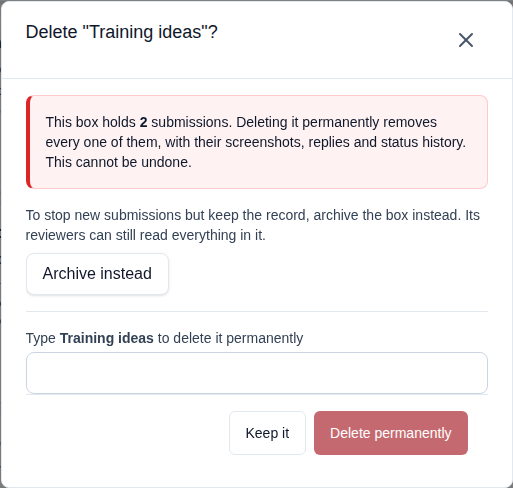

### Submitting a suggestion (every member)

1. Open **Suggestions** from the sidebar. The **Submit** tab is first.
2. Pick the **Suggestion box**. Its description appears underneath, along with
   whether your name will be recorded and whether reviewers will reply.
3. Enter a **Title** and the **Details**, and optionally attach up to **five
   screenshots**. The form states the rules _(2026-09-29)_: PNG, JPEG, WebP or
   GIF, up to 10 MB each; larger images are scaled down to 2560 pixels on the
   longest side, and animated GIFs keep only their first frame.
4. If the box lets you choose, tick **Submit anonymously**.
5. Press **Submit** (or **Submit anonymously**).

Named submissions appear under **My submissions**, where you can follow the
status and reply if the box allows follow-up. In a follow-up box, **Status
history** shows when your submission was received, each status it has moved
through, and any response the reviewers wrote for you. An anonymous submission
shows the same history when you open it with its follow-up key.

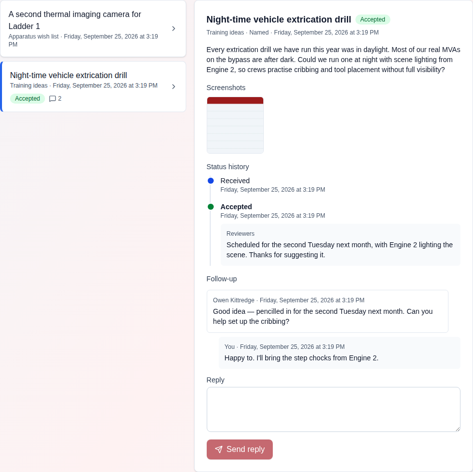

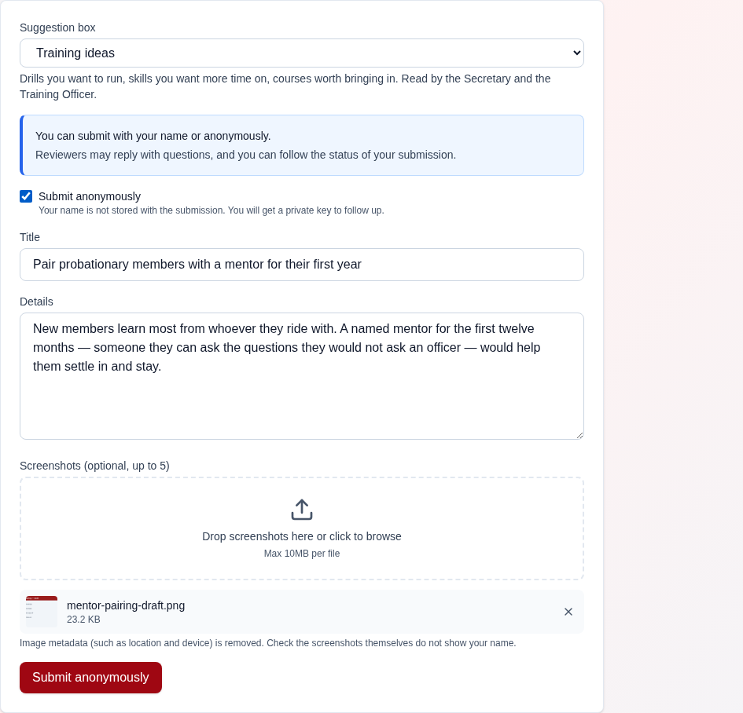

**[SCREENSHOT — REPLACE `07-15-suggestion-submit-anonymous.png`.** A hint now sits under **Screenshots (optional, up to 5)**: "PNG, JPEG, WebP or GIF, up to 10 MB each. Larger images are scaled down to 2560 pixels on the longest side, and animated GIFs keep only their first frame." _(#2830)_. Same state as before, with that hint in frame**]**

### What "anonymous" means here

It is built into what is stored, not just hidden on screen:

- **No name is stored.** The submission has no author, and nothing is written
  to the audit log about who sent it. **Reviewers cannot find out, and neither
  can an administrator.**
- **Times are kept to the day only**, so "submitted at 23:47, when only one
  person was on shift" cannot be worked out from the record.
- **Screenshots are re-encoded**, which strips location, device and other
  hidden image data, and their filenames are discarded. What is _visible_ in a
  screenshot is not changed — **if your name is on the screen you captured, it
  is in the screenshot.** The form reminds you of this.

**Following up anonymously uses a key.** In a follow-up box, an anonymous
submission gives you a **follow-up key**, once:

> **Save your follow-up key.** Your submission was sent anonymously. This key is
> the only way to see replies and respond. It is shown once and cannot be
> recovered — nobody, including the reviewers, can look it up for you.

Press **Copy**, keep it somewhere private, then **I saved it**. Later, open
**Follow up with a key**, paste it and press **Open submission** to see the
status and any replies and to answer them — still without your name attached.
**A lost key cannot be replaced**; the submission survives, but nobody can
reconnect you to it.

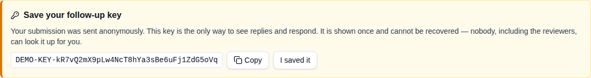

> **What anonymity does not cover.** Somebody with access to the **server
> itself** — its database and mail records — could line up the time a
> submission arrived with who was signed in then. The application does not
> expose this to anyone using it, but it is not a guarantee against the people
> who run the server. The full list is in
> [Known Limitations](../KNOWN_LIMITATIONS.md). If that matters for what you
> want to report, say so to your department's leadership through another route.
>
> **Request logs no longer record it** _(2026-09-30)_. Submitting and following
> up are left out of the web server's and the backend's request logs, so those
> no longer hold your address and the exact second. A failed submission is not
> filed on the **Error Monitoring** page under your name either. A proxy your
> department runs in front of The Logbook (for example on Unraid or AWS) is
> outside the application and logs requests unless it is set up the same way —
> ask whoever runs the server.

### The idea board

Some boxes have an **Idea board** tab on the Suggestions page. It shows ideas
the box's reviewers chose to share with everyone, written up by them, never
the original submission, its screenshots or who sent it. Press the arrow on
an idea to vote for it; press it again to take your vote back. Sort by
**Top** (most votes) or **New**, and filter by status. When reviewers have
responded to an idea, their latest response is shown with it.

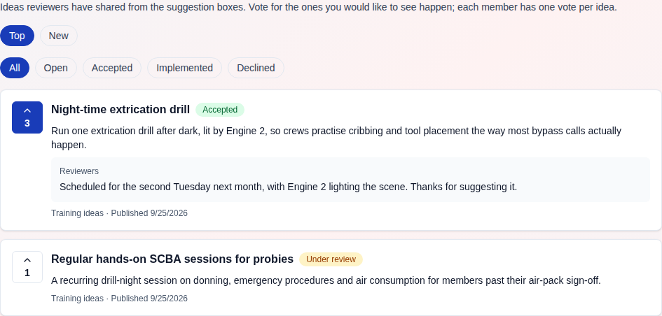

Reviewers of a board-enabled box see an **Idea board** section when they open a
submission. **Publish to the board** asks for a title and summary in your own
words, so write it without names or anything that identifies the sender.
**Edit published copy** changes it and **Take off the board** removes it. Its
votes are kept if you publish it again. While an idea is published, your
latest response to the submitter is shown on the board too. Administrators
turn the board on per box with **Public idea board** in the box's settings.

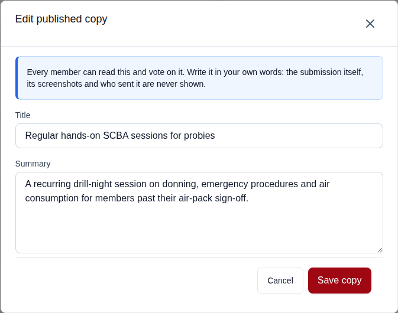

### Reviewing submissions

Reviewers see a **Review** tab on the Suggestions page, with a count of open
items. Filter by **Box** and by **Status** — the default, **Open**, means New or
Under review.

Open a submission to:

- set its **Disposition** — **New**, **Under review**, **Accepted**,
  **Implemented**, **Declined** or **Duplicate**. In a follow-up box, a named
  submitter is notified when it changes (by email too, unless they have turned
  suggestion-box emails off);
- write a **Response to the submitter**, in a follow-up box. It appears on the
  submitter's **Status history** under "Reviewers", never with your name, and
  they are notified that you responded. Each response is added as a new step;
  use it to explain a decision or what happens next;
- keep an **Internal note (reviewers only)** — never shown to the submitter;
- reply in the **Follow-up** thread, if the box allows follow-up. An anonymous
  author appears as **Anonymous submitter**.

Reviewers get a notification in the app (and a push notification, where your
department has them switched on) and an email of their own when a submission or
a submitter's reply arrives. **Neither carries the submission's content, only a
link to it.** The email is one a member can turn off — **Suggestion box** under
Settings → Notifications — unless the department has made it required on
**Member Emails & Texts**; the in-app notification always arrives _(2026-09-28)_. A department can turn the new-submission notices off under
**Notifications → Notification Rules** with a **Suggestion Submitted** rule; replies and
status changes still go out.

**[SCREENSHOT — REPLACE `07-24-suggestion-notification-rule.png`.** Re-shot 2026-09-25, before the rule note's second sentence was reworded to "To stop it for the whole department, switch off **every** rule for this trigger — any one left on keeps it running. Members set their own email and text preferences separately." _(#2791)_. Same state: **Suggestion Submitted** chosen, never saved**]**

**Telling someone about new submissions without letting them read them.** In a
box's settings, **Also notify** names positions or members who are told when
something arrives in that box. They cannot open it: their notice says which box
received a submission and that its reviewers have it, nothing more. Use it for
someone who needs to know a box is being used, such as a chief who wants to know
the Compliance box has something in it, without making them a reviewer. The
email reviewers receive is editable under **Communications → Email Templates →
Suggestion Boxes → Suggestion Submitted**.

**Forwarding one suggestion to somebody else.** A box's reviewer can press
**Forward** and choose members and/or positions. They can read **that
suggestion only** — its screenshots and thread — set its disposition, keep the
note and reply, but they see nothing else in the box and cannot forward it on.
They are emailed a link, and see a **Forwarded to you** badge. Reviewers see who
it was forwarded to and can **Withdraw** a forward. An anonymous submitter stays
anonymous when forwarded. Forwards and withdrawals are audit-logged.

![Suggestions → Review with an anonymous submission open: the list on the left, and on the right the Disposition set to Under review, the Response to the submitter and internal note fields, the Status history from Received to Under review, the Idea board section with its published copy and the Edit published copy and Take off the board buttons, the Forwarded to list naming the Training Officer position and a member, and the follow-up thread with the reviewer's question and the anonymous submitter's reply](./images/07-17-suggestion-review.png)

The person it was forwarded to finds it on their own **Review** tab, even if
they review no box. Only the suggestions forwarded to them appear there, each
marked **Forwarded to you**, and the **Forward** button is replaced by a note
that only the box's reviewers can forward it.

**On a phone** the list and the open submission stack rather than sitting side
by side. Tap a submission and the page scrolls down to it; scroll back up for the
list. The tab strip scrolls the tab you are on into view, and two tabs take
shorter names — **Mine** for My submissions and **Follow up** for Follow up with
a key — so all of them usually fit.

> **Screenshot needed:**
> _[Suggestions → **Review** on a phone, a submission open: its title and
> details at the top of the screen, then the **Disposition** and **Internal
> note**, with the mobile bottom navigation below.]_

### Edge cases

| Scenario                                                      | Behavior                                                                                                 |
| ------------------------------------------------------------- | -------------------------------------------------------------------------------------------------------- |
| You hold `suggestions.manage` but are not a reviewer          | You configure boxes and see no **Review** tab. That is by design                                         |
| A reviewer position changes hands                             | Reviewing follows the position: the new holder reviews, the previous one no longer does                  |
| An anonymous submission made before follow-up was switched on | It has no key, so its author cannot read replies. Reviewers are told so on the submission                |
| Follow-up is off                                              | Submitters see no status and no replies; reviewers can still set a disposition and a note for themselves |
| Communications module switched off                            | Suggestion boxes still work — they are deliberately not tied to that module switch                       |
| More than five screenshots, or a file that is not an image    | Refused with a message naming the limit                                                                  |

---

> **Screenshot needed:**
> _[Ordinary member at `/suggestions`, **Submit** tab, with the **Compliance**
> box chosen: its description ("Report a compliance concern … Reviewed by the
> Compliance Officer."), the anonymity hint and the follow-up hint visible.
> Nothing typed or submitted.]_

## External Integrations

Navigate to **Integrations** in the sidebar to configure connections with external services.

### Available Integrations

| Integration         | Description                             |
| ------------------- | --------------------------------------- |
| **Google Calendar** | Sync events to Google Calendar          |
| **Outlook**         | Sync events to Outlook Calendar         |
| **Slack**           | Post notifications to Slack channels    |
| **Discord**         | Post notifications to Discord channels  |
| **CSV Export**      | Scheduled data exports                  |
| **iCal Feed**       | Subscribe to events in any calendar app |

### Setting Up an Integration

1. Navigate to **Integrations**.
2. Click on the integration you want to configure.
3. Follow the setup steps (typically involves authorizing access or entering a webhook URL).
4. Configure which events or triggers should use this integration.
5. Test the connection.

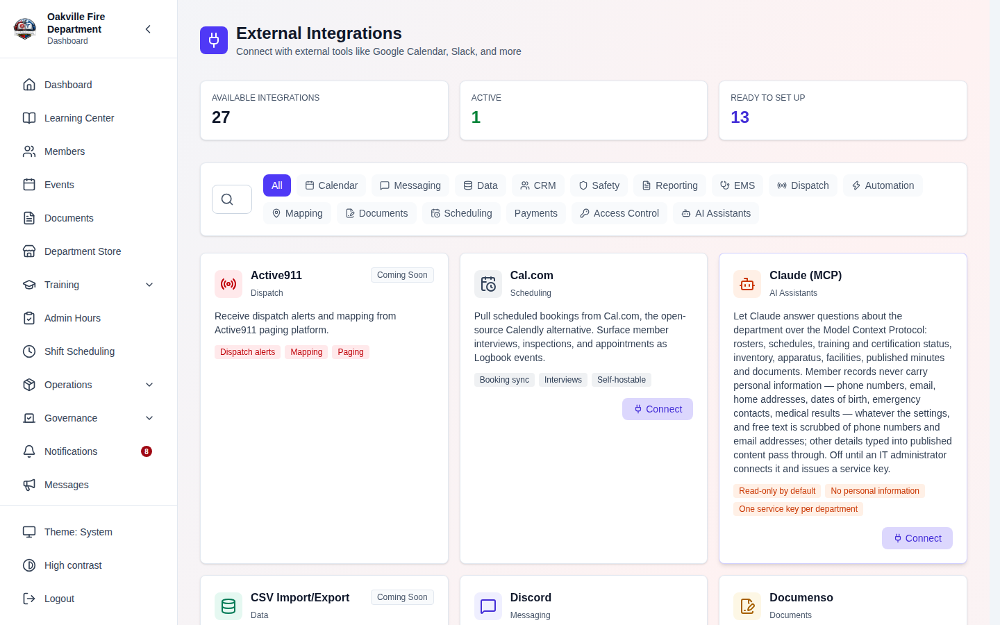

> **Hint:** Calendar integrations use iCal feeds. After connecting, events from The Logbook will appear in your personal calendar app automatically.

---

## Realistic Example: Building a Vehicle Pre-Trip Inspection Form

This walkthrough demonstrates building a custom form from scratch using the form builder — from creating the form through publishing it and reviewing the first submission.

### Background

**Safety Officer Capt. Linda Zhao** at **Brookfield Fire Department** wants to digitize their daily apparatus pre-trip inspection checklist. Currently, drivers fill out a paper form clipped to a clipboard in each bay. She wants to replace it with a form members can complete on their phone or tablet.

The paper form has:

- Date and apparatus selection
- Driver name
- Checkbox list for each inspection point (lights, tires, fluids, etc.)
- Mileage reading
- Overall condition assessment
- Notes field for deficiencies
- Driver signature

---

### Step 1: Creating the Form

Capt. Zhao navigates to **Administration > Forms** and clicks **Create Form**.

| Field           | Value                                                                                                           |
| --------------- | --------------------------------------------------------------------------------------------------------------- |
| **Title**       | Daily Apparatus Pre-Trip Inspection                                                                             |
| **Description** | Complete this form before taking any apparatus out of quarters. Report all deficiencies to the on-duty officer. |
| **Category**    | Operations                                                                                                      |

---

### Step 2: Adding Fields

She uses the form builder to add fields by clicking **Add Field** for each one. Here is the form layout she builds:

**Section 1 — Header fields:**

| #   | Field Type         | Label              | Required | Configuration                                                                |
| --- | ------------------ | ------------------ | -------- | ---------------------------------------------------------------------------- |
| 1   | **Section Header** | Inspection Details | —        | Heading text for the top of the form                                         |
| 2   | **Date**           | Inspection Date    | Yes      | Default: today's date                                                        |
| 3   | **Select**         | Apparatus          | Yes      | Options: Engine 1, Engine 2, Ladder 1, Rescue 1, Squad 3, Chief 1, Utility 1 |
| 4   | **Hidden**         | Inspector          | —        | Auto-filled with logged-in user's name                                       |

**Section 2 — Exterior checks:**

| #   | Field Type         | Label                                               | Required | Configuration |
| --- | ------------------ | --------------------------------------------------- | -------- | ------------- |
| 5   | **Section Header** | Exterior Inspection                                 | —        | —             |
| 6   | **Checkbox**       | Headlights / taillights / turn signals functional   | Yes      | —             |
| 7   | **Checkbox**       | Emergency lights and siren tested                   | Yes      | —             |
| 8   | **Checkbox**       | Tires — adequate tread, proper inflation, no damage | Yes      | —             |
| 9   | **Checkbox**       | Body — no visible damage, compartment doors secure  | Yes      | —             |
| 10  | **Checkbox**       | Mirrors clean and properly adjusted                 | Yes      | —             |
| 11  | **Checkbox**       | Fuel level above 3/4 tank                           | Yes      | —             |

**Section 3 — Engine and fluids:**

| #   | Field Type         | Label                               | Required | Configuration     |
| --- | ------------------ | ----------------------------------- | -------- | ----------------- |
| 12  | **Section Header** | Engine & Fluids                     | —        | —                 |
| 13  | **Checkbox**       | Engine oil level normal             | Yes      | —                 |
| 14  | **Checkbox**       | Coolant level normal                | Yes      | —                 |
| 15  | **Checkbox**       | Transmission fluid level normal     | Yes      | —                 |
| 16  | **Checkbox**       | Power steering fluid level normal   | Yes      | —                 |
| 17  | **Checkbox**       | Battery connections clean and tight | Yes      | —                 |
| 18  | **Number**         | Current Mileage                     | Yes      | Validation: min 0 |

**Section 4 — Equipment checks:**

| #   | Field Type         | Label                                   | Required | Configuration |
| --- | ------------------ | --------------------------------------- | -------- | ------------- |
| 19  | **Section Header** | Equipment & Cab                         | —        | —             |
| 20  | **Checkbox**       | SCBA bottles — full and secured         | Yes      | —             |
| 21  | **Checkbox**       | Portable radio — charged and functional | Yes      | —             |
| 22  | **Checkbox**       | First aid kit — stocked                 | Yes      | —             |
| 23  | **Checkbox**       | Hand tools — present and secured        | Yes      | —             |
| 24  | **Checkbox**       | Cab — clean, no loose items             | Yes      | —             |

**Section 5 — Summary:**

| #   | Field Type         | Label                | Required | Configuration                                                                                                                                                            |
| --- | ------------------ | -------------------- | -------- | ------------------------------------------------------------------------------------------------------------------------------------------------------------------------ |
| 25  | **Section Header** | Overall Assessment   | —        | —                                                                                                                                                                        |
| 26  | **Radio**          | Overall Condition    | Yes      | Options: Ready for Service, Minor Issues (note below), Out of Service (notify officer immediately)                                                                       |
| 27  | **Textarea**       | Deficiencies / Notes | No       | Help text: "Describe any issues found during inspection. Include location and severity." Conditional visibility: shown when Overall Condition is NOT "Ready for Service" |
| 28  | **Signature**      | Driver Signature     | Yes      | —                                                                                                                                                                        |

> **Hint:** The **conditional visibility** on the Deficiencies field (item 27) is a key usability feature. By setting it to show only when the condition is NOT "Ready for Service," the form stays clean for routine inspections where everything passes. Drivers only see the notes field when they actually need it.

---

### Step 3: Configuring and Publishing

Capt. Zhao configures the form settings:

| Setting                     | Value                                                                                    |
| --------------------------- | ---------------------------------------------------------------------------------------- |
| **Status**                  | Active                                                                                   |
| **Public Access**           | Off (internal only — requires login)                                                     |
| **Submission Notification** | On — notify Safety Officer when a submission includes "Minor Issues" or "Out of Service" |

She clicks **Save**. The form is now live and accessible to all logged-in members.

---

### Step 4: First Submission

The next morning, **D/O Mike Torres** opens The Logbook on the station tablet, navigates to **Forms**, and opens the pre-trip inspection form.

He fills it out for Engine 1:

- Checks off all exterior items
- Checks off all engine/fluids items
- Mileage: 28,523
- Checks off all equipment items
- Overall Condition: **Minor Issues**
- The deficiency notes field appears. He types: _"Rear passenger-side turn signal bulb is out. Replacement bulb needed — have one in station supply. Will replace after shift."_
- Signs with his finger on the tablet
- Clicks **Submit**

Capt. Zhao receives a notification because the submission included "Minor Issues." She opens the submission, sees the turn signal note, and adds a comment for follow-up.

---

### Step 5: Reviewing Submissions Over Time

After two weeks of use, Capt. Zhao navigates to **Forms > Daily Apparatus Pre-Trip Inspection > View Submissions**.

The submissions table shows:

| Date   | Apparatus | Inspector | Condition         | Deficiencies                    |
| ------ | --------- | --------- | ----------------- | ------------------------------- |
| Mar 14 | Engine 1  | Torres    | Ready for Service | —                               |
| Mar 14 | Ladder 1  | Chen      | Ready for Service | —                               |
| Mar 14 | Rescue 1  | Brooks    | Minor Issues      | Low windshield washer fluid     |
| Mar 13 | Engine 1  | Garcia    | Ready for Service | —                               |
| Mar 13 | Engine 2  | Torres    | Ready for Service | —                               |
| Mar 13 | Ladder 1  | Walsh     | Minor Issues      | Bay door sensor slow to respond |
| ...    | ...       | ...       | ...               | ...                             |

She clicks **Export CSV** to download the data for the monthly operations report. The CSV includes all field values from every submission — ready for spreadsheet analysis.

> **Hint:** Over time, the inspection data reveals patterns. If Engine 2 has recurring "Minor Issues" submissions, that signals a maintenance trend worth investigating. Export the data quarterly and review by apparatus to spot chronic problems.

---

## Troubleshooting

| Issue                                                          | Solution                                                                                                                                                                                                                                                                                                                                                            |
| -------------------------------------------------------------- | ------------------------------------------------------------------------------------------------------------------------------------------------------------------------------------------------------------------------------------------------------------------------------------------------------------------------------------------------------------------- |
| Cannot upload a document                                       | Check file size limits (configured by your department). Verify you have permission to upload to the selected folder.                                                                                                                                                                                                                                                |
| Form not accepting submissions                                 | Ensure the form is **Published** (the card's **Publish Form** button). Draft forms cannot receive submissions.                                                                                                                                                                                                                                                      |
| Public form URL not working                                    | Verify that Public Access is enabled on the form (**Share**). The form must be **Published**. Ensure the URL uses the correct format: `/f/{slug}`.                                                                                                                                                                                                                  |
| Visitors see **Sign in to submit this form** on a public form  | The form requires a signed-in member, which is how every form is created. If outsiders should submit it, open **Share** on the form and tick **Allow submissions without signing in**. A form limited to one submission per person cannot be opened up this way. _(added 2026-10-04)_                                                                               |
| Form builder drag-and-drop not working                         | The builder uses `@dnd-kit` for reordering. Clear browser cache and reload. If the issue persists, run `cd frontend && npm install` to ensure dependencies are installed.                                                                                                                                                                                           |
| Public form shows 404 error                                    | Fixed in March 2026 — a doubled `/v1` in the API URL path has been corrected. Pull latest code and rebuild.                                                                                                                                                                                                                                                         |
| Forms page not visible in navigation                           | The Forms page requires `forms.manage` permission. Ask your administrator to grant `forms.manage` to your role.                                                                                                                                                                                                                                                     |
| Integration reprocessing fails                                 | Check that the target module (Membership or Inventory) is enabled and the field mapping is correct. Review the error details on the failed submission.                                                                                                                                                                                                              |
| Not receiving email notifications                              | Check **Settings → Notifications**: **Email Notifications** must be on, and the email's own switch under **Emails you can turn off** too (required emails arrive regardless). Verify your email address is correct. Check your spam folder. If using Cloudflare Email Service, verify the API token is valid in Administration > Organization Settings > Email tab. |
| Slack integration not posting                                  | Verify the webhook URL is correct and the Slack channel exists. Check the integration logs for errors.                                                                                                                                                                                                                                                              |
| Calendar events not syncing                                    | Ensure the calendar integration is connected. Some calendar apps cache iCal feeds and may take up to 24 hours to refresh.                                                                                                                                                                                                                                           |
| Form submissions not appearing in pipeline                     | Fixed in March 2026 — multiple field mapping issues resolved. Pull latest backend code. Check backend logs for "Field mapping" warnings if issues persist.                                                                                                                                                                                                          |
| Cannot delete a form linked to a pipeline                      | As of 2026-03-04, forms linked to active pipelines are protected from deletion. Remove the pipeline integration first (Pipeline Settings → edit stage → remove form link), then delete the form.                                                                                                                                                                    |
| Reprocessing submission doesn't update prospect                | Fixed in March 2026 — reprocessing now re-evaluates pipeline stage assignment. Pull latest backend code.                                                                                                                                                                                                                                                            |
| Duplicate prospect not detected on form submission             | As of 2026-03-04, duplicate detection by email is active. The pipeline coordinator receives a notification with a link to the existing prospect.                                                                                                                                                                                                                    |
| Form field compatibility warning on save                       | This is a new validation (2026-03-04) that checks if form fields match expected pipeline field mappings. Review the warning and update field names to match.                                                                                                                                                                                                        |
| Modal dialog buttons unresponsive (delete, confirm)            | Fixed in March 2026 — backdrop overlay no longer intercepts button clicks. Pull latest and rebuild.                                                                                                                                                                                                                                                                 |
| Form submission does not auto-advance prospect                 | As of 2026-03-14, auto-advance must be explicitly enabled in the pipeline stage configuration. Open Pipeline Settings, edit the form_submission stage, and check "Auto-advance when form is submitted".                                                                                                                                                             |
| Automated pipeline email not sent on form submission           | The email is triggered when advancing to an `automated_email` stage, not when submitting a form. Verify the pipeline has an `automated_email` stage after the `form_submission` stage and that SMTP is configured. _(added 2026-03-14)_                                                                                                                             |
| "Required field '…' is missing" on a question nobody could see | Fixed 2026-09-23. A required question hidden by its conditional-visibility rule is no longer enforced. If it still happens, check the rule: an operator the server does not recognise counts as **visible**, so the field stays required rather than silently becoming optional.                                                                                    |
| Public form submission by bot                                  | The system uses a hidden honeypot field for bot detection. If filled, the submission is answered with an ordinary thank-you (fake success) — no record is created. Legitimate users never see this field.                                                                                                                                                           |

---

**Previous:** [Apparatus & Facilities](./06-apparatus-facilities.md) | **Next:** [Administration & Reports](./08-admin-reports.md)

## August 12–14, 2026 update

The public-outreach form list event administrators see, and how it differs from the Forms catalog, is covered under [Public Forms](#public-forms).
