# Administration, Reports & Settings

This guide covers department administration tasks including organization settings, role management, the setup checklist, reports, analytics, and system monitoring. These features are primarily used by officers and the IT Manager.

---

## Table of Contents

1. [Department Setup Checklist](#department-setup-checklist)
2. [Organization Settings](#organization-settings)
3. [Module Management](#module-management)
4. [Role and Permission Management](#role-and-permission-management)
5. [Reports](#reports)
6. [Analytics Dashboard](#analytics-dashboard)
7. [Public Portal Configuration](#public-portal-configuration)
8. [Error Monitoring](#error-monitoring)
9. [Scheduled Tasks](#scheduled-tasks)
10. [Security and Compliance](#security-and-compliance)
11. [Realistic Example: Generating the Annual Training Summary Report](#realistic-example-generating-the-annual-training-summary-report)
12. [Realistic Example: First-Time Department Setup](#realistic-example-first-time-department-setup)
13. [Troubleshooting](#troubleshooting)

---

## Department Setup Checklist

**Required Permission:** `settings.manage`

Navigate to **Administration > Department Setup** to access the guided setup checklist.

When your department first sets up The Logbook, this checklist guides you through essential configuration steps:

- Department information (name, address, phone, logo)
- Department type (Fire Department, EMS, Fire/EMS Combined)
- Department identifiers (FDID, State ID)
- Initial member accounts
- Role configuration
- Module selection
- Notification setup

Each step shows its completion status. You can return to any step to update the configuration.

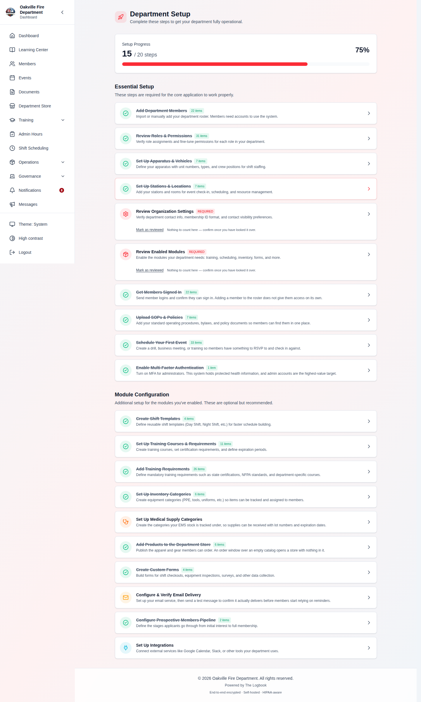

> **Hint:** The setup checklist is always accessible even after initial setup. Use it as a reference to verify your department's configuration is complete.

---

## Organization Settings

**Required Permission:** `settings.manage`

Navigate to **Administration > Organization Settings > Organization** to manage department-wide settings.

> **Note:** Organization Settings are separate from user account settings. Organization Settings require the `settings.manage` permission and are only visible to administrators. Individual users manage their own profile, password, and preferences at **My Account** (`/account`).

### General Settings

- **Department Name** and **Slug** (URL identifier)
- **Department Type** and **Identifiers** (FDID, State ID)
- **Timezone** setting
- **Contact Information** (phone, fax, email, website)
- **Mailing and Physical Addresses**
- **Logo** upload

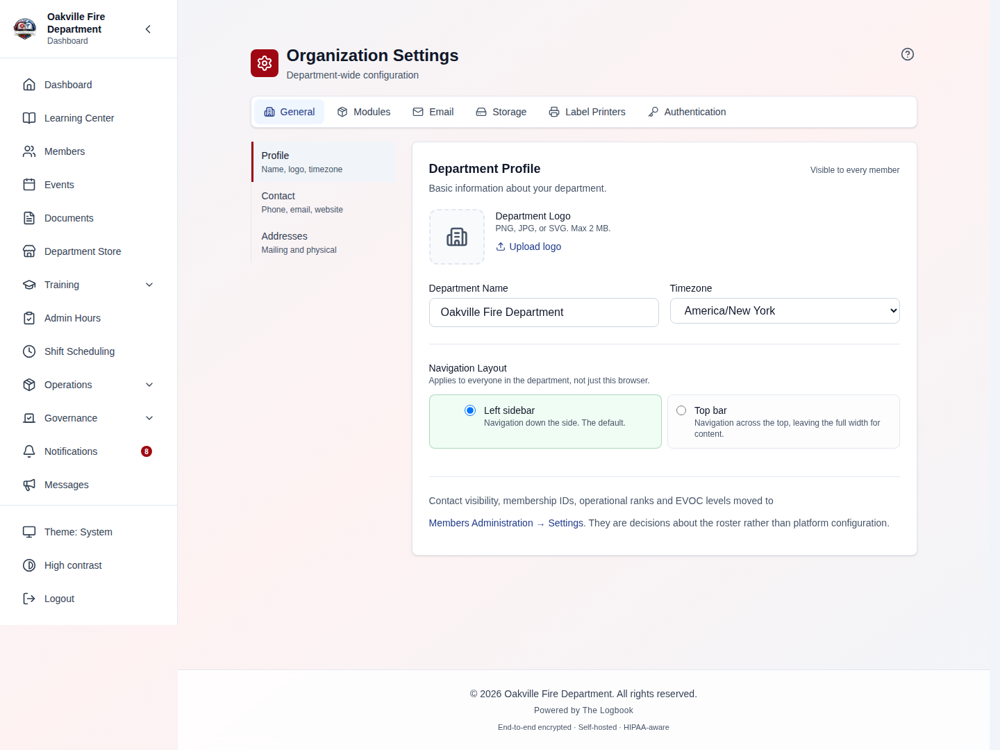

### Contact Info Visibility

Control which contact information fields are visible to members:

- Toggle visibility of **email, phone and mobile**
- Members will only see the fields you enable, on every screen that shows a
  member record — the roster and the individual profile page alike
- Officers who manage the roster (`members.manage`) always see all fields
  regardless of this setting, and members always see their own record in full

Some fields are **not** governed by this setting and have no toggle:

| Field                                 | Who can see it                                                                                                       |
| ------------------------------------- | -------------------------------------------------------------------------------------------------------------------- |
| Home address, personal email          | Roster managers only — never shown to ordinary members at any setting                                                |
| **Date of birth, emergency contacts** | Leadership only (`members.manage`), plus the member themselves. There is deliberately no setting that publishes them |

Emergency contacts are withheld by default because they identify people
outside the department — a member's spouse or parent, by name and phone — who
never consented to appear in it. Leadership access to those fields is recorded
in the audit log.

### Membership ID Settings

Configure how membership IDs are assigned:

- Enable/disable automatic membership ID generation
- Set the ID format (prefix, numeric pattern)
- View and manage the next available ID number

---

## Module Management

**Required Permission:** `settings.manage`

Navigate to **Settings > Organization** and scroll to the **Modules** section.

Modules are organized into three categories:

### Core Modules (Always Enabled)

These cannot be disabled:

- Dashboard
- Membership Management
- Scheduling
- Personal Settings
- System Settings
- Documents & Files
- Custom Forms

### Recommended Modules (Enabled by Default)

These can be disabled if not needed:

- Apparatus Management
- Inventory Management
- Communications

### Optional Modules (Disabled by Default)

Enable these as needed:

- Training & Certification
- Incidents & Reports
- HR & Payroll
- Grants & Fundraising
- Facilities Management
- Prospective Members Pipeline
- Public Information
- Medical Screening _(added 2026-03-13)_
- Finance _(added 2026-03-12)_

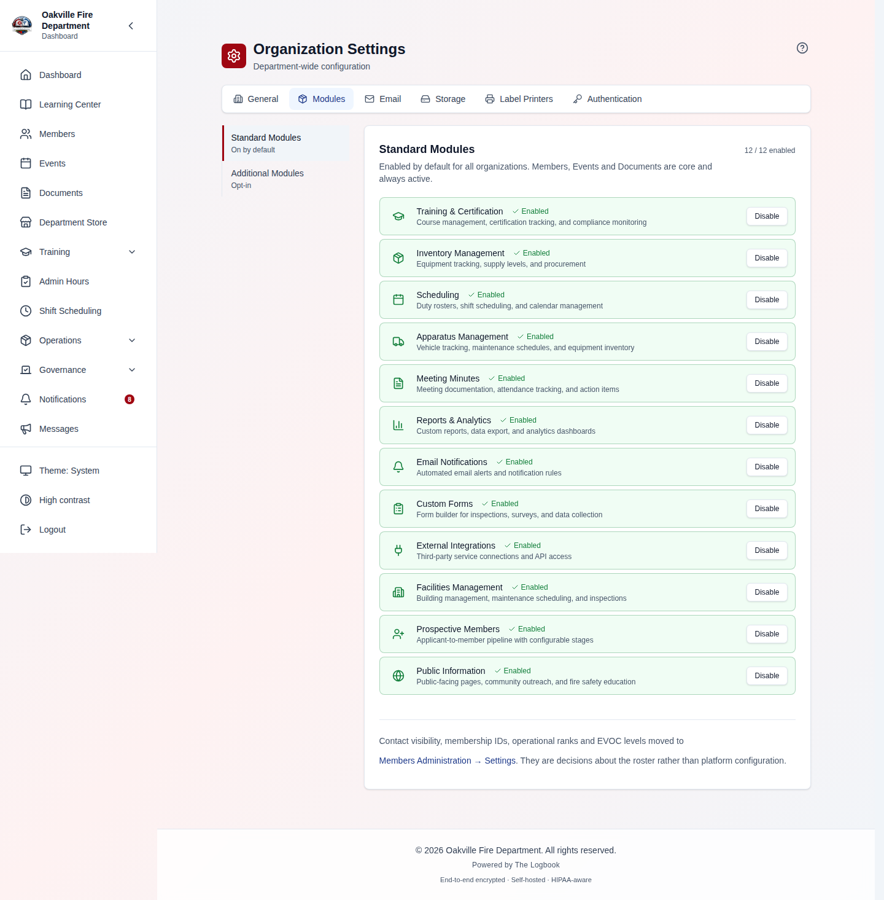

The page groups what it shows into **Standard Modules** and **Additional Modules**, each row carrying its own Enable/Disable button. The core modules listed above are not shown at all — the header says so ("Core modules (Members, Events, Documents) are always active") rather than listing them as a third, un-toggleable group.

> **Hint:** Disabling a module hides it from the navigation but does not delete any data. Re-enabling a module restores access to all previously entered data.

---

## Role and Permission Management

**Required Permission:** `positions.manage_permissions`

Navigate to **Settings > Role Management** to manage positions and their permissions.

### Understanding Roles

The Logbook uses a **position-based** permission system:

- Each member can hold **multiple positions** (e.g., "Treasurer" + "Safety Officer")
- Each position grants a set of **permissions**
- The **IT Manager** position has full wildcard access
- The **Member** position is assigned to everyone by default

### Default Positions

| Position             | Description                           |
| -------------------- | ------------------------------------- |
| **IT Manager**       | System owner with all permissions     |
| **President**        | Department president                  |
| **Vice President**   | Department vice president             |
| **Secretary**        | Meeting minutes, correspondence       |
| **Treasurer**        | Financial operations                  |
| **Chief**            | Department chief                      |
| **Safety Officer**   | Safety and compliance                 |
| **Training Officer** | Training management                   |
| **Member**           | Basic member access (default for all) |

### Managing Permissions

1. Click on a position to view its permissions.
2. Toggle individual permissions on or off.
3. Save changes.

> **Two guardrails protect against accidental or malicious lockout:**
>
> - **You can only edit a role at or below your own access level.** If a position
>   holds a permission you don't have yourself — for example, only the IT Manager
>   holds the wildcard (all-access) permission — you cannot edit that position's
>   permissions, and the save is rejected with a permissions error. This stops a
>   non-owner administrator from weakening or blanking out the System Owner role.
>   Ask an IT Manager (or anyone whose own access already covers that role) to
>   make the change.
> - **You cannot remove the last administrator.** A permission change that would
>   leave no active member able to manage members is blocked, so the department
>   can never lock itself out of member administration. If you see this error,
>   grant another position the member-management permission first, then retry.

Permission categories include:

- `members.*` - Member management
- `training.*` - Training management
- `scheduling.*` - Scheduling management
- `events.*` - Event management
- `elections.*` - Election management
- `inventory.*` - Inventory management
- `apparatus.*` - Apparatus management
- `facilities.*` - Facilities management
- `documents.*` - Document management
- `forms.*` - Form management
- `reports.*` - Report access
- `settings.*` - System settings
- `analytics.*` - Analytics access

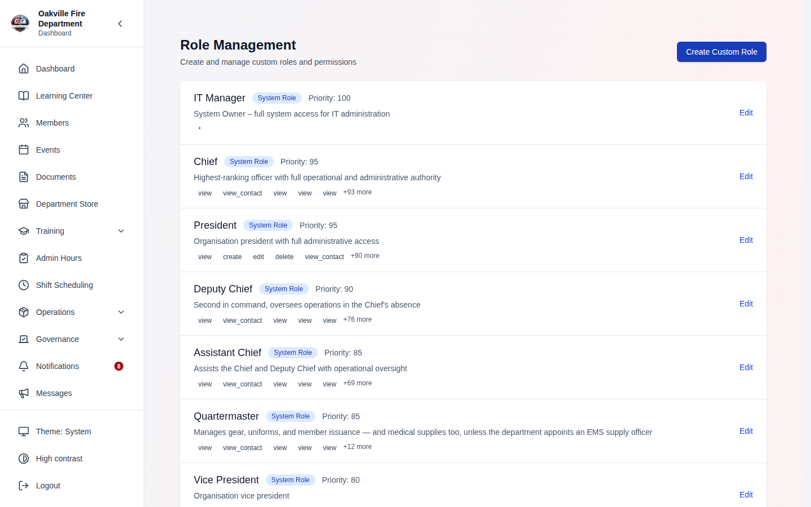

### Assigning Positions to Members

1. Navigate to a member's profile.
2. View the **Roles & Permissions** section.
3. Click **Edit Roles**.
4. Add or remove positions.
5. Save.

---

## Reports

Navigate to **Reports** in the Administration section to generate department reports.

### Available Report Types

| Report                | Description                                      |
| --------------------- | ------------------------------------------------ |
| **Member Roster**     | Full member listing with contact info and status |
| **Training Summary**  | Training hours and completions by member         |
| **Event Attendance**  | Attendance records across events                 |
| **Training Progress** | Member progress toward requirements              |
| **Annual Training**   | Year-end training compliance summary             |

### Generating a Report

1. Select a **report category**: All, Member, Training, Event, Compliance, or **Pipeline** _(added 2026-03-15)_.
2. Choose a **date range** using presets (This Year, Last Year, Last 90 Days) or a custom range.
3. Click **Generate**.
4. View the report on screen.
5. Click **Export CSV** to download for spreadsheets or external analysis.

### Pipeline Overview Report (2026-03-15)

The **Pipeline Overview** report shows prospect counts per pipeline stage with configurable stage grouping. This report helps leadership see how many applicants are at each point in the membership process.

**Configuring Stage Groups:**

1. Navigate to **Prospective Members > Settings** (`/prospective-members/settings`)
2. Scroll to the **Report Stage Groups** section
3. Click **Add Group** to create a grouping (e.g., "Early Stages")
4. Select which pipeline stages belong to this group (e.g., Application + Interview)
5. Save

> **Screenshot needed:**
> _[Screenshot of the ReportStageGroupsEditor showing two configured groups: "Early Stages" containing "Application" and "Interview" stages, and "Final Steps" containing "Background Check" and "Vote" stages. Each group shows the stage count and has edit/delete buttons]_

Stage groups with zero prospects are still shown in the report for completeness. Ungrouped stages appear individually.

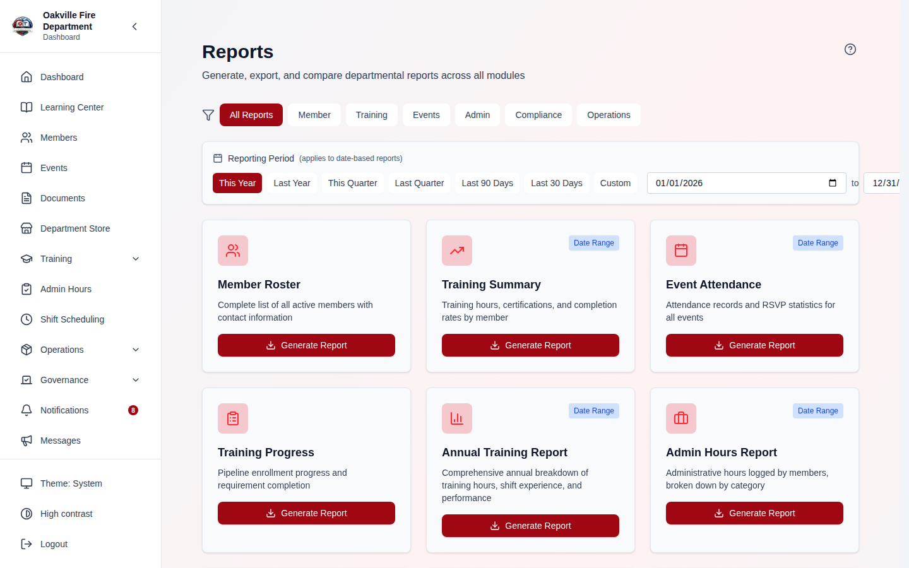

> **Hint:** Reports can be saved as bookmarks for quick access. Common reports like the annual training summary should be generated at the end of each year for compliance records.

---

## Analytics Dashboard

**Required Permission:** `analytics.view`

Navigate to **Settings > Analytics** to access the department analytics dashboard.

The dashboard provides:

- **Member Metrics** - Active/inactive counts, membership type distribution
- **Training Metrics** - Completion rates, hours logged, compliance percentages
- **Event Metrics** - Event counts, attendance rates, RSVP patterns
- **Activity Trends** - Charts showing activity over time

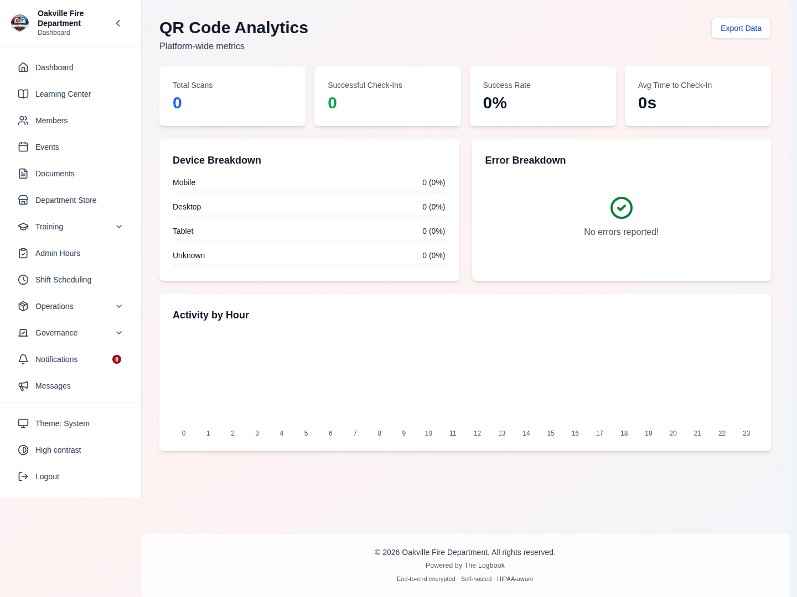

---

## Public Portal Configuration

**Required Permission:** `settings.manage`

Navigate to **Settings > Public Portal** to configure your department's public-facing content.

The public portal allows external access to:

- Public event calendar
- Public forms (applications, feedback)
- Department information

### Configuration Options

- **Enable/Disable** the public portal
- **Custom domain** or subdomain
- **Branding** (logo, colors)
- **API keys** for external integrations
- **Access logging** for security

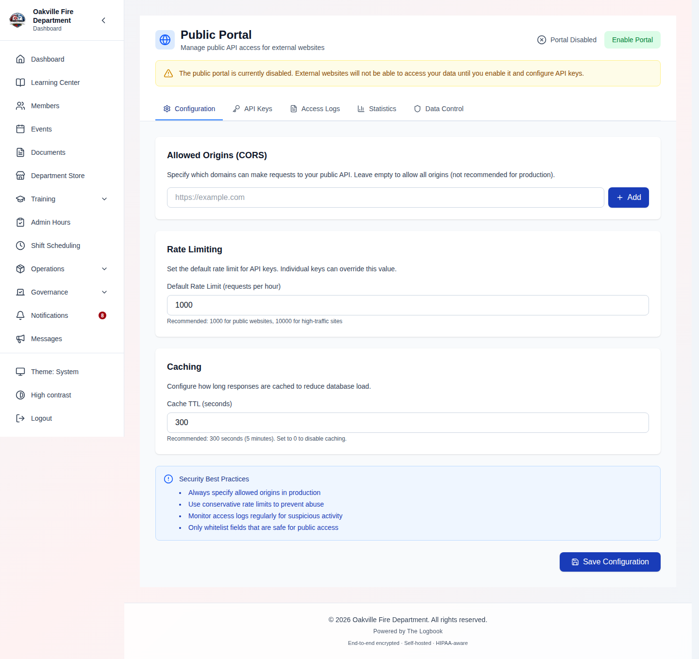

---

## Integrations _(2026-04-11)_

**Required Permission:** `integrations.manage`

Navigate to **Administration > Integrations** to manage external system connections.

### Salesforce CRM Integration

Connect The Logbook to Salesforce for bidirectional synchronization of members, training records, and events.

**Setting up the Salesforce connection:**

1. Navigate to **Integrations** and find the **Salesforce CRM** card
2. Click **Connect**
3. Enter your Salesforce **Instance URL** (e.g., `https://yourorg.salesforce.com`)
4. Enter your Salesforce **Client ID** and **Client Secret** (from a Salesforce Connected App)
5. The system tests the connection and, on success, saves the integration

> **[SCREENSHOT NEEDED]:** _Screenshot of the Integrations page showing the Salesforce CRM card with connection status (Connected/Disconnected), last sync timestamp, and Connect/Disconnect/Sync Now buttons._

**Configuring field mappings:**

After connecting, configure how Logbook fields map to Salesforce fields. Default mappings cover member contacts, training records as Tasks, and events. You can customize which fields sync and in which direction.

> **[SCREENSHOT NEEDED]:** _Screenshot of the Salesforce field mapping configuration showing a table with Logbook fields on the left, Salesforce fields on the right, and sync direction dropdowns (Push/Pull/Both)._

**Triggering a sync:**

- Click **Sync Now** on the Integrations page for a manual sync
- Or configure automatic sync via the scheduled tasks system

**Webhook setup (for real-time updates):**

To receive real-time updates from Salesforce:

1. Copy the webhook URL shown on the integration detail page
2. In Salesforce Setup, create an Outbound Message workflow that sends Contact changes to this URL
3. The webhook validates HMAC-SHA256 signatures for security

**Edge Cases:**

- If Salesforce rate limits are hit during a bulk sync, the system pauses and retries with exponential backoff
- If a member is deleted in Logbook but exists in Salesforce, the behavior depends on your conflict resolution setting
- OAuth tokens auto-refresh when expired; no manual re-authentication needed

---

## Error Monitoring

**Required Permission:** `settings.manage`

Navigate to **Settings > Error Monitor** to view system errors and issues.

This page shows:

- Recent error logs with timestamps
- Error severity levels (Info, Warning, Error, Critical)
- Error details and stack traces
- Trends and patterns
- **Source** — whether the failure was seen by the browser or the server _(2026-08-07)_
- **The technical message beside the user-facing one**, so you see the same
  guidance the member saw _(2026-08-07)_
- **Method, path and status** for any error carrying request context _(2026-08-07)_
- **Occurrence count** — repeats are counted, not collapsed into one row

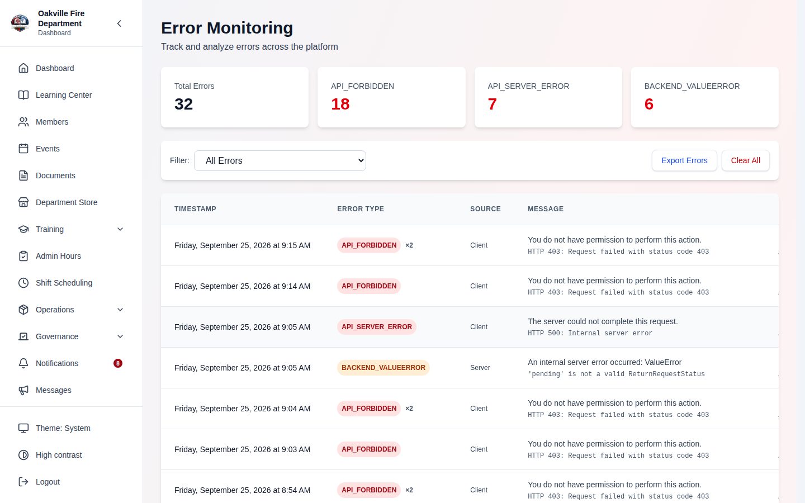

> **Hint:** Regular errors about failed login attempts are normal (they indicate the rate limiting is working). Focus on Critical and Error severity items for actual system issues.

> **Screenshot placeholder:**
> _[Screenshot of the Error Monitor page showing a table of recent errors with columns for timestamp, Source, severity (color-coded badges), the user-facing message with the technical message beneath it, method/path/status, and an occurrence count]_

### What Now Reaches This Page _(2026-08-07)_

Before this, the page received almost nothing. Most failures were visible only to
the member who hit them — a server error became a toast on their screen, a
JavaScript failure became a line in a console nobody was reading — so
investigating _"the site is broken for Dave"_ meant asking Dave.

What is now recorded automatically:

| Source      | Recorded                                                                                                          |
| ----------- | ----------------------------------------------------------------------------------------------------------------- |
| **Server**  | Every 5xx, including the ones raised as a normal error response (which is where most server errors actually live) |
| **Browser** | Failed API requests — 5xx, transport failures and timeouts, and 403                                               |
| **Browser** | Uncaught exceptions and unhandled promise rejections, which previously reached nothing at all                     |
| **Browser** | Chunk-load failures, under their own type                                                                         |

Deliberately **not** recorded: 401 (routine session expiry), 404, and validation
failures. They are ordinary and would bury the real failures.

> **A chunk-load failure means a deployment landed while somebody had the app
> open.** It is resolved differently from a genuine error — the member reloads
> and it is gone. It is typed separately so you can tell the two apart at a
> glance.

> **One server failure often produces two rows** — one from the server with the
> traceback and endpoint, one from the browser with the member and the page they
> were on. Neither is redundant: the server row is missing when the failure never
> reached the application (a gateway error), and the browser row is missing for a
> failure outside any request a user made. The **Source** column distinguishes
> them.

### Reliability of the Reports Themselves

The failures most worth recording are often the ones that break their own
delivery — a report about a network outage has to travel over the network that is
out. So:

- Reports are **queued and retried** (four attempts) and delivered one at a time,
  so a queue draining on reconnect does not stampede a server that is still
  recovering.
- They are **flushed when the page is hidden**, so a member who hits an error and
  closes the tab — the most common way an error is seen and then lost — still
  reports it.
- Errors raised **before sign-in** are held and delivered on the next login.
  Errors on the login screen are exactly what you get asked about, and they occur
  before there is a session to attribute them to.
- **Nothing is discarded silently.** When the per-minute cap or the queue bound
  drops reports, that fact is itself recorded as a `REPORTING_THROTTLED` row
  carrying the counts — so a burst reads as _"20 reports plus 340 suppressed"_
  rather than as a quiet minute.

### Privacy and Retention

- **Error text is scrubbed in the browser before it is sent** — email addresses,
  phone numbers, SSNs, bearer tokens and JWTs. Error messages quote user input and
  API payloads, and these rows are readable by every `audit.view` holder and
  downloadable as an export, so an identifier landing here would have left the
  access controls that govern it everywhere else.
- **Rows are retained 180 days by default** (30-day minimum) through the records
  retention service, so the fastest-growing operational table in the platform
  stays bounded.
- **Ingest is rate-limited per member** (120/minute) — per member rather than per
  IP address, because a department's members share one public address and an IP
  bucket would let one member's failing tab silence the whole station's reports.

> **Known gaps** are documented in
> [KNOWN_LIMITATIONS.md](../KNOWN_LIMITATIONS.md#error-monitoring-coverage-2026-08-07) —
> chiefly that background (Celery) task failures are not reported here, since a
> worker has no request to resolve a department from.

---

## Scheduled Tasks

Scheduled tasks run automatically on a schedule:

| Task                                  | Description                                                                          |
| ------------------------------------- | ------------------------------------------------------------------------------------ |
| **Process Certification Alerts**      | Send expiring certification notifications                                            |
| **Advance Membership Tiers**          | Auto-promote eligible members                                                        |
| **Process Property Return Reminders** | Send overdue return emails                                                           |
| **Detect Struggling Members**         | Flag members behind on training                                                      |
| **Mark Overdue Checkouts**            | Flag inventory checkouts past their expected return date                             |
| **Send Event Reminders**              | Deliver scheduled event reminders to RSVP'd members                                  |
| **Clean Up Sessions**                 | Remove expired login sessions                                                        |
| **Process Scheduled Emails**          | Send pending pipeline automated emails (polls every 60 seconds) _(added 2026-03-13)_ |
| **Generate Compliance Reports**       | Auto-generate scheduled compliance reports _(added 2026-03-13)_                      |

> **Screenshot placeholder:**
> _[Screenshot of the Scheduled Tasks page showing a list of tasks with name, frequency, last run time, next run time, and enabled toggle switches]_

**Not yet built:** there is no **Administration > Scheduled Tasks** page. The
tasks above are real and do run — see the in-process runner below — but the
only way to inspect them is the API: `GET /scheduled/tasks` lists every task
with its recommended cron schedule, and `POST /scheduled/run-task?task=<id>`
triggers one by hand. That last one runs across **every** organization, so it
is restricted to a platform System Owner (`system.run_tasks`), not a
department admin.

Note that even the API reports only the schedule. Last-run and next-run times
and a per-task enabled flag — the columns the placeholder describes — are not
stored anywhere, so a page for this would need backend work first. The
placeholder stays open.

## In-Process Scheduled Task Runner (2026-03-25)

The Logbook now runs scheduled tasks (shift reminders, notification cleanup, overdue checks, etc.) using a built-in asyncio task runner embedded in the backend process. This replaces the need for external cron jobs or Celery Beat for most periodic tasks.

**What runs automatically:**

- Start-of-shift reminders (every 30 minutes)
- Notification log cleanup
- Overdue inventory notifications
- Equipment check reminder generation
- Recurring event series extension
- **Training-program recert resets** (daily, 05:00)
- **Training-program enrollment expiry** (daily, 05:15) — _(2026-08-09)_ moves an
  enrollment past its target completion date to **Expired** and notifies the
  member and their training officers. It was previously folded into the weekly
  deadline-warning sweep, which left up to six days where an enrollment nobody
  had opened still read "active, N days overdue". The read-time check still
  applies too, so an enrollment somebody opens reports its true state without
  waiting for the sweep
- **Training-program deadline warnings** (weekly, Mondays 07:30) — sends warnings
  only; the schedule is **per program** as of 2026-08-09, not a fixed 30/14/7

**For IT administrators:**

- No configuration needed — tasks start automatically with the backend
- Task execution is idempotent — container restarts don't cause duplicate notifications
- Task intervals and enable/disable flags are configured in organization settings
- Logs appear in the standard backend log output with `[scheduler]` prefix

> **Screenshot needed:**
> _[Screenshot of the backend container log output showing scheduler task execution lines like "[scheduler] Running shift_reminders... [scheduler] 3 reminders sent"]_

### Edge Cases

| Scenario                                 | Behavior                                                                                                                         |
| ---------------------------------------- | -------------------------------------------------------------------------------------------------------------------------------- |
| Container restarts during task execution | Task resumes on next interval; idempotent checks prevent duplicates                                                              |
| MySQL not ready at startup               | App retries migration check up to 5 times with exponential backoff before starting scheduler                                     |
| Task throws exception                    | Error logged; other tasks continue on schedule; failed task retries at next interval                                             |
| Multiple backend replicas                | Each replica runs its own scheduler; use `DISABLE_SCHEDULER=true` env var on non-primary replicas to prevent duplicate execution |

---

## HIPAA Audit Logging Expansion _(2026-03-29)_

The following modules now include comprehensive `log_audit_event()` calls for HIPAA compliance:

| Module                       | Events Logged                                                                                                                                                                                                                                               |
| ---------------------------- | ----------------------------------------------------------------------------------------------------------------------------------------------------------------------------------------------------------------------------------------------------------- |
| **Medical Screening**        | Requirement creation/update/delete, screening record creation/update/delete (category: "medical")                                                                                                                                                           |
| **Documents**                | Document uploaded (with filename, MIME type, file size), document deleted (severity: "warning")                                                                                                                                                             |
| **Membership Pipeline**      | Pipeline created/deleted, prospect created/advanced/transferred (includes name/email in metadata)                                                                                                                                                           |
| **Messages**                 | Message creation and deletion                                                                                                                                                                                                                               |
| **Shift Completion Reports** | Report created (`shift_report_created`), updated (`shift_report_updated`), reviewed/approved/flagged (`shift_report_reviewed`), acknowledged by trainee (`shift_report_acknowledged`), bulk submitted (`shift_reports_bulk_submitted`) _(added 2026-04-07)_ |

All audit events are appended to the tamper-proof SHA-256 hash chain in the `audit_logs` table.

Find these under **Administration → Organization Settings → Audit Log** and
search for `shift_report`. The search box holds its own draft — it does not
filter until you press **Apply** — while the severity and category dropdowns
take effect the moment you change them.

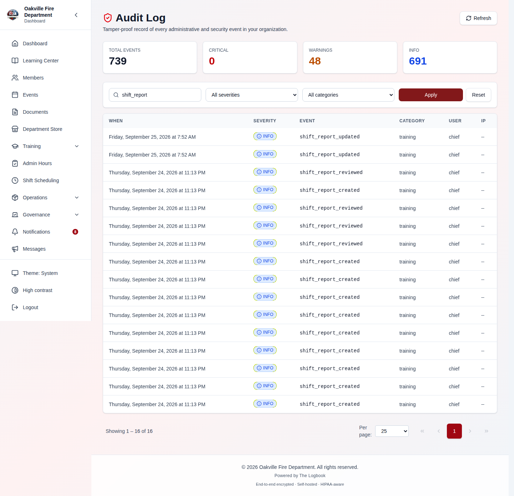

### Shift Report Security Fix _(2026-04-07)_

A critical authorization bypass was identified and fixed on the `GET /shift-reports/{report_id}` endpoint. Previously, any authenticated user in the same organization could access any shift completion report by ID, including sensitive performance ratings, officer narratives, and reviewer notes. This violated the HIPAA minimum-necessary principle.

**After the fix:**

- Only the **trainee** (subject of the report), the **filing officer**, or users with **`training.manage` permission** can access a specific report
- Trainees see **visibility-filtered data** matching the `/my-reports` endpoint behavior (e.g., if `show_performance_rating` is disabled, ratings are stripped)
- `reviewer_notes` are **always stripped** for trainees regardless of visibility settings
- Unauthorized access returns **403 Forbidden**

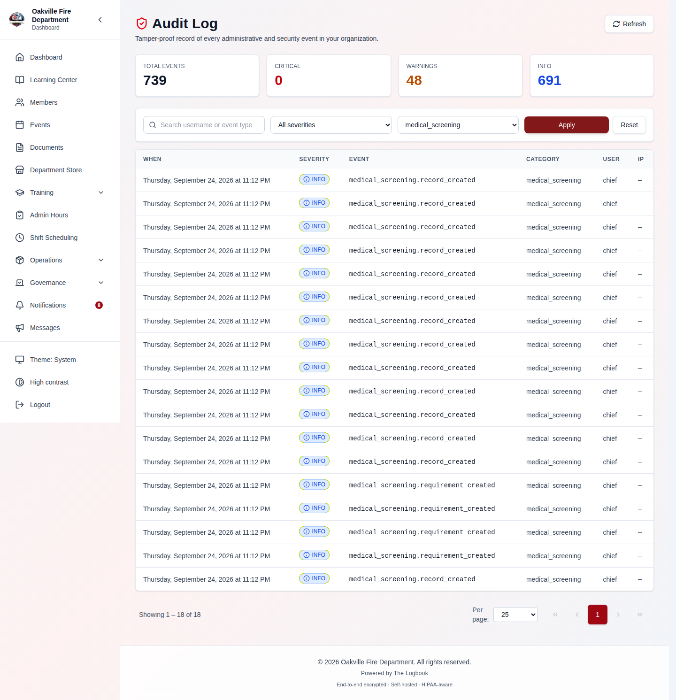

## Pagination Standardization _(2026-03-29)_

Previously unbounded list endpoints now accept `skip` and `limit` pagination parameters to prevent performance degradation with large datasets:

| Module                | Endpoints Paginated                                                                                                        |
| --------------------- | -------------------------------------------------------------------------------------------------------------------------- |
| **Finance**           | Fiscal years, budget categories, budgets, approval chains, purchase requests, expense reports, check requests, member dues |
| **Grants**            | Opportunities, applications, budget items, expenditures                                                                    |
| **Medical Screening** | Requirements, records                                                                                                      |
| **Member Leaves**     | Leave of absence list (user-specific and org-wide)                                                                         |
| **Training Waivers**  | Waiver list                                                                                                                |
| **Operational Ranks** | Ranks list                                                                                                                 |
| **Training Sessions** | Calendar listing                                                                                                           |

---

## Navigation Improvements (2026-03-24)

### Hardcoded Back Navigation

All pages that previously used `navigate(-1)` (browser back button behavior) now use hardcoded parent page paths. This prevents unexpected navigation when users arrive via deep links, bookmarks, or external URLs (e.g., email notification links).

### Breadcrumb Navigation

Pages in hierarchical sections now include breadcrumb trails showing the navigation path:

```
Dashboard > Scheduling > Shift Templates > Edit Template
```

> **Screenshot needed:**
> _[Screenshot of a scheduling sub-page showing breadcrumb navigation at the top: "Scheduling > Templates > Edit Station 1 Template" with each segment clickable]_

---

## Security and Compliance

### Session Management

The system enforces session timeouts in alignment with HIPAA session management requirements:

- Sessions expire after a configurable period of inactivity
- Members are automatically logged out when their session expires
- Active sessions can be reviewed from the admin panel

### Password Policies

- Minimum password length (configurable)
- Password history tracking (prevents reuse of recent passwords)
- Account lockout after failed attempts
- Mandatory password change on first login

### Audit Logging

All significant actions are logged for compliance:

- Member changes (creation, status changes, role assignments)
- Training record changes
- Document access
- Settings modifications
- Login/logout events

#### Reviewing the Audit Log

Admins with the `audit.view` permission can read the audit trail directly. Navigate to **Administration > Audit Log** (listed in both the top and side navigation Admin sections, next to QR Code Analytics).

1. Open **Administration > Audit Log**. The stats cards at the top show the total number of events, plus counts of **Critical**, **Warnings**, and **Info** entries.
2. Use the filter bar to narrow the list: type in the **search** box (matches username or event type), or pick a **Severity** or **Category**. Click **Reset** to clear the filters.
3. Click a row to **expand** it and see the full event details for that entry.
4. Use the pagination controls at the bottom to page through older entries.

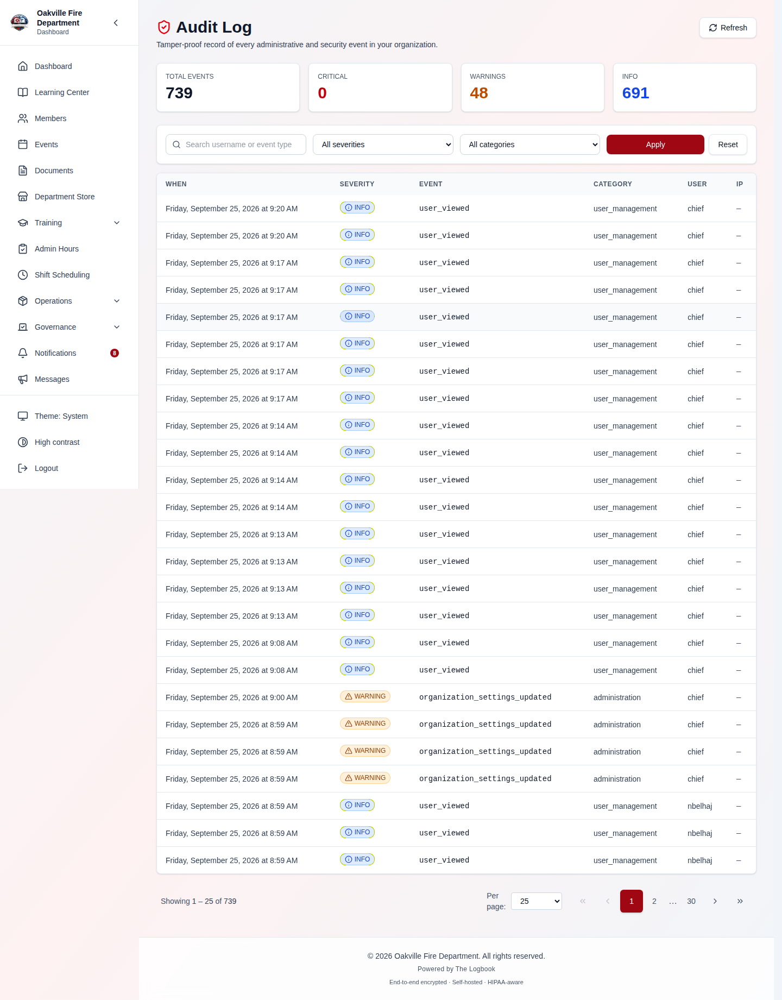

> **Note:** The audit log is scoped to your organization. That scope is the
> _only_ filter applied — an event recorded against your department with no
> acting user, such as a kiosk guest sign-in or a scheduled job, still appears,
> with **system** shown in italics in the User column. What the view never shows
> is an event belonging to another department, or a platform-wide event recorded
> against no organization at all.

### Rate Limiting

The system applies rate limiting to sensitive endpoints with specific thresholds and lockout durations:

| Endpoint       | Max Requests | Window     | Lockout Duration |
| -------------- | ------------ | ---------- | ---------------- |
| Login          | 5            | 60 seconds | 30 minutes       |
| Registration   | 3            | 60 seconds | 30 minutes       |
| Password reset | 3            | 5 minutes  | 30 minutes       |
| Token refresh  | 10           | 60 seconds | 10 minutes       |

When rate-limited, the system returns HTTP 429 with a `Retry-After` header indicating the lockout duration in seconds. Failed login attempts are also tracked per-user via the `failed_login_attempts` counter on the user record.

> **Hint:** If a member reports being locked out, check if they exceeded the login attempt limit. The lockout expires automatically after the duration above. The `Retry-After` header tells the client exactly how long to wait.

### Security Hardening (2026-03-07)

The following security measures are enforced:

- **JWT algorithm restriction**: Only HS256 accepted — `none` and RS256 tokens are rejected
- **Session invalidation on password change**: All existing sessions for a user are invalidated when their password changes
- **File upload validation**: Magic byte validation ensures uploaded files match their declared MIME type (JPEG, PNG, GIF, WebP, PDF, CSV, DOCX, XLSX). Path traversal is blocked with `secure_filename()` and UUID prefixing
- **Jinja2 sandboxing**: Email and report templates use `SandboxedEnvironment` with auto-escaping to prevent template injection
- **CORS strict matching**: Origin validation uses exact match — no subdomain wildcards
- **Parameterized LIKE queries**: Search inputs are escaped to prevent LIKE injection (`%`, `_` characters)
- **Rate limiter thread safety**: Redis-backed rate limiting uses `asyncio.Lock` for concurrent access
- **Database/Redis TLS**: DB connections use SSL context when `DB_SSL=True`. Redis connections use `rediss://` scheme when `REDIS_SSL=True`
- **Health endpoint minimized**: `/health` returns only `status` + `ready` (no environment, version, or debug info)
- **Security headers**: `Referrer-Policy: strict-origin-when-cross-origin`, `X-Permitted-Cross-Domain-Policies: none`

> **Screenshot needed:**
> _[Screenshot of the security status in the Error Monitor or a dedicated Security Dashboard showing the list of security features with green checkmarks (JWT restriction, file validation, CORS strict, TLS enabled) and any warnings in yellow]_

> **Edge case:** If your deployment uses a reverse proxy (nginx, Caddy), the `DB_SSL` and `REDIS_SSL` settings refer to the connection between the backend container and the database/Redis container — not the browser-to-server connection. Browser-to-server TLS is handled by the reverse proxy.

> **Edge case:** When you deploy behind a reverse proxy you must also set `TRUSTED_PROXY_IPS` so the backend resolves each real client IP from the `X-Forwarded-For` header. This setting now accepts CIDR ranges (e.g. `172.16.0.0/12`) as well as individual addresses. It drives geo-blocking, per-client rate limiting, and the client IP recorded in the audit log. If it is left unset behind a proxy, every request appears to come from the proxy's own address — geo-blocking silently does nothing and all clients share a single rate-limit bucket.

### Authentication & Session Edge Cases

| Scenario                                                | Behavior                                                                                                                                                                                                                                                                                                                     |
| ------------------------------------------------------- | ---------------------------------------------------------------------------------------------------------------------------------------------------------------------------------------------------------------------------------------------------------------------------------------------------------------------------- |
| Admin changes a member's roles while they are logged in | Server enforces new permissions immediately (re-queried from DB on every request). However, the frontend UI may show stale permission-based elements (buttons, menu items) until the page is reloaded or the session refreshes via `/auth/me`.                                                                               |
| Password reset requested twice within 30 minutes        | The second request returns the same success message but no email is sent. This is intentional anti-enumeration — there is no indication to the user that a cooldown is active. Reset tokens expire after 30 minutes.                                                                                                         |
| Admin resets member password with "force change"        | `password_changed_at` is intentionally NOT updated, so the user may see a password-expiry warning on their next login before they reach the change-password form. This resolves after they complete the forced password change.                                                                                              |
| Multiple browser tabs open when access token expires    | A shared refresh promise prevents races within one tab, but multiple tabs can trigger simultaneous refresh requests. If two tabs refresh at the same time, the second may see the rotated token as invalid, triggering a full session revocation across all tabs. Closing extra tabs before the session timeout avoids this. |
| Member soft-deleted by admin                            | The user's next API request returns 401 (deleted users are filtered out of token validation). However, sessions are not proactively revoked — the session record stays in the database as an orphan until it expires naturally.                                                                                              |
| Server restarts or deploys during active sessions       | In-memory rate limiters reset (Redis-backed limiters are persistent). Encryption ciphers are re-initialized from the current `ENCRYPTION_KEY`. If the key was rotated without restart, data encrypted with the old key cannot be decrypted.                                                                                  |
| Brief database outage during page refresh               | If `GET /auth/me` returns 503 or a network error, the frontend clears `has_session` and logs the user out. The user must log in again when the database recovers.                                                                                                                                                            |
| Concurrent session count                                | There is no enforced limit on simultaneous sessions. A monitoring threshold of 3 concurrent sessions triggers an anomaly alert but does not block additional logins.                                                                                                                                                         |

---

## Realistic Example: Generating the Annual Training Summary Report

This walkthrough demonstrates generating the year-end training compliance report that many departments submit to their governing body, insurance carrier, or state fire marshal's office.

### Background

**Chief Barbara Owens** of **Pinecrest Volunteer Fire Company** needs to generate the annual training report for the year 2025 to present at the January board meeting and submit to the county fire coordinator.

She needs: total training hours per member, compliance percentages against state-mandated minimums, certification statuses, and an exportable format for the county submission.

---

### Step 1: Generating the Report

Chief Owens navigates to **Administration > Reports**.

1. **Report Category:** Training
2. **Report Type:** Annual Training Summary
3. **Date Range Preset:** Last Year (January 1 – December 31, 2025)
4. Clicks **Generate**

The report loads on screen, showing a department summary and per-member breakdown.

---

### Step 2: Understanding the Report Output

**Department Summary (top of report):**

| Metric                                   | Value      |
| ---------------------------------------- | ---------- |
| **Total Active Members**                 | 32         |
| **Total Training Hours Logged**          | 1,847      |
| **Average Hours per Member**             | 57.7       |
| **Members Meeting All Requirements**     | 28 (87.5%) |
| **Members with Expiring Certifications** | 4          |
| **Members on Leave (excluded)**          | 2          |

**Per-Member Detail Table:**

| Member        | Rank         | Hours | Req. Hours | Compliance | Certs Active | Certs Expiring | Notes                         |
| ------------- | ------------ | ----- | ---------- | ---------- | ------------ | -------------- | ----------------------------- |
| Adams, John   | Captain      | 78.5  | 36         | 100%       | 5            | 0              |                               |
| Brooks, Sarah | Lieutenant   | 64.0  | 36         | 100%       | 4            | 1              | CPR expires Mar 2026          |
| Carter, David | Firefighter  | 42.0  | 36         | 100%       | 3            | 0              |                               |
| Diaz, Maria   | Firefighter  | 55.5  | 36         | 100%       | 3            | 0              |                               |
| Evans, Tom    | Probationary | 88.0  | 72         | 100%       | 2            | 0              | Probationary (2x req.)        |
| Foster, Amy   | Firefighter  | 28.0  | 36         | 78%        | 3            | 1              | **Below minimum**             |
| Garcia, Luis  | Firefighter  | 18.0  | 24         | 75%        | 3            | 0              | LOA: 4 months (req. adjusted) |
| Harris, Ken   | Firefighter  | 31.0  | 36         | 86%        | 2            | 1              | **Below minimum**             |
| ...           | ...          | ...   | ...        | ...        | ...          | ...            |                               |

**Key details in this table:**

- **Evans** (Probationary) has a higher requirement (72 hours) reflecting the department's probationary training standard
- **Garcia** was on a 4-month Leave of Absence, so his requirement was adjusted from 36 to 24 hours (36 x 8/12). He completed 18 of 24 hours — still below minimum.
- **Foster** and **Harris** are below the 36-hour minimum and flagged for follow-up
- **Brooks** has a CPR certification expiring in March — she should renew before it lapses

---

### Step 3: Exporting for the County

Chief Owens clicks **Export CSV**. The download contains:

```
CSV File: pinecrest_training_summary_2025.csv

member_name, rank, status, total_hours, required_hours, compliance_pct,
    certs_active, certs_expiring, leave_months, notes
"Adams, John", Captain, Active, 78.5, 36, 100, 5, 0, 0, ""
"Brooks, Sarah", Lieutenant, Active, 64.0, 36, 100, 4, 1, 0, "CPR expires Mar 2026"
"Carter, David", Firefighter, Active, 42.0, 36, 100, 3, 0, 0, ""
"Diaz, Maria", Firefighter, Active, 55.5, 36, 100, 3, 0, 0, ""
"Evans, Tom", Probationary, Active, 88.0, 72, 100, 2, 0, 0, "Probationary requirement"
"Foster, Amy", Firefighter, Active, 28.0, 36, 78, 3, 1, 0, "Below minimum"
"Garcia, Luis", Firefighter, Active, 18.0, 24, 75, 3, 0, 4, "LOA adjusted"
"Harris, Ken", Firefighter, Active, 31.0, 36, 86, 2, 1, 0, "Below minimum"
...
```

This CSV can be opened in Excel, attached to the county submission form, or imported into the county's reporting portal.

---

### Step 4: Following Up on Non-Compliant Members

Based on the report, Chief Owens takes action:

1. **Foster and Harris** — Sends a department message (via **Communications → Messages**) reminding them of the minimum training requirement and asking them to schedule makeup training in Q1 2026.
2. **Garcia** — Reviews his LOA to confirm the adjusted requirement is correct. His 18/24 hours means he still has a gap — she notes this for his return-to-duty plan.
3. **Brooks** — Adds a note to follow up in February about CPR renewal.

> **Hint:** Generate this report quarterly (not just annually) to catch compliance gaps early. Members who are behind at the 6-month mark have time to catch up before year-end.

---

## Realistic Example: First-Time Department Setup

This walkthrough covers the initial setup of The Logbook for a department that just signed up — walking through the setup checklist from empty system to ready-to-use.

### Background

**IT Manager Steve Park** has been tasked with setting up The Logbook for **Valley Creek Fire Protection District**. The district has 45 members, 2 stations, 5 apparatus, and runs a combination career/volunteer model.

---

### Step 1: Department Profile

Steve logs in with the initial admin account and lands on the **Department Setup Checklist**. He starts with Step 1: Department Profile.

| Field                | Value                                         |
| -------------------- | --------------------------------------------- |
| **Department Name**  | Valley Creek Fire Protection District         |
| **Department Type**  | Fire/EMS Combined                             |
| **FDID**             | 29-4521                                       |
| **State ID**         | MO-VCFPD                                      |
| **Timezone**         | America/Chicago                               |
| **Phone**            | (555) 867-5309                                |
| **Email**            | admin@valleycreekfire.org                     |
| **Physical Address** | 100 Fire Station Road, Valley Creek, MO 63001 |

He uploads the department logo (PNG, 512x512). The checklist marks Step 1 as complete.

---

### Step 2: Configure Roles

Steve reviews the default positions and adjusts permissions:

- **Chief** — Adds `settings.manage` permission (Chief wants direct access to settings)
- **Training Officer** — Confirms `training.manage` is enabled
- **Quartermaster** — Creates a new custom position with `inventory.manage` and `apparatus.manage`
- **Secretary** — Confirms `events.manage` and `elections.manage` are enabled
- **Member** — Confirms base permissions (view events, view documents, submit training, view own profile)

He assigns himself the **IT Manager** position (full access).

---

### Step 3: Import Members

Rather than adding 45 members one by one, Steve uses CSV import:

1. Downloads the CSV template
2. Fills it in with member data from the district's existing spreadsheet. Only
   `firstName`, `lastName` and `email` are required, so he keeps the columns he
   has data for and deletes the rest:

```csv
firstName,lastName,email,username,primaryPhone,rank,station,membershipNumber,joinDate
John,Adams,jadams@email.com,jadams,(555)111-0001,Captain,Station 1,VCF-001,2008-06-15
Sarah,Brooks,sbrooks@email.com,sbrooks,(555)111-0002,Lieutenant,Station 1,VCF-002,2012-03-20
David,Carter,dcarter@email.com,dcarter,(555)111-0003,Firefighter,Station 1,VCF-003,2018-09-01
...
```

3. Uploads the CSV. The upload is accepted with a note listing the optional
   columns he left out
4. Reviews the preview of the first five rows, then confirms the import
5. One row fails — a member's email was mistyped and rejected as a duplicate.
   The results panel names the row number; Steve corrects that row and
   re-uploads just it
6. **Send Welcome Email** is on by default — all 45 members receive login
   credentials

> **Hint:** Steve leaves `membershipNumber` blank for three new recruits who
> have not been assigned one; the system generates theirs. He also drops the
> `role` column from his spreadsheet — the district's role names don't match
> what he configured in Step 2, and an unmatched name fails the row.

---

### Step 4: Enable Modules

Steve navigates to **Settings > Organization > Modules** and enables the modules the district needs:

| Module                       | Action                                         |
| ---------------------------- | ---------------------------------------------- |
| Training & Certification     | **Enable** (state requires training tracking)  |
| Facilities Management        | **Enable** (2 stations to manage)              |
| Prospective Members Pipeline | **Enable** (active recruitment program)        |
| Incidents & Reports          | Leave disabled (using separate CAD/RMS system) |
| HR & Payroll                 | Leave disabled (handled by county HR)          |
| Grants & Fundraising         | Leave disabled (for now)                       |

The newly enabled modules appear in the sidebar immediately.

---

### Step 5: Add Stations and Apparatus

**Stations:**
Steve navigates to **Facilities** and adds both stations:

| Station        | Address               | Bays | Type         |
| -------------- | --------------------- | ---- | ------------ |
| Station 1 (HQ) | 100 Fire Station Road | 4    | Fire Station |
| Station 2      | 2850 Valley Pike      | 2    | Fire Station |

**Apparatus:**
He navigates to **Apparatus** and adds the fleet:

| Unit     | Type    | Year | Make/Model       | Station   |
| -------- | ------- | ---- | ---------------- | --------- |
| Engine 1 | Engine  | 2020 | Pierce Enforcer  | Station 1 |
| Engine 2 | Engine  | 2015 | Pierce Saber     | Station 2 |
| Ladder 1 | Ladder  | 2018 | Pierce Ascendant | Station 1 |
| Rescue 1 | Rescue  | 2021 | Horton 623       | Station 1 |
| Chief 1  | Command | 2023 | Ford Explorer    | Station 1 |

---

### Step 6: Set Up Training Requirements

Steve works with the Training Officer to configure the state-mandated training requirements:

| Requirement                | Type              | Frequency | Required Value | Due Date Type        |
| -------------------------- | ----------------- | --------- | -------------- | -------------------- |
| Annual Training Minimum    | Hours             | Annual    | 36 hours       | Calendar Period      |
| Probationary Training      | Hours             | Annual    | 72 hours       | Calendar Period      |
| SCBA Fit Test              | Certification     | Annual    | 1              | Fixed Date           |
| CPR/AED Certification      | Certification     | Biannual  | 1              | Certification Period |
| Hazmat Awareness Refresher | Course Completion | Annual    | 1              | Calendar Period      |

---

### Step 7: Verify and Go Live

Steve walks through the remaining checklist items:

- **Notification Setup** — Configures notification rules via the **Notification Rules & Logs** page (`/notifications`). Creates rules with triggers (event_reminder, training_expiry, schedule_change, etc.), assigns channels (email, in-app), and tests delivery. The Send Log tab shows delivery history with channel filtering (All / Email / In-App)
- **Scheduling Settings** — Configures shift templates for the 24/48 rotation
- **Document Folders** — Verifies the default folder structure and adds "Mutual Aid Agreements" and "Budget" folders

The setup checklist shows all steps complete. The system is ready for use.

**Total time from first login to operational:** Steve completed the setup in a single afternoon, with the CSV import handling the bulk of the member data entry.

> **Hint:** The Department Setup Checklist remains accessible after initial setup. Return to it any time to verify configuration or adjust settings as the department's needs change.

---

## Medical Screening Module (2026-03-13)

**Required Permission:** `medical_screening.view` (view) / `medical_screening.manage` (manage)

The Medical Screening module tracks health screenings, physicals, drug tests, and fitness assessments for members and prospective members. Enable it in **Settings > Organization > Modules**.

### Screening Types

| Type               | Description                                             |
| ------------------ | ------------------------------------------------------- |
| Physical Exam      | Annual or periodic physical examination                 |
| Medical Clearance  | Clearance for return to duty or specific activities     |
| Drug Screening     | Random or scheduled substance screening                 |
| Vision/Hearing     | Vision and hearing tests                                |
| Fitness Assessment | Physical fitness evaluation                             |
| Psychological      | Psychological evaluation or fitness-for-duty assessment |

### Setting Up Requirements

1. Navigate to **Medical Screening** in the sidebar
2. Click the **Requirements** tab
3. Click **Add Requirement**
4. Configure:
   - **Name** — descriptive name (e.g., "Annual Physical Exam")
   - **Type** — select from the screening types above
   - **Frequency** — how often the screening is required (in months). Leave empty for one-time screenings
   - **Applies to Roles** — which roles this requirement applies to (e.g., all firefighters, officers only)
   - **Grace Period** — days after expiration before marking non-compliant (default: 30)
5. Click **Save**

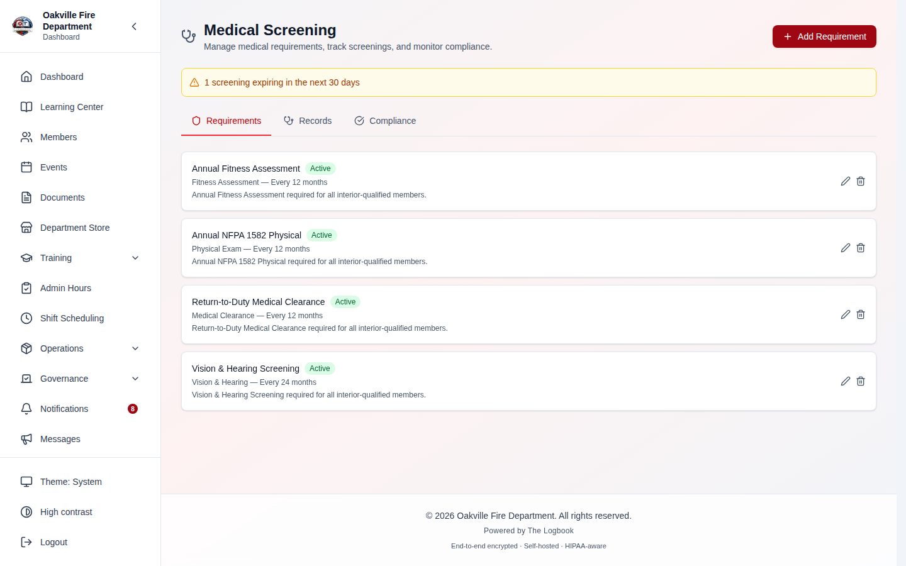

### Recording Screenings

1. Click the **Records** tab
2. Click **Add Record**
3. Select the **member** (or prospect) and the **requirement**
4. Enter the scheduled date, provider name, and any notes
5. After the screening is completed, update the record with:
   - **Status**: Passed, Failed, Pending Review, or Waived
   - **Completed date** and **expiration date**
   - **Result summary** and detailed result data

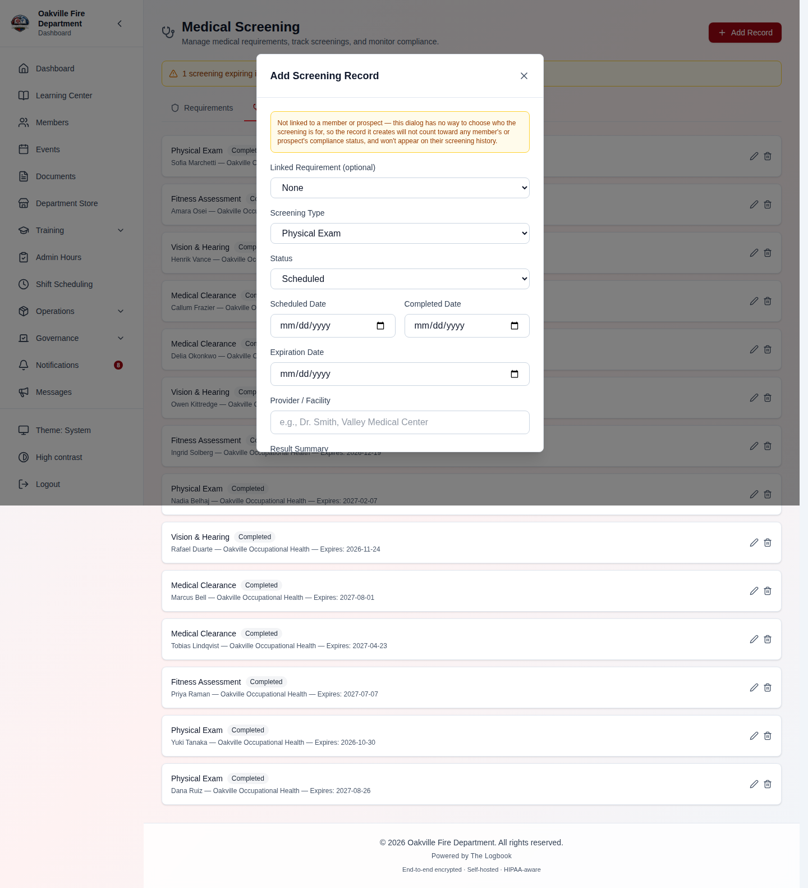

### Compliance Dashboard

The compliance dashboard shows:

- Overall compliance rate by screening type
- Members with expiring screenings (configurable: 30/60/90 days)
- Overdue screenings requiring immediate attention
- Drill-down to individual member compliance details

> **Screenshot needed:**
> _[Screenshot of the ComplianceDashboard showing compliance rate cards for each screening type, a list of expiring screenings with member names and dates, and an overdue screenings alert section]_

### Edge Cases

| Scenario                          | What Happens                                                                   |
| --------------------------------- | ------------------------------------------------------------------------------ |
| One-time screening (no frequency) | Does not recur; no automatic expiration tracking                               |
| Prospect converted to member      | Screening records are preserved and can be re-linked to the new user account   |
| Requirement deactivated           | Existing records preserved; requirement excluded from future compliance checks |
| Grace period exceeded             | Member marked non-compliant in compliance dashboard and reports                |

---

## Compliance Requirements Configuration (2026-03-13)

**Required Permission:** `settings.manage`

Navigate to the compliance officer dashboard and click **Configure Requirements** to access the compliance configuration page.

### Configuring Thresholds

1. Choose a **threshold type**:
   - **Percentage** — Members are compliant if they meet X% of requirements
   - **All Required** — Members must meet 100% of requirements to be compliant
2. Set the **compliant threshold** (default: 100%) and **at-risk threshold** (default: 75%)
3. Set the **grace period** (days after deadline before marking non-compliant)
4. Click **Save**

### Creating Compliance Profiles

Profiles allow different compliance standards for different groups:

1. Click **Add Profile**
2. Set:
   - **Name** — e.g., "Line Officers", "Probationary Members"
   - **Membership types** — which membership types this profile applies to
   - **Roles** — which roles this profile targets
   - **Required requirements** — training requirements that must be met
   - **Optional requirements** — tracked but not required for compliance
   - **Threshold overrides** — optionally set different thresholds for this group
3. Set **priority** — when a member matches multiple profiles, the highest-priority profile applies

> **Screenshot needed:**
> _[Screenshot of the ComplianceRequirementsConfigPage showing the threshold configuration section at the top, a list of compliance profiles with name, targeted groups, and threshold values, and an "Add Profile" button]_

### Automated Reporting

1. Set the **report frequency**: Monthly, Quarterly, or Yearly
2. Configure **email recipients** — who receives the reports
3. Set the **day of month** for report generation
4. Optionally enable **non-compliant member notifications** with configurable lead times (e.g., notify 30, 14, and 7 days before deadline)

### Generating Reports On-Demand

1. Click **Generate Report** from the compliance config page
2. Select the report type (monthly or yearly)
3. Optionally check **Send via email**
4. The report shows overall compliance rates, per-member status, and trends

> **Screenshot needed:**
> _[Screenshot of the report generation dialog showing report type selector, send via email checkbox, additional recipients field, and a preview of a generated compliance report with member status table]_

---

## Troubleshooting

| Issue                                                 | Solution                                                                                                                                                                                                     |
| ----------------------------------------------------- | ------------------------------------------------------------------------------------------------------------------------------------------------------------------------------------------------------------ |
| Cannot access admin settings                          | Verify you have the `settings.manage` permission. Only IT Manager and certain officer positions have this by default.                                                                                        |
| Module toggle not saving                              | Refresh the page and try again. Check for any error messages in the notification area.                                                                                                                       |
| Report showing no data                                | Verify the date range includes the period you are interested in. Some reports require specific data to exist (e.g., training records, event attendance).                                                     |
| Cannot assign a position to a member                  | Verify you have `positions.manage_permissions` permission. The IT Manager position can always assign roles.                                                                                                  |
| Scheduled task not running                            | Check that the task is enabled. If the system was recently restarted, tasks may take one cycle to resume.                                                                                                    |
| Public portal not accessible                          | Verify the public portal is enabled and the domain/URL is configured correctly. Check that API keys are active.                                                                                              |
| Error monitor showing many errors                     | Some errors are expected (failed login attempts, rate limiting). Focus on Critical and Error severity items.                                                                                                 |
| Email templates page not visible                      | Navigate to **Administration > Email Templates**. Requires `settings.manage` permission.                                                                                                                     |
| "Data truncated" error on email template              | Run `alembic upgrade head` to sync the MySQL ENUM with the new template types.                                                                                                                               |
| Email template preview shows placeholder data         | As of 2026-03-02, template preview loads live organization data. Clear browser cache to get the updated preview.                                                                                             |
| Cannot send test email to specific member             | Use the member dropdown in the preview panel to select a recipient for test emails.                                                                                                                          |
| Email scheduling not available                        | Email scheduling was added 2026-03-02. Ensure you are on the latest version.                                                                                                                                 |
| Standard modules missing after fresh install          | Standard modules now default to enabled. If missing, check **Settings > Modules** and enable them. The Settings UI has been redesigned with module cards.                                                    |
| OrganizationSettings page crashes                     | Update to the latest version. A crash in the `redacted()` method and an auth secret leak have been fixed.                                                                                                    |
| Physical Address not visible in Organization Settings | As of 2026-03-04, Organization Settings > General includes a Physical Address section with a "Same as mailing address" toggle. Physical address data entered during onboarding is now displayed here.        |
| Admin hours summary categories showing "undefined"    | Fixed in March 2026 — type mismatch between snake_case frontend types and camelCase API response. Pull latest and rebuild.                                                                                   |
| Admin hours clock-in shows "already clocked in"       | You have an active session in the same category. Clock out first, or check the dashboard for your active session.                                                                                            |
| Admin hours clock-in fails with "active session"      | You have an active session in a different category. The system allows only one active clock-in at a time across all categories. Clock out of the current session first.                                      |
| Admin hours category shows "no longer active"         | The category has been deactivated by an administrator. You cannot clock into inactive categories. Contact your admin.                                                                                        |
| Admin hours manual entry rejected                     | Manual entries are validated: clock-out must be after clock-in, clock-in cannot be in the future, and duration must be at least 1 minute.                                                                    |
| Admin hours pending entry rejected without reason     | Rejection requires a reason. The reviewer must provide a rejection reason when denying a pending entry.                                                                                                      |
| Email templates return 500 error                      | Fixed in March 2026 — missing `duplicate_application` enum value in database. Run `alembic upgrade head` and restart.                                                                                        |
| Email templates missing CC/BCC fields                 | As of 2026-03-04, each template supports default CC/BCC. BCC also available for scheduled emails. Run latest migration.                                                                                      |
| Onboarding redirects to /login after Step 7           | Fixed in March 2026 — system owner creation now sets httpOnly auth cookies. Pull latest backend code and restart.                                                                                            |
| Events Settings page layout changed                   | As of 2026-03-04, the Events Settings page uses a sidebar + content panel layout matching Organization Settings, replacing the previous collapsible sections.                                                |
| Reports page only shows basic views                   | As of 2026-03-04, the Reports module has been expanded into a dedicated feature module with 12 report types. Pull latest to access the full reports experience.                                              |
| Medical Screening module not visible                  | Enable Medical Screening for your organization in **Organization/Admin Settings > Modules** (`enabled_modules`). _(added 2026-03-13)_                                                                        |
| Compliance shows 0% with requirements defined         | Verify screening records exist for the member and that the requirement is active. Check that the member's role matches the requirement's `applies_to_roles` configuration.                                   |
| Compliance report generation fails                    | Check the error message in the report list. Common causes: no compliance config defined (use **Initialize** first), or SMTP not configured for email delivery.                                               |
| Scheduled emails not sending                          | Verify SMTP is configured in Settings > Email. Check that the background email scheduler is running (polls every 60 seconds). For Gmail, use STARTTLS on port 587 with an app password. _(fixed 2026-03-13)_ |
| Compliance config "already exists" error              | Use the update endpoint (PUT) instead of initialize (POST) after first-time setup. The initialization endpoint is for first-time configuration only.                                                         |
| Date/time displays show UTC instead of local time     | Fixed 2026-03-14 — a SQLAlchemy `load` event listener now stamps all naive datetimes with UTC tzinfo. ESLint rules enforce use of `dateFormatting.ts` utilities. Pull latest and restart.                    |
| Pipeline overview report missing                      | Added 2026-03-15 — new `PipelineOverviewRenderer` in Reports module. Configure stage grouping in Pipeline Settings > Report Stage Groups.                                                                    |
| Pipeline report stage groups                          | Configure in Pipeline Settings. Groups combine multiple stages into labeled groups (e.g., "Early Stages" = Application + Interview) for the pipeline overview report.                                        |
| Modal cannot be closed by clicking backdrop           | Fixed 2026-03-14 — all modals across the app now have correct backdrop click-to-dismiss and z-index stacking. Pull latest frontend code.                                                                     |
| Dark mode backgrounds bleeding through                | Fixed 2026-03-18 — overlays, dropdowns, drawer panels, and sticky elements now use opaque backgrounds in dark mode. Pull latest frontend.                                                                    |
| High-contrast mode missing styles                     | Fixed 2026-03-18 — high-contrast variants added across 25+ files. Pull latest frontend.                                                                                                                      |
| API datetime fields missing timezone                  | Fixed 2026-03-16 — all API response schemas now inherit from `UTCResponseBase` which stamps naive datetimes with `+00:00`. Pull latest backend.                                                              |
| Equipment check reports not showing                   | Navigate to `/scheduling/equipment-check-reports`. Requires `equipment_check.manage` permission. At least one check must be submitted. _(added 2026-03-19)_                                                  |
| Operational ranks eligible positions not saving       | Ensure you are on the latest migration. The `eligible_positions` JSON column was added 2026-03-19. Run `alembic upgrade head`.                                                                               |
| Scheduling admin pages return 404                     | Admin tabs were extracted into dedicated routes (`/scheduling/templates`, `/scheduling/patterns`, etc.) in 2026-03-19. Pull latest frontend.                                                                 |

---

## Dark Mode & Accessibility (2026-03-18)

Dark mode and high-contrast mode have been hardened across the application:

- **Opaque backgrounds**: All overlays, dropdowns, drawer panels, and sticky elements now use opaque backgrounds instead of transparent/semi-transparent that caused content bleed-through in dark mode
- **Comprehensive dark variants**: Added `dark:` Tailwind variants across 25+ files for icon badges, stat cards, settings UI, form inputs, and table rows
- **High-contrast support**: Additional high-contrast CSS variants for accessibility compliance

> **Screenshot needed:**
> _[Screenshot comparing the same page in light mode and dark mode side-by-side, showing a dropdown or overlay with the opaque background correctly rendering in dark mode without content bleeding through]_

## UTC Timezone Consistency (2026-03-16)

All API response schemas now inherit from `UTCResponseBase`, which automatically stamps naive `datetime` fields with UTC timezone info (`+00:00` suffix). This ensures JavaScript correctly interprets times as UTC and applies local timezone conversion.

**What changed:**

- Previously, some API datetime fields were returned without timezone info, causing JavaScript's `new Date()` to treat them as local time
- Now, all datetime fields include `+00:00` (equivalent to `Z`), so UTC-to-local conversion works correctly
- Combined with the existing SQLAlchemy `load` event listener (which stamps datetimes at ORM level), timezone consistency is enforced at both the database and API layers

> **Edge case:** Response schemas with `Optional[datetime]` skip stamping when the value is `None`. The validator runs as `model_validator(mode="before")` so it processes raw dict data before Pydantic validation.

---

## Notification Enhancements (2026-03-22)

### Dashboard Notification Management

Dashboard notification cards now include **clear** and **dismiss** buttons directly on each card:

- **Dismiss**: Hides the notification from the user's dashboard (personal action)
- **Clear**: Marks the notification as read

> **Screenshot needed:**
> _[Screenshot of the Dashboard notifications area showing notification cards with dismiss (X) and clear (checkmark) buttons visible on each card]_

### Department Messages

Administrators post department announcements from **Communications → Messages**
(`notifications.manage`). Beyond simple persistent notices, messages support
priority-based **email/SMS escalation**, **required acknowledgment** with a
who-has-not-acknowledged report, **scheduled send**, and in-place **editing**.

1. Navigate to **Communications → Messages** and click **New message**.
2. Enter the title and body, set priority and audience, and optionally toggle
   **Persistent** / **Require acknowledgment** or set a schedule.
3. Members see it in the app; urgent and acknowledgment-required messages are
   also emailed (urgent adds SMS when configured).

For the full workflow — acknowledgment reports, scheduling, targeting, and
member notification controls — see
[Documents, Forms & Communications → Department Messages](./07-documents-forms.md#department-messages).

> **Edge case:** Non-admin users cannot dismiss persistent messages. The dismiss button is hidden for regular members; only admins see the "Clear" action.

### Notification Channel Filter

The Notifications page now includes a **channel filter** to view notifications by delivery method:

| Filter | Shows                                                  |
| ------ | ------------------------------------------------------ |
| All    | All notifications regardless of delivery channel       |
| Email  | Only email-delivered notifications                     |
| In-App | Only in-app notifications (bell icon)                  |
| SMS    | Only SMS-delivered notifications (when Twilio enabled) |

> **Screenshot needed:**
> _[Screenshot of the Notifications page showing channel filter tabs (All, Email, In-App, SMS) at the top with the In-App filter active]_

**Not yet built:** the channel filter. The Notifications page's tabs are
**My Notifications**, **Notification Rules**, **Email Templates** and
**Send Log** — the first is the member's in-app inbox, and the last is the
delivery history, where a channel column is the closest thing to the filter
described above. Nothing on either lets you narrow the view to one channel.
The placeholder stays open until it does.

## Email Deliverability (2026-03-22)

Email delivery has been improved for compatibility with Gmail, Microsoft, and other major providers:

- **Message-ID header**: Satisfies DKIM/SPF authentication requirements
- **Batch rate limiting**: Prevents bulk-send throttle triggers
- **Inline CSS**: Gmail strips `<style>` tags; styles are now inlined on elements
- **SMTP connection reuse**: Better performance for large recipient batches
- **Logo hosting**: Hosted URLs instead of base64 data URIs prevent Gmail message clipping

For DNS and SMTP configuration, see the [Email Deliverability Guide](../EMAIL_DELIVERABILITY.md).

## Equipment Check Template Builder UX (2026-03-22)

The equipment check template builder received UX improvements:

- **Redesigned layout**: Better visual hierarchy and workflow organization
- **Preview mode**: See how the check form will appear to members before saving
- **Save redirect**: Correctly redirects to template list after saving
- **Input stability**: Fixed inputs losing focus after each keystroke

> **Screenshot needed:**
> _[Screenshot of the equipment check template builder showing the redesigned layout with a preview panel on the right showing how the check form will appear to members on mobile]_

## Time Picker Redesign (2026-03-22)

The `TimeQuarterHour` component has been redesigned with three separate dropdown selects:

| Dropdown   | Options        |
| ---------- | -------------- |
| **Hour**   | 1 through 12   |
| **Minute** | 00, 15, 30, 45 |
| **AM/PM**  | AM, PM         |

This replaces the previous single text input that was harder to use on mobile and didn't enforce quarter-hour increments visually.

> **Screenshot needed:**
> _[Screenshot of the redesigned TimeQuarterHour component showing three separate dropdown selectors (Hour: "2", Minute: "30", AM/PM: "PM") in a compact horizontal layout]_

---

## Notifications Overhaul (2026-03-24)

### Unread Notification Badges

The bell icon in the top navigation bar and the Notifications link in the side navigation now show an **unread count badge**. The badge updates automatically via smart polling — polling pauses when the browser tab is hidden and refetches immediately when you return to the tab.

> **Screenshot needed:**
> _[Screenshot of the top navigation bar showing the bell icon with a red badge showing "5" (unread count), next to the user avatar and settings gear]_

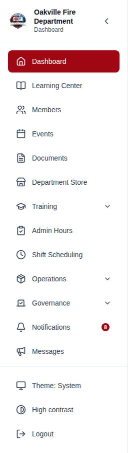

### Batch Mark All as Read

A new **"Mark All Read"** button on the Notifications inbox clears all unread notifications in a single action. This uses a dedicated batch endpoint (`POST /notifications/logs/read-all`) for efficiency.

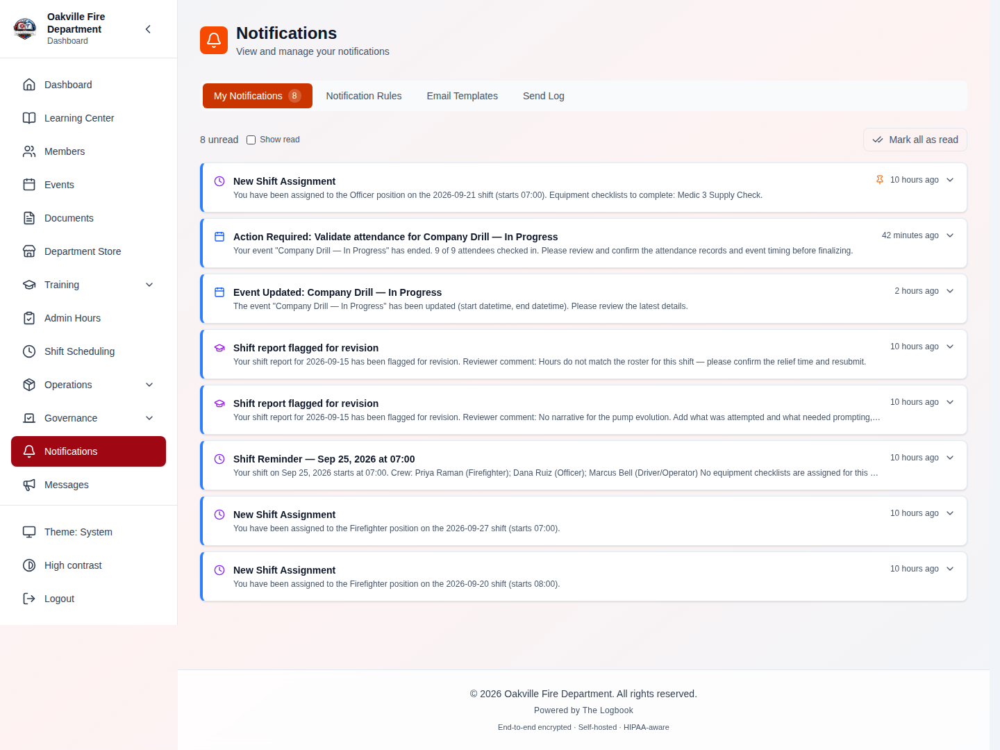

### Read/Unread Filter and Pagination

The Notifications inbox now includes:

- **"Show read" toggle** to filter between unread-only and all notifications
- **"Load More" pagination** — notifications load 20 at a time with a "Load More" button at the bottom

> **Screenshot needed:**
> _[Screenshot of the Notifications inbox showing the "Show read" toggle switch at the top, a list of 20 notifications with some read (lighter text) and some unread (bold), and a "Load More" button at the bottom]_

### Dashboard Notification Fixes

- **Clear All** now actually removes all dashboard notifications (fixed: previously cleared notifications reappeared on page navigation)
- **Clickable notifications** — clicking a notification on the dashboard navigates to the `action_url` if set, or to the Notifications inbox if not
- **View All link** now navigates to `/notifications?tab=inbox` instead of the bare `/notifications` route

> **Edge case:** The dashboard fetches only unread notifications. Cleared notifications do not reappear because the fetch now uses `include_read: false`.

### Smart Polling

Notification count polling uses the **Page Visibility API**:

| Tab State                 | Polling Behavior          |
| ------------------------- | ------------------------- |
| Visible (active tab)      | Polls at regular interval |
| Hidden (background tab)   | Polling pauses completely |
| Tab becomes visible again | Immediately refetches     |

This reduces unnecessary API calls and battery drain on mobile devices.

## WCAG Accessibility Improvements (2026-03-24)

### Color Contrast Fixes

75 components across the application received light-mode color contrast fixes to meet **WCAG AA** standards (4.5:1 minimum contrast ratio). The pattern:

- **Before:** `text-red-400` (fails WCAG AA in light mode, ~1.8:1 contrast)
- **After:** `text-red-700 dark:text-red-400` (passes WCAG AA in both modes)

Dark mode appearance is **unchanged** — only light mode received adjustments.

> **Screenshot needed:**
> _[Screenshot comparison: left shows a status badge with light red text on white background (low contrast, before fix), right shows the same badge with darker red text on white background (high contrast, after fix)]_

### Form Accessibility

- **Label associations**: ~24 form inputs now have proper `htmlFor`/`id` associations so clicking the label focuses the input
- **Required fields**: `aria-required="true"` added to required form fields
- **Radio button groups**: Wrapped in `<fieldset>` with `<legend>` across 7 components (elections, forms, training, inventory, onboarding)

### Live Regions

- `aria-live="assertive"` added to ~52 `role="alert"` elements so screen readers announce error messages immediately
- `role="status" aria-live="polite"` added to loading spinner containers

### Color Contrast Utility

A new shared utility (`utils/colorContrast.ts`) provides WCAG-compliant color functions used across the app:

| Function                | Purpose                                         |
| ----------------------- | ----------------------------------------------- |
| `relativeLuminance()`   | WCAG 2.x luminance calculation                  |
| `contrastRatio()`       | Compare two colors for contrast                 |
| `accessibleTextColor()` | Iteratively adjust text color until 4.5:1 met   |
| `colorCardStyle()`      | Generate accessible card styling from hex color |

> **Edge case:** In high-contrast mode, theme variables override to target WCAG AAA (7:1 ratio) where possible.

---

## Email Template Editor Improvements (2026-04-08)

The email template editor has been significantly improved with new productivity features, testing capabilities, and standardized branding.

### Keyboard Shortcuts

- **Ctrl+S / Cmd+S** — Saves the current template without clicking the Save button. Works in both the HTML editor and the subject line field

### Discard Changes

A **Discard** button appears when you have unsaved changes. Clicking it reverts the editor to the last saved state, discarding all modifications since the last save.

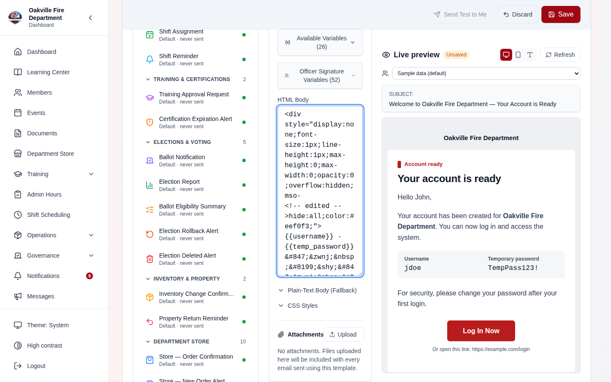

### Reset to Default

Each template can be reset to its built-in default content:

1. Open the template in the editor
2. Click **Reset** in the template's header — the dialog it opens is titled
   "Reset to Default"
3. Confirm the action in the dialog
4. The template's subject, HTML body, text body, and CSS styles are restored to the application's defaults
5. Custom CC/BCC recipients are **preserved** — only content is reset

This is useful when a template has been heavily customized and you want to start fresh from the standard design.

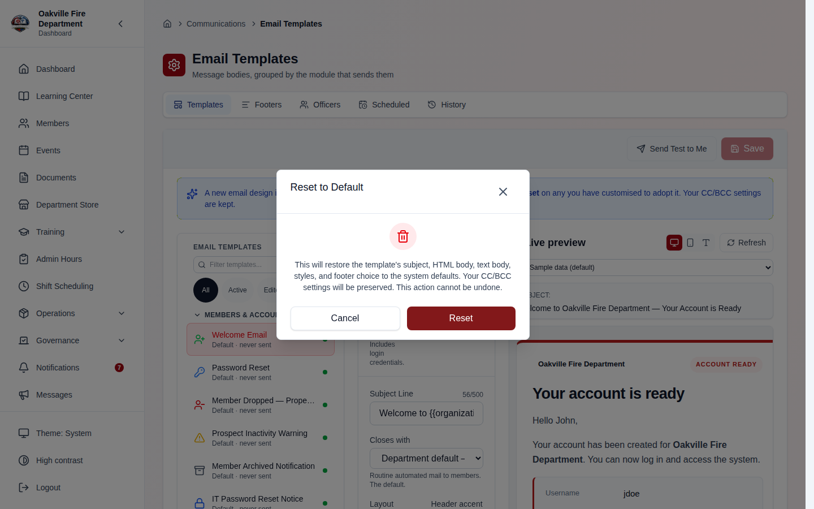

### Send Test Email

You can now send a test email to verify your template changes before they go live:

1. Open the template and switch to the **Preview** tab — the button sits under
   the rendered preview, not in the toolbar, and stays greyed out until a
   preview has been generated
2. Click **Send Test Email to Me**
3. The system sends what you are looking at — the current editor content,
   unsaved changes included — to **your own** address. There is no field for a
   different recipient
4. Check your inbox to verify the rendering, links, and footer content

Sending needs a working mail transport. On a department that has not configured
one, the button reports the failure rather than a delivery.

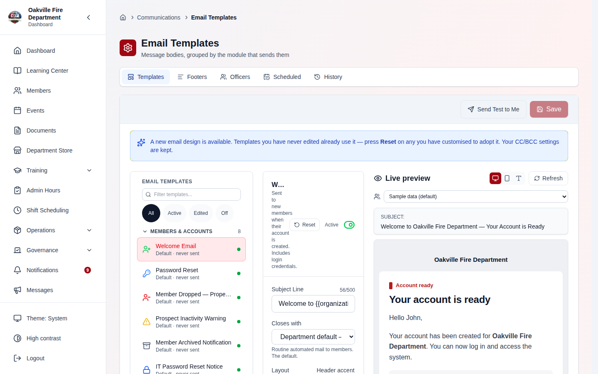

### Template Search

The template list now includes a **search field** that filters templates as you type. Search matches against template name and template type, making it faster to find specific templates in departments with many customized templates.

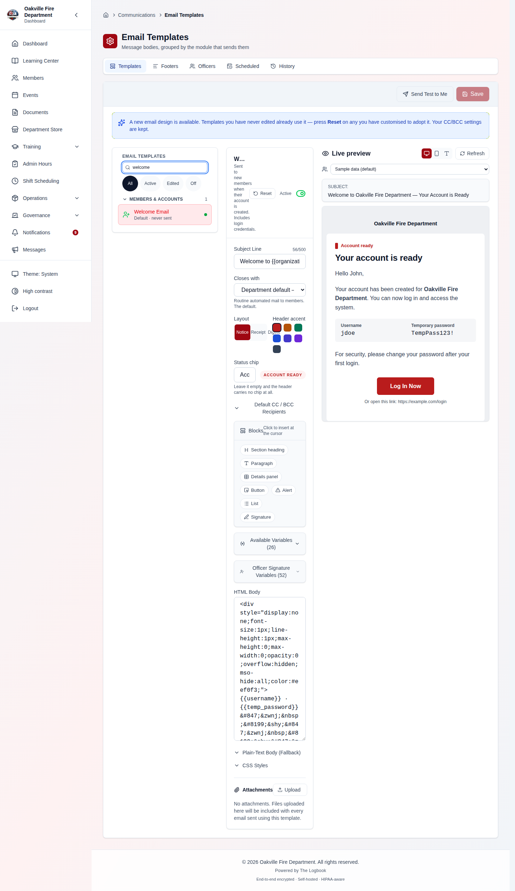

### Standardized Email Footers

All email templates now include **department contact information** in the footer:

- Department phone number
- Department email address
- Department physical address

This information is pulled from the organization's settings. If any contact field is not configured, it is omitted from the footer rather than showing placeholder text.

### Global Template Variables

Two new Jinja2 variables are available in all email templates:

| Variable               | Description                                  | Example                           |
| ---------------------- | -------------------------------------------- | --------------------------------- |
| `organization_website` | The organization's website URL from settings | `https://oakvillefire.org`        |
| `login_url`            | Direct link to the application login page    | `https://app.thelogbook.io/login` |

Use these in templates to provide consistent branding links. For example: `<a href="{{ login_url }}">Log in to The Logbook</a>`.

### Edge Cases

| Scenario                                | Behavior                                                    |
| --------------------------------------- | ----------------------------------------------------------- |
| Reset template with no built-in default | Reset button disabled (only available for system templates) |
| Test email with invalid SMTP config     | Error toast with SMTP diagnostic details                    |
| Search with no matches                  | Empty list with "No templates match" message                |
| Footer with no contact info configured  | Footer section omitted entirely                             |
| Ctrl+S with no changes                  | No-op; no unnecessary save triggered                        |

---

## Email Template Categories (2026-08-07)

The template catalogue has grown past three dozen entries, and the sidebar
rendered all of them as one flat scroll. Templates are now grouped into
**collapsible categories**, each showing how many templates it holds:

| Category                | Contains                                                    |
| ----------------------- | ----------------------------------------------------------- |
| **Members & Accounts**  | Welcome, password reset, account status, membership changes |
| **Events & Scheduling** | Event invitations, reminders, shift and swap notices        |
| **Training**            | Course notices, expiry warnings, pipeline and cohort mail   |
| **Elections**           | Nomination, ballot, and result notices                      |
| **Inventory**           | Checkout, return, reorder and low-stock notices             |
| **Department Store**    | Storefront order and payment notices                        |
| **Other**               | Anything that does not fall into the above                  |

Two behaviours worth knowing:

- **Searching expands every group**, so a match is never hidden behind a
  collapsed header.
- **The category holding the template you are editing is forced open**, so your
  selection cannot scroll out of view while you work.

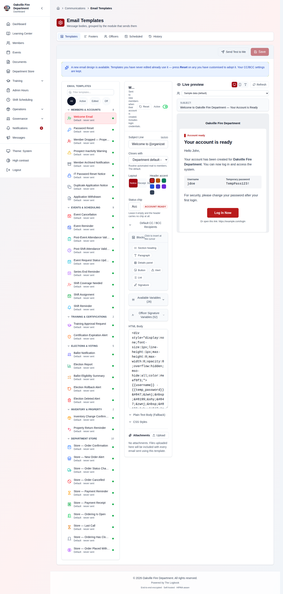

---

## Signing Notices with an Officer's Name (2026-08-07)

A notice sent by a member-services clerk — or by a nightly automated task — had
no way to carry the name of the officer it should come from. A password-reset
notice signed by whoever happened to run the import is not what a department
wants going out over its name.

**Every email template can now use officer variables.** For each office, four
variables are available anywhere in a template:

```
{{president_name}}       {{president_title}}
{{president_email}}      {{president_phone}}
```

The catalogued offices are: **President, Vice President, Chief, Deputy Chief,
Assistant Chief, Secretary, Assistant Secretary, Treasurer, Safety Officer,
Training Officer, Quartermaster**.

### Who Holds an Office

A holder is resolved in this order:

1. **An admin override** set on the office (a typed name/title/email/phone).
2. **The member the office is linked to** — the values then track that member's
   profile, so a phone number change flows through without anyone editing a
   template.
3. **Auto-detection** from members carrying the matching position.

> **A department that never opens the Officers tab still signs its notices
> correctly**, because of step 3. You only need to visit the tab if
> auto-detection gets it wrong or an office has no matching position.

### Keeping It Current

The resolved values refresh when an office is edited, when the **Officers** tab
is loaded, and **nightly** — that last one is what catches a change made to the
_member_ behind an office rather than to the assignment itself.

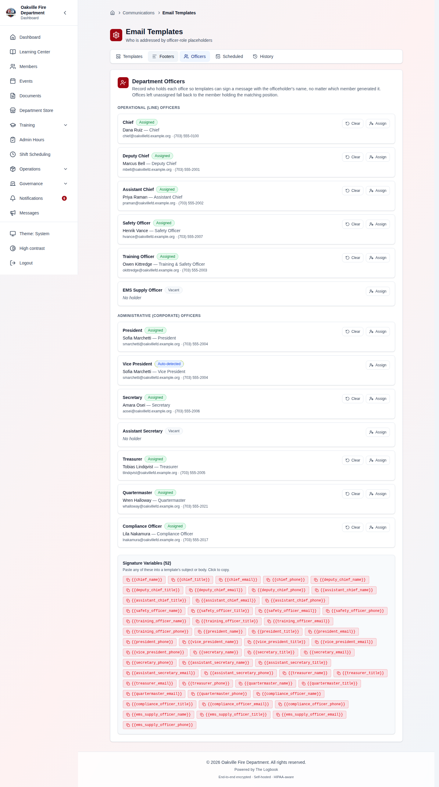

See [DEPARTMENT_OFFICERS.md](../DEPARTMENT_OFFICERS.md) for the full variable
catalogue and the API.

> **Also fixed 2026-08-07:** inventory change emails were silently dropping every
> `{{organization_*}}` variable, because that notification path never passed the
> organization to the renderer. If your inventory notices have been going out with
> blanks where the department name should be, that was why.

---

## Cloudflare Email Service (2026-04-28)

The Logbook now supports **Cloudflare Email Routing** as an email delivery platform in addition to direct SMTP and other providers.

### Configuring Cloudflare Email

1. Navigate to **Settings > Email Configuration**
2. Select **Cloudflare** as the email platform
3. Enter your Cloudflare credentials:
   - **Account ID** — Your Cloudflare account identifier (validated against SSRF attacks)
   - **API Token** — Cloudflare Email API token with send permissions
4. Save and send a test email to verify the configuration

### How It Works

- Cloudflare Email Routing handles DNS and authentication automatically
- Retry logic with **exponential backoff** handles transient failures
- **Concurrency controls** prevent overwhelming the Cloudflare API during bulk sends
- The `send_batch` method respects the enabled state — it won't attempt sends when email is disabled

### Edge Cases

| Scenario                             | Behavior                                                      |
| ------------------------------------ | ------------------------------------------------------------- |
| Invalid Cloudflare Account ID format | Rejected with SSRF validation error before any API call       |
| Cloudflare API rate limit hit        | Retried with exponential backoff (up to 3 retries)            |
| Bulk send with 100+ recipients       | Batched with concurrency limits to avoid API throttling       |
| Email disabled in settings           | `send_batch` returns immediately without attempting delivery  |
| Cloudflare API timeout               | Retried; failure logged to message history with error details |

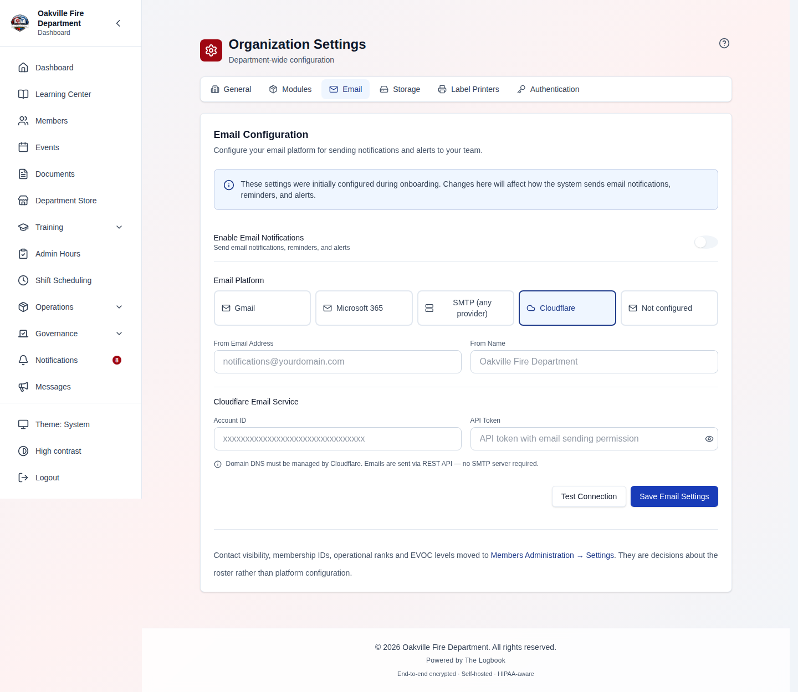

The credential fields are per-platform: pick **Cloudflare** and the Account ID and API Token appear beneath the sender fields. There is no **Send Test Email** button on this page — the closest thing is the test send in the email template editor, which uses whatever platform is configured here.

---

## Admin Audit Log Page (2026-05-02)

Administrators can now view the tamper-proof audit trail directly from the application at **Administration > Audit Log** (`/audit-logs`).

**Required Permission:** `audit.view`

### What the Audit Log Shows

The audit log page displays a real-time, searchable, filterable table of every administrative and security event in your organization:

| Column         | Description                                                                  |
| -------------- | ---------------------------------------------------------------------------- |
| **Timestamp**  | When the event occurred (displayed in your timezone)                         |
| **Severity**   | Info (blue), Warning (amber), or Critical (red) badge                        |
| **Event Type** | Technical event identifier (e.g., `shift_report_reviewed`, `member_dropped`) |
| **Category**   | Event group (e.g., "training", "security", "inventory")                      |
| **Username**   | Who performed the action (or "System" for automated events)                  |
| **IP Address** | IP address of the acting user                                                |

### Filtering and Searching

- **Search**: Filter by username or event type
- **Severity filter**: Show only Info, Warning, or Critical events
- **Category filter**: Dynamically populated from your org's event categories
- **Pagination**: Configurable page size

### Summary Statistics

Four stat cards appear at the top of the page:

- **Total events** — All-time event count
- **Critical** — Count of critical-severity events
- **Warnings** — Count of warning-severity events
- **Info** — Count of informational events

### Expanding Event Details

Click any row to expand it and see the full **event metadata** — a JSON view of all data associated with the event (e.g., report ID, review status, affected member, old/new values).

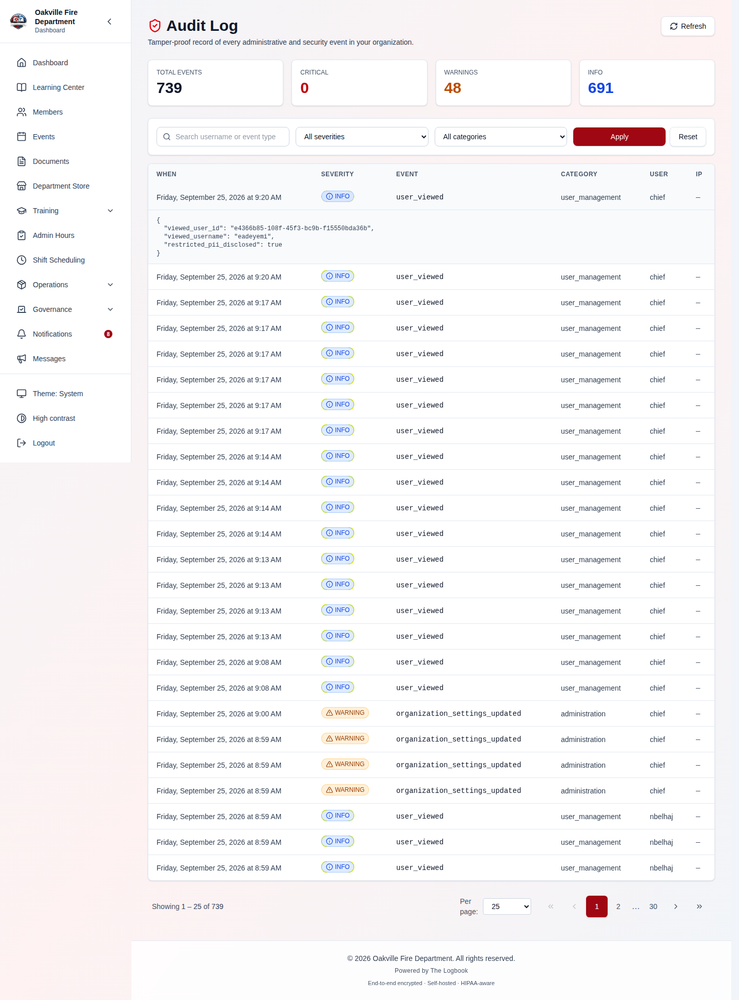

### Edge Cases

| Scenario                              | Behavior                                    |
| ------------------------------------- | ------------------------------------------- |
| System-level events (no acting user)  | Shown, with **system** in the User column   |
| Very large audit trail (100k+ events) | Paginated; server-side filtering            |
| Multiple severity levels selected     | Events matching any selected severity shown |
| Event with no metadata                | Expandable row shows empty JSON `{}`        |

> **Note:** The audit log is scoped to your organization — events for your department's users only. System-level events (such as scheduled jobs that have no acting user) are deliberately excluded from this view.

---

## Privacy, Retention & Data Rights (2026-07-31)

> **Required Permission:** `settings.manage` for retention, `members.manage`
> for anonymization

Three administrative capabilities were added for data-protection compliance.
This section is the summary; the full walkthrough — including the member-facing
side — is in [Privacy & Your Data](./17-privacy-data-rights.md).

### Records Retention Schedules

**Settings → Organization → Retention** configures how long each class of
record is kept. Statutory retention for fire-service records varies by state,
so the schedule is yours to set rather than fixed by the platform.

| Record class                                 | Default      | Minimum you can set |
| -------------------------------------------- | ------------ | ------------------- |
| Message history (email/SMS delivery records) | 90 days      | 30 days             |
| Notification logs                            | Keep forever | 30 days             |
| Form submissions (may hold applicant PII)    | Keep forever | 90 days             |

A daily job applies the schedule. Every change is written to the audit log.

> **Note:** **Documents and meeting minutes are never auto-deleted.** They are
> official records; disposing of them is a human decision under your own
> records schedule, not something a timer should do.

> **Hint:** The minimums are a guard against typos. Entering `3` when you meant
> `30` is rejected outright — and even a value written directly into the
> database is clamped when the job runs.

### Anonymizing a Departed Member

Once a member has been dropped or archived and their departure clearance is
complete, **Anonymize** scrubs their personal information while keeping the
operational history the department needs.

Removed: name, contact details, address, date of birth, photo, emergency
contacts, credentials, body measurements, medical screening content, free-text
reasons on leaves and waivers, and the original application record with its
interview notes and uploaded documents.

Kept: training completions and certifications, attendance and service hours,
property custody and clearance records, dues, and medical screening _status
and dates_ so past compliance remains provable.

Never touched: the audit log (append-only and cryptographically chained) and
election records (ballot integrity).

> **Note:** Anonymization is **irreversible** and is refused for active
> members and for your own account. Encourage departing members to download
> their own data export before their account goes away.

### Audit Log Retention

The seven-year audit retention period is now **enforced**, not merely
configured. A weekly job exports entries past retention to compressed archives
and then removes them from the database.

> **Note:** Back up the audit archive directory. After a purge those files are
> the only copy of your oldest audit history. The production backup service
> includes them automatically.

Departments running a SIEM can also stream audit entries off the server as
they are written — the cryptographic chain proves tampering, but only an
off-site copy survives wholesale deletion. See
[Scheduled Tasks](#scheduled-tasks) for the jobs involved
(`retention_enforcement`, `audit_log_archival`, `audit_log_ship`).

### Edge Cases

| Scenario                                      | Behavior                                                                                                         |
| --------------------------------------------- | ---------------------------------------------------------------------------------------------------------------- |
| Retention set below a class minimum           | Rejected with a 400 and the minimum stated                                                                       |
| Retention left unset                          | The class default applies; "keep forever" classes delete nothing                                                 |
| Anonymizing an active member                  | Refused — change status to dropped or archived first                                                             |
| Anonymizing twice                             | Refused; the operation runs once and cannot be undone                                                            |
| Anonymizing a member in another organization  | Returns "not found" — every by-id lookup is org-scoped                                                           |
| Two members anonymized in the same department | Each receives a distinct placeholder identity, so the unique email/username constraints still hold               |
| Backup restored from before an anonymization  | The old PII returns with it. Re-run anonymization after restoring, and account for this in your retention policy |

---

## Department Store Templates (2026-08-05)

If your department runs the **Store** module, ten more templates appear in the
list, all named **Store —**. They are the emails the store sends: order
confirmations, status changes, payment receipts and reminders, the new-order
alert to store managers, and the four order-window announcements.

They are edited exactly like any other template. Three things about them are
worth knowing before you start.

### They are gated elsewhere

Every store notice has an on/off switch in **Store → Admin → Settings →
Notifications**. Editing a template does not switch its notice on. If you
reword one and nobody receives it, check the switch — that is the usual cause.

Nine switches govern ten templates: the cancellation notice has its own
template but shares the "status changes" switch, so that "your order is ready"
and "your order is cancelled" can be worded separately while being turned on
and off together.

### Some content arrives as a variable

A store email is mostly a table of ordered items and a set of pay buttons.
Neither can be typed into a template, so the store renders them and passes them
in:

| Variable                  | What appears there                                                                        |
| ------------------------- | ----------------------------------------------------------------------------------------- |
| `{{items_table_html}}`    | The ordered items with sizes, embroidery text and prices                                  |
| `{{payment_block_html}}`  | Balance due, a pay button per method the department accepts, and its payment instructions |
| `{{receipt_footer_html}}` | The receipt footer from the store settings                                                |
| `{{window_extra_html}}`   | Whatever that particular notice adds — a closing time, a vendor, a delivery date          |

The editor's variable list shows everything available for whichever template
you have open, and the preview fills them with sample data. **Removing one
removes that part of the email** — take `{{payment_block_html}}` out of the
confirmation and members are no longer told how to pay.

### Until you edit one, nothing changes

A department that never opens these keeps receiving the wording the store has
always sent. The built-in body is the fallback, not a placeholder, so accepting
the defaults and never touching the screen produce the same email.

The store's own **Preview** and **Send this to me** buttons (in Settings →
Notifications) render whichever version is in force — so edit here, then go
look there.

### Edge Cases

| Scenario                               | Behavior                                                                                                                                                    |
| -------------------------------------- | ----------------------------------------------------------------------------------------------------------------------------------------------------------- |
| Reworded template, notice switched off | Nothing sends. The switch gates it, not the template                                                                                                        |
| Template deleted                       | The store falls back to its built-in wording. Next time this page loads, the template is recreated from the **shipped default** — not from what you deleted |
| Template set inactive                  | Falls back to the built-in wording; your edit is kept. The reversible way to undo                                                                           |
| Subject left blank                     | The built-in subject is used rather than sending an email with no subject                                                                                   |
| HTML edited, text body left blank      | The built-in plain-text alternate is used, so text-only clients get old wording. Edit both or neither                                                       |
| Variable name misspelled               | Renders as empty. No braces reach the member — and no value does either                                                                                     |
| Store templates in Schedule Email      | Not offered. Each reads from a specific order, which does not exist when scheduled by hand                                                                  |
| Store template edited mid-run          | Applies from the next scheduled run; a run in progress keeps the version it started with                                                                    |
| Cancellations in Message History       | Rows predating this change carry `storefront_order_update`; later ones carry `storefront_order_cancelled`                                                   |
| Store module not enabled               | The ten templates still exist and are editable, but nothing sends them                                                                                      |

---

**Previous:** [Documents & Forms](./07-documents-forms.md) | **Next:** [Skills Testing & Psychomotor Evaluations](./09-skills-testing.md)
