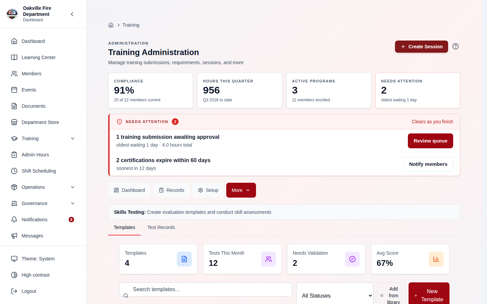
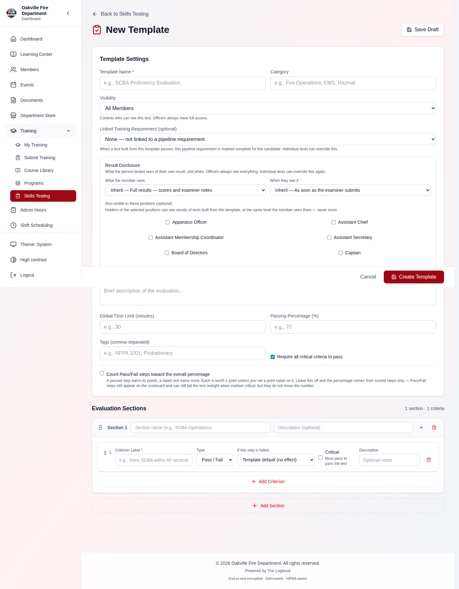
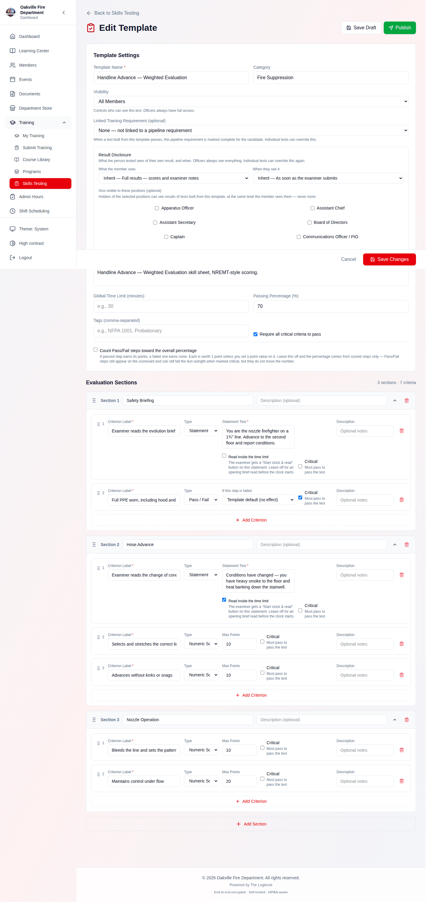
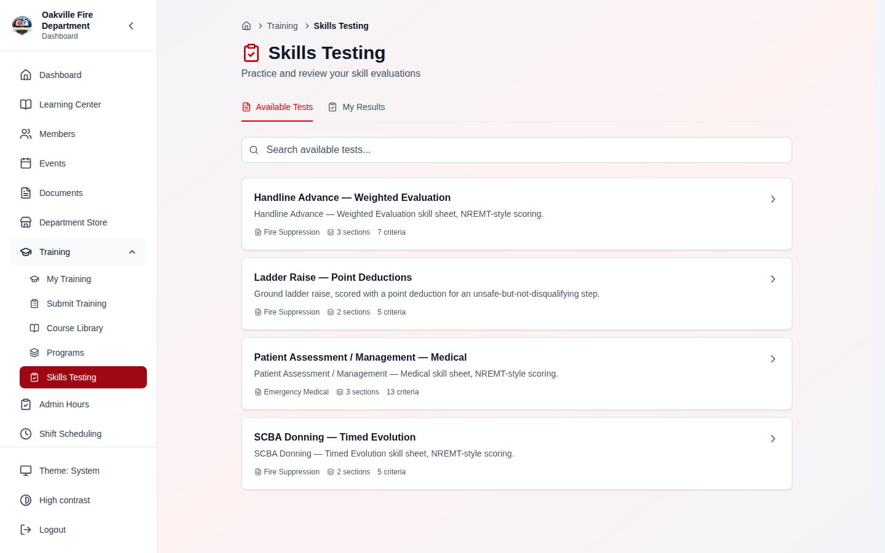
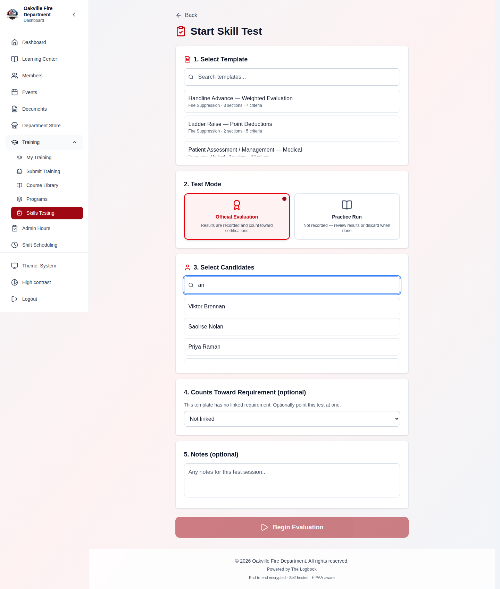
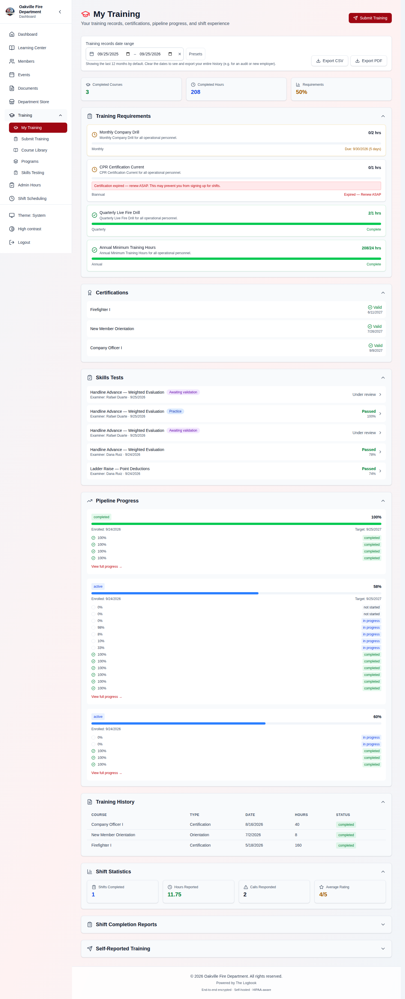
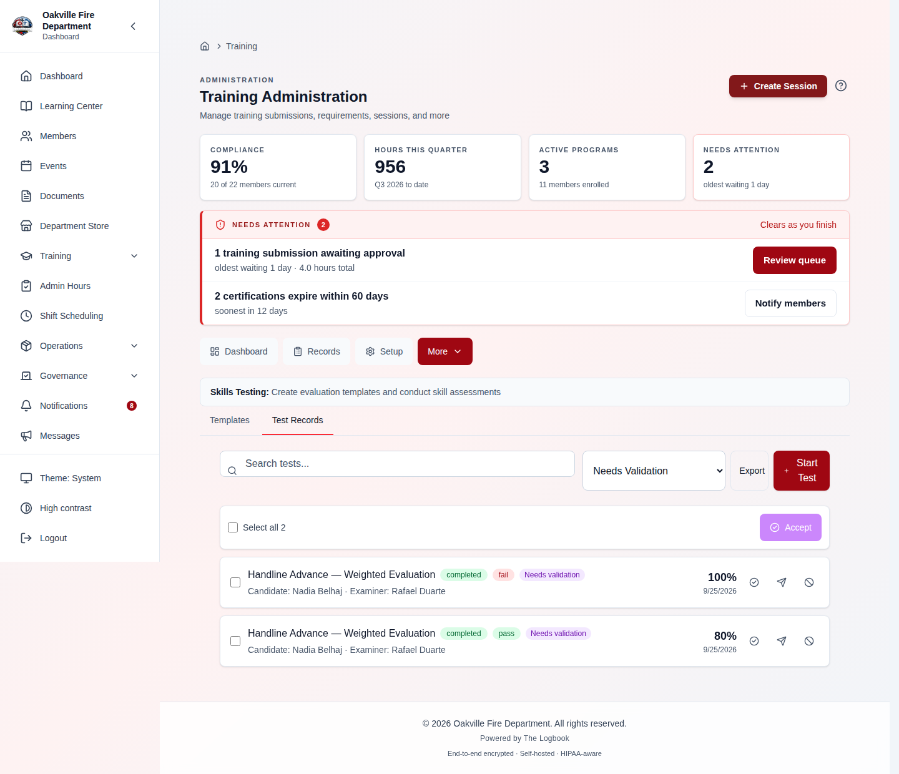
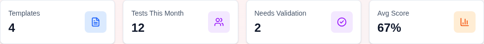
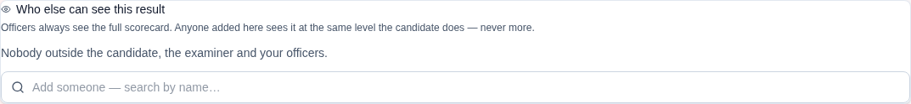
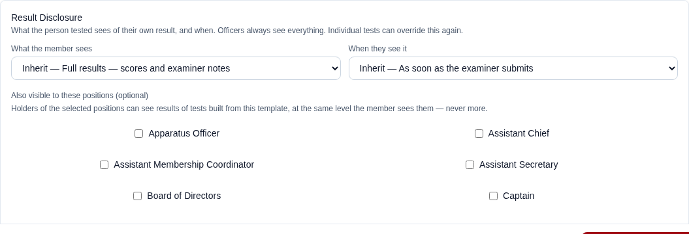

# Skills Testing & Psychomotor Evaluations

The Skills Testing module provides digital skill sheet evaluations that mirror NREMT-style psychomotor examinations. Examiners use a tablet or computer to score individual steps, track time, flag critical criteria, and generate auditable pass/fail results — replacing paper skill sheets with a structured digital workflow.

Skills Testing lives within the Training module and integrates with Training Requirements, Training Records, Training Programs, and the compliance pipeline.

---

## Table of Contents

1. [Overview](#overview)
2. [Skill Sheet Templates](#skill-sheet-templates)
3. [Creating a Template](#creating-a-template)
4. [Publishing Templates](#publishing-templates)
5. [Administering a Skills Test](#administering-a-skills-test)
6. [Scoring & Critical Criteria](#scoring--critical-criteria)
7. [Completing a Test](#completing-a-test)
8. [Officer Validation](#officer-validation--a-result-is-not-a-record-until-an-officer-says-so-2026-08-08)
9. [Viewing Results](#viewing-results)
10. [Skills Testing Summary Dashboard](#skills-testing-summary-dashboard)
11. [Realistic Example: NREMT Trauma Assessment](#realistic-example-nremt-trauma-assessment)
12. [Practice Mode](#practice-mode)
13. [Who Sees a Result — Disclosure Settings](#who-sees-a-result--disclosure-settings-2026-08-08)
14. [Withdrawing a Result — Void, Cancel, Delete](#withdrawing-a-result--void-cancel-delete-2026-08-08)
15. [Attempt Limits](#attempt-limits-2026-08-08)
16. [Permissions](#permissions)
17. [Integration with Training Compliance](#integration-with-training-compliance)
18. [Troubleshooting](#troubleshooting)

---

## Overview

Many fire departments and EMS agencies conduct psychomotor skills evaluations as part of certification, recertification, and internal proficiency checks. These evaluations follow standardized skill sheets (such as those published by the NREMT) where an examiner observes a candidate performing a procedure and scores each step.

The Skills Testing module digitizes this process, providing:

- **Reusable templates** based on skill sheets (NREMT, NFPA, or department-defined)
- **Real-time scoring** with per-step pass/fail and section subtotals
- **Critical criteria tracking** for automatic failure conditions
- **Time tracking** with configurable time limits
- **Automatic pass/fail calculation** based on scoring thresholds and critical criteria
- **Audit trail** of every test with examiner, candidate, scores, and timestamps

---

## Skill Sheet Templates

Templates are the reusable definitions of a skills test — the digital equivalent of a blank NREMT skill sheet. Each template contains:

- **Metadata** — Name, category, description, version number
- **Sections** — Ordered groups of related steps (e.g., "Scene Size-Up", "Primary Survey")
- **Criteria within sections** — Individual scored items with descriptions and whether they are critical (required)
- **Scoring configuration** — Passing percentage, whether all critical criteria must be met, optional time limit



### Template Statuses

| Status        | Description                                                                                                     |
| ------------- | --------------------------------------------------------------------------------------------------------------- |
| **Draft**     | Template is being built or edited. Cannot be used for testing.                                                  |
| **Published** | Template is active and available for examiners to use.                                                          |
| **Archived**  | Template has been retired. Historical test results still reference it, but no new tests can be created from it. |

---

## Creating a Template

**Required Permission:** `training.manage`

Navigate to **Training Admin > Skills Testing > Templates** and click **Create Template**.

### Step 1: Template Metadata

Fill in the basic information:

| Field                           | Description                                                                               | Example                                                |
| ------------------------------- | ----------------------------------------------------------------------------------------- | ------------------------------------------------------ |
| **Name**                        | Descriptive name of the skill sheet                                                       | "Patient Assessment/Management — Trauma"               |
| **Category**                    | Training category (EMS, Fire, Hazmat, etc.)                                               | "EMS"                                                  |
| **Description**                 | Purpose and scope                                                                         | "NREMT psychomotor exam for trauma patient assessment" |
| **Passing Percentage**          | Minimum score to pass (0–100)                                                             | 70                                                     |
| **Require All Critical**        | If enabled, failing any required criterion = automatic fail                               | Enabled                                                |
| **Time Limit**                  | Optional time limit in minutes                                                            | 10                                                     |
| **Linked Training Requirement** | Optional. A training-program requirement that passing a test from this template completes | "Recruit Academy — Phase 3: Trauma Assessment"         |



### Step 2: Define Sections and Criteria

Add sections to organize the evaluation, then add criteria (scored items) within each section.

**Adding a section:**

1. Click **Add Section** below the template metadata.
2. Enter the section name (e.g., "Scene Size-Up").
3. Optionally add examiner instructions for the section.

**Adding criteria to a section:**

1. Within a section, click **Add Criterion**.
2. Enter the step description (e.g., "Determines scene/situation safety").
3. Select the **criterion type**:
   - **Binary** (default) — Simple pass/fail checkbox
   - **Statement** — Open-ended text box for descriptive responses (e.g., "Describe the patient's chief complaint")
4. Set the **point value** (default 1) for weighted scoring. Higher-value criteria carry more weight in the overall score.
5. Check **Required** if this is a critical criterion — failing a required criterion triggers automatic fail when "Require All Critical" is enabled on the template.

> **Screenshot placeholder:**
> _[Screenshot of the template builder showing two sections ("Scene Size-Up" and "Primary Survey") expanded with criteria listed under each. Each criterion row shows: description text, a type indicator, point value, a "Required" checkbox (some checked with a red asterisk), and drag handles for reordering. An "Add Criterion" button appears at the bottom of each section]_

> **Hint:** Required (critical) criteria are the digital equivalent of the "Critical Criteria" section at the bottom of NREMT skill sheets. If a candidate triggers any of these, the result is an automatic FAIL regardless of their point score. Non-critical criteria that are unchecked display as "Not Completed" (not "FAIL").

> **Passing Points appears only on critical criteria** _(2026-08-08)_. It used to
> render for every scored criterion, with a "(critical only)" hint doing the
> explaining — so it asked for a threshold the scorer then ignored, because a
> non-critical criterion contributes its points to the overall score and cannot
> fail the test on its own.
>
> Two consequences worth knowing:
>
> - The "passing score cannot exceed max score" validation is now scoped to
>   critical criteria too. Previously a value left over from before you unchecked
>   **Required** could block saving over a field the editor no longer showed —
>   an error with no reachable cause.
> - **Unchecking Required keeps the stored threshold rather than clearing it.**
>   Clearing would look tidier, but the threshold falls back to `0` when absent,
>   so an accidental toggle off and back on would leave the criterion quietly
>   passing at any score. The value sits inert until the criterion is critical
>   again.

### Step 3: Save as Draft

Click **Save** to save the template as a draft. You can continue editing drafts at any time before publishing.

### Linking a Template to a Training Requirement

When building or editing a template, use the **Linked Training Requirement** field to connect it to a requirement in a training program. Once linked, **passing any test created from this template automatically marks that requirement complete** for the candidate in their program — the officer does not have to record it separately.

- The link is set on the **template**, so it applies to every test created from it. Individual tests can override it (see [Administering a Skills Test](#administering-a-skills-test)).
- Leave the field blank for templates used only for practice or ad-hoc proficiency checks that do not satisfy a program requirement.

See the [Training Pipelines](./02-training.md#training-pipelines) guide for how requirements and phases fit into a program.

> **[SCREENSHOT NEEDED]:** _The Create/Edit Template form showing the "Linked Training Requirement" dropdown with a program requirement selected, below the passing percentage and critical criteria fields._

---

## Publishing Templates

When a template is ready for use:

1. Navigate to the template detail page.
2. Click **Publish**.
3. The system validates that the template has at least one section with at least one criterion.
4. Once published, the template becomes available for examiners to use in test sessions.

**Version control:** When you edit a published template and structural fields change (sections, criteria, scoring configuration), the version number auto-increments. Historical test results always reference the template version they were administered under.

**Duplicating a template:** Click **Duplicate** on any template to create a draft copy with " (Copy)" appended to the name. This is useful for creating variants (e.g., adapting an NREMT template for department-specific requirements).



---

## Administering a Skills Test

**Required Permission:** Authenticated user (examiner is auto-set to current user)

Navigate to **Training Admin > Skills Testing > Tests** and click **New Test**.

### Anyone can hold the clipboard _(2026-08-08)_

Skills testing used to require the training-officer permission end to end. A
member could neither drill on their own nor examine a colleague. That is not how
departments actually run these — a senior member is very often the one holding
the clipboard.

**Any member can now run an official skills test.** What a member cannot do is
decide that the result stands. That decision is a second, separate step:
**validation** by a training officer. See
[Officer Validation](#officer-validation--a-result-is-not-a-record-until-an-officer-says-so-2026-08-08).

Template authoring is unchanged — writing the standard is still an officer act.



### Setting Up a Test Session

1. **Select Template** — Choose a published skill sheet template from the dropdown.
2. **Find the Candidate** — **Type at least two characters of their name** and pick from the results. This is a search, not a roster dropdown — see [Finding a candidate](#finding-a-candidate-2026-08-08) below. **You cannot select yourself for an official test** _(2026-08-01)_ — see [Separation of Duties](#separation-of-duties) below.
3. **Linked Requirement** _(optional)_ — If the template is linked to a training requirement, it is pre-selected here. You can **override it for this test** to point at a **different requirement** — for example, when the same skill satisfies a requirement in another phase or program.
4. Click **Start Test**.

> **Tapping a test from the Skills Testing page carries it through**
> _(2026-08-08)_ — the template you tapped arrives already selected on the Start
> Skill Test page, instead of landing you on an empty picker.

### Finding a candidate _(2026-08-08)_

The candidate field is a **name search**, not a dropdown of everyone in the
department. Type at least two characters and matching members appear.

| What you'll notice                                | Why it works that way                                                                                                                        |
| ------------------------------------------------- | -------------------------------------------------------------------------------------------------------------------------------------------- |
| Nothing appears until you have typed 2 characters | There is deliberately **no search that returns the whole roster**. You can confirm a name you already know; you cannot browse the department |
| Only the first 15 matches are shown               | And the list does not tell you it was cut short. Type more of the name rather than scrolling                                                 |
| You can type first name, surname, or both         | Matching runs against the full display name, so "john s" finds John Smith, and a surname on its own works too                                |
| Only active members appear                        | Deactivated and deleted accounts are excluded                                                                                                |
| A **practice** test defaults to you               | Drilling alone is one tap — your own name is filled in without a search                                                                      |
| The field is unavailable to some members          | It needs `training.view` or `training.manage`. A position carrying no training access has no business looking up test candidates             |

The search deliberately carries **only a name and an internal id** — no phone
number, no email, no address. That is why every member can use it without
opening up the member directory.



The system creates a new test session with:

- The current user as the **examiner**
- Status set to **not_started**

### Separation of Duties

_(Added 2026-08-01.)_ The examiner is always the person creating the test, and
the candidate comes from the form — so nothing previously stopped an
instructor examining themselves and recording a pass. Because a passing test
**completes the linked training requirement**, that pass counts toward
certification.

The system now refuses to create a graded test where the examiner and the
candidate are the same person. A second qualified examiner has to observe you,
which is what a psychomotor evaluation means.

**Practice mode is exempt.** Practice attempts are not logged to the audit
trail, never touch enrollment progress, and self-drilling is the point of
them — so you can run a practice test on yourself freely.

- The template's sections and criteria loaded for scoring

> **Screenshot placeholder:**
> _[Screenshot of the New Test form showing a template dropdown (with "Patient Assessment/Management — Trauma v2" selected), a candidate dropdown showing a member search, and a prominent "Start Test" button]_

### Test Statuses

| Status          | Description                                                                                                                     |
| --------------- | ------------------------------------------------------------------------------------------------------------------------------- |
| **not_started** | Test created but candidate has not begun                                                                                        |
| **in_progress** | Candidate is actively being evaluated                                                                                           |
| **completed**   | Test finished and scored                                                                                                        |
| **cancelled**   | Test was cancelled before completion — closed out from the records tab with **Cancel**, keeping whatever partial scoring exists |

### Your scoring saves itself _(2026-08-08)_

The active test screen **autosaves** while an evaluation is live. It used to
persist only when you pressed **Save** or entered review — on a screen used
one-handed outdoors, where a locked phone or a killed tab lost every criterion
scored since you last thought to save.

Autosave is silent and runs only while the test is in progress. **Save** still
works and still does the same thing; you no longer have to remember it.

> **If two people edit one test, neither one's work is silently discarded.**
> Two examiners on the same evaluation — or an officer editing the scorecard
> while a phone holds unsaved criteria — used to lose one side's work, and _the
> side that lost got a success message._ A save made against an out-of-date copy
> is now refused, autosave **suspends and tells you**, and you can reload to pick
> up the current state. It does not keep retrying a save that cannot succeed
> while you believe your scoring is still going through.

### The timer records what you measured _(2026-08-08)_

The examiner's stopwatch reading is what gets recorded. Previously the elapsed
time was overwritten on completion with "completed minus started" — and the start
is stamped once, when the test first goes in progress, so **a test begun at 09:00
and finished after lunch recorded seven hours.** Time limits are pass/fail
criteria on many sheets, so that was not a cosmetic problem.

Wall clock is now only a fallback for a test completed with no measured value.
Reopening an in-progress test also **restores the timer** rather than restarting
it at 00:00.

#### Moving on no longer loses the reading _(2026-08-09)_

The stopwatch reading used to be recorded **only when you pressed Stop**. Sections
are torn down when you move between them, so timing an evolution and tapping
**Next** lost the reading entirely — on the one step whose time limit _is_ the
pass/fail criterion.

The value is now committed when the step is torn down, whether or not you pressed
Stop. Starting a stopwatch also starts the test clock, so the two cannot disagree.

#### Coming back to an interrupted test _(2026-08-09)_

Reopening a test in progress now **opens at the first section with blank steps**,
rather than dropping you back at section 1 to hunt for where you had got to. In
the officer's **Test Records** tab an unfinished test says **Tap to resume** and
opens on the scoring screen; a finished one still opens on its scorecard.

> **[SCREENSHOT NEEDED]:** _The officer's Test Records tab showing a mix of rows —
> an unfinished test with its "Tap to resume" affordance, a completed test, and a
> cancelled test with its distinct status — so the three read differently at a
> glance._

#### A cancelled test is read-only _(2026-08-09)_

A cancelled test used to render as a **live evaluation**: editable criteria, a
running clock, and a **Finish** button that the server rejects. It now renders
read-only and says plainly that **nothing was decided** — it does not show a pass
or a fail, because there was neither. The officer panel no longer describes an
abandoned test as counting toward the candidate's record, because it counts
toward nothing.

Cancelling a test from the Test Records tab now asks for its optional reason in a
proper dialog. It used to use the browser's own prompt, which some browsers
suppress — and a suppressed prompt is indistinguishable from pressing Cancel, so
the cancellation silently did nothing.

---

## Scoring & Critical Criteria

During the test, the examiner scores each criterion as the candidate performs the procedure.

### The scoring screen _(rebuilt 2026-08-09)_

The screen is built for someone standing outdoors, in gloves, watching a
candidate rather than the tablet.

- **The candidate's name is on the screen.** Confirm you have the right person
  open before you start — nothing on the old screen told you.
- **Section chips across the top**, 44px and showing their own state, replace the
  10px progress dots that were unhittable with a glove and silent about what was
  left.
- **A running "scored / total" count and a save-status line** sit with them, so
  "am I finished?" and "did that save?" are both answerable at a glance.
- **The primary bottom-bar button is Next**, not Finish. On the old screen the
  biggest, reddest button on every section ended the evaluation while moving on
  was a small grey one.
- **Moving between sections returns you to the top of the screen**, rather than
  dropping you halfway down the new one.

> **[SCREENSHOT NEEDED]:** _The active scoring screen mid-test, showing the
> candidate's name in the header, the 44px section chips across the top with one
> active and two showing complete, the running "scored / total" count and
> save-status line, a scored criterion and an unscored one below, and the bottom
> bar with Prev and a primary Next button._

### Recording a mark

Each criterion type is scored differently, and each can be **undone**:

| Criterion type | How you mark it                                                                | Clearing it               |
| -------------- | ------------------------------------------------------------------------------ | ------------------------- |
| **Pass/Fail**  | Tap Pass or Fail                                                               | Tap the same one again    |
| **Score**      | Tap the number                                                                 | Tap the same number again |
| **Checklist**  | Tick the boxes the candidate completed, or tap **Candidate did none of these** | **Clear this step**       |
| **Statement**  | Marks itself — nothing to do                                                   | n/a                       |
| **Timed**      | Start and stop the stopwatch                                                   | Re-run it                 |

> **A mis-tap used to be uncorrectable.** The only way out of tapping the wrong
> verdict was to record the opposite one on a candidate. Tapping the same value
> again now clears it. This matters most on a critical step, where a mis-tapped
> **0** and a deliberate **0** score identically but mean completely different
> things.

> **"Candidate did none of these" is not the same as an unscored step.** A
> checklist used to count as scored only once a box was ticked — so the case an
> examiner most needs to record was indistinguishable from a step they forgot,
> and could only be entered by ticking a box and unticking it.

**Add note** is a full-size labelled control, not a 12px text link. It is what
explains a mark to whoever reads the scorecard weeks later; it should not be the
hardest thing on the screen to hit.

### Running Score

As the examiner scores criteria, the interface displays:

- **Section score** — points earned / total possible points in each section
- **Overall running score** — total points earned / total possible points across all sections
- **Percentage** — running percentage updated in real-time (based on points, not simple criterion count)

> **Unscored steps read "—/N" in neutral type, not a red "0/N".** A red zero
> reads as a fail the examiner never recorded.

### What the percentage is actually made of _(2026-08-09)_

A scorecard once read **86%** over a sheet whose visible sections included four
knowledge questions, two of them failed — and nothing on the page explained how
those two could be wrong without moving the number.

They could because **not every criterion type feeds the percentage**:

| Criterion type | Counts toward the percentage?                                |
| -------------- | ------------------------------------------------------------ |
| **Score**      | Yes — earns 0…max                                            |
| **Pass/Fail**  | **Only if the template opts in** (see below); off by default |
| **Checklist**  | No                                                           |
| **Timed**      | No                                                           |
| **Statement**  | No — read aloud, marks itself, never scored                  |

This is a defensible way to build a sheet — the questions still appear on the
scorecard, and a **critical** one still fails the test outright regardless of
points. It was simply invisible to whoever read the result.

Two things fixed that:

- **The scorecard now shows its working.** A breakdown panel above the sections
  gives the per-section point totals, the passing threshold applied, and any
  critical step that decided the outcome on its own. It **flags any section that
  contributed nothing** to the percentage, which is exactly the case that made
  "86%" unreadable. Both the officer's and the candidate's result pages show it.
- **Pass/Fail steps can be made to carry points**, with a per-template setting.
  A passed step earns its points (its max score, or 1 if none is set); a failed
  one earns none.

> **[SCREENSHOT NEEDED]:** _The score breakdown panel at the top of a completed
> scorecard, showing per-section point totals with one section flagged as
> contributing no points, the passing threshold, and the final percentage._

> **Turning the setting on never re-scores an old result.** The rule is frozen
> into each test at the moment it is created, so a test taken under the old
> behaviour keeps the number it was given. Change it and only new tests follow
> the new rule.

> **Checklist and timed steps stay out of the point pool deliberately.** A
> checklist is partly completable and would need its own earned-fraction rule; a
> time limit is a gate on the evolution, not a measure of how well it was
> performed. If either must decide the outcome, make it a **critical** criterion.

### A statement that is read on the clock _(2026-08-09)_

The test clock starts on the examiner's first real action — recording a result,
or moving between sections — because an examiner watching a candidate will not
reliably remember to press play on a skill whose time limit is itself the
pass/fail criterion.

**Statements are excluded from that by default.** They mark themselves as a
section renders, which is nobody's action, so opening a test whose first section
leads with a statement must not start timing before the candidate is even in
position.

But sheets differ. Some read the opening statement as a brief _before_ the clock;
others read it _inside_ the limit — "your time starts now." So a statement can be
marked **starts the timer**:

| Setting           | What the examiner sees                          | Effect                                    |
| ----------------- | ----------------------------------------------- | ----------------------------------------- |
| **Off** (default) | The read-aloud box alone                        | Read off the clock; nothing starts timing |
| **On**            | A **"Start clock & read"** button under the box | The examiner's tap starts the clock       |

> **[SCREENSHOT NEEDED]:** _A statement criterion on the scoring screen with
> "starts the timer" enabled, showing the "Start clock & read" button beneath the
> read-aloud box, and the same statement after tapping it — the button replaced
> by the note that the statement falls inside the time limit and the clock is
> running._

> **It is a button, not an automatic start.** Whether a statement is read on the
> clock is a property of the sheet; _when_ it is read is not. An examiner opens a
> test to have it ready and reads the prompt once the candidate is in position,
> which may be minutes later — starting on render would time the wait. Tapping it
> also clears a manual pause, the way pressing play does.

> **Statement criteria are excluded from every count.** They mark themselves, so
> counting them showed progress on a section nobody had touched — and a section
> could read "3 / 3" with a real step still blank.

### Critical Criteria

If "Require All Critical" is enabled on the template:

- Any **required** criterion that is left unchecked (not passed) will result in an **automatic FAIL**
- This is true even if the candidate's percentage score exceeds the passing threshold

> **[SCREENSHOT NEEDED]:** _The active scoring screen's criteria area, showing a
> critical criterion with its red asterisk scored Pass, an unscored score-type
> criterion reading "—/5" in neutral type, a checklist criterion with two of four
> boxes ticked and the "Candidate did none of these" option beneath, and the
> timer running in the header._

---

## Completing a Test

When the candidate finishes the procedure:

1. Click **Complete Test**. The timer automatically stops.

   > **If any steps are still blank, a dialog names the count** and reminds you
   > that **an unscored critical step scores the same as a fail** — which is what
   > actually happens. The review screen repeats it, with a button that takes you
   > straight back to the first unfinished section.

   > **[SCREENSHOT NEEDED]:** _The "finish with unscored steps" dialog naming the
   > number of blank steps and stating that an unscored critical step counts as a
   > fail, with its keep-scoring and finish-anyway buttons._

2. The system shows a **post-completion review screen** where the examiner can:
   - Review each section's criteria and scores
   - Add **section-level notes** with feedback for specific areas
   - Add overall performance notes
   - Verify the scoring before finalizing
3. The system automatically calculates:
   - **Total score** — percentage based on points earned vs. total possible points
   - **Critical criteria check** — whether all required criteria were met (if applicable)
   - **Elapsed time** — total time from start to completion (auto-stopped)
   - **Pass/Fail result** — based on both the score threshold and critical criteria

### Result Determination

A candidate **passes** if ALL of the following are true:

1. Their percentage score meets or exceeds the template's **passing percentage**
2. If "Require All Critical" is enabled, ALL required criteria were scored as passed

A candidate **fails** if ANY of the following are true:

1. Their percentage score is below the passing percentage
2. Any required criterion was not passed (when "Require All Critical" is enabled)

> **Screenshot placeholder:**
> _[Screenshot of the test completion/results screen showing: a large PASS indicator in green (or FAIL in red), the final score "16/18 (89%)", time elapsed "07:23", a section-by-section breakdown showing scores per section, and a list of any missed criteria highlighted in yellow. For a failing test, also show which critical criteria were triggered in red]_

### Effect on Training Pipeline Progress

When a test that is linked to a training requirement (either through the template or an override set when the test was started) ends in a **PASS**, and the test is **not** in practice mode, the system **completes that requirement on the candidate's active program enrollment**. This advances their pipeline — potentially completing a phase and moving them forward.

- A **FAIL** does not change pipeline progress.
- **Practice-mode** passes are excluded and never affect enrollment progress (see [Practice Mode](#practice-mode)).
- **A pass run by a member who is not a training officer does not credit
  anything until an officer validates it** _(2026-08-08)_ — see the next
  section.

See the [Training Pipelines](./02-training.md#training-pipelines) guide for how requirement completion advances phases.

---

## Officer Validation — a result is not a record until an officer says so _(2026-08-08)_

Opening the examiner role to every member meant the authority it used to carry
had to land somewhere. It lands here.

### What "awaiting validation" means

When a member without the training-officer permission completes an **official**
test, the result is saved and scored — but it is a **submission, not a record**.
Until an officer validates it:

| It does not…                                             | It does…                                              |
| -------------------------------------------------------- | ----------------------------------------------------- |
| Credit the linked training requirement                   | Save every mark, note and the elapsed time            |
| Spend one of the candidate's attempts                    | Appear in the officer's review queue                  |
| Count toward the department's pass rate or average score | Show on the candidate's list as _awaiting validation_ |
| Show the candidate whether they passed                   | Preserve the examiner's name and the timestamp        |

The outcome is withheld from the candidate on purpose. Nobody has yet decided
that the result stands, so showing a PASS or a FAIL would be asserting something
no officer has agreed to.



### If you are a training officer

**Nothing about your own workflow changes.** When you complete a test yourself,
it validates in the same step — you are the authority the second step exists to
obtain, so there is no queue of your own tests to approve afterward.

What is new is the **review queue** of tests other members ran:

1. Go to **Training Admin > Skills Testing > Test Records**.
2. Set the status dropdown to **Needs Validation**. A **Needs validation** badge
   also marks these rows in the unfiltered list, so you can spot them without
   filtering.
3. Open a result and read the scorecard — every criterion, the notes, and the
   measured time are all there. A banner at the top states plainly that the
   result does not yet count toward the candidate's record.
4. **Accept result** to validate it, or **Void result** to reject it. Both sit
   at the bottom of the scorecard you have just read, under **Officer actions**,
   so the decision is made on the record rather than on a list row _(2026-08-08)_.

Each action states what it will do to _this_ test before you take it — whether
the candidate is notified, and whether they will see your notes or only the
scores. That sentence is resolved from the disclosure settings actually in force
(test, then template, then department default), so it is worth reading even on a
skill you administer often: a template can override the department, and a single
test can override the template. See
[Who Sees a Result](#who-sees-a-result--disclosure-settings-2026-08-08).

> **Where the count lives.** The **Templates** tab carries a **Needs
> Validation** stat card, which appears only while the queue is non-empty — it
> takes the Pass Rate card's place, on the reasoning that a queue nobody clears
> is blocking candidates from getting credit and so outranks the pass rate for
> attention.

**Validate** is the moment the result becomes real: the pipeline requirement is
credited if it passed, one attempt is spent, the department statistics move, and
the candidate can see the outcome under the template's normal disclosure rules.

**Void is the rejection path.** There is no separate "reject" button, and that
is deliberate — voiding keeps the submission and records the reason it was
refused, rather than deleting an evaluation somebody actually sat for. The
candidate sees the reason.



### Edge cases

| Situation                                                          | What happens                                                                                                                                                                                    |
| ------------------------------------------------------------------ | ----------------------------------------------------------------------------------------------------------------------------------------------------------------------------------------------- |
| **You are the candidate on a test you are asked to validate**      | Refused. An officer cannot validate their own evaluation — otherwise a peer could "examine" you and you could sign off your own pass                                                            |
| **You validate a result twice**                                    | Nothing happens the second time. Validation is idempotent; the result comes back unchanged                                                                                                      |
| **You try to validate a practice attempt**                         | Refused — practice is never recorded, so there is nothing to validate                                                                                                                           |
| **You try to validate a voided result**                            | Refused                                                                                                                                                                                         |
| **You try to validate a test still in progress**                   | Refused — only a completed test has a result to validate                                                                                                                                        |
| **The officer who validated a result later leaves the department** | The result stays validated. It does not revert to pending because the person who signed it departed                                                                                             |
| **Results from before 2026-08-08**                                 | Already validated, credited to their examiner. Under the old rules only officers could run official tests, so each one already carries that sign-off — nothing lands in the queue retroactively |
| **A member examines themselves on an official test**               | Still refused, exactly as before — see [Separation of Duties](#separation-of-duties)                                                                                                            |
| **The candidate hits their attempt limit**                         | The cap is spent at **validation**, not at completion. A submission that is never validated never costs the candidate a chance — see [Attempt Limits](#attempt-limits-2026-08-08)               |

---

## Viewing Results

### Individual Test Results

Navigate to **Training Admin > Skills Testing > Tests** and click on any completed test to view:

- Candidate and examiner names
- Template name and version
- Final score and pass/fail result
- Section-by-section breakdown
- Time elapsed
- Date and time of completion

### Test History

The tests list page supports filtering by:

- **Status** — not_started, in_progress, completed, cancelled
- **Candidate** — filter by specific member
- **Template** — filter by specific skill sheet

### What the member sees _(2026-08-08)_

Members no longer have to read their result over an examiner's shoulder.
**My Training** carries a **Skills Tests** section listing that member's own
official and practice results, each linking to a read-only detail page.

What appears there is governed by the department's disclosure settings — see
[Who Sees a Result](#who-sees-a-result--disclosure-settings-2026-08-08). A result
the department does not share is simply absent from the list.

> **Screenshot placeholder:**
> _[Screenshot of the My Training page's "Skills Tests" section showing three rows — two official results with PASS/FAIL badges and dates, one badged "Practice" — each linking to a read-only detail view]_

### A completed scorecard is frozen _(2026-08-08)_

Every test now stores a snapshot of the template it was scored against, taken
when the test was created. Editing a published template afterwards changes only
future tests.

This closes a class of silent corruption that was previously possible. Because
criteria are identified by their position on the sheet, editing a published
template used to rewrite the structure that _completed_ tests read from — so:

- **inserting** a criterion shifted recorded pass/fail marks onto their
  neighbours,
- **deleting** one dropped its recorded result off the scorecard, and
- **raising the passing percentage** could turn a recorded pass into a fail.

> **Tests completed before this shipped were backfilled from the current
> template.** The structure they were originally scored against was overwritten
> in place and cannot be recovered — but the current template is already what
> those tests displayed, so nothing visible changed. What the backfill buys is
> that they are now frozen against _future_ edits.

> **Screenshot placeholder:**
> _[Screenshot of the Skills Tests list page showing a table of test sessions with columns: candidate name, template name, examiner, date, score, result (PASS/FAIL badge), and status. Show filters at the top for status, candidate, and template dropdowns]_

---

## Skills Testing Summary Dashboard

**Required Permission:** Authenticated _(revised 2026-08-08 — the Skills Testing
page is no longer officer-only, so the Summary tab is reachable by any member.
The figures below are department-wide aggregates and carry no individual's
name.)_

Navigate to **Training Admin > Skills Testing > Summary** for a department-wide overview:

| Metric                  | Description                                                                                                                                     |
| ----------------------- | ----------------------------------------------------------------------------------------------------------------------------------------------- |
| **Total Templates**     | Number of skill sheet templates (archived excluded)                                                                                             |
| **Published Templates** | Templates available for testing                                                                                                                 |
| **Total Tests**         | All-time official test sessions. Practice attempts and **voided** results are excluded                                                          |
| **Tests This Month**    | Official test sessions created in the current month, on the same exclusions                                                                     |
| **Pass Rate**           | Percentage of **validated** completed tests that resulted in a pass                                                                             |
| **Average Score**       | Mean percentage score across **validated** completed tests                                                                                      |
| **Needs Validation**    | Official results awaiting an officer's sign-off. It **replaces the Pass Rate card** while the queue is non-empty, and appears for officers only |

> **Pass rate and average score count only validated results** _(2026-08-08)_.
> A member-run result nobody has signed off is a submission, not yet the
> department's finding — folding it in would let the headline number move on
> evaluations an officer may still reject. Expect these two figures to lag the
> raw test count while a review queue is outstanding.

> **Needs Validation is deliberately officer-only.** It is an org-wide count of
> _other people's_ outstanding evaluations, which is not a member's to see, and
> it is only actionable by someone who can validate. Members receive `0` rather
> than a hidden card.

> **[SCREENSHOT NEEDED]:** _The Summary dashboard viewed by a training officer
> with a non-zero **Needs Validation** card visible, so the review-queue badge
> that drives officers to the queue can be seen alongside the other stats._



---

## Realistic Example: NREMT Trauma Assessment

This walkthrough demonstrates a complete skills testing scenario — from template creation to test completion — using a realistic NREMT "Patient Assessment/Management — Trauma" skill sheet.

### Background

**Springfield Fire-Rescue** is conducting quarterly EMT recertification skills evaluations. Training Officer **Lt. Maria Santos** needs to set up the NREMT Trauma Assessment skill sheet and evaluate EMT **Firefighter Jake Thompson**.

---

### Part 1: Creating the Template

Lt. Santos navigates to **Training Admin > Skills Testing > Templates** and clicks **Create Template**.

**Template metadata:**

- **Name:** Patient Assessment/Management — Trauma
- **Category:** EMS
- **Description:** NREMT psychomotor evaluation for trauma patient assessment and management. Candidate must demonstrate a systematic approach to assessing and managing a trauma patient, including scene size-up, primary survey, secondary assessment, and reassessment.
- **Passing Percentage:** 70
- **Require All Critical:** Enabled
- **Time Limit:** 10 minutes

**Section 1: Scene Size-Up**

| #   | Criterion                                            | Required |
| --- | ---------------------------------------------------- | -------- |
| 1   | Takes or verbalizes appropriate PPE precautions      | Yes      |
| 2   | Determines the scene/situation is safe               | Yes      |
| 3   | Determines the mechanism of injury/nature of illness | No       |
| 4   | Determines the number of patients                    | No       |
| 5   | Requests additional EMS assistance if necessary      | No       |
| 6   | Considers stabilization of the spine                 | Yes      |

**Section 2: Primary Survey / Resuscitation**

| #   | Criterion                                                                 | Required |
| --- | ------------------------------------------------------------------------- | -------- |
| 1   | Verbalizes general impression of the patient                              | No       |
| 2   | Determines responsiveness/level of consciousness (AVPU)                   | No       |
| 3   | Determines chief complaint/apparent life threats                          | No       |
| 4   | Assesses airway and breathing — assessment and corrective interventions   | Yes      |
| 5   | Assesses circulation — bleeding, pulse, skin (color/temperature/moisture) | Yes      |
| 6   | Identifies patient priority and makes transport decision                  | No       |

**Section 3: History Taking**

| #   | Criterion                                              | Required |
| --- | ------------------------------------------------------ | -------- |
| 1   | Obtains baseline vital signs (BP, pulse, respirations) | No       |
| 2   | Attempts to obtain SAMPLE history                      | No       |

**Section 4: Secondary Assessment**

| #   | Criterion                                                          | Required |
| --- | ------------------------------------------------------------------ | -------- |
| 1   | Inspects and palpates head, neck, and cervical spine               | No       |
| 2   | Inspects and palpates chest                                        | No       |
| 3   | Inspects and palpates abdomen                                      | No       |
| 4   | Inspects and palpates pelvis                                       | No       |
| 5   | Inspects and palpates lower extremities (pulses, motor, sensation) | No       |
| 6   | Inspects and palpates upper extremities (pulses, motor, sensation) | No       |
| 7   | Inspects and palpates posterior (log roll technique)               | No       |
| 8   | Manages secondary injuries and wounds appropriately                | No       |

**Section 5: Reassessment**

| #   | Criterion                                        | Required |
| --- | ------------------------------------------------ | -------- |
| 1   | Demonstrates ongoing reassessment of vital signs | No       |
| 2   | Verbalizes continued treatment and monitoring    | No       |

**Totals:** 5 sections, 20 criteria (5 required/critical)

Lt. Santos saves the template, reviews it, and clicks **Publish**. The template is now version 1 and available for use.

---

### Part 2: Administering the Test

On evaluation day, Lt. Santos navigates to **Training Admin > Skills Testing > Tests** and clicks **New Test**.

1. **Template:** Selects "Patient Assessment/Management — Trauma (v1)"
2. **Candidate:** Selects "Jake Thompson"
3. Clicks **Start Test**

The test session is created. Lt. Santos reads the scenario prompt aloud:

> _"You are dispatched to a single-vehicle motorcycle accident. Upon arrival, you find a 28-year-old male lying supine on the roadway. He is conscious and complaining of pain to his left leg. A bystander tells you the patient was traveling approximately 30 mph when he lost control. The patient is wearing a helmet."_

Lt. Santos starts the timer and FF Thompson begins the evaluation.

---

### Part 3: Scoring the Evaluation

As FF Thompson works through the assessment, Lt. Santos scores each criterion:

**Scene Size-Up (6/6):**

- [x] Takes or verbalizes appropriate PPE precautions _(Required)_
- [x] Determines the scene/situation is safe _(Required)_
- [x] Determines the mechanism of injury/nature of illness
- [x] Determines the number of patients
- [x] Requests additional EMS assistance if necessary
- [x] Considers stabilization of the spine _(Required)_

**Primary Survey / Resuscitation (5/6):**

- [x] Verbalizes general impression of the patient
- [x] Determines responsiveness/level of consciousness (AVPU)
- [x] Determines chief complaint/apparent life threats
- [x] Assesses airway and breathing _(Required)_
- [x] Assesses circulation — bleeding, pulse, skin _(Required)_
- [ ] Identifies patient priority and makes transport decision _(Missed — forgot to verbalize transport priority)_

**History Taking (2/2):**

- [x] Obtains baseline vital signs
- [x] Attempts to obtain SAMPLE history

**Secondary Assessment (7/8):**

- [x] Inspects and palpates head, neck, and cervical spine
- [x] Inspects and palpates chest
- [x] Inspects and palpates abdomen
- [x] Inspects and palpates pelvis
- [x] Inspects and palpates lower extremities
- [x] Inspects and palpates upper extremities
- [x] Inspects and palpates posterior
- [ ] Manages secondary injuries and wounds appropriately _(Missed — did not splint the injured leg)_

**Reassessment (1/2):**

- [x] Demonstrates ongoing reassessment of vital signs
- [ ] Verbalizes continued treatment and monitoring _(Missed — did not verbalize ongoing care plan)_

---

### Part 4: Results

Lt. Santos clicks **Complete Test**. The system calculates:

| Metric                    | Value                |
| ------------------------- | -------------------- |
| **Criteria Passed**       | 17 / 20              |
| **Percentage Score**      | 85%                  |
| **Passing Threshold**     | 70%                  |
| **Score Meets Threshold** | Yes                  |
| **Critical Criteria Met** | 5 / 5 (all passed)   |
| **Time Elapsed**          | 7 minutes 42 seconds |
| **Result**                | **PASS**             |

**Missed Steps:**

1. Primary Survey #6 — Did not verbalize transport priority decision
2. Secondary Assessment #8 — Did not splint the injured leg
3. Reassessment #2 — Did not verbalize ongoing care plan

**Section Breakdown:**

| Section                        | Score | Percentage |
| ------------------------------ | ----- | ---------- |
| Scene Size-Up                  | 6/6   | 100%       |
| Primary Survey / Resuscitation | 5/6   | 83%        |
| History Taking                 | 2/2   | 100%       |
| Secondary Assessment           | 7/8   | 88%        |
| Reassessment                   | 1/2   | 50%        |

FF Thompson passed with 85% — all critical criteria were met and the score exceeds the 70% passing threshold. The missed steps are documented for follow-up training.

---

### Example of a FAIL Scenario

If FF Thompson had forgotten to assess the airway (a **required** criterion in Primary Survey), the result would be:

| Metric                    | Value                                          |
| ------------------------- | ---------------------------------------------- |
| **Criteria Passed**       | 16 / 20                                        |
| **Percentage Score**      | 80%                                            |
| **Passing Threshold**     | 70%                                            |
| **Score Meets Threshold** | Yes                                            |
| **Critical Criteria Met** | 4 / 5 — **FAILED** (missed required criterion) |
| **Result**                | **FAIL — Critical Criteria Not Met**           |

Even though 80% exceeds the 70% threshold, the candidate fails because "Require All Critical" is enabled and one critical criterion was not met. This mirrors real NREMT evaluation rules.

---

## Practice Mode

Tests can be administered in **practice mode** for training purposes without affecting official records or compliance:

1. When creating a new test, toggle **Practice Mode** on.
2. The test is clearly marked with a "Practice" badge throughout the scoring interface.
3. Practice tests do **not** count toward training compliance or certification requirements.
4. After completing a practice test, the examiner can:
   - **Email results** — Send the results summary to the candidate for self-study
   - **Discard results** — Delete the practice test record entirely
   - **Retake** — Start a new test with the same template and candidate

> Practice mode is useful for study sessions, departmental skills labs, and letting candidates self-assess before an official evaluation.

### A practice attempt belongs to the member _(2026-08-08)_

Practice used to be a dead end for the person taking it — the results lived on
the examiner's device. Four things changed:

|                            | Before                 | Now                                                                                                                                                                                                                                    |
| -------------------------- | ---------------------- | -------------------------------------------------------------------------------------------------------------------------------------------------------------------------------------------------------------------------------------- |
| **Who can run one**        | `training.manage` only | **Any member** can run a practice test on a peer — and, since 2026-08-08, an official one too. The difference is that an official result needs an officer's validation before it counts, while a practice attempt never counts at all. |
| **Who can see the result** | Examiner only          | The candidate, on **My Training → Skills Tests**                                                                                                                                                                                       |
| **Who can discard it**     | Examiner only          | The candidate, the examiner, **or** an officer                                                                                                                                                                                         |
| **How long it is kept**    | Forever                | **One year**, then purged automatically                                                                                                                                                                                                |

Practice attempts never consume an attempt against a requirement's
`max_attempts` limit, and they are exempt from the release gate described below —
they are the candidate's own drill notes, not the department's evaluation record
to hold back.

> **Edge case — a template marked "officers only" stays officers-only in
> practice.** Creating a practice test returns the full template body, so
> practice creation follows exactly the same visibility rule as opening the
> template. A member cannot see a restricted skill sheet by starting a practice
> test against it.

---

## Who Sees a Result — Disclosure Settings _(2026-08-08)_

Completing a test used to show the candidate the whole scorecard at once,
including every criterion note. That is right for a routine drill and wrong for a
promotional evaluation — and examiner notes are frequently candid working notes
for the training file ("hesitant, needed two prompts") rather than feedback
drafted for the member to read.

Disclosure is now three separate questions. Each is answered at the department
level and can be overridden on a single template, or on a single test.

### What the member sees — Results disclosure

| Setting          | The candidate sees                                        |
| ---------------- | --------------------------------------------------------- |
| **Full results** | Every mark, every point, every written note. _(Default)_  |
| **Scores only**  | Every mark and point — **all written commentary removed** |
| **Nothing**      | The result does not appear for them at all                |

### When they see it — Release

| Setting           | Behaviour                                                        |
| ----------------- | ---------------------------------------------------------------- |
| **On completion** | Visible as soon as the examiner submits. _(Default)_             |
| **On release**    | The finished result stays invisible until an officer releases it |

"On release" is for the evaluation you want a chief to read first, or a failure
you would rather deliver in person. It is the same pattern the shift-report
review workflow already uses.

### Who else can see it

- **Named viewers** — add a preceptor or FTO to a specific test.
- **Positions** — list corporate positions (e.g. Training Officer, Company
  Officer) whose holders may read results.

> **A viewer never sees more than the candidate does.** If the department shows
> the candidate scores only, a named preceptor also sees scores only. There is no
> reading of "sharing a result" under which the observer sees more of it than its
> subject.

#### Naming a viewer on one test _(2026-08-08)_

Open the test and use the **Viewers** panel. Search for the member, add them,
and they can read that one result.

**This is per test, not per template — deliberately.** The relationship is to
the person being tested, not to the skill. A trainee's FTO changes over time,
and a standing template-wide grant would quietly follow the skill onto every
_other_ candidate's results too.

| Edge case                               | What happens                                                                                                  |
| --------------------------------------- | ------------------------------------------------------------------------------------------------------------- |
| Trying to add the **candidate**         | They are not in the picker. They already see the result as policy allows, and the system refuses the grant    |
| Trying to add the **examiner**          | Also not in the picker — they always see what they themselves recorded, so the grant would do nothing visible |
| Adding someone to a **withheld** result | They see exactly what the candidate sees, which for "Nothing" is nothing at all                               |
| Removing a viewer                       | Takes effect immediately; the result disappears from their list                                               |



### Setting the department default

Navigate to **Training Admin > Configuration** and find the **Skills-Test
Results** group, beside the existing member-visibility switches. The "when"
question is hidden if you set disclosure to **Nothing**, since there is then
nothing to time.

> **Screenshot placeholder:**
> _[Screenshot of the Training Configuration editor showing the "Skills-Test Results" group with two controls: a "What the member sees" segmented control set to "Full results", and a "When" radio pair set to "On completion"]_

### Overriding it on a single template _(2026-08-08)_

The template builder now carries a **Result Disclosure** group, so a single
skill sheet can differ from the department default without changing it for
everyone. A promotional evaluation can withhold notes while routine drills stay
fully open.

Every field starts at **Inherit**, and the inherit option **tells you what it
resolves to** — you will see something like _"Inherit — Scores only (pass/fail
and points, no written notes)"_, read from your department's configuration. You
can tell what leaving the template alone actually does without opening another
page.

| Field                    | Options                                                                                |
| ------------------------ | -------------------------------------------------------------------------------------- |
| **What the member sees** | Inherit / Full results / Scores only / Nothing                                         |
| **When they see it**     | Inherit / On completion / On release — **hidden** when disclosure is "Nothing"         |
| **Which positions**      | A picker of your department's positions. **Omitted entirely** if you have none defined |

Setting a field back to **Inherit** genuinely clears the override — it does not
leave the last value quietly in place.



### Releasing a withheld result

On **Training Admin > Skills Testing > Tests**, a completed, unreleased official
result carries a **Release** action beside **Void**. It is offered on any
unreleased result, not only under the "on release" mode — the action is
idempotent and refuses tests whose results are never shown, so you do not have to
work out which mode a given template inherits before you can act.

Opening the result itself gives you the same action under **Officer actions**,
but shown only where it is a real step: under the "on release" mode, on a result
not yet released, for a test the member is allowed to see at all. Elsewhere the
result is already as visible as it will ever be, and a Release button would
imply the member is waiting on something.

### The member is told when a result becomes theirs to read _(2026-08-08)_

The moment a result becomes visible to the candidate, they get an in-app
notification linking to it — **not** the moment an officer clicks something. The
two are not the same, and the notification follows the disclosure rules rather
than the button:

| What happens                                             | Is the member notified?                                                    |
| -------------------------------------------------------- | -------------------------------------------------------------------------- |
| An officer completes a test (validates in the same step) | Yes, under "on completion"                                                 |
| A member-run submission is accepted by an officer        | Yes, under "on completion"                                                 |
| A result is accepted under the "on release" mode         | No — it counts, but they still cannot read it                              |
| That same result is later released                       | Yes                                                                        |
| A result is accepted where disclosure is **Not shown**   | No. Announcing a result they may not read would disclose it by implication |
| A member runs the test and nobody has validated it yet   | No. There is no decided outcome to tell them about                         |
| An official result they could see is **voided**          | Yes, with the reason                                                       |
| A result they could never see is voided                  | No                                                                         |
| Any practice attempt                                     | No — practice is the member's own drill note                               |

The notification says which level they are getting: at **Scores only** it states
that examiner notes are not included, so nobody goes looking for commentary that
was deliberately withheld.

### Edge cases worth knowing

- **A withheld result reads as _absent_, not as _forbidden_.** It is dropped from
  the member's list entirely and the detail page returns "not found". This is
  deliberate: a "you may not view this" message would announce _"you were
  evaluated and may not know how it went,"_ which is worse than silence.
- **"No results" no longer reliably means "none taken."** The member's empty
  state says so, without asserting that something is being withheld — which
  usually it is not.
- **Emailing results obeys the same policy**, resolved for the _recipient_, not
  for the officer sending it. "Email results" is not a way around the
  department's decision to withhold or redact.
- **Defaults are unchanged from before this shipped** — full results, on
  completion. Nobody silently loses sight of a result they can read today.

---

## Withdrawing a Result — Void, Cancel, Delete _(2026-08-08)_

Three different things can go wrong with a test, and they are three different
actions. The records tab offers exactly one of them per row; **Void** is also
available under **Officer actions** on the result page itself, which is where
you normally discover that a result should not stand.

| Action     | Use it for                                            | What happens                                                                                                                                                                                                                                         |
| ---------- | ----------------------------------------------------- | ---------------------------------------------------------------------------------------------------------------------------------------------------------------------------------------------------------------------------------------------------- |
| **Delete** | A **practice** attempt                                | The row is removed.                                                                                                                                                                                                                                  |
| **Void**   | A completed **official** result that should not stand | The row is **kept**, with a reason you must supply and your name on it. It is dropped from totals, pass rate and average score, and **any training requirement the pass had completed is released**. The member sees the reason on their own result. |
| **Cancel** | An evaluation **abandoned mid-session**, never scored | Partial results are kept and the test is closed out.                                                                                                                                                                                                 |

> **An official result can no longer be deleted.** A scored evaluation is a
> record of what an examiner observed — it is withdrawn, not erased. Void is the
> action; the reason and the author are part of the record.

> **Cancel is not void.** An unscored test has no result to withdraw and nothing
> to release from the pipeline, so it needs neither a reason nor a pipeline
> reversal.

---

## Attempt Limits _(2026-08-08)_

If the training requirement a template is linked to caps attempts
(`max_attempts`), skills testing now enforces it. Previously only the
officer-entered knowledge-test path did, so a candidate capped at two attempts
could be given a third evaluation and have the pass credited.

You will be stopped in **two** places:

1. **When you create the test** — so you are refused _before_ running an
   evaluation that could not count.
2. **When the result is accepted** — because several tests can be started
   before any is submitted, so the create-time check alone is not enough.

**Where the chance is actually spent moved on 2026-08-08.** Since any member can
now examine, completion is no longer the moment a result counts — **validation**
is. The cap is therefore spent when a training officer validates the result, and
a submission that is never validated never costs the candidate a chance.

What counts as an attempt:

|                                                         | Consumes an attempt?                      |
| ------------------------------------------------------- | ----------------------------------------- |
| A completed, **validated** official test — pass or fail | **Yes**                                   |
| A completed official test **awaiting validation**       | No — it is a submission, not yet a record |
| A **voided** result                                     | No — the department withdrew it           |
| A **practice** attempt                                  | No                                        |
| A test started but never completed                      | No                                        |

> **Recertification still works.** A requirement that is already completed,
> verified or waived is exempt from the cap, so testing a member again against a
> satisfied requirement is always allowed.

---

## Permissions

_Revised 2026-08-08 — examining moved out from behind `training.manage`._

| Action                                     | Required Permission                       |
| ------------------------------------------ | ----------------------------------------- |
| Create/edit/publish templates              | `training.manage`                         |
| Duplicate templates                        | `training.manage`                         |
| Archive templates                          | `training.manage`                         |
| Set a template's disclosure override       | `training.manage`                         |
| Create and administer an **official** test | **Authenticated (any member)**            |
| Create and administer a **practice** test  | Authenticated (any member)                |
| Look up a candidate by name                | `training.view` **or** `training.manage`  |
| **Validate** an official result            | `training.manage`                         |
| Delete a **practice** test record          | Candidate, examiner, or `training.manage` |
| Delete an **official** test record         | Not permitted — use **Void**              |
| **Cancel** an unscored test                | Authenticated (any member)                |
| **Void** or **release** a result           | `training.manage`                         |
| Grant or revoke a **named viewer**         | `training.manage`                         |
| Set disclosure defaults                    | `training.manage`                         |
| View own results                           | Authenticated (own results only)          |
| View all results                           | `training.manage`                         |
| View summary dashboard                     | `training.manage`                         |

> A member who opens a test they are not party to gets a **"not found"**, not a
> "forbidden". A withheld result reads as absent rather than off-limits —
> telling someone a record exists that they may not read is itself a
> disclosure.

---

## Integration with Training Compliance

Skills tests integrate with the broader training compliance system:

- **Training Requirements:** A skill sheet template can be linked to a specific **training requirement** (see [Linking a Template to a Training Requirement](#linking-a-template-to-a-training-requirement)), and the link can be overridden per test. When a candidate passes a non-practice test from a linked template, the requirement is completed on their active enrollment and their program progress advances.
- **Training Records:** Completed skill tests create training records that count toward hours and completion requirements.
- **Training Programs:** Skills evaluations can be assigned as phase requirements within structured programs (e.g., "Recruit Academy Phase 3 requires passing Trauma Assessment and Cardiac Arrest Management").
- **Compliance Matrix:** Skills test completion status feeds into the department-wide compliance matrix view.

### Integration with Shift Completion Reports _(2026-04-07)_

Skills observed during shift completion reports now support **1-5 scoring** that connects to the formal skills tracking system:

- When an officer files a shift completion report with observed skills, each skill can be scored 1-5 (Needs work → Excellent)
- If the skill name matches a `SkillEvaluation` record in the training module, the score flows through to a `SkillCheckoff` record, updating the trainee's competency score history
- The **Skill Linkage Status** feature in Scheduling Settings shows whether each apparatus-type skill is linked to a formal SkillEvaluation (green = linked, amber = unlinked)
- Unlinked skills are still recorded in the shift report but do not feed into formal competency tracking

> **[SCREENSHOT NEEDED]:** _Screenshot of the shift report form's skills section showing 3 skills with 1-5 score buttons (violet), one skill with score 4 selected, and a small green "linked" indicator badge next to the skill name._

**Data flow:**

```
Shift Report filed with skill scores
    ↓
ShiftCompletionService checks SkillEvaluation records
    ↓
Matching skills → SkillCheckoff records created/updated with score
    ↓
Competency score history updated
    ↓
Competency Matrix reflects new scores
```

> **Edge case:** Skill name matching is case-sensitive. "Pump operations" on a shift report will only match a SkillEvaluation named "Pump operations", not "pump operations" or "PUMP OPERATIONS". Ensure skill names are consistent across settings and SkillEvaluation definitions.

---

## Troubleshooting

| Issue                                                            | Solution                                                                                                                                                                                                                                                                                                                                                          |
| ---------------------------------------------------------------- | ----------------------------------------------------------------------------------------------------------------------------------------------------------------------------------------------------------------------------------------------------------------------------------------------------------------------------------------------------------------- |
| Cannot create a test — "Template must be published"              | Only published templates can be used for testing. Navigate to the template and click Publish.                                                                                                                                                                                                                                                                     |
| Cannot publish template — validation error                       | The template must have at least one section containing at least one criterion. Add sections and criteria, then try again.                                                                                                                                                                                                                                         |
| Cannot edit a published template                                 | Published templates can still be edited. If structural fields change (sections, criteria, scoring), the version auto-increments.                                                                                                                                                                                                                                  |
| Cannot update a completed test                                   | Completed and cancelled tests are locked and cannot be modified.                                                                                                                                                                                                                                                                                                  |
| Test shows FAIL but score is above passing percentage            | Check if "Require All Critical" is enabled. If any required criterion was not passed, the result is an automatic FAIL regardless of the score.                                                                                                                                                                                                                    |
| Candidate doesn't appear in the search                           | Type at least **two characters** of their name — nothing is shown before that, and there is no "browse everyone" option by design. Only the first 15 matches appear and the list does not say it was cut short, so type more of the name rather than scrolling. The candidate must also be an **active** member of your organization; check their account status. |
| The candidate field is missing entirely                          | Looking up a candidate needs `training.view` or `training.manage`. A position with no training access cannot search for test candidates. Ask an administrator to add the permission to your position.                                                                                                                                                             |
| A member ran a test but nothing shows on the candidate's record  | Expected. An official test run by a member who is not a training officer is a **submission** until an officer validates it — it credits no requirement and shows no outcome. Open **Training Admin > Skills Testing > Test Records**, set the status dropdown to **Needs Validation**, and Validate or Void it.                                                   |
| "You cannot validate a test you are the candidate in"            | Separation of duties. An officer cannot sign off their own evaluation, even when someone else examined them — another officer has to validate it.                                                                                                                                                                                                                 |
| Validate is refused — "nothing to validate"                      | Practice attempts are never recorded, so there is nothing to sign off. Voided results and tests still in progress are refused for the same reason: only a completed, official, non-voided test has a result to validate.                                                                                                                                          |
| Old results appeared in the review queue                         | They should not. Every official result predating 2026-08-08 was backfilled as validated by its examiner — under the old rules only officers could run them. If you see historical results queued, report it rather than mass-validating.                                                                                                                          |
| A practice test says it cannot be finished, over and over        | Fixed 2026-08-08. If the completion reached the server but its response never got back to your phone, every retry used to fail permanently on a test that had in fact gone through. The review screen now shows the existing results instead, and reports the server's actual message.                                                                            |
| Template shows "archived" — can I still view old tests?          | Yes. Historical test results always reference the template version they were administered under. Archived templates just can't be used for new tests.                                                                                                                                                                                                             |
| Score calculation seems wrong                                    | The score is calculated as: (total points earned / total possible points) × 100. Each criterion has a configurable point value. Check that all sections, criteria, and point values are correct.                                                                                                                                                                  |
| Summary dashboard shows 0% pass rate                             | The pass rate only includes completed tests. If all tests are still in progress or cancelled, the rate will show 0%.                                                                                                                                                                                                                                              |
| Non-critical criteria showing as "FAIL"                          | Fixed: Non-critical criteria that are unchecked now display "Not Completed" instead of "FAIL". Pull latest changes.                                                                                                                                                                                                                                               |
| Completed test times show UTC instead of local time              | Fixed: All timestamps now display in the user's local timezone. Pull latest changes and hard-refresh.                                                                                                                                                                                                                                                             |
| Practice test results appearing in compliance                    | Practice tests are excluded from compliance calculations. If incorrectly categorized, delete the practice record — the candidate, the examiner or an officer can.                                                                                                                                                                                                 |
| Cannot delete a test record                                      | **Official results can no longer be deleted.** Use **Void**, which keeps the record with your reason on it and releases any training requirement the pass had completed. Delete remains available for practice attempts.                                                                                                                                          |
| "Cannot create test — no attempts remaining"                     | The linked training requirement caps attempts and the candidate has used them. Completed official tests count, pass or fail; voided results and practice attempts do not. If the cap was reached in error, void the attempt that should not count. A requirement already completed, verified or waived is exempt, so recertification testing is unaffected.       |
| Autosave says it has stopped / "this test was changed elsewhere" | Someone else saved the same test after you loaded it. Reload the test to pick up the current state, then re-enter anything you scored since. Autosave deliberately stops rather than retrying a save that cannot succeed.                                                                                                                                         |
| Elapsed time looks wrong on an old test                          | Tests completed before 2026-08-08 recorded wall-clock time from when the test first went in progress, so one begun in the morning and submitted after lunch shows hours. Newer tests record the examiner's stopwatch reading.                                                                                                                                     |
| A member says their result is missing                            | Check the department's disclosure setting (**Training Admin > Configuration > Skills-Test Results**) and the template's override. If disclosure is **Nothing**, or release is set to **On release** and the result has not been released, the member sees no entry at all — this is by design. Release it from the records tab.                                   |
| Editing a published template changed an old scorecard            | It no longer can. Every test created from 2026-08-08 onward stores a snapshot of the template at creation. Tests completed before that were backfilled from the current template and are frozen against further edits.                                                                                                                                            |
| Passing Points field disappeared from a criterion                | It is shown only on **critical** criteria — a non-critical criterion cannot fail the test on its own, so the threshold was never read. Check **Required** to bring the field back; the previous value is still there.                                                                                                                                             |
| Statement criterion text not saving                              | Ensure the criterion type is set to `statement` in the template builder. Save and republish the template.                                                                                                                                                                                                                                                         |
| Can I score a test with no signal?                               | Not yet. Autosave covers a locked phone or a killed tab **with signal up**, which is the common case. True offline operation is scoped but not built — the blocker is that the test structure has to be _read_ from the server before you can score into it. See [KNOWN_LIMITATIONS.md](../KNOWN_LIMITATIONS.md#skills-testing--offline-support-2026-08-07).      |

---

**Previous:** [Administration & Reports](./08-admin-reports.md) | **Next:** [Mobile & PWA Usage](./10-mobile-pwa.md)
