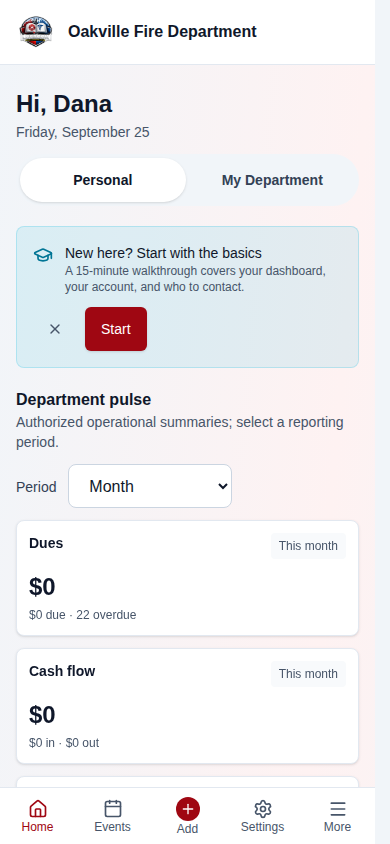
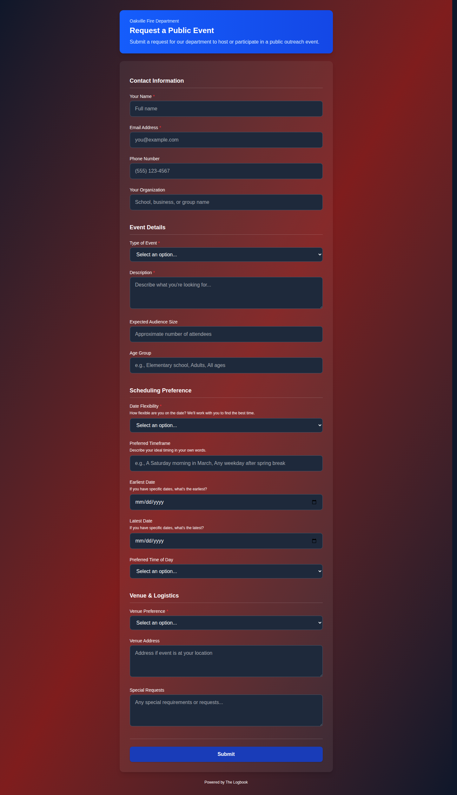
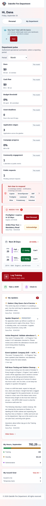
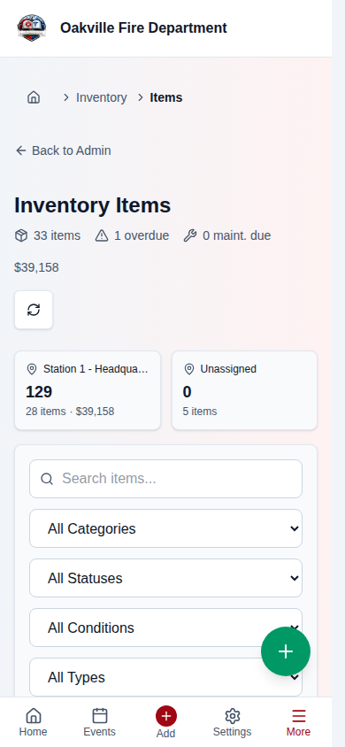
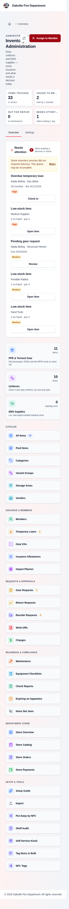

# Mobile & PWA Usage

The Logbook is a Progressive Web App (PWA), which means it works in any modern web browser but can also be installed to your phone or tablet's home screen for a native app-like experience. No app store download is required.

This guide covers installing the app, understanding offline behavior, using mobile-friendly features, and troubleshooting common mobile issues.

---

## Table of Contents

1. [What Is a PWA?](#what-is-a-pwa)
2. [Installing on iPhone / iPad (Safari)](#installing-on-iphone--ipad-safari)
3. [Installing on Android (Chrome)](#installing-on-android-chrome)
4. [Installing on Desktop (Chrome / Edge)](#installing-on-desktop-chrome--edge)
5. [The Installed App Experience](#the-installed-app-experience)
6. [Offline Behavior and Limitations](#offline-behavior-and-limitations)
7. [Push Notifications on Mobile](#push-notifications-on-mobile)
8. [Mobile-Optimized Features](#mobile-optimized-features)
9. [Tips for Mobile Use](#tips-for-mobile-use)
10. [Troubleshooting](#troubleshooting)

---

## What Is a PWA?

A Progressive Web App is a website that can be installed on your device and behaves like a native app:

| Feature                 | Browser                      | Installed PWA                                   |
| ----------------------- | ---------------------------- | ----------------------------------------------- |
| Access from home screen | No (open browser, type URL)  | Yes (tap icon)                                  |
| Full-screen experience  | No (browser toolbar visible) | Yes (standalone, no browser UI)                 |
| Works without internet  | Limited                      | Cached pages load, but data requires connection |
| Automatic updates       | Yes                          | Yes (updates silently in background)            |
| App store required      | No                           | No                                              |

The Logbook uses the **autoUpdate** strategy — when a new version is deployed, it is automatically downloaded in the background and applied the next time you open the app.

---

## Installing on iPhone / iPad (Safari)

iOS requires using **Safari** to install PWAs. Other browsers (Chrome, Firefox) on iOS cannot install PWAs to the home screen.

1. Open **Safari** and navigate to your department's Logbook URL.
2. Log in to verify the site loads correctly.
3. Tap the **Share** button (the square with an upward arrow, at the bottom of the screen on iPhone or top on iPad).
4. Scroll down in the share sheet and tap **Add to Home Screen**.
5. The name will default to "The Logbook" — you can change it if you wish.
6. Tap **Add** in the upper right corner.

> **Screenshot placeholder:**
> _[Screenshot of the Safari share sheet on iPhone showing the "Add to Home Screen" option highlighted, with the Logbook URL in the address bar above]_

The Logbook icon now appears on your home screen. Tapping it opens the app in standalone mode (no Safari toolbar).

> **Hint:** If you don't see "Add to Home Screen" in the share sheet, make sure you are using Safari (not Chrome or another browser) and that you are on the actual Logbook page (not a redirect or login page from a different domain).

---

## Installing on Android (Chrome)

1. Open **Chrome** and navigate to your department's Logbook URL.
2. Log in to verify the site loads correctly.
3. Chrome will show a banner at the bottom: **"Add The Logbook to Home screen"** — tap **Install**.
4. If the banner does not appear, tap the **three-dot menu** (top right) and select **Install app** or **Add to Home screen**.
5. Confirm by tapping **Install**.

> **Screenshot placeholder:**
> _[Screenshot of Chrome on Android showing the install banner at the bottom of the screen ("Add The Logbook to Home screen") with an Install button]_

The Logbook icon appears on your home screen and in your app drawer. It opens in standalone mode.

> **Hint:** Some Android devices also support installing from Firefox or Samsung Internet. The process is similar — look for "Install" or "Add to Home screen" in the browser menu.

---

## Installing on Desktop (Chrome / Edge)

1. Open **Chrome** or **Edge** and navigate to your department's Logbook URL.
2. Look for the **install icon** in the address bar (a monitor with a down arrow, or a "+" icon).
3. Click it and confirm **Install**.
4. The app opens in its own window and appears in your system's application launcher.

Alternatively, use the browser menu: **three-dot menu > Install The Logbook** (Chrome) or **Settings > Apps > Install this site as an app** (Edge).

---

## The Installed App Experience

Once installed, The Logbook runs in **standalone** mode:

- **No browser toolbar** — the app uses the full screen, with the status bar showing your department's theme color (dark red by default)
- **Own task/window** — it appears as a separate app in your task switcher, not as a browser tab
- **Persistent login** — your session persists between app launches (subject to your department's session timeout policy)
- **App icon** — the Logbook icon (or your department's logo) appears on your home screen
- **PWA shortcuts** — long-press the app icon to see quick shortcuts to Dashboard, Events, and Scheduling (supported on Android and some desktop platforms)
- **Bottom tab bar** _(2026-08-07)_ — on phones, four destinations plus **More**
  sit within thumb reach at the bottom of the screen. See
  [Getting Around on a Phone](#getting-around-on-a-phone-2026-08-07).
- **Launches straight to your dashboard** _(2026-08-07)_ — the app used to open
  on the onboarding welcome splash and then redirect, which cost an extra hop
  every launch and, offline while signed out, showed a "Get Started" screen that
  read as though the department had never been set up.
- **A proper launch screen on iOS** _(2026-08-07)_ — iOS does not derive one from
  the app manifest, so the installed app used to flash blank white on every cold
  start. Launch images now cover iPhone SE through 16 Pro Max and the iPad sizes.

### Getting Around on a Phone _(2026-08-07)_

Every destination used to sit behind the hamburger drawer in the **top-left**
corner — two taps to reach anything, from the corner of the screen hardest to
reach one-handed, across 59 navigation entries.

On phones there is now a **bottom tab bar**: four destinations plus a **More**
button, within thumb reach. Tap **More** to open the full navigation drawer.

- The four tabs are chosen for your department, filtered by the modules it has
  enabled. If your department has scheduling switched off, you get a different
  fourth tab rather than a gap.
- Four plus More is the ceiling — labels stop fitting on a 320px phone beyond
  that.
- The bar **hides while the on-screen keyboard is up**, so it never covers the
  field you are typing into.
- On tablets and desktop it does not appear at all: the side or top navigation is
  already visible there, so the bar would be redundant.

### Everything Is Thumb-Sized Now _(2026-08-08)_

Every tappable control in the app now meets the **44-pixel touch minimum** on a
phone — the size a fingertip actually needs. Across all 29 screens the count of
undersized targets is zero, and a test enforces that, so a new control cannot
quietly reintroduce one.

What you will notice in practice:

- **Text boxes, dropdowns and buttons are taller on a phone.** Forms that were
  fiddly — training submission and inventory in particular — are now tappable
  without aiming.
- **Checkboxes are easier to hit without looking bigger.** The box is still the
  same size, so nothing on the page moved; the area that responds to your thumb
  around it grew.
- **Small icon buttons grew.** These are the ones that previously needed a
  careful, deliberate tap.

**Nothing changed on a desktop or laptop.** All of it is scoped to screens under
768 pixels wide — a mouse pointer does not need the target a fingertip does, and
widening everything would have loosened desktop forms for no benefit.

> **[SCREENSHOT NEEDED — manual annotation]:** _The Submit Training form on a
> 375px-wide phone viewport, annotated to show the 44px tap area on an input, a
> checkbox and a small icon button. This one cannot be captured automatically:
> the "before" state no longer exists in any running build, so the comparison
> has to be drawn on rather than shot._

### Nothing Is Too Small to Read _(2026-08-08)_

No ordinary interface text renders below **12 pixels** on a phone. The worst
offenders were the ones you saw on every single screen: the bottom navigation
labels, the footer tagline, the notification count badge, and the "3 hours ago"
style timestamps. One of them was outright backwards — the dashboard timestamps
were set to render _smaller_ on a phone than on a desktop.

This is a readability change aimed at who actually uses the app: volunteer
members across a wide age range, the same reason the app ships a high-contrast
theme.

**Some very small text is intentionally exempt** and stays as it is: chart axis
labels, the day cells in the shift-pattern month grid, and the simulated barcode
on the label-print preview. These are dense fixed-size layouts where enlarging
the text would break the grid rather than help anyone read it.

### Dark Mode Now Works on Public Pages _(2026-08-08)_

If you had dark mode on, three pages rendered as **white-on-white and were
effectively unreadable**:

- The public form page (`/f/<form>`)
- The ballot voting page
- The application status page an applicant checks

These three sit outside the signed-in app shell, and the dark theme's surface
colors are designed to be translucent — meant to sit over the app's own
background. With no app background behind them, they composited over the
browser's plain white page: white labels on a white card, with dark input boxes.

The page background is now painted by the app itself, so no page can render over
the browser's bare canvas. **Printing is unaffected** — printed output has always
forced a white background and still does.

### Automatic Updates

The app uses an **autoUpdate** service worker strategy:

1. Each time you open the app, it checks for updates in the background
2. If a new version is available, it downloads silently
3. The update is applied the next time you close and reopen the app
4. You do not need to take any action — updates happen automatically

In addition, the app includes a **proactive version detection** system:

1. A build timestamp is embedded in the app at build time
2. The `useAppUpdate` hook periodically checks if a newer version has been deployed
3. If a new version is detected, an **Update Available** notification bar appears
   — at the **top** of the screen on desktop and tablet, and at the **bottom** on
   phones _(2026-08-07)_
4. Click the notification to refresh and load the new version

> **Hint:** If you don't see the update notification and suspect you're on an old version, you can always force a refresh with `Ctrl+Shift+R` (desktop) or by closing and reopening the app (mobile).

> **Fixed 2026-08-07:** on a phone the update banner was rendered _behind_ the
> fixed mobile header and was therefore invisible. For an installed app that
> stays open for weeks, that banner is the primary update channel — so if your
> phone has been running a stale version for a while, that is why. It is now
> pinned to the bottom of the viewport, clear of the hamburger menu.

---

## Offline Behavior and Limitations

The Logbook is designed as an **online-first** application. The PWA caches the app shell (HTML, CSS, JavaScript) for fast loading, but **data operations require an internet connection**.

### What Works Offline

- **App shell loads** — the navigation, layout, and UI framework display even without a connection
- **Previously viewed pages** may show cached content (depending on what you last viewed)
- **Barcode scanning** works on a cold offline start — it is deliberately kept
  available, because scanning in a bay with no signal is a real workflow

> **Changed 2026-08-07 — a page you have never opened online is no longer
> available offline.** Installing the app used to download _every_ screen up
> front, including finance, grants, elections and onboarding, which most members
> never open: 275 files and 6.1 MB over whatever rural cellular connection the
> install happened on. It is now 15 files and 1.8 MB — the shell, which carries
> login and the dashboard — and each other screen is stored the first time you
> visit it.
>
> **What this means in practice:** if you know you will be somewhere with no
> signal, open the screens you will need **once** while you still have a
> connection. After that they are cached like before.

### What Requires a Connection

- **All data operations** — viewing member lists, submitting forms, checking in, RSVPing, logging training, etc.
- **API calls** — the service worker is configured with a **NetworkOnly** strategy for all `/api` routes, meaning data is never served from cache

This is a deliberate design decision for data integrity and HIPAA compliance — serving stale or cached member data could lead to incorrect records or privacy issues.

### What Happens When You Lose Connection

- The UI remains responsive; you just cannot load new data
- Most actions that require the server show an error message (typically "Network error" or "Unable to connect")
- **Four things are queued for later** instead of failing: equipment checks
  (including photos), shift reports, training submissions, and event RSVPs.
  You get a "Queued for sync" toast, and the app sends them automatically when
  the device is back online — see the walkthrough in
  [Realistic Example: Mobile Workflow](#realistic-example-mobile-workflow--event-check-in-equipment-scan--offline-queue).

> **Hint:** If you are attending an event at a location with poor cell coverage, check in or RSVP before you arrive while you still have signal. QR code check-in also works — the scan happens on the device and the check-in is submitted when the device has connectivity.

### Signing Out Clears Queued Work _(2026-08-01)_

Station computers are shared: whoever is on duty signs in on the same browser.
Anything left on the device is readable by the next person to sit down, so
**signing out erases everything held locally** — queued equipment checks and
their photos, queued shift reports, queued training submissions and RSVPs, and
saved shift-report drafts.

**If you have queued work, get back online and let it sync before you sign
out.** Anything still waiting is discarded. The app is not silent about it: if
signing out threw away unsent items, the login page tells you how many.

On your own phone this rarely matters, because you stay signed in. It matters
on the shared terminal in the bay, which is exactly where somebody is most
likely to sign out mid-shift.

---

## Push Notifications on Mobile

The Logbook delivers notifications three ways:

- **Push notifications** _(2026-08-07)_ — reach your phone's **lock screen** even
  when the app is closed. This is the one an installed app is actually for.
- **Email notifications** work as configured in your notification preferences
  (event reminders, training expiry, schedule changes)
- **In-app notifications** appear when you open the app — a badge count shows
  unread notifications

### Enabling Notifications

1. Navigate to **My Account > Notifications** (or the Notifications page in the sidebar)
2. Toggle notification preferences for each category:
   - Event reminders
   - Training expiration warnings
   - Schedule changes
   - Form submission alerts
3. Choose delivery method: **Email**, **In-App**, or **Both**

> **Hint:** For time-sensitive alerts (shift changes, urgent messages), enable email delivery so you receive them even when the app is not open.

### Turning On Push _(2026-08-07)_

1. Open **My Account > Notifications**.
2. Switch on **Push notifications**.
3. Accept your device's permission prompt.

**Every existing notification source is covered.** Event reminders, training
expiry, schedule changes, apparatus maintenance due, election notices — all of
them. Nothing had to be enabled per category, because push hooks in where
notifications are recorded rather than at each source.

**Push is per device, not per account.** If you have the app on both your phone
and the station tablet, turn it on in both — and you will be reached on both.

### Edge Cases Worth Knowing

- **iPhone/iPad: you must install the app first.** Web Push on iOS (16.4 and
  later) only exists for a PWA that has been added to the home screen. If you are
  browsing the site in Safari, **the toggle will not appear at all** — that is
  correct, not a bug. Install the app (see
  [Installing on iPhone / iPad](#installing-on-iphone--ipad-safari)), open it from
  your home screen, then look again.
- **No toggle on any platform?** Your department may not have push enabled on its
  deployment. It is off by default and an administrator has to turn it on. The
  app deliberately hides the control rather than offering something that would
  fail when you tapped it.
- **Uninstalling the app, or clearing site data, stops push.** There is no
  callback to tell the server, so the subscription is cleaned up the first time a
  notification cannot be delivered to that device. Re-installing means turning the
  toggle on again.
- **A push failure never blocks the thing that triggered it.** If the push
  service is down, the notification is still recorded and still reaches you
  in-app and by email.

> **For administrators:** push requires `PUSH_ENABLED=true` plus VAPID keys —
> see [Configuration-Environment](../../wiki/Configuration-Environment.md) and
> the IT guide.

---

## Mobile-Optimized Features

Several features are specifically designed for mobile use:

### QR Code Check-In (Events & Shifts)

1. An officer displays the event's QR code on a screen or printout
2. On your phone, scan the QR code with your camera app
3. Your phone opens The Logbook's check-in page
4. Tap **Confirm Check-In**
5. Scan again when leaving to check out

This is the most common mobile interaction — members scan QR codes at events and shift changes.

### Member ID Scanning (Inventory Checkout)

1. Navigate to **Inventory > Members** on your phone
2. Tap the **Scan Member ID** button in the toolbar
3. Your phone's camera activates
4. Point at the member's QR code or barcode ID card
5. The member is instantly selected and their inventory loads — from here you can assign or return items

This is especially useful at equipment distribution events where you need to process many members quickly.

### Barcode Scanning (Inventory)

1. Navigate to **Inventory** on your phone (or desktop)
2. Tap the **Scan** button
3. Your device camera activates as a barcode reader
4. Point at the equipment barcode or QR code
5. The item details load immediately — from here you can check out, return, or view details

Camera scanning works on **all modern browsers** — Chrome, Edge, Firefox, and Safari. On Chrome/Edge, the scanner uses the native BarcodeDetector API for fastest performance. On Firefox and Safari, it falls back to the html5-qrcode library automatically.

On **desktop computers** with only a front-facing webcam, the scanner automatically falls back from the rear camera to the front camera. Hold the barcode or QR code in front of your webcam.

> **Screenshot needed:**
> _[Screenshot of the InventoryScanModal on a desktop browser showing the webcam feed with a barcode being scanned, the live search dropdown showing matching items, and the batch action buttons at the bottom]_

### Form Submission

Forms are fully responsive and work well on mobile:

- Signature fields use touch input — sign with your finger
- Date/time pickers use the device's native controls
- File upload uses the device's camera or photo library
- Checkbox fields are sized for touch targets

### Event RSVP

Quick RSVP from the events list — tap **Going**, **Maybe**, or **Not Going** without opening the full event detail page.

---

## Tips for Mobile Use

1. **Install the app** — using the browser is fine, but the installed PWA gives you a better experience (full screen, home screen icon, faster launch).

2. **Use landscape mode for tables** — member directories, compliance matrices, and report tables are easier to read in landscape orientation on a phone.

3. **Use the search** — on small screens, search is faster than scrolling through long lists. The member directory, inventory, and course library all have search bars.

4. **Check in early** — if the event location has poor cell reception, check in while you still have signal. The system records the check-in time when the server receives it.

5. **Keep your session active** — if your department has a short session timeout, you may need to log in frequently on mobile. Consider asking your IT Manager about the timeout configuration.

6. **Clear the app cache if things look wrong** — if the app seems stuck on an old version or displays incorrectly, see the troubleshooting section below.

---

## Troubleshooting

| Issue                                                               | Solution                                                                                                                                                                                                                                                                                                                                                                                                                                                                                |
| ------------------------------------------------------------------- | --------------------------------------------------------------------------------------------------------------------------------------------------------------------------------------------------------------------------------------------------------------------------------------------------------------------------------------------------------------------------------------------------------------------------------------------------------------------------------------- |
| "Add to Home Screen" not appearing (iOS)                            | You must use **Safari**. Chrome, Firefox, and other browsers on iOS cannot install PWAs. Also verify you are on the actual Logbook URL, not a redirect page.                                                                                                                                                                                                                                                                                                                            |
| "Add to Home Screen" not appearing (Android)                        | Ensure you are using Chrome. The option may be in the three-dot menu under "Install app" or "Add to Home screen." Some browsers use different wording.                                                                                                                                                                                                                                                                                                                                  |
| App shows blank screen after install                                | Close the app completely and reopen. If it persists, uninstall from home screen, clear browser cache for the site, and reinstall.                                                                                                                                                                                                                                                                                                                                                       |
| App stuck on old version                                            | The autoUpdate service worker should handle this. If it doesn't: close the app completely, wait 30 seconds, reopen. On iOS, you can also clear Safari's website data for the Logbook URL in Settings > Safari > Advanced > Website Data.                                                                                                                                                                                                                                                |
| QR code scan not opening the app                                    | On iOS, the camera app opens QR links in Safari, not the installed PWA. This is an iOS limitation. The check-in still works — it just opens in Safari instead.                                                                                                                                                                                                                                                                                                                          |
| Member ID scan not finding member                                   | Verify the member has a `membership_number` assigned and the ID card was generated by The Logbook. Fall back to name search if scanning fails.                                                                                                                                                                                                                                                                                                                                          |
| Barcode scanner not activating                                      | Your browser needs camera permission. Go to your phone's Settings > Privacy > Camera and ensure the browser (or the PWA) has camera access. On desktop, verify your webcam is not in use by another app.                                                                                                                                                                                                                                                                                |
| Scanner not working on Firefox/Safari                               | The scanner automatically falls back to the html5-qrcode library when the native BarcodeDetector API is unavailable. Ensure camera permissions are granted.                                                                                                                                                                                                                                                                                                                             |
| Desktop scan shows rear camera error then recovers                  | This is expected — the scanner tries the rear camera first, then falls back to the front-facing webcam. The brief error is normal on desktop.                                                                                                                                                                                                                                                                                                                                           |
| Login session expires too quickly on mobile                         | Session timeout is configured by your department administrator. Ask your IT Manager to review the session duration in Settings > Security.                                                                                                                                                                                                                                                                                                                                              |
| Notifications not appearing                                         | Check your preferences in My Account > Notifications. If you expected a **lock-screen** notification, see the push section above — push must be enabled by your department, switched on per device, and on iPhone/iPad the app must be installed to the home screen before the toggle even appears.                                                                                                                                                                                     |
| No "Push notifications" toggle at all                               | On iPhone/iPad: you are browsing in Safari rather than running the installed app — install it first. On any platform: your department may not have push enabled on its deployment.                                                                                                                                                                                                                                                                                                      |
| Push stopped after reinstalling the app                             | Subscriptions are tied to the app install on that device. Turn the toggle back on.                                                                                                                                                                                                                                                                                                                                                                                                      |
| Page not loading — "Network error"                                  | The app requires an internet connection for all data operations. Check your Wi-Fi or cellular signal. Try refreshing the page.                                                                                                                                                                                                                                                                                                                                                          |
| Form submission failed                                              | Check your connection. The app does not queue submissions — if the network is unavailable at the moment you tap Submit, the submission fails. Wait for connectivity and try again.                                                                                                                                                                                                                                                                                                      |
| App icon disappeared from home screen                               | Some devices remove PWA icons after system updates or storage cleanups. Reinstall following the steps above.                                                                                                                                                                                                                                                                                                                                                                            |
| Dark mode not applying in PWA                                       | Dark mode follows the app's theme setting (My Account > Appearance), not the device's system setting. Toggle it from within the app.                                                                                                                                                                                                                                                                                                                                                    |
| "Update Available" notification not appearing                       | The version detection checks periodically. If you suspect you're on an old version, force refresh with Ctrl+Shift+R or close and reopen the app.                                                                                                                                                                                                                                                                                                                                        |
| Layout looks wrong on mobile                                        | Mobile responsiveness has been significantly improved (major updates 2026-03-22 and 2026-08-07). Clear your browser cache to load the latest styles. Use landscape orientation for complex tables.                                                                                                                                                                                                                                                                                      |
| Login page shows "Too many attempts"                                | Rate limiting is active. Wait for the countdown timer to expire before trying again.                                                                                                                                                                                                                                                                                                                                                                                                    |
| A page went blank / "Something went wrong"                          | Fixed 2026-08-07/08. An unexpected response from the server used to take a whole screen down instead of showing an empty list — most often on station Wi-Fi behind a captive portal or a carrier interception page, which answer with a web page where the app expects data. If it still happens, note the page and report it; those failures are now recorded on the Error Monitoring page for your IT manager.                                                                        |
| Camera stayed frozen after switching apps mid-scan                  | Fixed 2026-08-07. The scanner used to keep the camera held when the app was backgrounded — iOS suspends it without resuming, so you came back to a frozen preview with the camera indicator still lit. It now releases the camera when you leave and resumes when you return.                                                                                                                                                                                                           |
| Save button hidden behind the keyboard                              | Fixed 2026-08-07 (iOS). Bottom action bars — including Save in the equipment-check and skill-test flows — stayed pinned behind the software keyboard. They now sit above it.                                                                                                                                                                                                                                                                                                            |
| Pull-to-refresh fired while scrolling inside a dialog               | Fixed 2026-08-07. Dragging down inside an already-scrolled panel or modal used to refresh the page and discard whatever was open. The gesture now yields to the scrollable area under your finger.                                                                                                                                                                                                                                                                                      |
| iOS changed what I typed into a username / serial / VIN             | Fixed 2026-08-07. iOS applies autocapitalisation and autocorrect to text fields by default, which was rewriting identifiers and mangling member surnames mid-search. Identifier and search fields now opt out.                                                                                                                                                                                                                                                                          |
| Header or progress bar hidden under the status bar (notched iPhone) | Fixed 2026-08-07. Safe-area insets were applied to the page body, which does nothing for fixed elements.                                                                                                                                                                                                                                                                                                                                                                                |
| A button is too small to hit reliably                               | **Resolved 2026-08-08.** Every tappable control on every screen now meets the 44px minimum on phones, and a test enforces it. If you find one that does not, report it — it is a regression, not a known gap.                                                                                                                                                                                                                                                                           |
| Text on a page is too small to read on my phone                     | **Resolved 2026-08-08.** No ordinary interface text renders below 12px on a phone. Chart axis labels, the shift-pattern month grid and the label-print barcode preview are deliberately exempt — those are dense fixed-size layouts where larger text would break the grid.                                                                                                                                                                                                             |
| A public form / ballot / status page is white-on-white in dark mode | **Fixed 2026-08-08.** The public form page, ballot voting page and application-status page rendered over the browser's plain white background instead of the app's themed one. Hard-refresh to pick up the fix.                                                                                                                                                                                                                                                                         |
| Push was switched on but nothing ever arrives                       | Ask your IT manager to check the deployment's VAPID keypair. Until 2026-08-08 the documented command for generating it did not actually run, and a keypair in the wrong encoding is accepted by the browser and then **silently rejected** by the push service — the subscription looks healthy and no notification is ever delivered. The fix is `backend/scripts/generate_vapid_keys.py`; note that regenerating the keypair requires every member to re-enable push on every device. |

---

## Mobile Responsiveness Updates (2026-03-22)

A comprehensive mobile responsiveness pass was applied across the entire application. The following areas received significant improvements:

### Dashboard

The main dashboard now adapts to phone and tablet screens:

- Stacked card layout on small screens (single column)
- Collapsible sections for shift, event, and notification widgets
- Touch-friendly buttons and controls sized for finger taps
- Notification cards include clear/dismiss buttons directly on the dashboard

### Inventory Module

All inventory pages received responsive design improvements:

- **Items list**: Card layout instead of table rows on mobile
- **Admin hub**: Grouped card sections stack vertically on narrow screens
- **Member equipment**: Collapsible member rows with equipment counts
- **Floating Action Button (FAB)**: Quick-access button for common actions on mobile
  - Non-admin users see "Assign Items" action
  - Admin users see additional actions (Add Item, Scan Barcode, Import CSV)

### Other Pages

- **Scheduling**: Calendar and shift views optimized for mobile touch interaction
- **Events**: Event cards and RSVP buttons sized for touch
- **Members**: Directory uses card layout on mobile
- **Settings**: All settings pages use responsive layouts

### Desktop Camera Scanning

Camera scanning (QR codes, barcodes, member IDs) now works on desktop browsers in addition to mobile:

- Automatic fallback to user-facing camera when no environment-facing camera is available
- Shared scanner infrastructure across all scanning features (inventory, member ID, event check-in)
- Works in Chrome, Edge, Firefox, and Safari

> **Screenshot needed:**
> _[Screenshot of the MemberIdScannerModal on a desktop browser showing the webcam feed in the scanner viewport, with a QR code being detected and the member's name appearing in the result area below]_

> **Edge case:** Desktop browsers require explicit camera permission. If the user denies camera access, the scanner shows a clear error message and the user can fall back to manual text entry.

---

## Camera Scanning Improvements (2026-03-24)

### Camera Error Handling

Camera scanning across the app now provides **specific error messages** instead of generic failures:

| Error                        | Message                                                                          |
| ---------------------------- | -------------------------------------------------------------------------------- |
| Camera permission denied     | "Camera permission denied. Please allow camera access in your browser settings." |
| No camera available          | "No camera detected on this device."                                             |
| Camera in use by another app | "Camera is in use by another application."                                       |

Error messages **stay visible** until you dismiss them (no auto-dismiss), giving you time to read and act on the message.

> **Screenshot needed:**
> _[Screenshot of the MemberScanPage on a mobile device showing a camera error banner: "Camera permission denied. Please allow camera access in your browser settings." with a "Try Again" button and manual entry field below]_

### Inventory Scan Modal

The `InventoryScanModal` now uses `getErrorMessage()` for consistent, specific error display. On desktop browsers where the camera fails, the manual barcode/serial number input field is always available as a fallback.

> **Edge case:** On iOS Safari, camera access requires the page to be served over HTTPS. If your department uses HTTP for local network access, camera scanning will not work — use the manual entry fallback.

### Notification Badges on Mobile

The notification unread count badge is now visible on both mobile and desktop:

- **Top navigation**: Bell icon with red badge count
- **Side navigation**: Notifications link with badge count
- **Smart polling**: Polling pauses when the app/tab is in the background, preserving battery

> **Screenshot needed:**
> _[Screenshot of the mobile top navigation bar showing the hamburger menu, page title, and bell icon with a red "3" badge]_

On a phone the bell is **inside the menu**, not on the bar. The collapsed top
bar is the department logo, the department name, and the hamburger — there is
no page title and no bell on it. Open the menu and the Notifications entry
carries the red unread count. The placeholder stays open until there is a
screen matching what it describes.

---

## Realistic Example: Mobile Workflow — Event Check-In, Equipment Scan & Offline Queue

Follow **FF Sarah Chen** using the PWA on her phone during a busy training day.

### Part 1: Event QR Check-In (Morning)

Sarah arrives at the station for a training event. She pulls out her phone and opens The Logbook from the home screen icon (she installed the PWA last month). She navigates to **Events** and sees today's event at the top: "Q2 Hazmat Refresher."

Sarah taps the event to open the detail page, then taps the **Check In** button. Her phone's camera opens in the barcode scanner view. She points it at the QR code posted on the training room door — the scanner reads it instantly and displays a confirmation: "Checked in at 08:02 AM."

> **Edge case:** The QR code printout at Door B is water-damaged and unreadable. Sarah taps **Manual Check-In** below the scanner. She enters her membership number (OFD-0047) and taps Submit. The system confirms: "Checked in at 08:04 AM — manual entry."

> **[SCREENSHOT NEEDED]:** _Phone camera view showing the QR scanner overlay pointed at a QR code on a door, with the event name "Q2 Hazmat Refresher" displayed at the top of the scanner screen_

### Part 2: Equipment Barcode Scan (Mid-Morning)

During a break between training modules, Sarah needs to check out a portable gas monitor from the equipment room. She opens **Inventory** and taps the **Scan** button in the toolbar. Her camera activates in barcode scanning mode.

She points the camera at the barcode label on the gas monitor. The scanner reads it and the item detail card loads: **MSA Altair 5X**, serial number **INV-000234**, condition **Good**, status **Available**.

Sarah taps **Check Out**, selects herself as the borrower (her name is pre-filled since she is logged in), sets the expected return date to today, and confirms. The item status changes to "Checked Out" with her name shown as the current holder.

> **Edge case:** The barcode on a second gas monitor is partially obscured by a sticker. The camera scan fails after a few seconds. Sarah taps the manual entry field below the scanner, types `INV-000234` in the search box, and the item is found immediately.

> **[SCREENSHOT NEEDED]:** _Inventory item detail card on mobile showing the MSA Altair 5X with serial number, condition badge, and the "Check Out" button at the bottom of the card_

### Part 3: Offline Training Submission (Afternoon — No Signal)

The morning Hazmat Refresher ends at noon. Sarah drives to a remote training site in a rural area for an afternoon practical exercise. Cell coverage drops to zero.

After the practical, Sarah opens **Training > Submit Training** and fills out the form: course name "Hazmat Refresher," duration 4 hours, date today, and selects "Completed" status. She taps **Submit**.

The app detects no network connectivity and shows a toast notification: "Queued for sync — your submission will be sent when connectivity is restored." The submission is stored in the browser's IndexedDB offline queue.

While still offline, Sarah also navigates to **Events** and RSVPs "Going" to next week's event, "Q3 Ladder Operations Drill." That RSVP is also queued with a similar toast message.

> **Edge case:** Sarah force-closes the app and reopens it 30 minutes later. She navigates to the sync queue indicator and sees both items still listed — queued items are persisted in IndexedDB, not held in memory, so they survive app restarts.

### Part 4: Back Online (Evening)

Sarah drives back toward town. As her phone regains cell signal, the app detects connectivity in the background. The offline queue begins syncing automatically:

1. **Training submission** — synced successfully. The record enters **Pending Review** status, waiting for an officer to approve it.
2. **Event RSVP** — synced successfully. Sarah's RSVP to "Q3 Ladder Operations Drill" is confirmed as "Going."

A notification appears: "2 queued items synced successfully." Sarah taps it to verify — her training submission shows "Pending Review" in Training, and her RSVP shows "Going" on the event page.

> **Edge case:** If one of the queued items had failed during sync (for example, if someone else had already submitted an identical training record creating a duplicate conflict), the sync would show an error toast with the specific failure reason: "Training submission failed: A record for this course on this date already exists." The failed item remains in the queue with an error badge. Sarah can tap it to edit and retry, or dismiss it if the duplicate was submitted by someone else on her behalf.

> **[SCREENSHOT NEEDED]:** _Sync status notification on mobile showing "2 queued items synced successfully" with green checkmarks next to "Training submission" and "Event RSVP," displayed as a toast or notification card_

---

**Previous:** [Skills Testing & Psychomotor Evaluations](./09-skills-testing.md) | **Next:** Return to [Training Guide Index](./README.md)
