# Finance

The Finance module manages budgets, purchase requests, expense reports, check requests, dues collection, and approval workflows for your department. It provides a complete financial management system from budget planning through expenditure tracking, with configurable multi-step approval chains and QuickBooks export for integration with your accounting software.

---

## Table of Contents

1. [Finance Overview](#finance-overview)
2. [Finance Dashboard](#finance-dashboard)
3. [Fiscal Years](#fiscal-years)
4. [Budget Categories](#budget-categories)
5. [Creating and Managing Budgets](#creating-and-managing-budgets)
6. [Approval Chains](#approval-chains)
7. [Purchase Requests](#purchase-requests)
8. [Expense Reports](#expense-reports)
9. [Check Requests](#check-requests)
10. [Dues & Assessments](#dues--assessments)
11. [QuickBooks Export](#quickbooks-export)
12. [Realistic Example: Annual Budget Cycle](#realistic-example-annual-budget-cycle)
13. [Troubleshooting](#troubleshooting)

---

## Finance Overview

The Finance module is an optional module that must be enabled by your department administrator in **Settings > Organization > Modules**. Once enabled, the **Finance** section appears in the main navigation.

### Who Uses What

| Role                                            | What They Do                                                                                                    |
| ----------------------------------------------- | --------------------------------------------------------------------------------------------------------------- |
| **All members** (`finance.request`)             | Raise, submit and track their own purchase requests, expense reports, and check requests                        |
| **Officers with `finance.view`**                | View budgets, financial dashboards, dues, and every member's purchase and check requests                        |
| **Officers with `finance.manage`**              | Create and edit budgets, fiscal years, and budget categories; mark payments; manage dues schedules; run exports |
| **Officers with `finance.approve`**             | Approve or deny purchase requests, expense reports, and check requests                                          |
| **Officers with `finance.configure_approvals`** | Set up and manage approval chains and their steps                                                               |

The seeded **Treasurer** position holds all four officer finance permissions, so
a new department's Treasurer can build the approval chain and act on it. Nobody
can approve or pay their own request, whatever they hold.

Every member holds `finance.request`, which is what lets them raise their own
requests. A member who holds nothing else sees **Finance > My Purchase
Requests**, **My Expense Reports** and **My Check Requests** — only the
requests they raised, never anyone else's — and picks a budget line by its name
and the amount left on it ("Training — $1,250.00 remaining"), without seeing
the budget pages. They can edit a request until they submit it and withdraw a
draft; once submitted, only the finance office can cancel it. A department that
does not want members raising requests removes `finance.request` from the
**Member** position.

### Permissions

| Permission                    | Description                                                                                                                 |
| ----------------------------- | --------------------------------------------------------------------------------------------------------------------------- |
| `finance.request`             | Create, submit and track your own purchase requests, expense reports and check requests. Held by every member               |
| `finance.view`                | View financial data including budgets, reports, and dues, and read every member's purchase and check requests (not create)  |
| `finance.manage`              | Create and edit budgets, fiscal years, categories; mark payments on requests; manage dues schedules; run QuickBooks exports |
| `finance.approve`             | Approve or deny submitted requests in the approval workflow                                                                 |
| `finance.configure_approvals` | Create, edit, and delete approval chains and configure approval steps                                                       |

### Key Concepts

- **Fiscal Year** -- The accounting period your department uses for budgeting. All budgets, requests, and reports are tied to a fiscal year.
- **Budget Category** -- A classification for budget line items (e.g., "Apparatus Maintenance", "Training", "Uniforms"). Categories can have parent-child hierarchies and map to QuickBooks accounts.
- **Budget** -- A line item within a fiscal year and category with a budgeted amount. Tracks spent, encumbered, and remaining amounts.
- **Approval Chain** -- A configurable sequence of approval and notification steps that requests must pass through before they are approved. Different chains can apply to different request types and dollar thresholds.
- **Encumbrance** -- When a purchase request is approved, the estimated amount is "encumbered" (reserved) against the budget. This reduces the available balance without counting as spent until the request is marked paid.

### Navigation

| Route                                 | Description                        |
| ------------------------------------- | ---------------------------------- |
| `/finance`                            | Finance Dashboard                  |
| `/finance/budgets`                    | Budget list                        |
| `/finance/budgets/:id`                | Budget detail                      |
| `/finance/my-budgets`                 | My Budgets (lines you own)         |
| `/finance/settings`                   | Fiscal years and budget categories |
| `/finance/settings/approval-chains`   | Approval chain builder             |
| `/finance/approvals`                  | Approvals (`finance.approve`)      |
| `/finance/purchase-requests`          | Purchase request list              |
| `/finance/purchase-requests/new`      | Create a purchase request          |
| `/finance/purchase-requests/:id`      | Purchase request detail            |
| `/finance/purchase-requests/:id/edit` | Edit a draft purchase request      |
| `/finance/expenses`                   | Expense report list                |
| `/finance/expenses/new`               | Create an expense report           |
| `/finance/expenses/:id`               | Expense report detail              |
| `/finance/check-requests`             | Check request list                 |
| `/finance/check-requests/new`         | Create a check request             |
| `/finance/check-requests/:id`         | Check request detail               |
| `/finance/dues`                       | Dues management                    |

---

## Finance Dashboard

Navigate to **Finance** to view the department-wide financial dashboard.

The dashboard provides a high-level summary of your department's financial health:

- **Budget Health** -- Total budgeted, total spent, total encumbered, total remaining, and percent used across all budgets in the active fiscal year
- **Pending Approvals Count** -- How many requests across the department are waiting on an approval step. If you hold `finance.approve`, the card opens the [Approvals](#approving-and-denying-requests) screen
- **Pending Purchase Requests** -- Count of purchase requests awaiting approval
- **Pending Expense Reports** -- Count of expense reports awaiting approval
- **Pending Check Requests** -- Count of check requests awaiting approval
- **Dues Collection Rate** -- Percentage of expected dues that have been collected
- **Recent Transactions** -- A feed of recent financial activity across the department

Below the cards, **Quick Links** open each area. An **Approvals** link ("Approve
or deny requests waiting on a step") leads the list for members holding
`finance.approve`, and is hidden from everyone else, because the page behind it
would only show them Access Denied.

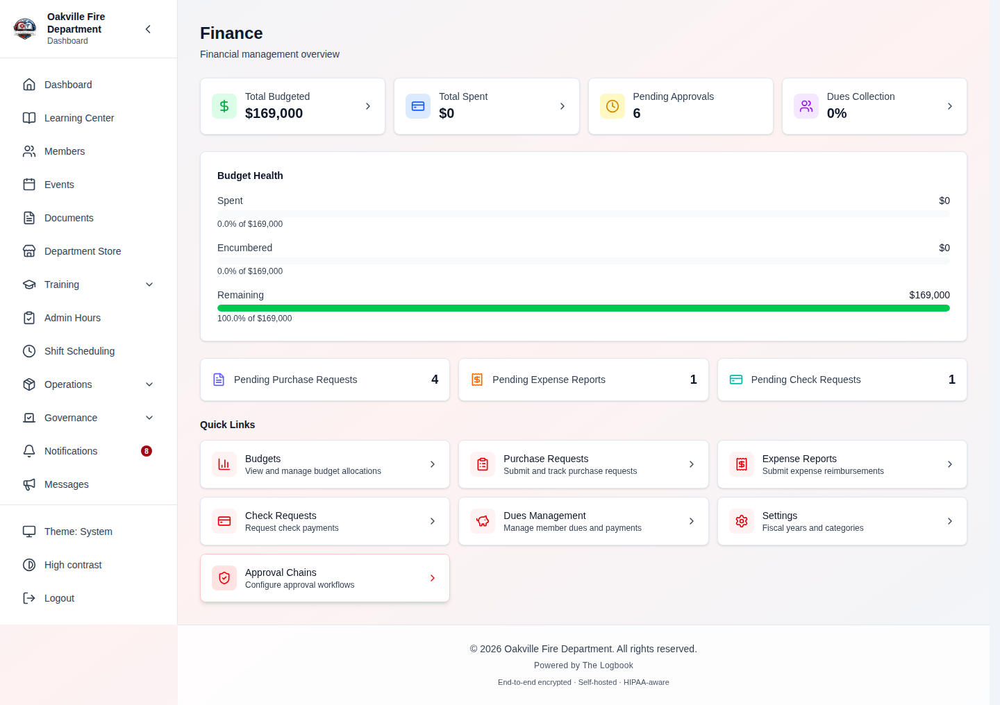

**[SCREENSHOT — REPLACE `11-01-finance-dashboard.png`.** The header subtitle now reads "Budgets, spending, and requests at a glance"; the Quick Links begin with **Approvals** for a `finance.approve` holder, and the dues link is titled **Dues** ("Track member dues and payments"). Capture as the Treasurer so the Approvals link and the linked Pending Approvals card both show.**]**

> **Hint:** The dashboard automatically scopes to the active fiscal year. If no fiscal year is active, the budget health section displays zeroes. Set up your fiscal year first (see [Fiscal Years](#fiscal-years)).

---

## Fiscal Years

**Required Permission:** `finance.manage`

Navigate to **Finance > Settings** to manage fiscal years.

A fiscal year defines the accounting period for your department. All budgets, purchase requests, expense reports, and check requests are tied to a fiscal year. Most fire departments use either a calendar year (January--December) or a government fiscal year (July--June or October--September).

### Fiscal Year Statuses

| Status     | Meaning                                                                                                                                                            |
| ---------- | ------------------------------------------------------------------------------------------------------------------------------------------------------------------ |
| **Draft**  | The fiscal year is being set up. Budgets can be created and edited freely. No requests can be submitted against it yet.                                            |
| **Active** | The fiscal year is open for business. Requests can be submitted, budgets track spending, and approval workflows run. Only one fiscal year can be active at a time. |
| **Closed** | The fiscal year is complete. No new requests can be submitted. Existing data is read-only for reporting purposes.                                                  |

### Creating a Fiscal Year

1. Navigate to **Finance > Settings**.
2. Click **Create Fiscal Year**.
3. Enter a **name** (e.g., "FY 2026-2027").
4. Set the **start date** and **end date**.
5. Click **Save**.

The new fiscal year is created in **Draft** status.

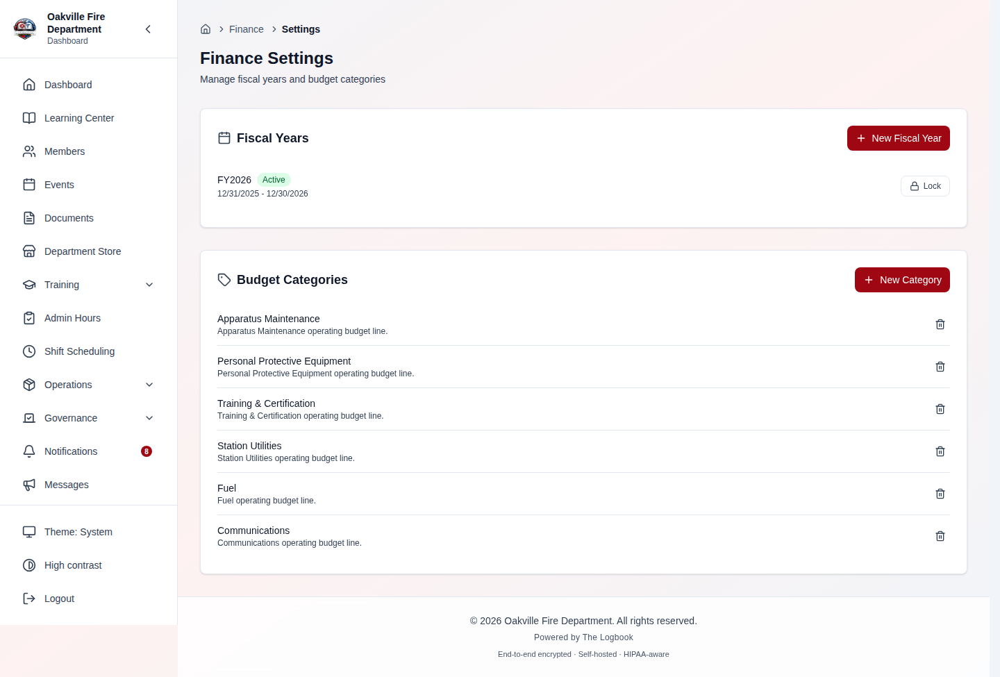

### Activating a Fiscal Year

1. From the fiscal year list, find the draft fiscal year you want to activate.
2. Click **Activate**.
3. Confirm the activation.

Activating a fiscal year makes it the current period for all financial operations. Only one fiscal year can be active at a time -- activating a new one automatically closes the previously active one.

### Locking a Fiscal Year

When a fiscal year is complete:

1. Click **Lock** on the active fiscal year.
2. Confirm the lock.

Locking transitions the fiscal year to **Closed** status and sets the `isLocked` flag. A locked fiscal year cannot be modified or re-opened, and its budget amounts are final: a line's amount can no longer be changed or amended. A line's notes, station and owner can still be edited. This is typically done after year-end reconciliation.

> **Hint:** Create and set up your new fiscal year (including budgets) in Draft status before the current one ends. When the new period begins, activate it. This ensures a seamless transition with no gap in financial tracking.

### Edge Cases

| Scenario                                                | Behavior                                                                                                                                 |
| ------------------------------------------------------- | ---------------------------------------------------------------------------------------------------------------------------------------- |
| Activating a fiscal year when another is already active | The previously active fiscal year is automatically set to Closed status                                                                  |
| Submitting a request with no active fiscal year         | The request form will not allow submission -- the fiscal year dropdown will be empty                                                     |
| Editing a locked fiscal year                            | Not permitted -- the system rejects modifications with "Fiscal year is locked and cannot be modified"                                    |
| Deleting a fiscal year with existing budgets            | Not permitted -- budgets cascade with the fiscal year, but the application blocks deletion of fiscal years that have associated requests |

---

## Budget Categories

**Required Permission:** `finance.manage`

Navigate to **Finance > Settings** to manage budget categories.

Budget categories organize your department's spending into logical groups. Categories support a parent-child hierarchy for detailed tracking (e.g., "Operations" as a parent with "Fuel", "Maintenance", and "Supplies" as children).

### Creating a Category

1. On the **Finance > Settings** page, find the **Budget Categories** section.
2. Click **Add Category**.
3. Enter a **name** (e.g., "Training").
4. Optionally enter a **description**.
5. Optionally select a **parent category** to nest this category under.
6. Set the **sort order** to control display position in lists (default: 0).
7. Optionally enter a **QuickBooks account name** to pre-configure the export mapping (see [QuickBooks Export](#quickbooks-export)).
8. Optionally select an **owner position**. Budget lines in this category that have no owner of their own belong to it (see [Budget Owners](#budget-owners)).
9. Click **Save**.

To change a category's name, description or owner position later, click the pencil beside it.

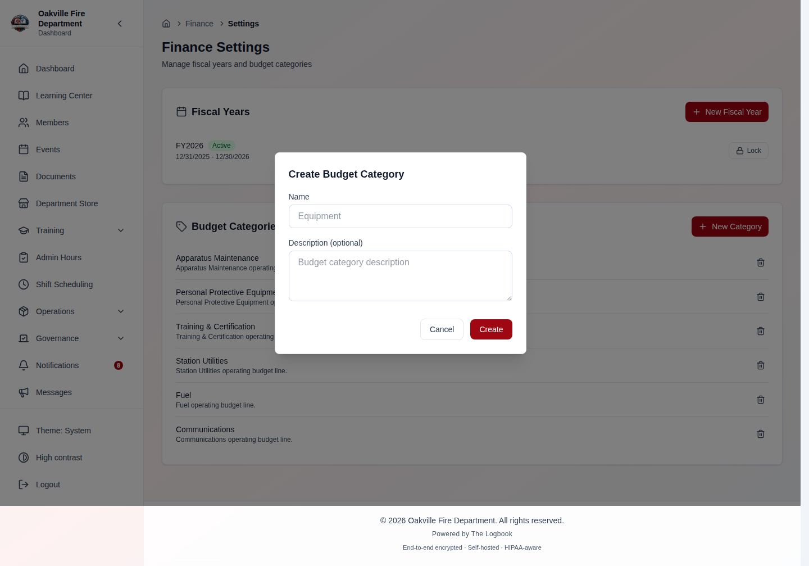

### Category Hierarchy

Categories can be nested one level deep. A parent category serves as a logical grouping for its child categories. For example:

```
Operations (parent)
  ├── Fuel
  ├── Vehicle Maintenance
  └── Station Supplies
Training (parent)
  ├── Course Fees
  ├── Travel
  └── Materials
```

> **Hint:** Keep your category structure aligned with your chart of accounts in QuickBooks or your accounting system. This simplifies the export mapping later and ensures your financial reports match across systems.

### Deactivating a Category

Rather than deleting a category, you can deactivate it by setting `isActive` to false. Deactivated categories are hidden from new budget and request creation forms but remain associated with existing data for historical reporting.

### Edge Cases

| Scenario                                  | Behavior                                                                                                                                                                                                                      |
| ----------------------------------------- | ----------------------------------------------------------------------------------------------------------------------------------------------------------------------------------------------------------------------------- |
| Deleting a category with existing budgets | Permitted, and destructive -- its budgets in every fiscal year are deleted with it, and requests charged to them are left with no budget. The confirmation says so (corrected 2026-10-04); deactivate instead to keep history |
| Deactivating a category                   | The category is hidden from new budget creation but existing budgets retain their category assignment                                                                                                                         |
| Category with no QB account name          | The category can still be used for budgets; export mapping can be configured separately in the QuickBooks Export settings                                                                                                     |
| Self-referential parent                   | The parent category cannot reference itself -- the `parent_category_id` FK points to `budget_categories.id` with SET NULL on delete                                                                                           |

---

## Creating and Managing Budgets

**Required Permission:** `finance.manage`

Navigate to **Finance > Budgets** to view and manage department budgets.

A budget is a line item that allocates a specific dollar amount to a category within a fiscal year. Each budget tracks four key financial figures:

| Field                 | Description                                                                                         |
| --------------------- | --------------------------------------------------------------------------------------------------- |
| **Amount Budgeted**   | The total amount allocated to this budget line item                                                 |
| **Amount Spent**      | The total that has been paid out (from requests marked as Paid or checks marked as Issued)          |
| **Amount Encumbered** | The total reserved by approved but not-yet-paid purchase requests                                   |
| **Amount Remaining**  | `Amount Budgeted - Amount Spent - Amount Encumbered` -- the amount still available for new requests |

**A budget's cap is hard.** Approving a purchase request (which encumbers its
estimate), marking a request or an expense-report line paid, or issuing a check
is refused with _Insufficient available budget_ when it would take Amount Spent
plus Amount Encumbered past Amount Budgeted. There is no override, finance
administrators included. Lowering Amount Budgeted below what is already spent
and encumbered is refused the same way. The check runs with the budget row
locked, so two approvers acting at the same moment cannot both squeeze under the
cap — whichever acts second is refused.

All monetary fields use `Numeric(12, 2)` precision (12 digits total, 2 decimal places) and arithmetic uses Python's `Decimal` type internally to avoid floating-point rounding errors.

### Creating a Budget

1. Navigate to **Finance > Budgets**.
2. Click **Add budget line** (shown only with `finance.manage`).
3. Select the **fiscal year**. Only Draft and Active years are offered; a closed
   year is refused with _This fiscal year is closed_.
4. Select a **category**.
5. Optionally select a **station** to scope the line to one facility. Leave it
   on **Department-wide** for a line that belongs to no station. The station's
   name is what members see when they pick the line on a request.
6. Enter the **amount budgeted** (zero or greater).
7. Optionally select an **owner position** — see
   [Budget Owners](#budget-owners). Left empty, the form says which owner the
   line takes from its category ("Uses the category's owner: Training
   Officer"), or "No owner" when the category has none.
8. Optionally add **notes**.
9. Click **Add budget line**. The list reloads with the new line.

### Editing a Budget

Open the line and click **Edit** (`finance.manage` only). The amount, station,
owner position and notes can be changed; the fiscal year and category are fixed
once the line exists. Setting the station back to **Department-wide** or the
owner back to the category's clears the value. Lowering the amount below what
is already spent and encumbered is refused with _Insufficient available
budget_, and the dialog stays open with that message.

In a **locked** fiscal year the amount is shown read-only with the hint _This
fiscal year is locked._; the other fields still save.

When leadership has approved **extra money** for a line, record an amendment
instead of editing the amount (below) — the amendment keeps the record of who
approved it and why.

### Budget Amendments

An amendment records extra money approved for a budget line — by a board vote,
the Chief, the membership — and raises the line's budget by that amount.
Requires `finance.manage`.

1. Open the budget line from **Finance > Budgets**.
2. Click **Add amendment**.
3. Fill in:
   - **Amount added** — the extra money, more than zero.
   - **Reason** — what it is for.
   - **Approved by** — who approved it, for example _Board vote 10/7_.
   - **Approval date** — the day it was approved (defaults to today; it
     cannot be in the future).
4. Click **Record amendment**.

The line's budget goes up by the amount at once. Once a line has amendments its
page shows the **Original budget**, the **Current budget** and **Amendments:
+$X (n)**, and the **Amendments** section lists each one with its approval
date, amount, who approved it, the reason, and who entered it and when. The
Budgets list marks the line _(amended)_.

- Amendments can be added in **draft**, **active** and **closed** fiscal years,
  but not in a **locked** one — the button is hidden there.
- An amendment cannot be edited or removed afterwards; it is the record of what
  was approved. To take money back out, edit the amount (while the year is not
  locked).
- A purchase or check request that was refused for lack of funds is **not**
  re-run when the budget goes up, and nobody is emailed. The member submits it
  again.

### Budget Owners

A budget line is owned by a **position**, not a person, so ownership follows
whoever holds the position — an election or a resignation needs no
reassignment.

- A **category** may name an owner position (set it in **Finance > Settings**
  when creating or editing the category).
- A **line** may name its own owner position, which overrides the category's.
- A line with no owner of its own **inherits** its category's. The Budgets list
  shows this as "Training Officer (from category)".
- A line with neither has **No owner**.

Ownership covers a line in every fiscal year, past ones included. Only
`finance.manage` sets amounts, owners and stations; owning a line never lets a
member change its amount.

### My Budgets (for budget-line owners)

If your position owns a budget line — say you are the Training Officer and
the Treasurer made that position the owner of the Training category — open
**Finance > My Budgets** (`/finance/my-budgets`). The menu shows the entry
only once you own at least one line; you do not need `finance.view`.

- Your lines are grouped by fiscal year: the current year first, then next
  year's draft, then closed years. You keep seeing a line in past years.
- Each line shows its category and station, the owner position ("(from
  category)" when the line inherits it), the current budget (and the original
  once amended), **Spent**, **Committed**, **Remaining** and a bar.
  **Committed** is money approved for purchases that have not been paid yet —
  the "encumbered" amount.
- Tap a line to open its detail page: the figures, its amendments and its
  **Transaction History**. You can read everything there but change nothing —
  the amount, owner, station and amendments stay with the Treasurer
  (`finance.manage`).
- No lines? A line appears once the Treasurer makes your position its owner,
  on the line or on its category.

Only lines you own open for you; any other line's address answers "Budget not
found".

### Viewing Budget Details

Click on any budget in the list (or, as an owner, on **My Budgets**) to view its detail page at `/finance/budgets/:id`. The detail page shows:

- Budget amount and category
- Visual breakdown of spent, committed (encumbered), and remaining amounts (progress bar)
- **Transaction History** — newest first, 25 to a page: approved and paid
  purchase requests, issued checks (a voided check stays listed as
  "Reversed"), and paid expense-report items charged to this line, each with
  its date, number, vendor or payee, requester, status, amount and whether it
  is **Spent** or **Committed**. The Spent rows add up to the Spent figure
  above, and the Committed rows to the Committed figure
- Budget utilization percentage

> **Updated 2026-10-08.** The transaction table used to be a stub that always
> said "No transactions yet"; it now lists the real records.
>
> The **bar reads 0% until something is approved**, because spend and
> encumbrance accrue only on approval.
>
> **Narrowed 2026-09-06.** Until that date nothing could be approved at all:
> `finance.approve` gates the approval endpoints and no seeded position held
> it, leaving only the `*` IT administrator, who is refused by separation of
> duties for anything they raised. The **Treasurer** now carries
> `finance.approve` and `finance.configure_approvals`, seeded and back-filled
> to departments that already onboarded. What remains is a configuration
> matter: a department whose only approver is the Treasurer still cannot clear
> a request the Treasurer raised, so a chain that must survive that needs a
> second approver step. The approval history is recorded in
> [KNOWN_LIMITATIONS.md](../KNOWN_LIMITATIONS.md#finance--nobody-could-approve-anything-2026-08-12-narrowed-2026-09-06).

### Budget Summary

The budget summary provides an aggregate view across all budgets in a fiscal year:

- **Total Budgeted** -- Sum of all budget line items
- **Total Spent** -- Sum of all paid amounts across all budgets
- **Total Encumbered** -- Sum of all approved-but-unpaid amounts
- **Total Remaining** -- `Total Budgeted - Total Spent - Total Encumbered`
- **Percent Used** -- `(Total Spent + Total Encumbered) / Total Budgeted * 100`, rounded to two decimal places. Displays 0% if total budgeted is zero (division-by-zero guard).

> **Hint:** Monitor the **Amount Remaining** column closely. When a budget line item approaches zero remaining, any new purchase requests against that category will still be submittable, but approvers will see the over-budget condition and can make informed decisions.

### Edge Cases

| Scenario                                          | Behavior                                                                                                                                                                                                                                      |
| ------------------------------------------------- | --------------------------------------------------------------------------------------------------------------------------------------------------------------------------------------------------------------------------------------------- |
| Changing or amending an amount in a locked year   | Not permitted -- refused with "This fiscal year is locked. Budget amounts can no longer be changed or amended." Notes, station and owner still save                                                                                           |
| Creating a budget in a closed fiscal year         | Not permitted -- fiscal year must be in Draft or Active status                                                                                                                                                                                |
| Two budgets for the same category and fiscal year | Permitted -- useful when different stations have separate budgets for the same category. Requests are linked to a specific budget, not just a category                                                                                        |
| Budget remaining would go negative                | Not permitted -- the approval, payment or check that would push spent plus encumbered past the amount budgeted is refused with _Insufficient available budget_. Budget release operations are floored at zero to prevent negative encumbrance |
| Deleting a budget with linked requests            | Not permitted -- the linked requests must be cancelled or reassigned first                                                                                                                                                                    |
| Budget summary with no budgets                    | Returns all zeroes and 0% utilization                                                                                                                                                                                                         |

---

## Approval Chains

**Required Permission:** `finance.configure_approvals`

Navigate to **Finance > Settings > Approval Chains** to configure approval workflows.

Approval chains define the sequence of approvals and notifications that purchase requests, expense reports, and check requests must pass through. Each chain is a series of ordered steps that are executed sequentially when a request is submitted.

### How Approval Chains Work

When a member submits a request (purchase request, expense report, or check request), the system:

1. **Matches a chain** -- Finds the most specific approval chain for the request based on entity type, dollar amount, and budget category (see [Chain Resolution](#chain-resolution-specificity) below).
2. **Creates step records** -- Creates a pending record for each step in the matched chain. Steps below the auto-approve threshold are immediately marked as Auto-Approved.
3. **Processes steps in order** -- Each step must complete before the next one activates. Notification steps auto-advance after sending.
4. **Completes the chain** -- When all steps are complete, the request moves to Approved status and the appropriate budget action occurs (e.g., encumbrance for purchase requests).

### Separation of Duties _(2026-08-01)_

**You cannot approve a request you raised**, even holding `finance.approve`.
The system refuses the approval and tells you to route it to another
authorized approver.

This is the control every set of department bylaws puts on disbursements, and
it is what ISO/IEC 27001 calls segregation of duties (A.5.3). Before this,
holding the approval permission was the only check — a treasurer could raise a
check request and walk it through its own chain unassisted.

It applies to all three request types (purchase requests, expense reports,
check requests). Notes:

- **Denying your own request is still allowed.** Withdrawing something you
  submitted is not a conflict of interest.
- **Auto-approve thresholds are unaffected.** A department deciding that
  requests under a dollar amount need no review is a policy choice, and the
  chain records those steps as Auto-Approved without anyone acting.
- **An emailed approval link follows the same rule.** When an **Email** step's
  address is the requester's own, approving through the link is refused —
  _"This request's requester and this step's approver are the same person;
  self-approval is not allowed for this step."_ — unless the step has **Allow
  Self-Approval** on. Denying through it is allowed.
- **Small departments:** if only one person holds `finance.approve`, that
  person cannot submit requests through the chain. Grant the permission to a
  second officer — which is the point of the control, not a workaround.

### Chain Resolution (Specificity)

When multiple chains could apply to a request, the system selects the most specific match using a point-based scoring system:

| Criterion              | Points | Description                                                                                                                                                                         |
| ---------------------- | ------ | ----------------------------------------------------------------------------------------------------------------------------------------------------------------------------------- |
| **Category match**     | +4     | The chain is scoped to a specific budget category that matches the request's budget category. If the chain has a category set but it does not match, the chain is skipped entirely. |
| **Amount range match** | +2     | The chain has min/max amount thresholds and the request amount falls within the range. Chains where the amount falls outside the range are skipped.                                 |
| **Default chain**      | +1     | The chain is marked as `isDefault` for the entity type.                                                                                                                             |

The chain with the highest score wins. If no chain matches at all (or the matching chain has no steps), the request transitions directly to `PENDING_APPROVAL` status without any approval step records, and is decided by hand from its detail page — see [When No Approval Chain Applies](#when-no-approval-chain-applies-2026-09-30).

### Chain Fields

| Field               | Description                                                                                     |
| ------------------- | ----------------------------------------------------------------------------------------------- |
| **Name**            | A descriptive name for the chain (e.g., "Standard Purchase Approval")                           |
| **Description**     | Optional notes about when this chain applies                                                    |
| **Applies To**      | Which request type this chain governs: `purchase_request`, `expense_report`, or `check_request` |
| **Min Amount**      | The minimum dollar amount for this chain to apply (leave blank for no minimum)                  |
| **Max Amount**      | The maximum dollar amount for this chain to apply (leave blank for no maximum)                  |
| **Budget Category** | Optionally restrict this chain to requests in a specific budget category                        |
| **Is Default**      | Whether this chain is the default fallback for its entity type                                  |
| **Is Active**       | Whether the chain is currently in use (inactive chains are ignored during resolution)           |

### Creating an Approval Chain

1. Navigate to **Finance > Settings > Approval Chains**.
2. Click **New Chain**.
3. Enter the chain **Name** and optional **Description**.
4. Choose what it **Applies To**: Purchase Requests, Expense Reports, or Check Requests.
5. Optionally choose a **Budget Category** (or leave **Any category**).
6. Optionally set **Min Amount ($)** and **Max Amount ($)**.
7. Tick **Default chain (preferred when no more specific chain matches)** if this should be the fallback for its request type.
8. Click **Create Chain**.

A new chain has no steps. Until you add some, the chain card says _"No steps
yet. Requests routed to this chain get no approval steps."_ — and a request
routed to it is decided by hand from its detail page (see
[No chain applies](#when-no-approval-chain-applies-2026-09-30)).

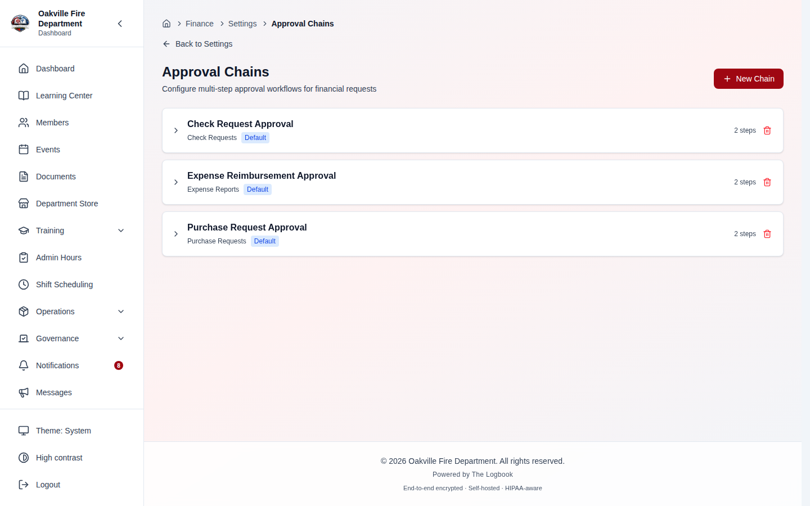

**[SCREENSHOT — REPLACE `11-06-approval-chains.png`.** The page subtitle now reads "Set who approves purchase requests, expense reports, and check requests", and an expanded chain now carries an **Add step** button, a pencil (**Edit chain**) beside the trash icon in its header, and on each step **Move up** / **Move down**, **Edit step** and **Delete step** controls. Capture one chain expanded with two or three steps, one of them an Email approver.**]**

### Editing a Chain _(2026-09-29)_

The pencil in a chain's header opens **Edit chain**: **Name**, **Description**
and **Active** — _"Only active chains are used for newly submitted requests.
Turning a chain off does not change requests already going through it."_ Click
**Save chain**. What a chain applies to, its category, its amount range and its
default flag are set when it is created; to change those, create a new chain and
delete or deactivate the old one.

### Adding Steps to a Chain _(built 2026-09-29)_

Expand a chain and click **Add step**. The **Add step** dialog asks for:

| Field                            | Shown when           | What it does                                                                                                                                                                                             |
| -------------------------------- | -------------------- | -------------------------------------------------------------------------------------------------------------------------------------------------------------------------------------------------------- |
| **Step name**                    | Always               | e.g. "Treasurer review", "Chief approval"                                                                                                                                                                |
| **Step type**                    | Always               | **Approval** — _"The request waits here until someone approves or denies it."_ **Notification** — marked sent on the request's timeline and does not hold the request up. **It does not send an email.** |
| **Approver type**                | Approval steps       | **None**, **Position**, **Permission**, **Specific member** or **Email**                                                                                                                                 |
| _Approver value_                 | An approver type set | A list of positions, permissions or members to pick from (a text box if your account cannot load that list), or **Approver email** for the Email type                                                    |
| **Allow self-approval by email** | Email approvers only | Lets that address approve through the emailed link even when it is the requester's own email                                                                                                             |
| **Auto-approve under ($)**       | Approval steps       | _"A request for less than this amount is approved at this step automatically when it is submitted."_ Leave blank to always require approval                                                              |

Click **Add step**. A new step goes to the end of the chain; use the arrow
buttons beside it to **Move up** or **Move down**, the pencil to **Edit step**
(then **Save step**), and the trash icon to **Delete step**.

What the dialog says about approvers is the rule the system actually applies,
and it differs from what the approver type suggests:

- **Only the approver a step names can approve or deny it** _(2026-10-05)_.
  A **Position** step takes active members who hold that position; a
  **Permission** step takes active members granted that permission; a
  **Specific member** step takes that member; an **Email** step takes the
  member whose account email it is (or the outside approver, through the
  emailed link). A step with **None** still takes anyone holding
  `finance.approve`, as before.
- **An approvals administrator can override.** Someone holding
  `finance.configure_approvals` (the Treasurer, by default) can approve or deny
  a step that is not theirs by giving an **Override reason**, which goes to the
  audit log. An override never lets anyone approve their own request.
- **Only the Email type contacts anyone.** When a request reaches an Email
  step, that address is sent a link to approve or deny it (if email sending is
  set up). Position, Permission and Specific member steps send nothing — the
  request simply appears on the [Approvals](#approving-and-denying-requests)
  screen.
- **An emailed approval link stops working** if its step has since been changed
  away from an Email approver; the request then goes through the Approvals screen.
- **Members approving in The Logbook can never approve their own request**,
  whatever **Allow self-approval by email** says; that box governs the emailed
  link only.

The dialog does not offer **Notification Emails**, **Email Template** or
**Required**: the backend stores those fields but nothing reads them, so a
control for them would change nothing.

**Deleting a step is not a tidy-up.** The confirmation says what it does: the
step is removed from every request routed through the chain, including the
record of who approved or denied it and their notes. A request waiting on that
step moves to the next one — and an Email approver on that next step is **not**
sent a link — and a request with no later step is left waiting with nothing to
approve. It cannot be undone. Prefer deactivating the chain and building a new
one when requests are in flight.

> **Before 2026-09-29** this screen could create and delete chains but not
> touch their steps — the endpoints existed and nothing called them, so a chain
> could not be given any step without the API. And creating a chain from the
> page failed with a 422 (_applies_to missing_), because the page sent field
> names the backend did not read. Both are fixed; the earlier "Not built" note
> here and the matching row in
> [KNOWN_LIMITATIONS.md](../KNOWN_LIMITATIONS.md#finance--five-guide-sections-with-no-screen-2026-08-09)
> no longer describe the screen.

> **Screenshot needed:**
> _[Finance → Settings → Approval Chains → expand a chain → **Add step**, with Step type **Approval**, Approver type **Email**, an approver email filled in, the **Allow self-approval by email** box and the **Auto-approve under ($)** field visible, and the help text under Approver type readable.]_

> **Screenshot needed:**
> _[Treasurer or admin holding finance.configure_approvals and positions.view, /finance/settings/approval-chains. The Add step dialog over an expanded purchase-request chain: Step type Approval, Approver type Position, the position picker set to Treasurer, Auto-approve under ($) = 250. The finance.approve help text under Approver type must be visible.]_

> **Screenshot needed:**
> _[Treasurer or admin holding finance.configure_approvals, /finance/settings/approval-chains. The Delete step confirmation over a chain with three steps, showing the history-removal and waiting-request warnings and the Delete step / Keep it buttons. Never confirm.]_

### Steps nobody can act on _(2026-10-05)_

Because only the named approver can act, a step whose approver has gone leaves
its requests stuck. The Approval Chains page now checks every approval step and
puts an amber warning on any that nobody can act on, with how many requests are
waiting on it (_"3 requests waiting"_). The reason reads, for example, _"No
active member can act on this step"_, _"Not a valid email address"_ or that the
chosen position, member or permission no longer exists. A banner at the top
counts the affected steps (_"1 approval step has no one who can act on it.
Requests waiting on it need an approvals admin to override, or fix the step."_).
The warnings refresh after every chain or step change. Fix the step, or have an
approvals administrator act on the waiting requests with an override reason in
the meantime. Saving a step also checks its approver: a position must exist, a
member must be active, a permission must be a real permission name, and an Email
step takes exactly one address.

> **Screenshot needed:**
> _[Treasurer at /finance/settings/approval-chains with a demo chain whose step names a position nobody holds: the page banner and the amber "No active member can act on this step" chip with "N requests waiting" under that step.]_

### Previewing Chain Resolution

> **Corrected 2026-10-04.** There is no **Preview** tool on the Approval
> Chains page. `GET /finance/approval-chains/preview?entity_type=…&amount=…`
> answers the question — which chain a request of that type, amount and
> category would get — and the frontend service has a method for it, but no
> screen calls it. To check a configuration from the UI, submit a test request
> and read its approval timeline.

> **Hint:** Set up at least one default chain for each request type (Purchase Request, Expense Report, Check Request) before members begin submitting requests. Without a matching chain, a request waits in Pending Approval with no approval steps, and a `finance.approve` holder has to decide it from its detail page.

### Example Chain Configuration

A typical fire department might configure these chains:

**Purchase Requests:**

- "Small Purchases" (under $500): 1 step -- Captain Approval
- "Standard Purchases" ($500--$5,000): 2 steps -- Captain Approval, then Chief Approval
- "Large Purchases" (over $5,000): 3 steps -- Captain Approval, Chief Approval, then Board Notification
- "Training Purchases" (category: Training, any amount): 2 steps -- Training Officer Approval, then Chief Approval

**Expense Reports:**

- Default chain: 2 steps -- Supervisor Approval, then Treasurer Notification

**Check Requests:**

- Default chain: 2 steps -- Treasurer Approval, then Chief Approval

### Approval Step Statuses

As a request moves through its approval chain, each step has a status:

| Status            | Meaning                                                                                                   |
| ----------------- | --------------------------------------------------------------------------------------------------------- |
| **Pending**       | The step is active and awaiting action from its named approver (or an approvals administrator's override) |
| **Approved**      | The approver has approved the request at this step                                                        |
| **Denied**        | The approver has denied the request at this step (stops the entire chain)                                 |
| **Skipped**       | The step was skipped (not required or conditions not met)                                                 |
| **Auto-Approved** | The request amount was below the step's `autoApproveUnder` threshold                                      |
| **Sent**          | For notification steps, the notification has been sent and the step auto-advanced                         |

### Edge Cases

| Scenario                                             | Behavior                                                                                                                                                                                            |
| ---------------------------------------------------- | --------------------------------------------------------------------------------------------------------------------------------------------------------------------------------------------------- |
| No approval chain matches a submitted request        | The request moves to Pending Approval status without step records. A `finance.approve` holder other than the requester approves or denies it from its detail page (2026-09-30)                      |
| Approver denies at step 2 of 3                       | The entire chain stops. The request is marked Denied with the denial reason. Remaining steps are not processed                                                                                      |
| Self-approval when `allowSelfApproval` is false      | The step appears on the Approvals screen but the submitter cannot act on their own request -- another `finance.approve` holder must act                                                             |
| Multiple members hold the "Captain" position         | Any one of them can approve the step -- it is a first-come approval. So can any other `finance.approve` holder: the approver type is not enforced                                                   |
| Auto-approve threshold set to $200 on a $150 request | The step is automatically created with status Auto-Approved and the chain advances to the next step                                                                                                 |
| Editing a chain after requests have been submitted   | Existing in-flight requests continue using the step records that were created at submission time. The edited chain applies only to newly submitted requests                                         |
| External email approver (Email type)                 | The approver receives an email with a secure approval token (valid for 7 days). No Logbook account is required. Expired tokens are rejected                                                         |
| External approver uses the link a second time        | The link works once. Acting on it clears the token, so reopening it later reports **Approval not found**, and a duplicate click racing the first is refused rather than recording a second decision |
| Denial does not release encumbrance                  | By design -- denial happens during the approval flow (before the request reaches Approved status), so no encumbrance exists to release                                                              |

---

## Approving and Denying Requests

**Required Permission:** `finance.approve`

_(New 2026-09-29.)_ Before this there was no screen for it: the approve and
deny endpoints existed, and an approver could act only through the API or an
emailed link.

### The Approvals screen

**Finance > Approvals** (`/finance/approvals`), also reached from the
dashboard's **Pending Approvals** card and its **Approvals** quick link, lists
the requests waiting on an approval step you can act on — one row per request,
showing **Request**, **Type**, **Requested by**, **Amount**, **Step**,
**Waiting on** and **Submitted**, with **Approve** and **Deny** buttons.

The page reads _"Requests waiting on you."_ and, since 2026-10-05, lists only
the steps **you are the named approver for**. A **Waiting on** column says who
each step is assigned to. If you are an approvals administrator
(`finance.configure_approvals`) you also see the steps assigned to other people,
marked **Not assigned to you**, with **Approve as approvals admin** and **Deny
as approvals admin** buttons: those open a dialog that names who the step is
assigned to and requires an **Override reason** (up to 2,000 characters,
_"Recorded in the audit log."_) as well as the usual notes. When nothing is
waiting on you the page says _"Nothing is waiting on you."_ The dashboard's
**Pending Approvals** count is unchanged and still counts every waiting request.

- **Approve** opens **Approve request** with an optional **Notes** box (_"Shown
  on the request's approval timeline."_). If more steps follow, the request
  moves to the next one.
- **Deny** opens **Deny request** and requires a **Reason**. Denying ends the
  request — no later steps run — and the reason is saved on the request.

If you raised the request yourself, the approval is refused with the
separation-of-duties message (see [Separation of Duties](#separation-of-duties-2026-08-01)).

> **Screenshot needed:**
> _[Finance → Approvals as an approvals administrator (finance.configure_approvals), with one request assigned to them and one assigned to someone else: the "Requests waiting on you." heading, the admin explanation line, the Waiting on column, the "Not assigned to you" badge and the "Approve as approvals admin" / "Deny as approvals admin" buttons on the second row. Demo data only.]_

> **Screenshot needed:**
> _[Finance → Approvals, a "Approve as approvals admin" dialog open on a step assigned to another member: the "This step is assigned to <name>…" text, Notes, and the Override reason box with its help text "Why you are acting on a step assigned to someone else. Recorded in the audit log." Do not submit.]_

> **Screenshot needed (replace):**
> _[Finance → Approvals as the Treasurer, with three or four waiting requests of mixed types (purchase request, expense report, check request) showing the Request, Type, Requested by, Amount, Step and Submitted columns and the Approve / Deny buttons on each row.]_

### On the request's own page

Each purchase request, expense report and check request detail page shows,
above its approval timeline, a panel that always says _"Waiting on **(who the
step is assigned to)**."_ for a pending approval step. If you are that approver
it adds _"You can approve or deny this step."_ with **Approve** and **Deny**
buttons. If you are an approvals administrator and the step is someone else's it
shows a **Not assigned to you** badge ( _"As an approvals administrator you can
act on it by giving an override reason."_ ) with **Approve as approvals admin**
and **Deny as approvals admin**. For anyone else it shows no buttons. A
notification step is never offered. The page reloads the request afterwards.

### When No Approval Chain Applies _(2026-09-30)_

A request submitted when no chain matches — or when the matching chain has no
steps — waits in **Pending Approval** with no approval steps, and every
step-based action needs a step. Until 2026-09-30 such a request could not be
moved by anyone.

Its detail page now shows a panel to `finance.approve` holders: _"No approval
chain applies to this request. Approve or deny it here."_

- **Approve** asks for an optional **Note** (_"Saved in the audit log."_) and
  marks the request approved — with the same budget effect as a completed
  chain, so a purchase request is encumbered and a budget cap still applies.
- **Deny** requires a **Reason** (_"The requester sees this reason."_) and
  marks it denied.
- **The requester cannot approve their own request** — the panel says _"You
  submitted this request, so someone else has to approve it. You can still
  deny it."_ and offers only **Deny**.

Both decisions are written to the audit log
(`finance.manual_approval_approved` / `finance.manual_approval_denied`). These
requests do not appear on the Approvals screen, which lists step-based
approvals only.

> **Screenshot needed:**
> _[A purchase request detail page in Pending Approval with no approval chain configured, viewed by the Treasurer: the "No approval chain applies to this request. Approve or deny it here." panel with its Approve and Deny buttons, and the approval timeline reading "This request has no approval steps."]_

---

## Purchase Requests

Navigate to **Finance > Purchase Requests** to view and manage purchase requests.

Purchase requests are used when a member needs to buy something for the department. The request goes through the configured approval chain before the purchase is authorized.

### Purchase Request Workflow

```
DRAFT --> SUBMITTED --> PENDING_APPROVAL --> APPROVED --> ORDERED --> RECEIVED --> PAID
                             |
                           DENIED
              |
          CANCELLED
```

| Status               | Description                                                            | Budget Impact                                                                                   |
| -------------------- | ---------------------------------------------------------------------- | ----------------------------------------------------------------------------------------------- |
| **Draft**            | Request is being prepared by the member. Not yet visible to approvers. | None                                                                                            |
| **Submitted**        | Request has been submitted and is entering the approval chain.         | None                                                                                            |
| **Pending Approval** | Request is waiting for one or more approvers to act.                   | None                                                                                            |
| **Approved**         | All approval steps are complete. The purchase is authorized.           | **Estimated amount is encumbered** (reserved against the budget)                                |
| **Ordered**          | The item has been ordered from the vendor.                             | Encumbrance remains                                                                             |
| **Received**         | The item has been received by the department.                          | Encumbrance remains                                                                             |
| **Paid**             | Payment has been made to the vendor.                                   | **Encumbrance is released; actual amount (or estimated if no actual specified) moves to spent** |
| **Denied**           | An approver has denied the request.                                    | None (denial occurs before encumbrance)                                                         |
| **Cancelled**        | The requester or an officer has cancelled the request.                 | **Encumbrance is released** if the request had been approved, ordered, or received              |

### Request Numbers

Purchase request numbers are auto-generated in the format **PR-YYYY-0001**, where YYYY is derived from the fiscal year's start date and the sequence number increments for each new request within that year (e.g., PR-2026-0001, PR-2026-0002).

### Creating a Purchase Request

**Required Permission:** `finance.request` (every member) or `finance.manage`

1. Navigate to **Finance > Purchase Requests**.
2. Click **New Purchase Request** (or go directly to `/finance/purchase-requests/new`).
3. Fill in the request details:

| Field                | Required | Description                                                           |
| -------------------- | -------- | --------------------------------------------------------------------- |
| **Title**            | Yes      | Brief description of what is being purchased (max 300 characters)     |
| **Fiscal Year**      | Yes      | The fiscal year to charge this purchase against                       |
| **Budget**           | No       | The specific budget line item (helps approvers see remaining balance) |
| **Estimated Amount** | Yes      | The expected total cost (must be greater than zero)                   |
| **Vendor**           | No       | The vendor or supplier name                                           |
| **Priority**         | Yes      | Low, Medium (default), High, or Urgent                                |
| **Description**      | No       | Detailed justification for the purchase                               |
| **Apparatus**        | No       | If the purchase is for a specific vehicle                             |
| **Facility**         | No       | If the purchase is for a specific fire station or facility            |
| **Notes**            | No       | Additional notes for approvers                                        |

4. Click **Create Request**. The request is saved as a **Draft** — the form says so: _"Saved as a draft. Submit it for approval from the next page."_ Editing a draft later saves with **Save Changes**.

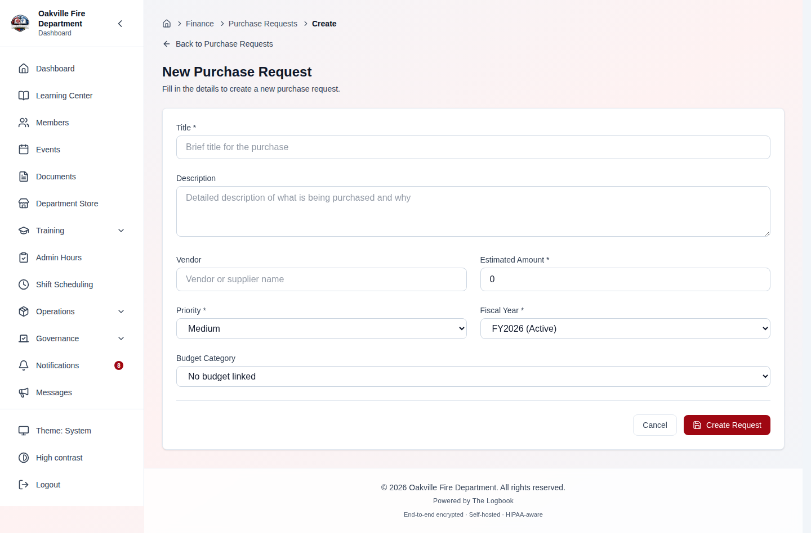

**[SCREENSHOT — REPLACE `11-08-create-purchase-request.png`.** The subtitle now reads "Saved as a draft. Submit it for approval from the next page.", the budget field is labelled **Budget** (was Budget Category), the description placeholder reads "What you're buying and why", and the button is **Create Request**.**]**

### Submitting a Purchase Request

Every new request starts as a draft:

1. Navigate to **Finance > Purchase Requests** and find your draft (creating one takes you straight to it).
2. Open the request detail page. Its approval timeline reads _"Approval steps are added when you submit this request."_
3. Review the details and click **Submit for Approval**.

Once submitted, the system resolves the budget category from the linked budget, matches an approval chain (see [Approval Chains](#approval-chains)), and creates the approval step records. The request status changes to **Pending Approval**.

### Tracking a Purchase Request

Open a purchase request to see its detail page at `/finance/purchase-requests/:id`. The detail page shows:

- Request number, title, and all submitted details
- Current status badge
- Approval chain progress -- each step with its status, assigned approver, action timestamp, and any notes
- Budget impact (estimated amount vs. budget remaining)

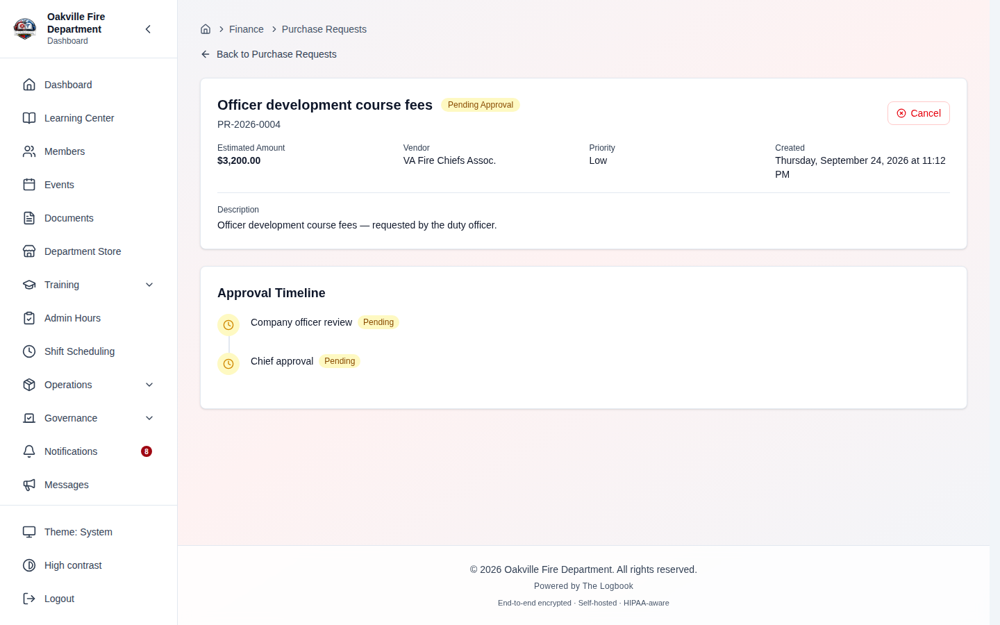

**[SCREENSHOT — REPLACE `11-12-purchase-request-detail.png`.** The action buttons read **Submit for Approval** / **Cancel Request**, a pending request now shows the yellow "Waiting on … You can approve or deny this step." panel with **Approve** and **Deny** to a `finance.approve` holder, and a draft's timeline reads "Approval steps are added when you submit this request." Capture a pending request as the Treasurer (not the requester).**]**

### Progressing a Purchase Request After Approval

**Required Permission:** `finance.manage`

Once approved, officers can progress the request through the fulfillment stages:

1. Click **Mark as Ordered** when the item has been ordered from the vendor. The `orderedAt` timestamp is recorded.
2. Click **Mark as Received** when the item arrives at the department. The `receivedAt` timestamp is recorded.
3. Click **Mark as Paid** when payment has been made. At this point, you can optionally enter the **actual amount** paid (if it differs from the estimate). The actual amount is what gets recorded as spent against the budget.

> **Hint:** If the actual amount differs from the estimated amount, the budget adjusts automatically. For example, if $500 was encumbered but the actual payment was $475, only $475 moves to "spent" and the full $500 encumbrance is released (the $25 difference returns to the available balance). Payment can also be recorded directly from the Approved or Ordered status -- the Received step is optional.

### Editing and Cancelling

- **Editing:** A purchase request can only be edited while in **Draft** or **Submitted** status. Once it reaches Pending Approval, it cannot be modified.
- **Cancelling:** A request can be cancelled from any status except **Paid**. If an approved, ordered, or received request is cancelled, the encumbrance is released back to the budget.

### Edge Cases

| Scenario                                                             | Behavior                                                                                                                                                           |
| -------------------------------------------------------------------- | ------------------------------------------------------------------------------------------------------------------------------------------------------------------ |
| Submitting without a budget selected                                 | The request enters the approval workflow but no encumbrance is tracked. Approvers should verify the funding source manually                                        |
| Actual amount exceeds estimated amount                               | Permitted up to what the budget has left once the estimate's encumbrance is released; beyond that, marking it paid is refused with _Insufficient available budget_ |
| Cancelling an approved request                                       | The encumbered amount is released back to the budget's available balance. The encumbrance release is floored at zero to prevent negative encumbrance values        |
| Marking as paid from Approved status (skipping Ordered and Received) | Permitted -- the system allows direct transition from Approved to Paid                                                                                             |
| Request with no matching approval chain                              | The request moves to Pending Approval but has no approval step records. It requires manual intervention                                                            |
| Editing a submitted request                                          | Permitted while in Submitted status (before approval flow begins). Not permitted once in Pending Approval or later                                                 |
| Purchase request linked to an apparatus or facility                  | The linkage is informational -- it helps officers categorize spending by asset but does not affect the approval or budget logic                                    |

---

## Expense Reports

Navigate to **Finance > Expenses** to view and manage expense reports.

Expense reports are used when a member has already incurred out-of-pocket expenses and needs reimbursement. Unlike purchase requests (which authorize future purchases), expense reports document past spending with itemized line items.

### Expense Report Workflow

```
DRAFT --> SUBMITTED --> PENDING_APPROVAL --> APPROVED --> PAID
                             |
                           DENIED
              |
          CANCELLED
```

| Status               | Description                                                       |
| -------------------- | ----------------------------------------------------------------- |
| **Draft**            | Report is being prepared. Line items can be added and edited.     |
| **Submitted**        | Report has been submitted into the approval chain.                |
| **Pending Approval** | Report is waiting for approver action.                            |
| **Approved**         | All approval steps are complete. The reimbursement is authorized. |
| **Paid**             | The member has been reimbursed. Payment method is recorded.       |
| **Denied**           | An approver has denied the report.                                |
| **Cancelled**        | The submitter has cancelled the report.                           |

### Report Numbers

Expense report numbers are auto-generated in the format **ER-YYYY-0001**, where YYYY is derived from the fiscal year's start date and the sequence number increments for each new report.

### Creating an Expense Report

**Required Permission:** `finance.request` (every member) or `finance.manage`

1. Navigate to **Finance > Expenses**.
2. Click **New Expense Report** (or go directly to `/finance/expenses/new`).
3. Fill in the header:

| Field           | Required | Description                                                                                |
| --------------- | -------- | ------------------------------------------------------------------------------------------ |
| **Title**       | Yes      | Brief description of the expenses (e.g., "March Training Conference") (max 300 characters) |
| **Fiscal Year** | Yes      | The fiscal year these expenses fall within                                                 |
| **Description** | No       | Detailed explanation of the expenses                                                       |
| **Notes**       | No       | Additional notes for approvers                                                             |

4. Add **line items** for each expense (can be added during creation or separately while in Draft status):

| Field             | Required | Description                                              |
| ----------------- | -------- | -------------------------------------------------------- |
| **Description**   | Yes      | What the expense was for (max 500 characters)            |
| **Amount**        | Yes      | Dollar amount of the expense (must be greater than zero) |
| **Date Incurred** | Yes      | When the expense occurred                                |
| **Expense Type**  | Yes      | Category of expense (default: General; see table below)  |
| **Budget**        | No       | Which budget to charge this line item against            |
| **Merchant**      | No       | Where the purchase was made                              |
| **Receipt URL**   | No       | Link to or upload of the receipt                         |

5. Click **Create Report**. The report is saved as a **Draft**; open it and click **Submit for Approval** to send it into the approval chain. The total amount is automatically calculated as the sum of all line items.

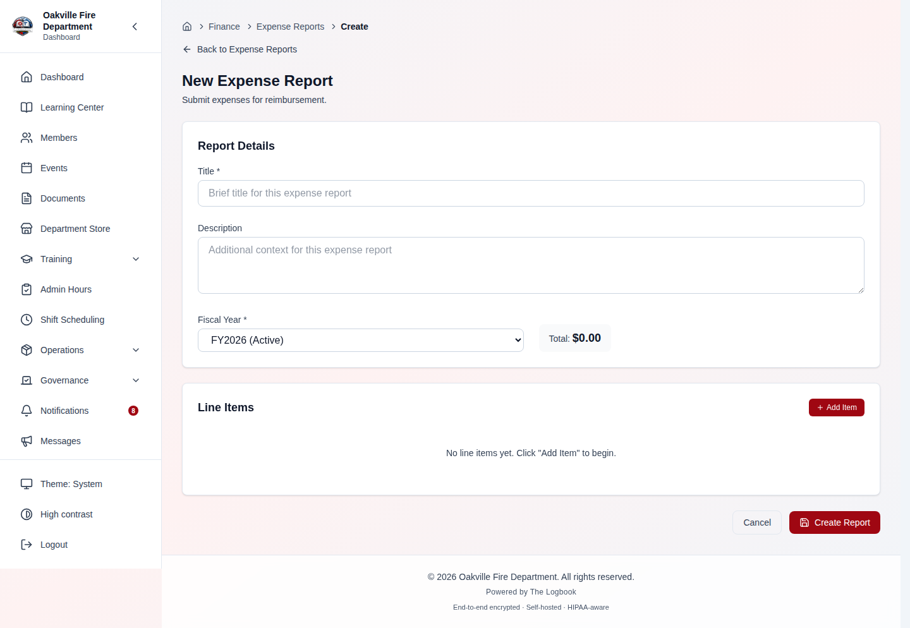

**[SCREENSHOT — REPLACE `11-10-create-expense-report.png`.** The subtitle now reads "Saved as a draft. Submit it for approval from the next page." and the empty line-item list reads "No line items yet. Use “Add Item” to add each expense."; the expense type list is unchanged.**]**

### Expense Types

Each line item on an expense report has an expense type that classifies the spending:

| Expense Type               | Description                                                 |
| -------------------------- | ----------------------------------------------------------- |
| **General**                | General department expenses not covered by other categories |
| **Uniform Reimbursement**  | Member uniform purchases or replacements                    |
| **PPE Replacement**        | Personal protective equipment replacement                   |
| **Boot Allowance**         | Boot purchase reimbursement                                 |
| **Training Reimbursement** | Training course fees, materials, or registration            |
| **Certification Fee**      | Professional certification or license renewal fees          |
| **Conference**             | Conference registration, materials, or related costs        |
| **Travel**                 | Travel expenses (fuel, tolls, parking, airfare)             |
| **Meals**                  | Meal expenses during department business or training        |
| **Mileage**                | Personal vehicle mileage reimbursement                      |
| **Equipment Purchase**     | Equipment purchased by the member for department use        |
| **Other**                  | Expenses that do not fit other categories                   |

### Submitting an Expense Report

Only **Draft** reports can be submitted. The system validates that the `totalAmount` is greater than zero (i.e., at least one line item must exist with a positive amount). The approval chain is resolved based on the `expense_report` entity type, total amount, and budget category (derived from line items).

### Tracking and Payment

Open an expense report to see its detail page at `/finance/expenses/:id`. The detail page shows:

- Report number, title, and total amount (sum of all line items)
- Current status with approval chain progress
- All line items with their individual details
- Payment status and method (once paid)

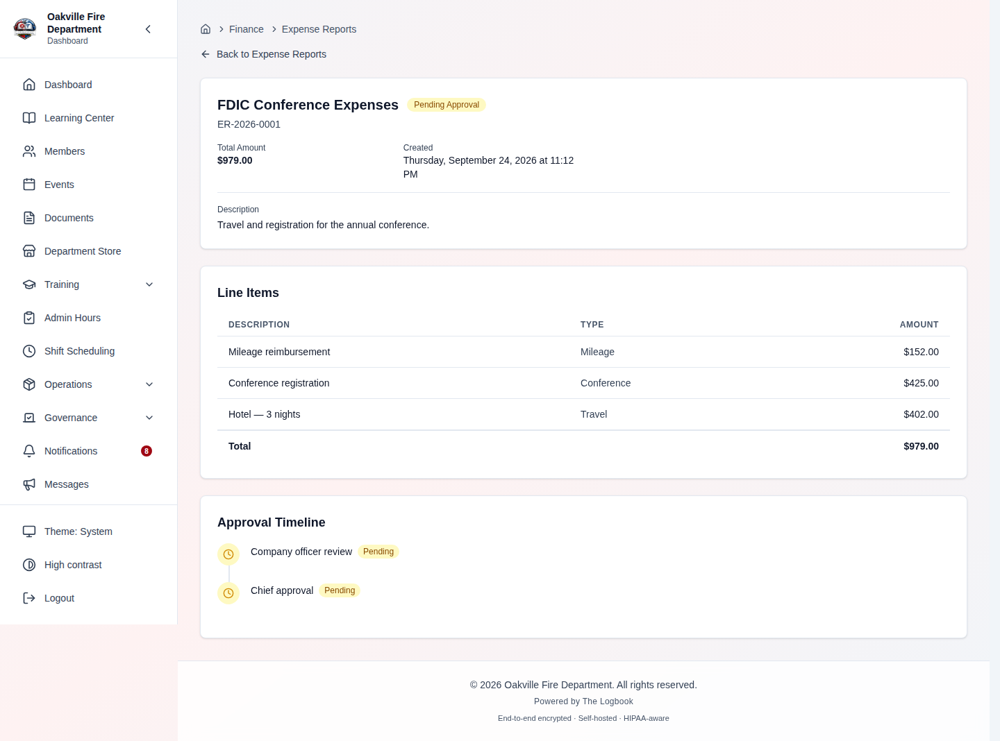

**[SCREENSHOT — REPLACE `11-14-expense-report-detail.png`.** **Submit for Approval** replaces Submit, line items show their expense type by name ("Mileage", not `mileage`), and a pending report shows the Approve / Deny panel to a `finance.approve` holder.**]**

**Marking as Paid:**

**Required Permission:** `finance.manage`

Once an expense report is approved:

1. Open the report detail page.
2. Click **Mark as Paid**.
3. Optionally enter the **payment method** (e.g., "check #1234", "direct deposit", "petty cash").
4. Confirm the payment.

The paid amount is recorded against the associated budgets for each line item that has a `budgetId` set.

> **Hint:** Encourage members to attach receipts to each line item via the receipt URL field. This speeds up the approval process and provides an audit trail for your department's financial records.

### Edge Cases

| Scenario                                       | Behavior                                                                                                                             |
| ---------------------------------------------- | ------------------------------------------------------------------------------------------------------------------------------------ |
| Expense report with no line items              | Cannot be submitted -- `totalAmount` must be greater than zero                                                                       |
| Line items spanning multiple budget categories | Each line item can reference a different budget. The total is the sum of all line items                                              |
| Adding line items after submission             | Not permitted -- the report must be in Draft status to add line items                                                                |
| Editing the report after submission            | Only permitted in Draft or Submitted status                                                                                          |
| Receipt not attached to a line item            | The report can still be submitted, but approvers may request receipts before approving                                               |
| Expense type mismatch with budget category     | No validation -- the expense type is informational classification. The budget is determined by the `budgetId` field on the line item |
| Multiple line items against the same budget    | All amounts are summed and added to that budget's `amountSpent` when the report is paid                                              |

---

## Check Requests

Navigate to **Finance > Check Requests** to view and manage check requests.

Check requests are used when the department needs to issue a check to a payee -- for example, paying a vendor invoice, reimbursing a contractor, or making a recurring payment. Unlike purchase requests (which track the full procurement lifecycle) and expense reports (which reimburse members), check requests focus specifically on issuing a department check.

### Check Request Workflow

```
DRAFT --> SUBMITTED --> PENDING_APPROVAL --> APPROVED --> ISSUED
                             |                             |
                           DENIED                        VOIDED
              |
          CANCELLED
```

| Status               | Description                                                                | Budget Impact                                              |
| -------------------- | -------------------------------------------------------------------------- | ---------------------------------------------------------- |
| **Draft**            | Request is being prepared.                                                 | None                                                       |
| **Submitted**        | Request has entered the approval chain.                                    | None                                                       |
| **Pending Approval** | Request is waiting for approver action.                                    | None                                                       |
| **Approved**         | All approval steps are complete. The check can be issued.                  | None                                                       |
| **Issued**           | The check has been written and issued. Check number and date are recorded. | **Amount is added to budget spent**                        |
| **Denied**           | An approver has denied the request.                                        | None                                                       |
| **Voided**           | An issued check has been voided (e.g., lost check, cancelled payment).     | **Spent amount is reversed** (subtracted, floored at zero) |
| **Cancelled**        | The requester has cancelled the request before issuance.                   | None                                                       |

### Request Numbers

Check request numbers are auto-generated in the format **CK-YYYY-0001**, where YYYY is derived from the fiscal year's start date and the sequence number increments.

### Creating a Check Request

**Required Permission:** `finance.request` (every member) or `finance.manage`

1. Navigate to **Finance > Check Requests**.
2. Click **New Check Request** (or go directly to `/finance/check-requests/new`).
3. Fill in the request details:

| Field             | Required | Description                                              |
| ----------------- | -------- | -------------------------------------------------------- |
| **Payee Name**    | Yes      | Who the check should be made out to (max 300 characters) |
| **Amount**        | Yes      | The check amount (must be greater than zero)             |
| **Fiscal Year**   | Yes      | The fiscal year to charge against                        |
| **Budget**        | No       | The specific budget line item                            |
| **Payee Address** | No       | Mailing address for the payee                            |
| **Memo**          | No       | Memo line for the check (max 500 characters)             |
| **Purpose**       | No       | Internal description of why the check is needed          |
| **Notes**         | No       | Additional notes for approvers                           |

4. Click **Create Check Request**. It is saved as a **Draft**; open it and click **Submit for Approval**.

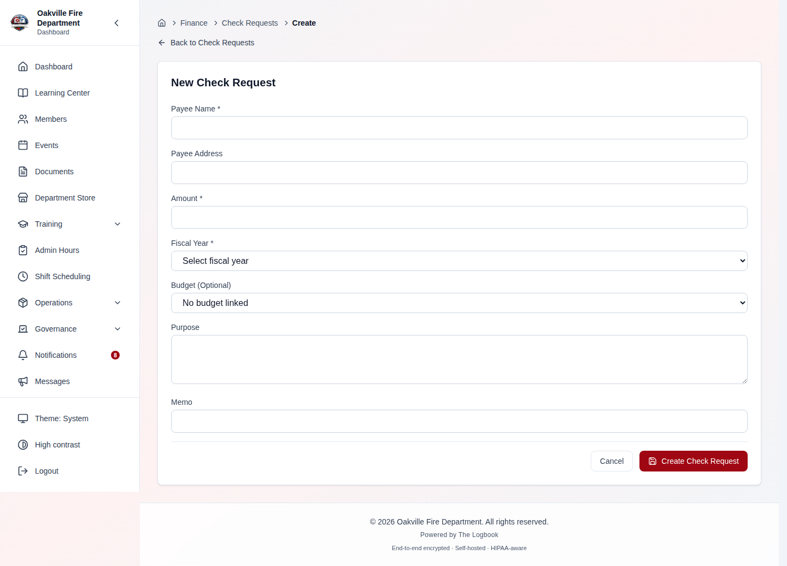

**[SCREENSHOT — REPLACE `11-12-create-check-request.png`.** The budget field is labelled **Budget** (was "Budget (Optional)").**]**

### Issuing a Check

**Required Permission:** `finance.manage`

After a check request is approved:

1. Open the check request detail page at `/finance/check-requests/:id`.
2. Click **Issue Check**.
3. Enter the **check number** from your physical check stock.
4. Confirm issuance.

The system records the check number and the issuance date. The check amount is added to the linked budget's spent total.

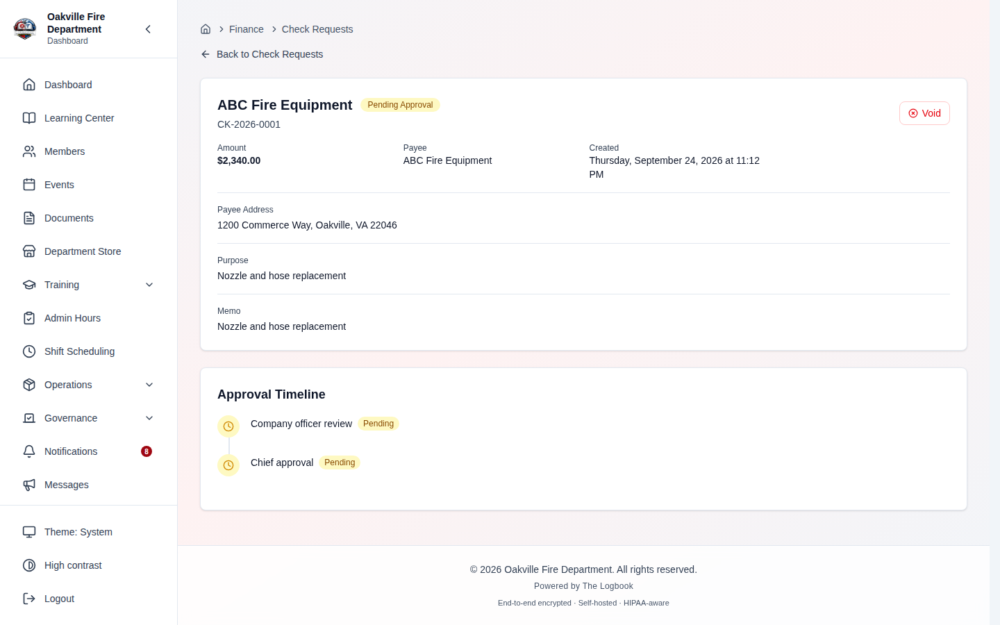

**[SCREENSHOT — REPLACE `11-16-check-request-detail.png`.** **Submit for Approval** and **Void Request** replace Submit and Void, and a pending request shows the Approve / Deny panel to a `finance.approve` holder.**]**

### Voiding an Issued Check

If a check needs to be voided after issuance (e.g., lost in the mail, payment cancelled):

1. Open the issued check request.
2. Click **Void Request**.
3. Confirm the void action.

The check status changes to **Voided**. The amount is subtracted from the budget's spent total (floored at zero to prevent negative spent values).

> **Hint:** Voiding a check does not delete the record. The voided check remains in the system for audit trail purposes. If a replacement check is needed, create a new check request.

### Edge Cases

| Scenario                                        | Behavior                                                                                                               |
| ----------------------------------------------- | ---------------------------------------------------------------------------------------------------------------------- |
| Issuing a check without entering a check number | Not permitted -- the `checkNumber` parameter is required for the issue endpoint                                        |
| Voiding a check                                 | The budget spent amount is reduced by the check amount, floored at zero                                                |
| Duplicate check numbers                         | The system does not enforce unique check numbers -- it is the treasurer's responsibility to track physical check stock |
| Re-issuing a voided check                       | Create a new check request. The voided request remains as a historical record                                          |
| Check request with no budget selected           | The check can be issued, but no budget tracking occurs for the amount                                                  |
| Editing a check request after submission        | Only permitted in Draft or Submitted status                                                                            |

---

## Dues & Assessments

**Required Permission:** `finance.view` (to view), `finance.manage` (to create schedules and manage payments)

Navigate to **Finance > Dues** to manage member dues and assessments.

Dues management handles the collection of recurring fees from members -- annual dues, quarterly assessments, equipment fees, or any other recurring financial obligation.

> **⚠️ Current release: the Dues page is read-only.** It shows schedules, the
> collection summary and each member's dues record, and nothing else — there
> are no **Create Dues Schedule**, **Generate Dues**, **Record Payment**,
> **Waive** or **Reverse Waiver** buttons on it yet. Every write action
> described in this chapter exists as an API endpoint (`POST
/finance/dues-schedules`, `POST /finance/dues-schedules/{id}/generate`, `PUT
/finance/dues/{id}`, `POST /finance/dues/{id}/waive`, `POST
/finance/dues/{id}/unwaive`, `GET /finance/dues/{id}/payments`) and behaves
> exactly as described below, but until the management UI ships they have to be
> driven through the API. The click-paths in this chapter describe the intended
> UI; treat them as the specification, not as what is on screen today. Tracked
> in [KNOWN_LIMITATIONS.md](../KNOWN_LIMITATIONS.md).

### Dues Schedules

A dues schedule defines the terms of a recurring fee:

| Field                           | Description                                                                                                                 |
| ------------------------------- | --------------------------------------------------------------------------------------------------------------------------- |
| **Name**                        | Description of the dues (e.g., "Annual Membership Dues", "Q1 Assessment") (max 200 characters)                              |
| **Amount**                      | The amount each member owes per period (must be greater than zero)                                                          |
| **Frequency**                   | How often dues are collected (see table below)                                                                              |
| **Due Date**                    | When the current period's payment is due                                                                                    |
| **Grace Period Days**           | Number of days after the due date before the payment is considered overdue (default: 30)                                    |
| **Late Fee Amount**             | Optional fee assessed when payment is overdue (after the grace period)                                                      |
| **Fiscal Year**                 | Optionally tie the schedule to a specific fiscal year                                                                       |
| **Applies to Membership Types** | Optionally restrict dues to specific membership tiers (stored as a JSON array, e.g., only Active members, not Life members) |
| **Is Active**                   | Whether the schedule is currently collecting dues                                                                           |
| **Notes**                       | Optional notes about the schedule                                                                                           |

### Frequencies

| Frequency       | Period                               |
| --------------- | ------------------------------------ |
| **Annual**      | Once per year                        |
| **Semi-Annual** | Twice per year (every 6 months)      |
| **Quarterly**   | Four times per year (every 3 months) |
| **Monthly**     | Every month                          |

### Creating a Dues Schedule

**Required Permission:** `finance.manage`

1. Navigate to **Finance > Dues**.
2. Click **Create Dues Schedule**.
3. Fill in the schedule details (name, amount, frequency, due date, etc.).
4. Optionally set a **grace period** (default: 30 days) and **late fee amount**.
5. Optionally restrict the schedule to specific **membership types** using the multi-select.
6. Click **Save**.

> **Corrected 2026-08-12.** Not built. See
> [Finance — Five Guide Sections With No Screen](../KNOWN_LIMITATIONS.md#finance--five-guide-sections-with-no-screen-2026-08-09),
> which records what exists behind each of these: an API, a store
> action, or types — but no page and no control that reaches them.
> The steps above describe the intended design.
>
> `financeStore.createDuesSchedule` exists; no component calls it.

### Generating Member Dues

After creating a schedule, you need to generate individual dues records for each member:

1. On the **Finance > Dues** page, find the dues schedule.
2. Click **Generate Dues**.
3. The system queries all active users in your organization, checks whether each member already has a dues record for this schedule (idempotency guard), and creates a new record for each member who does not already have one.
4. Each generated record has a **Pending** status with the full `amountDue` from the schedule and the `dueDate` from the schedule.
5. The system returns the count of newly generated records.

> **Hint:** Run the **Generate Dues** action at the beginning of each dues period. For annual dues, generate at the start of the fiscal year. For quarterly dues, generate at the start of each quarter. The system is idempotent -- running it again will not create duplicates.

### Member Dues Statuses

| Status      | Description                                                                                                        |
| ----------- | ------------------------------------------------------------------------------------------------------------------ |
| **Pending** | Payment is expected but not yet received                                                                           |
| **Paid**    | Full payment has been received (`amountPaid >= amountDue`)                                                         |
| **Partial** | A partial payment has been received (`amountPaid > 0` but less than `amountDue`). The remaining balance is tracked |
| **Overdue** | The due date plus grace period has passed without full payment                                                     |
| **Waived**  | The dues have been waived by an officer (e.g., financial hardship, service credit)                                 |
| **Exempt**  | The member is exempt from this dues schedule (e.g., Life members exempt from annual dues)                          |

### Recording Payments

**Required Permission:** `finance.manage`

1. On the **Finance > Dues** page, find the member's dues record.
2. Click on the record to update it.
3. Enter the **amount paid** (must be greater than zero), **payment method**, and optionally a **transaction reference** (check number, receipt number, etc.) and **notes**.
4. Click **Save**.

Every payment is recorded as its own entry in the member's payment history. The
amount paid shown on the dues record is the **sum of that history**, so if the
total reaches or exceeds the amount due the status changes to **Paid**, and if it
is between zero and the amount due it changes to **Partial**.

Two consequences worth knowing:

- **Entering a payment twice does not charge the member twice.** If you supply a
  transaction reference (check number, receipt number) and that reference has
  already been recorded against these dues, the second submission is ignored and
  the record is returned unchanged. A double-clicked Save, or a form resubmitted
  after a slow connection, is safe.
- **Cash with no reference is never treated as a duplicate.** Two $20 cash
  payments on the same evening are two payments. If you want the system to be
  able to spot a duplicate, give the payment a reference.

You do not need to re-enter the payment method or notes from an earlier
installment. Leaving them blank records this payment without them; it no longer
erases what the previous payment said.

### Payment History

**Required Permission:** `finance.view`

Each member's dues record keeps the full list of payments received against it --
amount, method, reference, notes, when it was received, and which officer entered
it. The dues record itself shows only the running total and the most recent
payment's detail, so the history is where you go to answer "what did they
actually pay, and when?"

This matters at audit time: the summary figure alone cannot show that a $100
balance was three separate installments, or which of them was the check that
bounced.

### Waiving Dues

**Required Permission:** `finance.manage`

To waive a member's dues:

1. Find the member's dues record.
2. Click **Waive**.
3. Enter a **reason** for the waiver (required).
4. Confirm.

The record is marked as **Waived** with the officer's ID, timestamp, and reason recorded for audit purposes.

Once dues are waived, **payments against them are refused.** They are no longer
owing, so recording money against them would quietly cancel the waiver — which
is what used to happen, and it also moved the waived amount into your collection
figures with nothing recording that it had ever been waived.

### Reversing a Waiver

**Required Permission:** `finance.manage`

If dues were waived by mistake -- or waived and then paid anyway -- reverse the
waiver before recording the payment:

1. Find the member's dues record.
2. Click **Reverse Waiver**.
3. Enter a **reason** for the reversal (required).
4. Confirm.

The record returns to whatever its payment history says: **Pending** if nothing
was ever paid, **Partial** or **Paid** if something was. The original waiver
reason is not silently discarded -- it is written into the audit log alongside
your reason for reversing, so both halves of the decision survive.

### Dues Summary

The dues summary provides an overview of collection status across all members:

| Metric                | Description                                                               |
| --------------------- | ------------------------------------------------------------------------- |
| **Total Expected**    | Sum of all `amountDue` values across all member dues records              |
| **Total Collected**   | Sum of all `amountPaid` values                                            |
| **Total Outstanding** | `Total Expected - Total Collected - Total Waived`                         |
| **Total Waived**      | Sum of `amountDue` for records with Waived status                         |
| **Collection Rate**   | `(Total Collected / Total Expected) * 100`, rounded to two decimal places |
| **Members Paid**      | Count of members with Paid status                                         |
| **Members Overdue**   | Count of members with Overdue status                                      |
| **Members Waived**    | Count of members with Waived status                                       |

The summary can be filtered by a specific dues schedule using the optional `scheduleId` parameter.

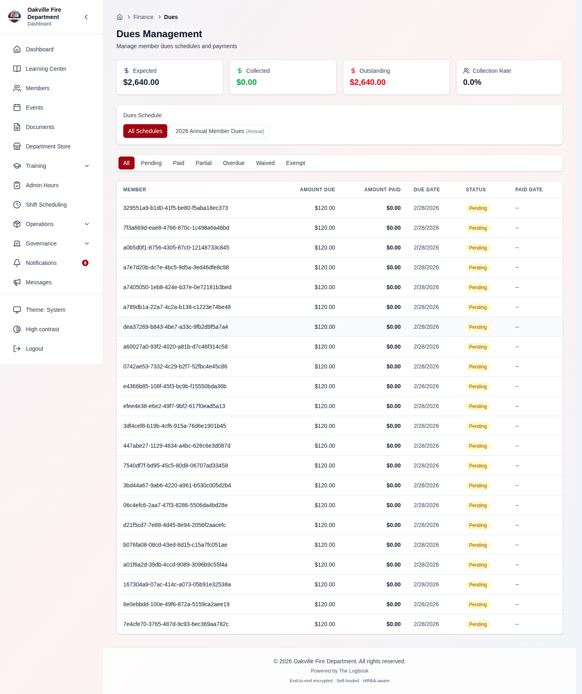

### Edge Cases

| Scenario                                                           | Behavior                                                                                                                                                  |
| ------------------------------------------------------------------ | --------------------------------------------------------------------------------------------------------------------------------------------------------- |
| Generating dues when records already exist                         | The system checks for existing records per member per schedule (idempotency guard). Only members without existing records get new ones                    |
| Member joins mid-period                                            | Their dues are not automatically generated. Run Generate Dues again -- the system will only create records for members who do not already have one        |
| Partial payment followed by additional payment                     | Both are kept as separate entries in the payment history. The amount paid is the sum of them. If the total reaches the amount due, status changes to Paid |
| The same payment entered twice with the same transaction reference | The second submission is ignored and the record returned unchanged -- the member is not charged twice                                                     |
| Two cash payments of the same amount, neither with a reference     | Both are recorded. Without a reference there is nothing to tell a duplicate from a genuine second payment, and dropping one would lose money              |
| A later payment entered without a method or notes                  | Recorded as-is. Earlier payments keep their own detail; blank fields no longer overwrite them                                                             |
| Payment recorded against waived or exempt dues                     | Refused with an explanatory error. Reverse the waiver first (see Reversing a Waiver)                                                                      |
| Waiver reversed                                                    | Status returns to whatever the payment history says -- Pending, Partial or Paid. The original waive reason is written to the audit log, not discarded     |
| Partial payment followed by waiver                                 | The waiver sets the status to Waived. The amount already paid is not refunded -- this is an administrative decision                                       |
| Dues schedule with no membership type filter                       | Dues are generated for all active users in the organization                                                                                               |
| Changing the dues amount on a schedule                             | Only affects newly generated records. Existing member dues records retain the original `amountDue`                                                        |
| Member status changes to inactive                                  | Existing dues records are not automatically waived or cancelled. An officer should manually waive them if appropriate                                     |
| Late fee application                                               | The `lateFeeApplied` field on the member dues record tracks the late fee amount. Late fee logic is managed by the officer updating the record             |
| Dues summary with no records                                       | Returns zeroes for all metrics and 0% collection rate                                                                                                     |

---

## QuickBooks Export

**Required Permission:** `finance.manage`

The QuickBooks export feature generates CSV files compatible with QuickBooks and other accounting software, allowing you to transfer financial data from The Logbook into your accounting system.

### Account Mappings

Before exporting, set up mappings between your Logbook budget categories and your QuickBooks chart of accounts:

1. Navigate to the export settings (accessible from the Finance module).
2. For each internal category, configure:
   - **Internal Category** -- The budget category name from The Logbook
   - **QB Account Name** -- The corresponding QuickBooks account name
   - **QB Account Number** -- Optional QuickBooks account number for additional precision
   - **Mapping Type** -- The account type: Expense, Income, or Asset

3. Click **Save**.

> **Corrected 2026-08-12.** Not built. See
> [Finance — Five Guide Sections With No Screen](../KNOWN_LIMITATIONS.md#finance--five-guide-sections-with-no-screen-2026-08-09),
> which records what exists behind each of these: an API, a store
> action, or types — but no page and no control that reaches them.
> The steps above describe the intended design.
>
> `GET/POST/PUT /finance/export/mappings` and the `qbAccountName` types
> exist; there is no page, no route and no consumer.

> **Hint:** You can also set the QuickBooks account name directly on each budget category (the `qbAccountName` field in Budget Category settings). The export mapping page provides a separate, more granular mapping layer.

### Generating an Export

1. Navigate to the export section.
2. Select the **date range start** and **date range end** for the transactions to include.
3. Select the **file format** (CSV is the default; IIF is also supported as a format type).
4. Click **Generate Export**.
5. A CSV file named `finance_export.csv` is downloaded to your computer.

The CSV includes these columns:

| Column      | Description                                                                                                       |
| ----------- | ----------------------------------------------------------------------------------------------------------------- |
| **Date**    | Transaction date in MM/DD/YYYY format, on the department's calendar (see below)                                   |
| **Type**    | Transaction type: `Bill Pmt` (purchase request), `Check` (check request), or `Expense` (expense report line item) |
| **Num**     | Reference number (request number, check number, or report number)                                                 |
| **Name**    | Vendor, payee, or merchant name                                                                                   |
| **Memo**    | Transaction description (title, memo, or line item description)                                                   |
| **Account** | Reserved for account mapping (currently empty in export)                                                          |
| **Debit**   | Transaction amount                                                                                                |
| **Credit**  | Reserved (currently empty in export)                                                                              |

The export includes:

- **Purchase Requests** with Paid status, filtered by `paidAt` date
- **Check Requests** with Issued status, filtered by `checkDate`
- **Expense Reports** with Paid status (one row per line item), filtered by `paidAt` date

> **Dates are the department's day** _(2026-09-25)_. Payment and check dates are
> stored as UTC timestamps, and the export used to print the UTC date — so a
> payment recorded on a US evening was booked on the next day in QuickBooks.
> The **Date** column now uses the timezone set under **Settings → Organization
> → Profile → Timezone** (America/New_York when none is set). An export taken
> before this date may disagree with a new one for evening payments.

### Export Logs

Every export is logged with:

| Field            | Description                                |
| ---------------- | ------------------------------------------ |
| **Export Type**  | The type of data exported                  |
| **Date Range**   | Start and end dates of the exported period |
| **Record Count** | Number of transactions included            |
| **File Format**  | The output format (CSV or IIF)             |
| **Exported By**  | The officer who generated the export       |
| **Exported At**  | Timestamp of the export                    |

> **Corrected 2026-08-12.** Not built. See
> [Finance — Five Guide Sections With No Screen](../KNOWN_LIMITATIONS.md#finance--five-guide-sections-with-no-screen-2026-08-09),
> which records what exists behind each of these: an API, a store
> action, or types — but no page and no control that reaches them.
> The steps above describe the intended design.
>
> `GET /finance/export/logs` and an `ExportLog` interface exist; there is no
> page, no route and no consumer.

> **Hint:** Export frequently (monthly or quarterly) rather than waiting for year-end. This makes reconciliation with QuickBooks easier and catches mapping issues early. Each export creates a log entry so you can track what has been exported and when.

### Edge Cases

| Scenario                                                     | Behavior                                                                                                        |
| ------------------------------------------------------------ | --------------------------------------------------------------------------------------------------------------- |
| No transactions in the selected date range                   | An empty CSV file is generated (headers only, no data rows). An export log is still created with record count 0 |
| Date range spanning multiple fiscal years                    | All matching transactions are included regardless of fiscal year boundaries                                     |
| Expense report with multiple line items                      | Each line item becomes a separate row in the CSV, all sharing the same report number                            |
| Purchase request with actual amount different from estimated | The export uses the actual amount if set, otherwise falls back to the estimated amount                          |
| Check request without a check number                         | The export uses the request number (CK-YYYY-NNNN) as the Num column value                                       |

---

## Realistic Example: Annual Budget Cycle

This walkthrough follows a fictional fire department through a complete annual budget cycle, from setup through year-end reconciliation.

### Phase 1: Setting Up the New Fiscal Year (June)

The Falls Church Fire Department operates on a July 1 -- June 30 fiscal year. In June, the Treasurer sets up the next fiscal year:

1. **Create the fiscal year:** Navigate to **Finance > Settings** and create "FY 2027" with start date July 1, 2026 and end date June 30, 2027. It starts in **Draft** status.

2. **Review budget categories:** Ensure the category list matches the department's chart of accounts. Navigate to **Finance > Settings** and check the Budget Categories section:
   - Operations > Fuel
   - Operations > Vehicle Maintenance
   - Operations > Station Supplies
   - Training > Course Fees
   - Training > Travel
   - Equipment > PPE
   - Equipment > Tools
   - Administrative > Office Supplies

3. **Create budgets:** Navigate to **Finance > Budgets** and create a budget for each category with the approved amounts from the annual budget meeting:
   - Fuel: $45,000
   - Vehicle Maintenance: $30,000
   - Training Course Fees: $15,000
   - PPE: $25,000
   - (and so on for each category)

4. **Configure approval chains:** Navigate to **Finance > Settings > Approval Chains** and set up:
   - "Small Purchases" (Purchase Requests under $500): 1 step -- Captain Approval
   - "Standard Purchases" (Purchase Requests $500--$2,500): 2 steps -- Captain Approval, then Chief Approval
   - "Large Purchases" (Purchase Requests over $2,500): 3 steps -- Captain Approval, Chief Approval, then Board Treasurer Notification
   - "Training Expenses" (Expense Reports, category: Training): 2 steps -- Training Officer Approval, then Chief Approval
   - "Standard Expense Reimbursement" (Expense Reports, default): 2 steps -- Captain Approval, then Treasurer Notification
   - "Check Issuance" (Check Requests, default): 2 steps -- Treasurer Approval, then Chief Approval

5. **Set up dues:** Create an "FY 2027 Annual Membership Dues" schedule -- $150/member, annual frequency, due August 1, with a 30-day grace period and $25 late fee.

6. **Set up QuickBooks mappings:** Navigate to the export mappings and map each category to the corresponding QuickBooks account (e.g., "Fuel" to "6200 - Vehicle Fuel").

### Phase 2: Activating the New Year (July 1)

On July 1, the Treasurer:

1. **Activates the new fiscal year:** Navigate to **Finance > Settings** and click **Activate** on FY 2027. The previously active FY 2026 is automatically closed.
2. **Generates member dues:** Navigate to **Finance > Dues**, find the annual dues schedule, and click **Generate Dues**. Every active member receives a Pending dues record for $150 due August 1.
3. **Checks the dashboard:** Navigate to **Finance** and verify the dashboard shows the new fiscal year's budgets with $0 spent and $0 encumbered.

### Phase 3: Day-to-Day Operations (July--June)

**A captain needs a new set of hose couplings ($350):**

1. The captain navigates to **Finance > Purchase Requests > New**.
2. Fills in: Title "Hose Coupling Replacements", Budget "Equipment > Tools", Estimated Amount $350, Vendor "Fire Supply Co.", Priority "Medium".
3. Clicks **Submit**.
4. The $350 request matches the "Small Purchases" chain (under $500) -- only Captain approval is needed.
5. Since `allowSelfApproval` is false on the step, the other captain on duty receives the approval notification.
6. The other captain navigates to their pending approvals and approves. The request moves to **Approved** and $350 is **encumbered** against the Tools budget.
7. The captain orders the couplings and clicks **Mark as Ordered**.
8. When the couplings arrive, they click **Mark as Received**.
9. The Treasurer pays the invoice and clicks **Mark as Paid** with actual amount $342.50.
10. The $350 encumbrance is released. $342.50 moves to **spent** in the Tools budget. The $7.50 difference returns to the available balance.

**A firefighter attended a conference and needs reimbursement ($979):**

1. The firefighter navigates to **Finance > Expenses > New**.
2. Creates report titled "FDIC Conference Expenses" and adds four line items:
   - Registration fee: $275 (type: Conference, budget: Training > Course Fees)
   - Hotel 3 nights: $450 (type: Travel, budget: Training > Travel)
   - Meals: $120 (type: Meals, budget: Training > Travel)
   - Mileage 200 miles at $0.67: $134 (type: Mileage, budget: Training > Travel)
3. Submits the report (total: $979).
4. The report matches the "Training Expenses" chain -- Training Officer approves, then Chief approves.
5. The Treasurer clicks **Mark as Paid** with payment method "Check #4521". Each line item's amount is added to its linked budget's spent total.

**The department needs to pay a vendor invoice ($2,340):**

1. The Treasurer navigates to **Finance > Check Requests > New**.
2. Creates a check request: Payee "ABC Uniform Co.", Amount $2,340, Purpose "New dress uniforms order", Budget "Equipment > PPE".
3. Submits the request. It matches the "Check Issuance" chain -- Treasurer approval, then Chief approval.
4. After both approve, the Treasurer clicks **Issue Check**, enters check number "4522".
5. The $2,340 is recorded as spent against the PPE budget.

**Collecting annual dues (August):**

1. The Treasurer monitors the dues collection on **Finance > Dues**, filtering by the annual dues schedule.
2. As members pay, the Treasurer records each payment with the amount, payment method (cash, check, online), and transaction reference.
3. After the September 1 grace period, the Treasurer identifies overdue members and sends reminders.
4. For a member experiencing financial hardship, the Treasurer clicks **Waive** and enters "Financial hardship - board approved" as the reason.

### Phase 4: Monitoring (Throughout the Year)

The Treasurer regularly:

1. Checks the **Finance Dashboard** for budget health -- watching for categories approaching their limits.
2. Reviews **pending approvals** and processes them promptly.
3. Monitors **dues collection** -- following up with members who are overdue after the grace period.
4. Runs **QuickBooks exports** monthly -- selecting the previous month's date range, generating the CSV, and importing it into QuickBooks for reconciliation.

### Phase 5: Year-End Reconciliation (June)

Before closing the fiscal year:

1. Ensure all pending purchase requests are either completed (paid) or cancelled.
2. Ensure all expense reports are processed and paid.
3. Ensure all check requests are issued or cancelled.
4. Run a final QuickBooks export for the last month.
5. Review the budget summary on the dashboard for any discrepancies between The Logbook and QuickBooks.
6. Lock FY 2027: navigate to **Finance > Settings** and click **Lock**. All FY 2027 data becomes read-only.
7. Activate FY 2028 (already set up in Draft during the previous month).

---

## Changes September 24 – October 4, 2026

- **Saving a fiscal year, or clearing a field, now works** _(2026-09-30)_. The
  Finance pages send field names in one style (`startDate`) and the server read
  only the other (`start_date`). Creating a fiscal year was refused with a 422
  for "missing" dates, and an edit silently dropped every two-word field — a
  purchase request whose **Budget** you cleared reported success and kept the
  old budget. The server now accepts both spellings on every Finance form, and
  an emptied field is cleared rather than ignored.
- **Approvals, step editing and no-chain decisions** — see
  [Approving and Denying Requests](#approving-and-denying-requests) and
  [Adding Steps to a Chain](#adding-steps-to-a-chain-built-2026-09-29).
- **Wording** _(2026-09-29)_. Request detail pages say **Submit for Approval**,
  **Cancel Request** and **Void Request** where they said Submit, Cancel and
  Void; the dues page is titled **Dues** ("What members owe and have paid, by
  dues schedule"); budget pages say **Remaining** and "% used" where they said
  Available and "% utilized"; and the budget detail page's empty transaction
  panel reads **Not available yet** — _"Individual transactions for this budget
  aren't listed here yet."_ — instead of "No transactions yet", which implied a
  list that would fill in. Deleting a budget category now warns that its
  budgets in every fiscal year are deleted too and requests charged to them are
  left without a budget.
- **An emailed approval link that was already used** says _"This step has
  already been approved"_ (or "denied", "approved automatically") — it used to
  print the internal status, such as "auto_approved".
- **Denial reasons read correctly in dark mode** _(2026-10-03)_; the panel was a
  light-only red block.

---

## Troubleshooting

| Issue                                                                 | Solution                                                                                                                                                                                                                                                                                                                                                   |
| --------------------------------------------------------------------- | ---------------------------------------------------------------------------------------------------------------------------------------------------------------------------------------------------------------------------------------------------------------------------------------------------------------------------------------------------------- |
| "Cannot see the Finance module"                                       | Finance is an optional module. Your department administrator must enable it in **Settings > Organization > Modules**.                                                                                                                                                                                                                                      |
| "No fiscal years available when creating a request"                   | An active fiscal year must exist. Ask an officer with `finance.manage` permission to create and activate a fiscal year in **Finance > Settings**.                                                                                                                                                                                                          |
| "My request is Pending Approval with no approval steps"               | No approval chain matched it (based on request type, amount, and category), or the matching chain has no steps. A `finance.approve` holder other than you can approve or deny it from its detail page. To route future requests, an officer with `finance.configure_approvals` sets up chains and their steps in **Finance > Settings > Approval Chains**. |
| "I submitted a request but no one received the approval notification" | Only **Email** approver steps send anything. Position, Permission and Specific member steps notify nobody — the request appears on **Finance > Approvals** for every `finance.approve` holder. If the department expects an email, use an Email step, and check that email sending is set up.                                                              |
| "Insufficient available budget"                                       | The approval, payment or check would take the budget's spent plus encumbered past its amount budgeted, and the cap has no override. Raise the budget amount, or cancel or deny other requests against it.                                                                                                                                                  |
| "Cannot edit my purchase request"                                     | Purchase requests can only be edited in **Draft** or **Submitted** status. Once in Pending Approval or later, they cannot be modified. Cancel and re-create if changes are needed.                                                                                                                                                                         |
| "Dues show as Overdue immediately"                                    | Check the **due date** and **grace period** on the dues schedule. If the due date plus grace period has already passed, newly generated records may appear overdue. Adjust the schedule settings or due date if needed.                                                                                                                                    |
| "QuickBooks export is missing some transactions"                      | The export only includes Purchase Requests with Paid status, Check Requests with Issued status, and Expense Reports with Paid status within the selected date range. Verify the transactions have reached the correct terminal status. Also check that account mappings are configured for all categories.                                                 |
| "Approval chain not matching the expected chain"                      | The most specific match wins -- see [Chain Resolution](#chain-resolution-specificity) for the scoring rules. There is no Preview control on the page; `GET /finance/approval-chains/preview` answers it through the API, or submit a test request and read its approval timeline.                                                                          |
| "Cannot void an issued check"                                         | Voiding is only permitted for checks with **Issued** status. If the check has already been voided, it cannot be voided again.                                                                                                                                                                                                                              |
| "Member dues not generated for a new member"                          | The **Generate Dues** action only creates records for members who do not already have a record for that schedule. If a member joined after the initial generation, run Generate Dues again -- it will create a record only for that member.                                                                                                                |
| "Deleting a category removed its budgets"                             | That is what deleting does: a category's budgets in every fiscal year are deleted with it (the database cascades), and requests charged to them lose their budget. It cannot be undone. Deactivate a category (`isActive` false) to retire it while keeping its history.                                                                                   |
| "Cannot delete an approval chain"                                     | Verify there are no active requests using step records from that chain. Wait for all associated requests to reach a terminal status (Paid, Denied, Cancelled, Voided, Issued) before deleting.                                                                                                                                                             |
| "Encumbered amount not released after denial"                         | This is expected behavior. Denial happens during the approval flow, before the request reaches Approved status, so no encumbrance was ever created. The budget was never affected.                                                                                                                                                                         |
| "Late fee not applied"                                                | Late fees must be manually applied by updating the member dues record. The `lateFeeAmount` on the schedule defines the fee amount, and the `lateFeeApplied` field on the individual record tracks whether it has been applied.                                                                                                                             |
| "I need to change the amount on an approved purchase request"         | The estimated amount cannot be changed after the request leaves Draft/Submitted status. However, when marking the request as **Paid**, you can enter the **actual amount**, which is what gets recorded against the budget. The difference between estimated (encumbered) and actual (spent) is reconciled automatically.                                  |
| "External email approver link expired"                                | External approval tokens are valid for 7 days. If the link has expired, the request must be handled through the system by an internal approver, or the approval chain can be modified to add a new step.                                                                                                                                                   |
| "Payment recorded but status still shows Partial"                     | Payments are cumulative. The status changes to Paid only when `amountPaid >= amountDue`. Record another payment for the remaining balance to reach the full amount.                                                                                                                                                                                        |
| "How do I see what I need to approve?"                                | Open **Finance > Approvals**, or click the **Pending Approvals** card on the Finance Dashboard. It lists every request waiting on a step, department-wide. You need `finance.approve`. Requests with no chain are not on it; they show their own Approve / Deny panel on the detail page.                                                                  |

---

**Previous:** [Mobile & PWA Usage](./10-mobile-pwa.md) | **Next:** [Grants & Fundraising](./12-grants-fundraising.md)
