# Elections & Voting

The Elections module manages department elections, officer nominations, anonymous voting, proxy authorization, ballot distribution, runoff chains, and forensic audit trails. It supports both in-person meeting votes and remote ballot distribution via email.

---

## Table of Contents

1. [Elections Overview](#elections-overview)
2. [Creating an Election](#creating-an-election)
3. [Configuring Ballot Items](#configuring-ballot-items)
4. [Saved Ballot Templates](#saved-ballot-templates)
5. [The Nomination Phase](#the-nomination-phase)
6. [Nominating Candidates](#nominating-candidates)
7. [Voter Eligibility & Overrides](#voter-eligibility--overrides)
8. [The Pre-Meeting Package](#the-pre-meeting-package)
9. [Opening an Election](#opening-an-election)
10. [Reminders & Lifecycle Automation](#reminders--lifecycle-automation)
11. [Casting Votes](#casting-votes)
12. [Paper Ballots & Attestation](#paper-ballots--attestation)
13. [Proxy Voting](#proxy-voting)
14. [Monitoring & Results](#monitoring--results)
15. [Tie Handling](#tie-handling)
16. [Write-In Consolidation](#write-in-consolidation)
17. [Runoff Elections](#runoff-elections)
18. [Vote Integrity & Forensics](#vote-integrity--forensics)
19. [The Certified Results Package](#the-certified-results-package)
20. [Election Settings](#election-settings)
21. [Cloning an Election](#cloning-an-election)
22. [Meeting Attendance Integration](#meeting-attendance-integration)
23. [Prospective Member Election Packages](#prospective-member-election-packages)
24. [Realistic Example: Annual Officer Election](#realistic-example-annual-officer-election)
25. [Troubleshooting](#troubleshooting)

---

## Elections Overview

Navigate to **Elections** in the sidebar or from **Events & Meetings > Elections** to view all department elections.

The elections module supports:

- **Officer elections** — Annual or special elections for department leadership positions
- **Board elections** — Board of directors or governance body elections
- **General votes** — Membership approval, bylaw amendments, budget approvals
- **Membership approval** — Voting on prospective member applications (integrated with the Prospective Members pipeline)

Key pages:

| URL                      | Page                        | Permission            |
| ------------------------ | --------------------------- | --------------------- |
| `/elections`             | Elections List              | `elections.view`      |
| `/elections/:electionId` | Election Detail             | `elections.view`      |
| `/elections/settings`    | Election Settings           | `elections.manage`    |
| `/ballot`                | Public Ballot (token-based) | Public (rate-limited) |

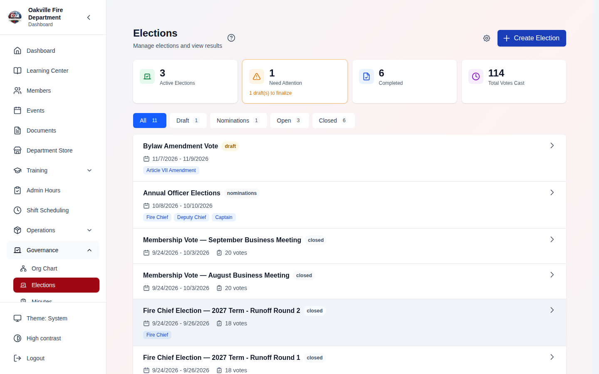

---

## Creating an Election

**Required Permission:** `elections.manage`

1. Navigate to **Elections** and click **Create Election**
2. Fill in the election details:
   - **Title** — e.g., "2026 Annual Officer Election"
   - **Description** — Purpose and scope of the election
   - **Election Type** — Officer Election, Board Election, or General
   - **Start Date** — When voting opens
   - **End Date** — When voting closes
   - **Voting Method** — How votes are counted (see below)
   - **Anonymous Voting** — Whether votes are anonymous (recommended for officer elections)
   - **Allow Write-Ins** — Whether voters can write in candidates not on the ballot
3. Click **Create** — the election is created in **Draft** status

### Voting Methods

| Method              | Description                                                        | Use Case                               |
| ------------------- | ------------------------------------------------------------------ | -------------------------------------- |
| **Simple Majority** | Each voter selects one candidate per position                      | Officer elections, single-choice races |
| **Ranked Choice**   | Voters rank candidates; lowest eliminated in instant-runoff rounds | Contested multi-candidate races        |
| **Approval**        | Voters may approve any number of candidates; most approvals wins   | Board seats, membership approval votes |
| **Supermajority**   | Single-choice voting counted against a higher victory threshold    | Bylaw amendments                       |

> **Note:** Approval and ranked-choice ballots are submitted atomically — all of a voter's approvals (or rankings) for a position are recorded together, or none are.

### Victory Conditions

| Condition         | Description                                                             |
| ----------------- | ----------------------------------------------------------------------- |
| **Most Votes**    | Whoever gets the most votes wins (ties: all tied candidates flagged)    |
| **Majority**      | Must receive >50% of total votes cast                                   |
| **Supermajority** | Must reach the configured percentage (`victory_percentage`, default 67) |
| **Threshold**     | Must reach a configured absolute vote count (`victory_threshold`)       |

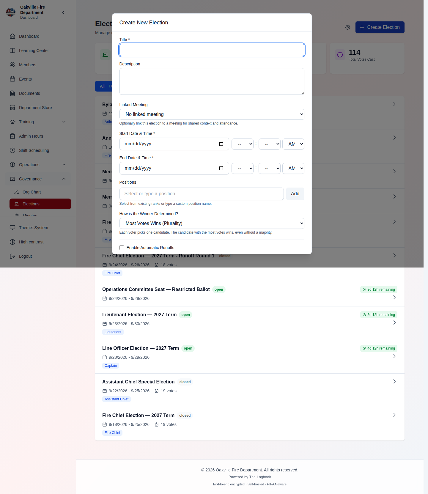

> **Hint:** For bylaw amendments requiring a 2/3 supermajority, set the victory condition to **Supermajority** with **victory_percentage = 67**.

---

## Configuring Ballot Items

After creating an election, add ballot items — the individual questions or positions voters will decide:

1. Open the election detail page
2. Navigate to the **Ballot Items** section
3. Click **Add Ballot Item**
4. Configure:
   - **Position** — The position being filled (e.g., "President", "Vice President")
   - **Candidates** — Add nominated candidates
   - **Write-in allowed** — Whether voters can write in a name
   - **Approval/Denial** — For membership votes, voters approve or deny each applicant

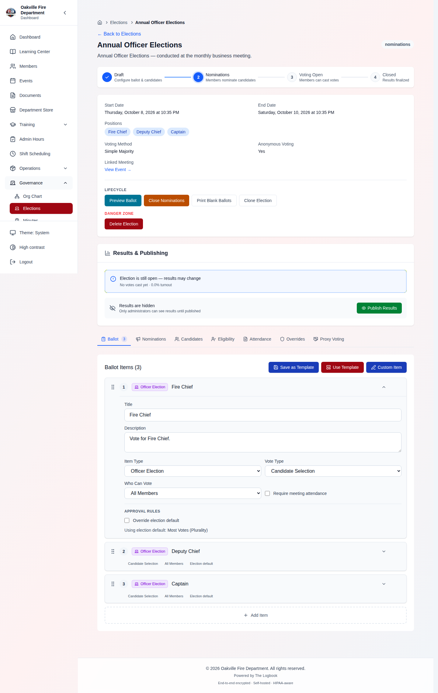

> **Hint:** Use **ballot item templates** (`GET /elections/templates/ballot-items`) for common configurations like officer positions or membership approval votes.

---

## Saved Ballot Templates

_(2026-08-12)_ **Required Permission:** `elections.manage`

If your department runs the same officer slate every year, you no longer have
to rebuild the ballot each time. Save this year's ballot as a named template
and apply it to next year's election:

### Saving a ballot

1. Build the ballot as usual on a draft election
2. In the Ballot Builder, click **Save as Template** (visible once the ballot
   has at least one item, and not on a closed election)
3. Name it — e.g. "Annual officer election" — and click **Save Template**

> **What is saved — and what deliberately is not.** A template snapshots the
> ballot **structure only**: items, positions, voting methods, victory
> conditions, write-in settings, eligibility types. It never carries
> candidates, voters, votes, tokens, or attendance — the builder says exactly
> this under the name field, and the stored shape has nowhere to put them, so
> they cannot survive the round trip even if something tries to send them.
> Applying last year's template gives you last year's _questions_, with nobody
> pre-nominated.

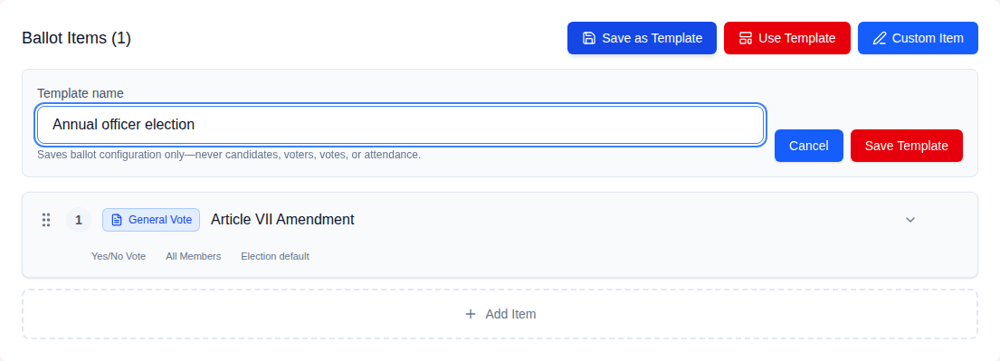

### Applying one

1. On a draft election, open the ballot **template picker**
2. Your department's templates appear under **"Your saved ballots"**, above
   the built-in item templates, each showing its item count and the note
   "replaces current ballot"
3. Click one, then confirm **Replace** — this replaces the whole current
   ballot, which is why it asks twice
4. Add this year's candidates to the applied items

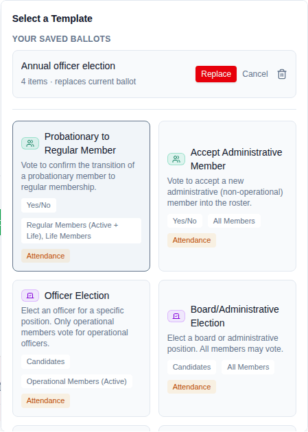

### Edge Cases

| Scenario                                                    | Behavior                                                                                                                                                             |
| ----------------------------------------------------------- | -------------------------------------------------------------------------------------------------------------------------------------------------------------------- |
| Two templates named "Annual Officers" and "annual officers" | Rejected — names are unique per department **case-insensitively** (409 "A ballot template with this name already exists"). The saved name keeps your original casing |
| Applying a template over a ballot you were editing          | The current ballot is **replaced**, not merged — the two-step confirm exists because of this                                                                         |
| The member who saved a template leaves the department       | The template survives — it belongs to the organization, not its author                                                                                               |
| Deleting a template used by past elections                  | Safe — elections hold their own copy of their ballot; a template is only a starting point                                                                            |
| Applying the same template to two elections                 | Each application mints fresh ballot-item ids, so the two ballots never share identifiers                                                                             |
| A template from another department                          | Invisible — templates are organization-scoped; list and delete both 404 across org lines                                                                             |

---

## The Nomination Phase

> Requires the **Nominations** feature toggle (on by default) in Election
> Settings → Features.

Instead of the secretary entering every candidate by hand, a positional
election can run a formal **nomination phase** where the membership proposes
candidates:

1. On a **draft** election with positions, click **Open Nominations** — the
   election enters the `nominations` status
2. Optionally set a **nomination deadline**; when it passes, the phase closes
   automatically (the election returns to draft for ballot finalization)
3. While nominations are open, **any member** can:
   - **Nominate themselves** for a position (accepted immediately)
   - **Nominate another member**, with an optional supporting statement — the
     nominee is emailed and must **accept** before they appear on the ballot;
     declining removes the entry (the audit log keeps the record)
4. Click **Close Nominations** (or let the deadline do it) — the election
   returns to Draft, where you finalize the ballot and open voting as usual

Safeguards:

- Nominee must be an active member of your organization; duplicates rejected
- A nominator may have at most **10 pending third-party nominations**
  outstanding per election (anti-spam)
- Opening the phase emails an announcement to all active members (BCC);
  email failures never block the phase change
- Only candidates who **accepted** reach the ballot — `open_election` still
  validates this

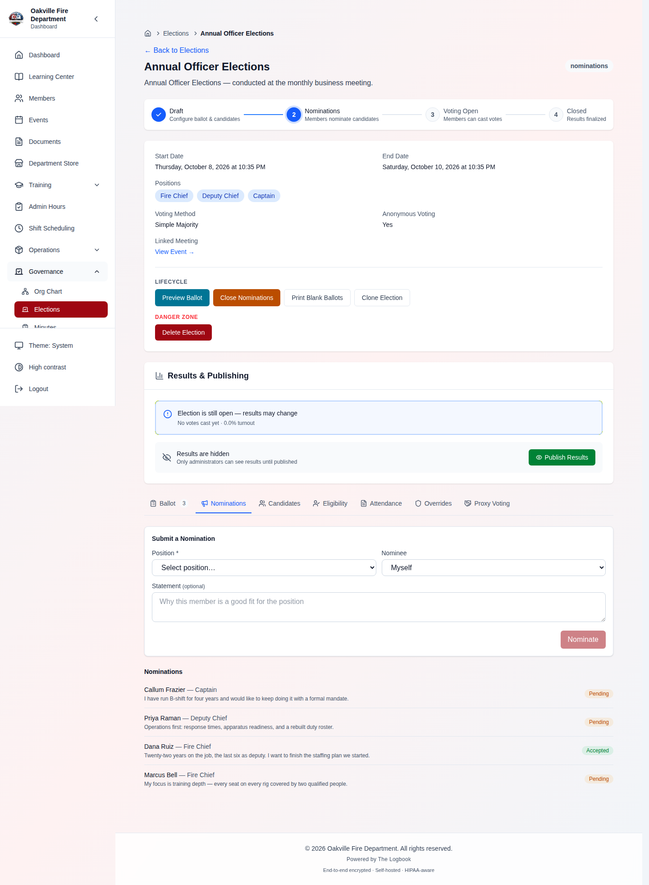

---

## Nominating Candidates

**Required Permission:** `elections.manage`

1. Open the election detail page
2. Click **Add Candidate** on a ballot item
3. Select the member from the dropdown or enter details for an external candidate
4. Optionally add a **candidate statement** or bio
5. Save — the candidate appears on the ballot item

### Candidate Fields

| Field             | Description                                       |
| ----------------- | ------------------------------------------------- |
| **Name**          | Candidate's full name                             |
| **Position**      | Which position they're running for                |
| **Statement**     | Candidate statement or bio (shown to voters)      |
| **Display Order** | Sort order on the ballot                          |
| **Accepted**      | Whether the candidate has accepted the nomination |

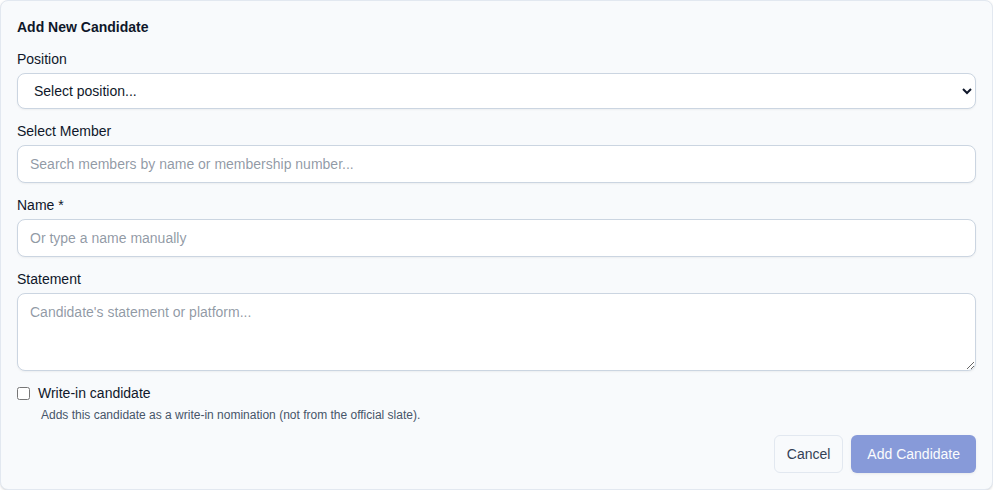

### Edge Cases

| Scenario                          | Behavior                                      |
| --------------------------------- | --------------------------------------------- |
| Candidate with existing votes     | Cannot be deleted (preserves audit trail)     |
| Candidate declines nomination     | Mark as not accepted; still visible but noted |
| Write-in candidate receives votes | Recorded as-is; counted in results            |

---

## Voter Eligibility & Overrides

By default, all active members in the organization are eligible to vote. Eligibility can be restricted by:

- **Membership tier** — Only certain tiers can vote (e.g., Active and Life members, not Honorary)
- **Meeting attendance** — Must be present at the associated meeting
- **Specific voter list** — Manually defined list of eligible voter IDs

### Voter Overrides

**Required Permission:** `elections.manage`

When a member is excluded from voting but should be allowed (e.g., absent member with proxy authorization, or a member whose tier was incorrectly set):

1. Open the election detail page
2. Navigate to **Eligibility Roster**
3. Find the member and click **Grant Override**
4. Enter a reason for the override
5. The member is now eligible to vote regardless of other restrictions

> **Linkable tabs** _(2026-08-12)_: every tab on the election detail page can
> now be sent as a URL — the eligibility roster is
> `/elections/<id>?tab=eligibility`, and the browser Back button steps back
> through tab changes. Useful for pointing a fellow officer at exactly the
> roster (or `?tab=overrides`, `?tab=proxies`, `?tab=attendance`) instead of
> giving directions.

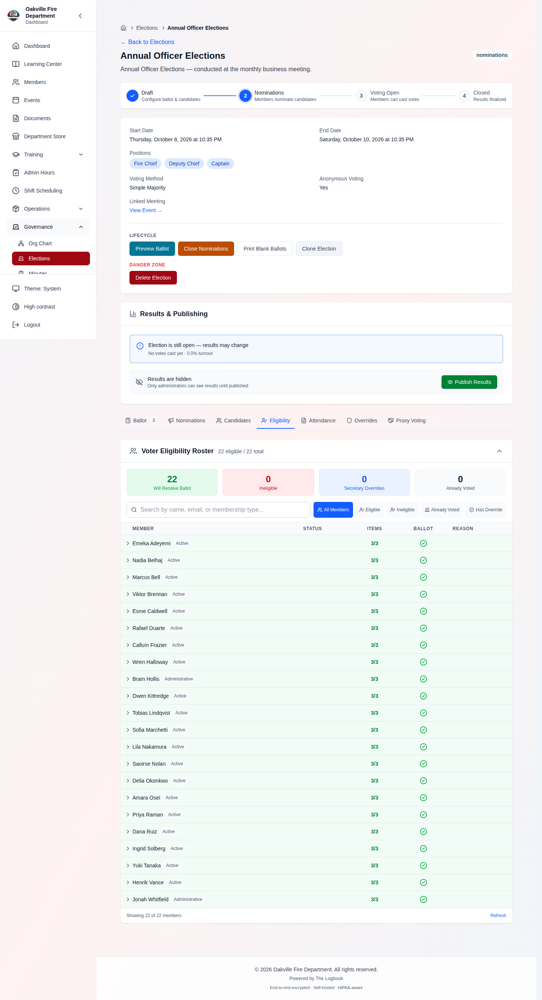

### Edge Cases

| Scenario                                     | Behavior                                           |
| -------------------------------------------- | -------------------------------------------------- |
| Member not on attendance list                | Ineligible unless override granted                 |
| Override granted, then member's tier changes | Override persists regardless                       |
| Bulk override for remote voters              | Use bulk override endpoint to add multiple members |

---

## The Pre-Meeting Package

**Required Permission:** `elections.manage`

Before an annual or special meeting, generate a **pre-meeting package** — a
print-ready PDF the membership or leadership can review ahead of time. From
the election detail page (draft or open elections), open **Pre-Meeting
Package** in the Communication section.

The package contains:

- The linked meeting's details and **agenda** (when the election is linked to
  a meeting record)
- The election configuration: voting window, voting method, victory
  condition, quorum requirement, proxy-voting availability, runoff settings
- A **ballot preview**: every ballot item in order with its eligibility
  restrictions, plus the nominated candidates and their statements
- The **voter-eligibility roster**: summary counts and the eligible-voter
  name list

### Two privacy variants

| Variant    | Contents                                                    | Intended audience          |
| ---------- | ----------------------------------------------------------- | -------------------------- |
| **Member** | Eligible-voter names + counts only                          | General membership mailing |
| **Full**   | Adds per-member ineligibility reasons and granted overrides | Leadership / board prep    |

> **Privacy note:** ineligibility reasons expose individual members'
> membership tier and attendance shortfalls. Keep the full variant to
> leadership; the member variant exists precisely so those details aren't
> broadcast department-wide.

### Sending it

1. Click **Pre-Meeting Package**
2. Prefill the recipient list from **Leadership** or **All eligible voters** —
   then edit it freely: remove anyone, or add outside addresses (board
   counsel, the district office, a member's personal email)
3. Choose the variant (the full-roster checkbox defaults on for leadership
   prefills), add an optional message, and send — recipients are **BCC'd**
   so addresses aren't exposed to each other

### Or just download it

Use the **Preview PDF** links (or `GET /elections/{id}/package-pdf`) to
download either variant without sending anything — attach it to your own
email, print it for the meeting, or file it with the minutes. Sends and
downloads are both audit-logged.

---

## Opening an Election

**Required Permission:** `elections.manage`

When the election is ready:

1. Review all ballot items and candidates
2. Click **Open Election** — status changes from Draft to Open
3. If configured, ballot emails are sent to all eligible voters
4. Voters can now cast their votes via the in-app interface or email ballot link

> **Hint:** Send a **test ballot** to yourself first (`POST /elections/:id/send-test-ballot`) to verify the email rendering and voting link before sending to all members. Votes cast from a test ballot are flagged as test votes — they are excluded from results, statistics, and rosters, and they never consume your real vote.

### Ballot Distribution

When you click **Send Ballots**, the system:

1. Identifies all eligible voters (respecting tier, attendance, and override rules)
2. Generates a unique voting token per voter — the token records which ballot items (and, for positional elections, which positions) that voter is eligible for, and this is enforced again when the ballot is submitted (a voter cannot vote on restricted items or positions even by crafting the request manually)
3. Sends an email with a link to the public ballot page (`/ballot#token=...` — the token rides in the URL fragment, which browsers never send to any server, so the credential stays out of access logs; the page also removes it from the address bar once loaded)
4. Reports how many ballots were sent and which members were skipped (with reasons)

> **[SCREENSHOT NEEDED]:** _Screenshot of the ballot send confirmation showing "42 ballots sent, 3 skipped" with a list of skipped members and reasons (e.g., "No email address", "Ineligible tier")._

> **Hint:** Ballot links are built from the server-configured `FRONTEND_URL`, not the address of the request that triggers the send. Your administrator should set `FRONTEND_URL` to the department's real public site URL (e.g. `https://app.yourdept.org`) so members receive working ballot links — if it is misconfigured, the emailed link points to the wrong host even though the send still reports success.

### Edge Cases

| Scenario                                           | Behavior                                                                                                               |
| -------------------------------------------------- | ---------------------------------------------------------------------------------------------------------------------- |
| Member without email address                       | Skipped during send; reason logged                                                                                     |
| Ballot sent to member who already voted            | Second submission is rejected — votes are never overwritten (double-vote prevention is enforced at the database level) |
| Member with zero eligible ballot items             | Skipped during send (no empty ballot); reason shown in the send summary                                                |
| Election opened without ballot items or candidates | Cannot open — at least one accepted candidate or one ballot item is required                                           |

### Voter-Roll Freeze

Opening an election **snapshots the eligible voter roster**. From that moment,
mid-election membership changes (status flips, tier edits) can no longer change
who may vote or the turnout denominator — the roll is fixed, like a printed
sign-in sheet. Secretary **overrides still admit** members after open (that's
their purpose). Elections opened before this feature (no snapshot) evaluate
eligibility live, as before.

### Printable Ballot PDF

Running a paper vote in the room? **Download Printable Ballot**
(`GET /elections/{id}/printable-ballot`) generates the official blank paper
ballot straight from the election setup: positions in ballot order, accepted
candidates, write-in lines where allowed, and method-specific voter
instructions. Print it, hand it out, then enter the tallies via
[Paper Ballots & Attestation](#paper-ballots--attestation).

---

## Reminders & Lifecycle Automation

> Reminders require the **Reminders** feature toggle; scheduled opening
> requires the **Auto-Open** toggle (both on by default).

The `election_lifecycle` background task runs every 15 minutes and automates
the routine timing work:

| Automation                | Trigger                                                                                   | Opt-in?                                                                                                                                                  |
| ------------------------- | ----------------------------------------------------------------------------------------- | -------------------------------------------------------------------------------------------------------------------------------------------------------- |
| **Auto-close**            | An open election passes its end date                                                      | No — always on. Closing runs result finalization, runoff evaluation, and the anonymous-election privacy purge, so an overdue election is never left open |
| **Auto-open**             | A draft election with **Open Automatically at Start Time** enabled reaches its start date | Yes (`auto_open` on the election)                                                                                                                        |
| **Nomination auto-close** | The nomination deadline passes                                                            | Automatic when a deadline is set                                                                                                                         |
| **Automatic reminder**    | The configured **Auto-Remind Non-Voters** window before close opens                       | Yes (`reminder_hours_before_close`)                                                                                                                      |

### Reminding Non-Voters Manually

From the election detail page, **Remind Non-Voters** sends a reminder ballot
email — with a fresh voting link — to eligible voters who have **not** voted.
The list is recomputed server-side at send time, so members who already voted
are never contacted.

- **One-hour cooldown** per election (manual or automatic) — a double-click
  can't spam the membership
- Each reminded member's **older unused links are expired only once the new
  email is confirmed handed to the mail server** — a bounce leaves the old
  link working, so nobody is stranded with zero live ballots
- Exactly **one automatic reminder** is ever sent; any manual reminder
  suppresses it (both stamp `reminder_sent_at`)
- Double-vote prevention is unaffected: no matter how many live links a
  member holds, the vote dedup rules allow only one ballot

---

## Casting Votes

### In-App Voting (Authenticated)

1. Navigate to **Elections** and open the active election
2. Review each ballot item and the candidates
3. Select your choice for each position (or your approvals/rankings for approval and ranked-choice elections)
4. Click **Submit Vote** — for approval and ranked-choice elections all of your selections for the position are submitted together, atomically
5. A **receipt hash** is returned with your submission — save it; you can later confirm your vote was recorded via the receipt verification endpoint without revealing who you voted for

### Email Ballot Voting (Token-Based)

1. Open the ballot email from your department
2. Click the voting link
3. The public ballot page loads with your ballot items — you only see the items (and positions/candidates) you are eligible to vote on
4. Select your choices. The ballot adapts to the election's voting method: radio buttons for single-choice, **checkboxes** for approval and multi-vote elections (select every candidate you support, up to any cap), and **rank dropdowns** for ranked choice (1 = first preference; each rank can be used once)
5. Click **Submit** — no login required; the token authenticates you. The confirmation screen shows your vote receipts — save them if you want to verify your votes later

> **No screenshot of this page _(2026-08-12)_.** Not because it is unfinished —
> the page works — but because reaching it needs a live voting token, and the
> system deliberately keeps those out of reach. A token is generated once,
> handed straight to the outgoing email, and stored only as a hash, so nobody
> with database access (including our screenshot tooling) can recover a working
> link. That is the property that makes an emailed ballot safe to send. See
> [KNOWN_LIMITATIONS.md](../KNOWN_LIMITATIONS.md#elections--the-public-ballot-cannot-be-screenshotted-by-design-2026-08-12).

### Bulk Voting

For elections with multiple ballot items, votes can be submitted atomically using bulk vote — all positions submitted in a single request.

### Edge Cases

| Scenario                                                  | Behavior                                                                                                                                                  |
| --------------------------------------------------------- | --------------------------------------------------------------------------------------------------------------------------------------------------------- |
| Voter tries to vote twice for the same candidate/position | Rejected (enforced at the database level); approval voters may still add approvals for _different_ candidates, and ranked-choice voters one vote per rank |
| Voter tries to vote on a restricted ballot item           | Rejected at submission — eligibility is enforced server-side, not just hidden in the UI                                                                   |
| Token expired                                             | Tokens expire at the election end date (or after 30 days, whichever is sooner); the secretary can re-send the ballot                                      |
| Write-in candidate name matches existing candidate        | Recorded as separate write-in entry                                                                                                                       |
| Ranked choice with incomplete ranking                     | Only ranked candidates counted; unranked treated as not preferred                                                                                         |
| One vote in a bulk submission fails                       | The entire submission is rolled back — no partial ballots                                                                                                 |

---

## Paper Ballots & Attestation

> Requires the **Paper Ballots** feature toggle (on by default).

For in-room votes counted by hand, officers enter the paper tally directly —
and a configurable number of _other_ officers must confirm the counts before
they count toward results.

### Recording a Paper Tally

**Required Permission:** `elections.manage`

1. Print ballots with **Download Printable Ballot**, run the room vote, and
   count the papers
2. On the open election, click **Record Paper Ballots**
3. Enter the per-candidate counts (and optional notes — e.g., "counted by
   Lt. Reyes and FF Park, 2 spoiled ballots discarded")
4. Submit — one vote row is stored per paper ballot, flagged as manual and
   attributed to you as the recording officer

Manual votes carry no voter identity and no dedup hash — the recording
officer's attested count is the source of truth — but they **are** signed and
chained exactly like electronic votes, so the integrity check covers the full
mixed ballot box. The vote signature also covers the manual flag, so a stored
paper vote can't be silently re-labeled as electronic (or vice versa).

**Plausibility guard:** a batch that would push a position past _eligible
voters × allowed votes_ is rejected with the numbers spelled out. If the count
really is correct (e.g., overrides admitted extra voters), an explicit
**Allow over-count** override records it anyway — audited at warning severity.

### Officer Attestation

By default, **2 officers other than the recorder** (configurable 0–3 in
Election Settings → Features) must attest each batch before its votes count:

1. A recorded batch starts **Pending** — its votes are stored, signed, and
   chained immediately, but excluded from results and statistics
2. Officers with `elections.manage` open the **Paper Batches** panel and click
   **Attest** after checking the entered counts against the physical tally
3. The recorder can never attest their own batch, and each officer counts
   once (enforced at the database level)
4. When the requirement is met, the batch flips to **Confirmed** and its
   ballots count

Each batch snapshots the requirement at record time, so changing the setting
later never silently confirms or un-confirms old batches. A disputed batch is
**voided** with a reason (soft delete — the record remains). Attestation is
only possible while voting is open: a batch still pending at close stays out
of the certified results, and the close writes a warning
`election_manual_ballots_unattested_at_close` audit event.

The panel is on the election page itself, above the tab strip — not inside a
tab — and appears as soon as one batch exists.

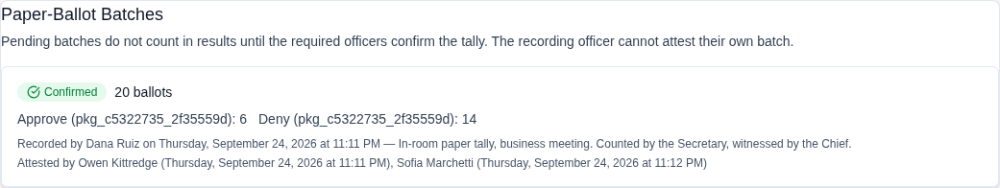

**Attest and Void are only offered while voting is open**, so a batch
photographed after the close carries its trail and no buttons.

### Edge Cases

| Scenario                                           | Behavior                                                                                                                                                                                                                                                                                                                                                                                                                      |
| -------------------------------------------------- | ----------------------------------------------------------------------------------------------------------------------------------------------------------------------------------------------------------------------------------------------------------------------------------------------------------------------------------------------------------------------------------------------------------------------------- |
| Typo: 40 votes entered for a 4-vote race           | Rejected by the plausibility guard; over-count checkbox appears only after the guard fires                                                                                                                                                                                                                                                                                                                                    |
| Recorder clicks Attest on their own batch          | Rejected — attestation requires a _different_ officer                                                                                                                                                                                                                                                                                                                                                                         |
| Setting changed from 2 to 0 after batches recorded | Existing pending batches still require their snapshotted 2 attestations                                                                                                                                                                                                                                                                                                                                                       |
| Election closed with a batch still pending         | Batch excluded from certified results; warning audit event written. _(2026-08-12)_ The exclusion now also covers the close path's own arithmetic: a pending batch's votes cannot decide which candidates advance to a **runoff** and cannot flip a **membership-approval** package to elected/not elected. Before this fix an unattested batch was invisible in the published results yet still counted in those two outcomes |
| A batch reaches Confirmed before close             | Its votes count everywhere — results, runoff advancement, and package outcomes. Exclusion applies only while the batch is Pending (or, via its votes' soft-delete, Voided)                                                                                                                                                                                                                                                    |
| Mis-keyed batch already attested                   | Void the batch (reason required) and re-record                                                                                                                                                                                                                                                                                                                                                                                |
| Attestation requirement set to 0                   | Batches confirm immediately on recording (not recommended)                                                                                                                                                                                                                                                                                                                                                                    |

---

## Proxy Voting

When enabled for the organization, proxy voting allows one member to vote on behalf of another who cannot attend.

**Required Permission:** `elections.manage` (to authorize)

### Authorizing a Proxy

1. Open the election detail page
2. Navigate to **Proxy Authorizations**
3. Click **Authorize Proxy**
4. Select the **delegating member** (who can't attend)
5. Select the **proxy holder** (who will vote for them)
6. Save — the proxy holder receives email notification

### Casting a Proxy Vote

> **Not built _(2026-08-12)_.** This section described a flow that does not
> exist. Proxies can be **configured** — the Proxy Voting panel on the election
> detail page assigns them and caps how many one member may hold — but there is
> no way to cast a vote as one. There is no "Vote as Proxy" button, no
> "Voting as proxy for…" banner, and no proxy mode on the ballot anywhere in the
> application. Until that is built, a member who cannot attend should be sent an
> email ballot instead. See
> [KNOWN_LIMITATIONS.md](../KNOWN_LIMITATIONS.md#elections--proxy-voting-has-an-admin-panel-but-no-ballot-mode-2026-08-12).

### Edge Cases

| Scenario                                    | Behavior                                                                                                       |
| ------------------------------------------- | -------------------------------------------------------------------------------------------------------------- |
| Max proxies per person exceeded             | Default limit is 1 proxy per holder (configurable)                                                             |
| Delegating member also votes directly       | Whichever vote is cast first stands; the second attempt (proxy or direct) is blocked by double-vote prevention |
| Proxy authorization revoked after vote cast | Vote stands; revocation prevents future proxy votes only                                                       |

---

## Monitoring & Results

### During Voting (Election Open)

If **results_visible_immediately** is enabled:

- Real-time vote counts displayed on the election detail page
- Non-voters list shows who hasn't voted yet

If results are hidden until close:

- Only total votes cast is shown (not per-candidate counts)

### After Closing (Election Closed)

**Required Permission:** `elections.manage` (to close)

1. Click **Close Election** and confirm in the dialog — the buttons read **Close election** / **Keep it open**, and it warns that voting ends immediately and cannot be undone _(2026-08-11: this is now an in-app dialog rather than a browser popup, so it cannot be silently suppressed by the browser)_. Closing early (before the scheduled end date) is fully supported — runoff conditions are still evaluated and membership-approval results still flow back to the pipeline
2. Results are calculated and displayed:
   - Per-position winner (or "No winner" if the victory condition wasn't met)
   - Vote counts per candidate
   - Write-in tally
   - Turnout statistics (turnout counts only voting-eligible members — tiers marked not voting-eligible are excluded from the denominator)

> **Note on early closes:** the results _API_ stays gated until the election's scheduled end date has passed. If you close early and want members to see results right away, flip **results visible immediately** on the closed election (the Publish Results panel does this) — internal processes like runoff creation and the emailed report are not affected by the gate.

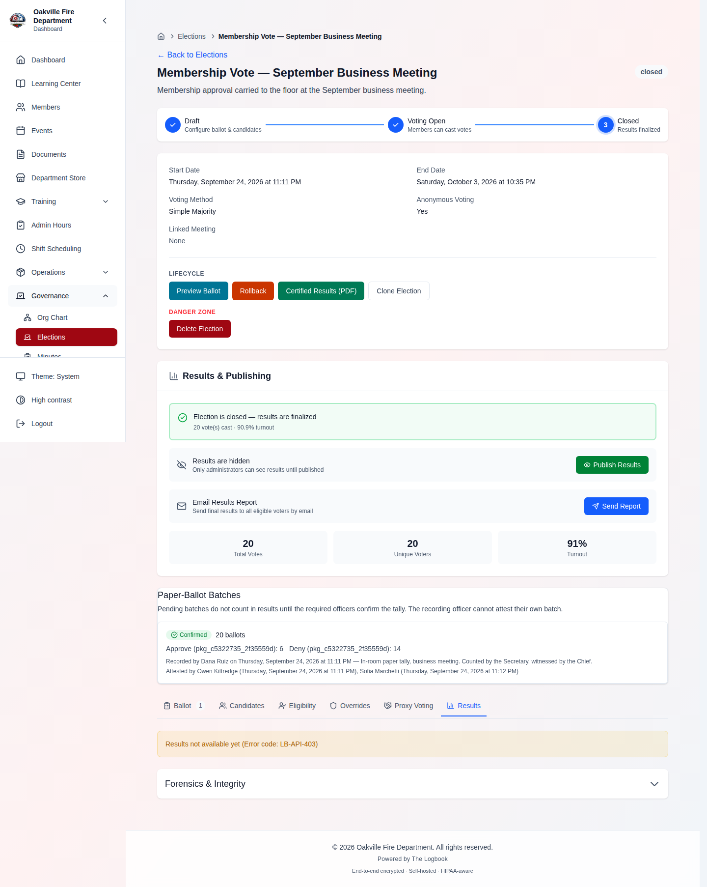

### Live Turnout Dashboard

On meeting night, open the **Live Turnout** panel on an open election — a
fullscreen-capable display designed to project in the room:

- Ballots received vs. eligible voters, with quorum progress when configured
- Auto-refreshes on its own — no reloading between agenda items
- **Never shows candidate tallies** before close — participation only, so
  projecting it can't influence the vote

### Non-Voters Report

Navigate to the **Non-Voters** section to see eligible voters who did not participate. Use this for:

- Follow-up reminders (if election is still open) — or use **Remind
  Non-Voters** to email them a fresh ballot link directly (see
  [Reminders & Lifecycle Automation](#reminders--lifecycle-automation))
- Turnout analysis (after close)

---

## Tie Handling

Each election has a **tie policy** that controls what happens when candidates
tie under the victory condition:

| Policy                          | On a tie                                                                 |
| ------------------------------- | ------------------------------------------------------------------------ |
| **Co-winners** (legacy default) | All tied candidates are flagged as winners                               |
| **Runoff**                      | No winner declared; the tie is flagged for a runoff round                |
| **Revote**                      | No winner declared; the position is flagged for a fresh vote             |
| **Chair decides**               | No winner declared; the presiding officer breaks the tie per your bylaws |

For every policy except co-winners, the results clearly flag the tie, no
winner is declared for the position, and an `election_tie_detected` audit
event is written at close. Set the policy on the election form to match what
your bylaws prescribe _before_ opening — deciding a tie-breaking rule after
seeing the tally is exactly the argument this feature prevents.

---

## Write-In Consolidation

Write-in votes arrive with whatever spelling the voter typed — "J. Smith",
"John Smith", and "Jon Smith" tally as three candidates. After voting (and
before certifying), consolidate them:

1. On the election detail page, open **Merge Write-Ins**
2. Select the variant entries and the candidate they should count under
3. Confirm — results now tally all variants under the target candidate

The merge is **alias-based**: signed vote rows are never modified (each vote's
signature covers its original candidate), so the integrity check still passes.
The merge itself is audited, and results simply re-map the merged candidates
at tally time.

---

## Runoff Elections

When **Enable Runoffs** is on and no candidate meets the victory condition at close (including early closes):

1. The system automatically identifies candidates for the runoff — **top two** advance, or **eliminate lowest** drops the last-place candidate, depending on the configured runoff type
2. A **runoff election** is created as a child of the original, in Draft status, with write-ins disabled. It inherits the original's quorum, position eligibility rules, meeting/event link, attendees, and voter overrides — and gets a fresh anonymity salt of its own
3. The **Runoff Chain** view shows the progression: Original → Runoff 1 → Runoff 2 (if needed), up to the configured maximum rounds
4. Each runoff follows the same voting workflow. To run it on the spot, just open it — **opening an election starts voting immediately**, even if the scheduled start (default: one hour out) hasn't arrived. To set a defined window first (e.g. a 15-minute floor vote), use **Edit Dates** on the draft

> **Hint:** Draft elections — runoffs included — have an **Edit Dates** button with Start Now and 15-min/30-min/1-hour quick durations. And an election whose end date has already passed can't be opened until its dates are updated.

### Edge Cases

| Scenario                       | Behavior                                                     |
| ------------------------------ | ------------------------------------------------------------ |
| Tie in runoff                  | Another runoff created; continues until resolved             |
| All candidates below threshold | Runoff with all candidates                                   |
| Runoffs disabled               | Election closes without a winner; secretary handles manually |

---

## Vote Integrity & Forensics

The elections module includes cryptographic integrity features for audit compliance.

### Vote Receipt Verification

Each vote generates a cryptographic **receipt hash** that:

- Is returned to the voter when they submit their ballot (shown on the confirmation screen — voters should save it)
- Proves the vote was recorded
- Does NOT reveal which candidate was selected
- Can be verified by anyone holding the receipt via `GET /elections/{id}/verify-receipt?receipt=...` (public, rate-limited — returns only the vote's timestamp and position)

### Forensics Report

**Required Permission:** `elections.manage`

Access the **Forensics** tab on the election detail page for:

- **Integrity Check** — Verifies HMAC-SHA256 signatures on all votes (detects tampering)
- **Soft-Deleted Votes** — Shows any votes that were manually removed with reason and who removed them
- **Rollback History** — If the election status was ever rolled back (e.g., reopened after closing)
- **Anomaly Detection** — Flags unusual patterns: a thresholded list of IPs with suspiciously many votes (a full per-IP vote map is deliberately not exposed — it could de-anonymize voters in a small department), a distinct-IP count, and rapid-fire voting via the timeline

> **Privacy note:** for anonymous elections, per-vote IP and user-agent data is **erased when the election closes** (at the same moment the anonymity salt is destroyed). Run any IP-based investigation while voting is open — after close that data no longer exists, by design. Voting tokens are also stored only as SHA-256 hashes, so database access never reveals usable ballot links.

The panel is a collapsed accordion at the bottom of the election page, and the
integrity check inside it runs only when you press **Run Check** — it is a
deliberate act, not something computed on every page load.

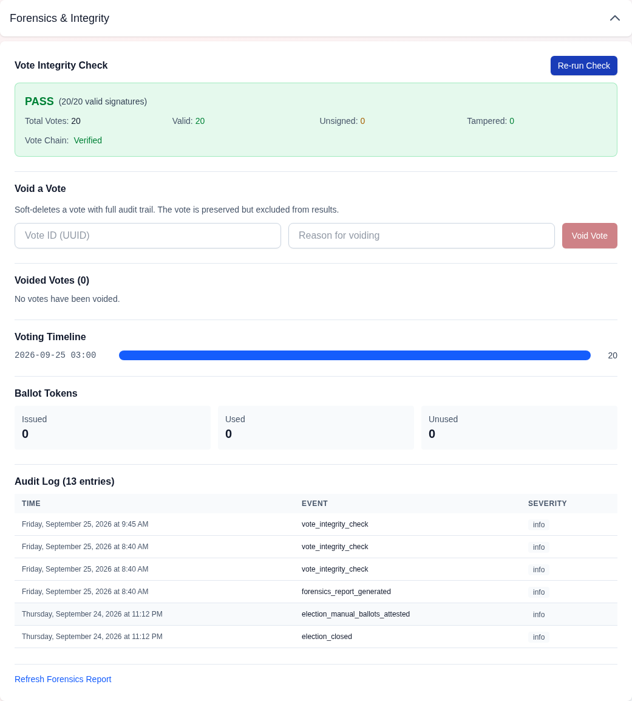

> **Fixed 2026-08-12.** Neither half of this panel worked. `GET /forensics`
> and `GET /integrity` both returned 500s from response validation — the
> forensics report because `AuditLog.id` is an integer where the schema
> declared a string, so any election with an audit trail (that is, any
> election) failed; the integrity check because its response model described
> an entirely different set of fields from the ones the service returns and
> the UI reads.

### Edge Cases

| Scenario                      | Behavior                                                                                                                                                                                                                                              |
| ----------------------------- | ----------------------------------------------------------------------------------------------------------------------------------------------------------------------------------------------------------------------------------------------------- |
| Vote signature mismatch       | Flagged in forensics report; does not auto-delete vote                                                                                                                                                                                                |
| Secretary deletes a vote      | Soft-delete with reason required; audit trail preserved                                                                                                                                                                                               |
| Election reopened after close | Rollback logged in forensics; leadership notification sent. **Not allowed** for anonymous elections that already have votes — the anonymity salt is destroyed at close, so reopening would let prior voters vote again. Create a new election instead |

---

## The Certified Results Package

**Required Permission:** `elections.manage`

Once an election is **closed**, download the **Certified Results package**
(`GET /elections/{id}/certified-results`) — a formal PDF built for the minutes
book and for anyone who asks "prove it":

- Final tallies per position with winners (or flagged ties, per the tie policy)
- Turnout and quorum figures against the frozen voter roll
- The **paper-batch attestation trail** — every batch with its recorder,
  attesting officers, and status
- The **integrity verification result** run at generation time
- Officer **signature lines** for wet-ink certification

File the signed copy with the meeting minutes; the PDF plus the forensics
report is your complete dispute-defense package.

---

## Election Settings

**Required Permission:** `elections.manage`

Navigate to **Elections > Settings** to configure organization-wide defaults:

| Setting                     | Default         | Description                               |
| --------------------------- | --------------- | ----------------------------------------- |
| Default Voting Method       | Simple Majority | Applied to new elections                  |
| Default Victory Condition   | Majority        | Applied to new elections                  |
| Anonymous Voting            | On              | Whether votes are anonymous by default    |
| Allow Write-Ins             | Off             | Whether write-ins are allowed by default  |
| Results Visible Immediately | Off             | Whether results show during voting        |
| Enable Runoffs              | On              | Auto-create runoffs when no winner        |
| Proxy Voting Enabled        | Off             | Whether proxy voting is available         |
| Max Proxies Per Person      | 1               | How many members one person can represent |

### Feature Toggles

The **Features** section lets each department turn the optional workflows on
or off (all on by default; enforced server-side, not just hidden in the UI):

| Toggle                             | Default | Controls                                                                |
| ---------------------------------- | ------- | ----------------------------------------------------------------------- |
| Nominations                        | On      | The nomination phase and member nominations                             |
| Paper Ballots                      | On      | Officer paper-tally entry                                               |
| Reminders                          | On      | Manual **and** automatic non-voter reminders                            |
| Auto-Open                          | On      | Scheduled opening of flagged draft elections                            |
| Paper-Ballot Attestations Required | 2       | Officers (besides the recorder) who must confirm each paper batch (0–3) |

Deliberately **not** toggleable: automatic closing at the end date and the
nomination-deadline auto-close. Closing finalizes results and runs the
anonymous-election privacy purge — a privacy guarantee, not a convenience —
and an in-flight nomination phase must always be closeable.

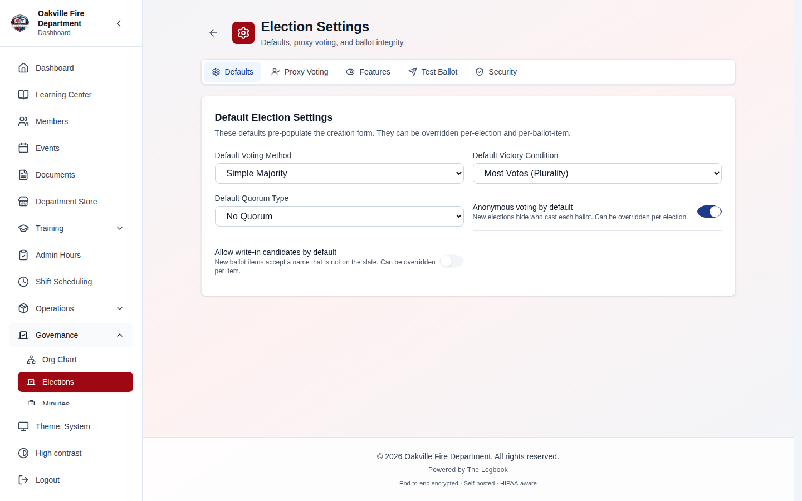

---

## Cloning an Election

**Required Permission:** `elections.manage`

Annual elections rarely change shape. **Clone** creates a fresh draft from an
existing election's configuration:

1. On any election, click **Clone**
2. Set the new title and dates
3. Optionally copy the accepted candidates (useful for a re-run; skip it for
   next year's election where nominations start over)
4. The clone is created in **Draft** — review, then run it like any election

What is **never** copied: votes, voting tokens, attendees, voter overrides,
and the anonymity salt (a fresh salt is generated — clones can never be
correlated with the original's voter hashes).

---

## Meeting Attendance Integration

Elections can be linked to meetings or events. When linked:

1. **Check-in attendance** at the meeting feeds into voter eligibility
2. Members who are present are marked eligible; absent members are excluded (unless overridden)
3. Import attendees directly from the linked meeting or event using **Import Attendees**

### How to Link an Election to a Meeting

1. When creating the election, select a **Meeting** or **Event** from the dropdown
2. Or link after creation from the election detail page

> **Hint:** For annual business meetings, create the meeting first, take attendance via QR check-in, then open the election. All checked-in members automatically become eligible voters.

---

## Prospective Member Election Packages

When a prospective member reaches the **Election Vote** stage of their pipeline, an **election package** is automatically created. This package contains:

- Applicant snapshot (name, email, phone, address, documents)
- Coordinator notes
- Supporting statement (shown to voters)
- Stage history summary

### Workflow

1. Applicant advances to Election Vote stage → package auto-created
2. Coordinator reviews and marks package as **Ready for Ballot**
3. Secretary opens the election and adds the applicant as a ballot item
4. Members vote to approve or deny
5. Results flow back: package status → `elected` or `not_elected`

> **[SCREENSHOT NEEDED]:** _Screenshot of the election detail page showing a membership approval ballot item with an applicant's name, supporting statement, and Approve/Deny voting options._

See [Membership Management > Prospective Members](./01-membership.md#prospective-members-pipeline) for the full pipeline workflow.

---

## Realistic Example: Annual Officer Election

### Background

**Oakville Fire Department** holds its annual officer election at the December business meeting. Secretary **Sarah Kim** manages the process.

### Part 1: Setup (December 1)

Sarah creates the election:

- **Title:** "2026 Annual Officer Election"
- **Type:** Officer Election
- **Start Date:** December 15 (meeting night)
- **End Date:** December 15 (same-day vote)
- **Voting Method:** Simple Majority
- **Victory Condition:** Majority
- **Anonymous Voting:** On
- **Enable Runoffs:** On

She adds three ballot items:

- **Fire Chief** — Candidates: Lt. Morrison, Capt. Davis
- **Assistant Chief** — Candidates: Lt. Hernandez, FF Brooks, FF Kim
- **Secretary** — Candidates: FF Nguyen (unopposed), Write-ins allowed

### Part 2: Meeting Night (December 15)

1. Members arrive and check in via QR code → attendance recorded
2. Sarah links the election to tonight's meeting → 38 of 42 members present
3. She opens the election and sends ballots:
   - 38 ballots sent to present members
   - 4 skipped (absent without proxy)
4. Members vote on their phones via the ballot link in their email

### Part 3: Results

After 30 minutes, Sarah closes the election:

| Position        | Candidate          | Votes    | Result      |
| --------------- | ------------------ | -------- | ----------- |
| Fire Chief      | Lt. Morrison       | 22 (58%) | **Elected** |
| Fire Chief      | Capt. Davis        | 16 (42%) | Not elected |
| Assistant Chief | Lt. Hernandez      | 14 (37%) | → Runoff    |
| Assistant Chief | FF Brooks          | 13 (34%) | → Runoff    |
| Assistant Chief | FF Kim             | 11 (29%) | Eliminated  |
| Secretary       | FF Nguyen          | 36 (95%) | **Elected** |
| Secretary       | Write-in: FF Walsh | 2 (5%)   | Not elected |

**Fire Chief:** Lt. Morrison wins with simple majority (58% > 50%).

**Assistant Chief:** No candidate reached majority → automatic runoff between Lt. Hernandez and FF Brooks. Sarah opens the runoff immediately. After a second vote, Lt. Hernandez wins 21-17.

**Secretary:** FF Nguyen wins unopposed with 95%.

Sarah generates the election report and emails it to the department.

---

## Troubleshooting

| Issue                                                    | Solution                                                                                                                                                                                                                                                                                     |
| -------------------------------------------------------- | -------------------------------------------------------------------------------------------------------------------------------------------------------------------------------------------------------------------------------------------------------------------------------------------- |
| Member says they didn't receive ballot email             | Check the send report for skipped members. Verify email address is on file. Re-send ballot to individual member.                                                                                                                                                                             |
| Ballot email link points to the wrong site or won't load | The emailed link is built from the server's `FRONTEND_URL` setting, not the request URL. Have your administrator set `FRONTEND_URL` to the real public site URL and re-send the ballots.                                                                                                     |
| Voter gets "Token expired" error                         | Tokens expire at the election end date (or after 30 days, whichever comes first). Secretary can re-send the ballot email.                                                                                                                                                                    |
| Voter gets "not eligible to vote on" an item             | Per-item eligibility is enforced at submission. Check the Eligibility Roster; if the member should vote, grant an override and re-send their ballot (the new token picks up their updated eligibility).                                                                                      |
| Election closed accidentally                             | Use **Rollback** to reopen (requires `elections.manage`); leadership receives notification. **Exception:** an anonymous election that already has votes cannot be reopened after closing — its anonymity salt was destroyed, so reopening would permit double voting. Create a new election. |
| Candidate wants to withdraw                              | Remove candidate from ballot (only if no votes cast). If votes exist, mark as "declined" instead.                                                                                                                                                                                            |
| Proxy holder can't find proxy vote button                | Verify proxy authorization was created. Check that the election is still open.                                                                                                                                                                                                               |
| Results don't show after closing                         | If the election was closed _before_ its scheduled end date, results stay hidden until that date passes — flip **results visible immediately** on the closed election (Publish Results panel) to show them now.                                                                               |
| Vote count doesn't match attendance                      | Check for proxy votes (counted separately). Check for voter overrides (members not on attendance list).                                                                                                                                                                                      |
| Forensics shows integrity warning                        | Run full forensics report. Contact system administrator if vote signatures are invalid.                                                                                                                                                                                                      |
| Runoff not auto-created                                  | Verify **Enable Runoffs** is on in election settings. Check that the victory condition was set correctly.                                                                                                                                                                                    |
| Paper batch recorded but results don't change            | The batch is likely **Pending** attestation — check the Paper Batches panel. It needs the configured number of other officers to attest before its votes count.                                                                                                                              |
| "Attest" button missing or rejected                      | The recorder cannot attest their own batch, each officer attests once, and attestation only works while voting is open.                                                                                                                                                                      |
| Paper tally rejected as implausible                      | The count exceeds eligible voters × allowed votes for the position. Re-check the count; if it's genuinely correct (e.g., overrides admitted extra voters), tick **Allow over-count** — the override is audited.                                                                              |
| Nominate button missing                                  | Check the **Nominations** feature toggle in Election Settings, and that the election is in the nomination phase (managers open it from a draft election).                                                                                                                                    |
| Member nominated but not on the ballot                   | Third-party nominees must **accept** the nomination first. Check the Nominations tab for pending entries; the nominee was emailed an accept/decline link.                                                                                                                                    |
| Reminder button greyed out / "sent recently"             | Reminders have a one-hour cooldown per election. Wait, or verify the **Reminders** feature toggle is on.                                                                                                                                                                                     |
| Election didn't open at its start time                   | Auto-open is opt-in: **Open Automatically at Start Time** must be enabled on the election and the **Auto-Open** feature toggle must be on. Invalid drafts (e.g., no accepted candidates) are skipped and retried — check the election for validation problems.                               |
| Member became active mid-election but can't vote         | The voter roll is frozen at open. Grant a secretary override to admit them — that's the sanctioned path onto a frozen roll.                                                                                                                                                                  |
| Tie shown with no winner declared                        | Working as configured: any tie policy other than co-winners flags the tie for your bylaws process (runoff, revote, or chair decision) instead of declaring winners.                                                                                                                          |
| Write-in variants splitting the vote count               | Use **Merge Write-Ins** to consolidate spelling variants under one candidate before certifying. The merge is audited and never edits vote rows.                                                                                                                                              |

---

**Previous:** [Medical Screening](./13-medical-screening.md) | **Next:** [Prospective Members Pipeline](./15-prospective-members.md)
