# Elections & Voting

The Elections module manages department elections, officer nominations, anonymous voting, proxy authorization, ballot distribution, runoff chains, and forensic audit trails. It supports both in-person meeting votes and remote ballot distribution via email.

---

## Table of Contents

1. [Elections Overview](#elections-overview)
2. [Creating an Election](#creating-an-election)
3. [Configuring Ballot Items](#configuring-ballot-items)
4. [Saved Ballot Templates](#saved-ballot-templates)
5. [The Nomination Phase](#the-nomination-phase)
6. [Nominating Candidates](#nominating-candidates)
7. [Voter Eligibility & Overrides](#voter-eligibility--overrides)
8. [The Pre-Meeting Package](#the-pre-meeting-package)
9. [Opening an Election](#opening-an-election)
10. [Reminders & Lifecycle Automation](#reminders--lifecycle-automation)
11. [Casting Votes](#casting-votes)
12. [Paper Ballots & Attestation](#paper-ballots--attestation)
13. [Proxy Voting](#proxy-voting)
14. [Monitoring & Results](#monitoring--results)
15. [Tie Handling](#tie-handling)
16. [Write-In Consolidation](#write-in-consolidation)
17. [Runoff Elections](#runoff-elections)
18. [Vote Integrity & Forensics](#vote-integrity--forensics)
19. [The Certified Results Package](#the-certified-results-package)
20. [Election Settings](#election-settings)
21. [Cloning an Election](#cloning-an-election)
22. [Meeting Attendance Integration](#meeting-attendance-integration)
23. [Prospective Member Election Packages](#prospective-member-election-packages)
24. [What Changed After the W50 Review](#what-changed-after-the-w50-review-2026-09-30)
25. [Realistic Example: Annual Officer Election](#realistic-example-annual-officer-election)
26. [Troubleshooting](#troubleshooting)

---

## Elections Overview

Navigate to **Elections** in the sidebar or from **Events & Meetings > Elections** to view all department elections.

The elections module supports:

- **Officer elections** — Annual or special elections for department leadership positions
- **Board elections** — Board of directors or governance body elections
- **General votes** — Membership approval, bylaw amendments, budget approvals
- **Membership approval** — Voting on prospective member applications (integrated with the Prospective Members pipeline)

Key pages:

| URL                      | Page                        | Permission            |
| ------------------------ | --------------------------- | --------------------- |
| `/elections`             | Elections List              | `elections.view`      |
| `/elections/:electionId` | Election Detail             | `elections.view`      |
| `/elections/settings`    | Election Settings           | `elections.manage`    |
| `/ballot`                | Public Ballot (token-based) | Public (rate-limited) |

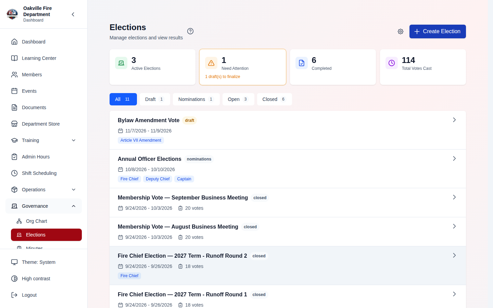

**[SCREENSHOT — REPLACE `14-01-elections-list.png`.** The subtitle under **Elections** now reads "Create elections, send ballots and publish results" for an elections manager ("See elections and their results" for a member); it read "Manage elections and view results" (2026-09-29). Re-shoot the same list as an administrator.**]**

---

## Creating an Election

**Required Permission:** `elections.manage`

1. Navigate to **Elections** and click **Create Election**
2. Fill in the election details:
   - **Title** — e.g., "2026 Annual Officer Election"
   - **Description** — Purpose and scope of the election
   - **Election Type** — Officer Election, Board Election, or General
   - **Start Date** — When voting opens
   - **End Date** — When voting closes
   - **How is the Winner Determined?** — The voting method and victory condition, chosen together as one option (see below)
   - **Anonymous Voting** — Whether votes are anonymous (recommended for officer elections)
   - **Allow Write-Ins** — Whether voters can write in candidates not on the ballot
3. Click **Create** — the election is created in **Draft** status

### Voting Methods

| Method              | Description                                                                                                                                                                                                                        | Use Case                               |
| ------------------- | ---------------------------------------------------------------------------------------------------------------------------------------------------------------------------------------------------------------------------------- | -------------------------------------- |
| **Simple Majority** | Each voter selects one candidate per position                                                                                                                                                                                      | Officer elections, single-choice races |
| **Ranked Choice**   | Voters rank candidates; lowest eliminated in instant-runoff rounds                                                                                                                                                                 | Contested multi-candidate races        |
| **Approval**        | Voters may approve any number of candidates; most approvals wins                                                                                                                                                                   | Board seats, membership approval votes |
| **Supermajority**   | Single-choice voting counted against a higher victory threshold. The create form does not offer it as a method; its **Supermajority Required (2/3)** option uses Simple Majority counting with the Supermajority victory condition | Bylaw amendments                       |

> **Note:** Approval and ranked-choice ballots are submitted atomically — all of a voter's approvals (or rankings) for a position are recorded together, or none are.

### Victory Conditions

| Condition         | Description                                                             |
| ----------------- | ----------------------------------------------------------------------- |
| **Most Votes**    | Whoever gets the most votes wins (ties: all tied candidates flagged)    |
| **Majority**      | Must receive >50% of total votes cast                                   |
| **Supermajority** | Must reach the configured percentage (`victory_percentage`, default 67) |
| **Threshold**     | Must reach a configured absolute vote count (`victory_threshold`)       |

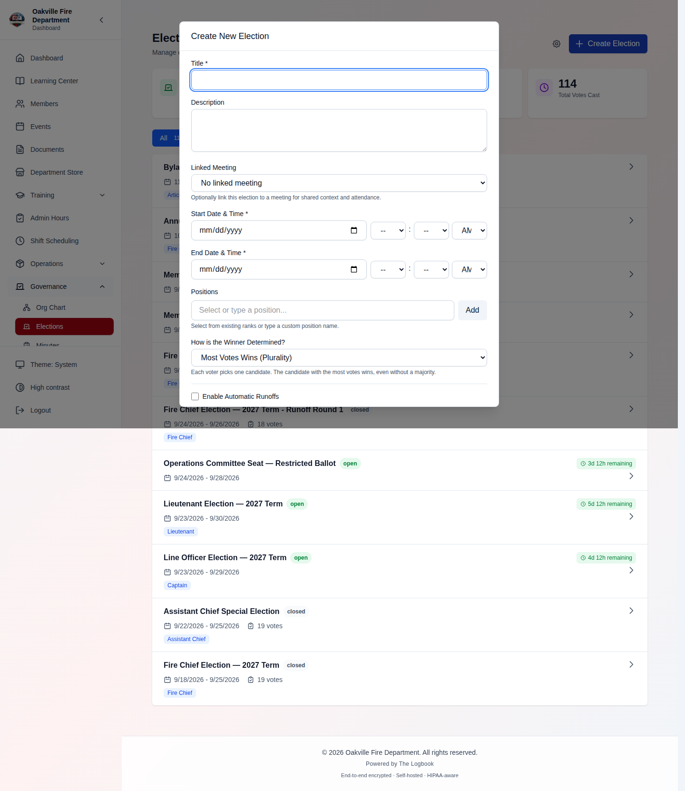

> **Hint:** For bylaw amendments requiring a 2/3 supermajority, choose **Supermajority Required (2/3)**. That one option sets both halves — Simple Majority counting and the **Supermajority** victory condition — and adds a **Supermajority Percentage** field that defaults to 67.

**The election page now says which rule you picked** _(2026-09-30)_. Every
one-choice option on the create form is stored as Simple Majority counting with
the real rule in the victory condition, and the election page used to show
only the first half — an election created as **Most Votes Wins (Plurality)**
read "Voting Method: Simple Majority". The details card now reads **Voting
Method** as **One choice per voter**, **Ranked choice** or **Approval**, and a
**Winner** row gives the rule: "Most Votes (Plurality)", "Majority (>50% of
votes)", "Supermajority (67% of votes)" or the threshold.

Also on the create form _(2026-09-30)_: typing a position and clicking **Add**
adds it on the first click (an invisible layer used to swallow it); the quick
durations and **End of Day** are computed in the department's timezone, not the
browser's — in a browser set to UTC, "End of Day" for a 9:00 AM Chicago start
was 6:59 PM and "1 Hour" landed before the start; and the start and end time
pickers are announced as "Start time" and "End time".

---

## Configuring Ballot Items

After creating an election, add ballot items — the individual questions or positions voters will decide:

1. Open the election detail page
2. Navigate to the **Ballot Items** section
3. Click **Add Ballot Item**
4. Configure:
   - **Position** — The position being filled (e.g., "President", "Vice President")
   - **Candidates** — Add nominated candidates
   - **Write-in allowed** — Whether voters can write in a name
   - **Approval/Denial** — For membership votes, voters approve or deny each applicant

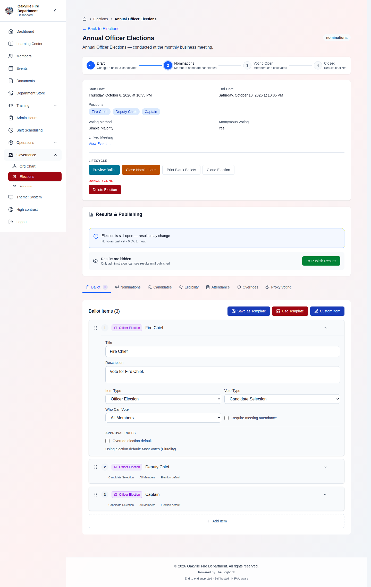

> **Hint:** Use **ballot item templates** (`GET /elections/templates/ballot-items`) for common configurations like officer positions or membership approval votes.

---

## Saved Ballot Templates

_(2026-08-12)_ **Required Permission:** `elections.manage`

If your department runs the same officer slate every year, you no longer have
to rebuild the ballot each time. Save this year's ballot as a named template
and apply it to next year's election:

### Saving a ballot

1. Build the ballot as usual on a draft election
2. In the Ballot Builder, click **Save as Template** (visible once the ballot
   has at least one item, and not on a closed election)
3. Name it — e.g. "Annual officer election" — and click **Save Template**

A department can keep up to **200** saved templates _(2026-10-05)_. Saving a
201st is refused with "This organization has reached the maximum of 200 saved
ballot templates" — delete one you no longer use from the template picker
first.

> **What is saved — and what deliberately is not.** A template snapshots the
> ballot **structure only**: items, positions, voting methods, victory
> conditions, write-in settings, eligibility types. It never carries
> candidates, voters, votes, tokens, or attendance — the builder says exactly
> this under the name field, and the stored shape has nowhere to put them.
> Since 2026-10-05 a save request that tries to send one anyway — a
> `candidates` list inside an item, say — is refused outright rather than
> accepted with the extra quietly dropped.
> Applying last year's template gives you last year's _questions_, with nobody
> pre-nominated.

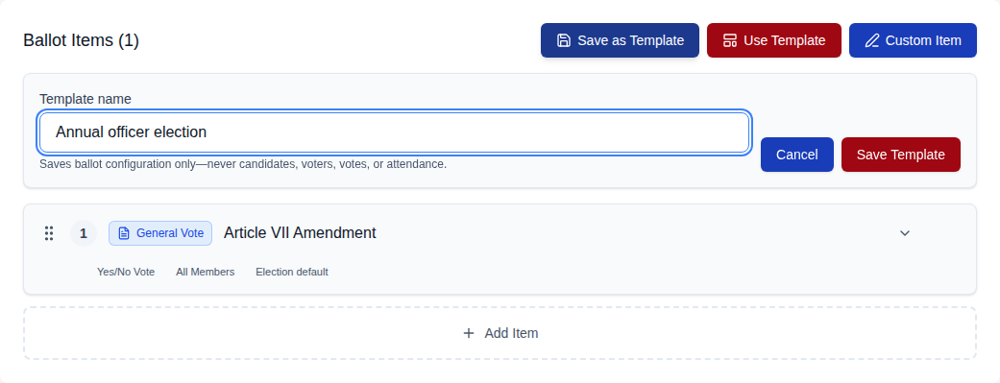

### Applying one

1. On a draft election, open the ballot **template picker**
2. Your department's templates appear under **"Your saved ballots"**, above
   the built-in item templates, each showing its item count and the note
   "replaces current ballot"
3. Click one, then confirm **Replace** — this replaces the whole current
   ballot, which is why it asks twice
4. Add this year's candidates to the applied items

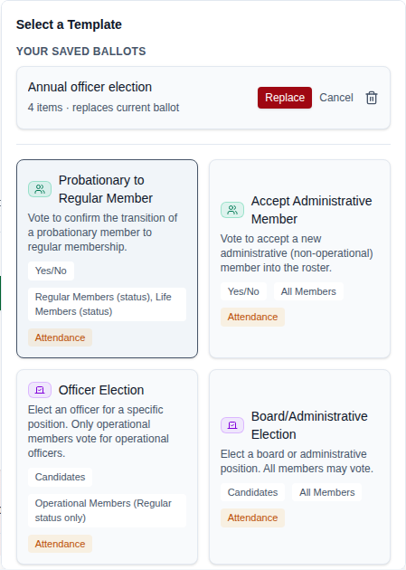

> **It replaces two things, and warns about one.** A template carries the
> **voting method** and **write-in setting** of the election it was saved from,
> and applying it writes both over the election you applied it to. The
> confirmation is about the ballot; nothing on screen mentions the settings.
> The details card above the builder shows the method and, since 2026-09-30,
> the **Winner** rule, but not the write-in setting. Click **Preview
> Ballot** afterwards — its Election Details strip is where the method, the
> victory condition and its percentage, Anonymous, Write-ins allowed and the
> quorum appear together.

Below is one draft before and after applying "Annual officer election", a
template saved from a ranked-choice officer ballot. One item becomes four, which
the confirmation warned about — and the voting method changes from one choice
per voter to ranked choice, which nothing warned about.

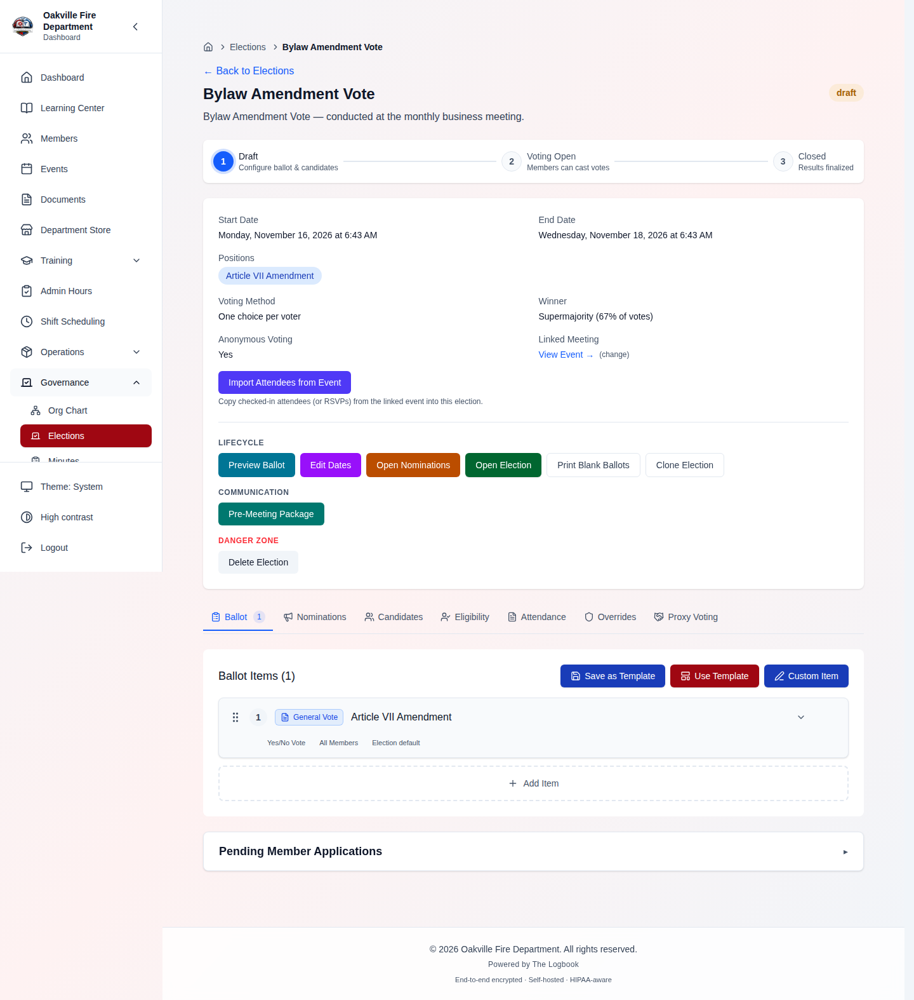

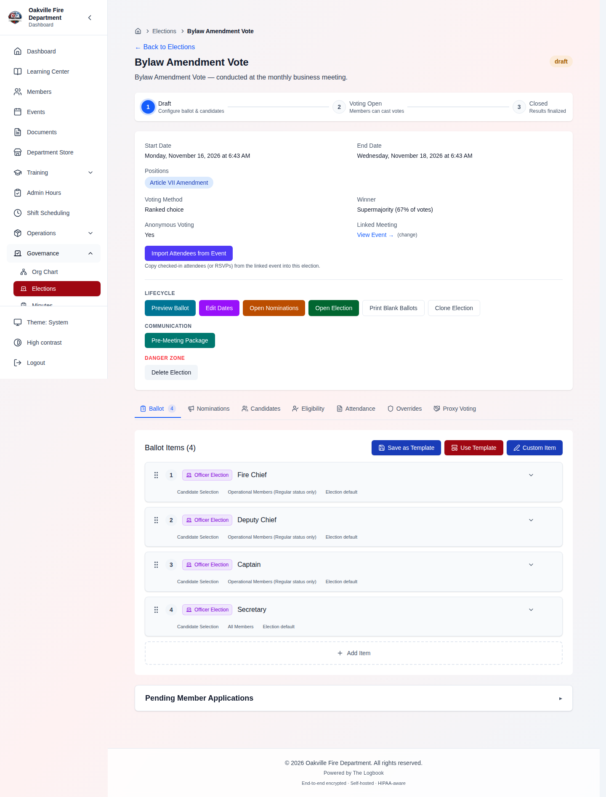

**[SCREENSHOT — REPLACE `19-25-ballot-template-settings-before.png` and `19-26-ballot-template-settings-after.png`.** The details card changed on 2026-09-30: **Voting Method** reads "One choice per voter" (before) and "Ranked choice" (after) instead of "Simple Majority" / "Ranked Choice", and a new **Winner** row shows the victory condition — in this example "Supermajority (67% of votes)" on both frames, which is the hazard the paragraph below describes. Re-shoot the same draft before and after applying the template.**]**

The hazard is the part that did _not_ change. This draft was created as
**Supermajority Required (2/3)** — Simple Majority counting with the
Supermajority victory condition. The apply overwrote the method and left the
condition alone, so a bylaw amendment that must carry two-thirds is now decided
by ranked choice with its 67% threshold still recorded underneath.
**Positions** still reads the draft's old value over a ballot of four officer
seats, and the write-in setting is overwritten along with the method: the
officer template had write-ins off, so they went off. Treat a saved ballot as a
starting point for a _new_ election rather than a change to a configured one.

### Edge Cases

| Scenario                                                                               | Behavior                                                                                                                                                                                                                                                                                                                                                                                         |
| -------------------------------------------------------------------------------------- | ------------------------------------------------------------------------------------------------------------------------------------------------------------------------------------------------------------------------------------------------------------------------------------------------------------------------------------------------------------------------------------------------ |
| Two templates named "Annual Officers" and "annual officers"                            | Rejected — names are unique per department **case-insensitively** (409 "A ballot template with this name already exists"). The saved name keeps your original casing                                                                                                                                                                                                                             |
| Applying a template over a ballot you were editing                                     | The current ballot is **replaced**, not merged — the two-step confirm exists because of this                                                                                                                                                                                                                                                                                                     |
| The member who saved a template leaves the department                                  | The template survives — it belongs to the organization, not its author                                                                                                                                                                                                                                                                                                                           |
| Deleting a template used by past elections                                             | Safe — elections hold their own copy of their ballot; a template is only a starting point                                                                                                                                                                                                                                                                                                        |
| Applying the same template to two elections                                            | Each application mints fresh ballot-item ids, so the two ballots never share identifiers                                                                                                                                                                                                                                                                                                         |
| Applying a template to an election configured for a supermajority                      | The **method** is overwritten and the **victory condition is not**, leaving a 2/3 threshold recorded under whatever method the template brought. Applying a template is the only control that changes an election's voting method once the election exists — **Edit Dates** and **Clone Election** do not touch it — so to get a different method/condition pairing back, re-create the election |
| Results                                                                                | Never in a template — the stored shape is the ballot items, the voting method and the write-in setting                                                                                                                                                                                                                                                                                           |
| Deleting a saved template                                                              | Asks for confirmation — the picker's delete button arms a **Delete** / **Cancel** pair                                                                                                                                                                                                                                                                                                           |
| A template or ballot with an invalid or duplicate item ID, or an unknown voting method | Rejected. Item IDs may use only letters, numbers, `_` and `-`, and must be unique within the ballot                                                                                                                                                                                                                                                                                              |
| Voter type `all` alongside another voter type on one item                              | Rejected — "'all' cannot be combined with other voter types"                                                                                                                                                                                                                                                                                                                                     |
| A ballot item overriding its victory condition to supermajority without a percentage   | Rejected — a supermajority item needs its `victory_percentage`                                                                                                                                                                                                                                                                                                                                   |
| Quorum values on the election                                                          | A **count** quorum may exceed 100; a **percentage** quorum may not ("Percentage quorum cannot exceed 100")                                                                                                                                                                                                                                                                                       |
| A template from another department                                                     | Invisible — templates are organization-scoped; list and delete both 404 across org lines                                                                                                                                                                                                                                                                                                         |

---

## The Nomination Phase

> Requires the **Nominations** feature toggle (on by default) in Election
> Settings → Features.

Instead of the secretary entering every candidate by hand, a positional
election can run a formal **nomination phase** where the membership proposes
candidates:

1. On a **draft** election with positions, click **Open Nominations** — the
   election enters the `nominations` status
2. Optionally set a **nomination deadline**; when it passes, the phase closes
   automatically (the election returns to draft for ballot finalization)
3. While nominations are open, **any member** can:
   - **Nominate themselves** for a position (accepted immediately)
   - **Nominate another member**, with an optional supporting statement — the
     nominee is emailed and must **accept** before they appear on the ballot;
     declining removes the entry (the audit log keeps the record)
4. Click **Close Nominations** (or let the deadline do it) — the election
   returns to Draft, where you finalize the ballot and open voting as usual

Safeguards:

- Nominee must be an active member of your organization; duplicates rejected
- A nominator may have at most **10 pending third-party nominations**
  outstanding per election (anti-spam)
- Opening the phase emails an announcement to all active members (BCC);
  email failures never block the phase change
- Only candidates who **accepted** reach the ballot — `open_election` still
  validates this
- **Pending nominations are member-visible only while nominations are open**
  _(2026-08-16)_ — that window exists so nominees can see and respond to their
  nomination. Once the phase closes, the member-facing candidate list shows
  accepted candidates only; a nomination that was never accepted simply
  disappears from members' view. Election managers (`elections.manage`)
  always see the full list, pending entries included.

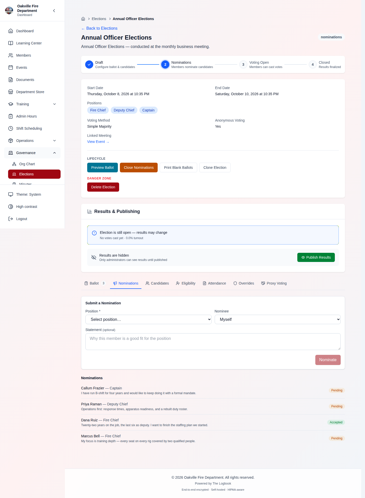

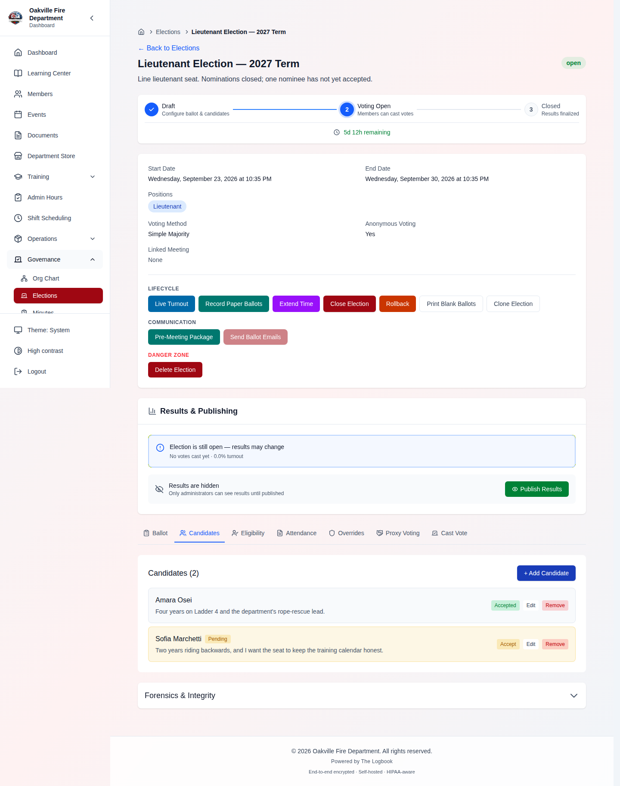

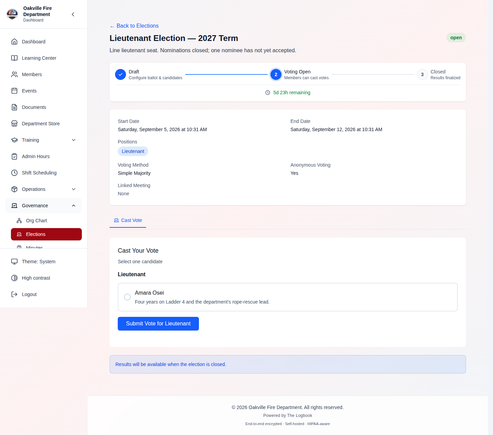

**Above: an elections manager. Below: an ordinary member, on the same
election.** The manager's Candidates tab lists Sofia Marchetti as **Pending**
with an Accept action beside her; the member's ballot offers Amara Osei alone.
A member has no Candidates tab at all — their view of who is standing _is_ the
ballot, which is why the withheld nomination shows up as a shorter list of
options rather than as a hidden row.

While nominations are still open a member **does** see pending nominations, so
that a nominee can find and answer their own. It is only after nominations close
that they become management records.

---

## Nominating Candidates

**Required Permission:** `elections.manage`

1. Open the election detail page
2. Click **Add Candidate** on a ballot item
3. Select the member from the dropdown or enter details for an external candidate
4. Optionally add a **candidate statement** or bio
5. Save — the candidate appears on the ballot item

### Candidate Fields

| Field             | Description                                       |
| ----------------- | ------------------------------------------------- |
| **Name**          | Candidate's full name                             |
| **Position**      | Which position they're running for                |
| **Statement**     | Candidate statement or bio (shown to voters)      |
| **Display Order** | Sort order on the ballot                          |
| **Accepted**      | Whether the candidate has accepted the nomination |

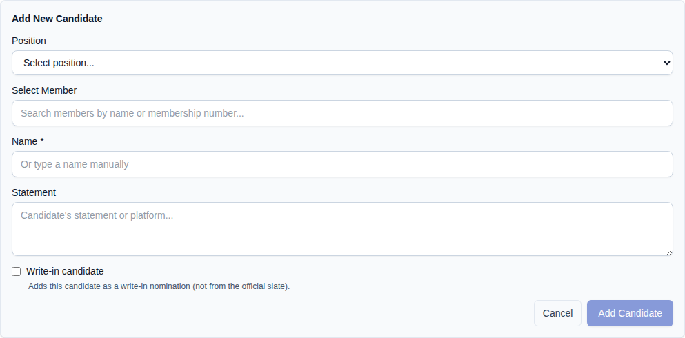

### Edge Cases

| Scenario                          | Behavior                                                                       |
| --------------------------------- | ------------------------------------------------------------------------------ |
| Candidate with existing votes     | Cannot be deleted (preserves audit trail)                                      |
| Candidate declines nomination     | The nomination is removed from the election; the member can be nominated again |
| Write-in candidate receives votes | Recorded as-is; counted in results                                             |

---

## Voter Eligibility & Overrides

By default, all active members in the organization are eligible to vote. Eligibility can be restricted by:

- **Membership standing** — Only certain standings can vote (e.g. operational members, or life members only)
- **Meeting attendance** — Must be present at the associated meeting
- **Specific voter list** — Manually defined list of eligible voter IDs
- **Membership tier attendance rule** — A tier can require a minimum
  percentage of meetings attended over a period of months before its members
  may vote. Since 2026-09-29 the period runs from the later of that cutoff and
  the start of the member's current service (their latest service period,
  otherwise their hire date) up to the department's today — so a recent hire
  is no longer charged with meetings held before they joined, a reinstated
  member with meetings held while they were away, or anyone with meetings
  scheduled for next week. Waived meetings and meetings during a leave of
  absence are left out of the count. The secretary's attendance calculation
  uses the same rule

> **Standing is two fields now** _(2026-08-26)_. A member's standing used to be
> one field carrying two independent facts. It is now a **class** (operational,
> administrative, social) and a **status** (prospective, probationary, regular,
> life, retired).
>
> **The built-in voter categories keep the meaning they always had**, so your
> existing ballots behave as before:
>
> | Category         | Requires                                        |
> | ---------------- | ----------------------------------------------- |
> | `operational`    | operational class **and** regular status        |
> | `regular`        | operational class **and** (regular **or** life) |
> | `life`           | operational class **and** life status           |
> | `probationary`   | operational class **and** probationary status   |
> | `administrative` | administrative class                            |
> | `social`         | social class                                    |
>
> Two things did change, and one of them **narrows** eligibility rather than
> widening it:
>
> - **A life member now receives a `regular` ballot.** Under the old single
>   field, "life" and "regular" were competing values, so a life member could
>   not satisfy a `regular` restriction. Now they can.
> - **An administrative member with regular standing no longer receives ballots
>   restricted to active or life members.** Every status category now also
>   requires the operational class. If your bylaws intend administrative members
>   to vote on those items, use an override or an explicit voter list.
>
> Members whose records predate the change are evaluated correctly — the pair is
> derived from the old field when it has not been set. **A member on an
> org-configured membership tier (the shipped `senior` tier, for example)
> resolves to no class and no status**, deliberately: that is exactly what the
> tier matched before, and guessing would widen the electorate. **A member with
> nothing recorded at all is different** — an empty value resolves to the
> defaults, operational and regular, so they do receive both those ballots.

### Voter Overrides

**Required Permission:** `elections.manage`

When a member is excluded from voting but should be allowed (e.g., absent member with proxy authorization, or a member whose tier was incorrectly set):

1. Open the election detail page
2. Open the **Overrides** tab and click **+ Add Override**
3. Choose the **Member** from the list of active and probationary members
   (members who already have an override are left out). Until 2026-09-30 this
   field asked for the member's user ID, which no screen shows
4. Enter a **Reason** (at least 10 characters) and click **Add Override**
5. The member is now eligible regardless of membership type, attendance or
   role restrictions, and the override is listed by name

The **Eligibility Roster** tab is where you find who needs one: a member who
will not receive a ballot is explained there, row by row, and the panel points
you to the **Overrides** tab.

> **An override does not extend a specific voter list.** On an election
> restricted to a named list of voters, an override for someone not on the list
> is created and shown as **Override**, but that member's vote is still refused
> ("restricted to a specific voter list") — and the eligible count and turnout
> treat them as eligible. Whether it should admit them is an open owner
> decision (2026-09-30, `docs/KNOWN_LIMITATIONS.md`). Add the member to the list
> instead.

> **Linkable tabs** _(2026-08-12)_: every tab on the election detail page can
> now be sent as a URL — the eligibility roster is
> `/elections/<id>?tab=eligibility`, and the browser Back button steps back
> through tab changes. Useful for pointing a fellow officer at exactly the
> roster (or `?tab=overrides`, `?tab=proxies`, `?tab=attendance`) instead of
> giving directions.

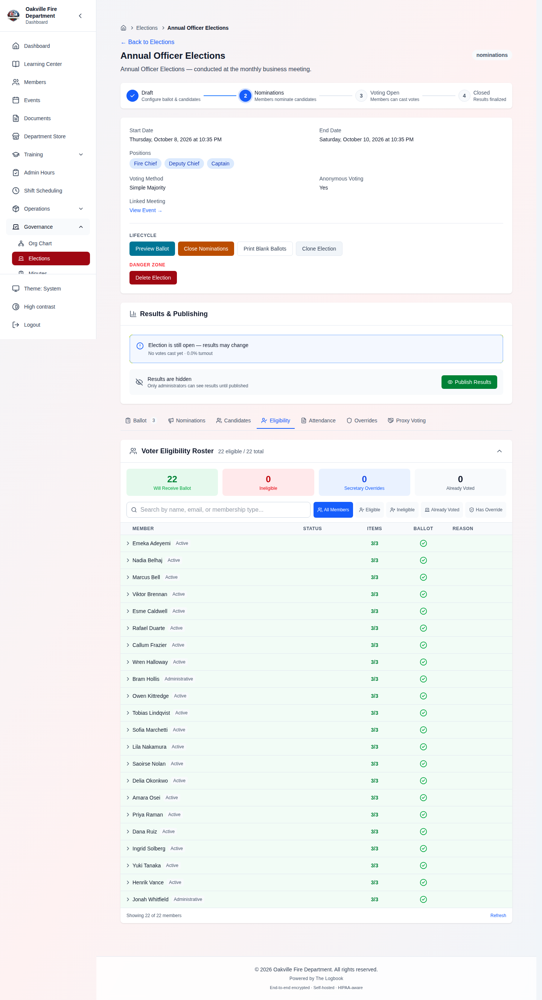

### Edge Cases

| Scenario                                                               | Behavior                                                                                                                                                         |
| ---------------------------------------------------------------------- | ---------------------------------------------------------------------------------------------------------------------------------------------------------------- |
| Member not on attendance list                                          | Ineligible unless override granted                                                                                                                               |
| Override granted, then member's standing changes                       | Override persists regardless                                                                                                                                     |
| Bulk override for remote voters                                        | Use bulk override endpoint to add multiple members                                                                                                               |
| Life member, on an **operational** item                                | **Not** eligible — `operational` requires regular standing. They receive `regular` and `life` items                                                              |
| Life member, on a **regular** item                                     | **Eligible** _(changed 2026-08-26)_ — the old fused field could not put them in both                                                                             |
| Probationary member, on an **operational** item                        | **Not** eligible; they receive `probationary` items                                                                                                              |
| Administrative member with regular standing, on a **regular** item     | **Not** eligible _(tightened 2026-08-26)_ — status categories now also require the operational class                                                             |
| Administrative member holding an operational role                      | **Not** eligible for operational items — the class decides, not the role                                                                                         |
| Member on an org-configured tier (e.g. `senior`)                       | Matches no class and no status; eligible for `all` only — deliberate, since the tier satisfied neither category before the split                                 |
| Member with **nothing** recorded (no class, status or membership type) | **Treated as operational + regular** — an empty value resolves to the defaults, so they do receive both those ballots. Not the same as the custom-tier row above |

---

## The Pre-Meeting Package

**Required Permission:** `elections.manage`

Before an annual or special meeting, generate a **pre-meeting package** — a
print-ready PDF the membership or leadership can review ahead of time. From
the election detail page (draft or open elections), open **Pre-Meeting
Package** in the Communication section.

The package contains:

- The linked meeting's details and **agenda** (when the election is linked to
  a meeting record)
- The election configuration: voting window, voting method, victory
  condition, quorum requirement, proxy-voting availability, runoff settings
- A **ballot preview**: every ballot item in order with its eligibility
  restrictions, plus the nominated candidates and their statements
- The **voter-eligibility roster**: summary counts and the eligible-voter
  name list

### Two privacy variants

| Variant    | Contents                                                    | Intended audience          |
| ---------- | ----------------------------------------------------------- | -------------------------- |
| **Member** | Eligible-voter names + counts only                          | General membership mailing |
| **Full**   | Adds per-member ineligibility reasons and granted overrides | Leadership / board prep    |

> **Privacy note:** ineligibility reasons expose individual members'
> membership tier and attendance shortfalls. Keep the full variant to
> leadership; the member variant exists precisely so those details aren't
> broadcast department-wide.

### Sending it

1. Click **Pre-Meeting Package**
2. Prefill the recipient list from **Leadership** or **All eligible voters** —
   then edit it freely: remove anyone, or add outside addresses (board
   counsel, the district office, a member's personal email)
3. Choose the variant (the full-roster checkbox defaults on for leadership
   prefills), add an optional message, and send — recipients are **BCC'd**
   so addresses aren't exposed to each other

### Or just download it

Use the **Preview PDF** links (or `GET /elections/{id}/package-pdf`) to
download either variant without sending anything — attach it to your own
email, print it for the meeting, or file it with the minutes. Sends and
downloads are both audit-logged.

---

## Opening an Election

**Required Permission:** `elections.manage`

When the election is ready:

1. Review all ballot items and candidates
2. Click **Open Election** — status changes from Draft to Open, and the voter roll is frozen (see below)
3. Opening sends no ballots. Send them yourself with **Send Ballot Emails** (see Ballot Distribution) — a scheduled opening (**Open Automatically at Start Time**) does not send them either
4. Once the ballots are out, voters can cast their votes via the in-app interface or the email ballot link

> **Hint:** Send a **test ballot** to yourself first (`POST /elections/:id/send-test-ballot`) to verify the email rendering and voting link before sending to all members. Votes cast from a test ballot are flagged as test votes — they are excluded from results, statistics, and rosters, and they never consume your real vote.
>
> **Known gap (2026-09-30):** Election Settings offers test ballots for **draft** elections only, and the emailed test link for a draft answers "Election is draft" — the ballot page opens only for an election that is open. You can check the email itself, but not vote through the link, until the election is open. Recorded as an open owner decision in `docs/KNOWN_LIMITATIONS.md`.

### Ballot Distribution

When you click **Send Ballots**, the system:

1. Identifies all eligible voters (respecting tier, attendance, and override rules)
2. Generates a unique voting token per voter — the token records which ballot items (and, for positional elections, which positions) that voter is eligible for, and this is enforced again when the ballot is submitted (a voter cannot vote on restricted items or positions even by crafting the request manually)
3. Sends an email with a link to the public ballot page (`/ballot#token=...` — the token rides in the URL fragment, which browsers never send to any server, so the credential stays out of access logs; the page also removes it from the address bar once loaded)
4. Reports how many ballots were sent and which members were skipped (with reasons)

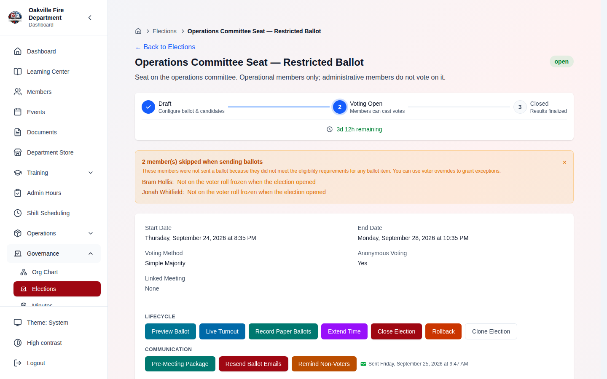

Two things report the result. A **toast** gives the counts — "Ballots sent to N
voter(s)", plus "M failed" and "M skipped (see banner below)" when either
applies — and it disappears. A **banner** stays on the page and names each
skipped member with the reason, which is the part you act on.

**What the ballot email needs, and when it says so** _(2026-09-30)_:

- **Ballot emails need ballot items.** The emailed ballot page votes on ballot
  items only, and the ballot is locked once voting opens. An election built
  from positions and candidates alone — as the create form offers — can be
  voted on in the app but can never be emailed. **Send Ballot Emails** is then
  disabled, and the page now says why in text beside it: _"Ballot emails need
  ballot items, and the ballot cannot change while voting is open. Members can
  vote in the app."_ (it was a hover tooltip a phone or screen reader never
  showed). A locked, empty ballot says the same. Nothing warns before **Open
  Election**, so add at least one ballot item first if you mean to email
  ballots (open owner decision, `docs/KNOWN_LIMITATIONS.md`).
- **A draft cannot be mailed.** Sending ballots is refused for a Draft or
  Nominations election ("Ballot emails cannot be sent for a draft election")
  except as a test ballot; it was already refused once closed or cancelled.
- **The send summary tells the truth about its own email.** The line about the
  eligibility summary emailed to you now reports whether that email actually
  went ("The eligibility summary email could not be sent"), where it used to
  claim it was sent with email switched off.
- **A test ballot looks like one.** Its subject starts **[TEST]**, the mail
  carries a test stamp, and its receipt says _"This was a test vote. It was
  recorded but is not counted toward the election results."_ Sending a test
  ballot does not mark the election's ballots as sent.

> **Hint:** Ballot links are built from the server-configured `FRONTEND_URL`, not the address of the request that triggers the send. Your administrator should set `FRONTEND_URL` to the department's real public site URL (e.g. `https://app.yourdept.org`) so members receive working ballot links — if it is misconfigured, the emailed link points to the wrong host even though the send still reports success. _(2026-09-24)_ In production, a `FRONTEND_URL` still pointing at `localhost` logged a warning at backend startup. _(2026-09-25)_ It now stops a production backend from starting at all (`CRITICAL: FRONTEND_URL ...`), so a server that is up is not using a `localhost` value — but ask your administrator to confirm it is the address members actually use before election night.

### Edge Cases

| Scenario                                                     | Behavior                                                                                                                                                 |
| ------------------------------------------------------------ | -------------------------------------------------------------------------------------------------------------------------------------------------------- |
| Member without email address                                 | Skipped during send; reason logged                                                                                                                       |
| Ballot sent to member who already voted                      | Second submission is rejected — votes are never overwritten (double-vote prevention is enforced at the database level)                                   |
| Member with zero eligible ballot items                       | Skipped during send (no empty ballot); reason shown in the send summary                                                                                  |
| Election opened without ballot items or candidates           | Cannot open — at least one accepted candidate or one ballot item is required                                                                             |
| Election opened with candidates but no ballot items          | Members vote in the app; ballot emails can never be sent for it (the ballot is locked once open) — see above                                             |
| A member checked in at the meeting after the election opened | Recorded as present, but **cannot vote**: the roll froze at opening. The Attendance tab says so while voting is open; add a voter override to admit them |

### Voter-Roll Freeze

Opening an election **snapshots the eligible voter roster**. From that moment,
mid-election membership changes (status flips, tier edits) can no longer change
who may vote or the turnout denominator — the roll is fixed, like a printed
sign-in sheet. Secretary **overrides still admit** members after open (that's
their purpose). Elections opened before this feature (no snapshot) evaluate
eligibility live, as before.

### Printable Ballot PDF

Running a paper vote in the room? **Download Printable Ballot**
(`GET /elections/{id}/printable-ballot`) generates the official blank paper
ballot straight from the election setup: positions in ballot order, accepted
candidates, write-in lines where allowed, and method-specific voter
instructions. Print it, hand it out, then enter the tallies via
[Paper Ballots & Attestation](#paper-ballots--attestation).

---

## Reminders & Lifecycle Automation

> Reminders require the **Reminders** feature toggle; scheduled opening
> requires the **Auto-Open** toggle (both on by default).

The `election_lifecycle` background task runs every 15 minutes and automates
the routine timing work:

| Automation                | Trigger                                                                                   | Opt-in?                                                                                                                                                  |
| ------------------------- | ----------------------------------------------------------------------------------------- | -------------------------------------------------------------------------------------------------------------------------------------------------------- |
| **Auto-close**            | An open election passes its end date                                                      | No — always on. Closing runs result finalization, runoff evaluation, and the anonymous-election privacy purge, so an overdue election is never left open |
| **Auto-open**             | A draft election with **Open Automatically at Start Time** enabled reaches its start date | Yes (`auto_open` on the election)                                                                                                                        |
| **Nomination auto-close** | The nomination deadline passes                                                            | Automatic when a deadline is set                                                                                                                         |
| **Automatic reminder**    | The configured **Auto-Remind Non-Voters** window before close opens                       | Yes (`reminder_hours_before_close`)                                                                                                                      |

### Reminding Non-Voters Manually

From the election detail page, **Remind Non-Voters** sends a reminder ballot
email — with a fresh voting link — to eligible voters who have **not** voted.
The list is recomputed server-side at send time, so members who already voted
are never contacted.

- **One-hour cooldown** per election (manual or automatic) — a double-click
  can't spam the membership
- A reminder **replaces the earlier ballot link**: the mail is titled
  "Reminder: vote in <election>", and an older link opened afterwards says it
  was replaced by a newer ballot email
- Each reminded member's **older unused links are expired only once the new
  email is confirmed handed to the mail server** — a bounce leaves the old
  link working, so nobody is stranded with zero live ballots
- Exactly **one automatic reminder** is ever sent; any manual reminder
  suppresses it (both stamp `reminder_sent_at`)
- Double-vote prevention is unaffected: no matter how many live links a
  member holds, the vote dedup rules allow only one ballot

---

## Casting Votes

### In-App Voting (Authenticated)

1. Navigate to **Elections** and open the active election
2. Review each ballot item and the candidates
3. Select your choice for each position (or your approvals/rankings for approval and ranked-choice elections)
4. Click **Submit Vote** — for approval and ranked-choice elections all of your selections for the position are submitted together, atomically
5. Your vote is confirmed on screen. A **receipt** you can verify later comes with the emailed ballot (see below); the in-app tab does not show one

### Email Ballot Voting (Token-Based)

1. Open the ballot email from your department
2. Click the voting link
3. The public ballot page loads with your ballot items — you only see the items (and positions/candidates) you are eligible to vote on
4. Select your choices. The ballot adapts to the election's voting method: radio buttons for single-choice, **checkboxes** for approval and multi-vote elections (select every candidate you support, up to any cap), and **rank dropdowns** for ranked choice (1 = first preference; each rank can be used once)
5. Click **Submit** — no login required; the token authenticates you. The confirmation screen shows your vote receipts — save them if you want to verify your votes later

> **No screenshot of this page _(2026-08-12)_.** Not because it is unfinished —
> the page works — but because reaching it needs a live voting token, and the
> system deliberately keeps those out of reach. A token is generated once,
> handed straight to the outgoing email, and stored only as a hash, so nobody
> with database access (including our screenshot tooling) can recover a working
> link. That is the property that makes an emailed ballot safe to send. See
> [KNOWN_LIMITATIONS.md](../KNOWN_LIMITATIONS.md#elections--the-public-ballot-cannot-be-screenshotted-by-design-2026-08-12).

### Bulk Voting

For elections with multiple ballot items, votes can be submitted atomically using bulk vote — all positions submitted in a single request.

### Edge Cases

| Scenario                                                  | Behavior                                                                                                                                                  |
| --------------------------------------------------------- | --------------------------------------------------------------------------------------------------------------------------------------------------------- |
| Voter tries to vote twice for the same candidate/position | Rejected (enforced at the database level); approval voters may still add approvals for _different_ candidates, and ranked-choice voters one vote per rank |
| Voter tries to vote on a restricted ballot item           | Rejected at submission — eligibility is enforced server-side, not just hidden in the UI                                                                   |
| Token expired                                             | Tokens expire at the election end date (or after 30 days, whichever is sooner); the secretary can re-send the ballot                                      |
| Write-in candidate name matches existing candidate        | Recorded as separate write-in entry                                                                                                                       |
| Ranked choice with incomplete ranking                     | Only ranked candidates counted; unranked treated as not preferred                                                                                         |
| One vote in a bulk submission fails                       | The entire submission is rolled back — no partial ballots                                                                                                 |

---

## Paper Ballots & Attestation

> Requires the **Paper Ballots** feature toggle (on by default).

For in-room votes counted by hand, officers enter the paper tally directly —
and a configurable number of _other_ officers must confirm the counts before
they count toward results.

### Recording a Paper Tally

**Required Permission:** `elections.manage`

1. Print ballots with **Download Printable Ballot**, run the room vote, and
   count the papers
2. On the open election, click **Record Paper Ballots**
3. Enter the per-candidate counts (and optional notes — e.g., "counted by
   Lt. Reyes and FF Park, 2 spoiled ballots discarded")
4. Submit — one vote row is stored per paper ballot, flagged as manual and
   attributed to you as the recording officer

Because paper votes are ordinary vote rows, a closed election's results carry
no separate "paper" figure — the paper votes are simply in the counts. What
stays itemized after the close is the **Paper-Ballot Batches** panel (below):
who recorded each batch, when, and which officers attested it.

Manual votes carry no voter identity and no dedup hash — the recording
officer's attested count is the source of truth — but they **are** signed and
chained exactly like electronic votes, so the integrity check covers the full
mixed ballot box. The vote signature also covers the manual flag, so a stored
paper vote can't be silently re-labeled as electronic (or vice versa).

**Plausibility guard:** a batch that would push a position past _eligible
voters × allowed votes_ is rejected before a single vote row is written, with
the projected total, the eligible count and the cap spelled out. The multiplier
is the number of votes one member may legitimately cast: under approval voting
it is the number of accepted candidates for the position, otherwise the
election's votes-per-position setting. The optional **Physical ballots in this
stack** field has no multiplier — one member hands in one sheet — so it is
checked against the eligible count directly. If the count really is correct
(e.g., overrides admitted extra voters), the override checkbox — **The tally
is correct — override the eligible-voter count check** — records it anyway,
audited at warning severity and naming who overrode it.

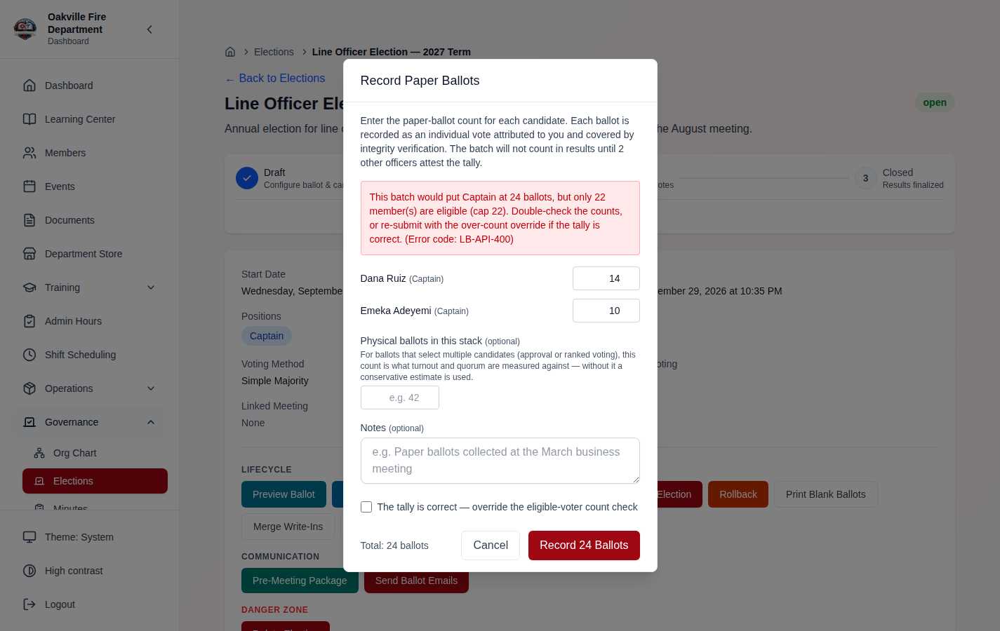

The override checkbox is not on the form until the guard has fired — there is
no way to switch the check off in advance, and nothing is written when a batch
is refused.

### Officer Attestation

By default, **2 officers other than the recorder** (configurable 0–3 in
Election Settings → Features) must attest each batch before its votes count:

1. A recorded batch starts **Pending** — its votes are stored, signed, and
   chained immediately, but excluded from results, statistics and the vote
   count on the elections list
2. Officers with `elections.manage` open the **Paper-Ballot Batches** panel and
   click **Attest** after checking the entered counts against the physical tally
3. The recorder can never attest their own batch, and each officer counts
   once (enforced at the database level)
4. When the requirement is met, the batch flips to **Confirmed** and its
   ballots count

Each batch snapshots the requirement at record time, so changing the setting
later never silently confirms or un-confirms old batches. A disputed batch is
**voided** with a reason (soft delete — the record remains). Attestation is
only possible while voting is open: a batch still pending at close stays out
of the certified results, and the close writes a warning
`election_manual_ballots_unattested_at_close` audit event.

The panel is on the election page itself, above the tab strip — not inside a
tab — and appears as soon as one batch exists.

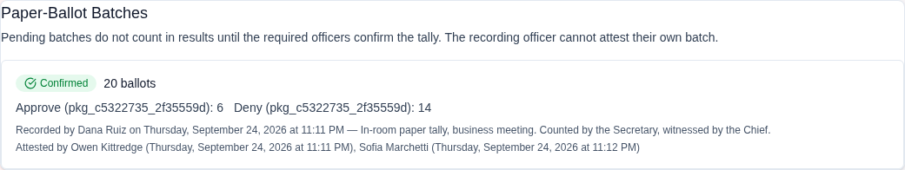

**Attest and Void are only offered while voting is open**, so a batch
photographed after the close carries its trail and no buttons.

### Edge Cases

| Scenario                                           | Behavior                                                                                                                                                                                                                                                                                                                                                                                                                      |
| -------------------------------------------------- | ----------------------------------------------------------------------------------------------------------------------------------------------------------------------------------------------------------------------------------------------------------------------------------------------------------------------------------------------------------------------------------------------------------------------------- |
| Typo: 40 votes entered for a 4-vote race           | Rejected by the plausibility guard; over-count checkbox appears only after the guard fires                                                                                                                                                                                                                                                                                                                                    |
| Recorder clicks Attest on their own batch          | Rejected — attestation requires a _different_ officer                                                                                                                                                                                                                                                                                                                                                                         |
| Setting changed from 2 to 0 after batches recorded | Existing pending batches still require their snapshotted 2 attestations                                                                                                                                                                                                                                                                                                                                                       |
| Election closed with a batch still pending         | Batch excluded from certified results; warning audit event written. _(2026-08-12)_ The exclusion now also covers the close path's own arithmetic: a pending batch's votes cannot decide which candidates advance to a **runoff** and cannot flip a **membership-approval** package to elected/not elected. Before this fix an unattested batch was invisible in the published results yet still counted in those two outcomes |
| A batch reaches Confirmed before close             | Its votes count everywhere — results, runoff advancement, and package outcomes. Exclusion applies only while the batch is Pending (or, via its votes' soft-delete, Voided)                                                                                                                                                                                                                                                    |
| Mis-keyed batch already attested                   | Void the batch (reason required) and re-record                                                                                                                                                                                                                                                                                                                                                                                |
| Attestation requirement set to 0                   | Batches confirm immediately on recording (not recommended)                                                                                                                                                                                                                                                                                                                                                                    |

---

## Proxy Voting

When enabled for the organization, proxy voting allows one member to vote on behalf of another who cannot attend.

**Required Permission:** `elections.manage` (to authorize)

### Authorizing a Proxy

1. Open the election detail page
2. Navigate to **Proxy Authorizations**
3. Click **Authorize Proxy**
4. Select the **delegating member** (who can't attend)
5. Select the **proxy holder** (who will vote for them)
6. Save — nothing is sent at this point. When ballots go out, the proxy holder is **Cc'd on the delegating member's ballot email** (their own ballot email is separate)

### Casting a Proxy Vote

> **Not built _(2026-08-12)_.** This section described a flow that does not
> exist. Proxies can be **configured** — the Proxy Voting panel on the election
> detail page assigns them and caps how many one member may hold — but there is
> no way to cast a vote as one. There is no "Vote as Proxy" button, no
> "Voting as proxy for…" banner, and no proxy mode on the ballot anywhere in the
> application. Until that is built, a member who cannot attend should be sent an
> email ballot instead. See
> [KNOWN_LIMITATIONS.md](../KNOWN_LIMITATIONS.md#elections--proxy-voting-has-an-admin-panel-but-no-ballot-mode-2026-08-12).

### Edge Cases

| Scenario                                    | Behavior                                                                                                                                                                                 |
| ------------------------------------------- | ---------------------------------------------------------------------------------------------------------------------------------------------------------------------------------------- |
| Max proxies per person exceeded             | Refused. The default limit is 1 proxy per holder, configurable from 1 to 10 in Election Settings — enforced since 2026-09-30; before that the cap was stored and shown but never checked |
| Delegating member also votes directly       | Whichever vote is cast first stands; the second attempt (proxy or direct) is blocked by double-vote prevention                                                                           |
| Proxy authorization revoked after vote cast | Vote stands; revocation prevents future proxy votes only                                                                                                                                 |

---

## Monitoring & Results

### During Voting (Election Open)

If **results_visible_immediately** is enabled:

- Real-time vote counts displayed on the election detail page
- Non-voters list shows who hasn't voted yet

If results are hidden until close:

- Only total votes cast is shown (not per-candidate counts)

### After Closing (Election Closed)

**Required Permission:** `elections.manage` (to close)

1. Click **Close Election** and confirm in the dialog — the buttons read **Close election** / **Keep it open**, and it warns that voting ends immediately and cannot be undone _(2026-08-11: this is now an in-app dialog rather than a browser popup, so it cannot be silently suppressed by the browser)_. Closing early (before the scheduled end date) is fully supported — runoff conditions are still evaluated and membership-approval results still flow back to the pipeline. The close records **who closed the election and when**; the certified results PDF and the report print that instant and officer, and an automatic close at the scheduled end is shown as such
2. Results are calculated and displayed:
   - Per-position winner (or "No winner" if the victory condition wasn't met)
   - Vote counts per candidate
   - Write-in tally
   - Turnout statistics (turnout counts only voting-eligible members — tiers marked not voting-eligible are excluded from the denominator)

> **Note on early closes:** results stay gated until the election's scheduled end date has passed — for everyone, including the officer who closed it (an open owner decision, 2026-09-30). The Results tab says when: _"Voting is closed. Results will be available after the scheduled end, …"_. If you close early and want results seen right away, press **Publish Results** on the closed election's **Results & Publishing** panel. Internal processes like runoff creation and the emailed report are not affected by the gate.

**The Results & Publishing panel** _(changed 2026-09-30)_ appears once the
election is open. **Publish Results** / **Hide Results** is offered only on a
closed election — while voting is open the panel reads _"Results can be
published once voting closes"_, where it used to offer a switch the server
refused. **Email Results Report** (_"Email the results report to the election
secretary"_, button **Send Report**) appears only once closed; the server now
refuses the report while the election is open, where it used to mail a
mid-vote tally headed "has been closed … official report".

**What the results, the report and the certified PDF now show** _(2026-09-30)_:

- **Every ballot item's outcome.** A motion's or membership vote's Approve/Deny
  tally and result were reported nowhere — the Results tab, the report email
  and the certified PDF showed position races only. Each item is now reported
  with its own label and percentages.
- **Ties are named.** A tied race's report printed two 50% rows and never said
  "tie"; it now prints "Tie — co-winners per policy" or "Tie — runoff round
  created".
- **"Quorum Met" only where there is a quorum.** An election with no quorum
  requirement now reads "No quorum requirement" on the report and PDF, and the
  Results tab no longer asserts quorum for it.
- **Who closed it, and when.** The close is recorded with the officer and the
  exact time; the certified PDF reads, for example, "Election closed
  2026-09-30 06:53 CDT by Sam Ortiz", and a scheduled close reads as automatic.
  Elections closed before this change show the scheduled end and "Automatic
  close".
- **Recipient facts from the real send.** The report's ballot-recipient count
  and list come from the last send or reminder, and "Ballots were not emailed
  for this election" when none went.

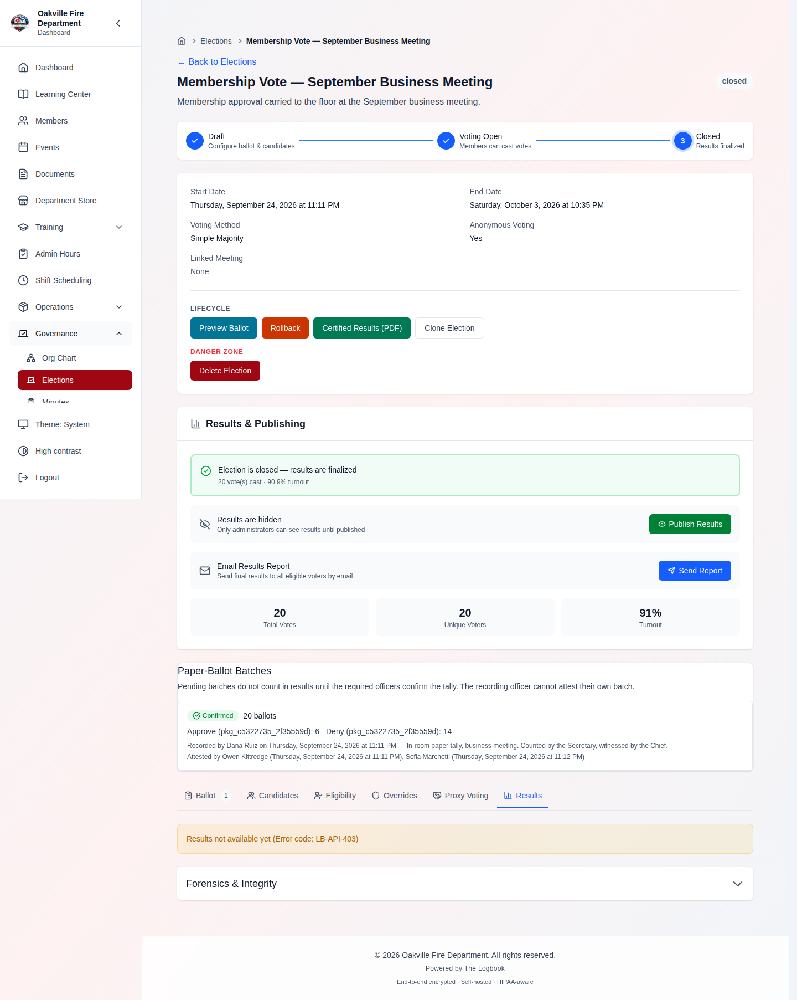

### Live Turnout Dashboard

On meeting night, open the **Live Turnout** panel on an open election — a
fullscreen-capable display designed to project in the room:

- Ballots received vs. eligible voters, with quorum progress when configured
- Auto-refreshes on its own — no reloading between agenda items
- **Never shows candidate tallies** before close — participation only, so
  projecting it can't influence the vote

### Non-Voters Report

Navigate to the **Non-Voters** section to see eligible voters who did not participate. Use this for:

- Follow-up reminders (if election is still open) — or use **Remind
  Non-Voters** to email them a fresh ballot link directly (see
  [Reminders & Lifecycle Automation](#reminders--lifecycle-automation))
- Turnout analysis (after close)

**Members who voted by emailed link are counted as voters** _(2026-09-30)_.
On a named (non-anonymous) election, a member who voted by link used to stay
on the non-voters list and receive "you have not yet voted" reminders, and
turnout undercounted them.

---

## Tie Handling

Each election has a **tie policy** that controls what happens when candidates
tie under the victory condition:

| Policy                          | On a tie                                                                 |
| ------------------------------- | ------------------------------------------------------------------------ |
| **Co-winners** (legacy default) | All tied candidates are flagged as winners                               |
| **Runoff**                      | No winner declared; the tie is flagged for a runoff round                |
| **Revote**                      | No winner declared; the position is flagged for a fresh vote             |
| **Chair decides**               | No winner declared; the presiding officer breaks the tie per your bylaws |

For every policy except co-winners, the results clearly flag the tie, no
winner is declared for the position, and an `election_tie_detected` audit
event is written at close. Set the policy on the election form to match what
your bylaws prescribe _before_ opening — deciding a tie-breaking rule after
seeing the tally is exactly the argument this feature prevents.

---

## Write-In Consolidation

Write-in votes arrive with whatever spelling the voter typed — "J. Smith",
"John Smith", and "Jon Smith" tally as three candidates. After voting (and
before certifying), consolidate them:

1. On the election detail page, open **Merge Write-Ins**
2. Select the variant entries and the candidate they should count under
3. Confirm — results now tally all variants under the target candidate

The merge is **alias-based**: signed vote rows are never modified (each vote's
signature covers its original candidate), so the integrity check still passes.
The merge itself is audited, and results simply re-map the merged candidates
at tally time.

---

## Runoff Elections

When **Enable Runoffs** is on and no candidate meets the victory condition at close (including early closes):

1. The system automatically identifies candidates for the runoff — **top two** advance, or **eliminate lowest** drops the last-place candidate, depending on the configured runoff type
2. A **runoff election** is created as a child of the original, in Draft status, with write-ins disabled. It inherits the original's quorum, position eligibility rules, meeting/event link, attendees, and voter overrides — and gets a fresh anonymity salt of its own
3. The **Runoff Chain** view shows the progression: Original → Runoff 1 → Runoff 2 (if needed), up to the configured maximum rounds
4. Each runoff follows the same voting workflow. To run it on the spot, just open it — **opening an election starts voting immediately**, even if the scheduled start (default: one hour out) hasn't arrived. To set a defined window first (e.g. a 15-minute floor vote), use **Edit Dates** on the draft

> **Hint:** Draft elections — runoffs included — have an **Edit Dates** button with Start Now and 15-min/30-min/1-hour quick durations. And an election whose end date has already passed can't be opened until its dates are updated.

### Edge Cases

| Scenario                       | Behavior                                                                                                                                                                                                                                               |
| ------------------------------ | ------------------------------------------------------------------------------------------------------------------------------------------------------------------------------------------------------------------------------------------------------ |
| Tie in runoff                  | Another runoff created; continues until resolved                                                                                                                                                                                                       |
| Runoff's own settings          | Since 2026-09-30 a runoff keeps the original's **tie policy** (it used to reset to co-winners), its description names the tie or shortfall that caused it, and it copies the original's candidate-selection ballot items so its ballots can be emailed |
| All candidates below threshold | Runoff with all candidates                                                                                                                                                                                                                             |
| Runoffs disabled               | Election closes without a winner; secretary handles manually                                                                                                                                                                                           |

---

## Vote Integrity & Forensics

The elections module includes cryptographic integrity features for audit compliance.

### Vote Receipt Verification

Each vote generates a cryptographic **receipt hash** that:

- Is returned to the voter when they submit their ballot (shown on the confirmation screen — voters should save it)
- Proves the vote was recorded
- Does NOT reveal which candidate was selected
- Can be verified by anyone holding the receipt via `GET /elections/{id}/verify-receipt?receipt=...` (public, rate-limited — returns only the vote's timestamp and position)

### Forensics Report

**Required Permission:** `elections.manage`

Access the **Forensics** tab on the election detail page for:

- **Integrity Check** — Verifies HMAC-SHA256 signatures on all votes (detects tampering)
- **Soft-Deleted Votes** — Shows any votes that were manually removed with reason and who removed them. On an anonymous election the removed vote's choice is not shown _(since 2026-09-30)_ — together with the audit trail it named the voter's candidate
- **Rollback History** — If the election status was ever rolled back (e.g., reopened after closing)
- **Anomaly Detection** — Flags unusual patterns: a thresholded list of IPs with suspiciously many votes (a full per-IP vote map is deliberately not exposed — it could de-anonymize voters in a small department), a distinct-IP count, and rapid-fire voting via the timeline

> **Privacy note:** for anonymous elections, per-vote IP and user-agent data is **erased when the election closes** (at the same moment the anonymity salt is destroyed). Run any IP-based investigation while voting is open — after close that data no longer exists, by design. Voting tokens are also stored only as SHA-256 hashes, so database access never reveals usable ballot links.

The panel is a collapsed accordion at the bottom of the election page, and the
integrity check inside it runs only when you press **Run Check** — it is a
deliberate act, not something computed on every page load.

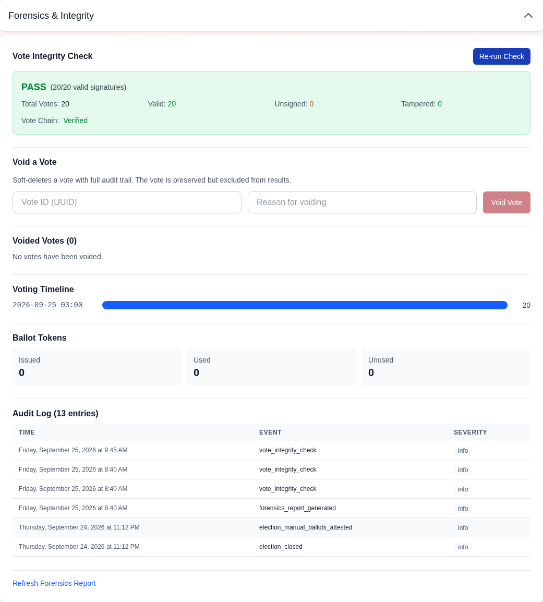

> **Fixed 2026-08-12.** Neither half of this panel worked. `GET /forensics`
> and `GET /integrity` both returned 500s from response validation — the
> forensics report because `AuditLog.id` is an integer where the schema
> declared a string, so any election with an audit trail (that is, any
> election) failed; the integrity check because its response model described
> an entirely different set of fields from the ones the service returns and
> the UI reads.

### Edge Cases

| Scenario                      | Behavior                                                                                                                                                                                                                                                                                                                                                                                                                                                                       |
| ----------------------------- | ------------------------------------------------------------------------------------------------------------------------------------------------------------------------------------------------------------------------------------------------------------------------------------------------------------------------------------------------------------------------------------------------------------------------------------------------------------------------------ |
| Vote signature mismatch       | Flagged in forensics report; does not auto-delete vote                                                                                                                                                                                                                                                                                                                                                                                                                         |
| Secretary deletes a vote      | Soft-delete with reason required; audit trail preserved. The member may then vote again (since 2026-09-30 — both voting routes used to fail with a server error), and their old receipt reads "This vote was voided by an officer". **Known gap:** an officer's own void currently makes **Run Check** report "Vote Integrity Issue Detected" and the certified PDF print CHAIN_BROKEN — expected after a void until the chain design is settled (`docs/KNOWN_LIMITATIONS.md`) |
| Election reopened after close | Rollback logged in forensics; leadership notification sent. **Not allowed** for anonymous elections that already have votes — the anonymity salt is destroyed at close, so reopening would let prior voters vote again. Create a new election instead                                                                                                                                                                                                                          |

---

## The Certified Results Package

**Required Permission:** `elections.manage`

Once an election is **closed**, download the **Certified Results package**
(`GET /elections/{id}/certified-results`) — a formal PDF built for the minutes
book and for anyone who asks "prove it":

- Final tallies per position with winners (or flagged ties, per the tie policy)
- Turnout and quorum figures against the frozen voter roll
- The **paper-batch attestation trail** — every batch with its recorder,
  attesting officers, and status
- The **integrity verification result** run at generation time
- Officer **signature lines** for wet-ink certification

File the signed copy with the meeting minutes; the PDF plus the forensics
report is your complete dispute-defense package.

---

## Election Settings

**Required Permission:** `elections.manage`

Navigate to **Elections > Settings** to configure proxy voting, optional
features, and test ballots:

| Setting                | Default | Description                                                                                                 |
| ---------------------- | ------- | ----------------------------------------------------------------------------------------------------------- |
| Proxy Voting Enabled   | Off     | Whether proxy voting is available                                                                           |
| Max Proxies Per Person | 1       | How many members one person can represent — 1 to 10, enforced when a proxy is authorized (since 2026-09-30) |

There are no organization-wide election defaults: voting method, victory
condition, quorum, anonymity and write-ins are chosen on each election's own
form when it is created.

### Feature Toggles

The **Features** section lets each department turn the optional workflows on
or off (all on by default; enforced server-side, not just hidden in the UI):

| Toggle                             | Default | Controls                                                                |
| ---------------------------------- | ------- | ----------------------------------------------------------------------- |
| Nominations                        | On      | The nomination phase and member nominations                             |
| Paper Ballots                      | On      | Officer paper-tally entry                                               |
| Reminders                          | On      | Manual **and** automatic non-voter reminders                            |
| Auto-Open                          | On      | Scheduled opening of flagged draft elections                            |
| Paper-Ballot Attestations Required | 2       | Officers (besides the recorder) who must confirm each paper batch (0–3) |

Deliberately **not** toggleable: automatic closing at the end date and the
nomination-deadline auto-close. Closing finalizes results and runs the
anonymous-election privacy purge — a privacy guarantee, not a convenience —
and an in-flight nomination phase must always be closeable.

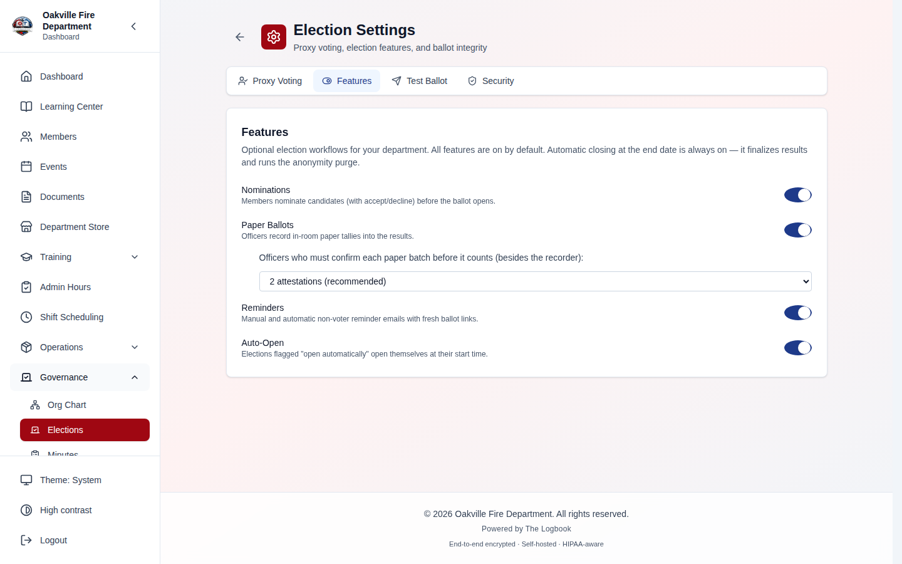

**[SCREENSHOT — REPLACE `14-16-election-settings.png`.** The **Defaults** section (default voting method, victory condition, anonymity, write-ins) was removed on 2026-09-29 because the create form never read it; its sections are now **Proxy Voting**, **Features**, **Test Ballot** and **Security**. Re-shoot the settings page so its section list no longer shows Defaults, and update the caption, which still says "default rule toggles".**]**

---

## Cloning an Election

**Required Permission:** `elections.manage`

Annual elections rarely change shape. **Clone** creates a fresh draft from an
existing election's configuration:

1. On any election, click **Clone**
2. Set the new title and dates
3. Optionally copy the accepted candidates (useful for a re-run; skip it for
   next year's election where nominations start over)
4. The clone is created in **Draft** — review, then run it like any election

What is **never** copied: votes, voting tokens, attendees, voter overrides,
and the anonymity salt (a fresh salt is generated — clones can never be
correlated with the original's voter hashes). Since 2026-09-30 the clone also
starts with results **hidden** — it used to copy a published parent's "results
visible" flag — and opens on its **Ballot** tab rather than an empty Results
tab.

---

## Meeting Attendance Integration

Elections can be linked to meetings or events. When linked:

1. **Check-in attendance** at the meeting feeds into voter eligibility
2. Members who are present are marked eligible; absent members are excluded (unless overridden)
3. Import attendees directly from the linked meeting or event using **Import Attendees**

### How to Link an Election to a Meeting

1. When creating the election, select a **Meeting** or **Event** from the dropdown
2. Or link after creation from the election detail page

> **Hint:** For annual business meetings, create the meeting first, take attendance via QR check-in, then open the election. All checked-in members automatically become eligible voters.

---

## Prospective Member Election Packages

When a prospective member reaches the **Election Vote** stage of their pipeline, an **election package** is automatically created. This package contains:

- Applicant snapshot (name, email, phone, address, documents)
- Coordinator notes
- Supporting statement (shown to voters)
- Stage history summary

### Workflow

1. Applicant advances to Election Vote stage → package auto-created
2. Coordinator reviews and marks package as **Ready for Ballot**
3. Secretary opens the election and adds the applicant as a ballot item
4. Members vote to approve or deny
5. Results flow back: package status → `elected` or `not_elected`

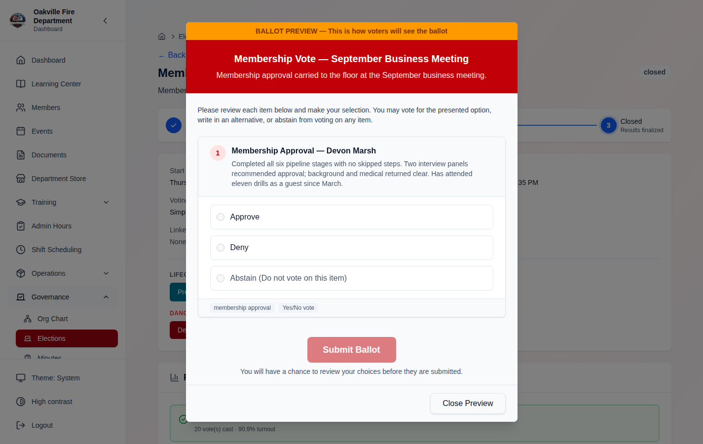

The election detail page lists the item; **Preview Ballot** is what shows it as a
voter will see it — Approve, Deny, and **Abstain (Do not vote on this item)**,
which every approval item carries. The options are inert in the preview: it is a
rendering of the ballot, not a ballot.

See [Membership Management > Prospective Members](./01-membership.md#prospective-members-pipeline) for the full pipeline workflow.

---

## What Changed After the W50 Review _(2026-09-30)_

Two browser-driven reviews ran the module end to end on 30 September 2026, one
with email switched on so every notice could be read. Most of what they fixed
is described in its own section above; this is the rest, and the list of what
is still open.

> **⚠️ Before upgrading to this release: close any election that is Open.**
> How a vote on a ballot-item election is stored and matched as a duplicate
> changed. A member who voted in the app before the upgrade could vote once
> more on the same item afterwards, and both votes would count. Draft and
> Nominations elections are unaffected; closed elections are not rewritten.
> See `docs/UPGRADING.md`.

**Fixed:**

- **Deleting an election that had sent ballots works.** It failed with a
  server error — after leadership had already been emailed "CRITICAL: Election
  Deleted". The delete now completes first and the alert goes out afterwards.
- **Anonymous elections stay anonymous to managers.** The audit trail recorded
  the voter beside the vote id on in-app votes, and the forensics list of
  voided votes named the candidate, so two reads joined a member to their
  choice. New audit rows no longer name the voter on an anonymous election, and
  voided votes no longer show the choice. Rows written before the fix still
  name the voter (`docs/KNOWN_LIMITATIONS.md`).
- **One member, one vote, whichever door they use.** On a named election a
  member could vote in the app and again from their emailed link, and both
  counted; a vote naming a ballot item could skip the item's attendance rule;
  and a vote sent without a position could be a second vote in the same race.
  All three are refused ("You have already voted for Chief", "You must be
  checked in as present at the meeting to vote on this item").
- **Print Blank Ballots** prints every approval item as "☐ Approve ☐ Deny"
  under its title, not only the position races. Paper votes on those items
  still cannot be keyed in (see Still open).
- **Results cannot be quietly rewritten by renaming.** Once a candidate has
  votes, changing their name, position or acceptance is refused ("Cannot change
  a candidate's name, position or acceptance once votes have been cast"); a
  statement edit still saves.
- **Clearing a candidate's statement** actually clears it — the old statement
  used to survive behind "Candidate updated". Statements are capped at 5,000
  characters, and a write-in name is stored exactly as typed (punctuation used
  to fail, and names rendered double-escaped).
- **Ballot and reminder emails:** a reminder is titled "Reminder: vote in …"
  and does not re-stamp the ballots as sent; the old link then says it was
  replaced by a newer ballot email. After close, an old link says "Voting has
  closed" instead of blaming the voter roll; after a reopen it tells the voter
  to ask the secretary for a new link. The ballot email no longer prints an
  empty "Meeting Date:" line, prints the timezone, and no longer says it will
  "automatically log you in".
- **Rollback alerts say what happened** to votes and links for that
  transition, instead of claiming that votes recorded after the earlier stage
  are no longer counted (they are).
- **The Pre-Meeting Package** reports eligibility per ballot item ("3 eligible
  (checked in / override), 17 not checked in") instead of "every active member
  is eligible".
- **The Eligibility Roster** reads the voter roll frozen at opening, so a
  member added after the election opened is no longer listed as "will receive
  ballot".
- **Paper-ballot batches:** a voided batch card shows who voided it, when and
  why; a pending over-count batch no longer counts toward the plausibility cap
  and blocks every later batch.
- **An empty specific-voter list means everyone**, consistently. Saving an
  election with an empty list used to refuse every in-app vote while ballot
  mails treated it as everyone. Elections saved that way before the fix keep
  the old behaviour until re-saved (`docs/KNOWN_LIMITATIONS.md`).
- **The audit log page names the officer** for each row instead of "system".
- **Using the page:** the election tabs (Ballot, Nominations, Candidates,
  Eligibility, Attendance, Overrides, Proxy Voting, Cast Vote, Results) can be
  moved between with the arrow keys, Home and End; the lifecycle stepper is
  read as "Election progress" with the current step marked, and keeps its
  labels for screen readers on a phone; a `?tab=` link no longer traps a member
  on the page (Back leaves it); clearing the linked meeting actually clears it,
  and no "Meeting link updated" toast appears when nothing changed; candidate,
  ballot-item and attendance fields are labelled, and each attendance row's
  button is named "Check in Alex Brooks".

**Still open** (each is an owner decision, recorded in
`docs/KNOWN_LIMITATIONS.md` under "Elections — Owner Decisions From the W50
Drive"):

- The in-app **Cast Vote** tab shows position races only and treats every race
  as one-choice; the emailed ballot is the complete one.
- There is no seat count — a "(2 seats)" race declares one winner.
- The emailed ballot pre-selects **Abstain** on every item; an untouched
  Submit casts no votes and uses up the link.
- Results of an election closed early stay hidden until its scheduled end
  unless published.
- A paper ballot cannot record a vote on a motion or membership item.
- Merge Write-Ins, Void a Vote and a paper-batch void still change the results
  after close and after publishing, with no revision mark.
- A proxy holder is Cc'd on the delegating member's ballot email, whose text
  says the link is the recipient's alone.
- Scheduled opening (**Open Automatically at Start Time**) sends no ballots.
- Several screen fixes found in the same review — the delete and close dialog
  wording, a close stamp on the election cards, a test-ballot banner on the
  ballot page, labels in Election Settings — were not yet merged on 4 October 2026.

---

## Realistic Example: Annual Officer Election

### Background

**Oakville Fire Department** holds its annual officer election at the December business meeting. Secretary **Sarah Kim** manages the process.

### Part 1: Setup (December 1)

Sarah creates the election:

- **Title:** "2026 Annual Officer Election"
- **Type:** Officer Election
- **Start Date:** December 15 (meeting night)
- **End Date:** December 15 (same-day vote)
- **Voting Method:** Simple Majority
- **Victory Condition:** Majority
- **Anonymous Voting:** On
- **Enable Runoffs:** On

She adds three ballot items:

- **Fire Chief** — Candidates: Lt. Morrison, Capt. Davis
- **Assistant Chief** — Candidates: Lt. Hernandez, FF Brooks, FF Kim
- **Secretary** — Candidates: FF Nguyen (unopposed), Write-ins allowed

### Part 2: Meeting Night (December 15)

1. Members arrive and check in via QR code → attendance recorded
2. Sarah links the election to tonight's meeting → 38 of 42 members present
3. She opens the election and sends ballots:
   - 38 ballots sent to present members
   - 4 skipped (absent without proxy)
4. Members vote on their phones via the ballot link in their email

### Part 3: Results

After 30 minutes, Sarah closes the election:

| Position        | Candidate          | Votes    | Result      |
| --------------- | ------------------ | -------- | ----------- |
| Fire Chief      | Lt. Morrison       | 22 (58%) | **Elected** |
| Fire Chief      | Capt. Davis        | 16 (42%) | Not elected |
| Assistant Chief | Lt. Hernandez      | 14 (37%) | → Runoff    |
| Assistant Chief | FF Brooks          | 13 (34%) | → Runoff    |
| Assistant Chief | FF Kim             | 11 (29%) | Eliminated  |
| Secretary       | FF Nguyen          | 36 (95%) | **Elected** |
| Secretary       | Write-in: FF Walsh | 2 (5%)   | Not elected |

**Fire Chief:** Lt. Morrison wins with simple majority (58% > 50%).

**Assistant Chief:** No candidate reached majority → automatic runoff between Lt. Hernandez and FF Brooks. Sarah opens the runoff immediately. After a second vote, Lt. Hernandez wins 21-17.

**Secretary:** FF Nguyen wins unopposed with 95%.

The election report is emailed to Sarah — the election secretary who created it — when the election closes (**Send Report** under **Email Results Report** on the Results & Publishing panel sends it again). She forwards it to the department herself.

---

## Troubleshooting

| Issue                                                    | Solution                                                                                                                                                                                                                                                                                     |
| -------------------------------------------------------- | -------------------------------------------------------------------------------------------------------------------------------------------------------------------------------------------------------------------------------------------------------------------------------------------- |
| Member says they didn't receive ballot email             | Check the send report for skipped members. Verify email address is on file. Re-send ballot to individual member.                                                                                                                                                                             |
| Ballot email link points to the wrong site or won't load | The emailed link is built from the server's `FRONTEND_URL` setting, not the request URL. Have your administrator set `FRONTEND_URL` to the real public site URL (_(2026-09-25)_ a `localhost` value stops a production server from starting) and re-send the ballots.                        |
| Voter gets "Token expired" error                         | Tokens expire at the election end date (or after 30 days, whichever comes first). Secretary can re-send the ballot email.                                                                                                                                                                    |
| Voter gets "not eligible to vote on" an item             | Per-item eligibility is enforced at submission. Check the Eligibility Roster; if the member should vote, grant an override and re-send their ballot (the new token picks up their updated eligibility).                                                                                      |
| Election closed accidentally                             | Use **Rollback** to reopen (requires `elections.manage`); leadership receives notification. **Exception:** an anonymous election that already has votes cannot be reopened after closing — its anonymity salt was destroyed, so reopening would permit double voting. Create a new election. |
| Candidate wants to withdraw                              | Remove candidate from ballot (only if no votes cast). If votes exist, mark as "declined" instead.                                                                                                                                                                                            |
| Proxy holder can't find proxy vote button                | Verify proxy authorization was created. Check that the election is still open.                                                                                                                                                                                                               |
| Results don't show after closing                         | If the election was closed _before_ its scheduled end date, results stay hidden until that date passes — flip **results visible immediately** on the closed election (Publish Results panel) to show them now.                                                                               |
| Vote count doesn't match attendance                      | Check for proxy votes (counted separately). Check for voter overrides (members not on attendance list).                                                                                                                                                                                      |
| Forensics shows integrity warning                        | Run full forensics report. Contact system administrator if vote signatures are invalid.                                                                                                                                                                                                      |
| Runoff not auto-created                                  | Verify **Enable Runoffs** is on in election settings. Check that the victory condition was set correctly.                                                                                                                                                                                    |
| Paper batch recorded but results don't change            | The batch is likely **Pending** attestation — check the Paper-Ballot Batches panel. It needs the configured number of other officers to attest before its votes count.                                                                                                                       |
| "Attest" button missing or rejected                      | The recorder cannot attest their own batch, each officer attests once, and attestation only works while voting is open.                                                                                                                                                                      |
| Paper tally rejected as implausible                      | The count exceeds eligible voters × allowed votes for the position. Re-check the count; if it's genuinely correct (e.g., overrides admitted extra voters), tick **The tally is correct — override the eligible-voter count check** — the override is audited.                                |
| Nominate button missing                                  | Check the **Nominations** feature toggle in Election Settings, and that the election is in the nomination phase (managers open it from a draft election).                                                                                                                                    |
| Member nominated but not on the ballot                   | Third-party nominees must **accept** the nomination first. Check the Nominations tab for pending entries; the nominee was emailed an accept/decline link.                                                                                                                                    |
| Reminder button greyed out / "sent recently"             | Reminders have a one-hour cooldown per election. Wait, or verify the **Reminders** feature toggle is on.                                                                                                                                                                                     |
| Election didn't open at its start time                   | Auto-open is opt-in: **Open Automatically at Start Time** must be enabled on the election and the **Auto-Open** feature toggle must be on. Invalid drafts (e.g., no accepted candidates) are skipped and retried — check the election for validation problems.                               |
| Member became active mid-election but can't vote         | The voter roll is frozen at open. Grant a secretary override to admit them — that's the sanctioned path onto a frozen roll.                                                                                                                                                                  |
| Tie shown with no winner declared                        | Working as configured: any tie policy other than co-winners flags the tie for your bylaws process (runoff, revote, or chair decision) instead of declaring winners.                                                                                                                          |
| Write-in variants splitting the vote count               | Use **Merge Write-Ins** to consolidate spelling variants under one candidate before certifying. The merge is audited and never edits vote rows.                                                                                                                                              |

---

**Previous:** [Medical Screening](./13-medical-screening.md) | **Next:** [Prospective Members Pipeline](./15-prospective-members.md)
