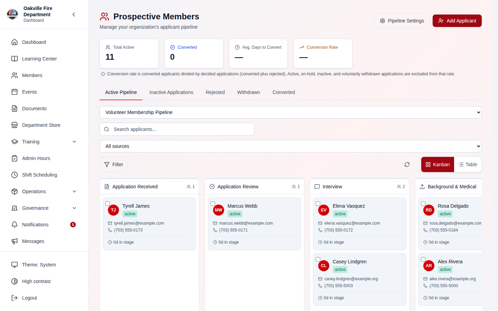
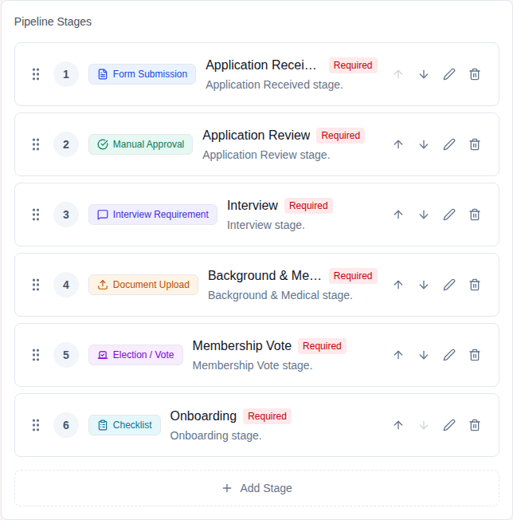
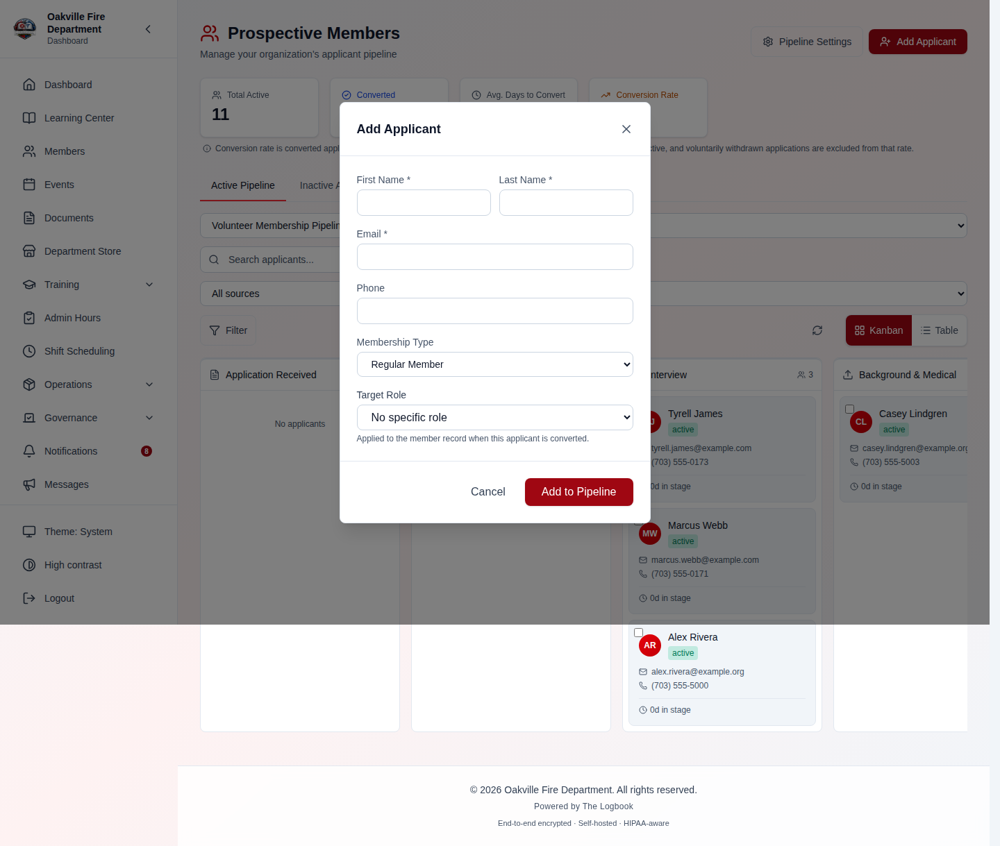
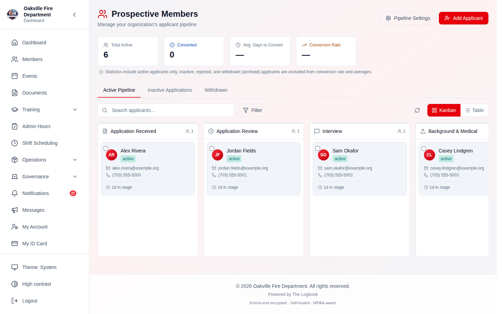
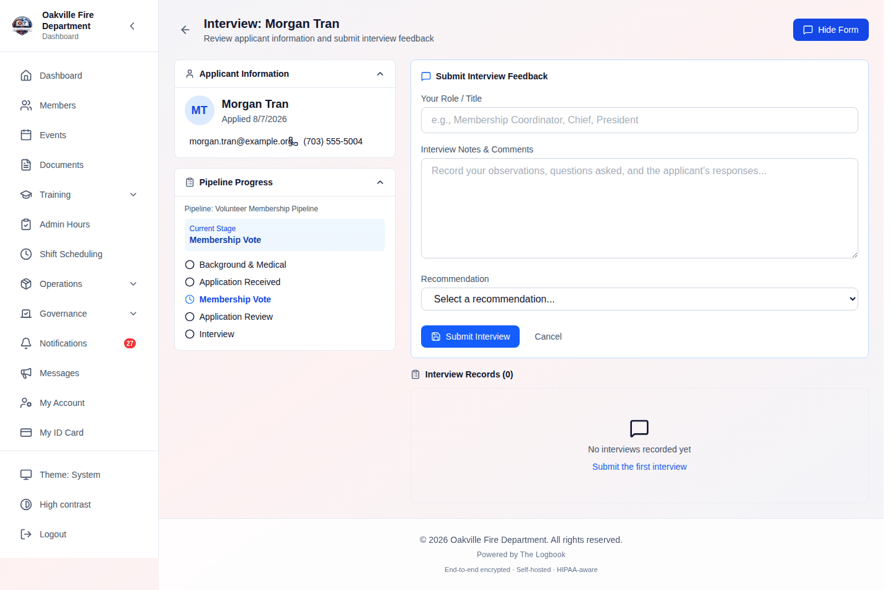
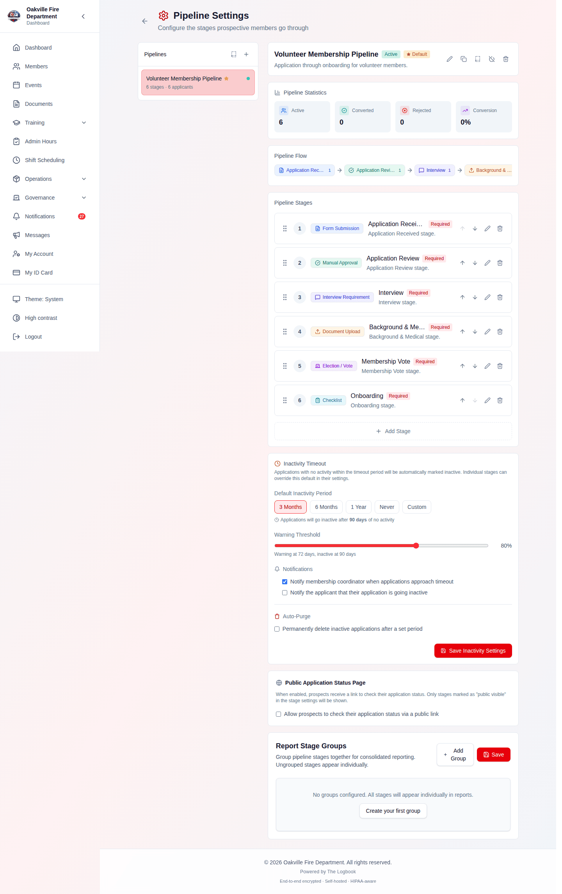
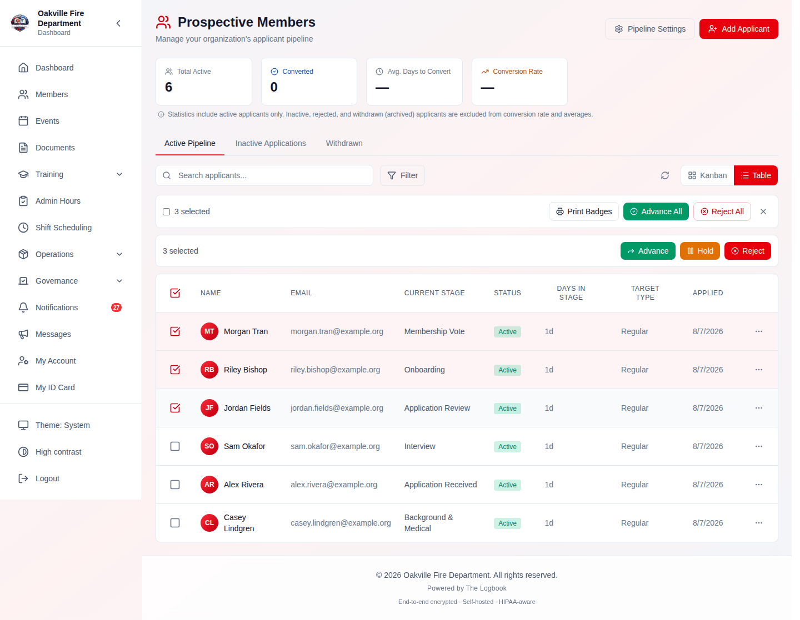
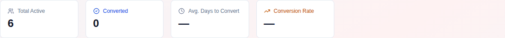

# Prospective Members Pipeline

The Prospective Members module manages the full applicant lifecycle — from initial interest through interviews, document collection, membership vote, and conversion to a full department member. It uses a configurable pipeline of stages that matches your department's onboarding process.

---

## Table of Contents

1. [Pipeline Overview](#pipeline-overview)
2. [Pipeline Configuration](#pipeline-configuration)
3. [Stage Types](#stage-types)
4. [Creating an Applicant](#creating-an-applicant)
5. [Moving Applicants Through Stages](#moving-applicants-through-stages)
6. [The Kanban Board](#the-kanban-board)
7. [Applicant Detail View](#applicant-detail-view)
8. [Document Management](#document-management)
9. [Interviews](#interviews)
10. [Election Vote Stage](#election-vote-stage)
11. [Converting to a Full Member](#converting-to-a-full-member)
12. [Inactivity Timeout](#inactivity-timeout)
13. [Bulk Actions](#bulk-actions)
14. [Pipeline Statistics & Reports](#pipeline-statistics--reports)
15. [Public Application Status Page](#public-application-status-page)
16. [Printing Labels](#printing-labels)
17. [Realistic Example: New Firefighter Application](#realistic-example-new-firefighter-application)
18. [Troubleshooting](#troubleshooting)

---

## Pipeline Overview

Navigate to **Prospective Members** in the sidebar. The main page shows all applicants organized by their current stage.

| URL                                           | Page                              | Permission                   |
| --------------------------------------------- | --------------------------------- | ---------------------------- |
| `/prospective-members`                        | Pipeline Dashboard (Kanban/Table) | `prospective_members.manage` |
| `/prospective-members/settings`               | Pipeline Builder                  | `prospective_members.manage` |
| `/prospective-members/:applicantId/interview` | Interview Form                    | `prospective_members.manage` |
| `/prospective-members/print-labels`           | Print Labels                      | `prospective_members.view`   |
| `/application-status/:token`                  | Public Status Page                | Public (token-authenticated) |

The module uses two primary permissions:

| Permission                   | Description                                           |
| ---------------------------- | ----------------------------------------------------- |
| `prospective_members.view`   | View pipeline, applicants, documents                  |
| `prospective_members.manage` | Full CRUD, advance/reject/convert, configure pipeline |

---

## Pipeline Configuration

**Required Permission:** `prospective_members.manage`

Navigate to **Prospective Members > Settings** to configure the pipeline.

### Creating a Pipeline

1. Click **Create Pipeline** (or edit the default pipeline)
2. Enter a **name** and **description**
3. Add stages by clicking **Add Stage** — each stage has a type that determines its behavior
4. **Drag and drop** stages to reorder them
5. Configure each stage's settings (auto-advance, timeout, etc.)
6. Save

### Pipeline Settings

| Setting                       | Description                                                                             |
| ----------------------------- | --------------------------------------------------------------------------------------- |
| **Is Default**                | New applicants automatically enter this pipeline                                        |
| **Auto-Transfer on Approval** | Automatically convert applicant when they reach the final stage                         |
| **Inactivity Config**         | Timeout settings for stale applications (see [Inactivity Timeout](#inactivity-timeout)) |

---

## Stage Types

Each pipeline stage has a type that determines its behavior:

| Type                | Icon        | What Happens                                             | Auto-Advance?                                  |
| ------------------- | ----------- | -------------------------------------------------------- | ---------------------------------------------- |
| **Form Submission** | FileText    | Applicant fills out a form (linked to Forms module)      | Optional — when form is submitted              |
| **Document Upload** | Upload      | Applicant uploads required documents                     | Optional — when all required docs are uploaded |
| **Manual Approval** | CheckCircle | Coordinator manually reviews and advances                | No — manual action required                    |
| **Election Vote**   | Vote        | Members vote on the applicant (creates election package) | No — depends on election result                |
| **Automated Email** | Mail        | System sends email to applicant on entry                 | Yes — auto-advances immediately after send     |
| **Form Dropdown**   | ListChecks  | Coordinator selects a form for the applicant to fill     | No — manual action required                    |
| **Meeting**         | Calendar    | Schedule an interview, orientation, or ride-along        | No — manual action required                    |

### Stage Configuration Options

Each stage can be configured with:

| Setting                                    | Description                                                                       |
| ------------------------------------------ | --------------------------------------------------------------------------------- |
| **Auto-Advance**                           | Automatically move to next stage when this stage's condition is met               |
| **Inactivity Timeout Override**            | Custom timeout for this stage (overrides pipeline default)                        |
| **Email Settings** (automated email stage) | Subject, sections, welcome text, FAQ link, next meeting info, status tracker link |
| **Form ID** (form stages)                  | Which form to link                                                                |
| **Event Type** (meeting stage)             | Interview, orientation, or ride-along                                             |
| **Scheduling** (meeting stage)             | _Manual_ or _Cal.com self-scheduling_ — shown only when Cal.com is connected      |
| **Collection Method** (document stage)     | _Upload_ or _Documenso e-signature_ — shown only when Documenso is connected      |

### Using Cal.com and Documenso in Stages

If your department has connected the **Cal.com** or **Documenso** integrations (see [Integrations → Cal.com](./16-integrations.md#calcom--interview-scheduling) and [Integrations → Documenso](./16-integrations.md#documenso--document-e-signatures)), two pipeline stage types gain extra options. When the integration is **not** connected, a "Connect Cal.com / Connect Documenso" link appears in the stage editor instead.

**Meeting stage → Cal.com self-scheduling**

1. Edit a **Meeting** stage and set **Scheduling** to _Cal.com_
2. Paste your Cal.com booking link (e.g., `https://cal.com/your-department/interview`)
3. Applicants on this stage see a **Schedule** button on their public status page and pick their own time
4. If a **Webhook Secret** is configured on the Cal.com integration, booking auto-advances the applicant to the next stage — otherwise the coordinator advances them manually after the interview

**Document Upload stage → Documenso e-signature**

1. Edit a **Document Upload** stage and set **Collection Method** to _Documenso e-signature_
2. Optionally enter a Documenso **Template ID** (stored for automated sending in a later release)
3. Applicants on this stage see a "Documents sent for signature" note on their public status page
4. If a **Webhook Secret** is configured on the Documenso integration, a completed signature auto-advances the applicant — otherwise the coordinator advances them manually once signed

> **Note:** Auto-advance matches the signer/attendee **email** to the applicant, so the applicant must book or sign with the same email they applied with. Only the applicant's _current_ stage is advanced, and only if that stage is configured to use the integration.

---

## Creating an Applicant

**Required Permission:** `prospective_members.manage`

1. Click **Create Applicant** on the pipeline dashboard
2. Fill in the applicant details:
   - **First Name** and **Last Name** (required)
   - **Email** (required — used for notifications and ballot distribution)
   - **Phone** (optional)
   - **Desired Membership Type** — Regular Member or Administrative Member
3. Select the **Pipeline** (defaults to the default pipeline)
4. Click **Create**

### Duplicate Detection

The system automatically checks for existing members or applicants with the same email address:

- If an **active member** exists with that email → warning with member details
- If an **archived member** exists → suggestion to reactivate instead
- If another **applicant** exists → warning with applicant details

### Edge Cases

| Scenario                                                      | Behavior                                                                                                                                                                                                                                       |
| ------------------------------------------------------------- | ---------------------------------------------------------------------------------------------------------------------------------------------------------------------------------------------------------------------------------------------- |
| Duplicate email (active member)                               | 409 error; must use different email or reactivate existing                                                                                                                                                                                     |
| Duplicate email (archived member)                             | Warning shown; option to reactivate                                                                                                                                                                                                            |
| Missing email                                                 | Required; cannot create without email                                                                                                                                                                                                          |
| **Referring member is not in your department** _(2026-08-08)_ | Rejected with a clear error rather than an "unexpected error". The message is deliberately generic — it will not tell you whether the person exists in some other department, because that would be a way to probe another department's roster |
| **An invalid pipeline is selected**                           | Also now a clear validation error. Both of these previously surfaced as a `500 Internal Server Error`                                                                                                                                          |

> **Why "Referred by" is checked at all.** The referring member is copied onto
> the member's own record when the applicant is elected and converted. An
> unchecked value would not just sit on the application — it would land in the
> member directory and outlive it. Applications created before this check
> existed keep working: if the stored referrer turns out not to be one of your
> members, conversion drops the referral rather than blocking the election.

---

## Moving Applicants Through Stages

### Advancing to Next Stage

1. Open the applicant's detail view
2. Click **Advance** — the applicant moves to the next pipeline stage
3. Depending on the next stage type:
   - **Automated Email**: Email sent automatically; advances again
   - **Form Submission**: Form link sent to applicant (if auto-advance enabled)
   - **Election Vote**: Election package auto-created
   - **Meeting (Cal.com)**: Applicant self-schedules; booking can auto-advance them
   - **Document Upload (Documenso)**: Applicant signs electronically; a completed signature can auto-advance them
   - Other types: Applicant waits for manual action

### Moving Back (Regression)

1. Click **Move Back** on the applicant detail
2. The applicant returns to the previous stage
3. Progress on the current stage is reset
4. Optional notes can be added explaining the reason

### Completing a Step

For stages with explicit completion criteria:

1. Click **Complete Step** to mark the stage as done
2. If auto-advance is enabled, the applicant moves to the next stage automatically

### Holding, Rejecting, or Withdrawing

| Action         | Effect                                                            |
| -------------- | ----------------------------------------------------------------- |
| **Hold**       | Applicant paused; remains in current stage but marked "On Hold"   |
| **Reject**     | Applicant removed from pipeline; status set to "Rejected"         |
| **Withdraw**   | Applicant archived; typically at applicant's request              |
| **Reactivate** | Returns a held, withdrawn, or inactive applicant to active status |

> **[SCREENSHOT NEEDED]:** _Screenshot of the applicant detail drawer showing the action buttons: Advance (green), Move Back (yellow), Hold (gray), Reject (red), and Withdraw (orange)._

---

## The Kanban Board

The default view shows applicants as **cards on a kanban board** with one column per pipeline stage.

- **Drag and drop** applicants between columns to advance or move them back
- Cards show: applicant name, email, time in current stage, and status badge
- Switch to **Table View** for a sortable, paginated list format
- Filter by status: Active, On Hold, Withdrawn
- **Search accepts a full name** _(2026-08-07)_. Typing "John Smith" used to
  return nothing, because the query was matched against first name, last name and
  email **individually** — so only "John" or "Smith" alone worked. Every
  whitespace-separated word must now match some field, which also means "smith
  john" finds the same person.

### The board shows everyone now _(2026-08-08)_

The board used to be built from the **same paginated list the table view uses**,
25 applicants at a time. If your department had more than 25 active applicants,
you were looking at a board assembled from a fraction of them — **cards were
simply missing from columns, the column counts matched the incomplete data, and
nothing on screen said so**. Switching over from the table view also carried
whatever page the table had been left on, so the board could change depending on
where you had been.

Three things changed:

- **The board requests the whole pipeline** (up to 200 applicants), not one
  page of it.
- **Switching between board and table refetches**, so neither view inherits the
  other's page position.
- **Past 200 applicants, the board tells you.** It states plainly how many it is
  not showing instead of quietly dropping them, and each column header shows the
  **true** count for that stage even when not every card is drawn.

> **If you are running a pipeline larger than 200 active applicants**, use the
> table view with its filters and search for day-to-day work — the board is a
> visual overview, and beyond that size it is telling you it is one.

> **[SCREENSHOT NEEDED]:** _The kanban board for a pipeline with more than 200
> active applicants, showing the truncation notice ("Showing 200 of 247
> applicants") above the columns, with a column header whose count exceeds the
> number of cards drawn beneath it._

### What a card carries — and what it no longer leaks _(2026-08-08)_

Board cards previously carried **every field on the applicant record** down to
the browser, whether or not the card drew them. That included the applicant's
**status token** — the credential behind their public application-status page —
along with coordinator notes, date of birth and home address, sent to anyone
with view-only pipeline access.

Cards now carry exactly the same fields as a table row and nothing more. There
is no change to what you see; the change is to what was being sent behind it.

---

## Applicant Detail View

Click an applicant card to open the **detail drawer** with:

- **Overview**: Name, email, phone, membership type, current stage, time in stage
- **Activity Log**: Chronological record of all actions (stage changes, emails sent, documents uploaded)
- **Documents**: Uploaded files with download links
- **Interviews**: Interview records with recommendations
- **Events**: Linked events (orientations, ride-alongs)
- **Election Package**: (if at election vote stage) Package details and ballot status

> **[SCREENSHOT NEEDED]:** _Screenshot of the applicant detail drawer showing the overview tab with applicant info, current stage indicator, days in stage, and the tabbed content area (Activity, Documents, Interviews, Events, Election Package)._

---

## Document Management

Applicants can upload documents (background check forms, driver's license copies, certifications) at any stage.

### Uploading a Document

1. Open the applicant detail view
2. Navigate to the **Documents** tab
3. Click **Upload Document**
4. Select the file (up to 50 MB)
5. Choose the document type and optionally link to a pipeline stage
6. Upload

### Downloading Documents

Coordinators can download any uploaded document. Files are stored securely with path-traversal protection.

### Edge Cases

| Scenario                         | Behavior                                                     |
| -------------------------------- | ------------------------------------------------------------ |
| File exceeds 50 MB               | Rejected with size limit error                               |
| Duplicate file name              | Stored with unique UUID; original name preserved in metadata |
| Document uploaded at wrong stage | Can be linked to any stage or left unlinked                  |

---

## Interviews

**Required Permission:** `prospective_members.manage`

Navigate to `/prospective-members/:applicantId/interview` to record an interview.

### Recording an Interview

1. Open the applicant's interview page
2. Click **New Interview** to open the form
3. Fill it in:
   - **Your Role / Title** — how you sat on the panel (Membership Coordinator,
     Chief, President). Your identity is recorded automatically; this is the
     capacity you served in
   - **Interview Notes & Comments** — observations, questions asked, and the
     applicant's responses
   - **Recommendation** — Recommend, Recommend with Reservations, Do Not
     Recommend, or Undecided. Choosing one reveals a **Recommendation Details**
     box for the reasoning behind it
4. **Submit Interview**

The interview is stamped with the time you submit it, so there is no date field
to fill in.

### Edge Cases

| Scenario            | Behavior                                                     |
| ------------------- | ------------------------------------------------------------ |
| Edit interview      | Only the original interviewer can edit                       |
| Multiple interviews | Multiple records supported; each interviewer files their own |

---

## Election Vote Stage

When an applicant advances to an **Election Vote** stage, the system automatically creates an **election package** containing:

- **Applicant snapshot** — Name, email, phone, address, date of birth (frozen at time of package creation)
- **Documents** — All uploaded documents from previous stages
- **Stage history** — Summary of completed stages
- **Supporting statement** — Editable by coordinator (shown to voters)
- **Coordinator notes** — Internal notes (not shown to voters)

### Package Workflow

| Status              | Description                            |
| ------------------- | -------------------------------------- |
| **Draft**           | Package created; coordinator reviewing |
| **Ready**           | Coordinator marked ready for ballot    |
| **Added to Ballot** | Secretary added to election            |
| **Elected**         | Membership vote passed                 |
| **Not Elected**     | Membership vote failed                 |

> **[SCREENSHOT NEEDED]:** _Screenshot of the Election Package section in the applicant detail drawer, showing the package status badge, applicant snapshot fields, supporting statement text area, and "Mark Ready for Ballot" button._

See [Elections & Voting > Prospective Member Election Packages](./14-elections.md#prospective-member-election-packages) for the voting workflow.

---

## Converting to a Full Member

When an applicant has completed all pipeline stages:

1. Click **Convert to Member** in the applicant detail view
2. The conversion modal appears:
   - **Membership Type** — Pre-filled from applicant's desired type
   - **Membership ID** — Auto-generated or manual entry
   - **Rank** — Starting rank (Probationary for regular members)
   - **Station** — Assigned station
   - **Roles** — Initial role assignments
   - **Send Welcome Email** — Toggle for welcome notification
3. Confirm conversion

### What Happens on Conversion

- A new **User** record is created with the applicant's info
- Regular members start as **Probationary** status
- Administrative members start as **Active** status
- Applicant status changes to **Converted**
- The `converted_to_member_id` field links to the new user
- Activity log records the conversion with timestamp

> **[SCREENSHOT NEEDED]:** _Screenshot of the Convert to Member modal showing membership type selector, membership ID field, rank dropdown, station dropdown, role checkboxes, and Send Welcome Email toggle._

### Edge Cases

| Scenario                                  | Behavior                                              |
| ----------------------------------------- | ----------------------------------------------------- |
| Email already exists as a member          | Conversion blocked; shows existing member details     |
| Auto-transfer enabled on pipeline         | Conversion happens automatically at final stage       |
| Applicant converted without election vote | Allowed if pipeline doesn't include an election stage |

### After Conversion, the File Stays Confidential _(2026-08-07)_

A prospective-membership record is **not the applicant's copy of their
application**. It carries interview notes, recommendations, reference checks,
election-package commentary and coordinator notes written in confidence by other
members — and it stays sensitive after the applicant is elected.

That is precisely when it used to become readable. A newly elected member who is
given `prospective_members.view` in their own right — a membership coordinator,
an officer — could open **the file that decided their own membership vote**.

A member can no longer see their own prospect record, at all:

- The detail page and every action on it return **"not found"**.
- The record is filtered out of the **prospect list** (and its total), the
  **kanban board**, the **pipeline statistics**, the **election-package list**,
  and **label generation**.

> **Why "not found" rather than "you may not view this"?** A permission error
> would confirm the record exists and that there is something in it about them —
> which is itself the thing being protected.

**How you are matched to your own record.** By the conversion link
(`converted_to_member_id`); by an email address you own, department or personal;
or by full name **paired with a matching date of birth**.

> **Matching is deliberately conservative.** Name alone is not enough — two
> J. Smiths in one department is routine, and a false positive would hide a **real
> applicant** from the coordinator working their file. If a member reports that a
> prospect has vanished from the board and you can account for who they are, check
> whether the two records share a name _and_ a date of birth.

---

## Inactivity Timeout

Pipelines can be configured to automatically flag or deactivate stale applications.

### Configuration

Navigate to **Settings > Pipeline** and configure:

| Setting                | Options                                   | Description                                                   |
| ---------------------- | ----------------------------------------- | ------------------------------------------------------------- |
| **Timeout Preset**     | 3 months, 6 months, 1 year, Never, Custom | How long before an applicant is considered inactive           |
| **Warning Threshold**  | Percentage (default 80%)                  | Show warning when this percentage of timeout has elapsed      |
| **Notify Coordinator** | Yes/No                                    | Send notification when applicant approaches timeout           |
| **Auto-Purge**         | Yes/No                                    | Automatically delete inactive applicants after a grace period |

### How It Works

1. System checks `last_activity_at` for each active applicant nightly
2. If elapsed time > warning threshold: applicant flagged with warning
3. If elapsed time > timeout: applicant marked as **Inactive**
4. If auto-purge enabled and inactive for > purge days: applicant deleted with audit log

### Per-Stage Override

Individual stages can override the pipeline timeout. For example, a background check stage might have a 180-day timeout (longer than the default 90 days) because background checks take time.

---

## Bulk Actions

Select multiple applicants on the pipeline dashboard to perform bulk actions:

1. Check the boxes next to applicant names
2. A bottom action bar appears with available actions:
   - **Advance** — Move all selected to next stage
   - **Hold** — Put all selected on hold
   - **Reject** — Reject all selected
   - **Reactivate** — Reactivate all selected
   - **Delete** — Permanently remove (requires confirmation)
3. Confirm the bulk action

### Bulk actions now tell you who was skipped _(2026-08-08)_

A bulk action used to be a loop in your browser — one request per applicant, one
after another. Thirty selected applicants meant thirty round trips, each one
committing, sending stage email and auto-linking events. Worse, **every error
was discarded**: a partial failure came back as a bare count naming nobody, so
you could not tell which three of your thirty had not moved.

A bulk action is now **one request**, and the result is **itemized**. You get a
count of how many succeeded, how many did not, and for each failure the
applicant's name and the reason.

**One failure never stops the rest.** If applicant #7 is already at the final
stage, the other twenty-nine still advance.

> **[SCREENSHOT NEEDED]:** _The bulk-action result summary after advancing 12
> applicants where 2 failed — showing "10 advanced, 2 skipped" with the two
> named applicants listed beneath and the reason next to each ("Already at the
> final stage")._

#### A rejection reason no longer overwrites your notes

When you bulk-reject or bulk-hold applicants, the **reason you type is recorded
in each applicant's activity log**. It does **not** go into the coordinator
notes field.

This matters because it used to. The old browser-side path sent your reason
through the update endpoint as `notes`, so **a bulk rejection silently
overwrote the coordinator notes on every applicant you had selected**. If you
performed bulk rejections before 2026-08-08 and your notes look wrong, check the
activity log — the original edit history is there.

#### Edge cases

| Situation                                         | What happens                                                                                                                                                       |
| ------------------------------------------------- | ------------------------------------------------------------------------------------------------------------------------------------------------------------------ |
| An applicant is **already at the final stage**    | Reported as skipped with that reason. The rest still advance                                                                                                       |
| An applicant has **no current stage**             | Same — skipped and named, not silently counted as moved                                                                                                            |
| **Your own applicant record** is in the selection | Reported as "not found". Coordinators who are themselves in a pipeline cannot act on their own file through a bulk action, exactly as they cannot open it directly |
| You select more than **200** applicants           | The request is refused. Work in batches — 200 is a guardrail on request size, not a page size                                                                      |
| A stage triggers an **automated email**           | It still sends, once per successfully advanced applicant                                                                                                           |

### "Advance" no longer claims success when nothing moved _(2026-08-08)_

Advancing an applicant who had nowhere to go — already at the final stage, or
with no current stage set — used to report **"Advanced"** and close the drawer,
with nothing actually changed. It also wrote an entry into the **audit log**
saying that applicant had been advanced.

That last part was the serious half. The audit log exists so a department can
reconstruct who moved whom through membership, and an entry describing a
movement that never happened undermines exactly that.

Both cases now return a clear error explaining the applicant has nowhere to
advance to, and **the audit entry is only written after a real advance**.

> If you are auditing membership decisions made before 2026-08-08, be aware that
> `prospect_advanced` entries may include no-op advances. Cross-check against the
> applicant's stage history rather than the audit entry alone.

---

## Pipeline Statistics & Reports

The pipeline dashboard shows summary statistics:

| Metric                      | Description                                 |
| --------------------------- | ------------------------------------------- |
| **Total Active**            | Currently active applicants                 |
| **In Progress**             | Applicants actively moving through stages   |
| **On Hold**                 | Paused applicants                           |
| **Approaching Timeout**     | Applicants nearing inactivity threshold     |
| **Conversion Rate**         | Percentage of applicants who become members |
| **Average Time to Convert** | Days from application to conversion         |
| **By Stage**                | Count of applicants at each pipeline stage  |

---

## Public Application Status Page

Applicants receive a link to check their application status without logging in:

- URL: `/application-status/:token`
- Shows: Current stage, completed stages, next steps
- Token is generated when the applicant is created and included in automated emails
- Token does not rotate on page view (stable link)

> **[SCREENSHOT NEEDED]:** _Screenshot of the public application status page showing the department name, applicant name, a progress bar with completed stages checked and the current stage highlighted, and a "What's Next" section._

---

## Printing Labels

Navigate to `/prospective-members/print-labels` to print mailing labels for applicants:

1. Select applicants from the pipeline dashboard using checkboxes
2. Click **Print Badges** in the selection bar
3. Choose label format and print

See [Inventory > Cross-Module Barcode Label Printing](./05-inventory.md#cross-module-barcode-label-printing-2026-06-10) for label format options.

---

## Realistic Example: New Firefighter Application

### Background

**Oakville Fire Department** receives an application from **Alex Rivera**, who wants to join as a regular (volunteer) firefighter.

### Part 1: Application Received

Membership Coordinator **Lt. Morrison** creates the applicant:

- Name: Alex Rivera
- Email: alex.rivera@email.com
- Desired Membership Type: Regular Member
- Pipeline: Default Firefighter Pipeline

The pipeline has 6 stages:

1. Interest Form (auto-advance on form submission)
2. Application Review (manual)
3. Background Check (manual, 180-day timeout override)
4. Interview (meeting stage)
5. Membership Vote (election vote)
6. Welcome & Onboarding (automated email)

### Part 2: First Three Stages

**Stage 1 (Interest Form):** Alex receives an email with a link to the interest form. He fills it out → auto-advances to Stage 2.

**Stage 2 (Application Review):** Lt. Morrison reviews the application details, verifies references, and clicks **Advance**.

**Stage 3 (Background Check):** Lt. Morrison initiates the background check. After 3 weeks, the results come back clean. He uploads the results document and clicks **Complete Step** → advances to Stage 4.

### Part 3: Interview

**Stage 4 (Interview):** Alex is scheduled for an interview at the next meeting. Three officers conduct interviews and each files a record:

- Capt. Davis: **Recommend**
- Lt. Hernandez: **Recommend**
- FF Brooks: **Recommend with reservations** (notes: "Limited availability on weekday shifts")

Lt. Morrison reviews the interviews and advances Alex to Stage 5.

### Part 4: Membership Vote

**Stage 5 (Membership Vote):** An election package is automatically created with Alex's snapshot, uploaded documents, and a supporting statement written by Lt. Morrison.

Secretary Sarah Kim marks the package as **Ready for Ballot** and adds it to the December business meeting election as an approval vote item.

At the meeting, members vote:

- 35 Approve, 3 Deny → Alex is **Elected** (92% approval)

The package status updates to "Elected" and Lt. Morrison is notified.

### Part 5: Conversion

Lt. Morrison clicks **Convert to Member**:

- Membership Type: Regular (starts as Probationary)
- Membership ID: Auto-generated (OFD-2026-047)
- Rank: Probationary Firefighter
- Station: Station 1
- Welcome email: Sent

Alex Rivera is now a full member of the Oakville Fire Department.

---

## Troubleshooting

| Issue                                    | Solution                                                                                                    |
| ---------------------------------------- | ----------------------------------------------------------------------------------------------------------- |
| Applicant stuck at form submission stage | Check that the form is linked correctly. Verify the applicant received the form email.                      |
| Election package not created             | Ensure the stage type is `election_vote`. Check that the applicant was advanced (not just marked complete). |
| Cannot convert applicant                 | Check for existing member with same email. Verify all required stages are complete.                         |
| Duplicate detection false positive       | If the existing member is archived/dropped, you can create the new applicant and note the relationship.     |
| Public status page shows wrong stage     | Token may be for a different applicant. Verify the token in the applicant's detail view.                    |
| Inactivity warning not triggering        | Check pipeline inactivity settings. Verify the scheduled task is running.                                   |
| Documents not downloading                | Check file storage configuration. Verify the document was uploaded successfully.                            |
| Bulk advance fails for some applicants   | Applicants at the final stage cannot advance further. Check individual error messages.                      |

---

**Previous:** [Elections & Voting](./14-elections.md) | **Next:** [Integrations](./16-integrations.md)
