# Prospective Members Pipeline

The Prospective Members module manages the full applicant lifecycle — from initial interest through interviews, document collection, membership vote, and conversion to a full department member. It uses a configurable pipeline of stages that matches your department's onboarding process.

---

## Table of Contents

1. [Pipeline Overview](#pipeline-overview)
2. [Pipeline Configuration](#pipeline-configuration)
3. [Stage Types](#stage-types)
4. [Creating an Applicant](#creating-an-applicant)
5. [Moving Applicants Through Stages](#moving-applicants-through-stages)
6. [The Kanban Board](#the-kanban-board)
7. [Applicant Detail View](#applicant-detail-view)
8. [Document Management](#document-management)
9. [Interviews](#interviews)
10. [Election Vote Stage](#election-vote-stage)
11. [Sign-offs: Multi-Signer Approval](#sign-offs-multi-signer-approval-2026-09-28)
12. [Converting to a Full Member](#converting-to-a-full-member)
13. [Inactivity Timeout](#inactivity-timeout)
14. [Bulk Actions](#bulk-actions)
15. [Pipeline Statistics & Reports](#pipeline-statistics--reports)
16. [Public Application Status Page](#public-application-status-page)
17. [Printing Labels](#printing-labels)
18. [Realistic Example: New Firefighter Application](#realistic-example-new-firefighter-application)
19. [Troubleshooting](#troubleshooting)

---

## Pipeline Overview

Navigate to **Prospective Members** in the sidebar. The main page shows all applicants organized by their current stage.

| URL                                           | Page                              | Permission                                           |
| --------------------------------------------- | --------------------------------- | ---------------------------------------------------- |
| `/prospective-members`                        | Pipeline Dashboard (Kanban/Table) | `prospective_members.manage`                         |
| `/prospective-members/settings`               | Pipeline Builder                  | `prospective_members.manage`                         |
| `/prospective-members/:applicantId/interview` | Interview Form                    | `prospective_members.manage`                         |
| `/prospective-members/print-labels`           | Print Labels                      | `prospective_members.view` or `.manage`              |
| `/prospective-members/sign-offs`              | Sign-offs                         | Signed in, module on — no pipeline permission needed |
| `/application-status/:token`                  | Public Status Page                | Public (token-authenticated)                         |

The module uses two primary permissions:

| Permission                   | Description                                           |
| ---------------------------- | ----------------------------------------------------- |
| `prospective_members.view`   | View pipeline, applicants, documents                  |
| `prospective_members.manage` | Full CRUD, advance/reject/convert, configure pipeline |

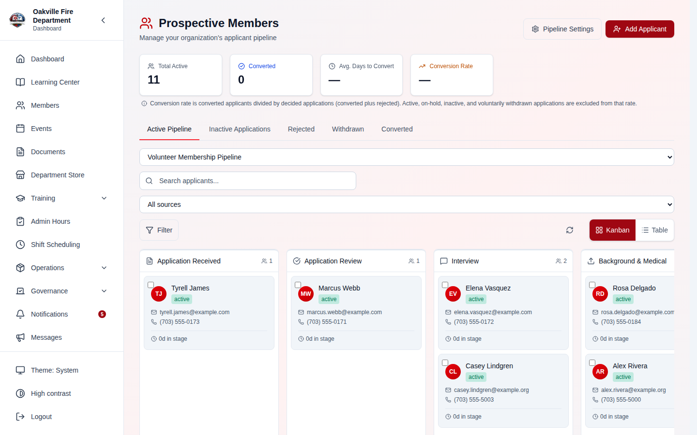

---

## Pipeline Configuration

**Required Permission:** `prospective_members.manage`

Navigate to **Prospective Members > Settings** to configure the pipeline.

### Creating a Pipeline

1. Click **Create Pipeline** (or edit the default pipeline)
2. Enter a **name** and **description**
3. Add stages by clicking **Add Stage** — each stage has a type that determines
   its behavior. Every type can be added here, **Manual Approval** and
   **Election / Vote** included; choosing Election / Vote reveals its voting
   configuration below the type grid
4. **Drag and drop** stages to reorder them. Each stage holds its own position
   in the order, so the column order on the board and the stage **Advance**
   moves an applicant to are always the same
5. Configure each stage's settings (auto-advance, timeout, etc.)
6. Save

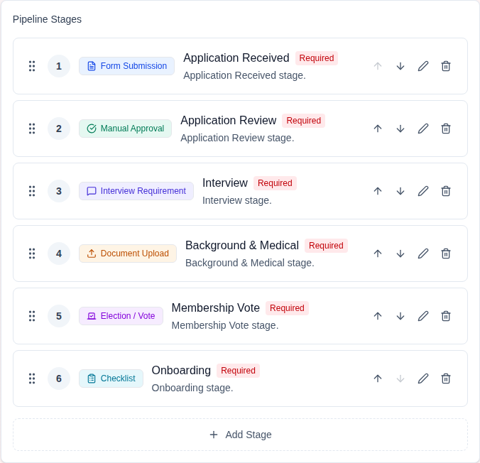

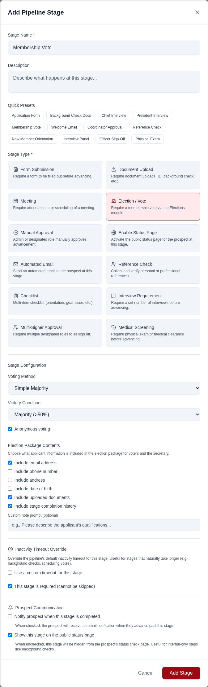

### Pipeline Settings

| Setting                                 | Description                                                                                                                                                                                                       |
| --------------------------------------- | ----------------------------------------------------------------------------------------------------------------------------------------------------------------------------------------------------------------- |
| **Is Default**                          | New applicants automatically enter this pipeline                                                                                                                                                                  |
| **Auto-Transfer on Approval**           | Automatically convert applicant when they complete the final stage. **No screen sets it** — it is off for any pipeline created in the app and can be turned on only through the API (`auto_transfer_on_approval`) |
| **Inactivity Config**                   | Timeout settings for stale applications (see [Inactivity Timeout](#inactivity-timeout))                                                                                                                           |
| **When an Applicant Becomes a Member**  | Member class and starting status for operational and for administrative applicants on conversion (see [What Happens on Conversion](#what-happens-on-conversion))                                                  |
| **Public Application Status Page**      | "Let applicants check their application status through a public link" — see [Public Application Status Page](#public-application-status-page)                                                                     |
| **Show upcoming stages** _(2026-09-24)_ | Under the status-page switch. Untick it and applicants see only the visible stages they have completed — not the stage they are on, and not how many remain. On by default, which is what the page always did     |

---

## Stage Types

Each pipeline stage has a type that determines its behavior:

| Type                      | What Happens                                                                                                                | Auto-Advance?                                                                              |
| ------------------------- | --------------------------------------------------------------------------------------------------------------------------- | ------------------------------------------------------------------------------------------ |
| **Form Submission**       | Applicant fills out a form (linked to Forms module)                                                                         | Optional — when form is submitted                                                          |
| **Document Upload**       | Applicant uploads required documents                                                                                        | Optional — when all required docs are uploaded                                             |
| **Manual Approval**       | Coordinator manually reviews and advances                                                                                   | No — manual action required                                                                |
| **Multi-Signer Approval** | Named officers (the Chief, the President…) must each sign — see [Sign-offs](#sign-offs-multi-signer-approval-2026-09-28)    | Completes, and advances the applicant, when the last named role signs                      |
| **Election Vote**         | Members vote on the applicant. The election package is created on the server the moment the applicant arrives, by any route | No — depends on election result; no package, no advance                                    |
| **Automated Email**       | System sends email to applicant on entry                                                                                    | Yes — completes itself once the email is sent _(2026-09-24)_, unless it is the final stage |
| **Meeting**               | Schedule an interview, orientation, or ride-along                                                                           | Optional — when the event is finalized                                                     |

The builder offers twelve types in all; the remaining five — Enable Status
Page, Reference Check, Checklist, Interview Requirement and Medical Screening —
are described in [Membership → Pipeline Stage Types](./01-membership.md#pipeline-stage-types).

> **Corrected 2026-10-04.** This table listed a **Form Dropdown** type, which
> has never existed (guide 01 corrected the same row on 2026-08-10), and said an
> Automated Email stage advanced immediately after sending, which was not true
> until 2026-09-24.

> **What a form submission does to a Form Submission stage.** A submission of
> the stage's linked form completes that stage and advances the applicant.
> Un-tick **Auto-advance when form is submitted** to hold them there instead:
> the answers are still recorded against the stage for you to read, and you
> advance them by hand. A stage saved before this setting existed keeps
> advancing, so nothing changes unless you turn it off.
>
> A submission only ever affects the stage the applicant is **currently on**. A
> second submission of the same form — a duplicate application, or an applicant
> re-sending the interest form months later — records the new answers and moves
> nobody. It used to complete the form stage wherever the applicant had got to
> and advance them to the stage after it, which pulled people _backward_: an
> applicant at the membership vote landed back on the welcome email.

> **What counts as attendance on a Meeting stage** _(revised 2026-09-16)_. A
> meeting stage that **names its event** — it has an **Auto-Link Event Type**,
> or was pinned to one specific event — is an attendance requirement. Two things
> must both be true before the applicant can leave it:
>
> 1. They are **checked in** at an event matching the stage's Auto-Link Event
>    Type (and category, if one is set), and
> 2. that event's **attendance has been finalized** — the organizer ran **End
>    Event**, recorded an **actual end time**, or pressed **Finalize
>    Attendance**.
>
> A sign-in at the door is not the department's final word on who attended: a
> guest can be signed in and struck off ten minutes later, and until the event
> is closed out the roster is still being decided. So an applicant who signs in
> tonight **no longer jumps to the next stage during the meeting**. They advance
> when the organizer closes the event out, together with everyone else who was
> there.
>
> **An event nobody finalizes still settles on its own.** Seven days after the
> event ends (the `PIPELINE_ATTENDANCE_SETTLE_DAYS` setting — your
> administrator can change it), the check-in counts as settled, and a nightly
> task advances anyone it clears. So the longest an applicant waits on an
> organizer who never closed the event out is about a week.
>
> **Attendance from before the application was opened does not count.** When
> the kiosk sign-in at a business meeting is what _creates_ an applicant, that
> meeting still counts — but a later "attend a business meeting" stage now needs
> a **second** meeting. It used to be satisfied by the very sign-in that created
> the record.
>
> **This now applies to your own Advance button too, not just the automatic
> path.** On a stage that names its event, **Advance**, a drag across the board,
> **Bulk Advance** and every automatic advance are all refused until the
> attendance is there. The applicant drawer says so before you click:
>
> _"The applicant must be checked in at this stage's event, and that event's
> attendance must be finalized, before they can advance. A check-in recorded
> before their application was opened does not count."_
>
> If you are refused, the message names the way out, in the order to reach for
> them:
>
> 1. **Record the attendance that happened.** Add the applicant to that event's
>    attendees and check them in — you can do this after the fact from the event
>    itself. If the event is already finalized, somebody holding
>    `events.reopen_attendance` must reopen it first; re-finalizing then
>    advances them and skips anyone already moved.
> 2. **Un-tick Required on the stage and Skip it**, if the department has
>    decided this applicant does not need it.
> 3. **Clear the stage's Auto-Link Event Type**, if the stage never should have
>    named an event.
>
> If the applicant is checked in but the event is simply not finalized yet, the
> refusal says that instead and names the event — the applicant did everything
> asked of them, and the fix is for the organizer to close the event out.
>
> **A stage that names no event takes your word for it.** "Meet with the
> Chief" is an arrangement nothing records, so a stage with Auto-Link Event
> Type set to _None_ is never graded: **Advance** moves the applicant on every
> path, bulk included. The trade-off is that such a stage **cannot
> auto-advance** — it has no event to watch — and the stage builder refuses to
> save an auto-advancing meeting stage until you pick a type. **Meeting Type**
> does not stand in for it; that field names the stage's purpose for whoever
> reads it and decides nothing. Stages that self-schedule through **Cal.com**
> are the exception: they advance when Cal.com reports the meeting ended, so
> they need no linked event.
>
> _History, for anyone reconciling past decisions:_ before 2026-09-15 a Bulk
> Advance walked past the attendance check; from 2026-09-15 to 09-16 only Bulk
> Advance was held to it and a single Advance was exempt; since 2026-09-16 the
> stage decides, not the button. Before 2026-09-16 a stage auto-advanced at the
> moment of check-in rather than at finalize.

### Stage Configuration Options

Each stage can be configured with:

| Setting                                    | Description                                                                       |
| ------------------------------------------ | --------------------------------------------------------------------------------- |
| **Auto-Advance**                           | Automatically move to next stage when this stage's condition is met               |
| **Required**                               | The stage must be completed — it cannot be skipped                                |
| **Inactivity Timeout Override**            | Custom timeout for this stage (overrides pipeline default)                        |
| **Email Settings** (automated email stage) | Subject, sections, welcome text, FAQ link, next meeting info, status tracker link |
| **Form ID** (form stages)                  | Which form to link                                                                |
| **Event Type** (meeting stage)             | Interview, orientation, or ride-along                                             |
| **Auto-Link Event Type** (meeting stage)   | Which event type the stage waits on. Naming one makes attendance required         |
| **Scheduling** (meeting stage)             | _Manual_ or _Cal.com self-scheduling_ — shown only when Cal.com is connected      |
| **Collection Method** (document stage)     | _Upload_ or _Documenso e-signature_ — shown only when Documenso is connected      |

**Required stages cannot be skipped.** The **Skip** action on an applicant is
refused on a stage marked Required, and the button is disabled with an
explanation. To bypass one, un-tick **Required** on the stage first — that is a
deliberate change to the pipeline everyone can see, rather than a quiet
exception made for one applicant. Stages are Required by default.

### Using Cal.com and Documenso in Stages

If your department has connected the **Cal.com** or **Documenso** integrations (see [Integrations → Cal.com](./16-integrations.md#calcom--interview-scheduling) and [Integrations → Documenso](./16-integrations.md#documenso--document-e-signatures)), two pipeline stage types gain extra options. When the integration is **not** connected, a "Connect Cal.com / Connect Documenso" link appears in the stage editor instead.

**Meeting stage → Cal.com self-scheduling**

1. Edit a **Meeting** stage and set **Scheduling** to _Cal.com_
2. Paste your Cal.com booking link (e.g., `https://cal.com/your-department/interview`)
3. Applicants on this stage see a **Schedule** button on their public status page and pick their own time
4. If a **Webhook Secret** is configured on the Cal.com integration **and the Cal.com webhook is subscribed to `MEETING_ENDED`**, the applicant advances once the booked meeting has finished — otherwise the coordinator advances them manually after the interview

> **The booking is not the meeting.** Advancing on `BOOKING_CREATED` moved an
> applicant on the moment they picked a slot, three weeks before the interview
> they had booked. Subscribe **`MEETING_ENDED`** on the Cal.com webhook; a
> booking on its own no longer advances anyone.

**Document Upload stage → Documenso e-signature**

1. Edit a **Document Upload** stage and set **Collection Method** to _Documenso e-signature_
2. Optionally enter a Documenso **Template ID** (stored for automated sending in a later release)
3. Applicants on this stage see a "Documents sent for signature" note on their public status page
4. If a **Webhook Secret** is configured on the Documenso integration, a completed signature auto-advances the applicant — otherwise the coordinator advances them manually once signed

> **Note:** Auto-advance matches the signer/attendee **email** to the applicant, so the applicant must book or sign with the same email they applied with. Only the applicant's _current_ stage is advanced, and only if that stage is configured to use the integration.

---

## Creating an Applicant

**Required Permission:** `prospective_members.manage`

1. Choose the pipeline in the dashboard's pipeline picker — the applicant joins
   the pipeline the page is showing
2. Click **Add Applicant** in the page header. It is disabled, with "Set up a
   pipeline first", until the department has a pipeline _(2026-09-28 — it used
   to open a form whose submit silently did nothing)_
3. Fill in the applicant details:
   - **First Name** and **Last Name** (required)
   - **Email** (required — used for notifications and ballot distribution)
   - **Phone** (optional)
   - **Membership Type** — Regular Member or Administrative
   - **Target Role** (optional) — the position the applicant is joining for,
     "Applied to the member record when this applicant is converted." Leave it
     on **No specific role** if there is none
4. Click **Add to Pipeline**

> **Corrected 2026-10-04.** This section previously named the button **Create
> Applicant**, the submit button **Create**, and a pipeline selector inside the
> form. The button is **Add Applicant**, the submit is **Add to Pipeline**, and
> the pipeline is whichever one the page is showing.

**Choosing a Target Role is granting it** _(2026-09-30)_. The role is copied
onto the new member at conversion, so saving one is held to your own
permissions: a role that grants anything you do not hold is refused with "This
applicant's target position grants permissions beyond your own." The same check
runs again when the applicant is converted. The Target Role on applications
added from this form before 2026-09-29 was never saved — the form dropped it —
so check the drawer's **Target Role** on older applicants.

### Duplicate Detection

The system automatically checks for existing members or applicants with the same email address:

- If an **active member** exists with that email → warning with member details
- If an **archived member** exists → suggestion to reactivate instead
- If another **applicant** exists → warning with applicant details

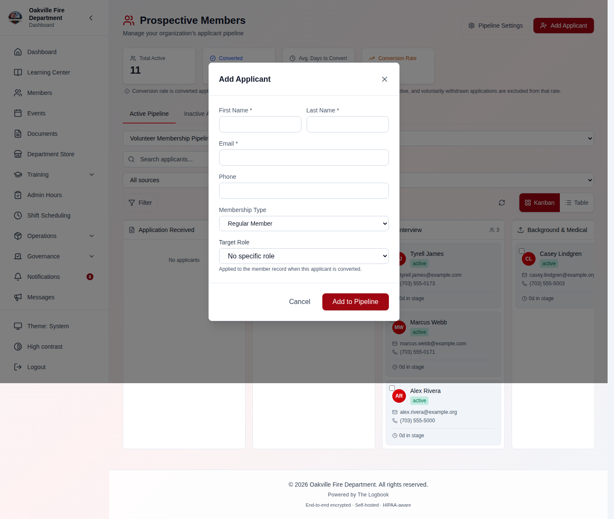

### Edge Cases

| Scenario                                                      | Behavior                                                                                                                                                                                                                                       |
| ------------------------------------------------------------- | ---------------------------------------------------------------------------------------------------------------------------------------------------------------------------------------------------------------------------------------------- |
| Duplicate email (active member)                               | 409 error; must use different email or reactivate existing                                                                                                                                                                                     |
| Duplicate email (archived member)                             | Warning shown; option to reactivate                                                                                                                                                                                                            |
| Missing email                                                 | Required; cannot create without email                                                                                                                                                                                                          |
| **Referring member is not in your department** _(2026-08-08)_ | Rejected with a clear error rather than an "unexpected error". The message is deliberately generic — it will not tell you whether the person exists in some other department, because that would be a way to probe another department's roster |
| **An invalid pipeline is selected**                           | Also now a clear validation error. Both of these previously surfaced as a `500 Internal Server Error`                                                                                                                                          |

> **Why "Referred by" is checked at all.** The referring member is copied onto
> the member's own record when the applicant is elected and converted. An
> unchecked value would not just sit on the application — it would land in the
> member directory and outlive it. Applications created before this check
> existed keep working: if the stored referrer turns out not to be one of your
> members, conversion drops the referral rather than blocking the election.

---

## Moving Applicants Through Stages

### Advancing to Next Stage

1. Open the applicant's detail view
2. Click **Advance** — the applicant moves to the next pipeline stage
3. Depending on the next stage type:
   - **Automated Email**: Email sent automatically; the stage completes itself and the applicant moves on again _(2026-09-24)_. If the send fails they stay on it
   - **Form Submission**: Form link sent to applicant (if auto-advance enabled)
   - **Election Vote**: Election package created on the server — by Advance, a drag, bulk advance, Skip, Back, placing or auto-advance alike _(2026-09-30)_
   - **Meeting (Cal.com)**: Applicant self-schedules; booking can auto-advance them
   - **Document Upload (Documenso)**: Applicant signs electronically; a completed signature can auto-advance them
   - Other types: Applicant waits for manual action

### Moving Back (Regression)

1. Click **Back** in the applicant's drawer
2. The applicant returns to the previous stage
3. Progress on the current stage is reset
4. Optional notes can be added explaining the reason

### Completing a Step

For stages with explicit completion criteria:

1. Click **Complete Step** to mark the stage as done
2. If auto-advance is enabled, the applicant moves to the next stage automatically

### Placing an applicant who is on no stage

An applicant can end up on no stage at all. Deleting a stage moves everyone on
it to the next one, or to the previous one if you deleted the last stage — but
if you delete a pipeline's _only remaining_ stage there is nowhere to move them
to, and they are left without one.

The board shows these applicants in an **Unassigned** column rather than hiding
them. The column holds only this pipeline's stageless applicants, and switching
the board to another pipeline shows only that pipeline's applicants. Open one and you will see **Not on a stage**, with a picker of the
stages in their pipeline: choose the stage they should be working and click
**Place**. The stage is recorded as in progress and the placement appears in
their activity log.

This is for recovery only. It is refused for an applicant who is already on a
stage — use **Advance**, **Move Back** or **Skip** for those — so it cannot be
used to move someone past a stage's requirements. Note that placing an
applicant mid-pipeline does not mark the earlier stages complete, because
nobody completed them; their progress count will read low until those stages
are worked or skipped.

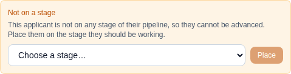

### Holding, Rejecting, or Withdrawing

| Action         | Effect                                                                                                                                                                                |
| -------------- | ------------------------------------------------------------------------------------------------------------------------------------------------------------------------------------- |
| **Hold**       | Applicant paused; remains in current stage but marked "On Hold"                                                                                                                       |
| **Reject**     | Applicant removed from pipeline; status set to "Rejected"                                                                                                                             |
| **Withdraw**   | Applicant moved to the **Withdrawn** tab. A coordinator can do it, and since 2026-09-24 the applicant can too — see [Public Application Status Page](#public-application-status-page) |
| **Reactivate** | Returns a held, withdrawn, or inactive applicant to active status                                                                                                                     |

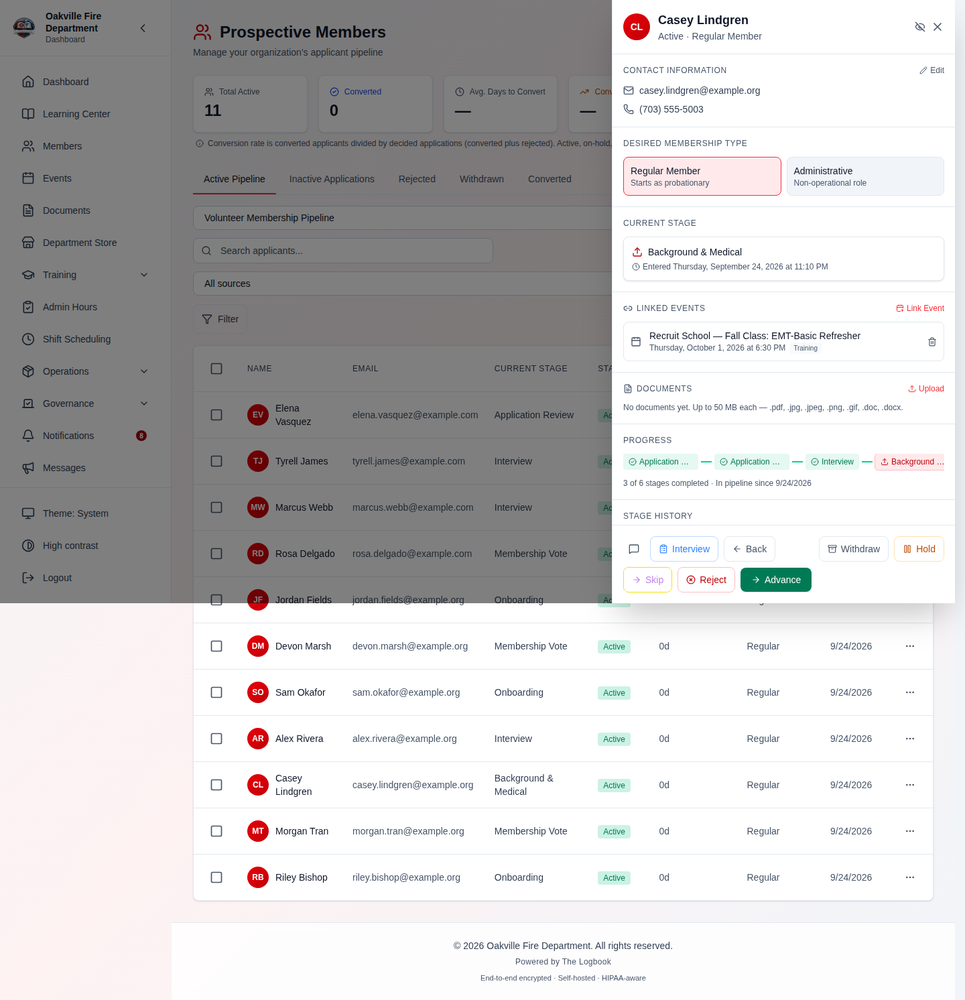

---

## The Kanban Board

The default view shows applicants as **cards on a kanban board** with one column per pipeline stage.

- **Drag and drop** applicants between columns to advance or move them back
- Cards show: applicant name, email, time in current stage, and status badge
- Switch to **Table View** for a sortable, paginated list format
- Filter by status: Active, On Hold, Withdrawn
- **Search accepts a full name** _(2026-08-07)_. Typing "John Smith" used to
  return nothing, because the query was matched against first name, last name and
  email **individually** — so only "John" or "Smith" alone worked. Every
  whitespace-separated word must now match some field, which also means "smith
  john" finds the same person.

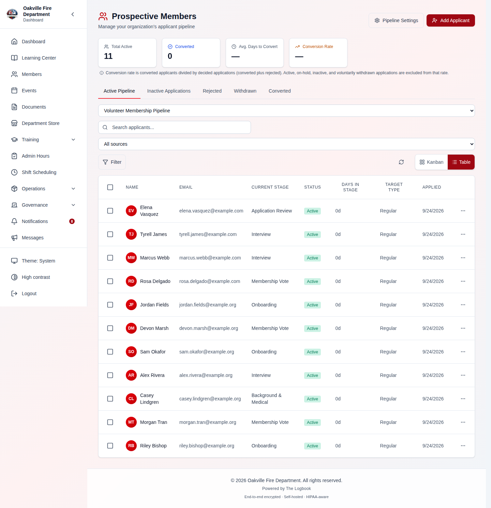

**[SCREENSHOT — REPLACE `15-04-kanban-board.png` (low priority).** Each card's
status badge now shows the label (**Active**, **On Hold**) instead of the raw
value ("active", "on hold") — 2026-09-29. The same applies to `15-01`,
`15-02-board-truncated` and guide 01's `01-10`; re-shoot them in the same pass.**]**

### The board shows everyone now _(2026-08-08)_

The board used to be built from the **same paginated list the table view uses**,
25 applicants at a time. If your department had more than 25 active applicants,
you were looking at a board assembled from a fraction of them — **cards were
simply missing from columns, the column counts matched the incomplete data, and
nothing on screen said so**. Switching over from the table view also carried
whatever page the table had been left on, so the board could change depending on
where you had been.

Three things changed:

- **The board requests the whole pipeline** (up to 200 applicants), not one
  page of it.
- **Switching between board and table refetches**, so neither view inherits the
  other's page position.
- **Past 200 applicants, the board tells you.** It states plainly how many it is
  not showing instead of quietly dropping them.

> **Past the ceiling, the column counts are counts of what loaded.** The notice
> gives you the real total for the pipeline, but each column header counts only
> the cards that were fetched — so on a truncated board a stage can show fewer
> than it actually holds. That is the other reason to work from the table view
> at this size: its filters and paging see the whole set.

> **If you are running a pipeline larger than 200 active applicants**, use the
> table view with its filters and search for day-to-day work — the board is a
> visual overview, and beyond that size it is telling you it is one.

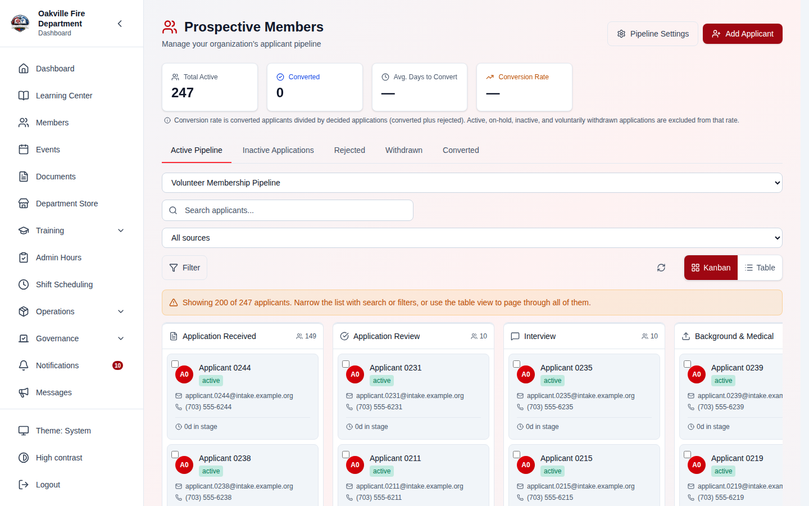

### What a card carries — and what it no longer leaks _(2026-08-08)_

Board cards previously carried **every field on the applicant record** down to
the browser, whether or not the card drew them. That included the applicant's
**status token** — the credential behind their public application-status page —
along with coordinator notes, date of birth and home address, sent to anyone
with view-only pipeline access.

Cards now carry exactly the same fields as a table row and nothing more. There
is no change to what you see; the change is to what was being sent behind it.

---

## Applicant Detail View

Click an applicant card to open the **detail drawer**. It is a single scrolling
column of sections rather than a tab strip — everything is on one surface, and
the sections that do not apply to this applicant are simply absent:

- **Contact Information**: Email and phone, editable in place
- **Desired Membership Type**: Regular or administrative
- **Application Data**: What they submitted, when there is a linked application
- **Current Stage**: The stage and when they entered it
- **Linked Events**: Orientations, ride-alongs and open houses, with **Link Event**
- **Progress**: The stage rail, "_n_ of _m_ stages completed", and time in pipeline
- **Checklist Progress**, **Approval Status**, **Reference Checks**,
  **Medical Screenings**, **Interview Requirement**: shown when the current
  stage carries that requirement
- **Election Package**: at the election-vote stage only
- **Stage History**: Every stage entered, with its date
- **Notes** and **Activity Log**: the log is collapsed until you open it

The action bar pins to the bottom. Left to right: **Interview**, **Back**,
then **Withdraw**, **Hold**, **Skip**, **Reject** and **Advance** — on the final
stage **Skip** is not offered and the last button reads **Convert**.

Three drawer details changed in this window:

- The contact editor carries the application's **Target Role**, and clearing a
  phone, date of birth or address field and saving now clears it _(2026-09-30
  — the old value used to survive behind a success message)_.
- An address with only some parts filled in — a city and state with no street
  — is shown; it used to appear only when both a street and a city were set.
- The **Activity Log** shows the notes typed into the Convert dialog on the
  conversion entry, and confirmations now say what actually happens: a rejected
  or withdrawn applicant can be reactivated from their tab, and a skipped stage
  is recorded as skipped, not completed.

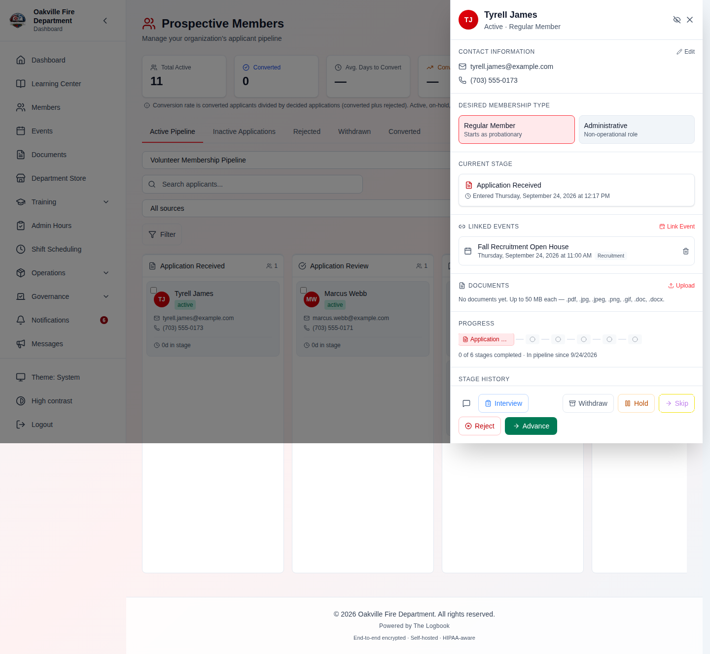

---

## Document Management

Applicants can upload documents (background check forms, driver's license copies, certifications) at any stage.

### Uploading a Document

1. Open the applicant detail view
2. Navigate to the **Documents** tab
3. Click **Upload Document**
4. Select the file (up to 50 MB)
5. Choose the document type and optionally link to a pipeline stage
6. Upload

### Downloading Documents

Coordinators can download any uploaded document. Files are stored securely with path-traversal protection.

### Edge Cases

| Scenario                         | Behavior                                                     |
| -------------------------------- | ------------------------------------------------------------ |
| File exceeds 50 MB               | Rejected with size limit error                               |
| Duplicate file name              | Stored with unique UUID; original name preserved in metadata |
| Document uploaded at wrong stage | Can be linked to any stage or left unlinked                  |

---

## Interviews

**Required Permission:** `prospective_members.manage`

Navigate to `/prospective-members/:applicantId/interview` to record an interview.

### Recording an Interview

1. Open the applicant's interview page
2. Click **New Interview** to open the form
3. Fill it in:
   - **Your Role / Title** — how you sat on the panel (Membership Coordinator,
     Chief, President). Your identity is recorded automatically; this is the
     capacity you served in
   - **Interview Notes & Comments** — observations, questions asked, and the
     applicant's responses
   - **Recommendation** — Recommend, Recommend with Reservations, Do Not
     Recommend, or Undecided. Choosing one reveals a **Recommendation Details**
     box for the reasoning behind it
4. **Submit Interview**

The interview is stamped with the time you submit it, so there is no date field
to fill in.

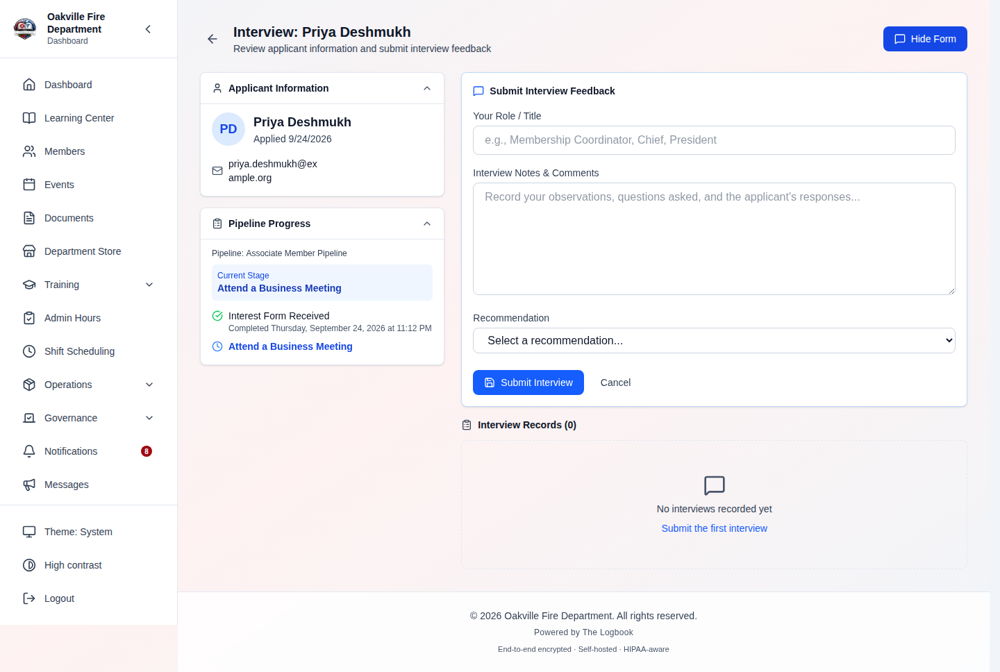

### Edge Cases

| Scenario                      | Behavior                                                                                                                                                 |
| ----------------------------- | -------------------------------------------------------------------------------------------------------------------------------------------------------- |
| Edit interview                | Only the original interviewer can edit                                                                                                                   |
| Multiple interviews           | Multiple records supported; each interviewer files their own                                                                                             |
| Interviewer's account deleted | The interview stays on the applicant's record under the interviewer's name. Only a permanently deleted account leaves it reading **Unknown Interviewer** |

---

## Election Vote Stage

When an applicant reaches an **Election Vote** stage — by **Advance**, a drag on the board, bulk advance, **Skip**, **Back**, being placed on it, a stage deletion that moves them onto it, auto-advance, or a pipeline that opens on its vote — the server creates one **election package** for them, containing:

- **Applicant snapshot** — Name, email, phone, address, date of birth (frozen at time of package creation)
- **Documents** — All uploaded documents from previous stages
- **Stage history** — Summary of completed stages
- **Supporting statement** — Editable by coordinator (shown to voters)
- **Coordinator notes** — Internal notes (not shown to voters)

> **Created on the server, once, by every route** _(2026-09-30)_. The package
> used to be created only by the browser, in a second request after a single
> **Advance**. Bulk advance, Skip, Back, placing a stageless applicant, a stage
> deletion's fallback and a pipeline that opened on its vote all landed
> applicants on the vote with no package: the drawer promised one would be
> "auto-generated" and none ever was, so they never appeared among
> ballot-ready packages. Re-entering the stage by **Advance** could also stack
> a second draft. The server now creates it inside the same move, and
> re-entering the stage reuses the package that exists.

**No package, no advance** _(2026-09-30)_. An applicant on a vote stage with no
election package cannot be advanced or converted past it: "This applicant has no
election package for this vote. Create one from the applicant's Election Package
section, then advance once the vote is recorded." That happens only to an
applicant who reached the stage before this change, or whose package was
deleted. The drawer's Election Package section says so — "This applicant has no
election package, so they cannot be put on a ballot or advanced past this stage
yet." — and offers **Create Package**. A pipeline with no vote stage is
unaffected.

### Package Workflow

| Status              | Description                            |
| ------------------- | -------------------------------------- |
| **Draft**           | Package created; coordinator reviewing |
| **Ready**           | Coordinator marked ready for ballot    |
| **Added to Ballot** | Secretary added to election            |
| **Elected**         | Membership vote passed                 |
| **Not Elected**     | Membership vote failed                 |

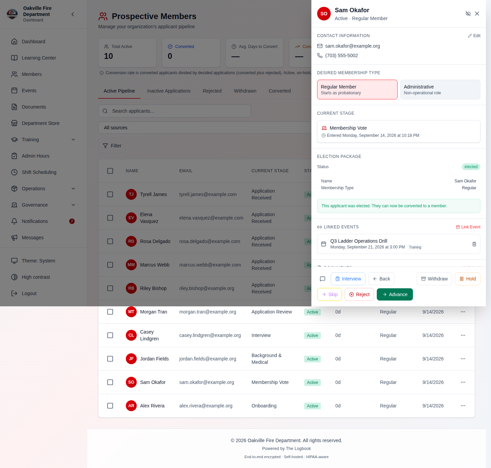

> **The ballot holds the stage.** Once a package reaches **Added to Ballot**,
> **Advance** is refused until the election closes and the result is recorded,
> and a package that comes back **Not Elected** is refused outright — reject or
> withdraw the application, or hold a new vote. This is what stops an applicant
> the department voted down from being advanced into membership.
>
> A department that holds its vote at a meeting and records the outcome by hand
> is unaffected so long as the package exists: one still **Draft** or **Ready**
> advances exactly as before. Nothing about the _result_ is gated until a
> package is actually put on a ballot. (A stage with **no** package is refused —
> see above.)

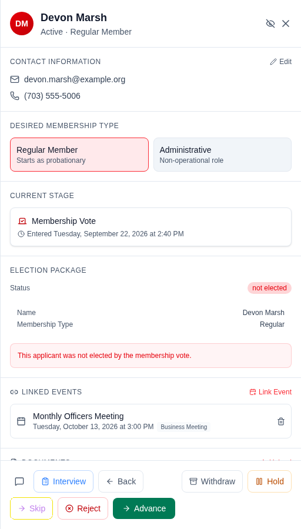

> **…and it holds Convert too** _(2026-09-14)_**.** The gate above originally
> covered **Advance** alone, which left the commoner route open: **Convert** is
> the button shown whenever an applicant is on the pipeline's last stage, and
> it is what a coordinator is told to use — the refusal on **Skip** says
> "convert or reject instead". It runs through a different code path and never
> consulted the package. So for a day, an applicant the membership had voted
> **down** could still be converted to a full member on a click, with the
> drawer beside the button reading _This applicant was not elected by the
> membership vote_.
>
> **Both buttons now refuse the same two states, with the same wording and the
> same way out.** This is not limited to pipelines with **Auto-transfer on
> approval** — a coordinator pressing Convert by hand is gated identically.

See [Elections & Voting > Prospective Member Election Packages](./14-elections.md#prospective-member-election-packages) for the voting workflow.

---

## Sign-offs: Multi-Signer Approval _(2026-09-28)_

A **Multi-Signer Approval** stage names the officers who must each approve an
applicant — "Require Chief and President to both approve". Those officers
rarely hold any prospective-members permission, so they sign from a page of
their own.

1. When an applicant reaches such a stage, each officer holding one of the named
   roles sees a **Needs you** row on their dashboard — "Alex Rivera is waiting on
   your sign-off", or "3 applicants are waiting on your sign-off" — with
   **Review**.
2. **Review** opens **Sign-offs** (`/prospective-members/sign-offs`): "Applicants
   waiting on your approval before they can become members." Each card shows the
   applicant's name, the stage and pipeline, the stage's description, and a pill
   per required role reading **signed** or **waiting**.
3. Click **Sign as Chief** (or whichever role you hold). The dialog says "Your
   name and role are recorded with the approval." Add an optional **Note** and
   click **Sign**; **Not now** backs out.
4. When the last named role signs, the stage completes and the applicant
   advances.

The page needs no pipeline permission — only the module switched on — and it
shows a signer the applicant's **name and stage only**, never their record:
holding the Chief's position is not a reason to read an applicant's address or
the coordinator's notes. It lists only stages asking for a role you hold. With
nothing waiting it reads **Nothing is waiting on you**.

In the applicant's drawer, **Approval Status** now reads the stage's configured
signers and who has signed. It used to report no data after a signature.

> **Before 2026-09-28 the stage was not enforced.** No screen let a signer
> record an approval, and Convert never checked required stages, so a
> coordinator could convert an applicant no officer had signed. Applicants
> already sitting on such a stage stay there until the named officers sign.

> **Screenshot needed:**
> _[Sign-offs page as an officer holding the Chief position → one applicant card on a "Chief and President approval" stage, with the pills reading "Chief: waiting" and "President: signed", and the **Sign as Chief** button.]_

---

## Converting to a Full Member

When an applicant has completed all pipeline stages:

> **If your pipeline ends in a membership vote, check the election package
> first.** Convert is refused while the package reads **Added to Ballot** and
> refused outright when it reads **Not Elected** — see [The ballot holds the
> stage](#election-vote-stage) above. A package still **Draft** or **Ready**
> converts normally.
>
> **Every Required stage must be complete** _(2026-09-28)_. Convert — and the
> automatic conversion after a final stage — is refused while any stage marked
> **Required** in the pipeline is not completed, and the refusal names it. A
> **skipped** stage does not count as complete; optional stages never hold
> conversion. Convert also grades the stage the applicant is on as if completing
> it, so an unsigned Multi-Signer Approval stage answers "Approval still needed
> from: …" naming who has not signed — see [Sign-offs](#sign-offs-multi-signer-approval-2026-09-28).
> If a stage is marked Required that your department does not actually enforce,
> clear its **Required** flag in Pipeline Settings rather than expecting Convert
> to step over it.

1. Click **Convert to Member** in the applicant detail view
2. **Step 1 — Review Applicant** summarises what is on file (name, email,
   phone, target membership type and role) so you can check it before an
   account is created. Click **Continue** to go on.
3. **Step 2 — Set Up Account** collects the details of the new member record:
   - **Member class** (Operational, Administrative or Social) and **Starting
     status** (Probationary or Regular) — Pre-filled from the pipeline's **When
     an Applicant Becomes a Member** setting for the applicant's desired type
     ("Pre-filled from this pipeline's conversion settings. Changing it here
     affects this applicant only."). **Convert to Member** stays disabled until
     both are set. Choosing Administrative clears and disables **Rank**
   - **Rank** — Starting rank, entered free-text (e.g. Firefighter)
   - **Station** — Assigned station, entered free-text
   - **Target Role** — Pre-filled from the application and changeable here:
     "Granted to the new member in addition to the default member position."
     It is held to **your** permissions — a role granting more than you hold is
     refused
   - **Middle Name** — Optional; the first and last name come from the
     application
   - **Hire Date** — Defaults to today, in the department's timezone
   - **Emergency Contact** — Optional name, relationship and phone
   - **How will they get their password?** _(2026-09-27)_ — one of:
     - **Email them a temporary password** (the default). Greyed out, with
       "Unavailable: email isn't set up for this department.", when email cannot
       send
     - **Set an initial password now** — type it twice (at least 12 characters)
       and give it to them yourself; they must change it at first sign-in
     - **Set it later** — "They can't sign in until you set one with Reset
       Password in Member Management."
   - **Notes (optional)** — up to 2,000 characters, recorded on the applicant's
     activity log with the conversion _(kept since 2026-09-30; before then the
     dialog collected notes and discarded them)_
4. Click **Convert to Member** to confirm. The conversion creates the member
   account and marks the applicant converted; it cannot be undone.
5. The result screen shows the **Membership #** the server assigned and says
   what is left to do: that the welcome email went out, that you should hand
   over the password you set, or — when you chose **Set it later**, or the
   email failed to send — that the member "has no password they know yet. Set
   one with Reset Password in Member Management before they can sign in."

> **Before 2026-09-27 a converted member could hold a password nobody knew.**
> The temporary password existed only in the welcome email, and the dialog said
> **Conversion Complete** whether or not that email went out — with email off,
> the account could not be signed in to and nothing said so. The result screen
> also read "Step 3 of 2".

**One applicant, one account.** Two coordinators converting the same applicant
at the same moment — or one person double-clicking — create exactly one member.
The second request waits for the first and is then refused with _Prospect has
already been transferred_.

### What Happens on Conversion

- A new **User** record is created with the applicant's info
- The member's **class** and **starting status** come from the pipeline's
  **When an Applicant Becomes a Member** setting (Pipeline Settings), chosen
  separately for operational applicants and administrative applicants. For
  example, a department can make administrative applicants **regular
  administrative** members while operational applicants start as
  **probationary operational** members. Automatic conversion after an election
  or final approval applies the same setting.
- A pipeline that has not changed the setting uses: operational applicants →
  probationary operational; administrative applicants → regular administrative
  _(before 2026-09-30, automatic conversion made every applicant a probationary
  operational member, whatever their desired type)_
- The member gets the default **Member** position plus the application's **Target Role**, if one was set _(applied since 2026-09-24; before then every converted member got the default position only, whatever the drawer showed)_
- A membership number is assigned if the department auto-generates them — never one held, or once held, by another member
- The password is delivered the way the dialog chose (email, set now, or later)
- Applicant status changes to **Converted**
- The `converted_to_member_id` field links to the new user
- Activity log records the conversion with timestamp

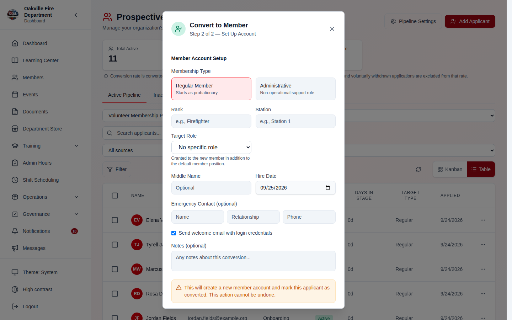

**[SCREENSHOT — REPLACE `15-09-convert-modal.png`.** The frame still shows the
Regular Member / Administrative cards and a **Send welcome email with login
credentials** checkbox. Step 2 now opens with **Member class** and **Starting
status** dropdowns (pre-filled, with the "Pre-filled from this pipeline's
conversion settings…" line under them), and the checkbox is replaced by the
**How will they get their password?** group of three radio buttons. Re-shoot
step 2 for a Regular applicant on a department with email set up, scrolled so
the class/status pair and the password group are both in frame.**]**

### Edge Cases

| Scenario                                              | Behavior                                                                                                                                                                                                                                                                                                                                                                                                                                                                                                                          |
| ----------------------------------------------------- | --------------------------------------------------------------------------------------------------------------------------------------------------------------------------------------------------------------------------------------------------------------------------------------------------------------------------------------------------------------------------------------------------------------------------------------------------------------------------------------------------------------------------------- |
| Email already exists as a member                      | Conversion blocked; shows existing member details. An email or username held by a **deactivated** member now gets a plain explanation instead of a server error _(2026-09-29)_                                                                                                                                                                                                                                                                                                                                                    |
| A **Required** stage is unfinished or skipped         | Conversion refused, naming the stage _(2026-09-28)_                                                                                                                                                                                                                                                                                                                                                                                                                                                                               |
| The Target Role grants more than you hold             | Refused: "This applicant's target position grants permissions beyond your own. Choose positions you can grant, or ask someone who holds them to convert this applicant." _(2026-09-30)_                                                                                                                                                                                                                                                                                                                                           |
| A typed membership number belonged to a former member | Refused — it is kept for them. See [Membership → Numbers are never reissued](./01-membership.md#numbers-are-never-reissued-2026-09-29)                                                                                                                                                                                                                                                                                                                                                                                            |
| Auto-transfer enabled on pipeline                     | Conversion happens automatically at final stage — **unless the ballot gate or a Required stage holds it**. It sends the welcome email after the conversion commits when email can send; when none goes out, the applicant's activity log says so and the approver gets an in-app notice _(2026-09-27)_. The Target Role is applied only if whoever chose it is still active and holds every permission it grants; otherwise the member gets the default position and the activity log says a leader must assign it _(2026-09-30)_ |
| Applicant converted without election vote             | Allowed if pipeline doesn't include an election stage                                                                                                                                                                                                                                                                                                                                                                                                                                                                             |
| Election package reads **Added to Ballot**            | Conversion refused until the election closes and the result is recorded _(2026-09-14)_                                                                                                                                                                                                                                                                                                                                                                                                                                            |
| Election package reads **Not Elected**                | Conversion refused outright — reject or withdraw, or hold a new vote _(2026-09-14)_                                                                                                                                                                                                                                                                                                                                                                                                                                               |
| Ballot closed but the result was never synced         | The applicant stays put. Record the result, or un-tick **Required** on the stage and **Skip**, which stays audited                                                                                                                                                                                                                                                                                                                                                                                                                |

### After Conversion, the File Stays Confidential _(2026-08-07)_

A prospective-membership record is **not the applicant's copy of their
application**. It carries interview notes, recommendations, reference checks,
election-package commentary and coordinator notes written in confidence by other
members — and it stays sensitive after the applicant is elected.

That is precisely when it used to become readable. A newly elected member who is
given `prospective_members.view` in their own right — a membership coordinator,
an officer — could open **the file that decided their own membership vote**.

A member can no longer see their own prospect record, at all:

- The detail page and every action on it return **"not found"**.
- The record is filtered out of the **prospect list** (and its total), the
  **kanban board**, the **pipeline statistics**, the **election-package list**,
  **label generation**, and the dashboard's **Prospective-member pipeline**
  widget — its counts, aging buckets and names.

> **Why "not found" rather than "you may not view this"?** A permission error
> would confirm the record exists and that there is something in it about them —
> which is itself the thing being protected.

**How you are matched to your own record.** By the conversion link
(`converted_to_member_id`); by an email address you own, department or personal;
or by full name **paired with a matching date of birth**.

> **Matching is deliberately conservative.** Name alone is not enough — two
> J. Smiths in one department is routine, and a false positive would hide a **real
> applicant** from the coordinator working their file. If a member reports that a
> prospect has vanished from the board and you can account for who they are, check
> whether the two records share a name _and_ a date of birth.

---

## Inactivity Timeout

Pipelines can be configured to automatically flag or deactivate stale applications.

### Configuration

Navigate to **Settings > Pipeline** and configure:

| Setting                | Options                                   | Description                                                  |
| ---------------------- | ----------------------------------------- | ------------------------------------------------------------ |
| **Timeout Preset**     | 3 months, 6 months, 1 year, Never, Custom | How long before an applicant is considered inactive          |
| **Warning Threshold**  | Percentage (default 80%)                  | Show warning when this percentage of timeout has elapsed     |
| **Notify Coordinator** | Yes/No                                    | Send notification when applicant approaches timeout          |
| **Auto-Purge**         | Yes/No                                    | Stored, but **not in effect** — nothing reads it (see below) |

### How It Works

1. System checks `last_activity_at` for each active applicant nightly
2. If elapsed time > warning threshold: applicant flagged with warning
3. If elapsed time > timeout: applicant marked as **Inactive**
4. ~~If auto-purge enabled and inactive for > purge days: applicant deleted~~ — **not wired.** See below

> **Auto-Purge does nothing yet** _(recorded 2026-09-30)_. The **Auto-Purge**
> setting and its grace period are stored, but no scheduled task reads them —
> nothing is ever purged automatically. Purge by hand from the **Inactive
> Applications** tab (below). Tracked in
> [KNOWN_LIMITATIONS.md](../KNOWN_LIMITATIONS.md#prospective-members--purge-is-manual-auto-purge-is-not-wired-2026-09-30).

### Per-Stage Override

Individual stages can override the pipeline timeout. For example, a background check stage might have a 180-day timeout (longer than the default 90 days) because background checks take time.

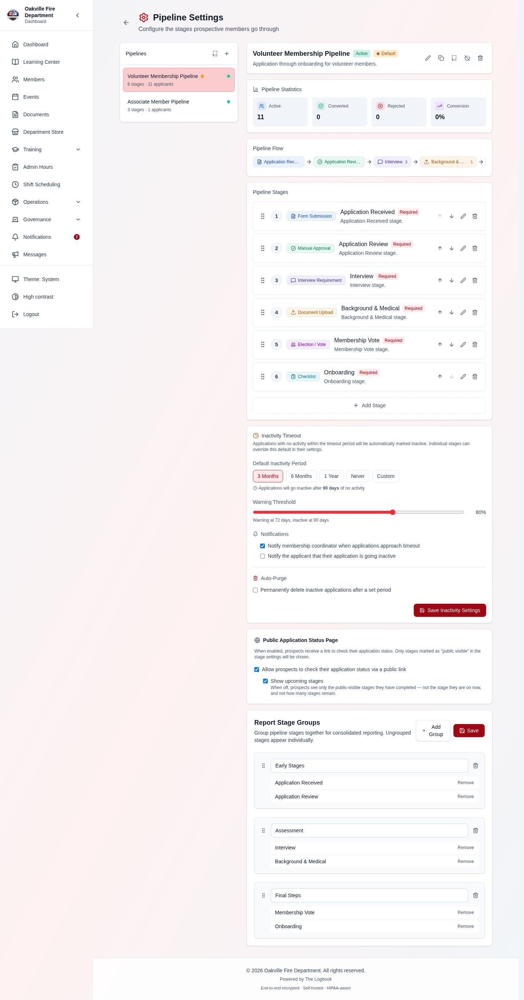

**[SCREENSHOT — REPLACE `15-10-pipeline-settings.png`.** Two changes below the
Inactivity Timeout card: a new **When an Applicant Becomes a Member** card
(Operational applicants / Administrative applicants, each with **Member class**
and **Starting status**, and **Save Conversion Settings**) sits between it and
the status-page card (2026-09-30); and the status-page card's copy now reads
"Let applicants check their application status through a public link", with
help text naming the "Show this stage on the public status page" checkbox and
the Enable Status Page stage (2026-09-29). Re-shoot the same full page.**]**

---

## Bulk Actions

Select multiple applicants on the pipeline dashboard to perform bulk actions:

1. Check the boxes next to applicant names — in **Table** view, the checkbox in
   the header row selects everything on the current page
2. **One action bar appears** above the board or table, reading "N selected":
   - **Print Badges** opens the label sheet for the selected applicants
   - **Advance Selected** moves each one to their next stage
   - **Hold Selected** puts all selected on hold
   - **Reject Selected** asks for an optional reason first, then **Confirm Rejection**
   - The **×** clears the selection without doing anything
   - On the **Inactive Applications** tab the bar offers **Reactivate** and **Purge Selected**
3. Confirm the bulk action

> **Renamed 2026-09-29.** The buttons read **Advance All**, **Hold All** and
> **Reject All**, which sounded like everyone in the pipeline. They act on the
> selection, and now say so.

### Purging inactive applications _(fixed 2026-09-30)_

On the **Inactive Applications** tab, select applications and click **Purge
Selected**. **Purge Applications** asks first — "This permanently deletes N
inactive application(s) and all of the personal data in them." — and
**Permanently Delete** does it.

- Only applications that are still **Inactive** are deleted — exactly what the
  tab lists. Withdrawn, rejected and on-hold applications are never purged.
- Their uploaded **documents are deleted from disk** before the records. If a
  file cannot be removed, nothing is deleted and the purge can be retried.
- The toast reports the server's count, not the selection's. If some were no
  longer inactive: "Purged 2 of 3 application(s). The rest are no longer
  inactive and were kept."
- The purge is recorded in the audit log (how many, and the ids asked for — no
  applicant details).

> **Before 2026-09-30 Purge deleted nothing.** It matched _withdrawn_
> applications, which the Inactive tab never lists, and the page toasted
> "Purged N" from the size of your selection regardless. If you purged before
> this date, those applications are still there.

> **There is no bulk delete of active applicants.** They are withdrawn or
> rejected, not deleted — this list previously named a **Delete** button that
> does not exist.

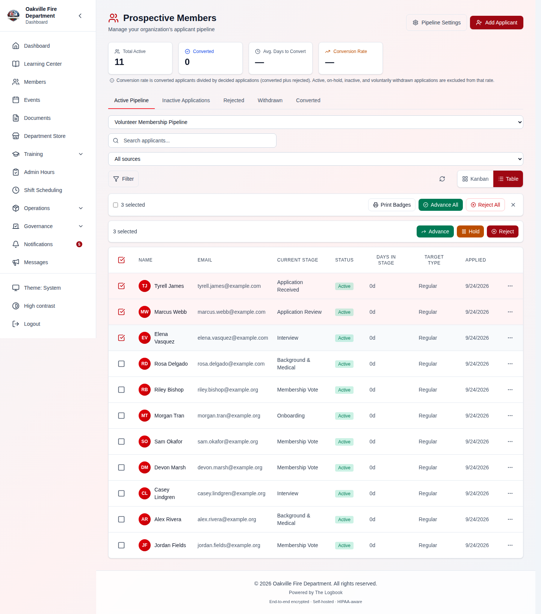

**[SCREENSHOT — REPLACE `15-11-table-bulk-actions.png`.** The bar's buttons now
read **Advance Selected**, **Hold Selected** and **Reject Selected** (2026-09-29).
Re-shoot the same selection in Table view.**]**

> **Table view used to show two bars** _(fixed 2026-09-24)_. Selecting rows in
> Table view stacked a second bar under the first, with **Advance** / **Hold** /
> **Reject**. The second bar is gone and its hold action (now **Hold Selected**)
> has moved onto the one that remains, so nothing was lost. It also now runs as a single request that
> names anyone it skipped, like the other bulk actions; the old **Hold** sent
> one request per applicant and could only report a count of failures.
>
> The header checkbox now shows a **minus** when only some rows are selected.
> It used to show the same tick as a full selection, so in light mode the two
> looked identical.

### Bulk actions now tell you who was skipped _(2026-08-08)_

A bulk action used to be a loop in your browser — one request per applicant, one
after another. Thirty selected applicants meant thirty round trips, each one
committing, sending stage email and auto-linking events. Worse, **every error
was discarded**: a partial failure came back as a bare count naming nobody, so
you could not tell which three of your thirty had not moved.

A bulk action is now **one request**, and the result is **itemized**. You get a
count of how many succeeded, how many did not, and for each failure the
applicant's name and the reason.

**One failure never stops the rest.** If applicant #7 is already at the final
stage, the other twenty-nine still advance.

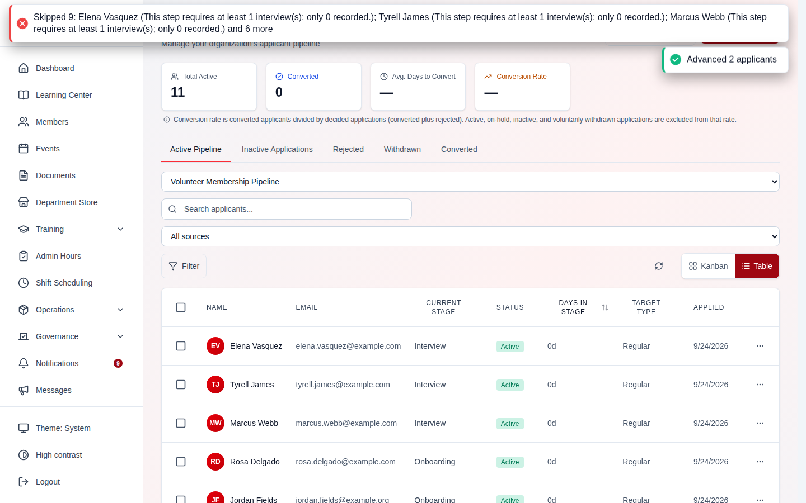

#### A rejection reason no longer overwrites your notes

When you bulk-reject or bulk-hold applicants, the **reason you type is recorded
in each applicant's activity log**. It does **not** go into the coordinator
notes field.

This matters because it used to. The old browser-side path sent your reason
through the update endpoint as `notes`, so **a bulk rejection silently
overwrote the coordinator notes on every applicant you had selected**. If you
performed bulk rejections before 2026-08-08 and your notes look wrong, check the
activity log — the original edit history is there.

#### Edge cases

| Situation                                         | What happens                                                                                                                                                       |
| ------------------------------------------------- | ------------------------------------------------------------------------------------------------------------------------------------------------------------------ |
| An applicant is **already at the final stage**    | Reported as skipped with that reason. The rest still advance                                                                                                       |
| An applicant has **no current stage**             | Same — skipped and named, not silently counted as moved                                                                                                            |
| **Your own applicant record** is in the selection | Reported as "not found". Coordinators who are themselves in a pipeline cannot act on their own file through a bulk action, exactly as they cannot open it directly |
| You select more than **200** applicants           | The request is refused. Work in batches — 200 is a guardrail on request size, not a page size                                                                      |
| A stage triggers an **automated email**           | It still sends, once per successfully advanced applicant                                                                                                           |

### "Advance" no longer claims success when nothing moved _(2026-08-08)_

Advancing an applicant who had nowhere to go — already at the final stage, or
with no current stage set — used to report **"Advanced"** and close the drawer,
with nothing actually changed. It also wrote an entry into the **audit log**
saying that applicant had been advanced.

That last part was the serious half. The audit log exists so a department can
reconstruct who moved whom through membership, and an entry describing a
movement that never happened undermines exactly that.

Both cases now return a clear error explaining the applicant has nowhere to
advance to, and **the audit entry is only written after a real advance**.

> If you are auditing membership decisions made before 2026-08-08, be aware that
> `prospect_advanced` entries may include no-op advances. Cross-check against the
> applicant's stage history rather than the audit entry alone.

---

## Pipeline Statistics & Reports

The pipeline dashboard shows summary statistics:

| Metric                      | Description                                 |
| --------------------------- | ------------------------------------------- |
| **Total Active**            | Currently active applicants                 |
| **In Progress**             | Applicants actively moving through stages   |
| **On Hold**                 | Paused applicants                           |
| **Approaching Timeout**     | Applicants nearing inactivity threshold     |
| **Conversion Rate**         | Percentage of applicants who become members |
| **Average Time to Convert** | Days from application to conversion         |
| **By Stage**                | Count of applicants at each pipeline stage  |

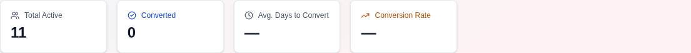

> **The cards now count the applicants the list is showing** _(2026-09-16)_.
> The cards and the applicant list are two separate requests, and they used to
> drift apart. Three things caused it, and all three are fixed:
>
> - **Converting, skipping, assigning a stage, advancing, moving back, holding
>   and bulk reactivating** refreshed the list and not the cards. Converting the
>   last two active applicants left **Total Active: 2** over an empty table with
>   **Converted: 0** beside it, which reads as two lost applicants. Every action
>   now refreshes both, and so does the **Refresh** button.
> - **A search or a source-event filter** narrowed the list but not the cards,
>   so a filter that matched nobody still showed a non-zero count. The cards now
>   count through the same search and event filter the list uses. The **status**
>   filter is deliberately _not_ applied to the cards — counting through it would
>   zero the Rejected, Withdrawn and Converted figures the same cards show.
> - **Switching pipelines quickly** could let a slow reply for the pipeline you
>   just left overwrite the one on screen. A late reply is now discarded.
>
> If you ever saw the header disagree with the table before this date, the
> table was right.
>
> **Resume** joined that list on 2026-09-30: resuming a held applicant used to
> refresh the rows and leave **Total Active** stale.

---

## Public Application Status Page

Applicants receive a link to check their application status without logging in:

- URL: `/application-status/:token`
- Shows: Current stage, completed stages, next steps — or, when the pipeline's
  **Show upcoming stages** is off, only the visible stages they have completed,
  with progress read as "N completed" rather than "N / M"
- Token is generated when the applicant is created and included in automated emails
- Token does not rotate on page view (stable link)
- If the page cannot reach the department — an outage, a dropped connection — it
  reads **Status Unavailable** with **Try again** _(2026-09-28)_. Only a link
  that really does not match an application reads **Application Not Found**; an
  outage used to tell the applicant their application did not exist

### Turning the page on for one applicant _(2026-09-25)_

The pipeline switch decides for everyone by default. An **Enable Status Page**
stage decides for each applicant who reaches it, overriding the switch either
way: an enabling stage turns their page on and emails them the link (with the
stage's optional message), a disabling stage turns it off and sends nothing,
and either then completes itself. The latest such stage an applicant has
reached wins; moving them back before it undoes it. The status page, the
self-withdrawal below and the email stages' tracker link all follow that
per-applicant answer. Until 2026-09-25 the stage could be configured but
nothing read it. Full detail in
[Membership → Enable Status Page Stages](./01-membership.md#enable-status-page-stages-2026-09-25).

### The applicant can withdraw _(2026-09-24)_

While the application is **active** or **on hold**, the page carries a "No
longer interested?" card with **Withdraw Application**. The dialog —
"Withdraw your application?" — takes an optional **Reason** ("Shared with the
department's membership coordinator.") and offers **Withdraw Application** or
**Keep My Application**.

- The application moves to the **Withdrawn** tab, and its activity log records
  that the applicant did it. A coordinator can reactivate it like any other.
- Holders of the **Membership Coordinator** and **Assistant Membership
  Coordinator** positions are emailed the applicant, pipeline, stage and reason.
  If nobody holds either, every member with `prospective_members.manage` is.
- The applicant is emailed a confirmation, dated in the department's timezone,
  from the **Application Withdrawn** template (Communications → Email Templates,
  under Members & Accounts), which the department can reword.
- Both emails are best-effort: neither failing undoes the withdrawal. Email only
  — no text messages.
- Applications in any other state (approved, converted, rejected) have no
  button; an applicant at that point contacts the department.

> **Screenshot needed:**
> _[Public Application Status page for an active applicant → the "Withdraw your application?" dialog open over the "No longer interested?" card, Reason filled in, with **Withdraw Application** and **Keep My Application**.]_

> **You cannot look up an applicant's link from inside the app** _(2026-08-13)_.
> The token is a credential — anyone holding it can read that applicant's
> progress without signing in — so it is deliberately withheld from every API
> response, including the applicant's own detail view and the kanban board.
> The only copy goes to the applicant, in the email the system sends them. If
> someone loses their link, re-send it from their record rather than looking
> for the URL to paste; there is nowhere in the interface that shows it.
>
> **Printed applicant badges carried it until 2026-09-28.** The label preview
> returned every applicant's token to staff and each printed badge encoded it —
> and since the token can now withdraw the application, that was a credential
> on a sticker. Badges print a short id now. Destroy any applicant badges
> printed before that date.

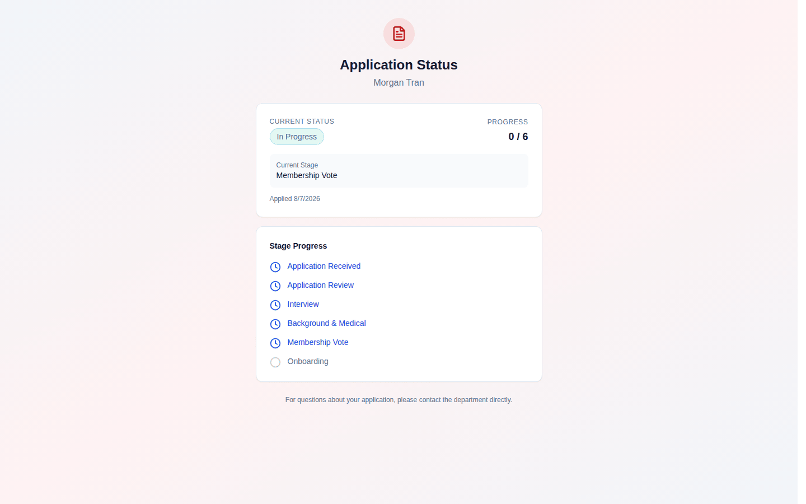

---

## Printing Labels

`/prospective-members/print-labels` prints badges for applicants — name labels
for a recruitment night or an open house. It needs `prospective_members.view`
or `prospective_members.manage` _(either since 2026-09-28; a coordinator holding
only manage used to get Access Denied from their own pipeline's button)_:

1. Select applicants from the pipeline dashboard using checkboxes
2. Click **Print Badges** in the selection bar
3. Choose label format and print

Each badge carries a short id for the applicant, not their status-page token.

See [Inventory > Cross-Module Barcode Label Printing](./05-inventory.md#cross-module-barcode-label-printing-2026-06-10) for label format options.

---

## Realistic Example: New Firefighter Application

### Background

**Oakville Fire Department** receives an application from **Alex Rivera**, who wants to join as a regular (volunteer) firefighter.

### Part 1: Application Received

Membership Coordinator **Lt. Morrison** creates the applicant:

- Name: Alex Rivera
- Email: alex.rivera@email.com
- Desired Membership Type: Regular Member
- Pipeline: Default Firefighter Pipeline

The pipeline has 6 stages:

1. Interest Form (auto-advance on form submission)
2. Application Review (manual)
3. Background Check (manual, 180-day timeout override)
4. Interview (meeting stage)
5. Membership Vote (election vote)
6. Welcome & Onboarding (automated email)

### Part 2: First Three Stages

**Stage 1 (Interest Form):** Alex receives an email with a link to the interest form. He fills it out → auto-advances to Stage 2.

**Stage 2 (Application Review):** Lt. Morrison reviews the application details, verifies references, and clicks **Advance**.

**Stage 3 (Background Check):** Lt. Morrison initiates the background check. After 3 weeks, the results come back clean. He uploads the results document and clicks **Complete Step** → advances to Stage 4.

### Part 3: Interview

**Stage 4 (Interview):** Alex is scheduled for an interview at the next meeting. Three officers conduct interviews and each files a record:

- Capt. Davis: **Recommend**
- Lt. Hernandez: **Recommend**
- FF Brooks: **Recommend with reservations** (notes: "Limited availability on weekday shifts")

Lt. Morrison reviews the interviews and advances Alex to Stage 5.

### Part 4: Membership Vote

**Stage 5 (Membership Vote):** An election package is automatically created with Alex's snapshot, uploaded documents, and a supporting statement written by Lt. Morrison.

Secretary Sarah Kim marks the package as **Ready for Ballot** and adds it to the December business meeting election as an approval vote item.

At the meeting, members vote:

- 35 Approve, 3 Deny → Alex is **Elected** (92% approval)

The package status updates to "Elected" and Lt. Morrison is notified.

### Part 5: Conversion

Lt. Morrison clicks **Convert to Member**:

- Member class and starting status: Operational, Probationary (the pipeline's default for a Regular applicant, pre-filled)
- Membership ID: Auto-generated (OFD-2026-047 — the department's pattern is `{PREFIX}{YYYY}-{SEQ}` with three digits)
- Rank: Probationary Firefighter
- Station: Station 1
- Password: **Email them a temporary password** — the result screen confirms the welcome email went out

Alex Rivera is now a full member of the Oakville Fire Department.

---

## Troubleshooting

| Issue                                                | Solution                                                                                                                                                                                                                                            |
| ---------------------------------------------------- | --------------------------------------------------------------------------------------------------------------------------------------------------------------------------------------------------------------------------------------------------- |
| Applicant stuck at form submission stage             | Check that the form is linked correctly. Verify the applicant received the form email.                                                                                                                                                              |
| Election package not created                         | Since 2026-09-30 every route onto an `election_vote` stage creates one. An applicant who reached the stage before then has none: use **Create Package** in the drawer's Election Package section.                                                   |
| Cannot convert applicant                             | The refusal names the reason: an unfinished or skipped **Required** stage, an unsigned sign-off ("Approval still needed from: …"), the ballot, an existing or deactivated member with the same email, or a Target Role granting more than you hold. |
| A signer cannot find where to sign                   | **Sign-offs** (`/prospective-members/sign-offs`), linked from their dashboard. It lists only stages asking for a role they hold — check the stage names their position.                                                                             |
| Converted member cannot sign in                      | If **Set it later** was chosen, or the welcome email failed, they have no password yet: set one with **Reset Password** in Member Management.                                                                                                       |
| Purge Selected removed nothing (before 2026-09-30)   | Purge matched withdrawn applications by mistake. Purge again; it now deletes the inactive applications you select.                                                                                                                                  |
| Inactive applications are never purged automatically | Expected: the Auto-Purge setting is not wired. Purge from the Inactive Applications tab.                                                                                                                                                            |
| Applicant stuck on an automated email stage          | The email did not send. Check Settings → Email and the applicant's address, then complete the stage by hand.                                                                                                                                        |
| Duplicate detection false positive                   | If the existing member is archived/dropped, you can create the new applicant and note the relationship.                                                                                                                                             |
| Public status page shows wrong stage                 | Token may be for a different applicant. Verify the token in the applicant's detail view.                                                                                                                                                            |
| Inactivity warning not triggering                    | Check pipeline inactivity settings. Verify the scheduled task is running.                                                                                                                                                                           |
| Documents not downloading                            | Check file storage configuration. Verify the document was uploaded successfully.                                                                                                                                                                    |
| Bulk advance fails for some applicants               | Applicants at the final stage cannot advance further. Check individual error messages.                                                                                                                                                              |

---

**Previous:** [Elections & Voting](./14-elections.md) | **Next:** [Integrations](./16-integrations.md)

## August 12–14, 2026 update

Active-email reconciliation, authenticated approvals, gated/final stage behavior, historical deleted interviewers, and applicant scrubbing are catalogued in [the technical release map](../CHANGE_AUDIT_2026-08-12_TO_14.md#release-map).
