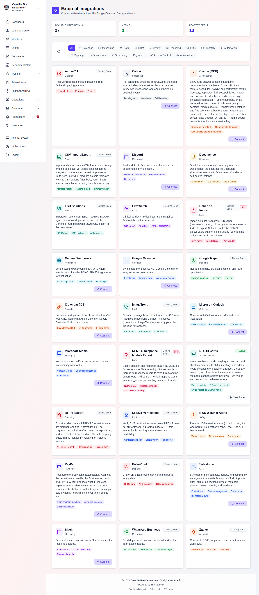
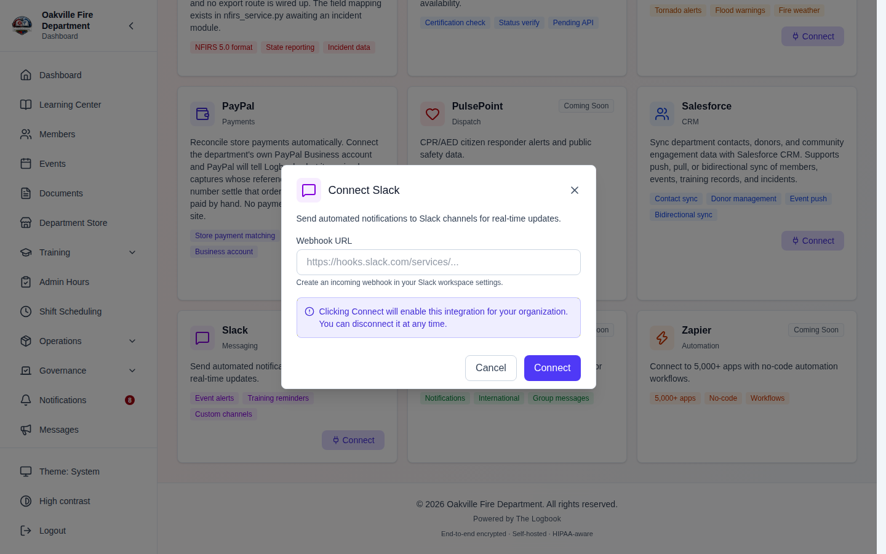
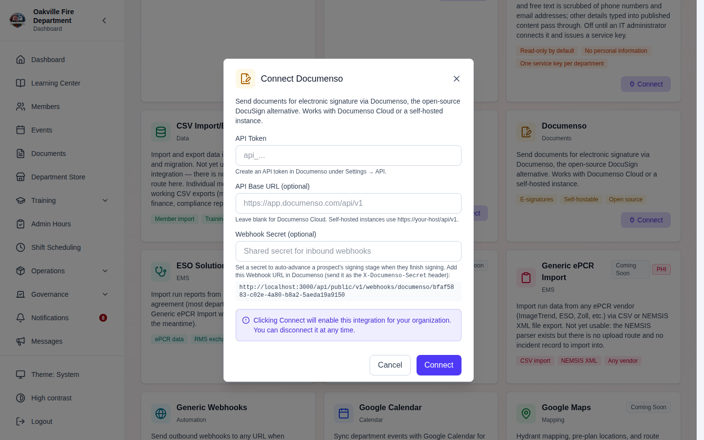
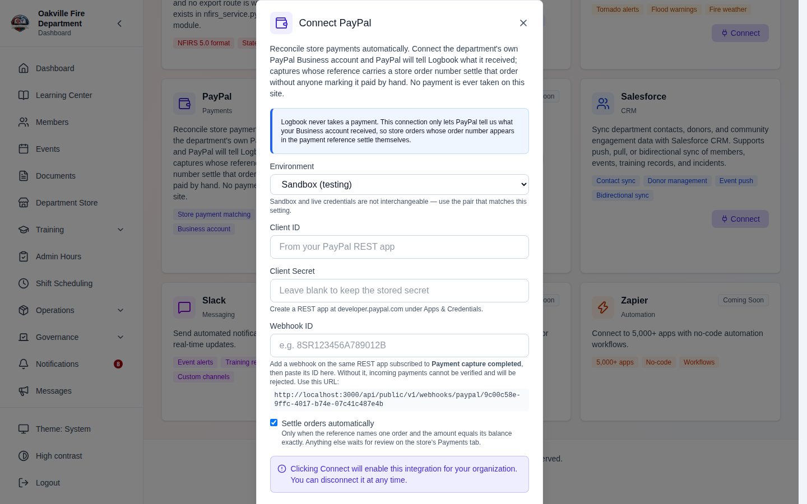
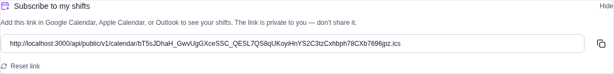

# Integrations

The Integrations module connects The Logbook to external services — calendar systems, messaging platforms, CRM tools, dispatch systems, and reporting agencies. Each integration is configured and managed from a central page.

---

## Table of Contents

1. [Integrations Overview](#integrations-overview)
2. [Integration Catalog](#integration-catalog)
3. [Connecting an Integration](#connecting-an-integration)
4. [Salesforce CRM](#salesforce-crm)
5. [Documenso — Document E-Signatures](#documenso--document-e-signatures)
6. [Cal.com — Interview Scheduling](#calcom--interview-scheduling)
7. [PayPal — Store Payment Reconciliation](#paypal--store-payment-reconciliation)
8. [Calendar Integrations](#calendar-integrations)
9. [Messaging Integrations](#messaging-integrations)
10. [Weather Alerts](#weather-alerts)
11. [EMS & Fire Reporting](#ems--fire-reporting)
12. [Generic Webhooks](#generic-webhooks)
13. [Training Provider Integrations](#training-provider-integrations)
14. [Monitoring Integration Health](#monitoring-integration-health)
15. [Troubleshooting](#troubleshooting)

---

## Integrations Overview

**Required Permission:** `settings.manage`

Navigate to **Settings > Integrations** (`/integrations`) to view and manage all external connections.

The integrations page shows:

- **Connected integrations** with status indicators (green = healthy, yellow = error)
- **Available integrations** that can be configured
- **Coming Soon** integrations planned for future releases
- Summary counts: connected vs available



---

## Integration Catalog

### Currently Available

| Category       | Integration        | Description                                                               |
| -------------- | ------------------ | ------------------------------------------------------------------------- |
| **Calendar**   | Google Calendar    | Two-way event sync                                                        |
| **Calendar**   | Microsoft Outlook  | Calendar and contact sync                                                 |
| **Calendar**   | iCalendar (ICS)    | Advertises the per-member shift feed; no configuration screen of its own  |
| **Messaging**  | Slack              | Event alerts, training reminders, custom channels                         |
| **Messaging**  | Discord            | Webhook notifications, event reminders                                    |
| **Messaging**  | Microsoft Teams    | Adaptive Cards, channel notifications                                     |
| **CRM**        | Salesforce         | Contact sync, donor management, bidirectional                             |
| **Documents**  | Documenso          | Send documents for e-signature (open-source DocuSign alternative)         |
| **Scheduling** | Cal.com            | Self-scheduling links and booking sync (open-source Calendly alternative) |
| **Payments**   | PayPal             | Match incoming store payments to department store orders automatically    |
| **Data**       | Generic Webhooks   | HMAC-signed event notifications to any URL                                |
| **Safety**     | NWS Weather Alerts | Tornado, flood, fire weather alerts (free)                                |

### Coming Soon

These carry a **Coming Soon** badge and no **Connect** button; the API refuses
`connect` on them outright.

| Integration                   | Description                       |
| ----------------------------- | --------------------------------- |
| Active911                     | Dispatch alerts and mapping       |
| CSV Import/Export             | Member import, training export    |
| ESO Solutions                 | ePCR data exchange                |
| FirstWatch                    | Dispatch analytics                |
| Generic ePCR Import           | CSV or NEMSIS XML from any vendor |
| Google Maps                   | Hydrant mapping and pre-plans     |
| ImageTrend                    | ePCR sync and run reports         |
| NEMSIS Response Module Export | NEMSIS 3.5 for state EMS          |
| NFIRS Export                  | NFIRS 5.0 for state fire marshal  |
| NREMT Verification            | Certification status verification |
| PulsePoint                    | CPR alerts and AED locations      |
| WhatsApp Business             | Notifications and group messages  |
| Zapier                        | Connect to 5,000+ apps            |

> **Corrected 2026-08-12.** Both tables were checked against the shipped
> catalog and five entries moved. **CSV Import/Export**, **Generic ePCR
> Import**, **NEMSIS Response Module Export** and **NFIRS Export** were listed
> as currently available and are `coming_soon`; **FirstWatch** was missing
> altogether. The Coming Soon table also named "NREMT Certification" and
> "ImageTrend ePCR", which are **NREMT Verification** and **ImageTrend** on the
> card.

---

## Connecting an Integration

1. Find the integration in the catalog
2. Click **Connect**
3. Fill in the configuration fields (vary by integration type)
4. Click **Test Connection** to verify credentials
5. Save to activate



---

## Salesforce CRM

The Salesforce integration provides **bidirectional sync** between The Logbook and Salesforce for contacts, training records, events, and donors.

### Configuration

| Field              | Description                                                                |
| ------------------ | -------------------------------------------------------------------------- |
| **Instance URL**   | Your Salesforce org URL (e.g., `https://yourorg.my.salesforce.com`)        |
| **Client ID**      | Connected App client ID from Salesforce Setup                              |
| **Client Secret**  | OAuth client secret                                                        |
| **Refresh Token**  | Optional OAuth refresh token; leave empty for a service-account connection |
| **Environment**    | `production` or `sandbox`                                                  |
| **Sync Direction** | `push` (Logbook → SF), `pull` (SF → Logbook), or `both`                    |

### Choose an Authentication Method

**Interactive connection (recommended for an administrator-managed org):**
select **Connect with Salesforce**. The authorization-code flow stores the
resulting refresh token encrypted and renews access tokens automatically.

**Service account (recommended for unattended scheduled sync):** create a
Salesforce Connected App with **OAuth 2.0 Client Credentials Flow** enabled,
select a dedicated least-privilege **Run As** integration user, enter the org's
My Domain URL plus the Connected App client ID and secret, and leave **Refresh
Token** empty. Do not enter or store the Run As user's password. The Run As user
needs **API Enabled** and only the object and field permissions required for the
selected sync types.

Before the first write, run the readiness check and preview. Create the
recommended `Logbook_*__c` external-ID fields: Contact matching can fall back to
email, but Task and Event pushes can duplicate records without their external
IDs.

### Sync Types

| Action            | Description                                    |
| ----------------- | ---------------------------------------------- |
| **Push Members**  | Sync all active members to Salesforce contacts |
| **Push Training** | Sync training records and certifications       |
| **Push Events**   | Sync department events                         |
| **Pull Contacts** | Update existing Logbook members from Salesforce contacts — contact details only (names, phones, station, address). Never creates members, and never changes rank, email, status, or dates |

### How to Sync

1. Open **Sync** on the connected Salesforce card. A **Salesforce Sync** panel
   opens below the catalog, in two columns:
   - **Push to Salesforce** — _Members → Contacts_, _Training Records → Tasks_,
     _Events → Salesforce Events_
   - **Pull from Salesforce** — _Contacts → Members_. This one matches against
     members you already have (by id, then email) and updates their details;
     it never creates or deletes a member, and it needs the sync direction set
     to Pull or Bidirectional
2. Click the action you want. The result is reported as a toast with its
   success and failure counts
3. Below the two columns, a **readiness** check and a **dry-run preview** let
   you see what a push would do before running one

> **Corrected 2026-08-12.** There is no **Status** tab, no last-sync timestamp
> and no sync-history table anywhere in this panel — the retired screenshot
> placeholder asked for all three. A run's counts appear once, in the toast.
> The buttons are also named by what they map, not "Push Members".

### Field Mappings

The system maps internal fields to Salesforce fields automatically. View the current mapping via **View Field Mappings** on the integration detail page.

### Webhook Integration

Salesforce can push contact updates back to The Logbook via a webhook at `POST /api/v1/webhooks/salesforce`. The webhook validates the request signature before processing.

### Edge Cases

| Scenario                       | Behavior                                                                                         |
| ------------------------------ | ------------------------------------------------------------------------------------------------ |
| A Contact's **Title** (rank) is changed in Salesforce | Ignored on pull _(2026-08-12)_ — rank never syncs into The Logbook, because rank affects what a member can do here and Salesforce is not authoritative for it. The Logbook still **pushes** rank out to the Contact `Title`. If a member's rank looks wrong, fix it in The Logbook, not Salesforce |
| Salesforce API rate limit hit  | Retried up to three times, honoring `Retry-After` or using bounded exponential backoff           |
| A later SOQL result page fails | The pull fails; partial results are never applied as a successful pull                           |
| Field mapping mismatch         | Warning logged; unmatched fields skipped                                                         |
| Sandbox vs production mismatch | Warning shown; data won't sync to production from sandbox                                        |
| OAuth token expired            | Auto-refreshed transparently                                                                     |
| Conflict on bidirectional sync | There is no conflict-policy setting; the permitted direction determines which write applies last |

---

## Documenso — Document E-Signatures

**Documenso** is an open-source DocuSign alternative for sending documents out for electronic signature. Use it to collect signed waivers, membership agreements, or policy acknowledgments. Works with Documenso Cloud (`app.documenso.com`) or a self-hosted instance.

### Configuration

| Field                           | Description                                                                                         |
| ------------------------------- | --------------------------------------------------------------------------------------------------- |
| **API Token**                   | Create under **Settings > API** in your Documenso dashboard. Stored encrypted.                      |
| **API Base URL**                | Leave blank for Documenso Cloud. Self-hosted instances use `https://your-host/api/v1`.              |
| **Webhook Secret** _(optional)_ | A shared secret that enables automatic pipeline auto-advance when a document is signed (see below). |

After entering the token, click **Test Connection** to verify it.

### Auto-Advancing a Signing Stage (Webhooks)

When you set a **Webhook Secret**, the connect dialog shows a **callback URL**:

```
https://your-logbook-host/api/public/v1/webhooks/documenso/{integration_id}
```

Add this URL as a webhook in Documenso and have it send the secret in the `X-Documenso-Secret` header (or an HMAC-SHA256 body signature in `X-Documenso-Signature`). When a document is **completed** (all recipients signed), The Logbook matches the signer's email to a prospective member whose current stage is a Documenso-backed **Document Upload** stage and **advances them automatically** — no coordinator action needed.

> **Security:** The callback endpoint is rate limited (30 requests/minute per IP) and rejects any request that fails secret/signature verification. An integration with no webhook secret configured rejects all inbound webhooks.

### Using Documenso in the Membership Pipeline

Once Documenso is connected, a **Document Upload** pipeline stage gains a **Collection Method** option — switch it from _Upload_ to _Documenso e-signature_. Applicants then see a "Documents sent for signature" note on their public status page. See [Prospective Members Pipeline → Using Cal.com and Documenso in Stages](./15-prospective-members.md#using-calcom-and-documenso-in-stages).



---

## Cal.com — Interview Scheduling

**Cal.com** is an open-source Calendly alternative for scheduling. Use it to let applicants self-schedule interviews, ride-alongs, or station tours, and to surface upcoming bookings in The Logbook. Works with Cal.com Cloud (`cal.com`) or a self-hosted instance.

### Configuration

| Field                           | Description                                                                                        |
| ------------------------------- | -------------------------------------------------------------------------------------------------- |
| **API Key**                     | Create under **Settings > Developer > API keys** in Cal.com. Stored encrypted.                     |
| **API Base URL**                | Leave blank for Cal.com Cloud. Self-hosted instances use `https://your-host/api/v1`.               |
| **Webhook Secret** _(optional)_ | A signing secret that enables automatic pipeline auto-advance when an applicant books (see below). |

Click **Test Connection** to verify the key.

### Viewing Bookings

On the connected Cal.com card, click **Bookings** to see upcoming bookings pulled from your Cal.com account (title, attendee, time, and status).

### Auto-Advancing a Meeting Stage (Webhooks)

When you set a **Webhook Secret**, the connect dialog shows a **callback URL**:

```
https://your-logbook-host/api/public/v1/webhooks/calcom/{integration_id}
```

Add this URL as a Cal.com webhook subscribed to the **BOOKING_CREATED** event, using the same secret. Cal.com signs the body with HMAC-SHA256 and sends the `X-Cal-Signature-256` header. When an applicant books, The Logbook matches the attendee's email to a prospective member whose current stage is a Cal.com-backed **Meeting** stage and **advances them automatically**.

### Using Cal.com in the Membership Pipeline

Once Cal.com is connected, a **Meeting** pipeline stage gains a **Scheduling** option — switch it from _Manual_ to _Cal.com_ and paste your booking link. Applicants then see a **Schedule** button on their public status page. See [Prospective Members Pipeline → Using Cal.com and Documenso in Stages](./15-prospective-members.md#using-calcom-and-documenso-in-stages).

> **No screenshot of this _(2026-08-12)_.** The Bookings panel is real and
> works, but it lists bookings fetched live from your Cal.com account — there is
> nothing to photograph without a connected one, and our documentation
> environment has no third-party accounts. See
> [KNOWN_LIMITATIONS.md](../KNOWN_LIMITATIONS.md#integrations--no-detail-page-no-error-history-no-event-triggers-2026-08-12).

---

## PayPal — Store Payment Reconciliation

**PayPal** connects your department's own PayPal **Business** account so that incoming payments are matched to [Department Store](./18-storefront.md) orders automatically, instead of somebody ticking "mark paid" for each one.

**The Logbook never takes a payment.** This integration works in the opposite direction: PayPal tells The Logbook what it _received_. There is no checkout and no money passes through the application. Marking orders paid by hand still works exactly as before, and remains the only option for Venmo, Cash App, Zelle, cash and checks.

> **Why only PayPal?** Venmo publishes no API for personal or peer-to-peer transfers, and Zelle runs inside each bank's own app. PayPal is the only one of the common payment apps that can report back, so it is the only one that can settle an order without a person.

### Configuration

| Field                             | Description                                                                                                                                                                                |
| --------------------------------- | ------------------------------------------------------------------------------------------------------------------------------------------------------------------------------------------ |
| **Environment**                   | **Sandbox** (testing) or **Live**. Defaults to sandbox. Credentials are not interchangeable between the two.                                                                               |
| **Client ID** / **Client Secret** | From a REST app at [developer.paypal.com](https://developer.paypal.com) → **Apps & Credentials**. Stored encrypted, never displayed back. Leave blank when editing to keep what is stored. |
| **Webhook ID**                    | **Required.** PayPal assigns this when you add the webhook (below). Without it, incoming payments cannot be verified and are rejected.                                                     |
| **Settle orders automatically**   | On by default. See the matching rules below.                                                                                                                                               |

**Test Connection** verifies the credentials. It deliberately reports a _warning_ rather than a plain success when the Webhook ID is missing — credentials alone reconcile nothing.

### Adding the Webhook

The connect dialog shows the callback URL to paste into PayPal:

```
https://your-logbook-host/api/public/v1/webhooks/paypal/{integration_id}
```

In your PayPal REST app, add a webhook at that URL and subscribe it to **Payment capture completed** (`PAYMENT.CAPTURE.COMPLETED`) — and nothing else. Other event types are acknowledged and discarded, so subscribing to more only adds noise. Copy the Webhook ID PayPal assigns back into the connect dialog.

> **Security:** Every delivery is verified through PayPal's own signature-verification endpoint, rate limited per IP, replay-protected, and audit-logged. The PayPal capture ID is unique per organization, so a redelivered notification can never pay an order twice. A payment reported by one department's PayPal account can never settle another department's order.

### How Payments Are Matched

A payment settles an order automatically only when **both** hold:

1. The payment reference contains exactly one order number in `ORD-YYYY-NNNN` form — read from PayPal's `invoice_id`, `custom_id`, or note.
2. The amount equals that order's outstanding balance **exactly**.

Anything else is recorded and left for a person under **Store Admin > Payments**:

| Outcome               | Meaning                                                           |
| --------------------- | ----------------------------------------------------------------- |
| Applied               | Matched and settled                                               |
| Matched — not applied | Would have settled, but automatic settlement is turned off        |
| No order found        | The reference carried no order number                             |
| Needs a decision      | Amount doesn't match, or the order is cancelled or already square |
| Dismissed             | An administrator decided it wasn't a store payment                |

Fuzzy matching on payer name or amount alone was considered and rejected: two members can easily owe the same amount in the same order window, and crediting the wrong member's order is worse than a short wait in a queue.

Every inbound payment is recorded whether or not it matched. The unmatchable ones are the case that most needs a human — the money has already left the member's account, so discarding the notification would leave them chasing an order that still reads unpaid.

### Getting the Order Number onto the Payment

The matcher reads whatever reference the payer or the department attached:

- **PayPal invoices** — put the order number in the invoice reference field. Most reliable, and the one to prefer.
- **Payment links / checkout** — set `custom_id` to the order number.
- **Plain "send money"** — ask the member to put the order number in the note. This works, but depends on them typing it, so expect some payments in the review queue.

### Working the Review Queue

**Store Admin > Payments** lists everything unresolved. For each entry:

- **Apply to order** — settles the order. For an unmatched payment, enter the order to credit first. This writes through the normal payment path, so the order timeline, the member's receipt email, and the window rollups all behave as if it had been marked paid by hand.
- **Dismiss** — for payments that aren't store orders at all (a donation, a dues payment, a refund). An applied payment cannot be dismissed.



For the full store walkthrough, see [Department Store](./18-storefront.md).

---

## Calendar Integrations

### Google Calendar

Sync department events with Google Calendar:

1. Connect with Google OAuth credentials
2. Select which calendars to sync
3. Events created in The Logbook automatically appear in Google Calendar
4. Two-way sync updates events in both directions

### Microsoft Outlook

Sync with Outlook/Exchange calendars:

1. Connect with Microsoft 365 credentials
2. Events and contacts sync between platforms
3. Email notifications can be sent via Outlook

### iCalendar (ICS) Feed

The feed is **per member and private**, and it is not set up from this page.
Each member opens **Subscribe to my shifts** at the top of
**Scheduling > My Shifts**:

1. Opening the card mints that member's own feed token on first use
2. Copy the link, or select the field and copy it by hand
3. Subscribe in any calendar app (Google, Apple, Outlook)
4. The feed auto-updates as shifts change
5. **Reset link** issues a new token, which immediately kills the old URL —
   the way to revoke a link that has been shared or leaked



> **Corrected 2026-08-12.** This section described enabling "the ICS
> integration" on the Integrations page and copying **filtered feed URLs** —
> All Events, Training Only, My Shifts. There is one feed and it carries
> shifts: `GET /api/v1/calendar/{token}.ics`, served publicly and identified
> only by the token, with no filter parameter. The iCalendar entry in the
> integrations catalog advertises the feature but has no configuration screen
> behind it. Because the link is unauthenticated, treat it as a password: the
> card says so, and **Reset link** is there for when it gets out.

---

## Messaging Integrations

### Slack

1. Create an incoming webhook in your Slack workspace settings
2. Paste the webhook URL in the integration configuration
3. Messages appear in your configured Slack channel

### Discord

1. Create a webhook in your Discord server settings
2. Paste the webhook URL
3. Notifications appear as bot messages in your channel

### Microsoft Teams

1. Create an incoming webhook connector in your Teams channel
2. Paste the webhook URL
3. Notifications appear as Adaptive Cards with action buttons

> **You cannot choose which events post _(2026-08-12)_.** Earlier versions of
> this guide had a step for selecting event triggers and described checkboxes
> for New Member, Training Completed, Event Scheduled and Shift Change. There is
> no such control — a messaging integration collects a webhook URL and nothing
> more — and there is no Test Connection button on an integration. The Slack
> connect dialog is pictured under
> [Connecting an Integration](#connecting-an-integration). See
> [KNOWN_LIMITATIONS.md](../KNOWN_LIMITATIONS.md#integrations--no-detail-page-no-error-history-no-event-triggers-2026-08-12).

---

## Weather Alerts

The **NWS Weather Alerts** integration pulls tornado, flood, and fire weather warnings from NOAA — free, no API key required.

### Configuration

| Field           | Description                                                                |
| --------------- | -------------------------------------------------------------------------- |
| **NWS Zone ID** | Your area's zone code (format: `[STATE][C or Z][3DIGITS]`, e.g., `VAZ053`) |

### How It Works

- System checks the NOAA API hourly for active alerts in your zone
- Active alerts display on the department dashboard
- Alert types: Tornado Warning, Flood Warning, Fire Weather Watch, etc.

> **Hint:** Find your NWS Zone ID at [weather.gov/pdd/gis](https://www.weather.gov/pdd/gis) — search by county or zone.

---

## EMS & Fire Reporting

> **Not built yet — corrected 2026-08-12.** All three integrations in this
> section (**Generic ePCR Import**, **NEMSIS Response Module Export**, **NFIRS
> Export**) ship in the catalog with status `coming_soon`. Their cards carry a
> **Coming Soon** badge and no **Connect** button, and the API refuses them
> outright — `POST /integrations/{id}/connect` returns _"This integration is
> not yet available"_. There is no configuration screen behind any of them.
>
> The steps below describe the intended design, not current behaviour. The
> NFIRS screenshot placeholder has been removed rather than left standing for a
> screen that does not exist; the same applies to the state-code, FDID and
> date-range fields it named. The other `coming_soon` entries in the catalog are
> Active911, CSV Import/Export, ESO Solutions, FirstWatch, Google Maps,
> ImageTrend, NREMT Verification, PulsePoint, WhatsApp Business and Zapier.

### Generic ePCR Import

Import patient care report data from any ePCR vendor:

1. Export data from your ePCR system as CSV or NEMSIS XML
2. Navigate to the ePCR integration
3. Upload the export file
4. System parses and imports run/call data
5. Data feeds into scheduling reports and compliance tracking

Supported vendors: ImageTrend, ESO, Zoll, or any vendor that exports CSV/NEMSIS XML.

### NEMSIS Response Module Export

Export response data in NEMSIS 3.5 format for state EMS reporting:

1. Configure your state code and agency ID
2. Select the date range to export
3. Generate the NEMSIS XML file
4. Submit to your state EMS reporting system

### NFIRS Export

Export incident data in NFIRS 5.0 format for state fire marshal reporting:

1. Configure your state code and FDID (Fire Department ID)
2. Select the reporting period
3. Generate the NFIRS export file
4. Submit to your state fire marshal office

---

## Generic Webhooks

Send event notifications to any external system via HTTP POST:

### Configuration

| Field           | Description                                                   |
| --------------- | ------------------------------------------------------------- |
| **Webhook URL** | Your endpoint that receives POST requests                     |
| **Secret**      | Optional HMAC signing secret for `X-Webhook-Signature` header |

### Payload Format

```json
{
  "event": "member_created",
  "timestamp": "2026-06-27T14:30:00Z",
  "data": {
    "member_id": "...",
    "name": "John Smith",
    "email": "john@example.com"
  }
}
```

### Security

- Requests include an `X-Webhook-Signature` header (HMAC-SHA256 of the payload body)
- Your endpoint should validate the signature before processing
- Failed deliveries are retried with exponential backoff

### Available Events

Events you can subscribe to include: member created/updated, training completed, event scheduled, shift changed, inventory assigned, and more.

---

## Training Provider Integrations

Training provider integrations are configured from **Training Admin > Integrations** (separate from the general integrations page). See [Training & Certification > External Training Integrations](./02-training.md#external-training-integrations) for details.

Available training providers:

- **Vector Solutions** — Category catalog fetch, credit hours, auto-sync
- **Target Solutions** — Training record import
- **Lexipol** — Policy training sync
- **iAmResponding** — Response tracking
- **Custom API** — Generic webhook-based provider

---

## Monitoring Integration Health

The integrations dashboard shows health status for each connected integration:

| Indicator           | Meaning                                              |
| ------------------- | ---------------------------------------------------- |
| **Green checkmark** | Connected and healthy — last sync successful         |
| **Yellow warning**  | Connected but last sync failed — check error details |
| **Gray dot**        | Not connected — available to configure               |
| **Red X**           | Connection lost — credentials may have expired       |

> **There is no integration detail page _(2026-08-12)_.** This section used to
> say you could click an integration to see its last sync timestamp, last error
> message, consecutive error count and sync history. `/integrations` is the only
> page — the integrations are cards on it, and clicking one does not open
> anything further. Of those four figures only the **last sync timestamp** is
> recorded at all; there is no error message, error counter or sync history in
> the data model, and no **Retry Sync** control anywhere. What you get is the
> status on the card itself. See
> [KNOWN_LIMITATIONS.md](../KNOWN_LIMITATIONS.md#integrations--no-detail-page-no-error-history-no-event-triggers-2026-08-12).

---

## Troubleshooting

| Issue                                                   | Solution                                                                                                                                                                                                     |
| ------------------------------------------------------- | ------------------------------------------------------------------------------------------------------------------------------------------------------------------------------------------------------------ |
| Integration shows "Connection failed"                   | Verify credentials haven't expired. Click "Test Connection" to diagnose.                                                                                                                                     |
| Salesforce sync shows field mapping errors              | Check field mappings via the integration detail page. Ensure Salesforce fields exist.                                                                                                                        |
| Webhook not receiving events                            | Verify your endpoint is reachable from the internet. Check the webhook URL. Test with a curl command.                                                                                                        |
| Weather alerts not showing                              | Verify your NWS Zone ID is correct. Check that the NOAA API is responding.                                                                                                                                   |
| ICS feed not updating                                   | Allow up to 1 hour for calendar apps to refresh. Verify the feed URL is correct.                                                                                                                             |
| ePCR import fails                                       | Check the file format (CSV or NEMSIS XML). Ensure column headers match expected format.                                                                                                                      |
| Slack notifications not appearing                       | Verify the webhook URL in Slack workspace settings. Check channel permissions.                                                                                                                               |
| Documenso "connection failed"                           | Verify the API token under **Settings > API** and the base URL (self-hosted instances only).                                                                                                                 |
| Cal.com "connection failed"                             | Verify the API key under **Settings > Developer > API keys**.                                                                                                                                                |
| Signed document or booking didn't advance the applicant | Confirm the Webhook Secret matches on both sides, the callback URL is correct, the signer/attendee email matches the applicant, and the applicant's **current** stage is configured to use that integration. |
| OAuth token expired                                     | Most integrations auto-refresh tokens. If persistent, disconnect and reconnect.                                                                                                                              |
| PHI data in integration                                 | ePCR and medical integrations are flagged as containing PHI. Data is processed and deleted after import per HIPAA requirements.                                                                              |

---

## Realistic Example: Connecting Slack and Google Calendar

### Background

**Oakville Fire Department** IT Manager **Steve Park** wants to set up two integrations: Slack notifications for department events and Google Calendar sync so members see shifts on their personal calendars.

### Part 1: Connecting Slack (Monday Morning)

1. Steve navigates to **Settings > Integrations**
2. Finds **Slack** in the Messaging category → clicks **Connect**
3. In a separate browser tab, he opens Oakville FD's Slack workspace:
   - Goes to **Settings > Manage Apps > Incoming Webhooks**
   - Creates a webhook for the `#department-alerts` channel
   - Copies the webhook URL: `https://hooks.slack.com/services/T0ABC.../B0DEF.../xxxxx`
4. Back in The Logbook, pastes the webhook URL
5. Configures event triggers:
   - New Event Created: **On**
   - Shift Assignment: **On**
   - Training Completed: **On**
   - Member Joined: **On**
   - Equipment Check Failed: **On**
6. Clicks **Test Connection** → a test message appears in `#department-alerts`: "The Logbook connected successfully"
7. Clicks **Save**

That afternoon, Lt. Santos creates a training event "Q3 Hazmat Refresher" → a Slack notification automatically posts to `#department-alerts`:

> **The Logbook** — New Event: Q3 Hazmat Refresher
> Date: July 15, 2026 | 08:00 AM - 12:00 PM
> Location: Station 1 Training Bay
> RSVP by July 10

> **No screenshot here _(2026-08-12)_.** The Slack connect dialog and its
> webhook URL field are already pictured under
> [Connecting an Integration](#connecting-an-integration); the event-trigger
> checkboxes and Test Connection button this asked for do not exist. The other
> half — the Slack channel showing a delivered message — is outside the
> application and cannot be captured from our documentation environment.

### Part 2: Connecting Google Calendar (Monday Afternoon)

1. Steve navigates to **Integrations** → finds **Google Calendar** → clicks **Connect**
2. The system redirects to Google OAuth consent screen
3. Steve signs in with the department's Google Workspace account
4. Grants calendar read/write permissions
5. Back in The Logbook, selects which calendar to sync: "Oakville FD — Events"
6. Enables two-way sync:
   - Logbook → Google: Events created in The Logbook appear on Google Calendar
   - Google → Logbook: Not enabled (department creates all events in The Logbook)
7. Clicks **Save**

Members who subscribe to the "Oakville FD — Events" Google Calendar now see department events alongside their personal calendar.

### Part 3: Telling Members About the Shift Feed (Optional)

There is nothing for Steve to set up here. The ICS feed is minted per member,
on demand, the first time each of them opens **Subscribe to my shifts** on
**My Shifts** — so what Steve sends round is an instruction, not a URL:

> Open Scheduling → My Shifts, click **Subscribe to my shifts**, copy the link,
> and add it in your calendar app. It is yours alone — don't forward it. If you
> ever do, click **Reset link** and the old one stops working.

Pictured under [iCalendar (ICS) Feed](#icalendar-ics-feed) above.

> **Corrected 2026-08-12.** This step had Steve enabling the integration and
> the system generating three shared feed URLs — All Events, My Shifts and
> Training Only — for him to distribute. No such screen or URLs exist: there is
> one per-member feed, carrying shifts, at `/api/v1/calendar/{token}.ics`, and
> an officer never sees another member's. The retired screenshot placeholder
> also asked for a phone photographed showing a third-party calendar app, which
> is not a screen this application draws.

### Part 4: Monitoring Health (Ongoing)

The next week, Steve checks the integrations dashboard:

| Integration     | Status          | Last Sync        | Notes                           |
| --------------- | --------------- | ---------------- | ------------------------------- |
| Slack           | Green (healthy) | 2 hours ago      | 14 notifications sent this week |
| Google Calendar | Green (healthy) | 30 min ago       | 8 events synced                 |
| iCalendar (ICS) | Green (healthy) | N/A (pull-based) | 12 subscribers                  |

**Edge case encountered:** On Wednesday, Slack returns a 429 (rate limit) error during a bulk event creation. The Logbook retries with exponential backoff and succeeds on the second attempt. Steve sees a brief yellow warning that auto-resolves.

**Edge case:** A member reports their shift calendar shows UTC times instead of Eastern. Steve checks and the ICS feed correctly includes timezone metadata — the member's calendar app was set to UTC. Fixed on the member's device, not in The Logbook.

### Edge Cases

| Scenario                                            | Behavior                                                                                                                               |
| --------------------------------------------------- | -------------------------------------------------------------------------------------------------------------------------------------- |
| Slack webhook URL becomes invalid (channel deleted) | Integration shows red status; error: "channel_not_found". Reconnect with new URL.                                                      |
| Google OAuth token expires                          | Auto-refreshed transparently. If refresh fails, integration shows yellow with "Re-authenticate" button.                                |
| ICS feed subscriber exceeds rate limit              | Feed returns 429; subscriber's calendar app retries automatically.                                                                     |
| Two integrations send the same event notification   | Each integration sends independently — member may see duplicate notifications in Slack and email. Configure triggers to avoid overlap. |
| Webhook secret not configured                       | Notifications still send but without HMAC signature — receiving system cannot verify authenticity.                                     |
| Integration configured but module disabled          | Events from disabled modules don't trigger notifications (e.g., inventory disabled → no equipment alerts).                             |

---

**Previous:** [Prospective Members Pipeline](./15-prospective-members.md) | **Next:** [Privacy & Your Data](./17-privacy-data-rights.md)
