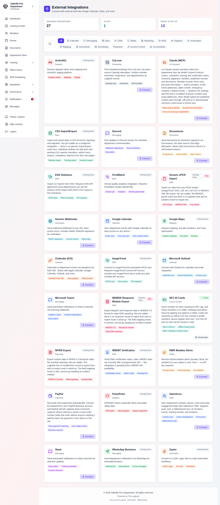
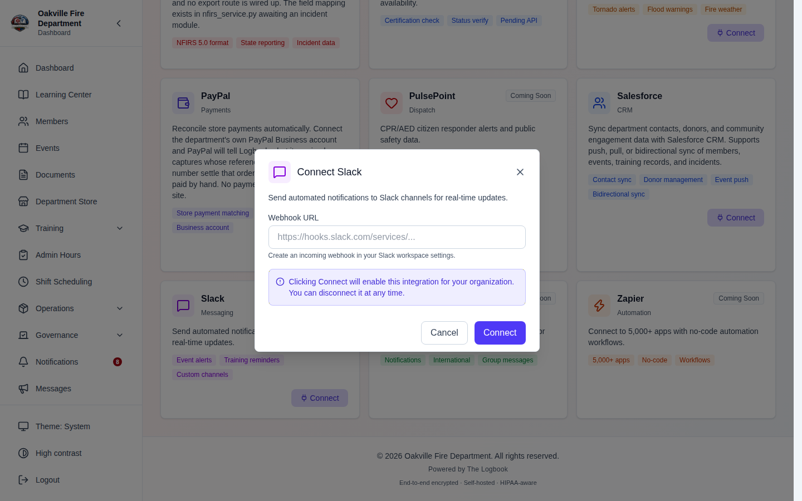
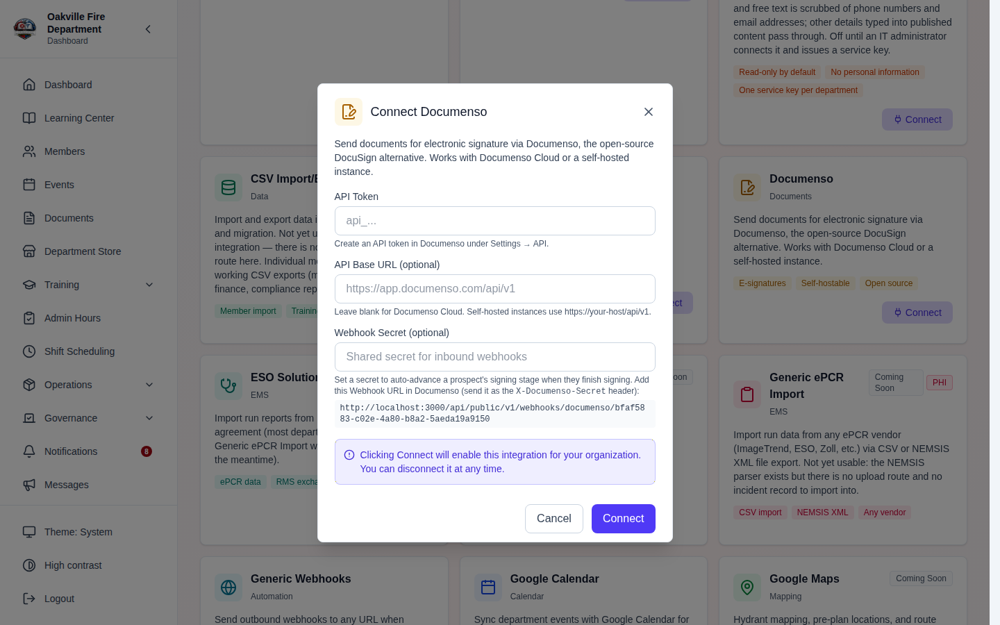
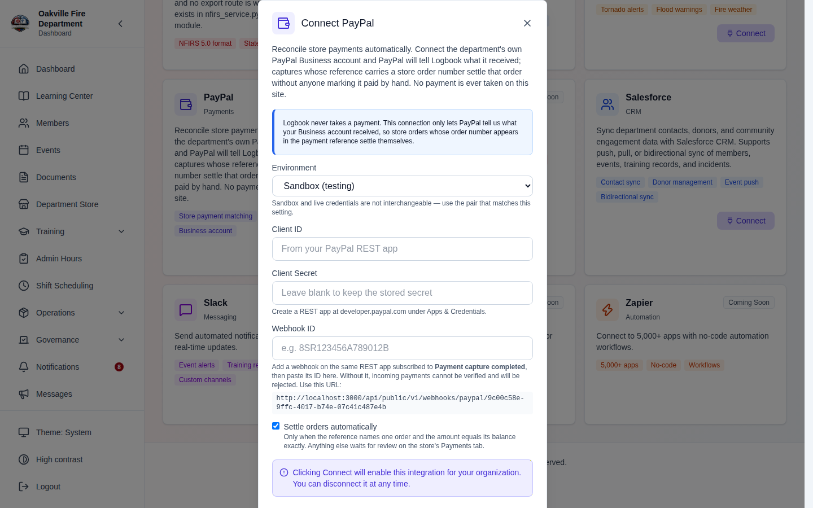
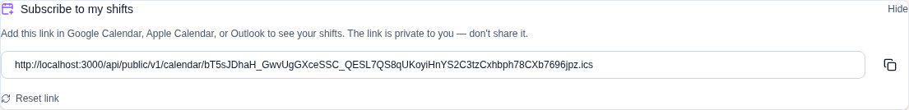
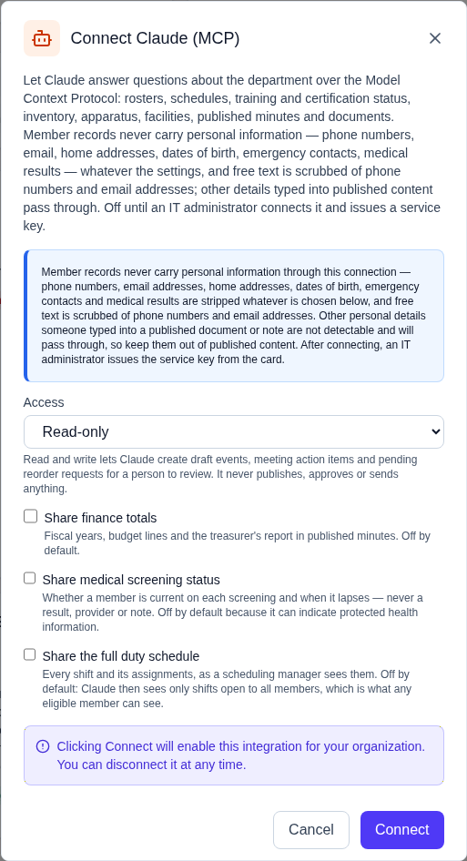
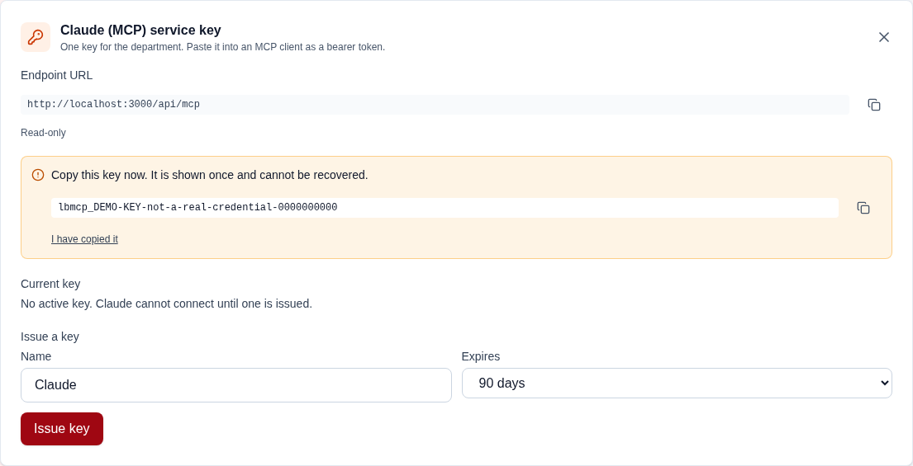

# Integrations

The Integrations module connects The Logbook to external services — calendar systems, messaging platforms, CRM tools, dispatch systems, and reporting agencies. Each integration is configured and managed from a central page.

---

## Table of Contents

1. [Integrations Overview](#integrations-overview)
2. [Integration Catalog](#integration-catalog)
3. [Connecting an Integration](#connecting-an-integration)
4. [Salesforce CRM](#salesforce-crm)
5. [Documenso — Document E-Signatures](#documenso--document-e-signatures)
6. [Cal.com — Interview Scheduling](#calcom--interview-scheduling)
7. [PayPal — Store Payment Reconciliation](#paypal--store-payment-reconciliation)
8. [Calendar Integrations](#calendar-integrations)
9. [Messaging Integrations](#messaging-integrations)
10. [Weather Alerts](#weather-alerts)
11. [EMS & Fire Reporting](#ems--fire-reporting)
12. [Generic Webhooks](#generic-webhooks)
13. [NFC ID Cards](#nfc-id-cards--tap-in-attendance)
14. [Training Provider Integrations](#training-provider-integrations)
15. [Monitoring Integration Health](#monitoring-integration-health)
16. [Troubleshooting](#troubleshooting)

---

## Integrations Overview

**Required Permission:** `settings.manage`

Navigate to **Settings > Integrations** (`/integrations`) to view and manage all external connections.

The integrations page shows:

- **Connected integrations** with status indicators (green = healthy, yellow = error)
- **Available integrations** that can be configured
- **Coming Soon** integrations planned for future releases
- Summary counts: connected vs available



---

## Integration Catalog

### Currently Available

| Category           | Integration        | Description                                                               |
| ------------------ | ------------------ | ------------------------------------------------------------------------- |
| **Calendar**       | Google Calendar    | Two-way event sync                                                        |
| **Calendar**       | Microsoft Outlook  | Calendar and contact sync                                                 |
| **Calendar**       | iCalendar (ICS)    | Advertises the per-member shift feed; no configuration screen of its own  |
| **Messaging**      | Slack              | Event alerts, training reminders, custom channels                         |
| **Messaging**      | Discord            | Webhook notifications, event reminders                                    |
| **Messaging**      | Microsoft Teams    | Adaptive Cards, channel notifications                                     |
| **CRM**            | Salesforce         | Contact sync, donor management, bidirectional                             |
| **Documents**      | Documenso          | Send documents for e-signature (open-source DocuSign alternative)         |
| **Scheduling**     | Cal.com            | Self-scheduling links and booking sync (open-source Calendly alternative) |
| **Payments**       | PayPal             | Match incoming store payments to department store orders automatically    |
| **Data**           | Generic Webhooks   | HMAC-signed event notifications to any URL                                |
| **Safety**         | NWS Weather Alerts | Tornado, flood, fire weather alerts (free)                                |
| **Access Control** | NFC ID Cards       | Issue member ID cards with an NFC tag and check members in by tapping one |

### Coming Soon

These carry a **Coming Soon** badge and no **Connect** button; the API refuses
`connect` on them outright.

| Integration                   | Description                       |
| ----------------------------- | --------------------------------- |
| Active911                     | Dispatch alerts and mapping       |
| CSV Import/Export             | Member import, training export    |
| ESO Solutions                 | ePCR data exchange                |
| FirstWatch                    | Dispatch analytics                |
| Generic ePCR Import           | CSV or NEMSIS XML from any vendor |
| Google Maps                   | Hydrant mapping and pre-plans     |
| ImageTrend                    | ePCR sync and run reports         |
| NEMSIS Response Module Export | NEMSIS 3.5 for state EMS          |
| NFIRS Export                  | NFIRS 5.0 for state fire marshal  |
| NREMT Verification            | Certification status verification |
| PulsePoint                    | CPR alerts and AED locations      |
| WhatsApp Business             | Notifications and group messages  |
| Zapier                        | Connect to 5,000+ apps            |

> **Corrected 2026-08-12.** Both tables were checked against the shipped
> catalog and five entries moved. **CSV Import/Export**, **Generic ePCR
> Import**, **NEMSIS Response Module Export** and **NFIRS Export** were listed
> as currently available and are `coming_soon`; **FirstWatch** was missing
> altogether. The Coming Soon table also named "NREMT Certification" and
> "ImageTrend ePCR", which are **NREMT Verification** and **ImageTrend** on the
> card.

---

## Connecting an Integration

1. Find the integration in the catalog
2. Click **Connect**
3. Fill in the configuration fields (vary by integration type)
4. Click **Test Connection** to verify credentials
5. Save to activate



**Outbound connections are checked and capped** _(2026-10-05)_. Before The
Logbook calls an address you give an integration (a webhook, Slack, Discord,
Teams, Cal.com, Documenso, audit-log shipping), it looks the name up once and
refuses to connect if the answer is an internal address, then connects to
exactly the address it checked. A hostname that resolves to a private or
metadata address now fails with an "unsafe URL" style refusal, so point
integrations at a public hostname. Google Calendar calls are also bounded: a
response over 10 MB is refused and a call that stalls times out after seconds
rather than hanging the sync. An integration that fails these checks shows as
**Connection failed**; a sync that times out simply tries again at its next run.
Connections made through a corporate proxy are not pinned, because the proxy
does its own lookup.

---

## Salesforce CRM

The Salesforce integration provides **bidirectional sync** between The Logbook and Salesforce for contacts, training records, events, and donors.

### Configuration

| Field              | Description                                                                |
| ------------------ | -------------------------------------------------------------------------- |
| **Instance URL**   | Your Salesforce org URL (e.g., `https://yourorg.my.salesforce.com`)        |
| **Client ID**      | Connected App client ID from Salesforce Setup                              |
| **Client Secret**  | OAuth client secret                                                        |
| **Refresh Token**  | Optional OAuth refresh token; leave empty for a service-account connection |
| **Environment**    | `production` or `sandbox`                                                  |
| **Sync Direction** | `push` (Logbook → SF), `pull` (SF → Logbook), or `both`                    |

### Choose an Authentication Method

**Interactive connection (recommended for an administrator-managed org):**
select **Connect with Salesforce**. The authorization-code flow stores the
resulting refresh token encrypted and renews access tokens automatically.

**Service account (recommended for unattended scheduled sync):** create a
Salesforce Connected App with **OAuth 2.0 Client Credentials Flow** enabled,
select a dedicated least-privilege **Run As** integration user, enter the org's
My Domain URL plus the Connected App client ID and secret, and leave **Refresh
Token** empty. Do not enter or store the Run As user's password. The Run As user
needs **API Enabled** and only the object and field permissions required for the
selected sync types.

Before the first write, run the readiness check and preview. Create the
recommended `Logbook_*__c` external-ID fields: Contact matching can fall back to
email, but Task and Event pushes can duplicate records without their external
IDs.

### Sync Types

| Action            | Description                                                                                                                                                                               |
| ----------------- | ----------------------------------------------------------------------------------------------------------------------------------------------------------------------------------------- |
| **Push Members**  | Sync all active members to Salesforce contacts                                                                                                                                            |
| **Push Training** | Sync training records and certifications                                                                                                                                                  |
| **Push Events**   | Sync department events                                                                                                                                                                    |
| **Pull Contacts** | Update existing Logbook members from Salesforce contacts — contact details only (names, phones, station, address). Never creates members, and never changes rank, email, status, or dates |

### How to Sync

1. Open **Sync** on the connected Salesforce card. A **Salesforce Sync** panel
   opens below the catalog, in two columns:
   - **Push to Salesforce** — _Members → Contacts_, _Training Records → Tasks_,
     _Events → Salesforce Events_
   - **Pull from Salesforce** — _Contacts → Members_. This one matches against
     members you already have (by id, then email) and updates their details;
     it never creates or deletes a member, and it needs the sync direction set
     to Pull or Bidirectional
2. Click the action you want. The result is reported as a toast with its
   success and failure counts
3. Below the two columns, a **readiness** check and a **dry-run preview** let
   you see what a push would do before running one

> **Corrected 2026-08-12.** There is no **Status** tab, no last-sync timestamp
> and no sync-history table anywhere in this panel — the retired screenshot
> placeholder asked for all three. A run's counts appear once, in the toast.
> The buttons are also named by what they map, not "Push Members".

#### Readiness and preview

The sync panel, and with it **Check readiness** and **Preview member sync**,
appears only while a Salesforce integration is **connected**. The endpoints
behind the two buttons (`GET /integrations/salesforce/readiness` and
`POST /integrations/salesforce/preview/members`) return 404 "Salesforce
integration is not connected" unless the integration is enabled and connected.

Neither result can carry a credential — the readiness result is built from four
keys and nothing else:

| Key                        | Carries                                                                                                                  |
| -------------------------- | ------------------------------------------------------------------------------------------------------------------------ |
| `connected`                | true/false                                                                                                               |
| `objects`                  | per-sObject: reachable, the **names** of any missing custom fields, and an error message if the object could not be read |
| `external_id_fields_ready` | true/false                                                                                                               |
| `ready`                    | true/false                                                                                                               |

There is no access token, refresh token, client secret, instance URL or request
body in it. When the connection itself fails, an `error` message is added — one
of the Salesforce client's own fixed messages, such as "Salesforce
authentication failed — the access token may be expired or revoked" or
"Salesforce returned HTTP {status}", or a generic message for any unexpected
failure. None quotes a credential or a response body.

The preview result is counts only — how many members would be created,
updated or adopted (matched to an existing Contact), and how many skipped — and
names no Salesforce record ids.

### Field Mappings

The system maps internal fields to Salesforce fields automatically. View the current mapping via **View Field Mappings** on the integration detail page.

### Webhook Integration

Salesforce can push contact updates back to The Logbook via a webhook at `POST /api/public/v1/webhooks/salesforce/{integration_id}`. The webhook validates the HMAC signature in the `X-Salesforce-Signature` header before processing, and rejects every request when the integration has no webhook secret configured. Each delivery is audit-logged with the object type, action, record counts and source IP — never the records' field values, the signature or the secret.

### Edge Cases

| Scenario                                                                                           | Behavior                                                                                                                                                                                                                                                                                           |
| -------------------------------------------------------------------------------------------------- | -------------------------------------------------------------------------------------------------------------------------------------------------------------------------------------------------------------------------------------------------------------------------------------------------- |
| A Contact's **Title** (rank) is changed in Salesforce                                              | Ignored on pull _(2026-08-12)_ — rank never syncs into The Logbook, because rank affects what a member can do here and Salesforce is not authoritative for it. The Logbook still **pushes** rank out to the Contact `Title`. If a member's rank looks wrong, fix it in The Logbook, not Salesforce |
| Salesforce API rate limit hit                                                                      | Retried up to three times, honoring `Retry-After` or using bounded exponential backoff                                                                                                                                                                                                             |
| Transient Salesforce failure (HTTP 500/502/503/504 on a read, or a network error fetching a token) | Retried up to three times with bounded backoff. Writes are not retried on a 5xx, so an ambiguous failure cannot create a duplicate record                                                                                                                                                          |
| Invalid Connected App credentials                                                                  | Not retried — the token request fails at once with "Failed to refresh Salesforce access token — verify your Connected App credentials"                                                                                                                                                             |
| A later SOQL result page fails                                                                     | The pull fails; partial results are never applied as a successful pull                                                                                                                                                                                                                             |
| Field mapping mismatch                                                                             | Warning logged; unmatched fields skipped                                                                                                                                                                                                                                                           |
| Sandbox vs production mismatch                                                                     | Warning shown; data won't sync to production from sandbox                                                                                                                                                                                                                                          |
| OAuth token expired                                                                                | Auto-refreshed transparently                                                                                                                                                                                                                                                                       |
| Conflict on bidirectional sync                                                                     | There is no conflict-policy setting; the permitted direction determines which write applies last                                                                                                                                                                                                   |

---

## Documenso — Document E-Signatures

**Documenso** is an open-source DocuSign alternative for sending documents out for electronic signature. Use it to collect signed waivers, membership agreements, or policy acknowledgments. Works with Documenso Cloud (`app.documenso.com`) or a self-hosted instance.

### Configuration

| Field                           | Description                                                                                         |
| ------------------------------- | --------------------------------------------------------------------------------------------------- |
| **API Token**                   | Create under **Settings > API** in your Documenso dashboard. Stored encrypted.                      |
| **API Base URL**                | Leave blank for Documenso Cloud. Self-hosted instances use `https://your-host/api/v1`.              |
| **Webhook Secret** _(optional)_ | A shared secret that enables automatic pipeline auto-advance when a document is signed (see below). |

After entering the token, click **Test Connection** to verify it.

### Auto-Advancing a Signing Stage (Webhooks)

When you set a **Webhook Secret**, the connect dialog shows a **callback URL**:

```
https://your-logbook-host/api/public/v1/webhooks/documenso/{integration_id}
```

Add this URL as a webhook in Documenso and have it send the secret in the `X-Documenso-Secret` header (or an HMAC-SHA256 body signature in `X-Documenso-Signature`). When a document is **completed** (all recipients signed), The Logbook matches the signer's email to a prospective member whose current stage is a Documenso-backed **Document Upload** stage and **advances them automatically** — no coordinator action needed.

> **Security:** The callback endpoint is rate limited (30 requests/minute per IP) and rejects any request that fails secret/signature verification. An integration with no webhook secret configured rejects all inbound webhooks.

### Using Documenso in the Membership Pipeline

Once Documenso is connected, a **Document Upload** pipeline stage gains a **Collection Method** option — switch it from _Upload_ to _Documenso e-signature_. Applicants then see a "Documents sent for signature" note on their public status page. See [Prospective Members Pipeline → Using Cal.com and Documenso in Stages](./15-prospective-members.md#using-calcom-and-documenso-in-stages).



---

## Cal.com — Interview Scheduling

**Cal.com** is an open-source Calendly alternative for scheduling. Use it to let applicants self-schedule interviews, ride-alongs, or station tours, and to surface upcoming bookings in The Logbook. Works with Cal.com Cloud (`cal.com`) or a self-hosted instance.

### Configuration

| Field                           | Description                                                                                        |
| ------------------------------- | -------------------------------------------------------------------------------------------------- |
| **API Key**                     | Create under **Settings > Developer > API keys** in Cal.com. Stored encrypted.                     |
| **API Base URL**                | Leave blank for Cal.com Cloud. Self-hosted instances use `https://your-host/api/v1`.               |
| **Webhook Secret** _(optional)_ | A signing secret that enables automatic pipeline auto-advance when an applicant books (see below). |

Click **Test Connection** to verify the key.

### Viewing Bookings

On the connected Cal.com card, click **Bookings** to see upcoming bookings pulled from your Cal.com account (title, attendee, time, and status).

### Auto-Advancing a Meeting Stage (Webhooks)

When you set a **Webhook Secret**, the connect dialog shows a **callback URL**:

```
https://your-logbook-host/api/public/v1/webhooks/calcom/{integration_id}
```

Add this URL as a Cal.com webhook subscribed to the **MEETING_ENDED** event, using the same secret. Cal.com signs the body with HMAC-SHA256 and sends the `X-Cal-Signature-256` header. Once the booked meeting has finished, The Logbook matches the attendee's email to a prospective member whose current stage is a Cal.com-backed **Meeting** stage and **advances them automatically**.

> **Subscribe `MEETING_ENDED`, not `BOOKING_CREATED`.** A booking is an
> intention, not attendance — advancing on it moved an applicant on the moment
> they picked a slot, weeks before the meeting. An attendee Cal.com has marked
> as a **no-show** is ignored, so a meeting nobody joined advances nobody. Cal.com
> cannot prove somebody was present, though: if your department needs presence
> recorded rather than assumed, leave the stage on manual advancement.
>
> **Older pipelines: fixed 2026-09-16.** A Meeting stage created under the
> pipeline's earliest stage format (an "action" stage whose action is
> _schedule meeting_) was never reached by this webhook, so a booking that
> should have advanced the applicant silently did nothing. It now advances them
> like any other Cal.com meeting stage.

### Using Cal.com in the Membership Pipeline

Once Cal.com is connected, a **Meeting** pipeline stage gains a **Scheduling** option — switch it from _Manual_ to _Cal.com_ and paste your booking link. Applicants then see a **Schedule** button on their public status page. See [Prospective Members Pipeline → Using Cal.com and Documenso in Stages](./15-prospective-members.md#using-calcom-and-documenso-in-stages).

> **No screenshot of this _(2026-08-12)_.** The Bookings panel is real and
> works, but it lists bookings fetched live from your Cal.com account — there is
> nothing to photograph without a connected one, and our documentation
> environment has no third-party accounts. See
> [KNOWN_LIMITATIONS.md](../KNOWN_LIMITATIONS.md#integrations--no-per-event-notification-triggers-2026-08-12).

---

## PayPal — Store Payment Reconciliation

**PayPal** connects your department's own PayPal **Business** account so that incoming payments are matched to [Department Store](./18-storefront.md) orders automatically, instead of somebody ticking "mark paid" for each one.

**The Logbook never takes a payment.** This integration works in the opposite direction: PayPal tells The Logbook what it _received_. There is no checkout and no money passes through the application. Marking orders paid by hand still works exactly as before, and remains the only option for Venmo, Cash App, Zelle, cash and checks.

> **Why only PayPal?** Venmo publishes no API for personal or peer-to-peer transfers, and Zelle runs inside each bank's own app. PayPal is the only one of the common payment apps that can report back, so it is the only one that can settle an order without a person.

### Configuration

| Field                             | Description                                                                                                                                                                                |
| --------------------------------- | ------------------------------------------------------------------------------------------------------------------------------------------------------------------------------------------ |
| **Environment**                   | **Sandbox** (testing) or **Live**. Defaults to sandbox. Credentials are not interchangeable between the two.                                                                               |
| **Client ID** / **Client Secret** | From a REST app at [developer.paypal.com](https://developer.paypal.com) → **Apps & Credentials**. Stored encrypted, never displayed back. Leave blank when editing to keep what is stored. |
| **Webhook ID**                    | **Required.** PayPal assigns this when you add the webhook (below). Without it, incoming payments cannot be verified and are rejected.                                                     |
| **Settle orders automatically**   | On by default. See the matching rules below.                                                                                                                                               |

**Test Connection** verifies the credentials. It deliberately reports a _warning_ rather than a plain success when the Webhook ID is missing — credentials alone reconcile nothing.

### Adding the Webhook

The connect dialog shows the callback URL to paste into PayPal:

```
https://your-logbook-host/api/public/v1/webhooks/paypal/{integration_id}
```

In your PayPal REST app, add a webhook at that URL and subscribe it to **Payment capture completed** (`PAYMENT.CAPTURE.COMPLETED`) — and nothing else. Other event types are acknowledged and discarded, so subscribing to more only adds noise. Copy the Webhook ID PayPal assigns back into the connect dialog.

> **Security:** Every delivery is verified through PayPal's own signature-verification endpoint, rate limited per IP, replay-protected, and audit-logged. The PayPal capture ID is unique per organization, so a redelivered notification can never pay an order twice. A payment reported by one department's PayPal account can never settle another department's order.

### How Payments Are Matched

A payment settles an order automatically only when **both** hold:

1. The payment reference contains exactly one order number in `ORD-YYYY-NNNN` form — read from PayPal's `invoice_id`, `custom_id`, or note.
2. The amount equals that order's outstanding balance **exactly**.

Anything else is recorded and left for a person under **Department Store >
Payments**:

| Outcome               | Meaning                                                           |
| --------------------- | ----------------------------------------------------------------- |
| Applied               | Matched and settled                                               |
| Matched — not applied | Would have settled, but automatic settlement is turned off        |
| No order found        | The reference carried no order number                             |
| Needs a decision      | Amount doesn't match, or the order is cancelled or already square |
| Dismissed             | An administrator decided it wasn't a store payment                |

Fuzzy matching on payer name or amount alone was considered and rejected: two members can easily owe the same amount in the same order window, and crediting the wrong member's order is worse than a short wait in a queue.

Every inbound payment is recorded whether or not it matched. The unmatchable ones are the case that most needs a human — the money has already left the member's account, so discarding the notification would leave them chasing an order that still reads unpaid.

### Payments the Webhook Missed

If PayPal cannot reach The Logbook, or The Logbook cannot confirm a delivery with PayPal, the notification is refused and PayPal eventually gives up retrying. Once a day The Logbook asks PayPal directly for the payments the account received in the last seven days and records any it does not already have — matched and settled by exactly the rules above. A payment is never recorded twice, whichever way it arrived.

This needs one extra setting on the PayPal side: in your REST app at [developer.paypal.com](https://developer.paypal.com), turn on the **Transaction Search** feature. Without it the daily check cannot see your payments, and the department's error monitor says so. PayPal's search lags by a few hours, so a missed payment shows up the following day rather than immediately.

### Getting the Order Number onto the Payment

The matcher reads whatever reference the payer or the department attached:

- **PayPal invoices** — put the order number in the invoice reference field. Most reliable, and the one to prefer.
- **Payment links / checkout** — set `custom_id` to the order number.
- **Plain "send money"** — ask the member to put the order number in the note. This works, but depends on them typing it, so expect some payments in the review queue.

### Working the Review Queue

**Department Store > Payments** (`/inventory/admin/store?tab=payments`) lists
everything unresolved. For each entry:

- **Apply to order** — settles the order. For an unmatched payment, enter the order to credit first. This writes through the normal payment path, so the order timeline, the member's receipt email, and the window rollups all behave as if it had been marked paid by hand.
- **Dismiss** — for payments that aren't store orders at all (a donation, a dues payment, a refund). An applied payment cannot be dismissed.



For the full store walkthrough, see [Department Store](./18-storefront.md).

---

## Calendar Integrations

### Google Calendar

Sync department events with Google Calendar:

1. Connect with Google OAuth credentials
2. Select which calendars to sync
3. Events created in The Logbook automatically appear in Google Calendar
4. Two-way sync updates events in both directions

### Microsoft Outlook

Sync with Outlook/Exchange calendars:

1. Connect with Microsoft 365 credentials
2. Events and contacts sync between platforms
3. Email notifications can be sent via Outlook

### iCalendar (ICS) Feed

The feed is **per member and private**, and it is not set up from this page.
Each member opens **Subscribe to my shifts** at the top of
**Scheduling > My Shifts**:

1. Opening the card mints that member's own feed token on first use
2. Copy the link, or select the field and copy it by hand
3. Subscribe in any calendar app (Google, Apple, Outlook)
4. The feed auto-updates as shifts change
5. **Reset link** issues a new token, which immediately kills the old URL —
   the way to revoke a link that has been shared or leaked



> **Corrected 2026-08-12.** This section described enabling "the ICS
> integration" on the Integrations page and copying **filtered feed URLs** —
> All Events, Training Only, My Shifts. There is one feed and it carries
> shifts: `GET /api/v1/calendar/{token}.ics`, served publicly and identified
> only by the token, with no filter parameter. The iCalendar entry in the
> integrations catalog advertises the feature but has no configuration screen
> behind it. Because the link is unauthenticated, treat it as a password: the
> card says so, and **Reset link** is there for when it gets out.

---

## Messaging Integrations

### Slack

1. Create an incoming webhook in your Slack workspace settings
2. Paste the webhook URL in the integration configuration
3. Messages appear in your configured Slack channel

### Discord

1. Create a webhook in your Discord server settings
2. Paste the webhook URL
3. Notifications appear as bot messages in your channel

### Microsoft Teams

1. Create an incoming webhook connector in your Teams channel
2. Paste the webhook URL
3. Notifications appear as Adaptive Cards with action buttons

> **You cannot choose which events post _(2026-08-12)_.** Earlier versions of
> this guide had a step for selecting event triggers and described checkboxes
> for New Member, Training Completed, Event Scheduled and Shift Change. There is
> no such control — a messaging integration collects a webhook URL and posts
> every notification the department sends. Use **Test** on the card to check a
> webhook, and the integration's **Details** page to see whether recent
> deliveries succeeded. The Slack connect dialog is pictured under
> [Connecting an Integration](#connecting-an-integration). See
> [KNOWN_LIMITATIONS.md](../KNOWN_LIMITATIONS.md#integrations--no-per-event-notification-triggers-2026-08-12).

---

## Weather Alerts

The **NWS Weather Alerts** integration pulls tornado, flood, and fire weather warnings from NOAA — free, no API key required.

### Configuration

| Field           | Description                                                                |
| --------------- | -------------------------------------------------------------------------- |
| **NWS Zone ID** | Your area's zone code (format: `[STATE][C or Z][3DIGITS]`, e.g., `VAZ053`) |

### How It Works

- System checks the NOAA API hourly for active alerts in your zone
- Active alerts display on the department dashboard
- Alert types: Tornado Warning, Flood Warning, Fire Weather Watch, etc.

> **Hint:** Find your NWS Zone ID at [weather.gov/pdd/gis](https://www.weather.gov/pdd/gis) — search by county or zone.

---

## EMS & Fire Reporting

> **Not built yet — corrected 2026-08-12.** All three integrations in this
> section (**Generic ePCR Import**, **NEMSIS Response Module Export**, **NFIRS
> Export**) ship in the catalog with status `coming_soon`. Their cards carry a
> **Coming Soon** badge and no **Connect** button, and the API refuses them
> outright — `POST /integrations/{id}/connect` returns _"This integration is
> not yet available"_. There is no configuration screen behind any of them.
>
> The steps below describe the intended design, not current behaviour. The
> NFIRS screenshot placeholder has been removed rather than left standing for a
> screen that does not exist; the same applies to the state-code, FDID and
> date-range fields it named. The other `coming_soon` entries in the catalog are
> Active911, CSV Import/Export, ESO Solutions, FirstWatch, Google Maps,
> ImageTrend, NREMT Verification, PulsePoint, WhatsApp Business and Zapier.

### Generic ePCR Import

Import patient care report data from any ePCR vendor:

1. Export data from your ePCR system as CSV or NEMSIS XML
2. Navigate to the ePCR integration
3. Upload the export file
4. System parses and imports run/call data
5. Data feeds into scheduling reports and compliance tracking

Supported vendors: ImageTrend, ESO, Zoll, or any vendor that exports CSV/NEMSIS XML.

### NEMSIS Response Module Export

Export response data in NEMSIS 3.5 format for state EMS reporting:

1. Configure your state code and agency ID
2. Select the date range to export
3. Generate the NEMSIS XML file
4. Submit to your state EMS reporting system

### NFIRS Export

Export incident data in NFIRS 5.0 format for state fire marshal reporting:

1. Configure your state code and FDID (Fire Department ID)
2. Select the reporting period
3. Generate the NFIRS export file
4. Submit to your state fire marshal office

---

## Generic Webhooks

Send event notifications to any external system via HTTP POST:

### Configuration

| Field           | Description                                                   |
| --------------- | ------------------------------------------------------------- |
| **Webhook URL** | Your endpoint that receives POST requests                     |
| **Secret**      | Optional HMAC signing secret for `X-Webhook-Signature` header |

### Payload Format

```json
{
  "event": "member_created",
  "timestamp": "2026-06-27T14:30:00Z",
  "data": {
    "member_id": "...",
    "name": "John Smith",
    "email": "john@example.com"
  }
}
```

### Security

- Requests include an `X-Webhook-Signature` header (HMAC-SHA256 of the payload body)
- Your endpoint should validate the signature before processing
- Failed deliveries are retried with exponential backoff

### Available Events

Events you can subscribe to include: member created/updated, training completed, event scheduled, shift changed, inventory assigned, and more.

---

## NFC ID Cards — Tap-In Attendance

Turns a member's ID card into the thing that records their attendance. Once the
integration is on, an officer binds a card to a member from the **ID Cards**
section of that member's profile, and the member taps it at a check-in station
to be checked into a shift, a meeting or an admin hours category.

**While the integration is off nothing exists** — no ID Cards section, no
station page, no navigation entry, and every card endpoint refuses. Turning it
off later stops issued cards working without deleting the record of who held
them.

### Issuing a card

Officers with `members.manage_id_cards` see **Issue card** on a member's
profile. Two ways to bind one, and the first is the better one:

| Option                           | Use it when                            | What is stored                                      |
| -------------------------------- | -------------------------------------- | --------------------------------------------------- |
| **Write a code to a blank card** | The tag is writable — a sticker, a fob | A freshly minted 128-bit code, written onto the tag |
| **Read a printed card's serial** | The card is already made and locked    | The chip's own serial number                        |

Prefer writing a code. It is unguessable, it is not printed anywhere on the
card, and the tag can be wiped and reissued to somebody else later — where a
card identified only by its chip serial is that member's forever.

On a desktop with no NFC radio, hold the card against a **USB reader** with the
cursor in the serial box, or type the serial printed on the card. Writing a code
needs Chrome on Android over HTTPS.

**Members cannot do any of this.** There is no self-service screen and no
member-facing endpoint: a card records attendance on somebody's behalf, so it is
issued the way a key is — by an officer, who hands it over.

### Running a station

**Members → Check-In Station** (`members.check_in`). Pick what members are
checking into, arm the reader, and leave the device at the door. Each tap shows
the member's name and what was recorded, then clears itself for the next person.

- **In, then out** — the default. One card serves arrival and departure.
- **Checks in** / **Checks out** — fix the direction when a second station
  covers the other door.

A card tapped again within a minute is treated as a bounce and reports the
current state rather than checking the member back out.

### Losing a card

Suspend it to stop it working temporarily. **Report lost** if it is gone: that
is permanent and cannot be undone, because whoever picked the card up can still
tap it. Issue a replacement afterwards — for a written card, that can be the
same tag rewritten.

---

## Training Provider Integrations

Training provider integrations are configured from **Training Admin > Setup > Integrations** — the **External Training Integrations** screen, separate from the general integrations page. See [Training & Certification > External Training Integrations](./02-training.md#external-training-integrations) for details.

Available training providers:

- **Vector Solutions** — Category catalog fetch, credit hours, auto-sync
- **Target Solutions** — Course and activity completions from the Training Records API (see below)
- **Lexipol** — Policy training sync
- **iAmResponding** — Response tracking
- **Custom API** — Generic webhook-based provider

**Matched completions become training records automatically** _(2026-10-07)_
for Vector Solutions, Target Solutions, Lexipol and iAmResponding: each sync
credits every completion whose member is matched, and only completions nobody
matches wait under **Imports**. A **Custom API** provider keeps the review step
— its completions wait under **Imports** for an officer. Each completion is
keyed by the provider's record id, so a re-sync updates it rather than crediting
it twice; a completion the provider sends without an id is keyed by member,
course and completion date instead.

### Setting up Target Solutions

> **Set up before 2026-09-29? Re-enter it.** Until then a Target Solutions
> provider was sent to the Vector Solutions API — a different credential,
> returning certifications rather than completions — so it imported nothing
> useful. Edit the provider, enter the key and secret as below, press **Test**,
> then **Sync Now**.

Target Solutions provides a **Training Records API** URL that looks like
`https://app.targetsolutions.com/tsapp/api/?action=reports.buildReport&reportType=completionsall&key=…&secret=…`.
Split it into three fields rather than pasting it whole:

| Field        | Enter                                        |
| ------------ | -------------------------------------------- |
| API Base URL | `https://app.targetsolutions.com/tsapp/api/` |
| API Key      | the value after `key=`                       |
| API Secret   | the value after `secret=`                    |

> **Screenshot needed:**
> _[Training Officer or admin (training.manage) at /training/admin?page=setup&tab=integrations → Add Provider → Target Solutions, details step: API Base URL with its helper text, API Key and API Secret \* holding only obviously fake values (demo-key / demo-secret) or empty, Enable Auto-Sync switched on (it starts off) with Pull new completions: Every hour and Daily 30-day review at 02:00 with its timezone helper. Never save, and never type a real key or secret.]_

The key and secret are stored encrypted and are never returned by the API or
shown again. A base URL that still contains a key, secret or token is
rejected, because the base URL is stored in plain text. The credentials are
also redacted from application logs, Sentry events, and any error message an
officer sees.

Each sync downloads the completions report for its date range. Members are
matched by the report's **Email** column against their Logbook email (ignoring
case and spaces; deleted members are skipped). When no email matches, the
report's **Employee ID** is matched against the member's **Membership Number**
_(2026-10-07)_, so keep the two numbers the same in both systems. A member who
cannot be matched yet is listed under **User Mappings**, and is matched
automatically on a later sync once their email or membership number is on file
— unless an officer has already set or cleared that mapping by hand.

To map a member by hand, pick the member from the user's dropdown under
**Mappings → Users** _(2026-10-04)_; their waiting completions move to that
member immediately.

**Matched completions are credited automatically** _(2026-10-07)_. A Target
Solutions sync turns every completion whose member is matched into a training
record straight away, the same as an upload and the same as the other named
providers; only completions nobody matches wait under **Imports**. When such a member is mapped later, their waiting
completions are imported with **Import** or **Bulk Import**.

Credit hours come from the report's **Duration (hours)** column — the hours the
course is accredited for — never from **Time Spent In Course**, which counts how
long the member had it open. A row with no duration credits no hours.

**Policy acknowledgments** _(2026-10-07)_. The report's **Assignment Type**
separates Target Solutions' own courses (**TS Course**) from items your
department authored (**Admin**) — the documents members must read and
acknowledge, usually every year because a federal or local rule requires it,
such as a whistleblower policy or a code of conduct. Admin rows are recorded
with the training type **Policy Acknowledgment**, with no hours, so they stay
apart from courses and appear in each member's training history under that
type.

A training requirement set only to the type **Policy Acknowledgment** is met by
an acknowledgment of _any_ policy. To require one particular policy every year,
map it to a library course and link the requirement to that course — see
**Course mappings** below.

Target Solutions records each acknowledgment click, so a member who opens the
same policy twice in one day appears twice. The second one on the same day is
kept under **Imports** marked **duplicate** and never becomes a training record.
An acknowledgment on a later day — next year's reading — is recorded as usual.

> **Screenshot needed:**
> _[Training Admin → Setup → Integrations → add a Target Solutions provider: the form with **API Base URL** `https://app.targetsolutions.com/tsapp/api/`, **API Key** and **API Secret \*** filled with placeholder values, and under **Sync Settings** **Enable Auto-Sync** on, **Pull new completions** set to **Every hour** and **Daily 30-day review at** 02:00. Use a demo key, never a real one.]_

### Syncing on a schedule

Under **Sync Settings**, turn on **Enable Auto-Sync**. A Target Solutions provider then runs two kinds of sync:

| Run                     | When                                                      | Asks Target Solutions for                                 |
| ----------------------- | --------------------------------------------------------- | --------------------------------------------------------- |
| **Pull**                | every hour by default (**Pull new completions**)          | completions since the last sync, at least since yesterday |
| **Daily 30-day review** | once a day, 02:00 by default (**Daily 30-day review at**) | every completion from the last 30 days                    |

Frequent pulls stay small, so a class someone finishes shows up under
**Imports** within about an hour. The review exists because Target Solutions
lets a completion be recorded for a past date, and a pull that only looks
forward from the last sync would never ask for it. Records already synced are
updated in place, matched by Transcript ID, so the overlap never creates
duplicates.

Details:

- The review time is in the department's timezone and keeps its local time
  across daylight-saving changes.
- The scheduler checks every 30 minutes, so each run starts within 30 minutes
  of its time.
- A newly enabled provider starts with a review, so its first sync brings in
  the last 30 days.
- A review that fails is retried on the next run until one succeeds.
- Auto-sync only runs for an active provider whose last **Test Connection**
  passed. Run a connection test after saving the provider.
- A completion **deleted** in Target Solutions is not removed here, because the
  report only lists completions that still exist.
- The provider card's **Auto-Sync** line shows both, e.g. "Every 1h · review
  daily at 02:00". Other providers show only "Every _N_h" and their form has a
  single **Sync Interval**, scheduled from the previous sync as before.

#### Course mappings _(2026-10-07)_

Target Solutions gives each course a **Course ID**, and issues a new one when it
publishes a new version — a new HIPAA video, a re-accredited CAPCE course, a
revised policy. Requirements link to courses in **your library**, not to
Target Solutions' IDs, so a new version never means editing a requirement:

1. Create the course once in the library (for example **HIPAA Awareness**) and
   link your annual requirement to it, with the requirement type **Courses**.
2. Open the provider's **Mappings → Courses** tab and map each Target Solutions
   course to its library course. Map every version to the same library course;
   completing any one of them meets the requirement.

Every course Target Solutions has sent appears on that tab, with how many
members completed it. An unmapped course that looks like one already in your
library — the same title once the ID in brackets and the "CAPCE" prefix are
set aside, or an earlier version you mapped — shows the suggestion with a
**Map to …** button. Nothing is mapped until an officer chooses; pick a
different course from the list if the suggestion is wrong.

**When a new version arrives**, everyone holding **training.manage** is emailed
_New Course Version to Map_, naming the course and the library course it looks
like. Each course is emailed about once. Officers who turned off **Training
officer duties** emails under their notification preferences are not emailed.
Courses that look like nothing in the library are listed on the tab without an
email.

**Mapping credits past completions.** Members who completed a new version
before it was mapped read as not current until it is; mapping it updates the
training records already imported from it, so they become current at once.
Unmapping takes the course back off those records. A record an officer linked
to a different course by hand is left alone either way.

**Categories come from the course.** Target Solutions sends no category, so an
imported completion is filed under its mapped library course's category — the
first of the course's categories that is still active. The order is: the
category an officer picks when importing, then a category mapping, then the
mapped course's category, then the **Bulk Import** default, then the provider's
default category. Mapping a course also files its earlier records under the
course's category, when they had none or only the provider's default; a
category someone chose is kept.

#### Uploading a report by hand _(2026-10-07)_

A Target Solutions provider card always has **Upload Report**, whether or not
the API key and secret are set and whether or not the last connection test
passed. A provider that was deleted accepts no uploads, as it accepts no syncs. Use it when the API is not set up yet, is not answering, or to load
history older than the 30-day review.

1. In Target Solutions, run the Training Records API report link (or download
   the completions report) and save it as a **CSV** file. The report's title
   lines above the column headings are fine to leave in.
2. On the provider card, choose **Upload Report** and pick the file (25 MB at
   most).

Completions whose member is matched — by email, then Employee ID — become
training records immediately, exactly as after a sync. Completions nobody
matches wait under **Imports**. The upload appears in the sync history as
an **upload**.

**Nothing is recorded twice.** Every completion is identified by its
**Transcript ID**. Uploading the same file again, uploading a report that
overlaps an API sync, or an API sync that later brings in a completion already
uploaded each update the one existing entry. A completion that is already a
training record is never credited again. An upload and a sync for the same
provider take turns rather than running over each other, and the database
itself refuses a second entry with the same Transcript ID.

> **On upgrade:** if two staged entries already shared a Transcript ID, the
> upgrade keeps one — the one already imported, else the oldest — and marks the
> others **duplicate**, with the original ID noted on them. Nothing is deleted,
> and no training record is changed.

#### When the connection test or a sync fails _(2026-10-07)_

The message says what Target Solutions actually sent back. The same text
appears after **Test Connection** and on a failed sync in the sync history.

| Message begins                                         | What to check                                                                                                                          |
| ------------------------------------------------------ | -------------------------------------------------------------------------------------------------------------------------------------- |
| Target Solutions rejected the API key or secret        | Re-enter the key and secret from Target Solutions' API settings.                                                                       |
| Target Solutions redirected the report request to …    | The message names where it pointed. A sign-in page means the key or secret was not accepted; anything else, check the base URL.        |
| Target Solutions has no report API at this address     | Set **API Base URL** to `https://app.targetsolutions.com/tsapp/api/`.                                                                  |
| Target Solutions returned a web page titled "…"        | The title is Target Solutions' own. Check the key and secret, and that the base URL is the API address rather than the website.        |
| Target Solutions returned a file without the … columns | Target Solutions answered, but not with the completions report. The quoted first line is its own wording, often naming the problem.    |
| Target Solutions had a server error                    | A problem on their side. Try again later; the next scheduled sync retries automatically.                                               |
| did not respond within … seconds / Could not connect   | Target Solutions or the network is unreachable from the Logbook server. Check the base URL and that the server can reach the internet. |

The key and secret are never shown in these messages, even when Target
Solutions' own page or file repeats them.

---

## Monitoring Integration Health

The integrations dashboard shows health status for each connected integration:

| Indicator           | Meaning                                              |
| ------------------- | ---------------------------------------------------- |
| **Green checkmark** | Connected and healthy — last sync successful         |
| **Yellow warning**  | Connected but last sync failed — check error details |
| **Gray dot**        | Not connected — available to configure               |
| **Red X**           | Connection lost — credentials may have expired       |

> **Integration detail page _(2026-10-05)_.** Click **Details** on any
> integration card to open its health page: last sync, last success, the last
> error and when it happened, how many runs in a row have failed, and its last
> 50 runs — syncs, connection checks and chat deliveries, each with what
> triggered it. **Retry sync** (Salesforce) re-runs the sync; for other
> integrations the same button reads **Retry connection check**. It can be
> pressed once a minute per integration. Error text is cleaned before it is
> stored, so it never shows a webhook URL, token or email address. Health is
> reported as _Healthy_, _Recent failure_, _Failing_ (three or more failures in
> a row) or _Not run yet_.

---

## Troubleshooting

| Issue                                                   | Solution                                                                                                                                                                                                     |
| ------------------------------------------------------- | ------------------------------------------------------------------------------------------------------------------------------------------------------------------------------------------------------------ |
| Integration shows "Connection failed"                   | Verify credentials haven't expired. Click "Test Connection" to diagnose.                                                                                                                                     |
| Salesforce sync shows field mapping errors              | Check field mappings via the integration detail page. Ensure Salesforce fields exist.                                                                                                                        |
| Webhook not receiving events                            | Verify your endpoint is reachable from the internet. Check the webhook URL. Test with a curl command.                                                                                                        |
| Weather alerts not showing                              | Verify your NWS Zone ID is correct. Check that the NOAA API is responding.                                                                                                                                   |
| ICS feed not updating                                   | Allow up to 1 hour for calendar apps to refresh. Verify the feed URL is correct.                                                                                                                             |
| ePCR import fails                                       | Check the file format (CSV or NEMSIS XML). Ensure column headers match expected format.                                                                                                                      |
| Slack notifications not appearing                       | Verify the webhook URL in Slack workspace settings. Check channel permissions.                                                                                                                               |
| Documenso "connection failed"                           | Verify the API token under **Settings > API** and the base URL (self-hosted instances only).                                                                                                                 |
| Cal.com "connection failed"                             | Verify the API key under **Settings > Developer > API keys**.                                                                                                                                                |
| Signed document or booking didn't advance the applicant | Confirm the Webhook Secret matches on both sides, the callback URL is correct, the signer/attendee email matches the applicant, and the applicant's **current** stage is configured to use that integration. |
| OAuth token expired                                     | Most integrations auto-refresh tokens. If persistent, disconnect and reconnect.                                                                                                                              |
| PHI data in integration                                 | ePCR and medical integrations are flagged as containing PHI. Data is processed and deleted after import per HIPAA requirements.                                                                              |

---

## Realistic Example: Connecting Slack and Google Calendar

### Background

**Oakville Fire Department** IT Manager **Steve Park** wants to set up two integrations: Slack notifications for department events and Google Calendar sync so members see shifts on their personal calendars.

### Part 1: Connecting Slack (Monday Morning)

1. Steve navigates to **Settings > Integrations**
2. Finds **Slack** in the Messaging category → clicks **Connect**
3. In a separate browser tab, he opens Oakville FD's Slack workspace:
   - Goes to **Settings > Manage Apps > Incoming Webhooks**
   - Creates a webhook for the `#department-alerts` channel
   - Copies the webhook URL: `https://hooks.slack.com/services/T0ABC.../B0DEF.../xxxxx`
4. Back in The Logbook, pastes the webhook URL
5. Configures event triggers:
   - New Event Created: **On**
   - Shift Assignment: **On**
   - Training Completed: **On**
   - Member Joined: **On**
   - Equipment Check Failed: **On**
6. Clicks **Test Connection** → a test message appears in `#department-alerts`: "The Logbook connected successfully"
7. Clicks **Save**

That afternoon, Lt. Santos creates a training event "Q3 Hazmat Refresher" → a Slack notification automatically posts to `#department-alerts`:

> **The Logbook** — New Event: Q3 Hazmat Refresher
> Date: July 15, 2026 | 08:00 AM - 12:00 PM
> Location: Station 1 Training Bay
> RSVP by July 10

> **No screenshot here _(2026-08-12)_.** The Slack connect dialog and its
> webhook URL field are already pictured under
> [Connecting an Integration](#connecting-an-integration); the event-trigger
> checkboxes and Test Connection button this asked for do not exist. The other
> half — the Slack channel showing a delivered message — is outside the
> application and cannot be captured from our documentation environment.

### Part 2: Connecting Google Calendar (Monday Afternoon)

1. Steve navigates to **Integrations** → finds **Google Calendar** → clicks **Connect**
2. The system redirects to Google OAuth consent screen
3. Steve signs in with the department's Google Workspace account
4. Grants calendar read/write permissions
5. Back in The Logbook, selects which calendar to sync: "Oakville FD — Events"
6. Enables two-way sync:
   - Logbook → Google: Events created in The Logbook appear on Google Calendar
   - Google → Logbook: Not enabled (department creates all events in The Logbook)
7. Clicks **Save**

Members who subscribe to the "Oakville FD — Events" Google Calendar now see department events alongside their personal calendar.

### Part 3: Telling Members About the Shift Feed (Optional)

There is nothing for Steve to set up here. The ICS feed is minted per member,
on demand, the first time each of them opens **Subscribe to my shifts** on
**My Shifts** — so what Steve sends round is an instruction, not a URL:

> Open Scheduling → My Shifts, click **Subscribe to my shifts**, copy the link,
> and add it in your calendar app. It is yours alone — don't forward it. If you
> ever do, click **Reset link** and the old one stops working.

Pictured under [iCalendar (ICS) Feed](#icalendar-ics-feed) above.

> **Corrected 2026-08-12.** This step had Steve enabling the integration and
> the system generating three shared feed URLs — All Events, My Shifts and
> Training Only — for him to distribute. No such screen or URLs exist: there is
> one per-member feed, carrying shifts, at `/api/v1/calendar/{token}.ics`, and
> an officer never sees another member's. The retired screenshot placeholder
> also asked for a phone photographed showing a third-party calendar app, which
> is not a screen this application draws.

### Part 4: Monitoring Health (Ongoing)

The next week, Steve checks the integrations dashboard:

| Integration     | Status          | Last Sync        | Notes                           |
| --------------- | --------------- | ---------------- | ------------------------------- |
| Slack           | Green (healthy) | 2 hours ago      | 14 notifications sent this week |
| Google Calendar | Green (healthy) | 30 min ago       | 8 events synced                 |
| iCalendar (ICS) | Green (healthy) | N/A (pull-based) | 12 subscribers                  |

**Edge case encountered:** On Wednesday, Slack returns a 429 (rate limit) error during a bulk event creation. The Logbook retries with exponential backoff and succeeds on the second attempt. Steve sees a brief yellow warning that auto-resolves.

**Edge case:** A member reports their shift calendar shows UTC times instead of Eastern. Steve checks and the ICS feed correctly includes timezone metadata — the member's calendar app was set to UTC. Fixed on the member's device, not in The Logbook.

### Edge Cases

| Scenario                                            | Behavior                                                                                                                               |
| --------------------------------------------------- | -------------------------------------------------------------------------------------------------------------------------------------- |
| Slack webhook URL becomes invalid (channel deleted) | Integration shows red status; error: "channel_not_found". Reconnect with new URL.                                                      |
| Google OAuth token expires                          | Auto-refreshed transparently. If refresh fails, integration shows yellow with "Re-authenticate" button.                                |
| ICS feed subscriber exceeds rate limit              | Feed returns 429; subscriber's calendar app retries automatically.                                                                     |
| Two integrations send the same event notification   | Each integration sends independently — member may see duplicate notifications in Slack and email. Configure triggers to avoid overlap. |
| Webhook secret not configured                       | Notifications still send but without HMAC signature — receiving system cannot verify authenticity.                                     |
| Integration configured but module disabled          | Events from disabled modules don't trigger notifications (e.g., inventory disabled → no equipment alerts).                             |

---

**Previous:** [Prospective Members Pipeline](./15-prospective-members.md) | **Next:** [Privacy & Your Data](./17-privacy-data-rights.md)

## August 23, 2026 update — NFC ID Cards

**NFC ID Cards is an integration**, not a always-present feature: Settings →
Integrations → **NFC ID Cards**. It starts **off**, and the switch is enforced
on the server, not only by hiding the screens — so nothing is reachable while
it is off.

The guard **fails closed**: a department whose integration catalog has never
been opened counts as not having turned it on. A fresh install therefore has no
live credential surface until somebody deliberately enables one.

Turning it off again is the intended way to stop cards already handed out from
working, **without deleting the records that say who held them**.

Two permissions to grant alongside it — neither is granted by the upgrade:

| Permission                | For                                               |
| ------------------------- | ------------------------------------------------- |
| `members.manage_id_cards` | Issuing, labelling, suspending and revoking cards |
| `members.check_in`        | Running a check-in station                        |

Full walkthrough:
[Membership → Member ID Cards and the Check-In Station](./01-membership.md#member-id-cards-and-the-check-in-station-2026-08-23).

## Claude (MCP) — asking questions of your Logbook _(2026-09-03)_

`/api/mcp` is a Model Context Protocol endpoint served by the existing backend
process, so Claude Code, the Messages API connector and (through a local bridge)
Claude Desktop can ask questions of a department's Logbook.

It appears in the integrations catalog as **Claude (MCP)**, category _AI
Assistants_.

> **It is off on every installation until an administrator connects it, and it
> answers nothing until an IT administrator issues a service key.** Both steps
> are deliberate and separate.





### What it can reach

**51 read tools** over the roster, events, shifts, training and certifications,
inventory, apparatus, facilities, meetings and published minutes, documents in
unrestricted folders, and elections.

**Three areas sit behind their own switches, all off by default:**

| Switch   | What it adds                                                                                                                        |
| -------- | ----------------------------------------------------------------------------------------------------------------------------------- |
| Finance  | Finance totals                                                                                                                      |
| Medical  | Medical-screening **status** only                                                                                                   |
| Schedule | The full duty schedule. Without it, the shift tools list only shifts open to all members — what any eligible member can already see |

**Three write tools** — draft an event, add a meeting action item, raise a
reorder request — sit behind a read/write switch, also off by default.

**Tools a department has not switched on are not even listed to the client.**

### Personal information never leaves

One redaction boundary is applied to **every** tool result. Stripped at every
depth: phone, mobile, work and personal email, home address, date of birth,
emergency contacts, photo, membership and certification numbers, login names,
medical results, credentials and tokens.

On top of that, **every string value is scrubbed of email addresses and phone
numbers**, so free text — a note, a description — cannot carry them out either.

### The service key

- One active key per organization.
- Stored as a **SHA-256 digest only**; the plaintext is shown in the UI exactly
  once and cannot be retrieved afterwards.
- Optional expiry or lifetime. **Rotation revokes the previous key.**
- Issuing and revoking require the new **`integrations.mcp_keys`** permission,
  which only the **IT Manager** position holds by default.
- Every tool call, issue and revocation is audit-logged.

### Setting it up

1. **Integrations → Claude (MCP) → Connect.** Choose the access mode and leave
   the three data switches off unless you want them.
2. **Issue a service key** from the Service key panel. Copy it immediately — it
   is shown once.
3. Point the client at `/api/mcp` with that key.

Full setup detail, including client configuration, is on the
`Integration-Claude-MCP` wiki page.

### Deployment notes

Stateless, JSON-response transport: any worker or replica answers any request,
and **no reverse-proxy change is needed** because it is served under `/api/`.

### Member sign-in (OAuth) _(2026-10-06)_

claude.ai custom connectors and Claude Desktop authenticate with OAuth instead
of a pasted key. **Member sign-in** lets each member connect one of those with
their **own account**: they sign in, see what the client asks for — and how
many tools each request would actually reach for them — and choose **Allow**
or **Don't allow**. The connection can then do only what that member can do in
The Logbook, within the switches above.

It is **off** until three things are true: the server operator sets
`MCP_OAUTH_ENABLED` and `MCP_OAUTH_ISSUER_URL`; an administrator ticks **Let
members connect with their own account** on the integration; and an IT
administrator registers the client (name, exact redirect URI, optional secret)
in the **Member sign-in (OAuth)** panel on the card.

- Members review and disconnect their own connections on the **Claude
  connections** page (`/claude/connections`), linked from the
  consent screen. It has no menu entry yet.
- Changing or resetting a password ends every connection the member holds.
- There is no self-service client registration; every client is registered by
  someone holding `integrations.mcp_keys`.

Full setup, including the claude.ai redirect URI, is on the
`Integration-Claude-MCP` wiki page.

## Integration errors no longer leak internals _(2026-08-31)_

Testing an integration's connection, or checking Salesforce sync readiness,
could show a raw internal or connection error message if the underlying network
call failed unexpectedly. Errors now show a generic message while the details
are still logged for troubleshooting.

The specific, intentional messages — "Salesforce rejected these credentials",
and its siblings — are unaffected.
