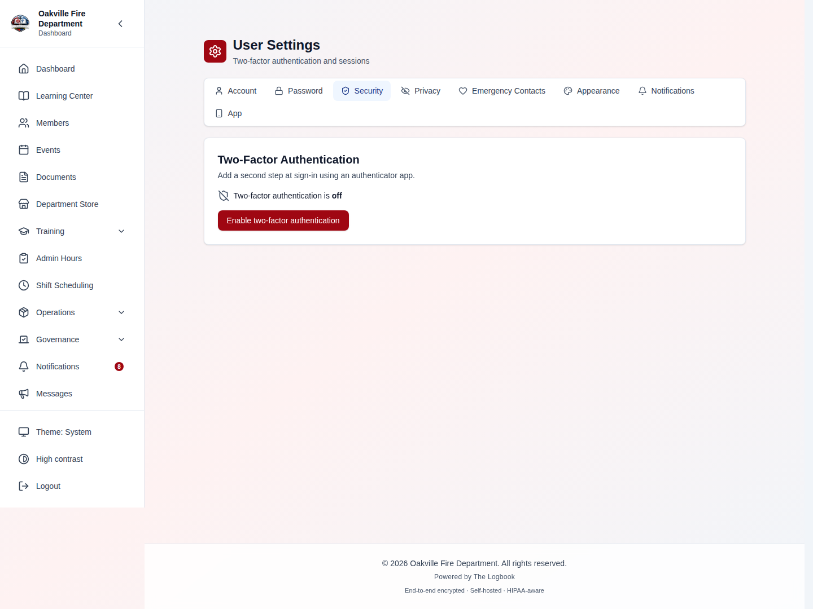
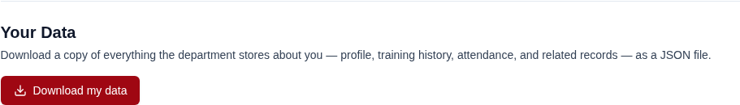

# Privacy & Your Data

The Logbook holds a lot of information about you: your contact details, your
training history, your attendance, and — if your department uses the Medical
Screening module — health screening records. This guide explains what you can
see and control about your own data, and what administrators configure on
behalf of the department.

Two audiences share this lesson. Sections 1–4 are for **every member**.
Sections 5–8 are for **administrators** who configure retention, handle
departures, and answer records requests.

---

## Table of Contents

1. [Your Privacy Choices](#your-privacy-choices)
2. [Downloading Your Data](#downloading-your-data)
3. [What Officers Can See](#what-officers-can-see)
4. [The Privacy Notice and Terms](#the-privacy-notice-and-terms)
5. [Records Retention (Admin)](#records-retention-admin)
6. [Anonymizing a Departed Member (Admin)](#anonymizing-a-departed-member-admin)
7. [Audit Records and Retention (Admin)](#audit-records-and-retention-admin)
8. [Answering a Records Request (Admin)](#answering-a-records-request-admin)
9. [Realistic Example: A Member Leaves the Department](#realistic-example-a-member-leaves-the-department)
10. [Troubleshooting](#troubleshooting)

---

## Your Privacy Choices

Some things the department may want to do with your information are optional —
they are not needed to run the department, so you decide.

Go to **My Account → Security → Privacy Choices**.

| Choice | What it means if you turn it on |
|--------|--------------------------------|
| **Photo use** | The department may use your photo in publications, on social media, and in other public material |
| **Public roster listing** | Your name and rank may appear on the department's public website roster |
| **Text message notifications** | The department may send you notifications by SMS at your mobile number |

Three things worth knowing:

- **Nothing here is required for membership.** Turning everything off does not
  affect your standing, your training records, or your ability to use the
  system.
- **"Not answered" counts as no.** If you have never made a choice, the label
  reads *(not answered)* and the department treats it exactly as if you had
  said no. Your silence is never read as permission.
- **You can change your mind at any time.** Every change is recorded with a
  timestamp, so there is always a clear record of what you agreed to and when.

> **Hint:** If you never receive department text messages, check this page
> first — SMS notifications require your explicit consent under US telephone
> consumer protection rules, so they are off until you turn them on.

> **Turning off texts does not turn off being notified.** The text-message choice
> controls only the **SMS** copy of a notification. Important department notices
> are always sent to your **email** as well — that email is the official record
> that you were informed, so consent can silence the text but never the notice
> itself. Keep your email address current under **My Account** for this reason.

---

## Downloading Your Data

You can download everything the system stores about you at any time.

1. Go to **My Account → Security**.
2. Scroll to **Your Data**.
3. Click **Download my data**.
4. A JSON file (`logbook-personal-data-export.json`) downloads to your device.

### What is in the export

| Included | Not included |
|----------|--------------|
| Profile, contact details, emergency contacts | Your password (only an unreadable hash is ever stored) |
| Training records, certifications, qualifications | Your two-factor authentication secret and backup codes |
| Shift, event, and meeting attendance | Password-reset and calendar-feed tokens |
| Admin hours, leaves of absence | Other members' records |
| Medical screening records about you | Reviewer-only internal notes on evaluations |
| Skill tests, dues, equipment assigned to you | |
| Your privacy choices | |
| A **summary** of your audit history (how many entries, first and last date) | The full audit entries themselves |

> **Hint:** The file is JSON — plain text in a structured format. Any text
> editor will open it. If you want it in a spreadsheet, most sections can be
> pasted into a JSON-to-CSV converter, or ask an officer to run a formatted
> report instead.

Two safeguards you may notice:

- **You can only ever export your own data.** The button and the endpoint
  behind it read your signed-in identity; there is no way to point it at
  someone else.
- **You are limited to three exports per hour.** Assembling the file reads
  every module's records, so the limit protects system performance. If you hit
  it, wait an hour and try again.

Every export is recorded in the audit log — not to discourage you, but because
"who accessed this data and when" is exactly what an audit trail is for.

---

## What Officers Can See

Access follows role, not rank alone. Officers and administrators see what
their duties require:

- **Contact details** are visible to other members only if your department has
  enabled contact-info visibility, and only the fields it has enabled (email,
  phone, mobile can each be shown or hidden). See
  [Administration & Reports > Contact Info Visibility](./08-admin-reports.md#contact-info-visibility).
  The setting is now enforced on *every* view of a member record
  *(2026-08-02)*, the individual profile page included. Two endpoints
  previously returned the full record regardless, so a member who was refused
  an email address on the roster could obtain it by loading a different
  screen. **Home address and personal email are never shown to ordinary
  members at any visibility setting** — those are visible only to members who
  manage the roster.
- **Date of birth and emergency contacts are restricted to leadership**
  *(2026-08-02)* — the chiefs, captains, president, vice-president,
  secretaries and membership coordinator, plus you on your own record. There
  is deliberately no setting that publishes them: your department cannot opt
  into showing them on the roster.

  Emergency contacts get this treatment because they are not your data alone.
  They name a spouse, a parent, a neighbor — people who are not members of
  the department, never agreed to appear in its systems, and have no account
  with which to remove themselves. Date of birth is restricted because,
  paired with a name, it is the field most useful to someone impersonating
  you.

  When a leader opens your profile, the audit log records whether that
  restricted information was actually disclosed — so "who saw my family's
  phone number" is a question with an answer, not just "who opened the page".
- **Medical screening records** are restricted to members holding medical
  screening permissions specifically. A general administrator role does not
  include them.
- **Evaluation narratives** written about you by an officer are encrypted at
  rest, and reviewer-only notes are never shown to you or exported — that
  field is for the review process, not about you.
- **Access to sensitive records is logged.** If you ever want to know who
  looked at something, that question is answerable.

---

## The Privacy Notice and Terms

Your department publishes a privacy notice at `/privacy` and terms of service
at `/terms`. Both are public pages — you do not have to be signed in to read
them, and they are linked from the bottom of the login screen.

The notice explains what the department collects, why, who can see it, how
long it is kept, and what rights you have. If your department has written its
own wording, that is what you will see; otherwise the platform's defaults
apply, which are written for a fire-service deployment.

> **Note:** The department, not The Logbook, is responsible for the content of
> these pages and for the data itself. The Logbook is the software the
> department runs.

---

## Records Retention (Admin)

> **Required Permission:** `settings.manage`

How long records are kept is a department decision — statutory retention for
fire-service records varies by state — so the schedule is configurable rather
than fixed.

Retention is set per **record class**. Each class has a default and a
**minimum floor** you cannot go below:

| Record class | What it covers | Default | Floor |
|--------------|----------------|---------|-------|
| Message history | Delivery records for sent emails and texts (recipients, subjects, status) | 90 days | 30 days |
| Notification logs | In-app / email / SMS notification delivery records | Keep forever | 30 days |
| Form submissions | Public and internal form responses, which may hold applicant PII | Keep forever | 90 days |

A daily job applies the schedule. Setting a class to *keep forever* means
nothing in it is ever deleted automatically.

> **Note:** **Documents and meeting minutes are deliberately never
> auto-deleted.** They are official records, and destroying them on a timer is
> a decision that belongs in your department's own records schedule, carried
> out by a person who understands the legal consequences. The system will not
> do it for you.

> **Hint:** The floors exist to prevent an expensive typo. Entering `3` when
> you meant `30` cannot silently erase last month's records — the setting is
> rejected, and even if the value were changed directly in the database, the
> floor is re-applied when the job runs.

---

## Anonymizing a Departed Member (Admin)

> **Required Permission:** `members.manage`

When a member leaves, the department still needs their operational history —
training completions, attendance percentages, property they were issued — but
it does not need to keep their home address, date of birth, photo, or medical
screening details forever.

Anonymization separates the two: it scrubs the person's identity and keeps the
record of what happened.

**Before you can anonymize**, the member must already be departed — dropped,
archived, or deactivated. Active members are refused, and you cannot anonymize
your own account.

### What is removed

Name, username, email, phone, address, date of birth, photo, emergency
contacts, credentials and two-factor secrets, body measurements, medical
screening content, free-text reasons on leaves and waivers, dietary and
accessibility notes on event RSVPs, and the original application record with
its interview notes and uploaded documents.

### What is kept

Training completions and certifications, attendance and service hours,
property custody and departure clearance, dues and financial records, meeting
attendance, and — importantly — screening *status and dates*, so you can still
prove the member was compliant at the time.

### What is never touched

- **The audit log.** It is append-only and cryptographically chained;
  rewriting it would be tampering. The anonymization event itself records only
  the internal user id, never the name, so it does not put the identity back
  into a record that cannot be edited.
- **Election records.** Ballot integrity depends on those signatures.

> **Note:** Anonymization is **irreversible**. There is no undo. Confirm the
> member has genuinely departed and that any outstanding property or clearance
> items are resolved first.

---

## Audit Records and Retention (Admin)

Audit records follow their own rule: **seven years**, exceeding the HIPAA
six-year minimum.

That period is now enforced rather than merely stated. A weekly job exports
entries past retention to compressed archive files and then removes them from
the database.

> **Note:** Back up the audit archive directory. Once a purge has run, those
> archive files are the **only** copy of your oldest audit history. The
> production backup service includes them automatically; if you back up by
> hand, add them.

Departments that run a security information and event management (SIEM) system
can also stream audit entries off the server as they are written. The
cryptographic chain detects tampering, but only an off-site copy survives
someone deleting the records wholesale. Ask your IT administrator about
`AUDIT_SHIP_WEBHOOK_URL`.

---

## Answering a Records Request (Admin)

When a member (or a former member, or an attorney) asks what the department
holds about someone:

1. **If the member can sign in**, the fastest answer is to have them use
   **My Account → Security → Download my data** themselves. It is complete, it
   is instant, and it does not require you to assemble anything.
2. **If they cannot sign in**, reactivate the account temporarily or export on
   their behalf, then follow your department's identity-verification
   procedure before handing anything over.
3. **For a legal or records request**, involve whoever handles that for your
   department before responding. The audit log can show who accessed a record
   and when, which is often the actual question being asked.
4. **Record what you disclosed and to whom.** The platform logs the export
   itself; your department's own file should note the request and the
   response.

---

## Realistic Example: A Member Leaves the Department

**Background.** Firefighter Dana Reyes resigns after six years. She was
issued turnout gear and a portable radio, had a medical clearance on file, and
completed Firefighter I and II. The department needs her training and
attendance history for its annual reporting and for insurance purposes, but
has no reason to keep her home address or medical details indefinitely.

### Step 1: Process the departure normally

The membership coordinator changes Dana's status to **Dropped (Voluntary)**
and works the departure clearance checklist until the turnout gear and radio
are returned and signed off. Nothing about privacy happens yet — this is the
ordinary offboarding flow from
[Inventory Management > Departure Clearance](./05-inventory.md).

### Step 2: Give Dana her data

Before her account is deactivated, Dana signs in and clicks **Download my
data**. She keeps the JSON file with her own records — useful when she applies
to another department and needs her training history.

> **Hint:** Suggesting this during the exit conversation saves everyone a
> phone call six months later.

### Step 3: Wait out the department's window

The department's policy, written into its records schedule, is to keep a
departed member's full record for one year in case they return or a question
arises. Dana's record sits archived, untouched.

### Step 4: Anonymize

A year later, the administrator opens Dana's archived record and runs
**Anonymize**. Afterwards:

- The roster shows "Former Member-a3f9c210" where her name was.
- Her Firefighter I and II completions still count in the department's
  training statistics and its annual report.
- Her attendance percentage still contributes to historical figures.
- The record that she held a valid medical clearance, and when it expired, is
  still there — but the clearance's findings, notes, and provider are gone.
- Her address, date of birth, photo, and emergency contacts are gone.
- Her original application, including the interview notes and the copy of her
  driver's license uploaded during onboarding, is gone.

### Step 5: The audit trail still tells the story

The audit log records that an anonymization happened, when, and which
administrator did it — without naming Dana, because that log cannot be edited
and re-introducing her name would defeat the purpose.

### Key Takeaways from This Example

- Anonymization is an **offboarding step**, not a deletion button — run it
  after clearance is complete and after your retention window.
- Give members their export **before** the account goes away.
- Operational history survives; identity does not. That is the point.
- Statistics and compliance reporting stay correct, because the underlying
  records were never deleted.

---

## Troubleshooting

| Symptom | Resolution |
|---------|------------|
| "Download my data" returns an error about too many requests | The export is limited to three per hour because it reads every module's records. Wait an hour. |
| A privacy choice shows "(not answered)" even though I remember answering | The label reflects a stored choice. If you answered on a different account (for example a duplicate record created during onboarding), the choice lives there. Ask an administrator to check for duplicate accounts. |
| Anonymize is refused with "Only departed members can be anonymized" | The member is still active. Change their status to dropped or archived first, then retry. |
| Anonymize is refused with "Member is already anonymized" | It has already been run on this record. Anonymization is irreversible and only happens once. |
| Anonymize returns "User not found" for a member I can see | The member belongs to a different organization. Every by-id lookup is scoped to your own organization by design. |
| Retention setting rejected as below the minimum | Each record class has a floor (30 days for message history and notification logs, 90 days for form submissions). Choose a value at or above it. |
| Old message history is not being deleted even though retention is set | The job runs daily. Also confirm the value is not set to *keep forever*, and that the records are genuinely older than the retention period — the cutoff is measured from the sent date. |
| Documents older than our retention schedule are still present | Intentional. Documents and meeting minutes are never auto-deleted; disposing of official records is a manual decision. |
| An export is missing a module we use | The export covers models holding personal data about the member. If something is genuinely missing, that is a bug worth reporting — the export is table-driven and adding a section is a small change. |

---

**Previous:** [Integrations](./16-integrations.md)
