# August 12–31, 2026 workflow updates

This lesson is the operator-facing companion to the
[six-day change audit](../CHANGE_AUDIT_2026-08-10_TO_16.md), its
[three-day detail](../CHANGE_AUDIT_2026-08-12_TO_14.md), the
[August 15–16 detail](../CHANGE_AUDIT_2026-08-15_TO_16.md), the
[August 17–19 audit](../CHANGE_AUDIT_2026-08-17_TO_19.md), the
[August 19–23 audit](../CHANGE_AUDIT_2026-08-19_TO_23.md), and the
[August 23–24 audit](../CHANGE_AUDIT_2026-08-23_TO_24.md), and the
[August 24–31 audit](../CHANGE_AUDIT_2026-08-24_TO_31.md). It explains what
members and administrators now do differently. Permission names are included
because a control that is absent is usually a permission or module-state issue,
not a rendering failure.

> **August 15–16 added two changes with no new screen**, so they are easy to
> miss in a walkthrough and are covered at the end of this lesson: the
> installation wizard no longer survives leaving the tab, and the dark-mode
> background now covers the scrollbar gutter. Neither needs a migration, a
> permission grant, or any configuration.

## Elections: reuse a ballot without reusing election data

An election manager can open Ballot Builder, choose **Your saved ballots**, save
the current ballot structure under an organization-unique name, or apply/delete
a saved template. The template includes ballot configuration and election
settings, but never candidates, voters, tokens, votes, attendance, or results.
Applying one creates fresh ballot-item IDs.

**Edge cases:** names compare case-insensitively; replacing and deleting require
confirmation; invalid/duplicate item IDs and voting methods are rejected;
`all` cannot be mixed with another voter type; supermajority needs a percentage;
count quorum can exceed 100 but percentage quorum cannot. Manual paper ballots
must be entered as an attested count and cannot exceed the eligible roster.

The picker itself — the saved name, its item count, the "replaces current
ballot" note and the two-step Replace confirmation — is pictured in
[Elections → Applying one](./14-elections.md#applying-one), and that page is the
one to follow for the steps.

What the picker does not say is that a template carries the **voting method and
write-in setting** of the election it was saved from, and applying one writes
both over the election it lands on. Below is the same draft before and after
applying "Annual officer election", a template saved from a ranked-choice
officer ballot. One item becomes four, which the confirmation warned about — and
the voting method changes from Simple Majority to Ranked Choice, which nothing
warned about.

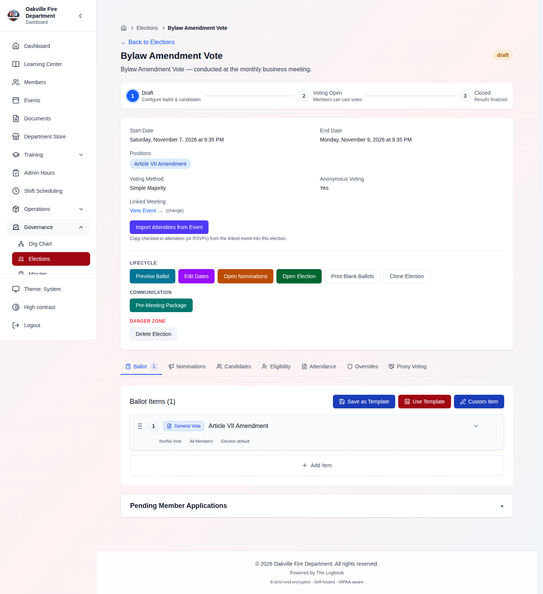

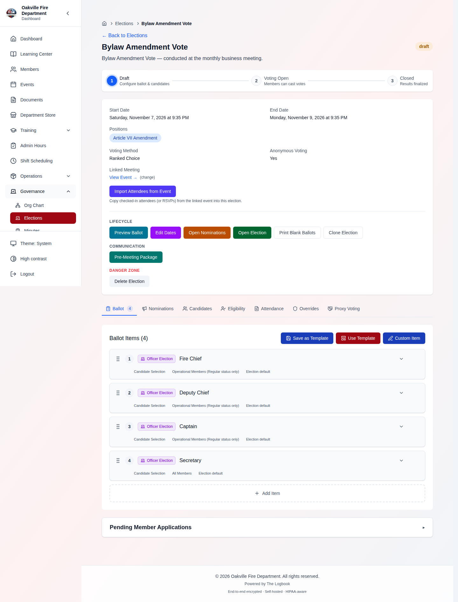

Read the two cards together and the real hazard is the part that _did not_
change. This draft was created as **Supermajority Required (2/3)** — one option
in the create form that sets the voting method _and_ the victory condition. The
apply overwrote the method and left the condition alone, so a bylaw amendment
that must carry two-thirds is now to be decided by ranked choice, and its 67%
threshold is still recorded underneath. **Positions** likewise still reads
"Article VII Amendment" over a ballot of four officer seats, and write-ins —
which the officer template had off — went off with the method.

Only the method is on the details card. To see the rest, click **Preview
Ballot** — the "Election Details" strip along the bottom of the preview carries
the voting method, the victory condition with its percentage, Anonymous,
Write-ins allowed and the quorum, which is the one place all of them appear
together. **Check it after applying a template.**

Then be deliberate about which election you apply one to, because there is no
way back through the interface: **Edit Dates** edits dates, and **Clone
Election** takes a title, dates and whether to carry the candidates. Neither
touches the voting method — applying a template is in fact the only control in
the app that changes it after an election exists. Treat a saved ballot as a
starting point for a _new_ election rather than a change to a configured one,
and if the method it brought is wrong for the vote, re-create the election with
the pairing you need.

### Paper ballots and the roster bound

A tally taken in the room is entered from an **open** election — **Record Paper
Ballots** — one count per accepted candidate. Every ballot is written as an
ordinary vote row attributed to the officer who recorded it, which is why a
closed election's results carry no separate "paper" figure: the paper votes are
simply in the counts. What is itemized, and stays itemized after the election
closes, is the **Paper-Ballot Batches** panel above the tabs — who recorded the
batch, when, and which officers attested it. It is
[pictured in the elections guide](./14-elections.md#paper-ballots--attestation).
Until the required officers attest a batch, its votes are excluded from results,
turnout and the vote count in the elections list.

The roster bound is enforced where the tally is entered, not where it is read:

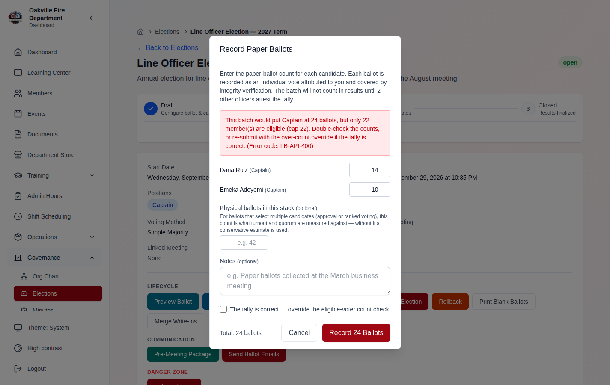

Twenty-four ballots for a position with twenty-two eligible members is refused
before a single vote row is written, and the message names all three numbers —
the projected total, the eligible count, and the cap. The cap is not always the
roster: an approval-voting position multiplies it by the number of accepted
candidates, and a position allowing several votes multiplies it by that, because
one member legitimately hands in more marks than ballots. The separate
**Physical ballots in this stack** field has no multiplier at all — one member,
one sheet — so it is checked against the roster directly.

Nothing here is a lock. The checkbox that appears with the error records the
override rather than removing the check, and the batch it creates is written to
the audit log at `warning` severity, naming who overrode it. Use it when the
tally is genuinely right — a proxy arrangement, a roster that changed mid-vote —
and fix the count when it is not.

## Dashboard and admin hours

The dashboard is now a station board. Department Messages shows pending items
and persistent notices rather than an arbitrary recent-history slice. Admin
hours separates calendar-year reporting from rolling periods and displays each
configured category against its own requirement.

**Edge cases:** conditional cards appear only when their module/data applies;
reading a message does not remove it mid-read, but it clears on the next load;
persistent notices remain; calendar year is not “last 365 days.” Mobile cards
and breadcrumb/action targets must remain at least 44px.

**My Updates** is the board's one feed: department announcements and your own
notifications in a single list, in place of the three panels that used to
restate each other. It asks for pending items only — a message you have read
drops off on the next load — with two exceptions that are the point of the
design.

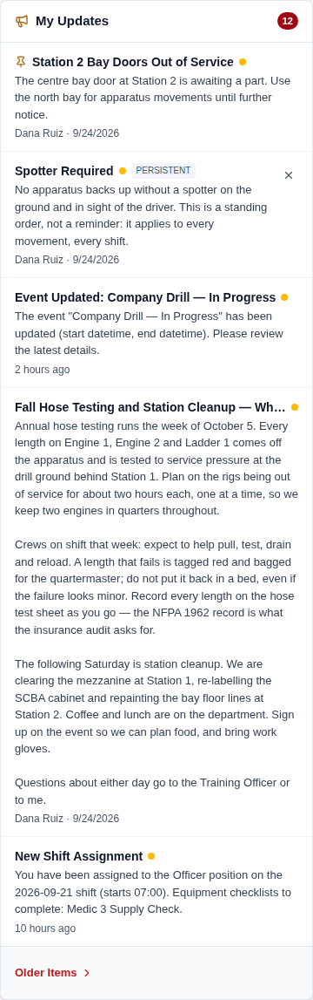

**Pinned first, then persistent, then newest.** The pinned bay-door notice at
the top is four days older than the notifications under it, and the standing
order below it is older still: neither is here because it is recent. A
persistent notice is also exempt from the "unread only" filter, so it stays on
the board after everyone has read it, and only the ✕ — which is a manager's
control, and does not appear for an ordinary member — takes it off.

_(Fixed in this release: the merged feed sorted purely by recency, which threw
away both. The pin icon rendered all the same, so an officer pinning an urgent
notice had no way to tell it had done nothing — and with five rows on screen, a
standing order left the board as soon as five notifications arrived.)_

Everything else on the board is conditional and this department shows it: the
five rows above are all this feed holds, **Older Items** carries the rest, and
the cards around it appear only where the module and the data apply.
[Guide 8 pairs the same board under two accounts](./08-admin-reports.md#august-1923-2026-update--exports-and-dashboards)
— one holding `finance.manage` and one without — which is the clearest reading
of what "conditional" means here.

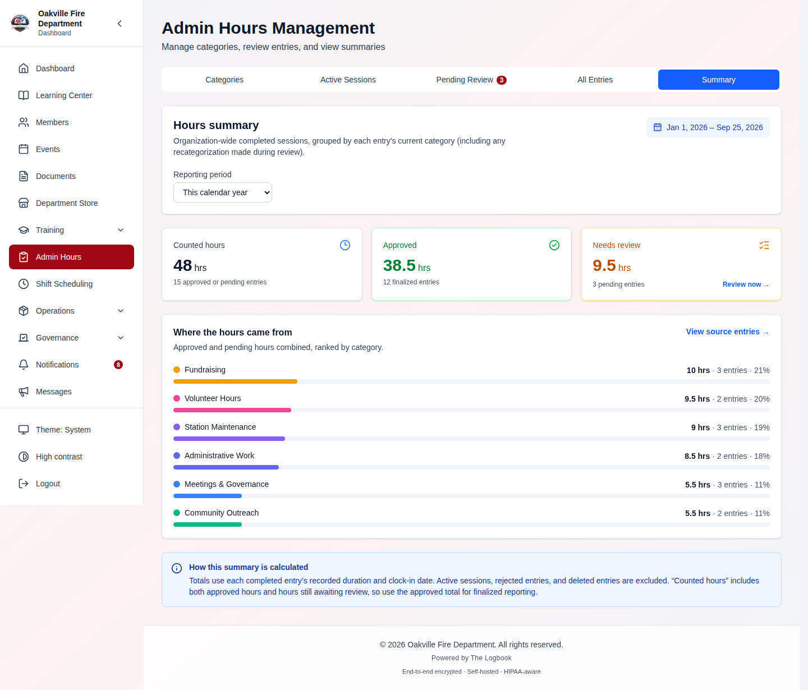

_The period really is a calendar year — Jan 1 to today, not a rolling 365
days — which is what the date range beside the heading states. The
per-category approval thresholds are not on this screen: auto-approve and
maximum-session limits are set on the **Categories** tab, and what the
summary ranks is hours logged, not the limits they were logged under._

## Storefront

Store administrators now see activity/status counts and can filter the order
list by the corresponding states. Organization settings can hide the store-open
banner. A member can change the external payment method on their own order; the
application records the method/status but does not process the payment.

**Edge cases:** members cannot edit another member's order; payment and
fulfillment remain separate; variant/product locks are canonicalized; notice and
email results do not reveal other recipients; counts and filters are scoped to
the active organization.


The counts and the list are two tabs, so they are two pictures. Overview holds
the cards above; Orders holds the list they describe. Read them together — the
workflow breakdown counts **Paid 2**, and filtering the Orders list to Paid
returns those same two orders:


**Nothing on that screen says the department is not taking the money, so say it
in training.** The picker records _how_ a member intends to pay and
"I've sent payment" records _that they say they have_ — both are claims the
treasurer then reconciles against the actual account. No card is charged and no
transfer happens here. The screen offers a handle to pay through and a button to
report having done so, which reads as a checkout to anyone who has not been told
otherwise.

## Room and apparatus QR codes

Authorized administrators can use the Check-In QR Codes directory to search,
download PNG codes, and print room signs. Facility-room codes and apparatus
shift check-in codes are available from their inline entry points. Regenerating
a location display code immediately invalidates the old code.

**Edge cases:** the bulk directory is restricted; a QR target is organization
bound; a stale printed sign stops working after rotation; sensitive facility
fields require `facilities.view_sensitive`, while editing still requires
`facilities.edit` or `facilities.manage`.


## Apparatus crew seats and scheduling settings

Crew positions now select configured ranks instead of relying on free text.
Shift settings persist per organization and calendar navigation retains its
context. Members retain the completion/report flows they are authorized to use
when equipment-check template administration is restricted.

**Edge cases:** legacy position names remain readable; an incompatible rank
cannot be saved; switching organizations must not reuse the prior organization's
rank or settings cache; finalization resolves apparatus labels in batches.

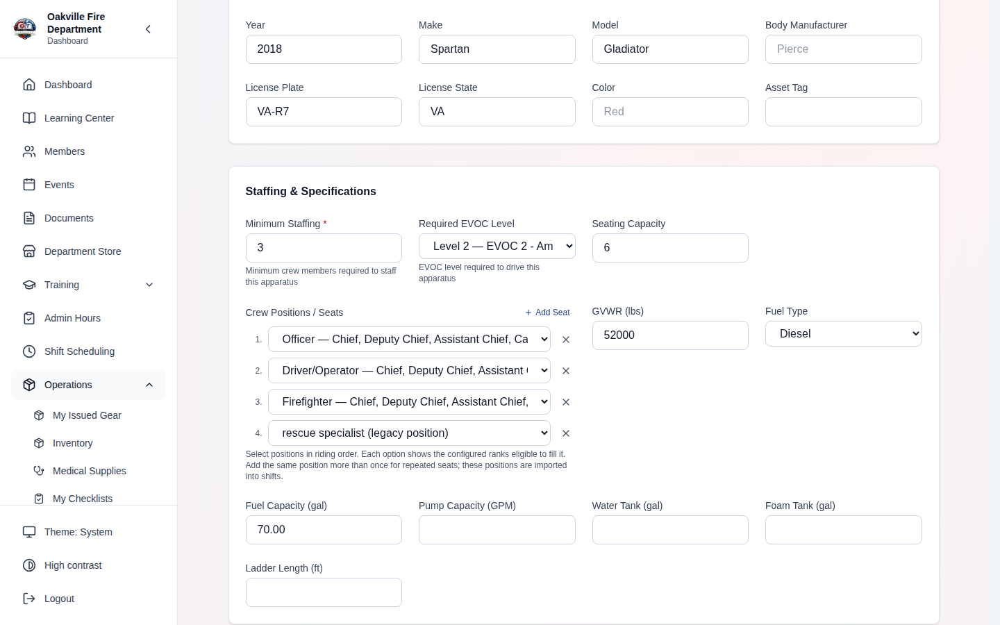

_Each closed control already names the ranks eligible for that seat, which
is where the rank backing shows. The open option list is not pictured and
cannot be: these are native `<select>`s, and an open one is drawn by the
operating system rather than by the page._

## Events, reminders, check-in, and outreach forms

Event and template Notifications now store a reminder audience: `going` for
members who RSVP Going, `all` for every active member in the organization, or
`none` to disable reminders. Optional events default to `going`; mandatory
events default to `all` until explicitly edited. Flexible check-in now defaults
to 60 minutes before start, with the full workflow, delivery caveats, early
member/guest distinction, and screenshot requirements in
[Events & Meetings](./04-events-meetings.md#reminder-audience-and-one-hour-check-in-default-august-14-2026).

The Event Settings outreach picker discovers only related public-outreach forms
and only for event administrators. Mandatory-event eligibility uses the
organization's configured membership tiers. Early-ended events can be finalized;
reports count reviewed attendance.

**Edge cases:** ordinary form viewers do not receive the administrative catalog;
forms and events from another organization never appear; deleted interviewers
remain as historical names rather than breaking an applicant record.

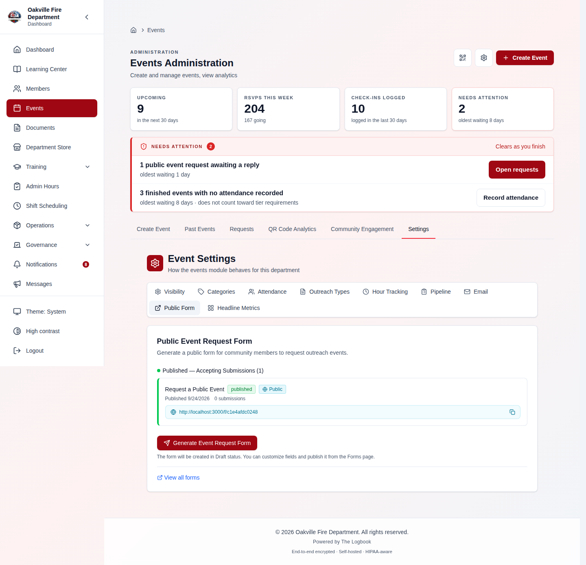

The one thing the picture cannot show is what the list leaves out. This section
asks `/event-requests/forms`, which returns only forms wired to the request
pipeline — so the department's three other published forms (the near-miss
report, turnout gear sizing, and the hand-built community request) are absent
from it, and the section stays legible whatever else the Forms module
accumulates. Two things count as wired: a form generated by the button below
the list, and any form given an **Event Request** integration afterwards from
the Forms page. Answers to a form with neither are collected as submissions and
stop there; they do not open requests in the pipeline.

## Training sessions, programs, and skills tests

A training-session editor can link the session to a requirement, course, and
program. Approved participation then feeds the owned program requirement.
Program pages have an Admin breadcrumb for managers. A failed skill step may
deduct configured points without forcing the entire test to fail; resume count,
result visibility, and official-test policy remain server enforced.

**Edge cases:** cross-organization and mismatched-program links fail; deleting a
program does not delete a requirement it does not own; undated training cannot
satisfy recency; members cannot read officer-only checklist/sign-off state; a
resume conflict is scoped to the current test and is not blindly retried.

### Linking a session to what it counts toward

Step 2 of the training-session wizard is where a session is connected to the
records it should feed: the **course** it teaches, the **category** its hours
land in, the **requirement** attendance credits directly, and the **program**
whose enrolled members it advances.

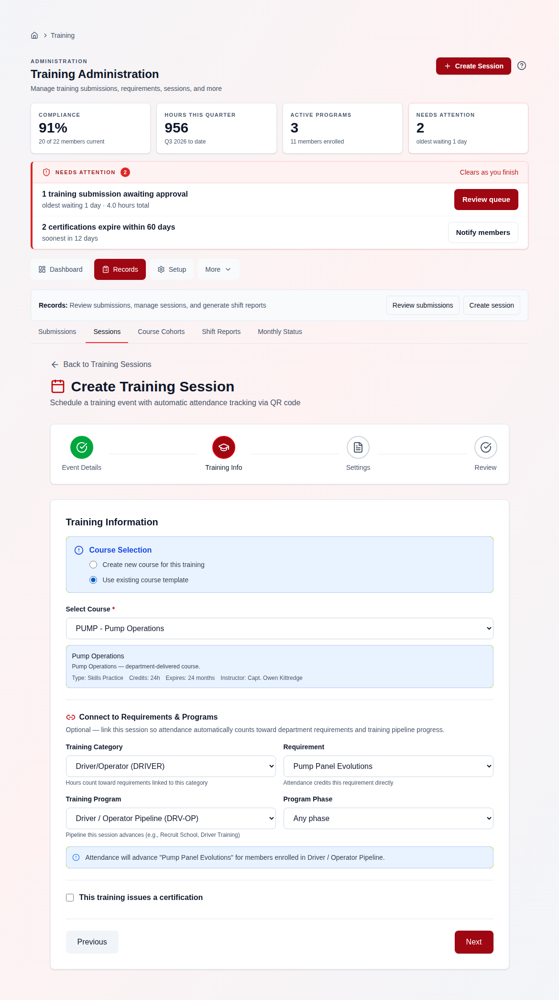

The blue line under the pickers is the whole feature in one sentence — it
restates the combination you have chosen in the terms the officer cares about
("attendance will advance _this_ for members enrolled in _that_"), and it
changes as you change the links. Choosing a course also pre-fills whatever that
course already declares — the category and program above were filled by picking
**PUMP - Pump Operations** — without overriding a choice already made.

Two things worth knowing about the lists:

- **Everything offered is this department's.** The pickers are loaded from the
  organization's own categories, requirements and programs, and the server
  checks every id again on save — a link to another department's record is
  refused with a flat "Invalid training program" that does not reveal whether
  the record exists. **Program Phase** has no organization of its own and is
  scoped through the program it belongs to.
- **A phase is not required to match the program above it.** Sessions generated
  from a course cohort can carry a class-level phase from a different program,
  so that combination is deliberately allowed rather than rejected.

The same pickers appear on the event page afterwards, as **Requirements &
Programs** — that is where a session created before a requirement existed, or
linked to the wrong pipeline, gets corrected. Members already signed off keep
the credit they were given; the links only steer what happens next.

### A failed step that costs points without ending the test

Every step on a skill sheet answers two separate questions, and the builder now
asks them separately. **Critical** decides whether failing the step ends the
test. **If this step is failed** decides what it costs: nothing, the step's own
points, or — new here — a fixed number of points off the total.

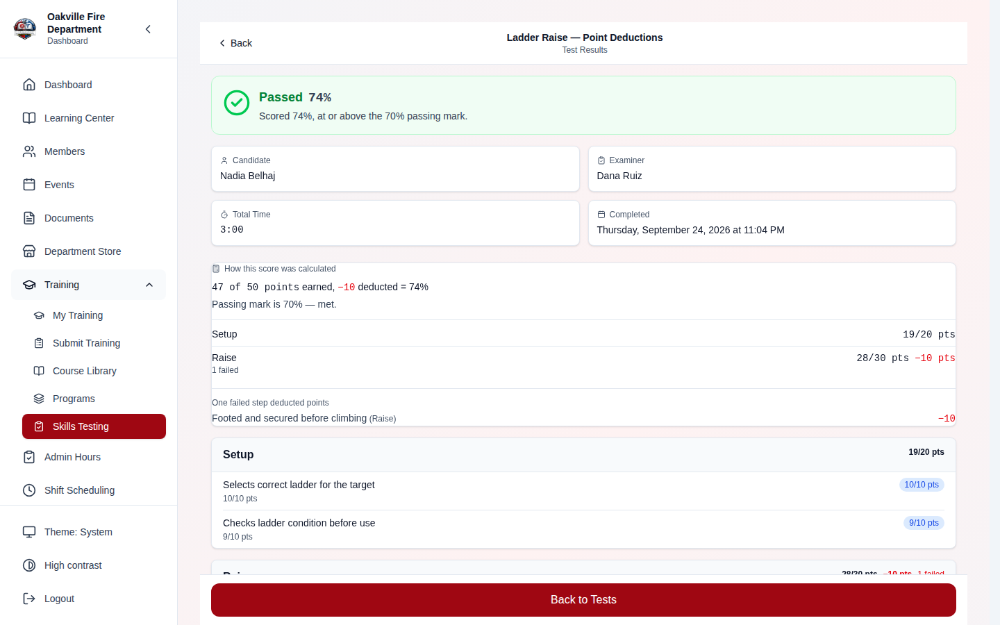

The candidate above lost ten points for climbing a ladder nobody had footed and
still passed at 74%, because that step is not marked Critical. Read the first
line as the subtraction it is: **47 of 50 points earned, −10 deducted = 74%**,
with the pass mark stated underneath and the step that took the points named at
the bottom. The gross total is deliberately left gross — a reader adding up the
marks on the sheet arrives at 47, and a headline that had already netted the
penalty off would look like an arithmetic error.

Three rules behind that arithmetic are worth knowing before configuring one:

- **A deducting step does not enlarge the point pool.** The sheet above is out
  of 50 whether or not it lists the step, so a candidate who does it correctly
  reads the same percentage as one testing on a sheet that never mentioned it.
  Only the fault costs anything.
- **A step left unscored is never charged.** A deduction is a recorded
  judgement about what the candidate did, and an examiner who never marked the
  step made no such judgement. (A blank _Critical_ step is a different matter,
  and is reported as a critical failure in its own right.)
- **Deductions can drive the total below zero, and the percentage stops at 0%.**
  The individual penalties are still listed in full, so the clamp hides nothing.

If the sheet carries no point-earning steps at all, there is nothing for a
deduction to come off — the panel says so rather than quietly ignoring
judgements the examiner did record.

## Notifications and integrations

Completing related event or scheduling actions archives the matching
notification in the database. It does not archive unrelated notifications.
Salesforce readiness/preview/sync now retains pagination and retries transient
failures while keeping the encrypted client secret out of responses and logs.
Webhook diagnostics redact credentials and unsafe payload fields.

**Edge cases:** relation matching includes organization and action/entity IDs;
Salesforce rejects missing/unsafe configuration; retry is for transient errors,
not invalid credentials; every targeted department message still receives
best-effort email, and Urgent adds SMS only when its consent/configuration gates
pass.

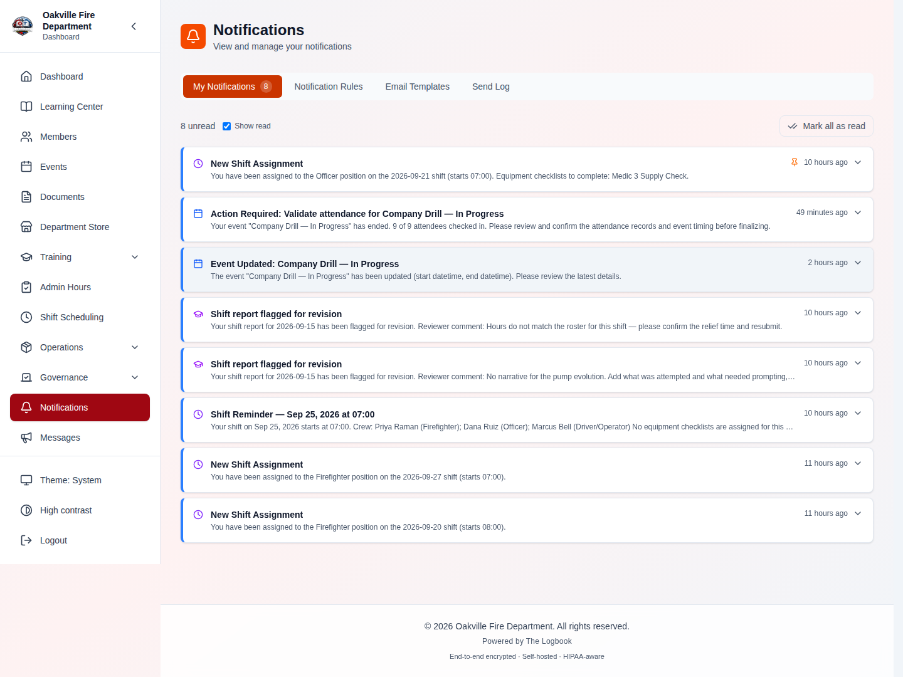

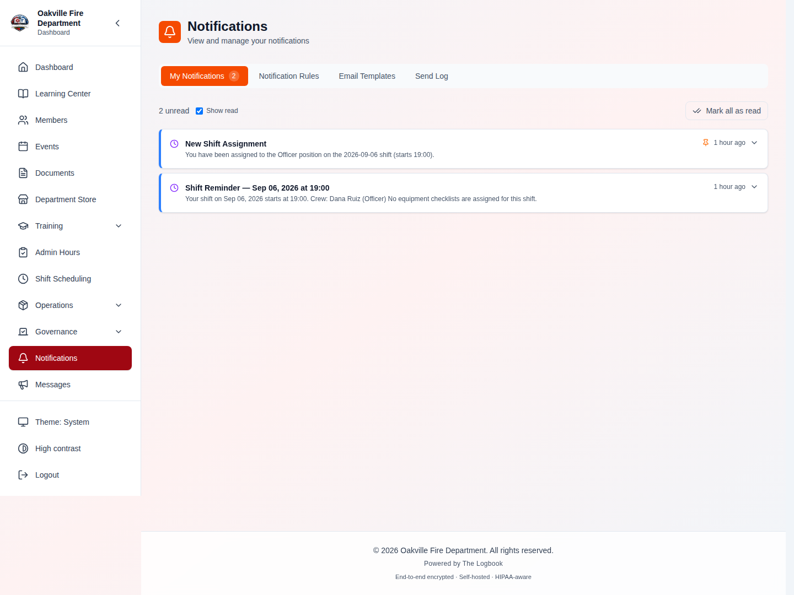

**Above: unread count 7. Below: 6.** Completing the event's related action — finalizing attendance — archived exactly the one notification tied to it: `archive_related_notifications` matches on category and the event's own id, so the "New Shift Assignment" notification, which names a different action entirely, is untouched.

**Not pictured — and the property it was meant to show is better checked than
photographed.** Readiness and preview both `404` unless a Salesforce integration
is present and `CONNECTED`, and the panel holding their buttons does not render
otherwise. Connecting means a real OAuth handshake against a real Salesforce org,
which the demo department does not have and a screenshot harness cannot fake.

What the marker is really asking is whether these results leak credentials. They
do not, and it is structural rather than a matter of careful redaction — the
readiness result is built from four keys and nothing else:

| Key                        | Carries                                                                |
| -------------------------- | ---------------------------------------------------------------------- |
| `connected`                | true/false                                                             |
| `objects`                  | per-sObject: reachable, and the **names** of any missing custom fields |
| `external_id_fields_ready` | true/false                                                             |
| `ready`                    | true/false                                                             |

There is no access token, no refresh token, no instance URL and no request body
anywhere in it. The one free-text field is `error`, present only when the
connection itself failed, and the client raises exactly two messages into it:
"Salesforce authentication failed — the access token may be expired or revoked",
and "Salesforce returned HTTP {status}". Neither quotes a credential or a
response body.

The preview result is counts — how many members would be created against how
many matched — and names no Salesforce record ids.

## Installing: the wizard is now one tab, one sitting _(August 15)_

**Who this affects:** whoever runs the one-time installation wizard at
`/onboarding`. Nobody else — existing departments see no change.

The wizard holds a short-lived credential that authorizes the requests creating
the organization, its stations and apparatus, the IT team, and the first System
Owner account. That credential used to outlive browser restarts and was readable
from every tab on the site. It now lives only in the tab that started the run,
because on a shared or station-kiosk machine a credential that can finish
creating a department should not still be sitting there the next morning.

**No permission, module setting, endpoint or migration is involved.** What
changes is how you schedule the install:

| Situation                                  | Result                                                                                |
| ------------------------------------------ | ------------------------------------------------------------------------------------- |
| Finish in one tab without closing it       | Normal path                                                                           |
| Open `/onboarding` in a second tab mid-run | That tab starts its own session; the original step refuses to save                    |
| Close the browser partway through          | The run is over — restart the wizard                                                  |
| Idle more than 30 minutes                  | The server session expires. It always did; the timer resets on each action            |
| "Onboarding has already been completed"    | A **different** condition: a department already exists. Sign in, do not restart setup |

**Teach this part explicitly, because the screen misleads.** The answers you
typed are stored separately and are _not_ cleared. Reopen the wizard after a
restart and **the form comes back filled in while the session behind it is
gone** — nothing says so until the next step fails. The filled-in form is a
local draft, not a resumed session; the recovery is to start the wizard over,
not to re-type into it.

Practical guidance for an installer: gather the department address, station
list, apparatus list and first administrator's details before starting, allow an
uninterrupted half hour, and stay in one tab until the dashboard appears.

**Not pictured, and it is not a tooling limitation so much as a contradiction
in what would have to be true.** Every other image in this library is taken
against a demo department that exists. This wizard only runs when one does
**not**: with a department on file, `/onboarding` sends you to the sign-in page
rather than to step one — which is the same "Onboarding has already been
completed" condition the table above distinguishes from an expired session. So
the two frames would need a database with no department, and the rest of the
library needs one with a department, in the same run.

Reproduce it yourself on a scratch install in about a minute: start the wizard,
fill in the department and stations steps, quit the browser, reopen
`/onboarding`, and press Next. The form comes back filled in — that is the local
draft — and the step fails. That failure is the whole lesson: a populated form
is not evidence of a live session.

## Dark mode: the strip at the right edge is gone _(August 15)_

**Who this affects:** everyone using dark mode, on every page — including the
public pages members' families and applicants see (public forms, ballot voting,
application status).

The themed background gradient now covers the browser's scrollbar gutter. It
previously stopped short of it, so in dark mode a bright strip ran down the
right edge of every page. There is nothing to configure and no behavior change;
it is purely what the screen looks like.

**Why it appears in a workflow lesson at all:** it invalidates images. Any
dark-mode screenshot, printed handout or recorded video captured before August
15 that shows a full browser window may still show the old strip. When you reuse
department training material, check the right edge of the image before handing it
out.


_Corrected 2026-08-24._ An earlier version of this note said the strip could not
be photographed, on the strength of `window.innerWidth -
documentElement.clientWidth` measuring `0`. That measurement was the wrong
instrument, and the picture above proves it: until 2026-08-24 this same capture
carried a **bright white 15px strip** down its right edge, which an image audit
found by comparing edge pixels against the content beside them.

The August 15 canvas move did not finish the job. It gave `html` the themed
gradient as a background _image_, and the `background:` shorthand resets
`background-color` to transparent — so the reserved strip, which is painted from
the canvas _colour_, still fell back to the browser's white. `html` now carries
`background-color` as well, and the strip takes the theme colour; that is what
you are looking at above.

One residue is not fixable and is not a defect: a dialog's scrim is
`position: fixed; inset: 0`, laid out against the initial containing block,
which excludes that strip. So on a **light** page under a dark modal overlay the
gutter stays light beside the dimmed page. Nothing in a page can paint outside
its own box.

**Two problems this caused, both already fixed** _(2026-08-16)_. Recorded here
only so nobody re-reports them from an older build:

1. Printing with the browser's **"Background graphics"** option switched on could
   put the themed background behind a scorecard, skill sheet, label or QR sign —
   in light mode. Fixed.
2. The six print-preview screens (skill sheet, scorecard, member training record,
   program, compliance, shift report) briefly showed the themed background
   framing the grey backdrop behind the sheet. Cosmetic, and what came out of the
   printer was never affected. Fixed.

If you see either on your installation, you are on a build from between
August 15 and 16; update.

## Upgrade notes for administrators

The notes below apply to the August 12–14 changes; the August 15–16 window
has [its own upgrade notes](#upgrade-notes-for-administrators-august-1516)
further down — it **does** carry a migration (`20260816_0001`, nested
facility rooms; plus the 08-16 inventory-vendor and storage-area-barcode
backfills) and a deployment floor (Docker Compose v2.24.4+).

Back up the database and encryption keys separately, require a single result
from `alembic heads`, and run `alembic upgrade head`. Production transport TLS
is fail-closed unless the operator explicitly acknowledges a plaintext
configuration. The active-prospect reconciliation may consolidate duplicate
active emails within an organization; review migration logs before and after.
Before upgrading, run the active-prospect duplicate query in the
[technical audit](../CHANGE_AUDIT_2026-08-12_TO_14.md#alembic-route-upgrade-data-path).
A non-empty result is a hard stop: review linked applications, keep the earliest
record, mark the remaining duplicate active rows inactive, and re-run the query.
The unique index otherwise fails before the later reconciliation can run. Never
downgrade merely to repair a migration fork.

## Facilities: rooms can now live inside other rooms (August 15–16)

The Rooms section of a facility renders a containment tree. Use the
add-a-room-inside action on a row, or the room form's **Located inside**
picker, to place a room inside another room in the same facility. Sub-rooms
show indented with per-container counts, and the cross-module room picker
(Events, Training, Scheduling) indents them too and prints the containment
path for the selected room. A nested room's linked Location is renamed with
the full path.

**Edge cases:** container must be the same facility and organization; a room
cannot enter its own subtree; five levels maximum; deleting a container
re-parents its sub-rooms up one level (never deletes them) and the
confirmation says so; moving a room across facilities carries its subtree and
re-syncs Locations; clearing floor/capacity/description now persists on save.

The full walkthrough with screenshot markers lives in
[Apparatus & Facilities → Nesting rooms inside rooms](./06-apparatus-facilities.md#nesting-rooms-inside-rooms-2026-08-16).


## Privacy and access tightening (August 15–16)

Four behavior changes members and officers will notice:

- **Colleague profiles show less to `members.view`.** Opening a directory
  profile without `users.view` no longer reveals the colleague's MFA state,
  email-verification state, last login, account timestamps, notification
  preferences, or the permission lists behind their roles — role names remain.
  Members-managers and the member themselves still see everything.
- **Hire date joined the restricted profile fields.** Like rank, station,
  platoon, and membership number, changing `hire_date` now requires
  leadership, the secretary, or the membership coordinator — it drives
  automatic membership-tier advancement.
- **Pending election nominations are phase-scoped.** The member-facing
  candidate list shows pending nominations only while nominations are open
  (so nominees can respond). After that, members see accepted candidates
  only; `elections.manage` always sees the full list.
- **Logout on a shared computer clears equipment-check drafts** along with
  shift-report drafts and offline queues. The next person at a station
  computer cannot recover the previous member's in-progress apparatus checks.

**Edge cases:** the profile redaction returns nulls, not errors — an
integration reading those fields must tolerate their absence; the candidate
list change is per-request permission logic, not stored state, so no data
migration is involved; the draft purge also removes orphaned draft keys that
lost their index entry.

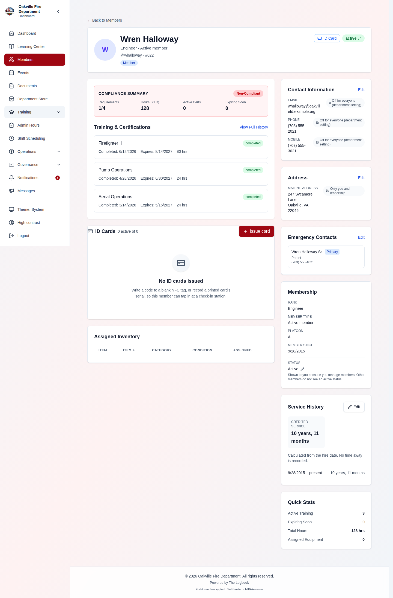

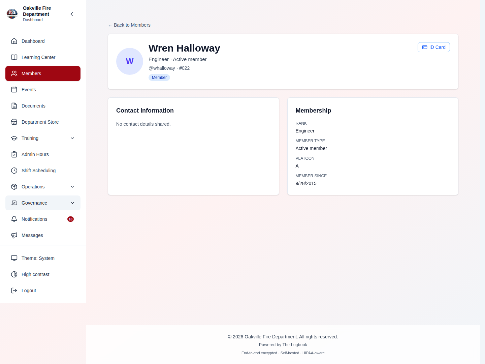

_One thing the marker asked for cannot be shown, because no screen has it: there is no account-security block on a **colleague's** profile for anybody. MFA enrolment, last sign-in and email verification are on your own settings page, so neither account has one to compare. What the permission does change is the three panels above._

**No shipped role can reach that 403, so there is no screenshot of it.** The
guard is real — `hire_date`, `rank`, `station`, `platoon` and
`membership_number` all require `members.manage`, and an attempt without it is
refused with:

> Only leadership, the secretary, or the membership coordinator can update hire
> date, rank, station, platoon, or membership number

But every role in the shipped catalogue that grants `users.edit` also grants
`members.manage`, so the refusal is unreachable until a department builds a
custom role that separates them — a records clerk who maintains contact details
but does not set rank or hire date, say. That is the situation to keep in mind
when you build one; it is not a state the product can be put into out of the
box, and staging it would mean photographing a role no department has.

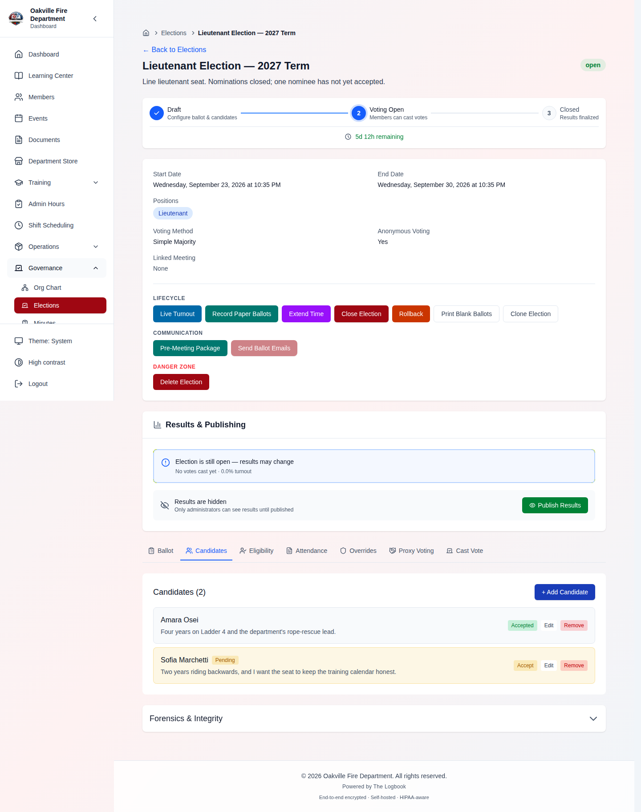

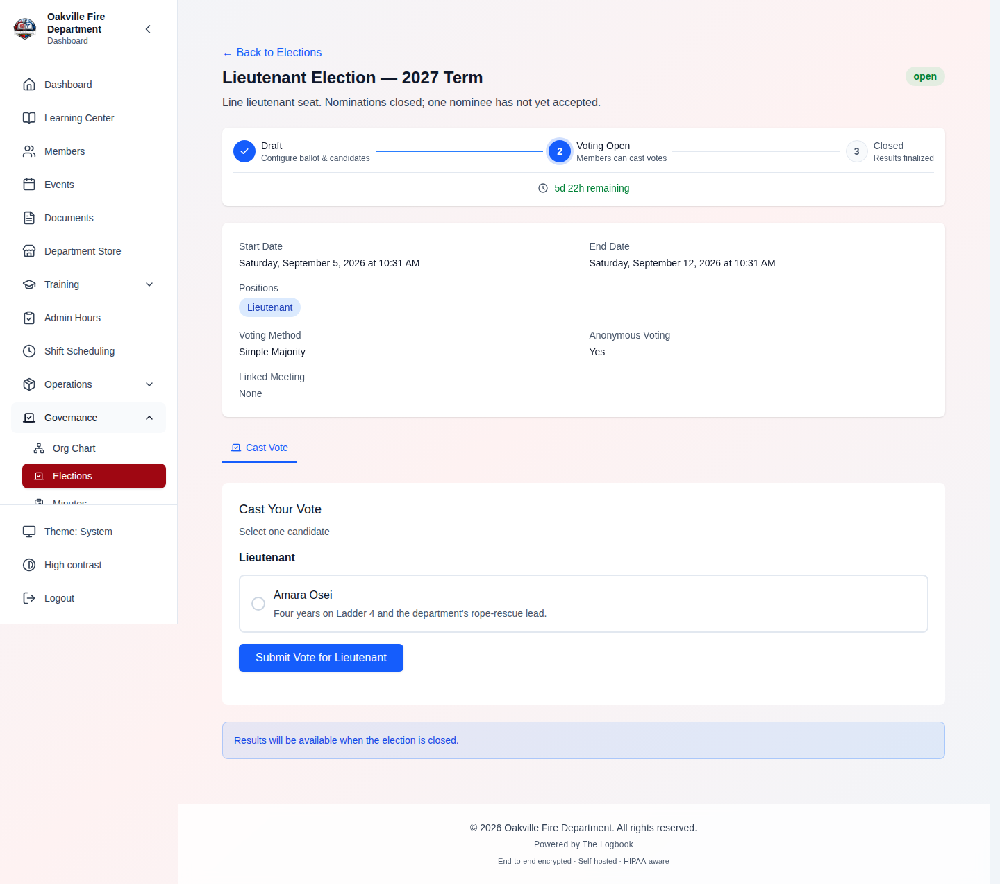

## Reliability changes members may notice (August 15–16)

- **External finance approvers:** the emailed approve/deny link works exactly
  once. A second click (or a concurrent duplicate) reports the step as
  already actioned rather than approving twice.
- **Public forms:** submissions that fail validation — and bot submissions —
  no longer count against a form's daily cap, so a flood of junk cannot lock
  legitimate submitters out for the day. The cap still answers with a clear
  "not accepting further submissions today" message when genuinely reached.
- The dark-mode and installation-wizard changes in this window have their own
  sections above ("Dark mode: the strip at the right edge is gone" and
  "Installing: the wizard is now one tab, one sitting").

## Upgrade notes for administrators (August 15–16)

Three migrations, linear: `20260816_0001` adds `facility_rooms.parent_room_id`
(nullable, self-referential, `ON DELETE SET NULL`) — no backfill, existing
rooms stay top-level; `20260816_0002` backfills storage-area barcodes; and
`20260816_0003` creates inventory vendors and backfills one per distinct
free-text supplier name. Back up, require a single `alembic heads` result
(`20260816_0003`), run `alembic upgrade head`. Deploying `docker-compose.prod.yml` now requires
Docker Compose v2.24.4+ (`volumes: !override` clears development bind
mounts; upgrade Compose rather than removing the tag). Unraid operators
copying `unraid/.env.example` will find an HTTPS `ALLOWED_ORIGINS` example —
substitute your reverse-proxy hostname. Details in the
[technical audit](../CHANGE_AUDIT_2026-08-15_TO_16.md).

---

# August 17–19 changes

Three things landed in this window that change what somebody does at a
keyboard: a way to record call volume without an incident-reporting system, a
rebuilt shift close-out, and NFC tags. A fourth — a pre-upgrade configuration
check — changes what an administrator does at a terminal.

## Counting calls without an incident-reporting system

**Who this is for:** a department that does not run an RMS and still has to
report call volume for grants, ISO, apparatus replacement, or a staffing case.

**Switch it on:** Scheduling → Settings → General → _Shift close-out rules_ →
**Record a call count at close-out**. It applies immediately.

**Tell your officers first.** It changes what they see at 0700 the same
morning: the familiar close-out checklist is replaced by a three-step wizard.

Full lesson: [Counting Calls Without an
RMS](./03-scheduling.md#counting-calls-without-an-rms-2026-08-18).

### The one thing to get right before quoting a number

The report labels the figure **Unit Responses**, not **Total Calls**, and the
difference is real. Two units that closed out independently each reported their
own call, and nothing yet links them to one incident — so an MVA that Engine 5
and Medic 1 both ran counts twice.

**Do not put that figure in a grant application as a department call count.**
Reconcile mutual responses by hand until the cross-unit feature ships.

### What is deliberately not collected

No address, no patient or caller identity, no narrative, no response times, no
readable CAD number. Those are the fields that make a call record protected
health information, and there is nowhere in the feature to enter one. Departments
that need incident-level records need an incident module, not a call counter.

**Edge cases:** calls the officer cannot classify go in the wizard's **Not
categorised** row — the total is the sum of the rows, so leaving them out
records a smaller shift rather than an unclassified remainder; 100 calls is the
per-shift ceiling; renaming a call type does not disturb history, but deleting
one leaves its past calls unclassified, and a rename is **not** reflected in the
Call Volume report, which prints the internal slug. Blank and `0` read as
different answers while the form is open, but they are not distinguishable once
saved — both record no calls, so no report can tell a quiet tour from an
unanswered question.

**Officers already signed in must reload** before their next close-out: a
session opened before the toggle was flipped still shows the old checklist,
which never asks for a call count, so a shift closed from that tab finalizes
with none recorded.

## Shift close-out is now three screens, and it saves as you go

For departments recording a call count. Same **Close out shift** button, same
permissions.

1. **When was everyone actually on** — times, combined crew hours, anyone
   flagged for a missing check-out, and anyone assigned who never checked in
2. **How many calls** — one row per call type; the total is calculated from the
   rows and cannot be typed into
3. **Confirm each member's credit** — seeded from the apparatus count, adjust
   anyone who came on late

**Each step saves when you press Next.** A phone that locks at 0700 reopens on
the screen it left rather than at the beginning.

**Edge cases:** reopening a finalized shift restarts the wizard; declined,
pending and no-show crew are not listed; you cannot lower the count below the
calls this shift shares with another unit; correcting a shift's date or
apparatus afterwards moves its calls with it; a member credited with fewer calls
than the apparatus ran gets a count but not call types, because which calls they
were on is not knowable.

Full lesson: [The three-step close-out
wizard](./03-scheduling.md#the-three-step-close-out-wizard-2026-08-19).

## NFC tags: events, admin hours, and shift check-in

A reusable sticker replaces reprinting a QR sheet per event, and needs no
camera — which is the part that fails in a dark bay or with gloves on.

**Write a tag** from the page that already shows the QR code:

| Page                                          | Tag opens                                                             |
| --------------------------------------------- | --------------------------------------------------------------------- |
| Event → **QR Code**                           | that event's check-in                                                 |
| Admin Hours → a category's QR code            | that category's clock-in                                              |
| Shift detail → the apparatus QR block         | shift check-in for that truck                                         |
| **Check-In QR Codes** (`/locations/qr-codes`) | shift check-in — this is where you write a whole fleet in one sitting |

**Read a tag** by holding the phone to it — or, if the app is already open on
screen, with **Tap Tag** on the Events page, My Admin Hours, or the scheduling
calendar. Android only hands a tag to the browser when the app is _not_ in the
foreground, which is the gap Tap Tag fills.

**Not pictured, and the paragraph below is why.** The screenshot harness
runs headless Chromium over `http://localhost`, which fails both of Web NFC's
conditions, so the writer beside the QR code is replaced there by the line
explaining which condition is missing. Photographing that would put a picture of
an unavailable feature under a caption about using it.

**Requirements: Chrome on Android, over HTTPS.** Not iPhone, not desktop, not a
plain-`http://` LAN deployment. Where it is unavailable the controls are absent
or explain which of the two conditions is missing. QR still works everywhere.

**Prefer the apparatus tag over a shift tag** for anything mounted: the
apparatus code resolves when it is tapped rather than naming a shift, so one
sticker serves the life of the truck. A shift-keyed tag dies when that shift
ends. Tell members to check the shift named on the check-in page before
confirming — the resolver takes the truck's earliest open shift dated today,
which on a two-shift day is not the one currently running.

**Room kiosk display codes cannot be tagged, deliberately.** A kiosk code is a
check-in credential for an unauthenticated screen; a sticker in a public hallway
hands it to whoever walks past.

**An unrecognized tag does nothing.** The app follows only links pointing back
at your own Logbook and only to check-in pages it knows. Anything else leaves
the scan waiting with a message.

## Before you upgrade: check the configuration first

A configuration problem is normally found when the container refuses to boot —
which means finding it by losing the service. Ask first:

```bash
docker compose -f docker-compose.yml -f docker-compose.prod.yml \
  run --rm --build backend python -m app.preflight
```

`0` means it starts, `1` means it does not and lists what is blocking, `2` means
a value is malformed.

**Two details matter.** Use `--build`, or you are checking the image you are
replacing rather than the one you are deploying. And pass the same `-f` files
your deployment uses, or Compose evaluates only the base development settings
and answers about a configuration nobody runs.

`--compose PATH` goes further and names settings your compose file **drops** —
values sitting in `.env` that never reach the container. Those used to become
defaults silently, which is how production ends up running a development
setting with nothing on screen to say so.

**This one is text, not a screenshot** — and deliberately so. Terminal output
belongs in a code block, where it can be searched, copied and diffed against
what your own run prints. A picture of it can do none of those things.

A development configuration, which is not checked because the blocking rules
apply only to production and staging:

```console
$ python -m app.preflight
Environment: development

RESULT: this configuration starts.

NOTE: no blocking checks run for 'development' — they apply only to production
and staging. To test a production configuration, re-run with: --as production
$ echo $?
0
```

The same process re-run as production, which is the check worth doing before a
deploy:

```console
$ python -m app.preflight --as production
Environment: production  (forced via --as)

BLOCKING (5):
  - CRITICAL: REDIS_PASSWORD must be set in production
  - CRITICAL: DB_SSL should be enabled in production to encrypt database
    traffic ...
  - CRITICAL: REDIS_SSL should be enabled in production to encrypt Redis
    traffic ...
  - CRITICAL: API documentation (ENABLE_DOCS) must be disabled in production —
    /docs, /redoc, and /openapi.json expose the full API surface for
    enumeration
  - CRITICAL: SECURITY_ENFORCE_HTTPS must be True in production. ...

Advisory, does not prevent startup (1):
  - WARNING: VOTE_SIGNING_KEY should be set for any organization using the
    elections module. ...

CONFIGURATION SOURCE CHECK — did these values reach this process?
  COOKIE_SECURE           NOT PRESENT — using built-in default None
  DB_SSL                  NOT PRESENT — using built-in default False
  ENABLE_DOCS             NOT PRESENT — using built-in default True
  REDIS_PASSWORD          NOT PRESENT — using built-in default None
  SECURITY_ENFORCE_HTTPS  NOT PRESENT — using built-in default False
  ...

9 blocking setting(s) are absent from this process's environment. If you set
them in a .env file, the value is NOT reaching the container.

RESULT: this configuration will NOT start. Fix the blocking items.
$ echo $?
1
```

The **configuration source check** is the part to read first when something
surprises you. It answers a different question from the blocking list above it:
not "is this setting right" but "did this setting arrive at all". A value in
`.env` that a Compose `environment:` block never lists cannot reach the
container, and before this existed it simply became the built-in default with
nothing on screen to say so.

## Sign-in hardening

- **Breached-password rejection** (optional, off by default). Only the first
  five characters of the password's hash ever leave the server. If the lookup
  service is down the password change **still goes through** — the check is
  supplementary, and complexity, history, MFA and lockout all still apply.
- **A human challenge (CAPTCHA)** can be required on the two internet-facing
  forms. If _its_ provider is down, the submission is **rejected** — there is no
  other control behind it, so accepting unverified traffic during an outage is
  exactly what an attacker wants.
- **Lockout messages are generic by default.** Saying "this account is locked"
  confirms the account exists and tells an attacker their spray is landing.
- **A per-IP throttle** counts failed attempts across _all_ accounts. Account
  lockout is per-user, so one password tried against a thousand accounts never
  trips it; this is the control that does.

## Privacy notice and terms rewritten

Both pages were rewritten to state up front that **the department, not the
platform, controls member data**. The print layouts were rebuilt and both pages
went through an accessibility pass.


## Upgrade notes for administrators (August 17–19)

- **Two migrations**: `82bdcb3b1e64` (the call tables) and `2827079fd66c` (the
  close-out resume point). Both additive, neither backfilling. Back up, confirm
  `alembic heads` returns exactly one, then `alembic upgrade head`.
- **Nothing changes for a department that ignores the new setting.** Call
  logging keeps working exactly as it does today; the absence of the setting
  means current behaviour, not "off".
- **Run the preflight check before the restart**, per the section above.

---

# August 19–23, 2026 workflow updates

Operator-facing companion to the
[August 19–23 audit](../CHANGE_AUDIT_2026-08-19_TO_23.md). One new screen
(Governance → Legal Documents), one behaviour change that will surprise
officers (you can no longer approve your own swap), and a set of phone fixes
that make dialogs usable again.

## Governance → Legal Documents: your own privacy notice

**Where:** Governance → **Legal Documents** (`/governance/legal`)
**Who:** `legal.propose` to draft, `legal.publish` to publish, or
`settings.manage` for both

Until now the wording on your `/privacy` and `/terms` pages was the platform's.
A department can now write its own — which matters because record-retention
rules, volunteer/career status and state law all differ, and boilerplate
written for the platform does not describe what your department actually does
with member data.


### Drafting and publishing are two different jobs

This is the part to get right when handing out permissions.

| You hold          | You can                                                             | You cannot  |
| ----------------- | ------------------------------------------------------------------- | ----------- |
| `legal.propose`   | Read both notices, draft a new version, edit or delete your draft   | **Publish** |
| `legal.publish`   | All of the above, plus publish, plus revert to the platform default | —           |
| `settings.manage` | Reaches the screen and can publish                                  | —           |

A department that wants the secretary to draft and an officer to approve gets
that from the permissions. A department that does not want the ceremony gives
one person `settings.manage`.

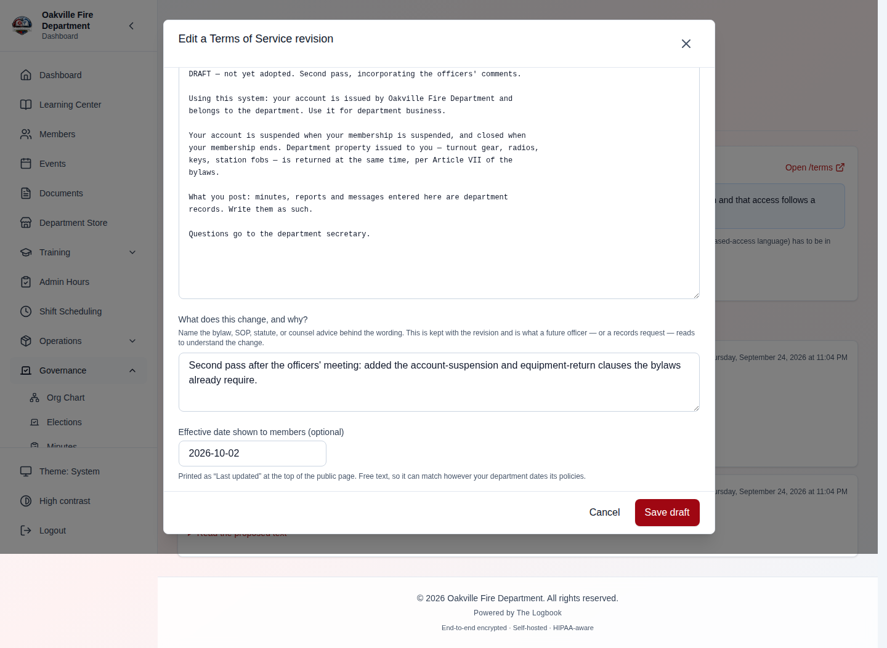

_Publishing is not a control on this form. **Save draft** and **Cancel** are
what it offers everyone, including a member who can publish — publishing is an
action on the saved proposal afterwards, and that is where the permission shows
(the proposal card offers **Publish to members** only to `legal.publish` or
`settings.manage`)._

### Every change needs a reason

The **change note** is required. It is where you record the bylaw, SOP,
statute or counsel note behind the new wording. This is not bureaucracy: the
whole reason for proposing a revision rather than editing the page in place is
that somebody in two years can see _why_ it says what it says.

### What "Last updated" accepts

Anything. It is free text and is never interpreted — `March 3, 2026`,
`FY26-Q1`, `Adopted at the 3/3/26 business meeting` all work, and all display
exactly as typed. Date it the way your records officer dates things.

**Clearing it is not the whole story.** Emptying the box does clear the field
on that revision — but **the public page keeps whatever date it had.** One
"Last updated" line is shared by both `/privacy` and `/terms` in the
organization's settings, and publishing only ever _sets_ it, never removes it.
That is deliberate: reverting your terms must not blank the date shown above a
privacy notice that is still published. **To change what the public sees, put a
new date in — clearing the box will not blank it.**

### Edge cases worth knowing

- **A draft is not public.** Nothing on `/privacy` or `/terms` changes until
  somebody publishes.
- **Only one version is live at a time** per document.
- **Old versions are never deleted.** When you publish, the version it replaces
  is archived. This is deliberate: the question a records request actually asks
  is not "what does your notice say" but "what did it say on the day I joined".
- **Removing the member who wrote a revision does not remove the revision.**
  Their name is cleared from it; the wording stays, because it is a department
  record.
- **Revert to default** puts the platform wording back. It needs
  `legal.publish`.
- **There is no approval queue.** Saving a draft notifies nobody. If you want
  review before publishing, that is a process you run — the module does not
  chase anyone.

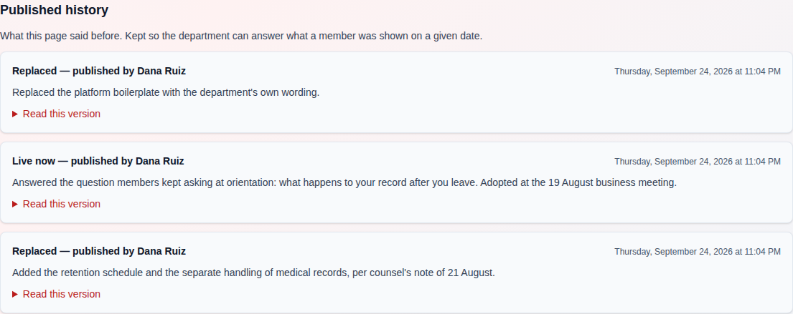

## Scheduling: you can no longer approve your own swap

**Where:** Scheduling → Requests

Holding `scheduling.manage` no longer lets you review a request you are part
of. Two people are blocked on a swap, not one:

- the member who **raised** it, and
- the member it **targets**.

Time-off is simpler: the requester cannot review their own.

This will bite hardest on the departments where it is least convenient. On a
small combination department the officer asking for Saturday off is very often
the only person who can approve it. That is precisely the situation the rule
exists for — a permission grant is not a second person.

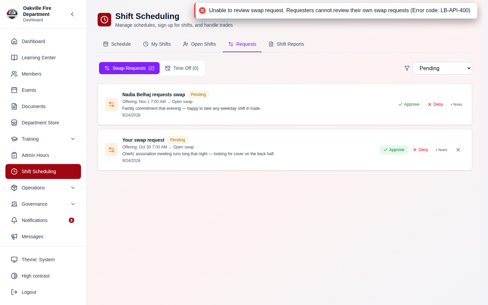

_The error **is** the screenshot. Do not go looking for a difference in the
buttons: `RequestsTab` renders Approve and Deny on every pending request for
anyone holding `scheduling.manage`, their own included, so the rows offer the
same review controls until one is pressed. The only thing that marks your own
row is the small **✕** — cancelling is the requester's to do, and nobody
else's._

### Edge cases

- **A blocked attempt changes nothing.** The request stays pending, exactly as
  it was, for somebody else to action. It is not consumed, half-applied, or
  moved to a rejected state.
- You may still review a swap between two **other** members, even on your own
  shift.
- If nobody else holds `scheduling.manage`, the request waits. Plan the second
  grant before you need it — this is the one change in this release that can
  leave a department stuck at 0600 on a Saturday.

## Scheduling: the Requests tab is now paged

Long swap and time-off histories no longer load in one go. The tab now renders
twenty rows at a time with a **Load more** button beneath them — not numbered
pages — and the button simply is not there once everything is loaded.

One thing to know before you go looking for it: the tab opens filtered to
**Pending**, and a season's worth of history is resolved by definition. Set the
status filter to **All Statuses** first, or the list will look like it holds
three requests when the count beside the view's name says twenty-seven.

**If you have a script or integration reading swap or time-off requests from
the API, it needs updating** — the response is now an object with an `items`
list rather than a plain list. See the
[API Reference](../../wiki/API-Reference.md).

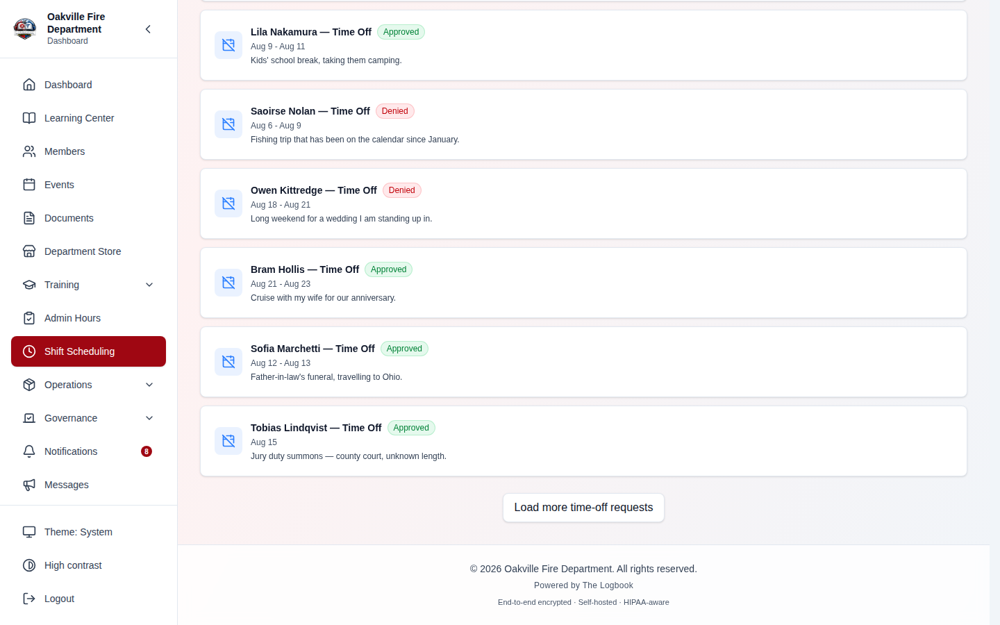

## Equipment checks: safe to finish in a dead spot

**Where:** Shift detail → equipment check

A crew that completes a check with no signal and reconnects at the station
used to risk a **duplicate check** — the queued submission replayed and created
a second record of the same inspection. That is now impossible: one check per
shift per template is enforced by the database, and the phone tags its
submission before sending so a retry lands on the same record.

The same protection covers a double tap on **Submit** and a dropped connection
mid-save.

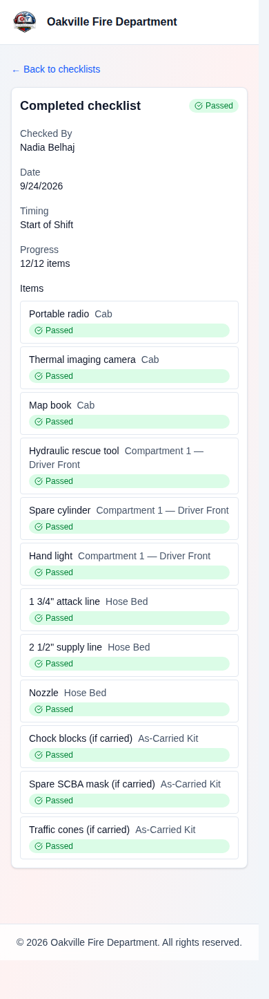

_The queued/offline half of that description is not pictured. Simulating a
dropped connection means setting state on the browser rather than on the
page, which this capture harness does not do — an "offline" banner staged
any other way would be a photograph of something the app never rendered.
What the record above shows is the end state either route arrives at: one
check, one set of answers._

### Other equipment-check changes

- **Deep storage paths now fit.** A check item several compartments down in a
  nested storage tree records its full path.
- **A compartment cannot be its own parent** — the tree rejects a cycle rather
  than accepting it and failing later.
- **Standalone (non-shift) checks are unchanged for ordinary members.** The
  endpoint accepts `equipment_check.submit` **or** `equipment_check.manage`, so
  a member who could start an ad-hoc check before can still start one. Do not
  change anybody's role over this.
- **Expired-equipment failures are decided from inventory at submission**,
  rather than from whatever the phone claimed. The result is then stored with
  the check. A lot that expires _after_ the check was recorded does **not**
  retroactively turn that check into a failure — the record stands as taken,
  which is what makes it usable as evidence of the state at that time.
- **Check timing is recorded by the server.** The phone no longer supplies it.

## Events: a Recruitment type that feeds the pipeline

**Where:** Events → new event → Type

Open houses and recruitment nights have their own event type. Pick
**Recruitment** on a **new** event and guest sign-in switches on, along with
"create a prospect from each guest" — because a recruitment event whose
attendees never reach the pipeline has not recruited anybody.


### Edge cases

- **The automatic switch is create-only.** Changing an existing event to
  Recruitment does **not** flip its switches. Look for the banner on the form
  instead — it explains what to turn on and gives you a button to do it.
- **It yields to you.** Once you set either switch yourself, the automatic
  default stops applying for that form session.
- **It reverts cleanly.** Choose Recruitment then change your mind, and
  switches the form set automatically are turned back off. Switches you set
  yourself are left alone.
- **Templates do not trigger it** — a template prefills the form the same way
  an edit does.
- Existing open houses filed under Public Education or Other are **not**
  reclassified.
- Past recruitment events group with **Other** on the Past Events tab.

## On a phone: dialogs are usable again

If members have reported that a dialog's buttons "do nothing" on a phone, this
is the fix. The bottom navigation bar was painting **over** open dialogs and
swallowing the taps — the buttons were not merely hidden, they were
untappable, and the tap navigated the page out from under the dialog.

The bar now hides while a dialog, drawer or bottom sheet is open.

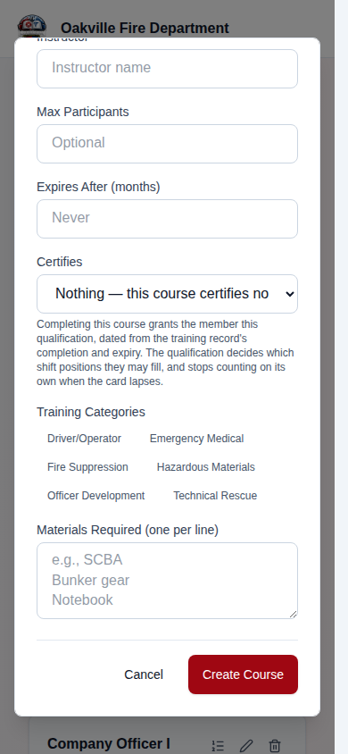

Also improved on phones this week: the events page, equipment template
actions, the checklist builder, calendar month navigation, and the document,
training, audit and check-in tables (which now reflow to stacked cards instead
of scrolling sideways).

## Browser tabs now say which page you are on

Several Logbook tabs open at once used to be indistinguishable. Each tab now
carries the page name. A slow-loading page no longer shows the previous page's
name while it loads.

Nothing to configure.

## Exports: a comma in a name no longer breaks the file

Two exports were mis-escaped. The event attendance export in particular
shifted every column after a member whose name contained a comma —
`Smith, John` split into two cells and pushed the rest of the row sideways.

Every export in the product now goes through one escaper. Blank cells no
longer pick up a stray apostrophe, and spreadsheet formula characters are
neutralized everywhere rather than in some exports and not others.

**If you have kept a mis-exported attendance file, re-export it.**

## Upgrade notes for administrators (August 19–23)

- **Eight migrations.** Back up, confirm `alembic heads` returns exactly one,
  then `alembic upgrade head`. The head is `a17c4e9d2b61`.
- **Three of them repair databases that believe they are already up to date.**
  Three earlier migrations were released under one revision id and later
  renumbered, so a database upgraded in those windows is stamped as having run
  work it never ran. The repairs repeat the work safely — on a healthy
  database they do nothing.
- **Two migrations do not cleanly reverse — and neither loses data.** The
  seat-list normalization expands a legacy crew count into individual seats,
  and its downgrade deliberately does nothing: the original count cannot be
  recovered from the expanded seats, so it leaves them as they are rather than
  guessing. The equipment-check de-duplication detaches historical duplicates
  rather than deleting them, and cannot re-attach them on downgrade.
  **Item snapshots are kept in both cases** — no safety record is destroyed.
- **Do not downgrade past both `compartment_name` migrations.** Doing so
  narrows the column and truncates deep storage paths.
- **Two new permissions** to assign if you want the Legal Documents screen used:
  `legal.propose` and `legal.publish`.
- **Check who holds `scheduling.manage`.** If exactly one person does, and they
  also request swaps, they can no longer approve their own — grant a second
  person before a Saturday morning finds out for you.

---

# August 23–24, 2026

Companion to the
[August 23–24 change audit](../CHANGE_AUDIT_2026-08-23_TO_24.md). Nineteen
hours, 46 pull requests, twelve migrations. Three things arrive that a
department has never seen before — ID cards, label printers and a shift board —
and **five authorization gaps close**, four of which an ordinary member could
reach. Read the last of those sections even if you skip the rest.

## Scheduling: the calendar says which shifts need people, and claiming one is a tap

Open **Scheduling → Schedule**. Instead of a grid of cards, each shift now
carries a status chip:

| Chip                                 | What it means                       |
| ------------------------------------ | ----------------------------------- |
| **`2 open`** (red or amber)          | Seats still to fill. Red is urgent  |
| **`Full 4/4`** (green)               | Staffed                             |
| **`You + 2/4`** (blue)               | You are on it                       |
| A headcount with **no ratio** (grey) | This shift never stated a crew size |

Select a day and the panel beside the grid shows the crew and **one button that
claims the first open seat you are cleared for**. There is no position dropdown
to find. Filters dim rather than hide, so the month keeps its shape.

On a phone this is a bar grid, a day sheet and a confirmation screen.

**The grey shift is not a bug.** A shift that names neither positions nor a
minimum staffing level used to be assumed to want four people, so it showed
"4 open" in critical red. A department that configures neither opened the page
to a wall of red that meant nothing. Those shifts now read grey, show a
headcount, stay out of the open-seat count, and can still be joined.

Cancelled, finalized and past shifts read as **closed** and offer nothing.
Previously their empty chairs counted toward the day's open-seat total and its
urgent flag, and they showed a claim button the server refuses.

> **[SCREENSHOT NEEDED — the Schedule board, desktop.** _Demo data:_ a month
> containing at least one shift of each chip state: one red with open seats, one
> green and full, one blue with the demo member on it, and one grey shift that
> names neither positions nor a minimum. A day selected so the crew panel and the
> claim button are both in frame.**]**

> **[SCREENSHOT NEEDED — the Schedule board, phone (390×844).** _Demo data:_ same
> month; capture the bar grid with the day sheet open. The bottom navigation
> should be absent — it hides while an overlay is open.**]**

### Standing shifts: "every Tuesday night"

From a shift, a member can make it a **standing shift** — a recurring claim on
that seat.

It is stored as a claim rather than written out as a pile of assignments, and
that has a consequence worth teaching: **giving up one Tuesday does not end the
series.** The claim stays; only that date is released.

It works in both directions, and only means anything because both do:

1. Creating a claim seats you on **matching shifts already scheduled**.
2. Creating a **shift** later seats everyone whose active claim matches it.

Without the second, a series would go quiet the month the department generated
its next block of schedule.

**Edge cases to teach:**

- **The series is anchored on the shift you started it from**, not on today.
  "Every other Tuesday" means every other one of _those_ Tuesdays.
- **You choose the horizon**, and it defaults to a year out — not to
  December 31, which quietly shrinks as the year goes on.
- **You can create a series covering only dates nobody has scheduled yet.**
  That is the case standing shifts exist for.
- A standing claim goes through the **same checks as claiming any shift by
  hand**: eligibility, seat capacity, whether the shift is still open, whether
  the date has passed. It previously bypassed all of them.

> **[SCREENSHOT NEEDED — the standing shift dialog.** _Demo data:_ a Tuesday
> evening shift, biweekly pattern selected, horizon left at its default so the
> "a year out" default is visible. Capture on desktop; the panel must show its
> own action row, not one clipped by the viewport.**]**

### Trading a shift somebody can actually accept

Ask for a trade and you now get a **candidate list with everyone who could not
accept already removed** — anyone on the shift, on approved leave, not cleared
for the position, or working a tour that runs into this one. Least-loaded
first.

**The member you offered it to can now accept it.** Previously a one-way offer
could not be completed by anybody: manager review reads a named target as
"there must be a shift to trade back", and rejects the request when there isn't
one — which is the shape every one-way offer has.

Three rules to teach:

- **You cannot give up a seat while your own offer of it stands.** Releasing it
  or offering it again would leave the first person holding an offer that can
  no longer be honoured. Withdraw first.
- **An offer left pending is closed the day before the shift**, and both
  members and the duty officer are told. A pending offer holds the seat with
  the person who made it, so left alone it used to survive the shift itself
  with nobody informed.
- **A training seat cannot be traded.** It carries the trainee's program and
  evaluating officer; moving only the member would file one member's training
  against another.

### For schedulers: position eligibility now applies to you too

If your department has configured which ranks may run a position — driver,
officer, paramedic — **that is now enforced when a scheduler assigns somebody**,
not only when a member claims their own seat.

Until this release the rule applied to the people least likely to get it wrong
and was ignored on the path that seats everyone else. Expect assignments that
used to go through to be refused, and read the refusal — it names the missing
qualification.

Backfilling last week's roster is unaffected: a scheduler may still write to a
past or closed shift. Being cleared for a position is a safety question that
does not expire with the shift, which is why that one still applies.

### On the dashboard

Seven staffing tiles — Today's Staffing, Future Coverage Gaps, Open Slots,
Pending Changes, Incomplete Closeouts, Workload Balance, Special Operations.
Each one **links into the schedule already filtered to what it counted**, so a
number is somewhere to start rather than a fact to go and find. Each tile keeps
its own horizon and filters, per person.

Requires `scheduling.view`.

**[SCREENSHOT — REPLACE `00-04-dashboard-overview.png` and
`00-07-dashboard-panels.png`.** The scheduling tiles are new. **Caption which
permissions the capturing account held** — what a reader sees depends on their
own grants.**]**

## ID cards: officers issue them, stations read them

**Turn it on first.** Settings → Integrations → **NFC ID Cards**. It starts off
and the feature does not appear until it is on. The check is on the server, not
just in the interface, so nothing is reachable while it is off.

### Issuing a card

Member profile → **ID Cards**, with `members.manage_id_cards`. Bind a physical
card to a member, label it, and later suspend it, report it lost, or revoke it.

Cards ship blank, so **the tag's serial number is the credential**.

**What your department stores is a hash, not the number.** Nobody — not an
officer, not an administrator, not somebody who obtains a database backup — can
read a member's card number back out of The Logbook. The last four characters
are kept so an officer can tell two of a member's cards apart on screen, and
that is all.

**Revoking is permanent.** A revoked card is never reactivated; issue a
replacement instead. **Suspension is the reversible state**, for a card a member
has mislaid and may still find.

> **[SCREENSHOT NEEDED — member profile → ID Cards panel.** _Demo data:_ one
> active card and one revoked card on the same demo member, so the status
> difference and the four-character preview are both visible. Use demo data — do
> not capture a real member's card record.**]**

### The check-in station

`/members/check-in-station`, requires `members.check_in`.

An officer leaves a phone, tablet or desktop at the door, picks what is being
checked into, and arms the reader. **From then on nobody touches the screen
between taps** — members tap and walk in.

Two readers, because departments have both:

| Reader         | What it is                                                            |
| -------------- | --------------------------------------------------------------------- |
| **Web NFC**    | Chrome on Android, over HTTPS. The tablet reads the card itself       |
| **USB reader** | The desk kind that types the serial like a keyboard and presses Enter |

Keystrokes from a USB reader are captured **page-wide**, not into a box you
have to keep focused. A kiosk loses focus to the first stray tap on the screen,
and a station that has silently stopped reading is worse than one that was
never armed.

**Who can tap in:**

| Status                                | Accepted | Why                                                                     |
| ------------------------------------- | -------- | ----------------------------------------------------------------------- |
| Active, probationary                  | Yes      | —                                                                       |
| **Retired, on leave**                 | **Yes**  | They attend meetings and banquets, which is what a station is recording |
| Suspended, dropped, archived, deleted | No       | —                                                                       |

**A station offers a shift until an officer finalizes it** — not until it
ends. That is deliberate: checking out has no deadline, so a crew coming off
a tour at 07:00 can still tap out on a shift whose end time has passed. Only
offers targets the check-in itself would accept.

An unregistered card, a member who is already checked in, or a closed window
are shown on screen and the station **stays armed**. They are not errors — an
error page in front of a queue of members is worse than the tap it was
reporting.

> **[SCREENSHOT NEEDED — the check-in station, armed.** _Demo data:_ a target
> selected (a drill night), the reader armed, and at least one successful tap in
> the recent-taps list. Capture on a tablet-width viewport, which is how it is
> actually used.**]**

### One thing that changed in your records

An ID card tapped at a station is now recorded as entry method **`nfc_station`**,
not `qr_scan`. Those are different acts by different people: `qr_scan` means
the member scanned a category's QR code with their own phone. If you audit
admin hours, this is the distinction you have been unable to make.

**Historical rows are not rewritten.** A `qr_scan` recorded before this really
was written by the QR path.

## Label printers: register once, print with no dialog

Settings → **Label Printers**. Register each physical printer once — name,
location, host, port, resolution, label stock, darkness, and the **command
language** it speaks. Printing then goes straight to it, with **no browser
print dialog to get wrong**.

| Language    | Which printers                                                              |
| ----------- | --------------------------------------------------------------------------- |
| **ZPL**     | Zebra, and the many printers that emulate ZPL                               |
| **ESC/POS** | Receipt-class thermal printers, several of which take linerless label media |

The choice changes more than the bytes: the renderer, the label sizes you are
offered, and the status query all depend on it. **A printer that emulates ZPL
should be registered as ZPL.**

> **The single most useful thing to know when a print fails.** **The server
> opens the connection to the printer, not your browser.** A printer you can
> ping from your laptop may be unreachable from the machine running The
> Logbook. Nothing checks the address when you save it, so registration will
> succeed either way and the failure appears at print or status time. If a
> printer tests fine from a desk and fails from the app, that is the first
> thing to check.

**What else prints.** Beyond inventory labels: the **shift roster** and the
**equipment check sheet**, straight to the watch-desk printer. The check sheet
needs the same permission as the check itself, and a pass-down stays with its
own crew. A label can carry a QR code.

**Status is per printer.** One printer failing to answer no longer suppresses
the answers from the others.

> **Before Check status can reach anything, an operator has to allow it.** The
> backend will only open a print socket to an address inside
> `LABEL_PRINTER_ALLOWED_NETWORKS`, and **that setting is empty by default**,
> which disables direct network printing outright. It is a platform setting in
> the server's environment, not something a department administrator can change
> from this screen — deliberately, so that registering a printer cannot be
> turned into a way of making the server connect to arbitrary hosts. An address
> outside it is refused before any connection is attempted, with
> _"…does not resolve to an operator-approved label-printer network"_. If every
> printer you register reports that, the allowlist is what to fix, and it is a
> conversation with whoever runs the server.
>
> A printer that _is_ allowed and answers reports in green, on one line: its
> model, resolution and firmware, e.g. **"ZD421 · 203 dpi · V93.21.01Z"** —
> with any warnings it raised appended after a dash. The screenshot below
> cannot show that line: the addresses in it are RFC 5737 documentation
> addresses, which no allowlist will ever contain, and the alternative was
> publishing a routable printer address.

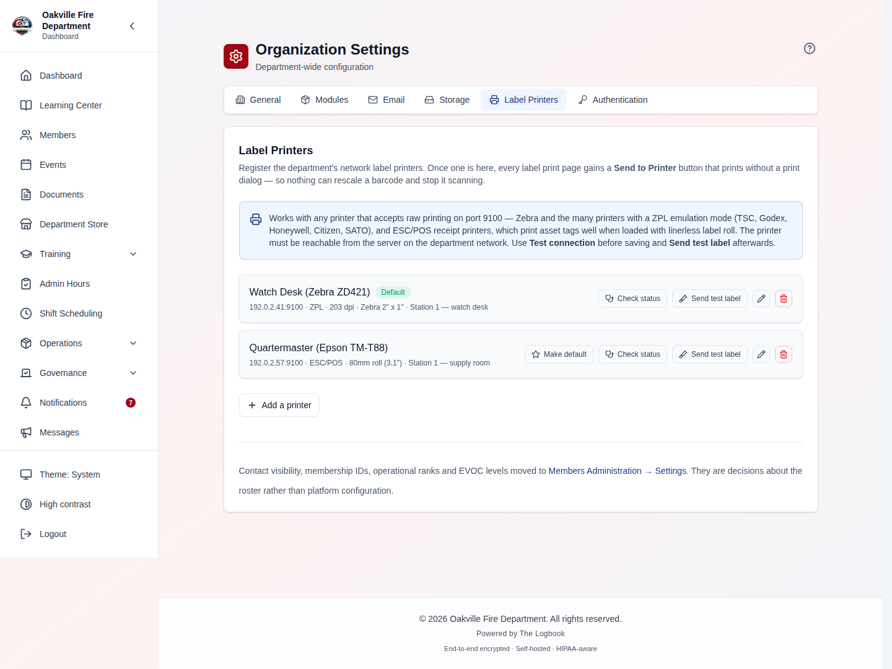

## Every administration page opens the same way

Members, Training, Inventory and Events administration pages now share one
frame: a header, **four headline metrics**, a **Needs attention** queue, then
the tabs you already know.

**The tabs and their contents did not change.** This replaced what sat above
them.

### Choosing the metrics

Three of the four slots are yours to choose. **The fourth is always the count
the attention queue is about**, so a page cannot be set up to hide the number
its own queue is measuring.

| Module    | Built-in default three                           |
| --------- | ------------------------------------------------ |
| Members   | Active, Probationary, Inactive                   |
| Training  | Compliance, Hours this quarter, Active programs  |
| Inventory | Items tracked, Issued to members, Out for repair |
| Events    | Upcoming, RSVPs this week, Check-ins logged      |

**A department that changes nothing keeps these.** The upgrade does not blank
anybody's page.

There are two scopes: a **department default** every administrator sees, and
optionally a **personal** selection. The department decides whether personal
selections are allowed at all — turn that off and everyone looks at the same
four numbers.

> **[SCREENSHOT NEEDED — the metrics settings screen.** _Demo data:_ the Members
> module, department scope selected, with the "applies to everyone" control
> visible and one metric being swapped. The fourth (queue) slot must be visibly
> fixed.**]**

### Who can see the queue

The queue lists work, and **its rows name people**. So it is gated on the
module's own manage permission, not a general administrator flag:

| Page      | Permission         | Also needs                                                          |
| --------- | ------------------ | ------------------------------------------------------------------- |
| Members   | `members.manage`   | **`medical_screening.view`** for the queue and the screening metric |
| Training  | `training.manage`  | The Training module enabled                                         |
| Inventory | `inventory.manage` | The Inventory module enabled                                        |
| Events    | `events.manage`    | —                                                                   |

**Medical screening is health information.** Until this release, "screening
current" and the members queue were readable by anyone with `members.manage`.
Somebody without `medical_screening.view` now sees that tile read **unknown**
rather than disappear — a missing tile makes people look for it, a stated
unknown does not — and an empty queue.

Two smaller fixes an administrator will notice:

- **A member who renewed is no longer both current and lapsed at once.** The
  screening queue counted every historical expired record; it now counts a
  member and screening type only where nothing unexpired covers it.
- **One broken number does not take the page down.** A metric that fails to
  work out renders as unknown and the tabs below it still work.

**[SCREENSHOT — REPLACE the four administration page headers.** The Members,
Training, Inventory and Events admin captures all show a layout that no longer
exists.**]**

## Equipment checks: four item types, and sealed containers

### Nine item types became four

An admin building a check template used to choose between near-synonyms —
`present` and `functional` both stored pass/fail and differed only in what the
crew was asked to do. There are now four:

| Type         | What it stores    | What "passing" means                                                                                                                                                                    |
| ------------ | ----------------- | --------------------------------------------------------------------------------------------------------------------------------------------------------------------------------------- |
| **Level**    | The number itself | Compared to a threshold. The reading is kept because the trend is the useful part. An empty box means "not read yet", not zero                                                          |
| **Function** | Pass / fail       | A fail opens a note and a photo — and **neither blocks the walk.** A crew held at a text box at 07:00 abandons the check, so an unwritten note is flagged on the finished check instead |
| **Count**    | A quantity        | Short of par is a **restock line, not a failure**                                                                                                                                       |
| **Expiry**   | A date            | Confirms the date already on record. Stays amber on every shift inside the pull window                                                                                                  |

Headings and free text are untouched — they are layout, not checks. The builder
now names what each type stores beside its label.

**Your existing templates were converted for you.** Where an item had no
description, the migration wrote in the instruction its old type used to imply
("Confirm the item is in place." / "Switch it on and confirm it works.").
**An item whose author wrote their own description keeps their words.**

### Sealed containers

A compartment — a drug bag, a trauma kit, a sealed pack — can be marked as
**closed with a numbered tamper seal**, in the template builder. On the check,
the crew reads the number, confirms it matches the last check, and **the
counting inside is cleared in one tap.**

Three rules, and each one is the reason the feature is safe:

1. **A seal clears counting only.** It never clears expiry dates or pressure
   readings — those move on their own while the bag sits shut, so an
   out-of-date vial cannot hide behind an intact tag.
2. **A seal proves unchanged, not full.** Confirming carries the previous
   counts forward. It does **not** fill the bag up to par. A bag that was three
   morphine short at its last count is still three short, and that still files
   as a failure.
3. **The shortcut has to be earned.** If there is no earlier intact seal whose
   number matches, the button reads **Record seal** — the seal is still filed
   for the record, and the contents are counted by hand.

**A sealed bag inside a sealed bag gets its own card.** A broken outer seal
says nothing about an intact inner one.

> **[SCREENSHOT NEEDED — the seal panel on a check.** _Demo data:_ two sealed
> compartments — one whose seal matches the previous check (so the clearing
> shortcut is offered) and one whose number differs (so the reader sees
> _Record seal_ and a hand count instead). This contrast is the whole teaching
> point and must be in one frame or two adjacent ones.**]**

### What is _not_ here yet

**Walking a check as a lap** — stop by stop in walking order, with finished
stops collapsed — is built and tested but **not connected to the check screen**,
which still shows the flat compartment list you have today. Do not teach it,
screenshot it, or promise it in this release.

### One change for crews who swap stock

A crew member without `inventory.manage` could move **any** quantity from ready
stock onto the truck, and dispose of lots that were never aboard it. A swap is
now bounded by the lot it replaces, and that lot has to actually be on the item.

## Submit External Training: the certificate goes with it

**Attach the certificate on the form.** It used to be a second step after
submitting, which meant it could be — and often was — skipped. PDF, JPG or PNG,
up to 10 MB.

**The start time is now kept.** The form has always asked for a start time and
a length and worked out the hours from the pair, but only the date and the
hours were stored. Editing a submission therefore had to invent a start — it
assumed 9am — and an officer reviewing a four-hour entry could not tell a
morning class from an evening one.

**Entries submitted before this release have no start time**, and that shows as
blank rather than as 9am. Blank is the truth; 9am would be a guess.

The form also stopped asking one question with three controls: duration is one
stepper.

Two things for records officers to know about the files:

- **Certificates are kept indefinitely** once approved — that is what a
  training record is for. Nothing expires them. If your department has a
  records-retention rule, this needs a decision from you before it needs code.
- **Files are not scanned for malware.** They are checked to be genuinely the
  file type they claim and stored under a name the server chooses, so nothing
  runs on the server. But a certificate opened by an officer is whatever the
  member uploaded.

**[SCREENSHOT — REPLACE the Submit External Training capture.** The screen is
rebuilt; the certificate now attaches inline.**]**

## My Admin Hours

**If you hold `admin_hours.manage`, the numbers you were seeing on this page
were the whole department's.** `My Admin Hours` fetched its totals without
scoping them to you. It is now always your own hours.

The six-tile grid is gone. In its place:

- **A reporting period** — this month, last 30 days, this year, all time —
  driving both the totals **and** the entry list, so the two always describe
  the same window.
- **Three fixed stats**: approved, awaiting review, logged this period, with
  entry counts as sublines.
- **Requirement progress**, where your department has configured requirements
  for your profile. The personal page never showed this, despite it being the
  question members actually have.
- **A ranked category breakdown** with share bars, and one line naming the
  categories with nothing in the period — instead of a tile reading zero for
  each.

**The period defaults to all time.** A calendar-year default hid older entries
behind a control you have to notice first, and "no hours logged in this year"
reads as an empty account rather than an active filter.

> **[SCREENSHOT NEEDED — the rebuilt My Admin Hours page.** No capture of this
> page exists in the guides, and the version it would have shown is gone.
> _Demo data:_ a member with hours in at least three categories and one
> configured requirement, so the category bars and the requirement-progress
> section are both populated, and at least one category with **no** hours in the
> period so the muted "nothing logged in" line appears.**]**

## Events: the list says what it wants from you

`/events` is now ranked by what each event needs from you, with a **Needs you**
band at the top.

**An early check-in is flagged and never credited as attendance.** Tapping in at
17:00 for a 19:00 drill records the honest arrival time and tells the event's
manager how early it was. Attendance credit still runs from the scheduled
start.

Check-ins recorded before this release carry no early figure. Working one out
after the fact would mean deciding what each event's start time was at the
moment somebody tapped, and an event whose start was edited since would be
given a number that was never true.

Two corrections members will notice:

- **The page no longer accuses people who could not have attended.** A member
  who joined after an event ran is not counted as having missed it.
- Credited hours read **"up to"**, because what you are credited depends on
  your recorded attendance, not the event's nominal length.

## Department Store, settings and email

**The Department Store** catalog, checkout and My Orders were redesigned around
the cart, and several setup defects were fixed: the admin dashboard returned an
error, onboarding's **Enable** button did not actually enable the store, and
the position editor stripped store permissions on first save. Worse than any of
those, **enabling the store during setup made setup impossible to finish** —
the final Continue failed outright, because a fourth hardcoded module list
inside the save endpoint had never heard of `storefront`. If you gave up on
turning the store on, try again.

> **Do not use the wizard's per-module "configure permissions" step to restrict
> a module.** It says _"permissions configured!"_ and throws the answer away —
> nothing submits it. That is true of the fifteen modules that still point at
> it; the Department Store's route was removed in this window rather than
> repaired. Set permissions on the positions themselves instead. Tracked as
> **ONBOARD-1** in `docs/KNOWN_LIMITATIONS.md`.

**Nine settings screens** — Organization, Events, Scheduling, Elections, User
Settings, Email Templates and three more — carried five different navigation
idioms between them. They all use one now: a section list on desktop, a
scrollable tab strip on a phone, and the section you are in reflected in the
URL so a link opens where you meant it to. **Save/Reset appears only on
sections it actually writes.** No setting moved or changed meaning.

**Email notifications have a new shell** — a 5px accent rule and a status chip.
**Nothing changes for your department until somebody presses Reset on a
template.** A department that leaves its templates alone keeps exactly the
emails it has today. The Email Templates screen now shows the editor and the
preview side by side, and says which notices your department has changed and
how heavily each is used.

**[SCREENSHOT — REPLACE every settings capture, and every capture of a received
Logbook email.** For the email shots, caption whether the department has
adopted the new shell — both are current, depending on whether Reset was
pressed.**]**

## Who could see what — five fixes to tell your officers about

Four of these were reachable by an ordinary member. Three rested on the same
mistake, and it is worth naming so nobody repeats it: **`inventory.view` and
`prospective_members.view` are part of the baseline Member position.** Checking
for one of them proves only that the person signed in.

| What was visible                                                                                               | To whom                                            | Now                                                         |
| -------------------------------------------------------------------------------------------------------------- | -------------------------------------------------- | ----------------------------------------------------------- |
| **A member's assigned gear** — turnout coat, radio, SCBA mask — and its condition, on **every** member profile | Every viewer                                       | `inventory.manage`, or your own profile                     |
| **Department-wide inventory counts**, low stock and overdue checkouts on the dashboard                         | Every member                                       | `inventory.manage` or `settings.manage`                     |
| **Your own membership application**, through the prospect widget                                               | Anyone reviewing intake who had themselves applied | Excluded from the counts, the aging buckets and the details |
| **Medical-screening compliance and the members queue**                                                         | Anyone with `members.manage`                       | Also needs `medical_screening.view`                         |
| **Unlimited stock movable onto a truck**, and disposal of lots never aboard                                    | Any check submitter                                | Bounded by the lot being replaced                           |

**A member profile is a directory card** — the contact details a colleague is
meant to look up. Which turnout coat somebody signed for, and what condition it
is in, is quartermaster business. If your officers ask why the Assigned
Inventory table vanished from a profile, that is the answer.

**[SCREENSHOT — REPLACE the member profile capture.** Assigned Inventory is now
absent for a viewer without `inventory.manage`. **Caption the capturing
account's grants** — the page differs by viewer, and an uncaptioned shot reads
as a promise.**]**

## Also fixed

- **The app never updated in Brave** until the browser cache was cleared by
  hand. If you have been telling Brave users to clear their cache after every
  release, stop.
- **Calendar day labels shifted a day for any viewer west of the department** —
  a cell showing 26 announced itself as "Tuesday, August 25".
- **The phone month grid got its 44px touch targets back.**

## Upgrade notes for administrators (August 23–24)

- **Twelve migrations.** Back up, confirm `alembic heads` returns exactly one,
  then `alembic upgrade head`. **The head is `e7a41b6d09c2`.**
- **One migration does not reverse.** The equipment-check item-type collapse
  turns nine types into four, and nothing records which of three old names a
  `function` item started as. The downgrade deliberately leaves the types
  collapsed rather than guessing — **a wrong guess renders the wrong control on
  a safety checklist.** No data is lost either way.
- **That same migration writes instructions into items that had none**, and
  leaves alone any item whose author wrote their own description. In the
  shipped preset library it touched 185 of 232 items.
- **Seven migrations deliberately backfill nothing**, and an empty column is
  not a bug: no compartment is sealed, no historical check-in gets an
  early-arrival figure, no historical `qr_scan` is rewritten, training
  submitted before this has no start time, existing email templates keep their
  own colours, no standing shift claims are inferred from anyone's
  assignments, and a department with no metric preferences gets its built-in
  four.
- **Turn on NFC ID Cards** (Settings → Integrations) if you want cards, and
  grant `members.manage_id_cards` to whoever issues them and `members.check_in`
  to whoever runs a station. Neither is granted by the upgrade.
- **Register your label printers** before anyone tries to print. Check that the
  address you enter is reachable **from the server**, not just from your desk.
- **Check who holds `medical_screening.view`.** Officers who could previously
  see screening compliance on the Members administration page will find it
  reading _unknown_ until they hold it.
- **Expect scheduler assignments to start being refused** where a member is not
  cleared for the position. That rule now applies to schedulers, not only to
  members claiming their own seats.

---

# August 24–31, 2026

The busiest week this project has recorded: 274 pull requests and 85 changelog
entries. Four of them change how you work, and the rest are fixes you will
notice mostly by things no longer going wrong.

**The four:**

1. **Your department now has an organizational chart**, and every member can
   open it.
2. **A member record now states two things where it stated one** — what kind
   of member somebody is, and where they sit on the membership ladder.
3. **The equipment check template builder is a different screen.** Not
   restyled — rebuilt.
4. **The Testing Checklist is now a module, and the upgrade switches it off.**

Read the [upgrade notes](#upgrade-notes-for-administrators-august-2431) before
you run this one. Four upgrade steps **take permissions away** (two more add new
grants), and one clears
a field.

## Governance → Organizational Chart: who runs what

**This is new, it starts empty, and it is open to every member.**

Find it at **Governance → Organizational Chart**. It draws your department's
chain of command as a tree, which you can read as an **outline** or as a
**diagram** — the same chart, two ways of looking at it.

**Any signed-in member can read it.** That is deliberate, and it is the whole
point of the screen: a new member should be able to work out who is in charge
of an area without asking three people first. Editing needs
`orgchart.manage` or `settings.manage`; without either, the page simply opens
read-only and shows no edit controls.

> **[SCREENSHOT NEEDED — the org chart, outline view.** _Demo data:_ a chart
> four levels deep — Chief, two Deputy Chiefs sharing one seat, three Captains
> under one of them, and one seat with a non-member holder. Expand the branch
> that contains the shared seat so both names are visible.**]**

> **[SCREENSHOT NEEDED — the org chart, diagram view.** _Demo data:_ the same
> chart. The two views are not interchangeable and one capture cannot stand in
> for the other.**]**

### A seat can hold more than one person

A box on the chart is a **seat**, and a seat holds however many people fill it.
A department with two deputy chiefs puts both in one box rather than inventing
two boxes that mean the same thing.

### A holder does not have to be a member

A seat can name somebody who has no account here at all — your town attorney, a
mutual-aid liaison, the county fire marshal. Type the name and it appears on
the chart. Nothing else about that person is stored, and they get no access.

### Linking a seat to a position saves typing, and nothing more

If a seat corresponds to a position you already maintain — Quartermaster, say —
link it, and the chart **fills the holders in from that position's assignees**.
You do not retype a roster you already keep.

**Unlinking keeps the people you typed, and drops the ones the link supplied.**
That distinction matters before you press it: holders that arrived *from* the
position or rank are filtered out of the seat when the link is removed, because
they were never stored on the seat — they were resolved through the link every
time the chart was drawn. Only hand-entered holders are rows of their own and
survive. **A seat whose holders all came from its link becomes vacant when you
unlink it**, so type the names in first if you want to keep them.

The link is an *assist*, not the box's identity — most departments' org charts
and permission structures do not match, and the chart has to be able to say
what is actually true rather than what the permissions imply.

> **[SCREENSHOT NEEDED — the org chart node modal.** _Demo data:_ a seat with
> two member holders and one non-member holder, its responsibility text filled
> in, and the position link visible. This is the screen that answers both
> questions reviewers ask.**]**

### It starts empty, and that is on purpose

Nothing is inferred from your positions, ranks or member list. A permission
structure is not an org chart, and a guessed diagram is one nobody recognises —
you would spend longer correcting it than drawing it. Start with your top seat
and work down.

## A member is now two facts, not one

**"Membership type" has become "class" and "status".**

Until this release one field carried two independent facts, and you could only
ever state one of them:

- **What kind of member somebody is** — operational, administrative, social.
- **Where they sit on the membership ladder** — prospective, probationary,
  regular, life, retired.

Because they shared a field, there was no way to record a **probationary
treasurer**, and nothing said whether a **life member still rides**.

### What this changed for elections

Elections is where the fused field showed most: the system could only work out
who "the operational members" were by testing for one specific value.

**What actually changed, and one of the two narrows eligibility.** The built-in
voter categories **keep their legacy meaning**: `operational` still requires
operational class **and** regular standing. (An earlier version of this change
read the class alone; it was reverted the same day because it admitted
probationary and retired members to a restricted ballot.) The two real changes
are that **a life member now receives a `regular` ballot** — with one fused
field, "life" and "regular" were competing values and they could not — and that
**every status category now also requires the operational class**, so an
administrative member with regular standing no longer receives ballots
restricted to active or life members.

**If your bylaws intend administrative members to vote on items restricted to
active or life members, use an override or an explicit voter list.** That route
is now closed to them by category alone.

> **No screenshot change here.** The class/status split has **no UI surface**:
> the member screens still show a single Membership Type selector and the pair
> is derived from its value. Existing captures of the profile, the create/edit
> form and the Members administration list are current. The only place a user
> can see this change is a **ballot recipient list**.

### Honorary members are now "social"

That is not a new judgement about your honorary members. It is what the system
was already doing with them — honorary has always been grouped with
administrative and retired when deciding who gets shift access. Putting them
anywhere else would have **widened** shift access on upgrade, which is not a
change to make on somebody's behalf.

### Rank and qualification are now different things

A **rank** says where somebody sits in the chain of command. A
**qualification** says what they are trained to do. They were the same field,
so a **Captain who is also a Paramedic** — an entirely ordinary member of a
volunteer department — had nowhere to be recorded as both.

The standards already draw this line: Firefighter I/II is NFPA 1001, apparatus
operator is NFPA 1002, the officer ladder is NFPA 1021, and EMT and Paramedic
are EMS credentials on a separate track again.

The other half of the reason: **qualifications expire and ranks do not.** Shift
eligibility reads a qualification's expiry **as of the shift date**, not as of
today — the same rule EVOC certifications already use for drivers, and for the
same reason. A card that is current when the roster is built and expired when
the truck rolls qualifies nobody to be on that truck.

**`emt` is now both a rank code and a qualification code, meaning two different
things on purpose.** If your agency uses EMT as a line rank, carry on. If you
want to record who holds a current EMT card, that is the qualification. Neither
implies the other, and you may use either or both.

**Nothing was inferred from your existing records.** The qualification list
starts empty. A department that recorded somebody as an EMT *rank* has said
where they sit, not which card they hold or when it expires — and inventing an
expiry date would be worse than having none.

> **Qualifications are recorded through courses, not entered directly.** Set
> **Certifies** on a course in the Course Library, and recording a member's
> completion of that course creates or renews the qualification. There is **no
> panel for entering, editing or expiring one on its own** — so a card a member
> has held for years needs a training record to match, an expiry cannot be
> corrected except by filing another record, and setting **Certifies** on a
> course does **not** backfill records already filed against it.

## Equipment check templates: one list you scroll

**Every screenshot and every video of this screen is now wrong.** Not stale —
wrong. The controls a viewer would be looking for are not on the screen.

**What is gone:** the metadata sidebar, the three-step progress strip along the
top, the "Template readiness" card, and the Quick Add / Bulk Add mode toggle.

**What replaced all of it:** sections, locations and items are rows in **one
list, in the order a crew walks the rig.**

### Building an item

An item's **name**, the **kind of answer** it asks for — Works / Count / Level /
Date — and the **one number that answer is graded against** are all edited in
the row itself.

Everything else — description, serial and lot numbers, image, critical minimum,
the inventory link — moved behind a **disclosure on the row**. This is the
change that matters most for how long a template takes: opening that disclosure
is no longer a prerequisite for a complete item. You can fill a whole rig's
worth of names and answer types without opening anything.

Each number stays labelled once it holds a value — "par 4" and "min 2" on a
count, "30 days" on an expiry warning — so a saved checklist never shows two
adjacent numbers with no way to tell which threshold is which.

### Adding items is one box per location

Type one and press **Enter**. Or paste a whole list, and confirm a preview that
names every line and lets you set the check type for all of them at once.

### Nesting a location is an indent button

It was a "Reparent: stored inside" dropdown listing every other location on the
template. It is now the indent button on the row. (The dropdown is still there,
in the row's overflow menu, for when you want to move something a long way.)

### When you cannot publish, the page tells you exactly why

Instead of a readiness score, you get **a list of the specific things to fix**,
beside the checklist. Each entry says where the problem is, and clicking it
**jumps to the row, opens its location, and puts your cursor in the field that
is empty.**

On tablets and smaller laptops this list is a bar along the bottom of the
checklist that opens as a sheet. It used to be reachable only by widening the
window.

### The preview is beside you — on a wide enough screen

**The preview docks only at 1440px and wider** (`isWideCanvas`). Below that —
which includes tablets and a good many laptops, a 1366px screen among them —
the Preview control opens the modal, exactly as it does on a phone. The rail
costs 344px, and under 1440 that leaves a canvas too narrow to edit in.

Where it docks, it updates as you type instead of making you open and close a
modal each time.

**The phone layout otherwise keeps what it had:** compact rows, the full-height
item editor, and the search-inventory add sheet.

> **[SCREENSHOT — REPLACE the equipment check template builder capture, wide
> canvas.** _Demo data:_ an engine template with three locations, one nested
> inside another, at least one item of each answer type, and the "Before
> publishing" list showing two outstanding items. **Set the viewport to at
> least 1440px** — the preview does not dock below that. **The old capture
> shows a sidebar, a progress strip and a readiness card, none of which
> exist.**]**

> **[SCREENSHOT — REPLACE the equipment check template builder capture, phone
> (390×844).** _Demo data:_ the same template; capture the compact rows with
> the blockers bar visible along the bottom.**]**

### One more thing, for crews who bulk-edit

A bulk delete of template items is now **retry-safe**. If the request is sent
twice — a flaky connection, a double tap — the second one cannot delete
whatever happens to be sitting in those positions by then. Before, an
intervening edit meant a retry deleted rows nobody selected.

And **bulk edits to a saved checklist now save every item you selected**, not
just the last one.

## The Testing Checklist moved, and it is switched off

**If `/testing` has disappeared, this is why.**

The Testing Home — the page listing every screen in the application so you can
walk them before going live — is now a **module of its own**, and the upgrade
leaves it **off**.

Turn it back on at **Settings → Modules → Testing Checklist**.

**Marks held on the server are not lost.** They are still there and reappear
the moment you switch the module on.

> **⚠️ One exception.** The checklist used to keep marks in the **browser**,
> under `logbook.testing-checklist.v1`. When it moved to the server there was
> no import path, and there still isn't. If you are part-way through a
> walkthrough on a build from before that move, **export your run before you
> upgrade** — re-enabling the module afterwards gives you an empty server run.
 While it is off, the navigation
entry, the page and the data behind it all refuse, the same way every other
switched-off module behaves.

**It is not offered during first-time setup**, deliberately. It is a tool for
checking an installation, not a decision a department needs to make while
making every other one.

> **[SCREENSHOT NEEDED — Settings → Modules with Testing Checklist off.**
> _Demo data:_ the module list on a fresh install. This is the answer to "where
> did /testing go", and it is the single most useful new capture in this
> window.**]**

### Testing now works in runs

A **run** is one named pass over the application — "Pre-launch, build 1.4".

- **Starting a new run archives the one before it.** The old marks stay
  readable and exportable from the run picker instead of being cleared away, so
  you can show what the second pass fixed.
- **The first mark opens a run on its own**, so nobody has to remember to start
  one.
- **Marks record the build they were made against.** After a deployment, the
  ones made on an earlier build are flagged, and **Needs re-test** filters to
  exactly those.

### Every mark is checked against what the app expected

This is the part worth explaining to whoever signs off your testing.

Each page in the checklist knows what *should* happen for the account doing the
testing. When you mark it:

- **A refusal that happened as predicted counts as a gate verified.** It is
  positive evidence, not a hole in your coverage.
- **A page that opened for an account that should have been refused is
  flagged** right where you marked it, counted in the header, and listed in the
  printed report as a **permissions defect**.

That distinction is why this is more than a list of tickboxes: it separates
"this screen is broken" from "this screen is visible to the wrong people".

> **[SCREENSHOT NEEDED — Testing Home with a named run and the run picker
> open.** _Demo data:_ a current run, one archived predecessor, a mix of pass /
> fail / blocked marks, and at least one gate mismatch flagged.**]**

### Getting it out of the app

- **CSV** of every mark.
- **Permission matrix** — page by tester, for the person who signs off.
- **Printable report** at `/testing/report/print` — coverage, failures with
  their notes, gate mismatches, and coverage by area. Save it as a PDF.
- **Markdown**, unchanged.

> **[SCREENSHOT NEEDED — the printable testing report.** _Demo data:_ the same
> run, with at least one failure carrying a note and one gate mismatch, so both
> sections of the report have content.**]**

### Marking with the keyboard

`j` and `k` move between boxes, `p` / `f` / `b` mark the focused one, and `n`
jumps to the next page with no mark.

## Facilities: a settings screen, and a much smaller audience

### Your facility files were readable by the whole department

**This is the one to tell your officers about.**

A facility's Files section stores each upload in the shared **Documents**
module and keeps a reference on the facility record. The facility *record* was
properly restricted — but the *file* was not. Uploads landed outside any
folder, and a file in no folder is treated as belonging to the whole
organization.

So anyone who could open the Documents module could list and download a
facility's **insurance policies, leases, capital project files and inspection
paperwork.**

Fixed for files going forward: folders now carry the same three facility
grants, and a newly uploaded file is filed into its facility's own folder as
soon as it is attached. Existing facility **folders** have their permissions
corrected on upgrade.

**⚠️ **Existing files are not re-filed, and that is the part to act on.** The
migration sets the folders' permissions; it does **not** move documents that
were already stored outside a folder into them, and the app files a document
only as it is newly attached. **Every facility file uploaded before this
upgrade is still folderless, still treated as organization-wide, and still
listable and downloadable by anyone who can open Documents.** Re-attach or
re-file them to close it — the upgrade alone does not.

### Facilities is now a leadership and facility-manager workspace

`facilities.view` has been **taken off the regular member position, and then
off the shared operational officer positions.** If your line officers used to
open Facilities, they will not be able to after this upgrade. Re-grant it on a
position that is meant to carry it if that was your intent.

### A settings screen for managers

**`/facilities/settings`** is new, and needs `facilities.manage`. It holds the
lookup configuration the module uses — the values you would otherwise have been
editing in one-off dialogs.

> **[SCREENSHOT NEEDED — `/facilities/settings`.** _Demo data:_ at least two
> lookup categories populated, so the screen is not empty.**]**

### Two officers, one new facility

The first time anyone opened a facility's Files tab, the app built that
facility's folder structure. Two officers doing that in the same moment — which
happens the day a new station is added — could each build a **duplicate set**.
That is serialized now.

## Inventory: the words changed, and received stock finally works

### "Checkout batch" is now "Item Distribution"

The module had several names for the same operations. They are settled now, and
the screens use these and no others:

| Term               | Means                                                                       |
| ------------------ | ---------------------------------------------------------------------------- |
| **Assignment**     | Serialized gear held on an ongoing basis                                    |
| **Temporary loan** | Serialized gear expected back by a date                                     |
| **Issuance**       | Quantity-tracked stock given to a member                                    |
| **Return**         | Physically receiving assigned or issued gear                                |
| **Check-in**       | Closing a temporary loan when the gear is received                          |
| **Transfer**       | Moving serialized gear between holders                                      |
| **Distribution**   | One mixed batch that may create assignments, temporary loans and issuances |

**Nothing about your data changed** — this is labels only. If you integrate
with the API, the values on the wire are untouched.

### Stock you received could not be issued

**Receiving stock through the reorder workflow created a purchase record and
never updated the item's on-hand count.** Newly received units could not be
checked out or issued to anybody. Fixed — and if you have been wondering why
your shelf count disagreed with your paperwork, this is likely why.

### Damaged gear can no longer be returned to service

Completing maintenance and recording the condition as **poor, damaged or out of
service** no longer allows that item to go back into service. It stays out
until a later inspection records a safe condition.

### Also

- **Two quartermasters reviewing the same return request** — one denying it,
  one physically receiving it — could overwrite each other. Only one outcome is
  recorded now.
- **The return-review screen no longer carries a safety follow-up choice from
  one request to the next.** A "send to write-off review" selected for a
  damaged item was applying itself to the next request reviewed, even a
  perfectly good one.
- **The "Transfer is immediate" checkbox is gone.** Custody transfers have
  always taken effect immediately; the checkbox implied a deferred option that
  never existed.
- **Custody-transfer audit entries now record who performed the transfer.**

> **[SCREENSHOT — REPLACE the inventory item detail, return-request review and
> transfer captures.** The vocabulary changed, and the transfer screen lost a
> checkbox.**]**

## Department Store: embroidery and engraving are different jobs

They shared one "customization" field. So an **engraved brass plate asked you
for a thread colour**, which means nothing, and there was no way to specify
what an engraving should actually say separately from what an embroidery
should.

They are now separate, and the thread swatch appears only where thread is
actually used.

**Variant sizes also sort in garment order now.** `XL` no longer files between
`L` and `XS`.

> **[SCREENSHOT — REPLACE the store item detail and sizing request captures.**
> Capture an embroidered item and an engraved one; the difference is the
> point.**]**

## Compliance: clearing a setting now actually clears it

**Re-check your compliance percentages after upgrading.** They may move, and
for some groups they may move a lot.

On the compliance requirements configuration page, **clearing a field and
saving left the old value in place.** You got a success toast; the save was
silently dropped for that field. Email report recipients, the reminder-days
list, a profile's description, its threshold overrides and its
membership-type/requirement selections were all affected.

The consequence is bigger than the bug sounds. **A compliance profile whose
officer had unchecked every required training requirement — leaving it with
none required — was being graded against every active org-wide requirement
instead of none.** Org-wide compliance percentages and per-profile grading
could be materially wrong for any group meant to have no required
certifications. A profile whose only customization was a lenient or strict
threshold override never had that override applied either. Both compute
correctly now.

Also: **the "Notify members when they become non-compliant" panel is now
labelled as not yet active.** The setting saves, and nothing sends the
notification yet. The page no longer implies otherwise.

> **[SCREENSHOT — REPLACE the compliance requirements configuration capture.**
> The non-compliance notification panel now carries a "not yet active"
> label.**]**

## Grants & fundraising

- **A report covering a range that included today — the default — dropped
  everything recorded later that same day.** Any report you ran and filed
  understates its totals. Re-run anything you are relying on.
- **The fundraising payment-method breakdown showed 0.0% for every method** as
  soon as two or more methods had donations, with no error.
- **View-only members were shown buttons that did not work.** New Campaign, Add
  Donor, New Application, Add Item, Record Expenditure, Add Task and Add Note
  all appeared, failed on click, and explained nothing. They are hidden now for
  members without permission to use them.

> **[SCREENSHOT — REPLACE the grants dashboard, campaigns, donors and
> application detail captures**, and caption which grants the capturing account
> holds — the action buttons are now permission-dependent.**]**

## Medical supplies

- **The Low Stock count on the summary only looked at the first 500 active
  items.** A department with a larger medical catalog could have a low-stock
  item missing from the headline number while it was listed correctly in the
  table below. If your headline and your table have ever disagreed, this was
  why.
- **Editing a category or item left no audit trail.** Creating one was
  recorded; editing it was not. Both are recorded now.

## Meetings and minutes

- **"Unlink" on a linked event never unlinked anything.** It showed *Event
  unlinked* and the link came back on the next page load.
- **Meeting records left no audit trail.** Minutes already recorded who changed
  what. The meeting scheduling records — create, edit, delete, approve, and
  their attendees and action items — recorded nothing. They do now.

## Who could see what — the disclosure fixes

Tell your officers about these. Each was live before this release:

- **Facility files** — readable by the whole department through Documents.
- **Notifications** — every member could read every other member's.
- **Admin-hours progress** — an officer with compliance access could look up
  any member's progress **in any department**, not just their own.
- **The finance approvals queue** was scanning every organization's pending
  steps.
- **A membership applicant's file** could reach a signer who could not
  otherwise view it.
- **A member's audit history** could show unrelated actions performed on
  somebody else.
- **Six pages** could hold member-identifying data in the browser's short-lived
  cache for up to 90 seconds — a training cohort's roster, a program's
  enrollment-eligibility list, an external provider's member mappings, a
  form-management page, a raw analytics export, and two training-officer
  dashboards.

And four **separation-of-duties** gaps: a storefront manager could settle their
own order's payment, a finance approval token could approve its own requester's
request, a **secretary could submit and approve their own meeting minutes**,
and a skills-testing officer could void or return their own result.

**One more, which is not a disclosure but belongs here:** the background
security monitoring meant to detect session hijacking and unusual bulk
downloads **was never running at all** — it looked for the signed-in user
before the request had been authenticated, under a name nothing ever set. Both
checks run now.

## Also fixed

- **Creating a new member was completely broken** — every attempt failed with a
  server error.
- **Two approvers acting at the same moment could double-charge a budget**, and
  a budget's cap could be quietly bypassed.
- **Two coordinators transferring the same prospect** — or one person
  double-clicking — could create two accounts for one person.
- **A voter with a stale browser session could be blocked from voting**, and a
  recalculated quorum could read a stale attendee count.
- **Deleting a grant opportunity could silently wipe out every application ever
  linked to it.**
- **The admin hours CSV export** now recovers from an expired session instead
  of downloading a broken file.
- **An already-sent department message could go out a second time**, and a send
  that was reported as failed could be recorded as delivered.
- **Editing a form, a form field, a medical supply, an item or a category**
  could turn a cleared field into a confusing server error.
- **The chief was missing from every notification meant to include them.**
- **An EMS-only agency was being seeded a fire department's positions**, and an
  EMT rank granted no permissions at all.

## Upgrade notes for administrators (August 24–31)

- **Forty-five migrations.** Back up, confirm `alembic heads` returns exactly
  one, then `alembic upgrade head`. **The head is `f6a7b8c9d0e1`.**

- **Four upgrade steps take permissions away from seeded positions**, and
  nothing grants them back:
  - `compliance.view` off the **Member** position.
  - `notifications.view` off the **baseline member and junior rank** positions.
  - `facilities.view` off **regular members**, then off the **shared
    operational officer** positions.

  Two new permissions are granted: `training.configure` to the positions that
  configure training, and `users.view_consents` to the Historian and PIO.
  Your department's own customized positions are left alone — only seeded ones
  move.

- **Every administrative member has had their operational rank cleared, and it
  does not come back on downgrade.** An operational rank carries
  chain-of-command permissions with it, so an administrative member holding one
  held grants that role was never meant to have. Nothing recorded which ranks
  were cleared — restoring them would also restore ranks an officer cleared
  deliberately.

  **You cannot simply set the rank again.** The API refuses the
  administrative-class/rank pair with a 400 and the edit screen disables the
  control — a rank carries chain-of-command permissions, which is what that
  class is outside of. If the rank is right, **change their class first**.

- **Four migrations do not reverse**, and in three of them a downgrade that
  *did* put the old values back would be the more destructive choice: the rank
  clearing above; the recovery of membership standing out of membership
  positions (nothing records which members it reclassified, so putting them all
  back would flatten standings you set deliberately); and the crew seat name
  canonicalization, where `EMT` and `EMS` really were one seat and splitting
  them again would have to guess. The fourth — the administrative-seat flag on
  stored seats — is a no-op downgrade because older readers accept the extra
  field.

- **Several migrations deliberately backfill nothing.** Member qualifications
  start empty, the org chart starts empty, and testing runs start empty. An
  empty result there is correct, not a failed upgrade.

- **Turn the Testing Checklist back on** (Settings → Modules) if you were using
  it.

- **Re-check your compliance percentages.** The configuration fix can move
  them, and for any group meant to have no required certifications it can move
  them a lot.

- **Re-run any grant or fundraising report you filed**, if its range ended
  today. It understated its totals.

- **Warn your quartermaster** that "checkout batch" is now Item Distribution,
  and that stock received through the reorder workflow is finally issuable.

- **Check who your next ballot reaches.** Two categories changed: a life member
  now receives a `regular` ballot (they could not before), and an
  administrative member with regular standing **no longer** receives ballots
  restricted to active or life members. The `operational` category itself is
  unchanged — it still requires regular standing.
