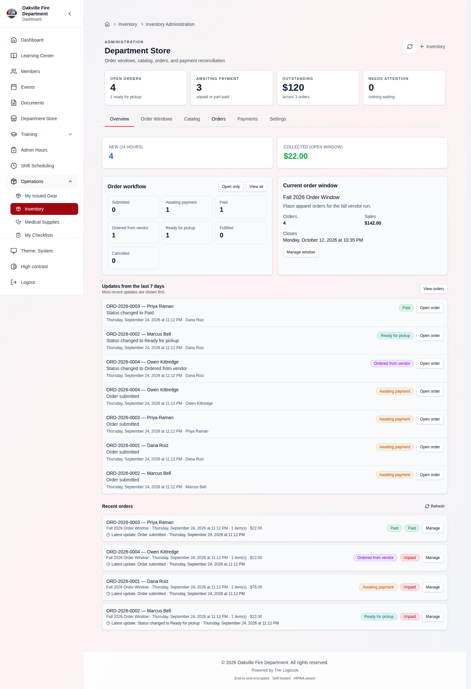
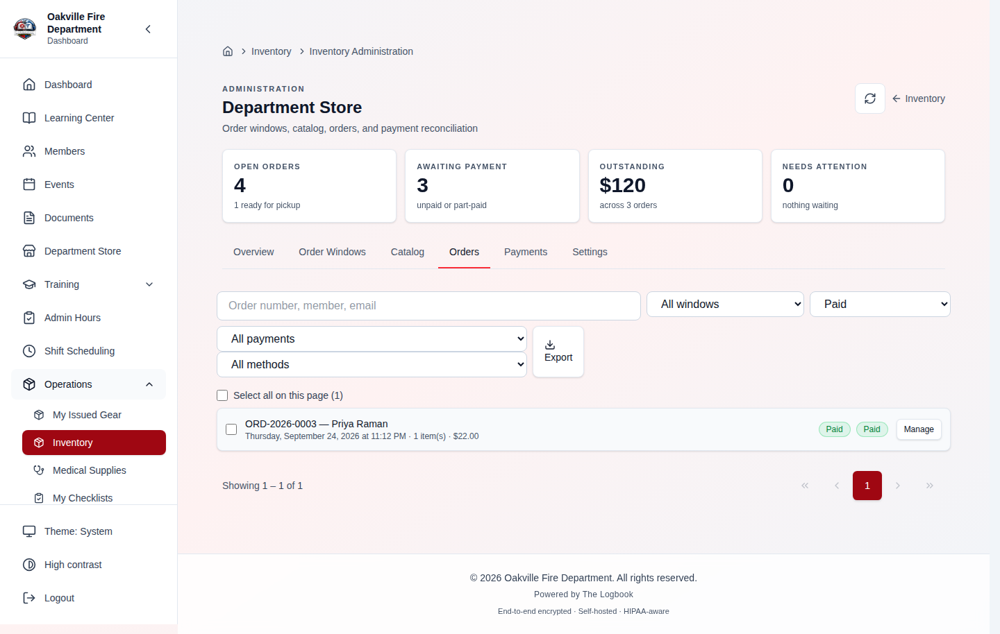
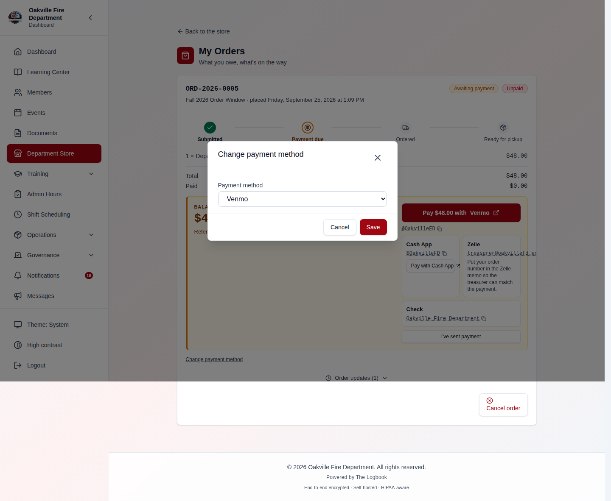
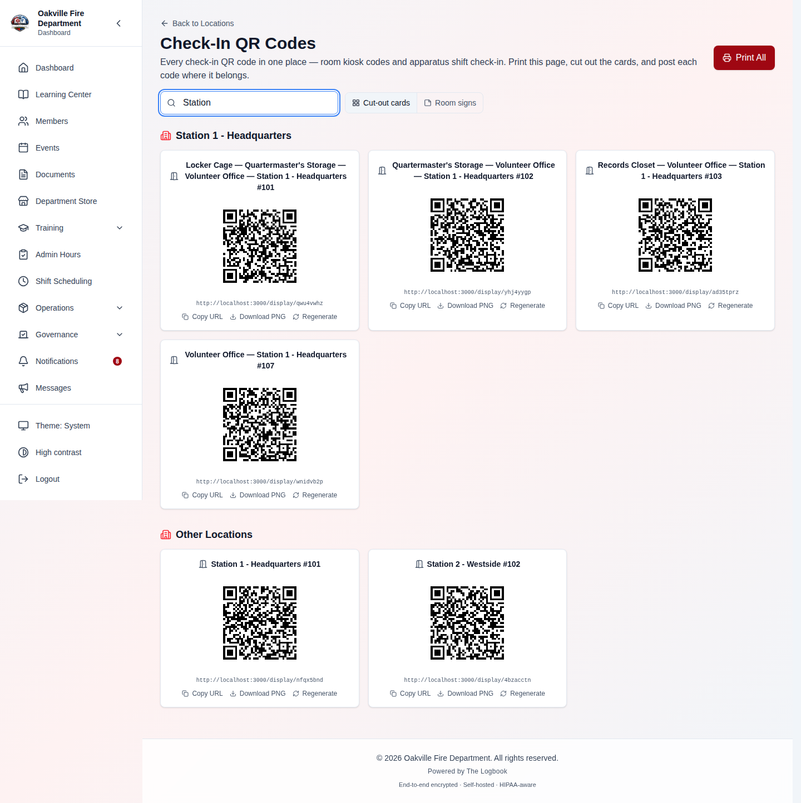
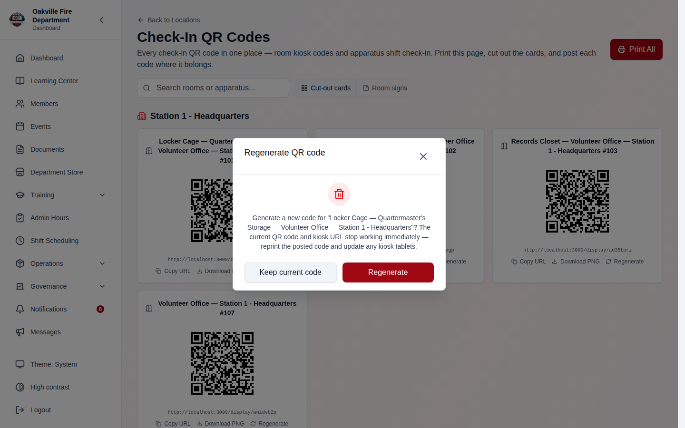
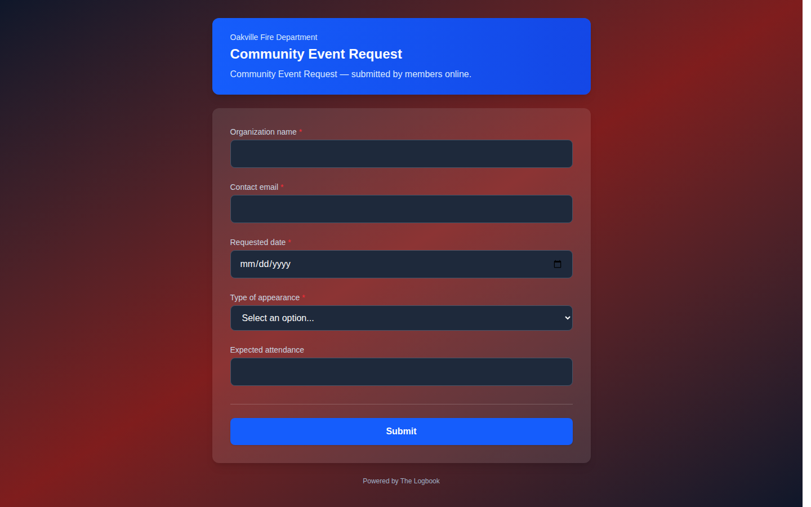
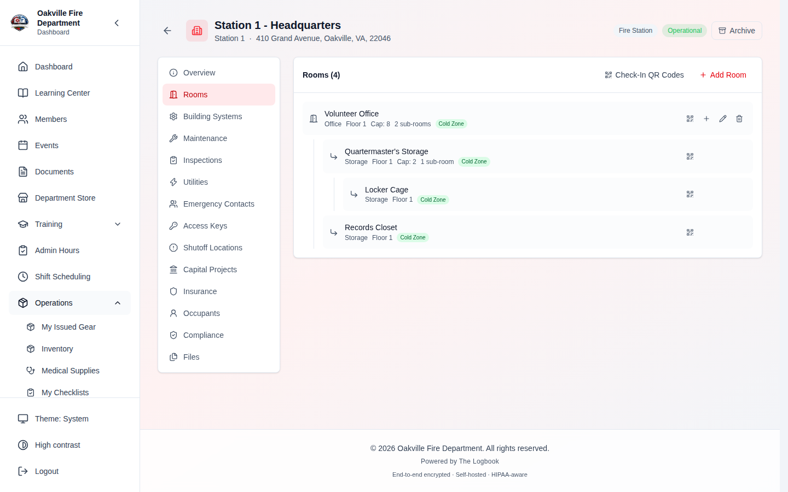
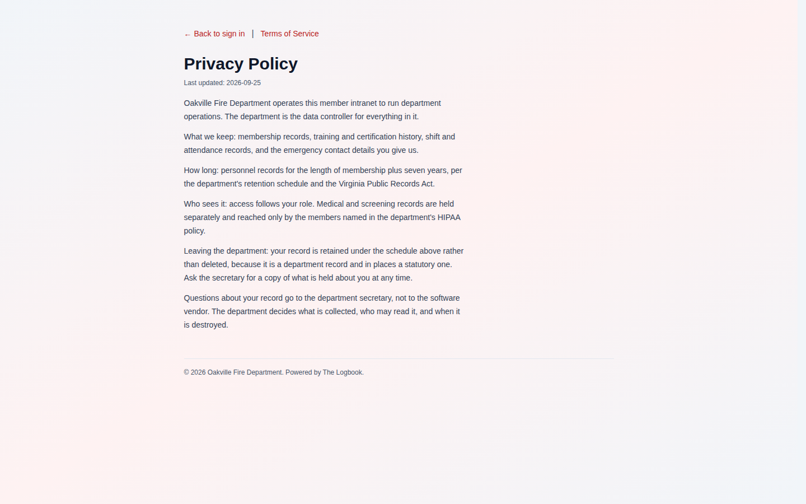
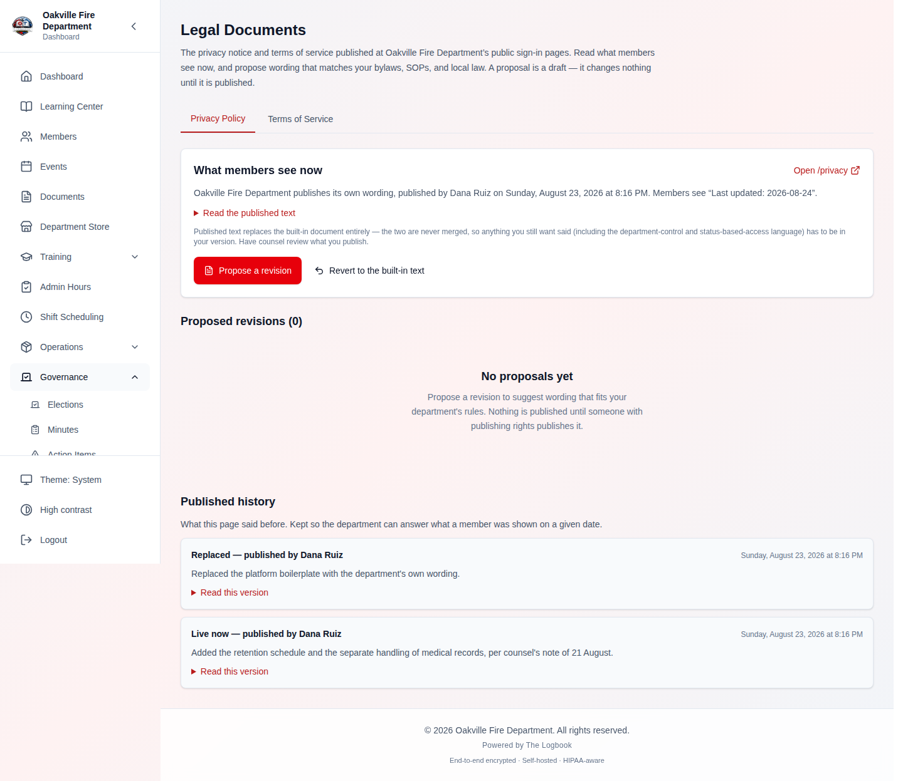
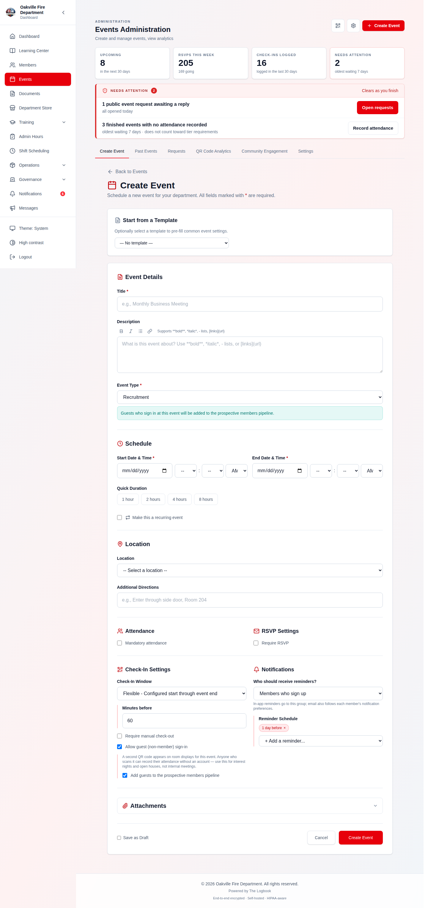

# August 12–23, 2026 workflow updates

This lesson is the operator-facing companion to the
[six-day change audit](../CHANGE_AUDIT_2026-08-10_TO_16.md), its
[three-day detail](../CHANGE_AUDIT_2026-08-12_TO_14.md), the
[August 15–16 detail](../CHANGE_AUDIT_2026-08-15_TO_16.md), the
[August 17–19 audit](../CHANGE_AUDIT_2026-08-17_TO_19.md), and the
[August 19–23 audit](../CHANGE_AUDIT_2026-08-19_TO_23.md). It explains what
members and administrators now do differently. Permission names are included
because a control that is absent is usually a permission or module-state issue,
not a rendering failure.

> **August 15–16 added two changes with no new screen**, so they are easy to
> miss in a walkthrough and are covered at the end of this lesson: the
> installation wizard no longer survives leaving the tab, and the dark-mode
> background now covers the scrollbar gutter. Neither needs a migration, a
> permission grant, or any configuration.

## Elections: reuse a ballot without reusing election data

An election manager can open Ballot Builder, choose **Your saved ballots**, save
the current ballot structure under an organization-unique name, or apply/delete
a saved template. The template includes ballot configuration and election
settings, but never candidates, voters, tokens, votes, attendance, or results.
Applying one creates fresh ballot-item IDs.

**Edge cases:** names compare case-insensitively; replacing and deleting require
confirmation; invalid/duplicate item IDs and voting methods are rejected;
`all` cannot be mixed with another voter type; supermajority needs a percentage;
count quorum can exceed 100 but percentage quorum cannot. Manual paper ballots
must be entered as an attested count and cannot exceed the eligible roster.

> **[SCREENSHOT NEEDED — Ballot Builder → Your saved ballots, showing the visible template name, item count, replacement warning, and action buttons; seed one organization-owned template and no candidate/vote data. Follow with a before/apply/after election-settings capture because preserved settings are applied silently and are not summarized in the picker.]**
>
> **[SCREENSHOT NEEDED — closed election results showing manual paper-ballot count and its roster-bound validation.]**

## Dashboard and admin hours

The dashboard is now a station board. Department Messages shows pending items
and persistent notices rather than an arbitrary recent-history slice. Admin
hours separates calendar-year reporting from rolling periods and displays each
configured category against its own requirement.

**Edge cases:** conditional cards appear only when their module/data applies;
reading a message does not remove it mid-read, but it clears on the next load;
persistent notices remain; calendar year is not “last 365 days.” Mobile cards
and breadcrumb/action targets must remain at least 44px.

> **[SCREENSHOT NEEDED — populated station board with one pending message, one persistent notice, and conditional cards identified in the caption.]**
>
> **[SCREENSHOT NEEDED — Admin Hours Summary on Calendar Year with at least two configured categories and visibly different thresholds.]**

## Storefront

Store administrators now see activity/status counts and can filter the order
list by the corresponding states. Organization settings can hide the store-open
banner. A member can change the external payment method on their own order; the
application records the method/status but does not process the payment.

**Edge cases:** members cannot edit another member's order; payment and
fulfillment remain separate; variant/product locks are canonicalized; notice and
email results do not reveal other recipients; counts and filters are scoped to
the active organization.



The counts and the list are two tabs, so they are two pictures. Overview holds
the cards above; Orders holds the list they describe. Read them together — the
workflow breakdown counts **Paid 2**, and filtering the Orders list to Paid
returns those same two orders:





**Nothing on that screen says the department is not taking the money, so say it
in training.** The picker records _how_ a member intends to pay and
"I've sent payment" records _that they say they have_ — both are claims the
treasurer then reconciles against the actual account. No card is charged and no
transfer happens here. The screen offers a handle to pay through and a button to
report having done so, which reads as a checkout to anyone who has not been told
otherwise.

## Room and apparatus QR codes

Authorized administrators can use the Check-In QR Codes directory to search,
download PNG codes, and print room signs. Facility-room codes and apparatus
shift check-in codes are available from their inline entry points. Regenerating
a location display code immediately invalidates the old code.

**Edge cases:** the bulk directory is restricted; a QR target is organization
bound; a stale printed sign stops working after rotation; sensitive facility
fields require `facilities.view_sensitive`, while editing still requires
`facilities.edit` or `facilities.manage`.





## Apparatus crew seats and scheduling settings

Crew positions now select configured ranks instead of relying on free text.
Shift settings persist per organization and calendar navigation retains its
context. Members retain the completion/report flows they are authorized to use
when equipment-check template administration is restricted.

**Edge cases:** legacy position names remain readable; an incompatible rank
cannot be saved; switching organizations must not reuse the prior organization's
rank or settings cache; finalization resolves apparatus labels in batches.

> **[SCREENSHOT NEEDED — apparatus form crew-position rank picker, including one legacy read-only position in the demo data.]**

## Events, reminders, check-in, and outreach forms

Event and template Notifications now store a reminder audience: `going` for
members who RSVP Going, `all` for every active member in the organization, or
`none` to disable reminders. Optional events default to `going`; mandatory
events default to `all` until explicitly edited. Flexible check-in now defaults
to 60 minutes before start, with the full workflow, delivery caveats, early
member/guest distinction, and screenshot requirements in
[Events & Meetings](./04-events-meetings.md#reminder-audience-and-one-hour-check-in-default-august-14-2026).

The Event Settings outreach picker discovers only related public-outreach forms
and only for event administrators. Mandatory-event eligibility uses the
organization's configured membership tiers. Early-ended events can be finalized;
reports count reviewed attendance.

**Edge cases:** ordinary form viewers do not receive the administrative catalog;
forms and events from another organization never appear; deleted interviewers
remain as historical names rather than breaking an applicant record.

> **[SCREENSHOT NEEDED — Event Settings outreach-form picker under an event-admin account, with a non-outreach form intentionally absent.]**

## Training sessions, programs, and skills tests

A training-session editor can link the session to a requirement, course, and
program. Approved participation then feeds the owned program requirement.
Program pages have an Admin breadcrumb for managers. A failed skill step may
deduct configured points without forcing the entire test to fail; resume count,
result visibility, and official-test policy remain server enforced.

**Edge cases:** cross-organization and mismatched-program links fail; deleting a
program does not delete a requirement it does not own; undated training cannot
satisfy recency; members cannot read officer-only checklist/sign-off state; a
resume conflict is scoped to the current test and is not blindly retried.

> **[SCREENSHOT NEEDED — training-session edit flow with requirement, course, and program linkage populated from one organization.]**
>
> **[SCREENSHOT NEEDED — skill result illustrating point deduction without automatic whole-test failure; caption the configured pass rule.]**

## Notifications and integrations

Completing related event or scheduling actions archives the matching
notification in the database. It does not archive unrelated notifications.
Salesforce readiness/preview/sync now retains pagination and retries transient
failures while keeping the encrypted client secret out of responses and logs.
Webhook diagnostics redact credentials and unsafe payload fields.

**Edge cases:** relation matching includes organization and action/entity IDs;
Salesforce rejects missing/unsafe configuration; retry is for transient errors,
not invalid credentials; every targeted department message still receives
best-effort email, and Urgent adds SMS only when its consent/configuration gates
pass.

> **[SCREENSHOT NEEDED — same notification before and after completing its related action, with an unrelated notification still present.]**
>
> **[SCREENSHOT NEEDED — Salesforce readiness/preview result with secrets and tokens visibly absent.]**

## Installing: the wizard is now one tab, one sitting _(August 15)_

**Who this affects:** whoever runs the one-time installation wizard at
`/onboarding`. Nobody else — existing departments see no change.

The wizard holds a short-lived credential that authorizes the requests creating
the organization, its stations and apparatus, the IT team, and the first System
Owner account. That credential used to outlive browser restarts and was readable
from every tab on the site. It now lives only in the tab that started the run,
because on a shared or station-kiosk machine a credential that can finish
creating a department should not still be sitting there the next morning.

**No permission, module setting, endpoint or migration is involved.** What
changes is how you schedule the install:

| Situation                                  | Result                                                                                |
| ------------------------------------------ | ------------------------------------------------------------------------------------- |
| Finish in one tab without closing it       | Normal path                                                                           |
| Open `/onboarding` in a second tab mid-run | That tab starts its own session; the original step refuses to save                    |
| Close the browser partway through          | The run is over — restart the wizard                                                  |
| Idle more than 30 minutes                  | The server session expires. It always did; the timer resets on each action            |
| "Onboarding has already been completed"    | A **different** condition: a department already exists. Sign in, do not restart setup |

**Teach this part explicitly, because the screen misleads.** The answers you
typed are stored separately and are _not_ cleared. Reopen the wizard after a
restart and **the form comes back filled in while the session behind it is
gone** — nothing says so until the next step fails. The filled-in form is a
local draft, not a resumed session; the recovery is to start the wizard over,
not to re-type into it.

Practical guidance for an installer: gather the department address, station
list, apparatus list and first administrator's details before starting, allow an
uninterrupted half hour, and stay in one tab until the dashboard appears.

> **[SCREENSHOT NEEDED — sequence of two: (1) the wizard reopened after a browser restart, showing the previously typed answers repainted; (2) the session-expired error raised when continuing to the next step. Demo data: start an onboarding run through the stations step, close the browser, reopen `/onboarding`. Both frames are required — a single frame of either one teaches the wrong lesson.]**

## Dark mode: the strip at the right edge is gone _(August 15)_

**Who this affects:** everyone using dark mode, on every page — including the
public pages members' families and applicants see (public forms, ballot voting,
application status).

The themed background gradient now covers the browser's scrollbar gutter. It
previously stopped short of it, so in dark mode a bright strip ran down the
right edge of every page. There is nothing to configure and no behavior change;
it is purely what the screen looks like.

**Why it appears in a workflow lesson at all:** it invalidates images. Any
dark-mode screenshot, printed handout or recorded video captured before August
15 that shows a full browser window may still show the old strip. When you reuse
department training material, check the right edge of the image before handing it
out.



_The gutter itself is not in this picture, and cannot be._ The headless browser these captures are taken with draws overlay scrollbars, so it reserves no gutter at all — measured at 0px even on a page forced long enough to scroll. What the image shows is the themed gradient reaching the window edges; to see the strip this release removed, open a public page in dark mode in your own browser on a desktop, where the scrollbar takes up width.

**Two problems this caused, both already fixed** _(2026-08-16)_. Recorded here
only so nobody re-reports them from an older build:

1. Printing with the browser's **"Background graphics"** option switched on could
   put the themed background behind a scorecard, skill sheet, label or QR sign —
   in light mode. Fixed.
2. The six print-preview screens (skill sheet, scorecard, member training record,
   program, compliance, shift report) briefly showed the themed background
   framing the grey backdrop behind the sheet. Cosmetic, and what came out of the
   printer was never affected. Fixed.

If you see either on your installation, you are on a build from between
August 15 and 16; update.

## Upgrade notes for administrators

The notes below apply to the August 12–14 changes; the August 15–16 window
has [its own upgrade notes](#upgrade-notes-for-administrators-august-1516)
further down — it **does** carry a migration (`20260816_0001`, nested
facility rooms; plus the 08-16 inventory-vendor and storage-area-barcode
backfills) and a deployment floor (Docker Compose v2.24.4+).

Back up the database and encryption keys separately, require a single result
from `alembic heads`, and run `alembic upgrade head`. Production transport TLS
is fail-closed unless the operator explicitly acknowledges a plaintext
configuration. The active-prospect reconciliation may consolidate duplicate
active emails within an organization; review migration logs before and after.
Before upgrading, run the active-prospect duplicate query in the
[technical audit](../CHANGE_AUDIT_2026-08-12_TO_14.md#alembic-route-upgrade-data-path).
A non-empty result is a hard stop: review linked applications, keep the earliest
record, mark the remaining duplicate active rows inactive, and re-run the query.
The unique index otherwise fails before the later reconciliation can run. Never
downgrade merely to repair a migration fork.

## Facilities: rooms can now live inside other rooms (August 15–16)

The Rooms section of a facility renders a containment tree. Use the
add-a-room-inside action on a row, or the room form's **Located inside**
picker, to place a room inside another room in the same facility. Sub-rooms
show indented with per-container counts, and the cross-module room picker
(Events, Training, Scheduling) indents them too and prints the containment
path for the selected room. A nested room's linked Location is renamed with
the full path.

**Edge cases:** container must be the same facility and organization; a room
cannot enter its own subtree; five levels maximum; deleting a container
re-parents its sub-rooms up one level (never deletes them) and the
confirmation says so; moving a room across facilities carries its subtree and
re-syncs Locations; clearing floor/capacity/description now persists on save.

The full walkthrough with screenshot markers lives in
[Apparatus & Facilities → Nesting rooms inside rooms](./06-apparatus-facilities.md#nesting-rooms-inside-rooms-2026-08-16).



## Privacy and access tightening (August 15–16)

Four behavior changes members and officers will notice:

- **Colleague profiles show less to `members.view`.** Opening a directory
  profile without `users.view` no longer reveals the colleague's MFA state,
  email-verification state, last login, account timestamps, notification
  preferences, or the permission lists behind their roles — role names remain.
  Members-managers and the member themselves still see everything.
- **Hire date joined the restricted profile fields.** Like rank, station,
  platoon, and membership number, changing `hire_date` now requires
  leadership, the secretary, or the membership coordinator — it drives
  automatic membership-tier advancement.
- **Pending election nominations are phase-scoped.** The member-facing
  candidate list shows pending nominations only while nominations are open
  (so nominees can respond). After that, members see accepted candidates
  only; `elections.manage` always sees the full list.
- **Logout on a shared computer clears equipment-check drafts** along with
  shift-report drafts and offline queues. The next person at a station
  computer cannot recover the previous member's in-progress apparatus checks.

**Edge cases:** the profile redaction returns nulls, not errors — an
integration reading those fields must tolerate their absence; the candidate
list change is per-request permission logic, not stored state, so no data
migration is involved; the draft purge also removes orphaned draft keys that
lost their index entry.

> **[SCREENSHOT NEEDED — the same colleague profile side by side as seen with `members.view` only (metadata absent) and with `users.view`; use a demo member with MFA enabled so the redaction is visible.]**
>
> **[SCREENSHOT NEEDED — profile edit attempting a hire-date change without the coordinator grant, showing the 403 explanation toast.]**
>
> **[SCREENSHOT NEEDED — member candidate list on an election in nominations phase (pending visible) and the same election after close (accepted only); label which account is which.]**

## Reliability changes members may notice (August 15–16)

- **External finance approvers:** the emailed approve/deny link works exactly
  once. A second click (or a concurrent duplicate) reports the step as
  already actioned rather than approving twice.
- **Public forms:** submissions that fail validation — and bot submissions —
  no longer count against a form's daily cap, so a flood of junk cannot lock
  legitimate submitters out for the day. The cap still answers with a clear
  "not accepting further submissions today" message when genuinely reached.
- The dark-mode and installation-wizard changes in this window have their own
  sections above ("Dark mode: the strip at the right edge is gone" and
  "Installing: the wizard is now one tab, one sitting").

## Upgrade notes for administrators (August 15–16)

Three migrations, linear: `20260816_0001` adds `facility_rooms.parent_room_id`
(nullable, self-referential, `ON DELETE SET NULL`) — no backfill, existing
rooms stay top-level; `20260816_0002` backfills storage-area barcodes; and
`20260816_0003` creates inventory vendors and backfills one per distinct
free-text supplier name. Back up, require a single `alembic heads` result
(`20260816_0003`), run `alembic upgrade head`. Deploying `docker-compose.prod.yml` now requires
Docker Compose v2.24.4+ (`volumes: !override` clears development bind
mounts; upgrade Compose rather than removing the tag). Unraid operators
copying `unraid/.env.example` will find an HTTPS `ALLOWED_ORIGINS` example —
substitute your reverse-proxy hostname. Details in the
[technical audit](../CHANGE_AUDIT_2026-08-15_TO_16.md).

---

# August 17–19 changes

Three things landed in this window that change what somebody does at a
keyboard: a way to record call volume without an incident-reporting system, a
rebuilt shift close-out, and NFC tags. A fourth — a pre-upgrade configuration
check — changes what an administrator does at a terminal.

## Counting calls without an incident-reporting system

**Who this is for:** a department that does not run an RMS and still has to
report call volume for grants, ISO, apparatus replacement, or a staffing case.

**Switch it on:** Scheduling → Settings → General → _Shift close-out rules_ →
**Record a call count at close-out**. It applies immediately.

**Tell your officers first.** It changes what they see at 0700 the same
morning: the familiar close-out checklist is replaced by a three-step wizard.

Full lesson: [Counting Calls Without an
RMS](./03-scheduling.md#counting-calls-without-an-rms-2026-08-18).

### The one thing to get right before quoting a number

The report labels the figure **Unit Responses**, not **Total Calls**, and the
difference is real. Two units that closed out independently each reported their
own call, and nothing yet links them to one incident — so an MVA that Engine 5
and Medic 1 both ran counts twice.

**Do not put that figure in a grant application as a department call count.**
Reconcile mutual responses by hand until the cross-unit feature ships.

### What is deliberately not collected

No address, no patient or caller identity, no narrative, no response times, no
readable CAD number. Those are the fields that make a call record protected
health information, and there is nowhere in the feature to enter one. Departments
that need incident-level records need an incident module, not a call counter.

**Edge cases:** calls the officer cannot classify go in the wizard's **Not
categorised** row — the total is the sum of the rows, so leaving them out
records a smaller shift rather than an unclassified remainder; 100 calls is the
per-shift ceiling; renaming a call type does not disturb history, but deleting
one leaves its past calls unclassified, and a rename is **not** reflected in the
Call Volume report, which prints the internal slug. Blank and `0` read as
different answers while the form is open, but they are not distinguishable once
saved — both record no calls, so no report can tell a quiet tour from an
unanswered question.

**Officers already signed in must reload** before their next close-out: a
session opened before the toggle was flipped still shows the old checklist,
which never asks for a call count, so a shift closed from that tab finalizes
with none recorded.

## Shift close-out is now three screens, and it saves as you go

For departments recording a call count. Same **Close out shift** button, same
permissions.

1. **When was everyone actually on** — times, combined crew hours, anyone
   flagged for a missing check-out, and anyone assigned who never checked in
2. **How many calls** — one row per call type; the total is calculated from the
   rows and cannot be typed into
3. **Confirm each member's credit** — seeded from the apparatus count, adjust
   anyone who came on late

**Each step saves when you press Next.** A phone that locks at 0700 reopens on
the screen it left rather than at the beginning.

**Edge cases:** reopening a finalized shift restarts the wizard; declined,
pending and no-show crew are not listed; you cannot lower the count below the
calls this shift shares with another unit; correcting a shift's date or
apparatus afterwards moves its calls with it; a member credited with fewer calls
than the apparatus ran gets a count but not call types, because which calls they
were on is not knowable.

Full lesson: [The three-step close-out
wizard](./03-scheduling.md#the-three-step-close-out-wizard-2026-08-19).

## NFC tags: events, admin hours, and shift check-in

A reusable sticker replaces reprinting a QR sheet per event, and needs no
camera — which is the part that fails in a dark bay or with gloves on.

**Write a tag** from the page that already shows the QR code:

| Page                                          | Tag opens                                                             |
| --------------------------------------------- | --------------------------------------------------------------------- |
| Event → **QR Code**                           | that event's check-in                                                 |
| Admin Hours → a category's QR code            | that category's clock-in                                              |
| Shift detail → the apparatus QR block         | shift check-in for that truck                                         |
| **Check-In QR Codes** (`/locations/qr-codes`) | shift check-in — this is where you write a whole fleet in one sitting |

**Read a tag** by holding the phone to it — or, if the app is already open on
screen, with **Tap Tag** on the Events page, My Admin Hours, or the scheduling
calendar. Android only hands a tag to the browser when the app is _not_ in the
foreground, which is the gap Tap Tag fills.

> **[SCREENSHOT NEEDED — the admin hours category QR page with the NFC tag
>
> > writer beside the QR code]**

**Requirements: Chrome on Android, over HTTPS.** Not iPhone, not desktop, not a
plain-`http://` LAN deployment. Where it is unavailable the controls are absent
or explain which of the two conditions is missing. QR still works everywhere.

**Prefer the apparatus tag over a shift tag** for anything mounted: the
apparatus code resolves when it is tapped rather than naming a shift, so one
sticker serves the life of the truck. A shift-keyed tag dies when that shift
ends. Tell members to check the shift named on the check-in page before
confirming — the resolver takes the truck's earliest open shift dated today,
which on a two-shift day is not the one currently running.

**Room kiosk display codes cannot be tagged, deliberately.** A kiosk code is a
check-in credential for an unauthenticated screen; a sticker in a public hallway
hands it to whoever walks past.

**An unrecognized tag does nothing.** The app follows only links pointing back
at your own Logbook and only to check-in pages it knows. Anything else leaves
the scan waiting with a message.

## Before you upgrade: check the configuration first

A configuration problem is normally found when the container refuses to boot —
which means finding it by losing the service. Ask first:

```bash
docker compose -f docker-compose.yml -f docker-compose.prod.yml \
  run --rm --build backend python -m app.preflight
```

`0` means it starts, `1` means it does not and lists what is blocking, `2` means
a value is malformed.

**Two details matter.** Use `--build`, or you are checking the image you are
replacing rather than the one you are deploying. And pass the same `-f` files
your deployment uses, or Compose evaluates only the base development settings
and answers about a configuration nobody runs.

`--compose PATH` goes further and names settings your compose file **drops** —
values sitting in `.env` that never reach the container. Those used to become
defaults silently, which is how production ends up running a development
setting with nothing on screen to say so.

> **[SCREENSHOT NEEDED — two terminal captures side by side: `python -m
app.preflight` exiting 0 on a good configuration, and exiting 1 on a broken
>
> > one with the blocking items listed]**

## Sign-in hardening

- **Breached-password rejection** (optional, off by default). Only the first
  five characters of the password's hash ever leave the server. If the lookup
  service is down the password change **still goes through** — the check is
  supplementary, and complexity, history, MFA and lockout all still apply.
- **A human challenge (CAPTCHA)** can be required on the two internet-facing
  forms. If _its_ provider is down, the submission is **rejected** — there is no
  other control behind it, so accepting unverified traffic during an outage is
  exactly what an attacker wants.
- **Lockout messages are generic by default.** Saying "this account is locked"
  confirms the account exists and tells an attacker their spray is landing.
- **A per-IP throttle** counts failed attempts across _all_ accounts. Account
  lockout is per-user, so one password tried against a thousand accounts never
  trips it; this is the control that does.

## Privacy notice and terms rewritten

Both pages were rewritten to state up front that **the department, not the
platform, controls member data**. The print layouts were rebuilt and both pages
went through an accessibility pass.



## Upgrade notes for administrators (August 17–19)

- **Two migrations**: `82bdcb3b1e64` (the call tables) and `2827079fd66c` (the
  close-out resume point). Both additive, neither backfilling. Back up, confirm
  `alembic heads` returns exactly one, then `alembic upgrade head`.
- **Nothing changes for a department that ignores the new setting.** Call
  logging keeps working exactly as it does today; the absence of the setting
  means current behaviour, not "off".
- **Run the preflight check before the restart**, per the section above.

---

# August 19–23, 2026 workflow updates

Operator-facing companion to the
[August 19–23 audit](../CHANGE_AUDIT_2026-08-19_TO_23.md). One new screen
(Governance → Legal Documents), one behaviour change that will surprise
officers (you can no longer approve your own swap), and a set of phone fixes
that make dialogs usable again.

## Governance → Legal Documents: your own privacy notice

**Where:** Governance → **Legal Documents** (`/governance/legal`)
**Who:** `legal.propose` to draft, `legal.publish` to publish, or
`settings.manage` for both

Until now the wording on your `/privacy` and `/terms` pages was the platform's.
A department can now write its own — which matters because record-retention
rules, volunteer/career status and state law all differ, and boilerplate
written for the platform does not describe what your department actually does
with member data.



### Drafting and publishing are two different jobs

This is the part to get right when handing out permissions.

| You hold          | You can                                                             | You cannot  |
| ----------------- | ------------------------------------------------------------------- | ----------- |
| `legal.propose`   | Read both notices, draft a new version, edit or delete your draft   | **Publish** |
| `legal.publish`   | All of the above, plus publish, plus revert to the platform default | —           |
| `settings.manage` | Reaches the screen and can publish                                  | —           |

A department that wants the secretary to draft and an officer to approve gets
that from the permissions. A department that does not want the ceremony gives
one person `settings.manage`.

> **[SCREENSHOT NEEDED — the revision editor with the body text area, the
>
> > required "change note" field visibly filled in, and the "Last updated" free
> > text field. Capture under an account holding only `legal.propose`, so the
> > Publish control is absent — that absence is the point of the shot.]**

### Every change needs a reason

The **change note** is required. It is where you record the bylaw, SOP,
statute or counsel note behind the new wording. This is not bureaucracy: the
whole reason for proposing a revision rather than editing the page in place is
that somebody in two years can see _why_ it says what it says.

### What "Last updated" accepts

Anything. It is free text and is never interpreted — `March 3, 2026`,
`FY26-Q1`, `Adopted at the 3/3/26 business meeting` all work, and all display
exactly as typed. Date it the way your records officer dates things.

**Clearing it works.** Empty the box and save, and it is genuinely cleared —
not silently kept.

### Edge cases worth knowing

- **A draft is not public.** Nothing on `/privacy` or `/terms` changes until
  somebody publishes.
- **Only one version is live at a time** per document.
- **Old versions are never deleted.** When you publish, the version it replaces
  is archived. This is deliberate: the question a records request actually asks
  is not "what does your notice say" but "what did it say on the day I joined".
- **Removing the member who wrote a revision does not remove the revision.**
  Their name is cleared from it; the wording stays, because it is a department
  record.
- **Revert to default** puts the platform wording back. It needs
  `legal.publish`.
- **There is no approval queue.** Saving a draft notifies nobody. If you want
  review before publishing, that is a process you run — the module does not
  chase anyone.

> **[SCREENSHOT NEEDED — the revision history for one document showing a
>
> > published revision and at least one archived revision with its change note
> > and the member who published it. Seed three revisions so the archive is
> > visibly a history rather than a single row.]**

## Scheduling: you can no longer approve your own swap

**Where:** Scheduling → Requests

Holding `scheduling.manage` no longer lets you review a request you are part
of. Two people are blocked on a swap, not one:

- the member who **raised** it, and
- the member it **targets**.

Time-off is simpler: the requester cannot review their own.

This will bite hardest on the departments where it is least convenient. On a
small combination department the officer asking for Saturday off is very often
the only person who can approve it. That is precisely the situation the rule
exists for — a permission grant is not a second person.

> **[SCREENSHOT NEEDED — the Requests tab under an account that raised one of
>
> > the listed requests, showing the rejection message "Requesters cannot review
> > their own swap requests". Seed at least one request raised by the
> > screenshotting account and one raised by somebody else, so the difference in
> > available actions is visible side by side.]**

### Edge cases

- **A blocked attempt changes nothing.** The request stays pending, exactly as
  it was, for somebody else to action. It is not consumed, half-applied, or
  moved to a rejected state.
- You may still review a swap between two **other** members, even on your own
  shift.
- If nobody else holds `scheduling.manage`, the request waits. Plan the second
  grant before you need it — this is the one change in this release that can
  leave a department stuck at 0600 on a Saturday.

## Scheduling: the Requests tab is now paged

Long swap and time-off histories no longer load in one go. If your department
tracks a season's worth of requests, expect pagination controls where there
was previously one long list.

**If you have a script or integration reading swap or time-off requests from
the API, it needs updating** — the response is now an object with an `items`
list rather than a plain list. See the
[API Reference](../../wiki/API-Reference.md).

> **[SCREENSHOT NEEDED — Scheduling → Requests with pagination controls
>
> > visible at the bottom. Seed more requests than one page holds (at least 60)
> > so the control is genuinely populated rather than a disabled stub.]**

## Equipment checks: safe to finish in a dead spot

**Where:** Shift detail → equipment check

A crew that completes a check with no signal and reconnects at the station
used to risk a **duplicate check** — the queued submission replayed and created
a second record of the same inspection. That is now impossible: one check per
shift per template is enforced by the database, and the phone tags its
submission before sending so a retry lands on the same record.

The same protection covers a double tap on **Submit** and a dropped connection
mid-save.

> **[SCREENSHOT NEEDED — a completed shift equipment check on a phone viewport
>
> > (390x844), showing the submitted state. Pair with a second capture of the
> > offline/queued state if the harness can simulate it; if it cannot, note the
> > limitation in the caption rather than staging it.]**

### Other equipment-check changes

- **Deep storage paths now fit.** A check item several compartments down in a
  nested storage tree records its full path.
- **A compartment cannot be its own parent** — the tree rejects a cycle rather
  than accepting it and failing later.
- **Standalone (non-shift) checks now require `equipment_check.manage`.** A
  member who could previously start an ad-hoc check outside a shift may find
  the control gone; that is a permission change, not a fault.
- **Expired-equipment failures are worked out when you look at the check**,
  not frozen at submission. A lot that expires after the check was recorded
  now shows up, without the record being rewritten.
- **Check timing is recorded by the server.** The phone no longer supplies it.

## Events: a Recruitment type that feeds the pipeline

**Where:** Events → new event → Type

Open houses and recruitment nights have their own event type. Pick
**Recruitment** on a **new** event and guest sign-in switches on, along with
"create a prospect from each guest" — because a recruitment event whose
attendees never reach the pipeline has not recruited anybody.



### Edge cases

- **The automatic switch is create-only.** Changing an existing event to
  Recruitment does **not** flip its switches. Look for the banner on the form
  instead — it explains what to turn on and gives you a button to do it.
- **It yields to you.** Once you set either switch yourself, the automatic
  default stops applying for that form session.
- **It reverts cleanly.** Choose Recruitment then change your mind, and
  switches the form set automatically are turned back off. Switches you set
  yourself are left alone.
- **Templates do not trigger it** — a template prefills the form the same way
  an edit does.
- Existing open houses filed under Public Education or Other are **not**
  reclassified.
- Past recruitment events group with **Other** on the Past Events tab.

## On a phone: dialogs are usable again

If members have reported that a dialog's buttons "do nothing" on a phone, this
is the fix. The bottom navigation bar was painting **over** open dialogs and
swallowing the taps — the buttons were not merely hidden, they were
untappable, and the tap navigated the page out from under the dialog.

The bar now hides while a dialog, drawer or bottom sheet is open.

> **[SCREENSHOT NEEDED — a tall dialog on a 390x844 viewport scrolled to its
>
> > action row, with the bottom navigation absent. Any existing phone dialog
> > capture in the guides is now wrong and should be replaced with this one — the
> > old shots were all taken with the bar covering the dialog.]**

Also improved on phones this week: the events page, equipment template
actions, the checklist builder, calendar month navigation, and the document,
training, audit and check-in tables (which now reflow to stacked cards instead
of scrolling sideways).

## Browser tabs now say which page you are on

Several Logbook tabs open at once used to be indistinguishable. Each tab now
carries the page name. A slow-loading page no longer shows the previous page's
name while it loads.

Nothing to configure.

## Exports: a comma in a name no longer breaks the file

Two exports were mis-escaped. The event attendance export in particular
shifted every column after a member whose name contained a comma —
`Smith, John` split into two cells and pushed the rest of the row sideways.

Every export in the product now goes through one escaper. Blank cells no
longer pick up a stray apostrophe, and spreadsheet formula characters are
neutralized everywhere rather than in some exports and not others.

**If you have kept a mis-exported attendance file, re-export it.**

## Upgrade notes for administrators (August 19–23)

- **Eight migrations.** Back up, confirm `alembic heads` returns exactly one,
  then `alembic upgrade head`. The head is `a17c4e9d2b61`.
- **Three of them repair databases that believe they are already up to date.**
  Three earlier migrations were released under one revision id and later
  renumbered, so a database upgraded in those windows is stamped as having run
  work it never ran. The repairs repeat the work safely — on a healthy
  database they do nothing.
- **Two migrations do not cleanly reverse.** The seat-list normalization
  expands a legacy crew count into individual seats (downgrading would cut a
  three-firefighter template to one, permanently), and the equipment-check
  de-duplication detaches historical duplicates rather than deleting them, but
  cannot re-attach them on downgrade. **Item snapshots are kept in both
  cases** — no safety record is destroyed.
- **Do not downgrade past both `compartment_path` migrations.** Doing so
  narrows the column and truncates deep storage paths.
- **Two new permissions** to assign if you want the Legal Documents screen used:
  `legal.propose` and `legal.publish`.
- **Check who holds `scheduling.manage`.** If exactly one person does, and they
  also request swaps, they can no longer approve their own — grant a second
  person before a Saturday morning finds out for you.
