# August 31 – September 6, 2026 workflow updates

This lesson is the operator-facing companion to the
[August 31 – September 6 change audit](../CHANGE_AUDIT_2026-08-31_TO_09-06.md).
It explains what members and administrators now do differently. Permission
names are included because a control that is absent is usually a permission or
module-state issue, not a rendering failure.

Its predecessor is
[19 — August 12–31 release changes](./19-august-2026-release-changes.md).

> **Two features changed address in this window, and fourteen addresses stop
> working with no redirect.** Thirteen are retired paths and land on the
> dashboard rather than showing an error; the fourteenth
> (`/scheduling?tab=equipment-checks`) opens Scheduling on its **Schedule** tab,
> because that page still exists and ignores the tab that was removed. Either
> way nothing tells the person following the link that the page moved. If your department keeps links in a station SOP, a pinned browser tab
> or a laminated card, read
> [Where everything moved](#where-everything-moved) first.

---

## Where everything moved

### Equipment checklists are in Inventory now

A checklist is a list of inventory items — a checklist position already pointed
at an item in the catalog, and the lots aboard a truck are drawn from the same
stock — so the whole feature moved to live with the things it tracks.

| What you used to open                     | Where it is now                             |
| ----------------------------------------- | ------------------------------------------- |
| `/scheduling/equipment-check-templates/…` | `/inventory/admin/checklists/templates/…`   |
| `/scheduling/equipment-check-reports`     | `/inventory/admin/checklists/reports`       |
| `/scheduling/supply/expiring`             | `/inventory/admin/checklists/supply`        |
| `/scheduling/equipment`                   | `/inventory/checklists`                     |
| `/scheduling/equipment/checks`            | `/inventory/checklists/log`                 |
| `/scheduling/equipment/{id}`              | `/inventory/checklists/apparatus/{id}`      |
| `/scheduling/apparatus-inventory`         | `/inventory/checklists/apparatus-inventory` |
| `/scheduling?tab=equipment-checks`        | `/inventory/checklists/my`                  |

**For a crew, nothing changes at the point of use.** Check-in and the shift
detail panel still offer **Start checklist**, and shift finalization still
refuses to close on outstanding end-of-shift checks.

**What changes is how you find a check when you are not on a shift.** The
Equipment Checks tab is gone from the shift screen. Members open **Operations →
My Checklists**; officers get **Fleet Readiness** beside it. That row is new,
and it is a genuine improvement — before this, a member's only route to the
checks they owed was a tab buried inside Shift Scheduling.

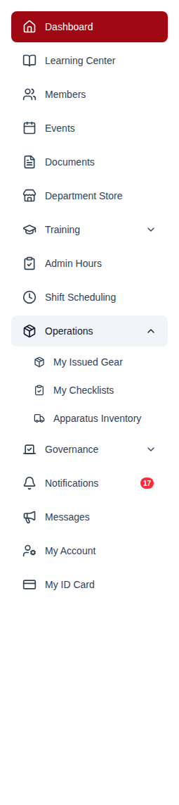

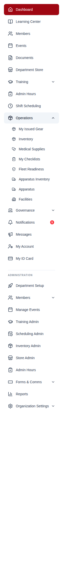

> **Tell your crews about the notifications.** End-of-shift reminder
> notifications **already sitting in members' bells** carry the old address and
> will land on the dashboard. New ones point at the right place, and these age
> out within a few days. It is worth one message.

### Scheduling administration is in the Administration section

Everything an officer administers about the schedule is now at
`/scheduling/admin`, beside Training Admin and Inventory Admin. It used to be
reachable only from a strip of "Officer tools" on the member-facing scheduling
page — so an administrator opened the schedule to find the settings, and the
Administration section, where the rest of the product puts this, had no
scheduling entry at all. That strip is gone.

| What you used to open        | Where it is now                                                  |
| ---------------------------- | ---------------------------------------------------------------- |
| `/scheduling/settings`       | `/scheduling/admin/settings/general` (and five sibling sections) |
| `/scheduling/templates`      | `/scheduling/admin/planning/templates`                           |
| `/scheduling/patterns`       | `/scheduling/admin/planning/patterns`                            |
| `/scheduling/reports`        | `/scheduling/admin/reports`                                      |
| `/scheduling/platoons`       | `/scheduling/admin/platoons`                                     |
| `/scheduling/qualifications` | `/scheduling/admin/positions`                                    |

`/scheduling/admin/settings?tab=…` **does** still work — it forwards to the
section your parameter names, and to General if it names nothing recognisable.

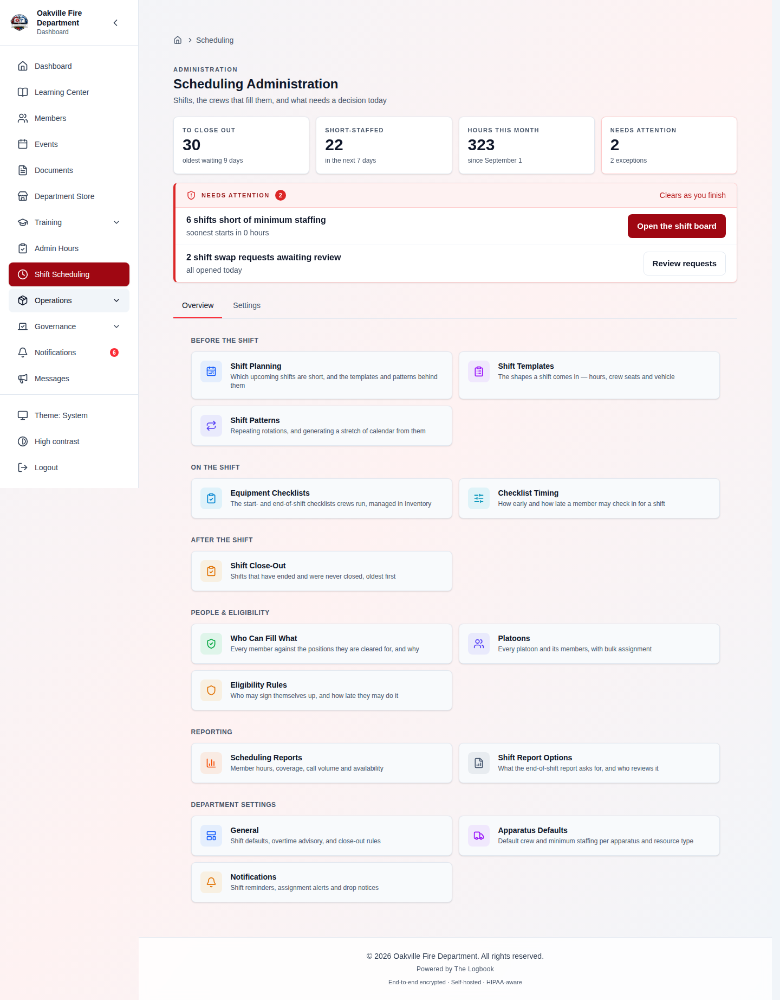

**Each settings section is its own route now**, so it can be linked to,
bookmarked, refreshed into and reached with the back button. This is
deliberately unlike Organization and Events settings, which put the selected
section in `?tab=`. A section inside an administration hub is a destination —
something a hub card, a bookmark or a link from Inventory points at — and a
`?tab=` that only the page's own state reads cannot be linked to.

> **One grant runs the whole area: `scheduling.manage`.** The hub, every page
> behind it, and the navigation rows. **A training officer holding neither
> scheduling grant can no longer open the position roster** at
> `/scheduling/admin/positions`. Nothing in the app has ever linked them there,
> and the API behind it was narrowed to match — a client-side gate is not a
> gate, and a training officer refused by the screen could previously still
> pull the whole roster straight from the API.

### Gear Admin is called Inventory Administration

The area had four different names depending on where you were standing. It is
**Inventory** throughout now, administered from **Inventory Admin**.

Screens that really are about gear keep the quartermaster's vocabulary: My
Issued Gear, Gear Requests, Gear Kits.

**Nothing broke.** This is labels only — no route, permission, module key or
API value changed. The one address that did move is the Department Store
console, now at `/inventory/admin/store`, and `/store/admin` redirects to it.

---

## For administrators: read this before you upgrade

### Six upgrade steps take permissions away

**Nothing these six steps take away is granted back automatically.** (Two
_other_ steps do add grants — see the note below the table; do not read this as
"the upgrade never grants anything".) Most of the removals trace to one root
cause, explained under [Why your members could see
Reports](#why-your-members-could-see-reports) below.

| Grant                                                                                   | Comes off                                                                                                                   | What those members lose                                                                                     |
| --------------------------------------------------------------------------------------- | --------------------------------------------------------------------------------------------------------------------------- | ----------------------------------------------------------------------------------------------------------- |
| `reports.view`                                                                          | Member, Firefighter                                                                                                         | Administration → Reports, and with it the Administration section itself for anyone who had nothing else     |
| `apparatus.view`                                                                        | The rank-and-file, including the membership-standing positions (Probationary, Junior, Life, Administrative, Social, Exempt) | The fleet maintenance and compliance record                                                                 |
| `integrations.view`, `medical_supplies.view`, `mobile.view`, `prospective_members.view` | Member, Firefighter, Engineer, EMT                                                                                          | Those four workspaces                                                                                       |
| `positions.view`, `reports.view`, `settings.view`, and the `apparatus.*` wildcard       | Engineer                                                                                                                    | Engineer keeps `apparatus.view` and `apparatus.maintenance`, which is what a driver/operator is seeded with |

Two steps go the other way and **restore** grants the setup screen could never
express: four grants on EMT positions (seeing the department's own information,
its locations and its meetings, and asking to swap a shift), and the store-order
and equipment-check-submit grants on Member.

> **⚠️ One revocation is unconditional, including where you granted it on
> purpose.** Two earlier attempts tried to tell a deliberate grant apart from
> the setup screen's mistake by looking for other traces the setup screen left
> behind. That test **missed every department that had switched those modules
> off during setup** — leaving the original problem in place for exactly the
> smallest departments, the ones least likely to notice.
>
> Nothing in a stored position row distinguishes the two, and a built-in
> position stays marked built-in after you edit it. Because these grants expose
> other members' aggregated hours, training and roster data, they are now
> removed wherever they are found.
>
> **If your department deliberately gave members Reports, grant it again on the
> positions screen after upgrading.** A position you created yourself is never
> touched.

**Officers, chiefs, administrators and the Engineer rank keep `apparatus.view`.**
A department that wants its members to see the fleet re-adds the grant to its
Member position. The lightweight `/apparatus-basic` page, shown when the
Apparatus module is off, is unaffected and stays open to everyone.

### Check any custom position holding `inventory.*`

Moving equipment checklists into Inventory renamed their three permissions from
`equipment_check.view` / `.manage` / `.submit` to `inventory.check_view` /
`.check_manage` / `.check_submit`. Every position keeps exactly the authority
it had — a migration renames the stored grants.

> **⚠️ But a module wildcard covers everything in its module.** A position
> holding `inventory.*` now also grants the three checklist permissions, so it
> can author and submit equipment checklists.
>
> **No seeded position or rank grants `inventory.*`**, so this only reaches
> positions your department built for itself — typically a quartermaster. The
> behaviour is deliberate: a checklist is a list of inventory items. If it is
> wider than you intend, replace `inventory.*` on that position with the
> specific `inventory.` grants you want.

### If you use Gmail or Microsoft 365 for email, it has never worked

The settings form saved the credentials under keys the sender never read, so
the sender resolved **no mail host at all** and every message for your
department failed with "SMTP host and from_email are required" — after a green
"Email settings saved" toast, and _in preference to_ a working server-wide SMTP
configuration, because the organization's own section wins whenever it is
enabled.

Both platforms are ordinary SMTP submission behind an app password, so the
host, port, encryption and login are now fixed by a preset that **both** the
sender and the connection test resolve from.

**What to do:** re-open Settings → Email, confirm the From address and app
password, and use the new **Test Connection** button, which signs in to the
provider without saving.

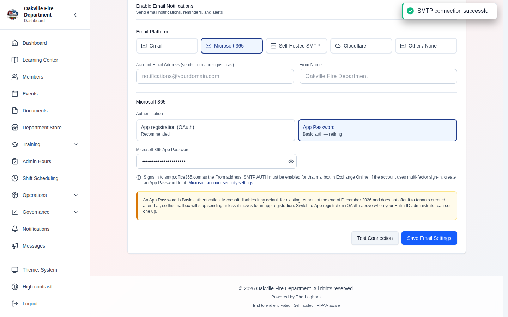

**The Gmail and Microsoft OAuth Client ID / Client Secret fields are gone**, and
the upgrade deletes what was stored in them. They never did anything — no
refresh token was ever obtained and no send path existed — and the onboarding
test reported them "valid" on string format alone. This step does not reverse,
which costs nothing, because nothing read those values.

**Microsoft 365 has a deadline.** Exchange Online is retiring Basic
authentication for SMTP submission: unchanged through December 2026, disabled
by default for existing tenants at the end of it, unavailable to tenants
created after, and removed in the second half of 2027. An App Password _is_
Basic auth. Settings → Email now offers **App registration (OAuth)** alongside
it, collecting the directory (tenant) ID, application (client) ID and client
secret. The app registration needs the `SMTP.SendAsApp` application permission
and `SendAs` on the sending mailbox — and a token Exchange Online refuses is
reported as the mailbox grant rather than as bad credentials, because those are
fixed in different places.

**Nothing changes for a working App Password configuration** until you choose to
move. Selecting Microsoft 365 afresh preselects OAuth; an existing App Password
configuration keeps the method it is working with.

### Three repairs that had silently never run

Four migrations named a table `positions` at a point in the chain where it was
still called `roles`. When that made a fresh install fail, an existence guard
was added — which turned the crash into a silent no-op. The table was renamed
six days later and the guards were never revisited.

The result, on **every department that upgraded**:

- The **Membership Committee Chair** position was never renamed to **Membership
  Coordinator**.
- Role-targeted department messages were never converted from position names to
  ids.
- The default **Member** position never received the equipment-check submit
  grant — **so those members lost the checklist on upgrade.**

A new migration performs all three at the current head. It is careful in ways
the original was not: it skips a department that already has a Membership
Coordinator, leaves alone a position the department created for itself, and
converts message targeting **before** renaming — otherwise a message addressed
to "Membership Committee Chair" would resolve to nothing and stay
undeliverable. A message targeting a name two positions share is left as-is,
because replacing it with one position's id would silently drop the other's
members from the audience.

---

## Why your members could see Reports

Worth understanding, because it explains most of this window's permission steps
and it will explain the next one too.

The old onboarding position editor did not read the permission registry. It
derived its two-checkbox-per-module defaults from a rule of thumb — _"a member
views every module whose category is not System"_ — and **its first Continue
saved that over the seeded rows.**

A member's effective permissions are the union of their positions' stored
lists, so the rule of thumb's answer became live grants on every department
that onboarded under that code. Reports is its own module category, so the rule
ticked it, and every member got department-wide reporting — which aggregates
across the whole department rather than scoping to the holder. Holding it also
opened the Administration section itself, so the whole admin area appeared for
anyone affected.

**Four migrations chased this before one worked.** The first three repaired only
a row that matched the rule's output _exactly_, and other migrations edit those
same rows first — so a department that onboarded early was a permission or two
off, its row was skipped, and every discrepancy survived. The working one
removes and restores **one permission at a time**.

**New departments no longer create the problem.** Setting up a position now
starts from the registry on both paths, and EMT — which the wizard offered to
every agency type with nothing seeded behind it — is registered properly
alongside Firefighter and Engineer.

---

## For officers: what is new to work with

### Shift planning is one screen

`/scheduling/admin/planning` lists **every upcoming shift carrying fewer people
than it asks for**, over a date range, with the assignment control on the row.

Filling ten gaps used to be ten trips through the month grid, into the day,
into the shift drawer and back out. It is ten selections now.

The assignment goes through the drawer's own call, so it surfaces the same EVOC
and overtime advisories and opens the same driver-exception dialog — a refusal
with no route forward is where a safety control turns into a workaround.

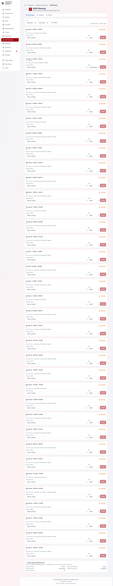

**Templates and patterns are sections of this screen**, not screens beside it —
the reason to open a template is a shift that keeps coming up short, and that
is one tab away. Each section is still its own route, so it can be linked to
and bookmarked.

> **One thing to know about the numbers.** The gaps list is built from the same
> rules the shift board uses, so this screen cannot answer differently about a
> shift than the calendar does. One consequence: a shift naming **neither
> positions nor a minimum crew size** has never said how big its crew is, reads
> as "crew size not set" on the board, and is **not listed here** — while the
> hub's Short-staffed metric does count it. The hub number can therefore exceed
> the rows on this screen for a department that states no crew size anywhere.
> Each side is right about the question it is answering; the fix is to state a
> crew size.

### Name your own call types

The nine call types on the shift close-out screen have been per-department data
since call tracking shipped — stored in your organization's settings and
writable through the API — but **nothing in the UI could reach them.** A
department that does not run EMS, or one that calls them "Alarm Activation"
rather than "Alarm / Good Intent", had no way to say so.

**Administration → Scheduling Admin → General → Call types** renames, reorders,
adds, retires and deletes them.

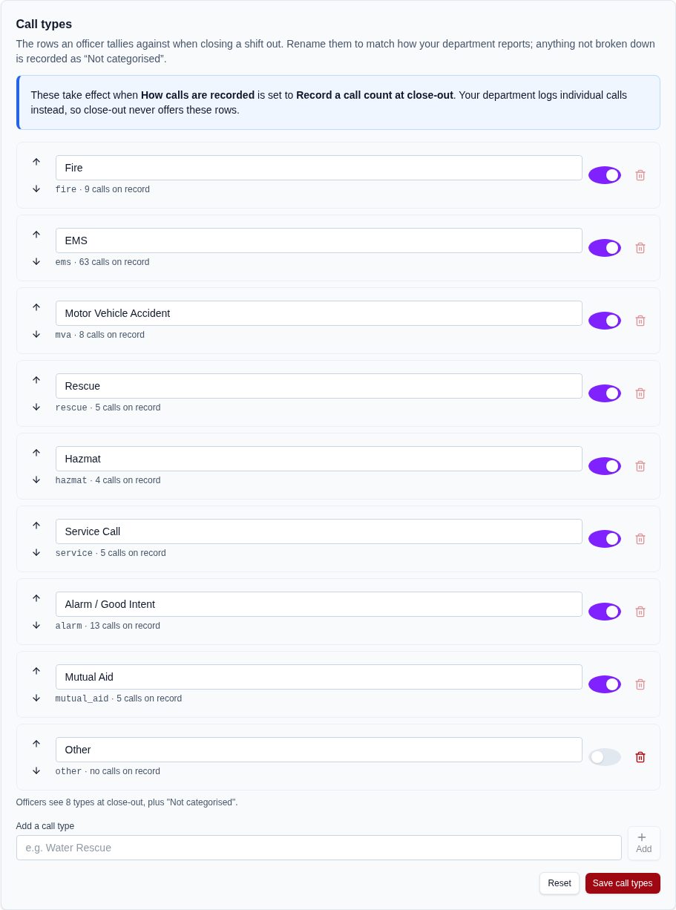

**Retire, don't delete, anything with history behind it.** The stored value on
every call ever filed is the type's permanent slug, so deleting a type in use
would leave that history pointing at something nothing can label. A type with
calls or a filed shift report behind it can only be turned off — which takes it
off the close-out screen and leaves every report that names it intact. Delete
stays available for a type nothing refers to.

**Retiring every type** is how you ask close-out for a bare total with no
breakdown.

Reports, the CSV export, the shift-report badges, the printable report and the
end-of-shift summary email all now use your names — retired types included, so
a report covering last year still reads properly. **A report written under
per-incident tracking keeps the officer's own wording** and is never rewritten
to match a type whose slug happens to look the same.

> **If your department ever named a type "unclassified", the upgrade repairs
> it.** That slug is the synthetic bucket a call with _no_ type falls into, so a
> configured type sharing it was indistinguishable from the remainder: the
> call-volume report merged your calls with the untyped ones and labelled the
> total "Not categorised" — a figure that reconciles to neither quantity — while
> the type's own name vanished from every screen. A migration renames the slug,
> deriving the new one from your own label, and moves the calls and filed
> reports that point at it.

### The Compliance Matrix is a queue you can work

The member × requirement icon grid is gone. Every cell said only "met" or "not
met", so a coordinator could see who was short without seeing **by how much**,
and the screen offered nowhere to go next.

Members — or requirements, on the other axis — are now grouped by standing,
ordered worst-first, and stepped through one at a time, with the numbers behind
each status on the row: _"6 of 24 hours"_, _"Lapsed 41 days ago"_, _"Expires in
26 days"_.

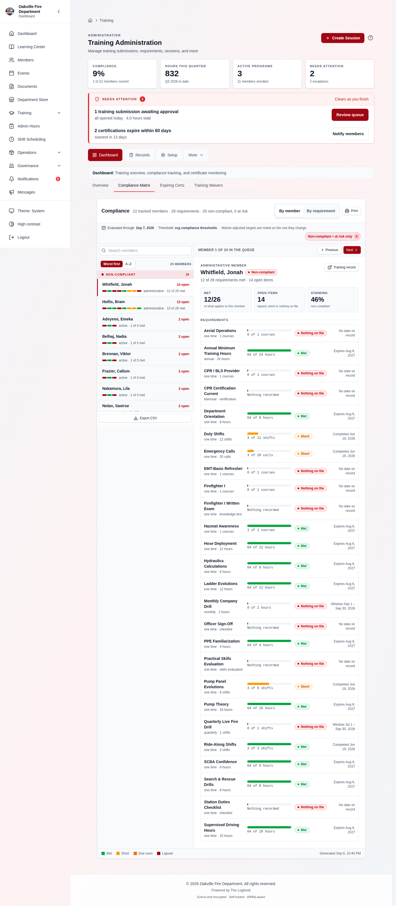

> **⚠️ Your compliance percentages may move, in the favourable direction.** Two
> grading defects were fixed:
>
> - **A member exempt from a requirement could never reach 100%.** The
>   percentage divided by every active requirement while counting only the ones
>   that applied to that member, so anyone whose membership type excused them
>   from one was capped below full compliance no matter what they did.
> - **A certification expiring soon read as a failure.** A member holding a card
>   valid for another 26 days rendered under "Compliant" reading _"1 of 2 met ·
>   1 open item"_ — a contradiction on the face of the screen. A cert valid
>   today is met today; the orange "Due soon" pill still marks the row.

The dashboard's non-compliant link now lands filtered. It has been passing
`?status=noncompliant` all along and the grid ignored it, dropping the
coordinator into the full unfiltered roster.

**Notify and Assign are gone.** They had no endpoint behind them, and a control
wired to nothing invites somebody to believe a message was sent.

### Gear requests browse instead of guessing

The request form was a search box over an empty state, so a member who did not
know what the department calls a thing had nowhere to start.

- **It browses now.** The department's gear loads the moment the form opens,
  with the real category names as filters. Search matches category and
  product-group names as well as the item's own — typing "shirt" now finds a
  garment the catalog files as "Long Sleeve".
- **One row per product, not one per stocked size.** A shirt kept in seven
  sizes and two colours was fourteen near-identical lines to scroll; it is one
  line, with the sizes as their own step after the product is chosen.
- **The size step starts from the sizes you have on file** for that member,
  matched through the same alias table the impact planner uses — so "Large" on
  their record selects the row you stored as "L".

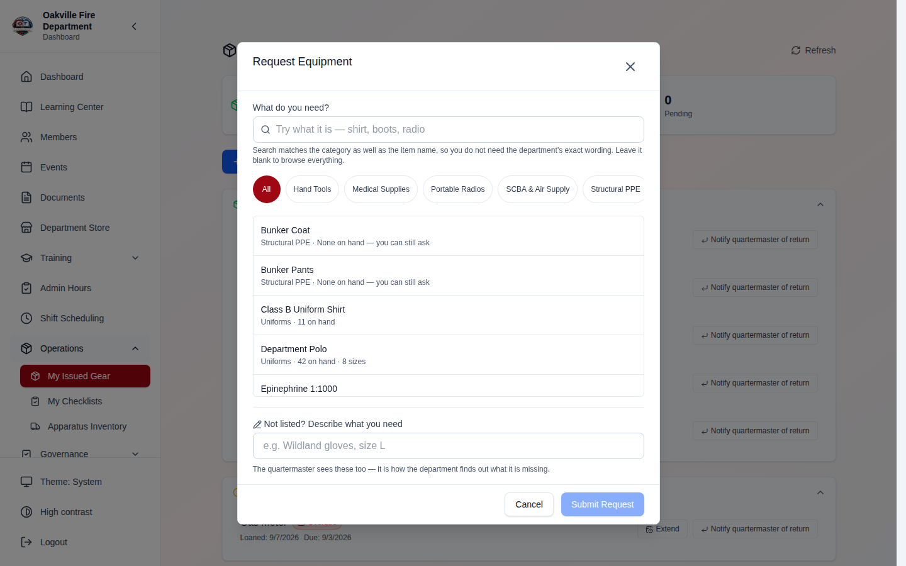

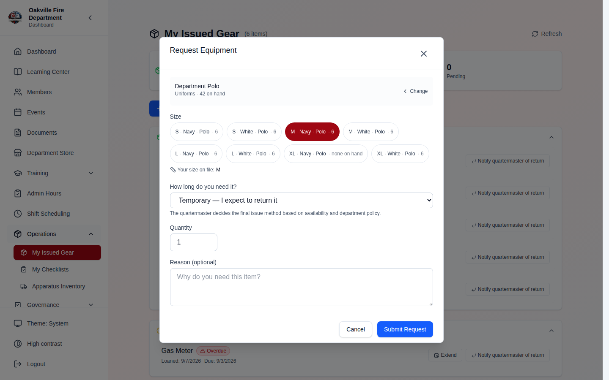

**A member can now ask for gear that is out of stock, or not carried at all.**
The form was pinned to items marked available, so the one need a quartermaster
has no other way to learn about — a size or an item the department does not
hold — could not be recorded. Out-of-stock sizes stay selectable and are
labelled as such, a member's own size is offered even when nothing is stocked
in it, and a free-text line covers gear that is not in the catalog. The request
carries the size asked for as its own field, so a request with no matching
catalog row still tells you exactly what was wanted, and the review screen says
so explicitly.

**Restricted gear is filtered by the server now.** The old form listed
rank- and position-restricted items, disclosed their existence to everyone, and
let the member submit a request the API then refused.

### Shift Details is a modal

The Shift Details surface was a right-edge drawer — pinned full-height, capped
at 32rem above phone width. It is now a **centred dialog**: 56rem on a laptop, a
1rem-inset box on a phone, scrolling within itself.

The wider desktop box gives the crew board and the close-out checklist's
per-member hours inputs room they did not have at 512px.

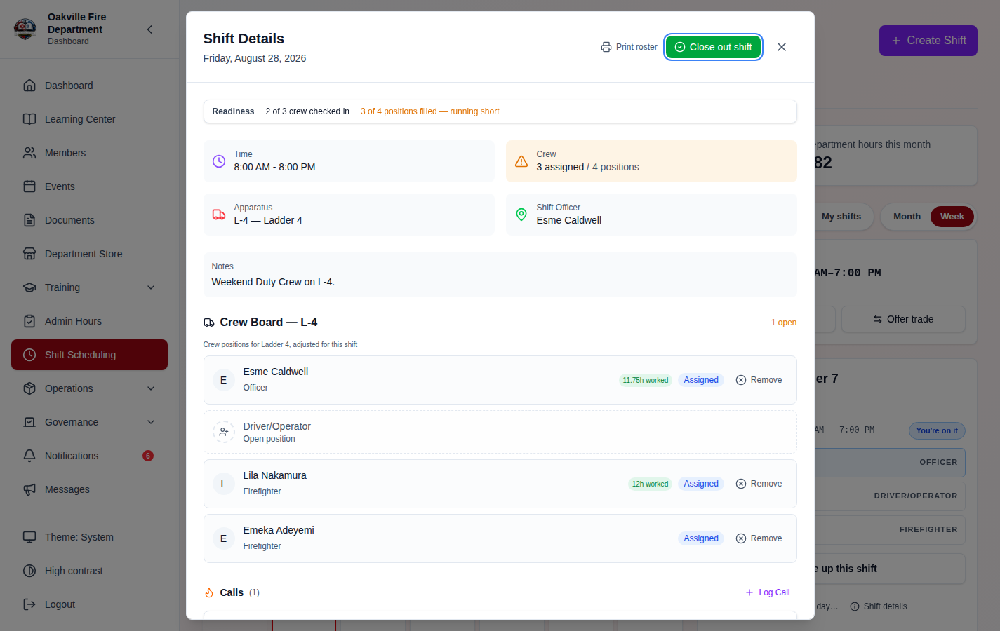

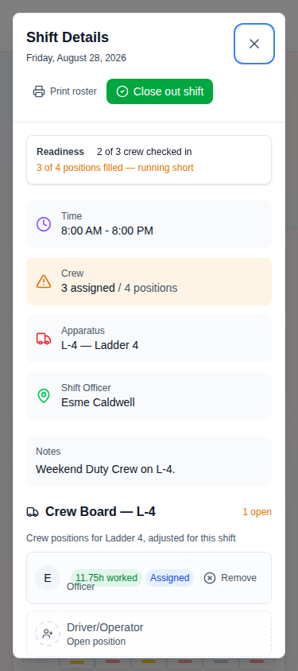

Escape inside the driver-blocked dialog no longer closes the shift behind it.
Shift Details hand-rolled Escape on a listener that could not see the dialog
stack, so one key dismissed both.

---

## For members: what is new

### Equipment checks moved — see [Where everything moved](#where-everything-moved)

Operations → **My Checklists**. From a shift itself, nothing changes.

### Quick Add: two taps from anywhere on a phone

The centre of the phone bottom bar is an **Add** button. It opens a short list
of the things a member actually logs: training hours, a rig check, an action
item, a shift report, clocking in, checking into a shift, scanning a member ID
— and for officers, requesting equipment, creating an event or adding a member.

Before this, every one of them was reached the same way: tap More, wait for the
drawer, find the module, find the page, find its button. **Four taps and two
page loads before the first field.**

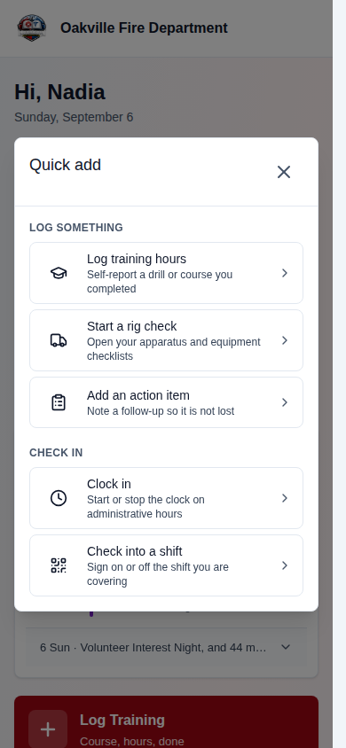

**Quick Add adds no forms of its own.** Each row goes to the screen that already
owns that entry, so there is no second path for the same data to drift down and
nothing that can fall behind a form's own validation rules. Rows appear only
where the page behind them would actually open.

**The bar keeps five items, and the configurable slots go from three to two.**
Six items on a 390px phone is 65px each and puts the action at an edge rather
than under the thumb. A bar layout saved before this keeps its first two
destinations and is left intact — the third is still one tap away under More.

### See what you have worked this year

**My Shifts has a third view: Hours.** It opens on last month, this month and
the year to date, then lists every month of the selected year with the shifts
worked, hours credited and calls responded to.

Until now a member could see the hours on each past shift but had no total for
a month or a year, so _"how many hours do I have this year?"_ was a question
only an officer with the department-wide report could answer.

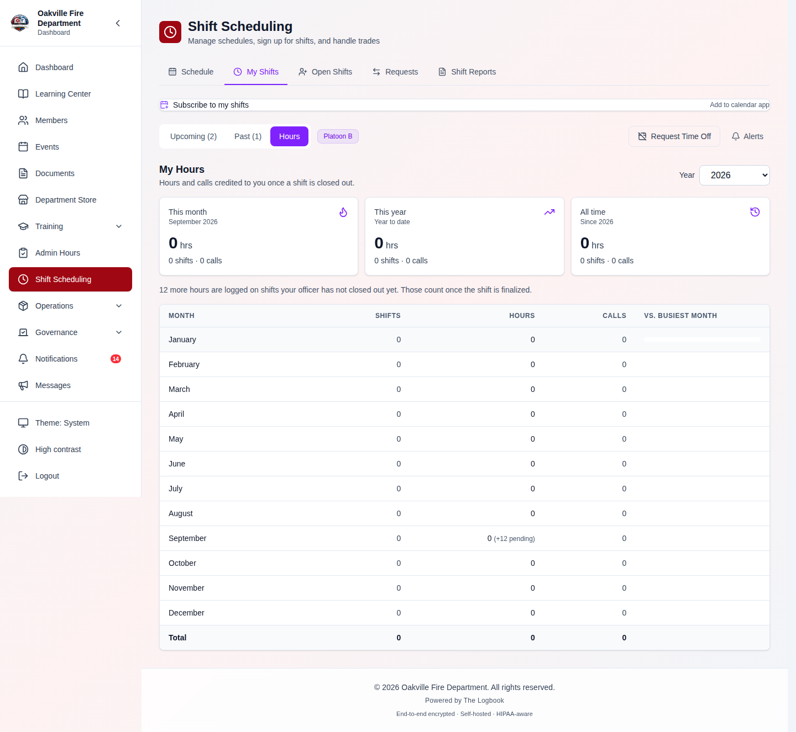

Three things worth knowing about the numbers:

- **Credited and pending hours are reported separately.** Hours count once an
  officer finalizes the shift — the same rule the department's report applies,
  so your number and your officer's number agree. Time on a shift still
  awaiting close-out is its own line rather than folded into the total, so a
  figure never drops without explanation.
- **The previous month is reported whatever year you are viewing**, because
  every January the month that just ended is in the previous year.
- **The calls column disappears entirely** for a department whose call tracking
  is off, rather than showing a column of zeros that reads as a broken counter.

The three cards now read **this month, this year and all time**. "Last month"
answered a narrower question than the table beneath it already answered month
by month, while the one figure the table could never show — what you have done
over your whole time with the department — was not reported anywhere.

### Events: who's going, RSVP, and where you stand

- **The going list is visible to members** — names and going status only, never
  contact details, RSVP notes, dietary restrictions, accessibility needs, guest
  counts or check-in times. **The default is managers-only**, so an
  administrator has to opt in before members see it.
- **You can respond to an event that does not require a response.** The API
  used to refuse outright, which left members with nothing to do on the
  majority of events.
- **Waitlist standing** — the detail page says _"You're #2 of 5 on the
  waitlist"_, ordered by the same column the server actually promotes on.
- **Inline RSVP from the dashboard**, matching the sign-up open shifts already
  offered there.

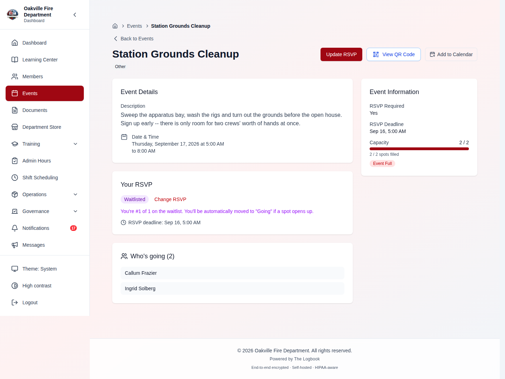

> **⚠️ For administrators: guests occupy seats now.** `allow_guests` had been on
> the model since the beginning and was read nowhere, so guests were accepted
> on events that forbade them — and capacity counted going _rows_, leaving
> guests out entirely, so a capped event could be oversubscribed by however
> many guests attendees brought. **A capped event will fill sooner than it used
> to.** Events already over the seat count are left alone rather than
> retroactively waitlisted; they simply admit nobody new.

### Choose what colleagues see

Your profile now carries per-field visibility for email, personal email, phone,
mobile and address. Until now the only control was an organisation-wide setting
that decided for every member at once, and the home address and personal email
were hidden from other members unconditionally.

A member who has never chosen keeps exactly the behaviour they had.

### The member roster is a directory again

`/members` carries no permission gate — it is the department directory, open to
everyone — but it was rendering the membership coordinator's working screen to
everyone too: a username under each name, a hire date column, a per-row Actions
column, bulk-selection checkboxes with Print Badges and Export Selected, a CSV
export of the whole roster, and the title _"Membership Management — Manage
department members and records"_.

A firefighter looking up who is on B platoon was reading a personnel management
table. It is titled **Member Directory** for them now.

**Clicking a member's row opens their profile.** The only way in used to be the
pencil in the Actions column, which is gone for most of the department. The
member's name is a real link rather than the row being a tab stop, so a screen
reader gets one target per row instead of twenty-five, and the name can be
middle-clicked or opened in a new tab.

For a coordinator, nothing has changed.

> **This is a change to what the page shows, not what the server sends.** The
> member list endpoint still returns usernames and hire dates to anyone with
> `members.view`, so this declutters the screen — it is not a confidentiality
> boundary.

### My Issued Gear is one list

"Permanent Assignments" and "Issued Items" are now one **Issued to Me** section,
sorted by when the gear was received.

The split was the stockroom's, not the member's: an assignment is one serialized
unit, an issuance is several units drawn from bulk stock, and a member holds
both open-endedly with nothing to do differently about either. Each row still
shows what its record type actually carries — serial, asset tag and condition
for an assignment; quantity and size for an issuance.

**Active Temporary Loans stays its own section**, because a due date is the one
distinction a member has to act on, and folding it in would have buried the
overdue badge.

The dashboard's gear widget now agrees with this page. The two used to disagree
— **7 on the dashboard rail, 4 on the page, for one locker** — because the
widget counted a pool issuance once per _unit_ while the page counted it once
per _row_.

### Your Send Log is yours

The notification Send Log listed every notification the department had sent
anyone — subject, body and recipient address — to anyone who could open it. It
now shows **your own delivery history**, email as well as in-app, with
delivered/failed status, and it is offered to every member because it is their
own data on the same footing as their inbox.

The organization-wide view survives for auditing deliverability and now requires
`notifications.manage`.

---

## Fixes members and officers will notice

### Dates read one day early west of UTC

A hire date of 2020-12-06 printed **"12/5/2020"** in New York, "12/6/2020" in
Berlin, and shifted again for anyone whose browser was set somewhere else.

The column has no time and no timezone — it is a square on a calendar, the same
square for everyone — but it was being parsed as UTC midnight and then rendered
in the viewer's zone, which rolls it backwards for any negative offset. **Every
date-only field in the app was affected**: hire dates, certification expiries,
due dates, leave dates.

Two consequences worse than the wrong number:

- **The same shift named the wrong weekday.** A date-only value formatted with a
  weekday came back as "Monday, Sep 14" for a date that is a Tuesday the 15th.
- **"Days remaining" counts were one short** — a certification expiring on the
  15th reported thirteen days out on the 1st rather than fourteen. That is the
  direction that makes a renewal look _less_ urgent than it is.

### A past shift still offered its live controls

**"Reopen for 15 min" was offered on a shift three weeks gone, and it worked.**
Taking it was not cosmetic: a member could sign themselves onto a shift they had
never worked and draw hours for it. Reproduced at ninety days.

Confirm, decline and remove outlived the shift too — a member looking at a shift
they had worked a fortnight earlier, with twelve hours already recorded against
it, was still offered a button to decline the assignment those hours hang off.
So did Withdraw, sitting directly beneath the line reporting those hours.

**The lock is now enforced, not just displayed.** Hiding a control is not
enforcing a rule: all of these were still reachable by a direct request.
`scheduling.manage` remains exempt — correcting a months-old roster is records
work, and that is where a change to a shift this old belongs.

**A shift with no end time was exempt from the lock entirely.** It is now
treated as running for twelve hours after it starts — twelve because that is
already the cushion check-in allows a shift with no recorded end, so the two
rules agree on how long "still out" can plausibly last. The cushion follows your
department's `checkin_closes_hours_after`, floored at twelve: a department that
widened check-in to seventy-two hours was getting a roster that locked sixty
hours before check-in did.

### The event check-in QR code was scannable before its window opened

Outside the check-in window the QR page rendered the **real code at 40%
opacity** so the page would be "ready" when the window opened. A phone camera
reads a code straight through that, so members scanned early, hit a check-in
that refuses them, and had nothing on the page explaining why.

The code is now withheld entirely until check-in is actually open, with a
same-size placeholder holding the space.

### Saving a change and seeing the old value come back

A response already in flight when an edit landed settled afterwards and wrote
the **pre-edit body** straight back into the cache it had just been cleared
from, where it was served as fresh for the next 30 seconds. An explicit refresh
in that window returned data older than the edit.

### The dashboard

- **Administrative hours read "Unavailable" to every ordinary member.**
  "Unavailable" is a claim the figure is unknown; the figure was simply never
  fetched — on a row sitting beside a control that navigates to a page the
  member can in fact open. A member who has logged no administrative time this
  month now reads `0`.
- **An officer's "My Hours" card totalled the whole department.**
- **Everything logged today fell outside the month**, and the month started at
  UTC midnight rather than the department's — pulling the tail of the previous
  month in for any department west of UTC.
- **The seven-day list is now thirty days**, titled **Next 30 Days**, and its
  control reads **All Shifts** and opens the month view. It used to read "Full
  Schedule" and open a page that holds shifts only — so a member who saw
  Thursday's drill on the card and followed a promise of the _full_ schedule
  arrived somewhere it could not be.
- **Drills stopped being crowded off the list.** The card's requests were capped
  at five records each and the cap applied _before_ the window filter, so five
  socials spread across the next six months were enough to hide every drill in
  the coming month — on a card whose own subtitle promises drills.

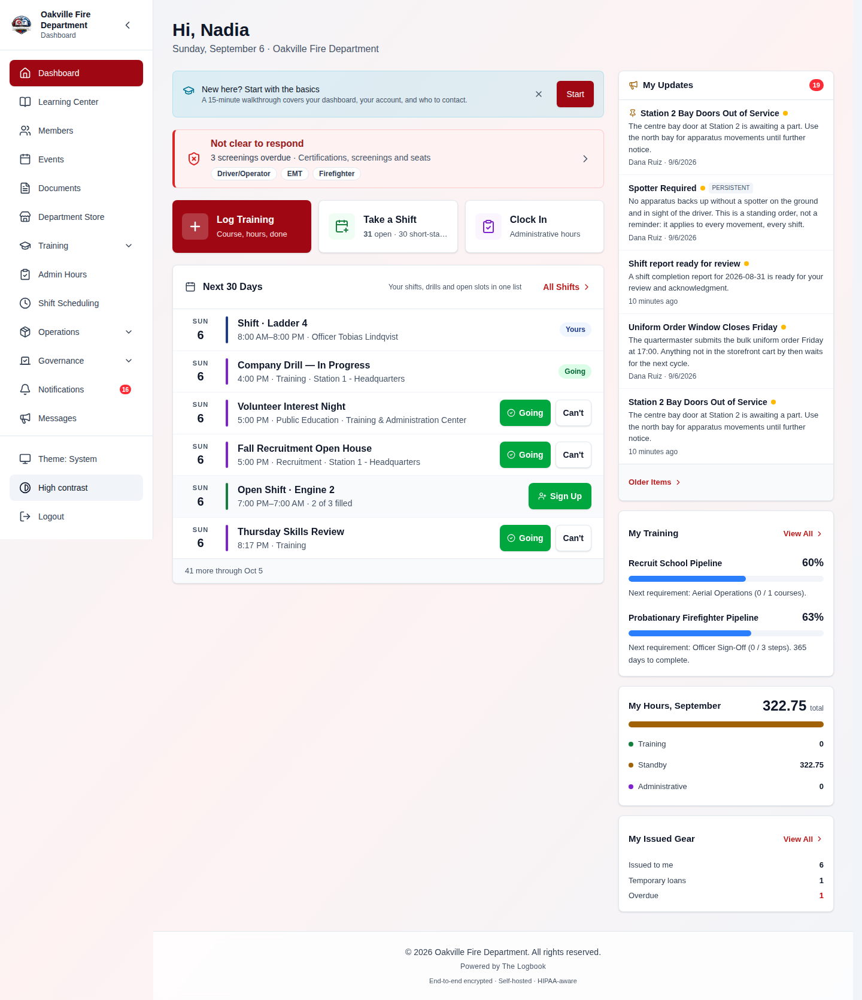

### A crew seat read as "EMS" on the schedule and "EMT" everywhere else

The seat's stored token and its name on screen are two different things: the
token is lowercase and canonical because it is what the signup API grants
against, and the label is what a firefighter reads. The board, the phone day
sheet, My Shifts, the shift report crew list and both template summaries printed
the **token**, so the same seat had two names depending on which screen you were
standing on — and "EMS" reads as a different seat rather than the same one
spelled another way.

It reached printed rosters, shift-reminder emails and assignment notifications
too. A seat your department defined itself now resolves to its
administrator-chosen label on the board and the roster, rather than showing as
its slug.

### Table headings sat 170px away from their own figures

108 table headers across 37 files ignored the alignment they were written with.
Worst affected were the scheduling reports (19 headers), the compliance officer
dashboard (13), and the finance, grants and inventory tables.

The markup was correct and only the browser's cascade disagreed — nothing
failed, and no test could catch it.

### Settings screens on a phone

- The section row across the top of every settings screen rendered its pills at
  **36px tall**, under the 44px a finger reliably hits. They grow to 44px on
  phones now.
- On a screen with enough sections to overflow a phone — Organization Settings
  has six — **the last pill sat off the right edge with no way to reach it.**
  The row scrolled sideways, but nothing told the browser it was a scroll
  region, so a keyboard could not reach it and the overflow read as a layout
  fault.
- Organization Settings' "Upload logo" button was a 20px-tall text link.

### Five screens told members to do things they could not do

Documents, the Members roster, Events, Training Programs and the Course Library
each rendered an empty-state instruction — _"Get started by adding your first
member"_, _"Start building your document library by uploading SOPs"_ — with the
buttons beside them **already officer-only**, and in three cases a link to the
access-denied page.

They are shown only to somebody who can act on them now. **An empty result that
follows from a search or a filter is still reported to everyone**, because that
is feedback on what they asked for.

Three dialogs — upload, new folder and delete — also **outlived the permission
that opened them**, leaving their actions on screen after the grant went away.

### Sign-in and offline

- **A wrong or expired MFA code was treated as an expired session**: the app
  purged local data and hard-redirected to the login screen instead of saying
  "invalid code, try again".
- **Loading your profile after an offline or interrupted connection could
  silently discard unsynced shift-report drafts and equipment-check
  submissions.** Only a confirmed sign-out clears local data now.

### Scheduled work that was quietly failing

- **Reminders for overdue meeting-minutes action items were failing every single
  time**, with no error visible anywhere.
- **A scheduled department message could vanish forever** if a different message
  in the same batch failed to process first.
- **A shift with no currently-active assigned members was permanently marked as
  "reminded"** even though nobody was notified, so a member added or reactivated
  later in the same window never received the pre-shift reminder.
- Extending recurring event series could, on one series' failure, discard other
  series' already-generated occurrences from the same run.
- **"Unlink" on a meeting's linked event never unlinked it** — it said _Event
  unlinked_ and the link came back on the next page load.

### A public form could take two submissions from a member limited to one

A form limited to **one submission per person** could still take two from the
same member, if both arrived at the same instant — a double-tap on Submit, or the
form open in two tabs. The check for an earlier submission was reading a snapshot
of the database from before it ran, so each of the two saw an empty history.

**Teach it this way:** the enforcement now does what it says. Submissions already
recorded are untouched, so a form you suspect this happened on still has the
duplicates in its responses list, and they are removed there like any other
response.

**Do not teach this as a setting your audience can go and change.** Two
limits, both of which will otherwise generate support questions:

- **The form builder has no control for it.** The limit is stored on the form and
  enforced by the server, but no screen writes it and new forms default to
  allowing multiple submissions — so today it can only be set by a caller using
  the API directly. If somebody asks where the checkbox is, the answer is that
  there isn't one yet.
- **It covers the public link only.** A form filled in from inside the
  application by a signed-in member has never enforced a per-person limit —
  long-standing behaviour, not something this fix changed.

Both are recorded in `docs/KNOWN_LIMITATIONS.md`.

---

## New: the Claude (MCP) integration

`/api/mcp` is a Model Context Protocol endpoint served by the existing backend
process, so Claude Code, the Messages API connector and (through a local bridge)
Claude Desktop can ask questions of a department's Logbook.

**It is off on every installation until an administrator connects it, and it
answers nothing until an IT administrator issues a service key.**

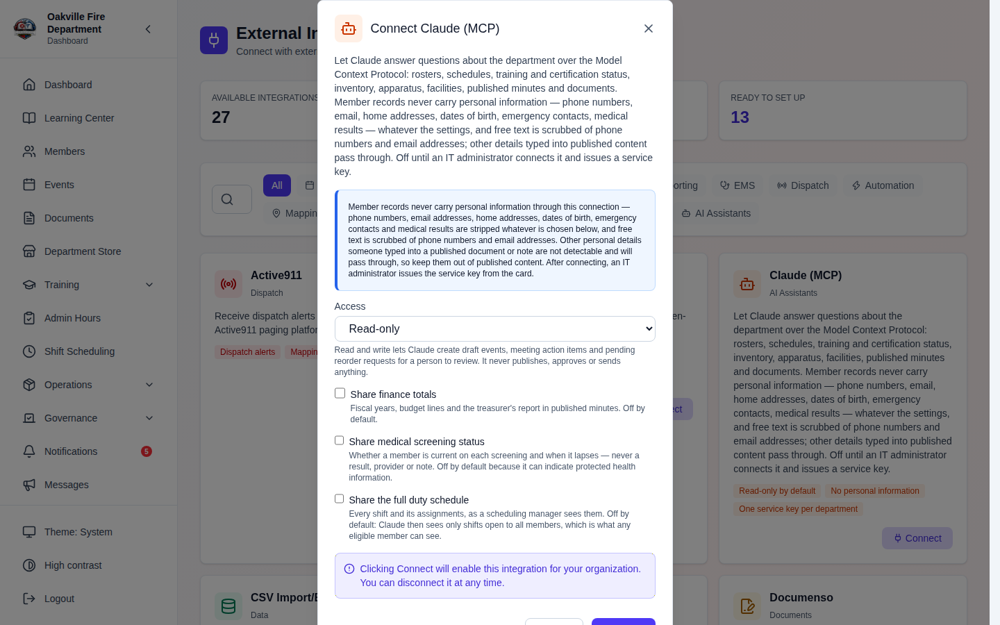

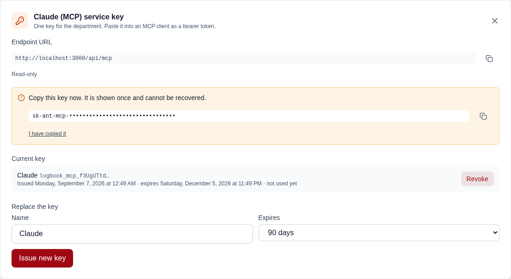

What it can reach: 51 read tools over the roster, events, shifts, training and
certifications, inventory, apparatus, facilities, meetings and published
minutes, documents in unrestricted folders, and elections.

**Three things sit behind their own switches, all off by default:** finance
totals, medical-screening _status_, and the full duty schedule. Without the
schedule switch the shift tools list only shifts open to all members — what any
eligible member can already see. Three write tools (draft an event, add a
meeting action item, raise a reorder request) sit behind a read/write switch,
also off. **Tools a department has not switched on are not even listed to the
client.**

**Personal information never leaves.** One redaction boundary is applied to
every tool result: phone, mobile, work and personal email, home address, date of
birth, emergency contacts, photo, membership and certification numbers, login
names, medical results, credentials and tokens are stripped at every depth — and
every string value is scrubbed of email addresses and phone numbers so free text
cannot carry them out either.

The service key is stored as a digest only and shown in the UI exactly once.
Issuing and revoking it require the new `integrations.mcp_keys` permission,
which only the IT Manager position holds by default, and every tool call, issue
and revocation is audit-logged.

> **Known limitation:** claude.ai custom connectors authenticate with OAuth 2.1
> and The Logbook is an OAuth client, not an authorization server, so those
> clients need a local bridge for now.

Full setup instructions: the `Integration-Claude-MCP` wiki page.

---

## Not yet available — do not teach these

Two features exist in the codebase and are **not reachable by a crew**. Both are
easy to demonstrate accidentally from the wrong screen.

- **The new crew "Sweep" experience for equipment checks** — walking a check one
  stop at a time, with a map of the truck across the top, a single claim per
  stop, and the check finishing on the exceptions rather than on 130 lines to
  scroll. It shipped this window **behind a prop, and is not switched on for
  crews.** It is visible only in the template builder's preview, so departments
  can see it against their own templates first. **Do not narrate it as the
  current member experience.**
- **The equipment-check lap** — built, tested, and still not wired. The live
  check screen renders the previous flat compartment list.
- **Direct qualification entry** — a qualification is written only as a side
  effect of a training record against a course whose **Certifies** field is set.
  There is no screen for entering, editing or expiring one on its own.

---

## Upgrade notes for administrators (August 31 – September 6)

**Thirty-four migrations. Head is `d7c1b95e2a40`.** Back up, confirm
`alembic heads` returns exactly one, then `alembic upgrade head`.

**Eleven migrations do not reverse, and none of them destroys data on the way
down.** Unlike the previous window, there is nothing to export first. They are
either dropping a shape that held nothing worth restoring (the four dead
equipment-check settings, the malformed crew seats, the retired email OAuth
keys), data repairs whose reversal would re-break what they fixed, or permission
repairs whose reversal would restore grants that should not be held.

Then, in order:

1. **Re-test your email** if you are on Gmail or Microsoft 365. It has never
   worked. Settings → Email now has a Test Connection button.
2. **Re-grant anything the revocations took** that your department genuinely
   needs — especially `reports.view`, if giving members department-wide
   reporting was a deliberate choice.
3. **Check any custom position holding `inventory.*`.** It now authors and
   submits equipment checklists.
4. **Re-check your compliance percentages.** The Compliance Matrix fixes can
   move them, both in the favourable direction.
5. **Tell your crews where the checklists went** — Operations → My Checklists —
   and that reminders already in their bells point at the old address.
6. **Update any station SOP, pinned tab or saved link** to the fourteen retired
   addresses.
7. **Name your own call types** if the built-in nine do not match how your
   department reports. Retire, don't delete, any type with history.
8. **Decide whether members may see who's going to an event.** It ships
   managers-only.
9. **Leave the Claude (MCP) integration off** unless you want it.
